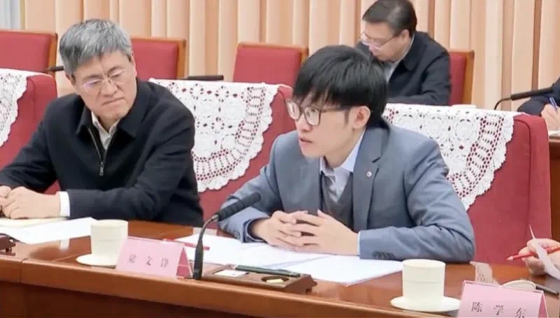
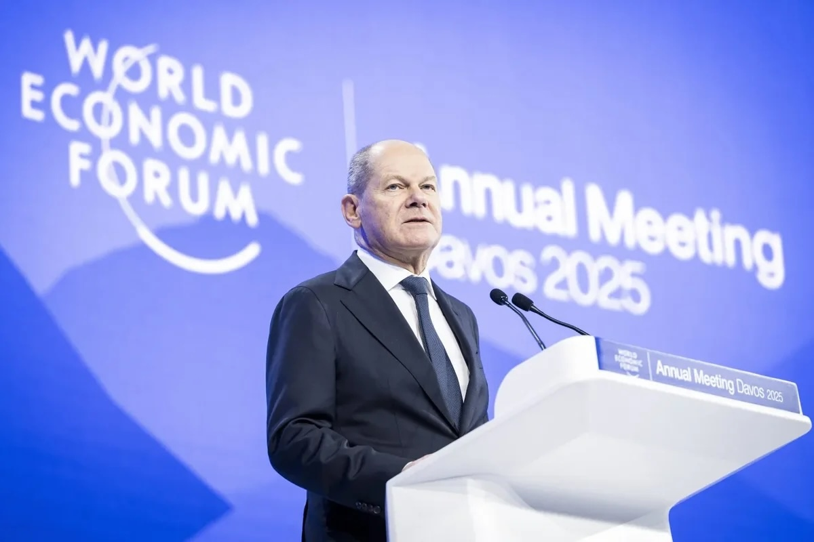
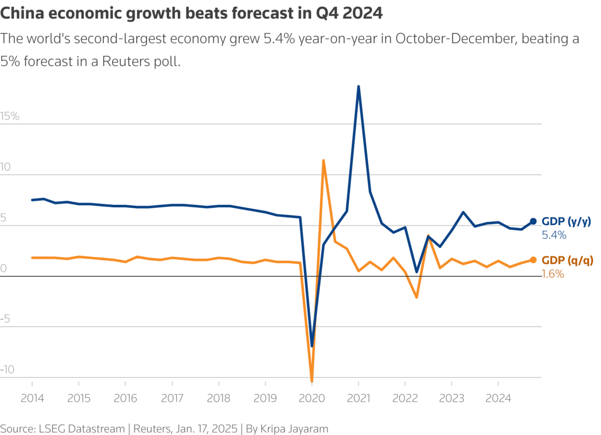
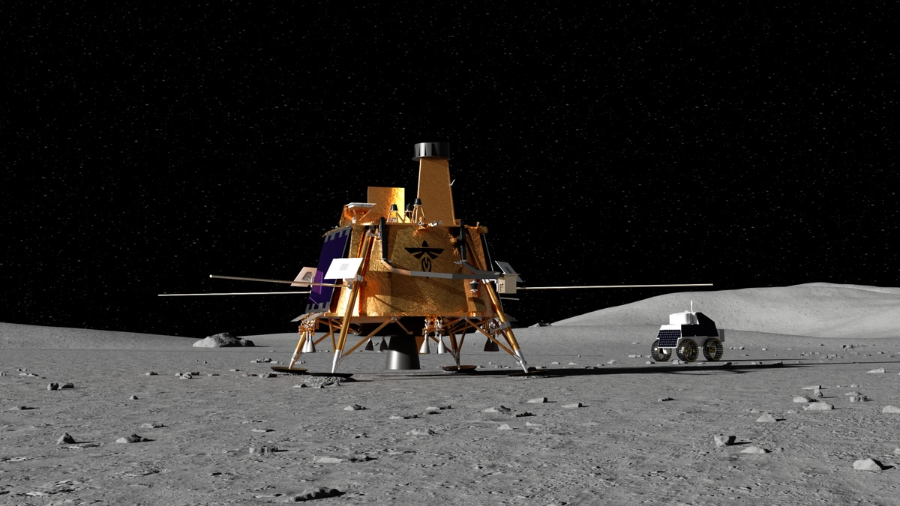

## Tech

**DeepSeek**, a Chinese AI startup initially part of the hedge fund High-Flyer, has released an open-source model, *DeepSeek-R1*, that outperforms leading AI models from Western companies like OpenAI on several benchmarks, despite limited resources. DeepSeek refined their AI using software-driven resource optimization and innovative model architecture rather than relying on extensive hardware. By open-sourcing their model, DeepSeek fosters collaborative innovation crucial for their advancements, potentially challenging current US AI export limitations.

**Rubin Observatory** is a new telescope under construction in Chile, atop a mountain that is 2,682-meters (8,800-feet) tall. The telescope will catalogue billions of new objects and produce a new map of the entire night sky every three days with the largest digital camera ever made. By the end of the survey, this 3.2-gigapixel camera will have catalogued 20 billion galaxies and collected up to 60 petabytes of data—roughly three times the amount currently stored by the US Library of Congress.

**OpenAI** and **SoftBank** have announced a significant AI infrastructure project in the U.S. called **Stargate**, set to cost $100 billion initially, potentially increasing to $500 billion. This venture aims to build extensive data centers and virtual infrastructure to support the next generation of AI advancements, creating around 100,000 jobs immediately. It marks a close collaboration between SoftBank, OpenAI, and other tech giants like Microsoft and Nvidia.

**ByteDance**, the owner of TikTok, is planning to invest over $12 billion in AI infrastructure in 2025. This move comes as ByteDance faces pressure from Washington to sell TikTok's US operations and amidst new US export controls limiting the availability of advanced AI chips to China. ByteDance aims to buy 60% of its domestic AI chips from Chinese suppliers like Huawei and Cambricon. This substantial investment aims to bolster ByteDance's AI capabilities, especially for its chatbot Doubao, amid strong competition from Chinese tech giants like Baidu, Alibaba, and Tencent.

**OpenAI** released **Operator**, an AI agent designed to automate web-based tasks such as booking flights, filling forms, and managing expenses through a browser. Currently in a U.S.-only research preview for ChatGPT Pro users, Operator leverages GPT-4o's vision and reasoning capabilities to interact with apps like Uber and Instacart. While promising efficiency gains, early reviews note its reliance on human oversight for complex tasks. Critics warn of potential job displacement in sectors like customer service and administrative roles.

Google is investing an additional $1 billion in **Anthropic**, an OpenAI competitor known for its **Claude** family of AI models. This increases Google's total investment in Anthropic to $3 billion as part of its strategy to enhance its position in the AI sector and compete with major companies such as Microsoft, Meta, and Amazon. Anthropic, which reached $1 billion in annual revenue in December, is also expected to secure $2 billion from other investors. Founded in 2021 by ex-OpenAI employees, Anthropic distinguishes itself with a focus on AI safety and innovative AI capabilities, such as computer control.

Startup **Stegra** began constructing the world's first industrial-scale green steel plant in Sweden, using hydrogen produced via renewable energy. This initiative aims to cut CO₂ emissions from steel production, which currently surpasses India's total output. The project aligns with EU mandates for carbon-neutral heavy industries by 2030.

**Samsung** launched its latest AI-powered smartphone, the **S25**, in an attempt to challenge Apple's dominance in the US market. Despite a market share of 23% compared to Apple's 53%, Samsung is aiming to leverage its AI advancements to capture more market share. The S25 boasts improved performance with a 40% boost in neural processing, and enhanced integration with third-party apps like WhatsApp and Spotify. Samsung's S25 introduces a shift from traditional touchscreens to an AI voice assistant-driven experience.

**TikTok** resumed U.S. operations following a one-day ban after President Trump signed an order granting a 75-day reprieve. However, ByteDance-owned apps like CapCut and Marvel Snap faced disruptions, prompting competitors like Instagram to launch rival services (e.g., Edits). Legal uncertainty persists, with lawmakers debating forced divestiture or permanent bans. Analysts predict further volatility as Trump's administration weighs national security risks against economic interests.

## Global

At the World Economic Forum in Davos, **German** Chancellor Olaf Scholz emphasized that Russian President Vladimir Putin must not win the war in Ukraine. Global leaders discussed various topics, including financial deregulation under President Trump and cryptocurrency regulation.

The **Trump** administration is discussing imposing a 10% punitive duty on Chinese imports, citing concerns over trade imbalances and fentanyl trafficking. The EU is also scrutinized for its trade surpluses with the U.S.

A Seoul court approved a detention order for President Yoon Suk Yeol over alleged abuse of power and constitutional violations, marking **Korea**'s first sitting president to face criminal investigation. Protests erupted, deepening political turmoil.

**Germany**'s Scholz faces a no-confidence vote ahead of February elections, while **France**'s Macron struggles with a fragmented parliament. The EU's competitiveness plan, led by Mario Draghi, seeks $800B annually to counter U.S. and China.

## Economy & Finance

The **WEF 2025 in Davos** addressed global issues, including Middle Eastern peace progress, efforts to end the Ukraine war, U.S. deregulation under President Trump, the integration of cryptocurrency into mainstream finance, AI's impact on the workforce, and shifts in the energy sector due to U.S. policy changes.

The U.S. has increased its share of global **foreign direct investment** projects to a record 14.3%, driven by strong consumer demand and government incentives under President Trump's administration. In contrast, China and Europe's shares have declined due to geopolitical tensions and rising energy costs.

**China's economy** grew by `5%` last year, matching government targets. However, the growth was uneven, with many citizens reporting worsening living standards as industrial and export gains have not fully translated to consumer benefits.

The return of President Trump has prompted EU ministers to call for urgent economic improvements to enhance competitiveness. Concerns include lagging behind the U.S. and China in key technologies and the need to reduce regulatory burdens and energy costs.

## Science

Towana Looney from Alabama has become the longest-living recipient of a pig organ transplant, thriving with a pig kidney for 61 days. This success marks a significant advancement in **xenotransplantation**, offering hope amid the shortage of human organs for transplant.

Firefly Aerospace's lunar lander, **Blue Ghost**, launched on January 15, has sent back spectacular images of Earth as it journeys to the moon. Carrying NASA experiments, the spacecraft is expected to land on the lunar surface on March 2.

President Donald Trump has suspended $300 billion in federal loans designated for **clean energy projects**, affecting manufacturing and renewable energy initiatives across the U.S. This move has raised concerns within the clean energy sector about the future of such projects.

## Nature & Environment

On his inauguration day, **Trump** announced U.S. withdrawal from the Paris climate accord and WHO, citing sovereignty concerns. Following his announcement to withdraw the U.S. from the Paris Climate Agreement, leaders from the EU, UK, Canada, and China have reiterated their dedication to the accord. Concerns arise over meeting the 1.5°C temperature cap, already breached last year, as the U.S. abolishes measures limiting fossil fuel use.

The EU's Copernicus Climate Change Service confirmed 2024 as the first calendar year where global temperatures surpassed 1.5°C above pre-industrial levels. While not a permanent breach, it signals accelerating climate risks, with extreme weather costs exceeding $229 billion globally.

Temperatures above 40°C (104°F) triggered fire bans in Victoria and NSW. **Australia**'s 2024 was its second-hottest year, with 40% of years since 2000 exceeding historical averages, stressing climate-driven extremes.

Historic wildfires fueled by **Santa Ana** winds (80–100 mph) ravaged drought-stricken LA, displacing 70,000 residents. Scientists linked the fires to prolonged dryness from back-to-back wet winters, highlighting climate-driven disaster patterns.

**Thailand** enforced a plastic import ban to curb environmental and health risks, addressing its role as a dumping ground for Western waste since China's 2018 ban. Critics question enforcement capacity amid rising global plastic trade.

**Brazil** reported 6,068 dengue deaths in 2024, driven by climate-worsened mosquito breeding. The government allocated $50 million for containment, but 2025 cases are projected to rise, stressing global health-climate linkages.

## Entertainment & Culture

Amid concerns over a potential TikTok ban in the U.S., millions of American users migrated to **RedNote**, a Chinese social media app known domestically as Xiaohongshu. This surge saw RedNote's U.S. daily active users skyrocket from fewer than 700,000 to approximately 3.4 million within days. RedNote, originally focused on lifestyle and shopping content, became a platform for cross-cultural exchange. American users shared various content from their daily lives, which sometimes clashed with Chinese cultural norms and created numerous LOL moments. In response to the influx, RedNote recruited American influencers to promote the app, aiming to highlight its user-friendly design and international appeal.

The 2025 **Oscar** nominations, announced on January 23, highlight a significant international presence. Leading with 13 nominations, "Emilia Pérez" has set a record for non-English-language films. Following closely, "The Brutalist" and "Wicked" each received 10 nominations. Sebastian Stan earned a Best Actor nod for portraying Donald Trump in "The Apprentice." The nominations reflect a shift towards global cinema and diverse storytelling in Hollywood.

As of November 20, 2024, China's film sector reported a total box office revenue of 39.54 billion yuan ($5.42 billion), marking a 28% year-on-year decrease. The decline reflects challenges faced by the industry amid changing market dynamics.

## Sports

**Lewis Hamilton** completed his first official laps as a **Ferrari** driver at Fiorano, Italy, on February 19, ahead of pre-season testing. Fans and media dissected his transition from Mercedes, with Ferrari confirming a hybrid livery reveal at their Maranello event.

The FIA announced the 2025 Formula 1 calendar, featuring 24 races starting in Melbourne, Australia (March 14–16) for the first time since 2019. Bahrain and Saudi Arabia were moved to April due to Ramadan, with six Sprint weekends confirmed in China, Miami, Belgium, Austin, Brazil, and Qatar. **Lewis Hamilton**’s Ferrari debut and pre-season testing in Bahrain (Feb 26–28) are major talking points.

Chinese racer **Shi Wei**, also known as `Tie Dou`, has been announced as a Wild Card entry for the 2025 F1 Academy season opener in **Shanghai**. Shi Wei's participation marks the first time a Chinese driver will compete in the F1 Academy, aiming to inspire future generations in motorsport.

**Kylian Mbappé** scored a hat-trick in Real Madrid’s 3–0 victory over Valladolid, cementing their position atop La Liga. The French forward’s performance reignited debates about his Ballon d’Or candidacy.

China’s **Zheng Qinwen** defeated Aryna Sabalenka in a thrilling semifinal to reach her second consecutive Australian Open final. Her aggressive baseline play and improved serve have made her a global tennis sensation, with over 200 million Chinese viewers tuning in.

The Lakers vs. Warriors game on January 25 drew 12.4 million viewers, the highest regular-season audience since 2018. **Stephen Curry**’s 45-point performance led Golden State to a 128–122 win, reigniting MVP debates.\

**Patrick Mahomes**’ Kansas City Chiefs and Josh Allen’s Buffalo Bills secured spots in the AFC Championship after defeating the Texans (34–10) and Ravens (31–23), respectively. **The Chiefs** aim for a historic Super Bowl three-peat.

Freestyle skiing star **Gu Ailing** (Eileen Gu) will headline China’s 170-athlete delegation at the 2025 Asian Winter Games in Harbin. The event highlights China’s growing influence in winter sports.

Chinese mixed doubles pair Feng Yanzhe and Huang Dongping reached the Indonesia Masters final, showcasing China’s dominance in **badminton** ahead of the Paris Olympics.

## Funny

A botanic garden in **New York** attracted numerous visitors eager to experience the rare blooming of the "corpse flower," known for its pungent odor resembling rotting flesh. The event drew crowds despite the unpleasant smell, highlighting people's curiosity about unusual natural phenomena.

A **British** choir with an average age of 94 was officially recognized by Guinness World Records as the world's oldest choir. The group's achievement celebrates longevity and the joy of communal singing among the elderly.

---

Thanks for reading! If you enjoy this newsletter, please share it with friends who might also find it interesting and refreshing, if not for themselves, at least for their kids. Send your suggestions and feedback to `clayton.man@sundayblender.com`. I can use your help to make news interesting for kids, together.