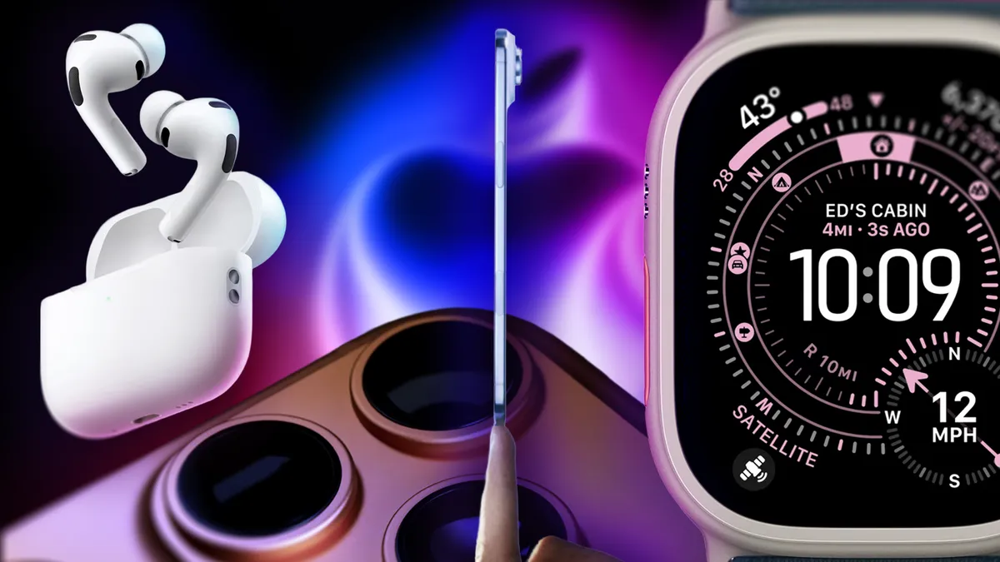
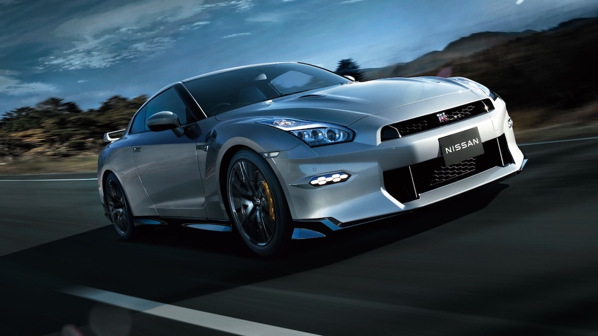
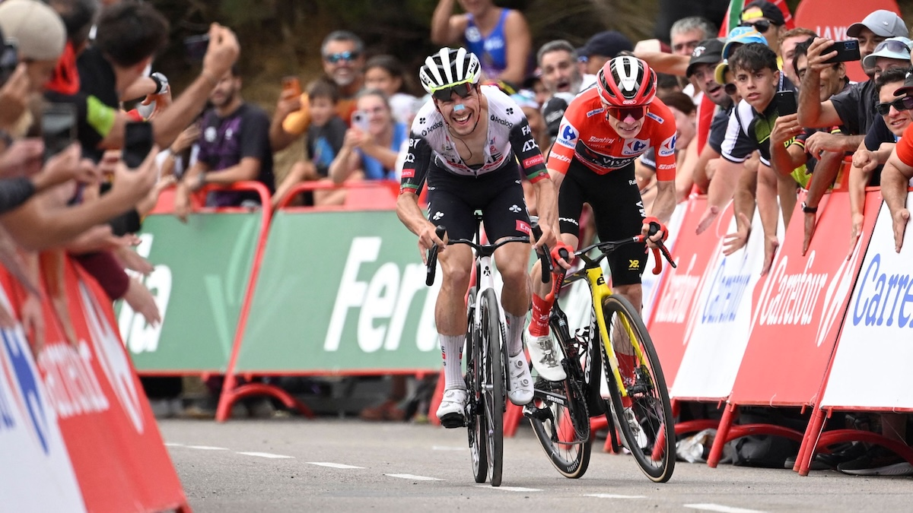

## Tech

The recent **Apple** Worldwide Developers Conference (WWDC) in 2025, titled "Awe Dropping," unveiled a new lineup of hardware and software. A major announcement was the iPhone Air, touted as Apple's thinnest smartphone ever.  The new iPhone 17 series, including the Pro and Pro Max, were also revealed with upgrades like the A19 Pro chip, an enhanced camera system with a new Center Stage feature, and a more durable screen. Additionally, Apple introduced the AirPods Pro 3 with live translation and heart-rate sensing, along with the Apple Watch Series 11, SE 3, and Ultra 3, which now have advanced health features like blood pressure monitoring. The event also highlighted the new operating systems for all of these devices, including iOS 26 and watchOS 26, with a new design called "Liquid Glass" and improved Apple Intelligence features.

## Global

The final **Nissan** GT-R (R35) production has sadly ended after an impressive 18-year run, with the last car, a T-Spec model, rolling off the line on August 26, 2025. This decision was a response to strict global emissions and noise regulations. The GT-R’s legacy, however, is immense. It earned its fame as a "supercar killer," offering incredible performance at a more accessible price. Its advanced all-wheel-drive system and twin-turbo V6 made it a technological marvel. The car's mythical status was further cemented in popular culture, especially in Japan's manga series. In **Initial D,** the **R32 GT-R**, nicknamed "Godzilla", was portrayed as a nearly unbeatable force on mountain roads, driven by the leader of the NightKids racing team. Nissan has hinted at a future electrified successor, but for now, "Godzilla"'s reign has come to a quiet end.

## Economy & Finance

## Nature & Environment

Sustained high tempreture in Shanghai/**China**

## Lifestyle, Entertainment & Culture

**Teacher's Day** is a celebration of educators and their significant contributions to society. While World Teachers' Day is officially recognized by UNESCO ("United Nations Educational, Scientific and Cultural Organization") on October 5th to commemorate the 1966 signing of a key recommendation on teacher's rights, the observance has a diverse history. In the United States, the modern movement for a national day was initiated by **Mattye Whyte Woodridge,** an Arkansas teacher whose advocacy led to a proclamation from Congress in 1953. In China, Teacher’s Day is celebrated on **September 10th**, a date chosen in 1985 to coincide with the start of the academic year and to elevate the teaching profession. This variety of dates reflects a universal appreciation for the vital role teachers play in shaping minds and building a better future.

In the NBA sneaker scene, Kobe Bryant's enduring legacy dominates. Years after his 2020 passing, his Nike signature line topped the 2024-25 season as the most worn, with 136 players lacing up Kobes—outpacing Kevin Durant's 30, Devin Booker's 28, Sabrina Ionescu's 27, and LeBron James' 17.  The Kobe 6 Protro, favored for its lightweight agility and ankle support, led with 61 users, especially in Grinch colorways.  This reflects Kobe's global impact, inspiring international stars through his innovative designs and work ethic. Nike holds 65% market share, but Kobe's shoes embody timeless excellence on the court

## Sports

**The 2025 Vuelta a España**, one of the three major grand-slam multi-day cycling races in the world, is heading into its dramatic conclusion, with the general classification (GC) battle intensifying. Pre-race hot favorite, **Jonas Vingegaard** (Team Visma-Lease a Bike), has lived up to the hype and is now wearing the red jersey. He leads his rival by a crucial 40-second margin, a testament to his climbing prowess and tactical brilliance. His closest competitor, **João Almeida**(UAE Team Emirates XRG), has been relentless in his pursuit, with the two trading blows on every summit finish. While Vingegaard has been the dominant force on the steep climbs, the likes of **Juan Ayuso** (UAE Team Emirates XRG) have kept the race from becoming a two-man show with two impressive stage wins of his own. The final stages promise a thrilling showdown for the red jersey, leaving fans on the edge of their seats.

In the recent **FIFA World Cup qualifiers**, **Cristiano Ronaldo**, at 40 years old, delivered a history-making performance. In Portugal's 3-2 victory over Hungary, he scored a crucial penalty, which was his 39th goal in World Cup qualifiers.  This strike equaled the all-time record for goals in the competition, a milestone previously held solely by Carlos Ruiz of Guatemala. Ronaldo's recent form also includes a two-goal performance in the prior 5-0 win against Armenia. He has scored 141 goals for Portugal and 943 goals in his professional career. 

**Norway** has been a powerhouse in the recent **FIFA World Cup qualifiers**, topping their group with a perfect record. Their dominant performance culminated in a historic 11-1 victory over **Moldova**, a match where star striker **Erling Haaland** scored an incredible five goals. This massive win has given them a significant goal difference, putting pressure on their main rivals. Additionally, Norway's campaign has seen a convincing 3-0 win against Italy, showcasing their strength against top-tier opposition. The team's clinical finishing and solid defensive play have made them one of the most feared sides in the qualifying stages, demonstrating their strong ambition to return to the World Cup stage.

**Luka Dončić** delivered a masterful 42-point performance to lead **Slovenia** to an 84-77 victory over Italy in the Round of 16 of **FIBA EuroBasket 2025**. Dončić was unstoppable from the start, scoring a remarkable 22 points in the first quarter alone. His final stat line was a near-perfect 42 points, 10 rebounds, 1 assist, and 3 steals, securing a double-double and cementing his status as the tournament's most dominant player. The win, which advances Slovenia to the quarterfinals to face Germany, was a hard-fought battle. Italy mounted a late comeback, at one point cutting Slovenia's lead to a single point, but Dončić's clutch free throws in the final minute sealed the win. The performance solidifies his place among EuroBasket's all-time great scorers and demonstrates his leadership and ability to carry his team.

## This Day in History

**Roald Dahl**, born on **September 13, 1916,** and passing in 1990, was a British novelist, short-story writer, and screenwriter of Norwegian descent, raised in Wales. Orphaned early, his traumatic schooling fueled stories of plucky kids triumphing over adversity. A WWII pilot for Royal Air Force, injuries shifted him to writing, starting with wartime tales. His iconic children's books—like **Charlie and the Chocolate Factory**, **Matilda**, and **The BFG**—mix whimsy, dark humor, and ethics, selling over 300 million copies globally. Dahl reshaped kids' lit by challenging conventions, inspiring films, theater, and education. His legacy persists in pop culture, despite critiques of stereotypes in some works. 

## Art of the Week

## Funny

---

## Previous Issues

---

July 06, 2025, **[While Young Talents Trailblaze AI Frontier, Legendary Icons Write New Chapters](https://weekly.sundayblender.com/p/while-young-talents-trailblaze-ai-frontier-legendary-icons-write-new-chapters)**

June 28, 2025, **[Flying Without Wings, Seeing Without Eyes, and Driving Without Humans](https://weekly.sundayblender.com/p/flying-without-wings-seeing-without-eyes-and-driving-without-humans)**

June 21, 2025, **[Cyber Doomsday Meets AI Boomtown](https://weekly.sundayblender.com/p/cyber-doomsday-meets-ai-boomtown)**

---

Thanks for reading! If you enjoy this newsletter, please share it with friends who might also find it interesting and refreshing, if not for themselves, at least for their kids.