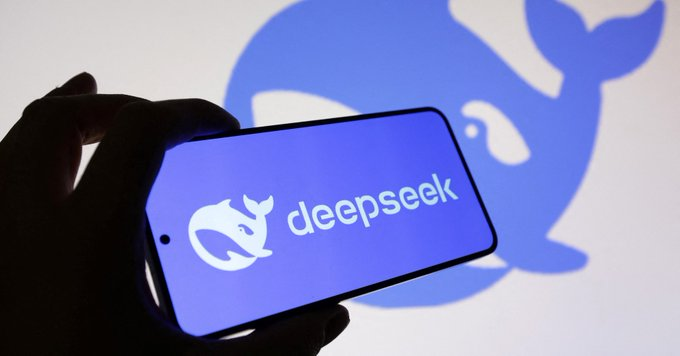
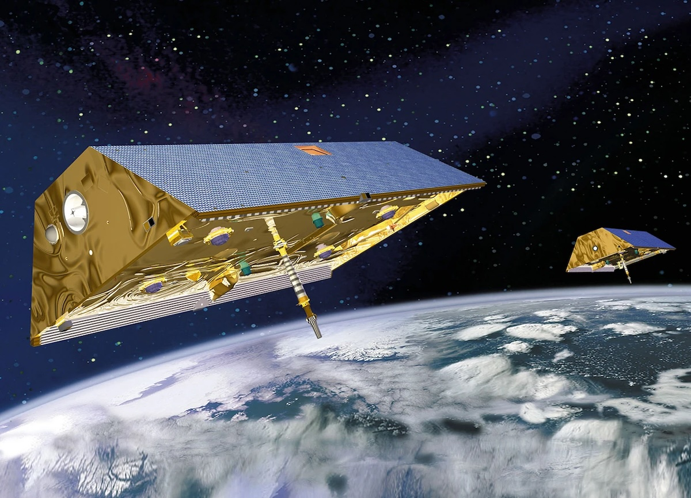
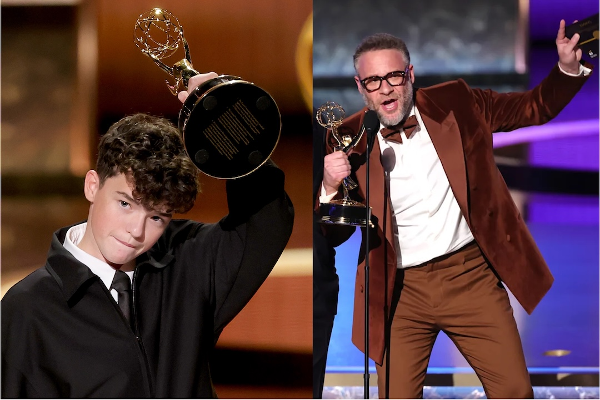
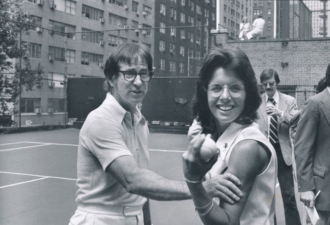

## Editor's Notes

The return of The Sunday Blender after a long and hot summer was well received. Upon suggestions from several subscribers, I've added some additional features:

- You can now download the **PDF** version of this issue from the link in the email and on the web. It's usually about 6-7 pages, two-column layout, Georgia font, with an old-school newspaper vibe. Our boy loves the smell of flipping through a newspaper on Sunday morning. 
- There is a link in the email that directs you to the web URL of this issue. 
- The website https://weekly.sundayblender.com is now accessible from ANY country in the world without a VPN, thanks to the use of an exquisite blockchain technology. 

Please continue to share your suggestions and feedback to `clayton.man@sundayblender.com`. You can also send interesting news stories my way. I rely on a combination of Twitter and LLMs to curate stories (my favorite LLM changes month to month), but I can always use help from the community who shares the same passion for creating interesting news for kids.

Of course, the biggest help you can do for The Sunday Blender, is to share it with other parents. Thank you!

## Tech

**OpenAI** released the largest study to date analyzing `1.5 million` ChatGPT conversations across three years, revealing how the AI tool creates economic value. The study shows demographic gaps are shrinking, with gender disparities narrowing dramatically and adoption growing `4x` faster in low-income countries. Three-quarters of conversations focus on practical guidance, information-seeking, and writing, with usage split into "Asking" (49%), "Doing" (40%), and "Expressing" categories. Non-work usage surged from 53% to 73% between June 2024-2025, indicating ChatGPT is becoming integral to daily life. The findings demonstrate ChatGPT functions more as an advisor than just a task-completion tool, supporting OpenAI's belief that AI access should be treated as a basic right.

**DeepSeek**'s R1 reasoning model just became the first large language model peer-reviewed and published in **Nature** magazine. It's already the most popular model on **Hugging Face** with `10.9 million` downloads. DeepSeek revealed that their R1 model achieves advanced reasoning through pure reinforcement learning without human-annotated demonstrations. The training cost was remarkably low at just `$294,000` (plus `$6 million` for the base model), far below industry estimates of tens of millions. R1 uses automated trial-and-error reinforcement learning to reward correct answers, allowing the model to develop its own reasoning strategies like self-reflection and verification. DeepSeek denied training on **OpenAI** outputs, stating R1 didn't copy reasoning examples from rival models. The model has "kick-started a revolution" in AI research, inspiring almost all 2025 LLM reinforcement learning work. Nature praised this as setting new transparency standards for the AI industry.

Anthropic's report

The All-In Summit 2025 was held September 7-10 in Los Angeles. The event was organized by the **All-In Podcast** hosts. The 2025 summit marked a decisive shift from 2024's speculation to conviction. AI evolved from experimental apps to core infrastructure, with leaders from **DeepMind**, **Tesla**, and **Eric Schmidt** positioning AI as the ultimate accelerator for scientific discovery and productivity. Discussions moved from "if AI will matter" to "where profits will accrue" - focusing on edge AI, robotics integration, and domain-specific applications. Notable absences included **Mark Zuckerberg**, **Nvidia**, **Microsoft**, and **Amazon** representatives, while **Elon Musk** appeared more focused and described **Optimus** as potentially "the most valuable product in history". The `$7,500`-per-ticket event reflected industry consensus that disruption is inevitable - the only question being who captures the profit pools.

**Meta**'s Connect 2025 showcased the company's vision for AI-powered smart glasses as the next computing platform. The flagship Meta **Ray-Ban** Display features a built-in lens display and revolutionary Neural Band wristband controller using electromyography to detect hand gestures for text input. Ray-Ban Meta Gen 2 offers double battery life, 3K video recording, and conversation focus technology. **Oakley** Meta Vanguard targets athletes with fitness integration and automatic workout highlights. Hyperscape technology creates photorealistic VR replicas of real rooms. **Zuckerberg** positioned glasses as "personal superintelligence" vessels, representing Meta's clearest post-smartphone strategy. However, the live AI demo embarrassingly failed during the keynote.

## Global

**Shanghai** has surged in popularity among young South Koreans, overtaking Hong Kong and Tokyo as their preferred travel destination. Koreans have dubbed it the "night owl getaway" - a weekend city of shimmering towers, acclaimed cuisine and vibrant urban energy. The city welcomed `423,000` Korean arrivals through mid-August, a surge of `130.7%` from last year, making them Shanghai's largest foreign visitors. This boom follows China's November 2024 announcement allowing Korean travelers visa-free entry for up to 30 days. Travel platform **Klook** reported Shanghai tour reservations jumped `88%`, day tours by `549%`, and mobility services by `538%` during summer holidays, especially among solo travelers. Hotel searches by Koreans for Shanghai accommodation soared `240%` year-on-year for the Chuseok holiday. The city's architecture, food scene, coffee culture, and nightlife attract Korean millennials seeking accessible international experiences.

**Andrew Cherng**, born in 1948 in **Yangzhou**, China, immigrated to America and in 1973 opened Panda Inn with his father in **Pasadena**, California. In 1983, he launched **Panda Express** with wife Peggy, a Myanmar-born electrical engineer. Their fast-casual chain revolutionized American Chinese cuisine, growing to over `2,400` locations across shopping malls, universities, and airports. Panda Express became deeply embedded in American daily life, selling an estimated `90 million` pounds of orange chicken annually. The couple built a `$7.5 billion` fortune and in September 2025, their Cherng Family Trust joined investor Tom Dundon's group to purchase the NBA team **Portland Trail Blazers** for over `$4 billion`, making them the wealthiest investors in the ownership group.

Hong Kong's new policy to boost economy
https://x.com/SCMPNews/status/1968144050411725254

## Economy & Finance

The best investors in the world
https://x.com/TheEconomist/status/1968102803336737091

Power-hungry industries across Asia are ramping up investments in the energy transition
https://x.com/business/status/1968123312438931622

As the Arctic region thaws, there’s surging demand for icebreaker ships that can open it to business
https://x.com/business/status/1968116472686714935

A deadly sinkhole in Yashio, Saitama, **Japan**, has highlighted a critical infrastructure crisis in the country. The sinkhole, caused by a ruptured 42-year-old sewer pipe, swallowed a truck and its 74-year-old driver. This incident has raised widespread concern about Japan's aging public works, much of which was built during its post-war economic boom and is now reaching or exceeding its 50-year lifespan. Experts warn that with over `40%` of sewer pipes expected to be more than 50 years old in the next two decades, similar collapses could occur elsewhere in the country. In response, the government has ordered nationwide inspections of sewer systems and is planning a new resilience plan to accelerate repairs and upgrades.

## Nature & Environment

This weekend features a rare planetary parade with **Venus**, **Jupiter**, **Saturn**, **Uranus**, and **Neptune** aligning in the morning sky before dawn. Saturn reaches opposition on September 21, appearing at its brightest and most detailed since 2010, fully illuminated and visible all night. A special highlight occurs September 19 with the crescent moon aligning with Venus and the bright star **Regulus**. This celestial event won't happen again until `2028`. Venus, Jupiter, and Saturn are visible to the naked eye, while Uranus and Neptune require binoculars or telescopes. Find an unobstructed eastern horizon for the best viewing experience.

## Science

NASA's **James Webb Space Telescope** captured an enormous stellar jet stretching `8 light-years` across in the nebula **Sharpless 2-284**, approximately twice the distance from our Sun to the nearest stars. The massive protostar powering these twin jets weighs about 10 times our Sun and is located `15,000 light-years` away on the outskirts of the Milky Way. This discovery provides evidence that protostellar jets scale with stellar mass—the more massive the star, the larger the jets. The jets stream at hundreds of thousands of miles per hour, resembling a double-bladed lightsaber, offering insights into massive star formation processes.

Scientists discovered a mysterious gravitational shift deep within Earth that occurred between 2006-2008, nearly `2,900 kilometers` down near the core-mantle boundary. The discovery was made using **GRACE** satellites that detected the anomaly centered off Africa's Atlantic coast, peaking around 2007. Researchers believe it resulted from a mineral phase transition where perovskite transformed to post-perovskite, increasing rock density and causing structural changes. This suggests deep mantle processes can occur within just a few years rather than millions of years previously assumed. The event may have influenced Earth's magnetic field, providing new insights into dynamic processes connecting Earth's layers.

## Lifestyle, Entertainment & Culture

The 2025 77th Emmy Awards, on September 14, were dominated by several standout shows and featured multiple historic wins. **The Studio** broke records with `13` total Emmy wins, the most ever for a first-year comedy series. **Seth Rogen** won four Emmys for the show, tying the record for most individual wins in one night. `15`-year-old **Owen Cooper** became the youngest male acting winner in Emmy history for **Adolescence**.  **HBO** and **Netflix** tied with `30` total wins each.

**Robert Redford**, the iconic actor and Oscar-winning director, died September 16, 2025, at age 89 at his Utah home. Known for classics like "Butch Cassidy and the Sundance Kid" and "All the President's Men," Redford became one of Hollywood's biggest stars in the 1970s with his golden looks and charismatic screen presence. He won the Best Director Oscar for "Ordinary People" (1980) and founded the **Sundance Institute**, transforming independent cinema. A committed environmental activist, he received the Presidential Medal of Freedom in 2016. His cultural impact extends far beyond acting through championing independent filmmakers and environmental causes.

## Sports

**Jonas Vingegaard**delivered a masterclass on Stage 20's merciless **Bola del Mundo** in **Vuelta a Espana** (Cycling Tournament of Spain), conquering the brutal `12.3-kilometer` climb averaging `8.6%` gradient. The final 3.2 kilometers were utterly savage at `12.2%` average, with sections hitting `23%` on the rough concrete track. These punishing slopes "pushed all riders to the limit," but Vingegaard found another gear, dropping João Almeida to extend his lead to 1:16. Stage 21's Madrid finale was cancelled due to protests. This triumph completes Vingegaard's decorated Grand Tour collection, adding to his 2022 and 2023 Tour de France victories, cementing his legacy among cycling's elite climbers.

Fan Zhengdong's debut in Germany
https://x.com/SCMPNews/status/1968096611155792179

## This Day in History

The Battle of the Sexes was an exhibition tennis match on `September 20, 1973`, between **Billie Jean King** and **Bobby Riggs** at Houston's Astrodome. The 29-year-old King defeated the cocky 55-year-old Riggs in straight sets (6-4, 6-3, 6-3) before `30,472` spectators and `90 million` television viewers worldwide. Riggs had previously defeated Margaret Court and embraced his role as a male chauvinist, claiming "women belong in the kitchen". King's victory became a landmark moment for the women's movement and remains the most-watched tennis match in history. The match brought unprecedented publicity to gender equality struggles. The event was depicted in a 2017 Hollywood movie starring **Emma Stone** and **Steve Carell**. 

## Art of the Week

## Funny

---

## Previous Issues

---

September 13, 2025, **[Good Old Apple Strikes Back](https://weekly.sundayblender.com/p/good-old-apple-strikes-back)**

July 06, 2025, **[While Young Talents Trailblaze AI Frontier, Legendary Icons Write New Chapters](https://weekly.sundayblender.com/p/while-young-talents-trailblaze-ai-frontier-legendary-icons-write-new-chapters)**

June 28, 2025, **[Flying Without Wings, Seeing Without Eyes, and Driving Without Humans](https://weekly.sundayblender.com/p/flying-without-wings-seeing-without-eyes-and-driving-without-humans)**

---

Thanks for reading! If you enjoy this newsletter, please share it with friends who might also find it interesting and refreshing, if not for themselves, at least for their kids.

