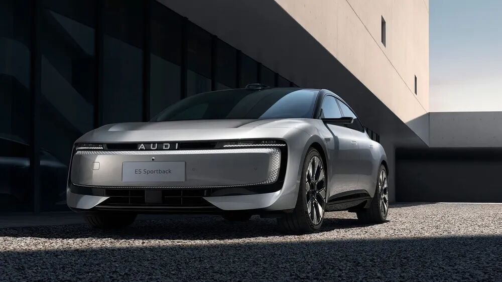
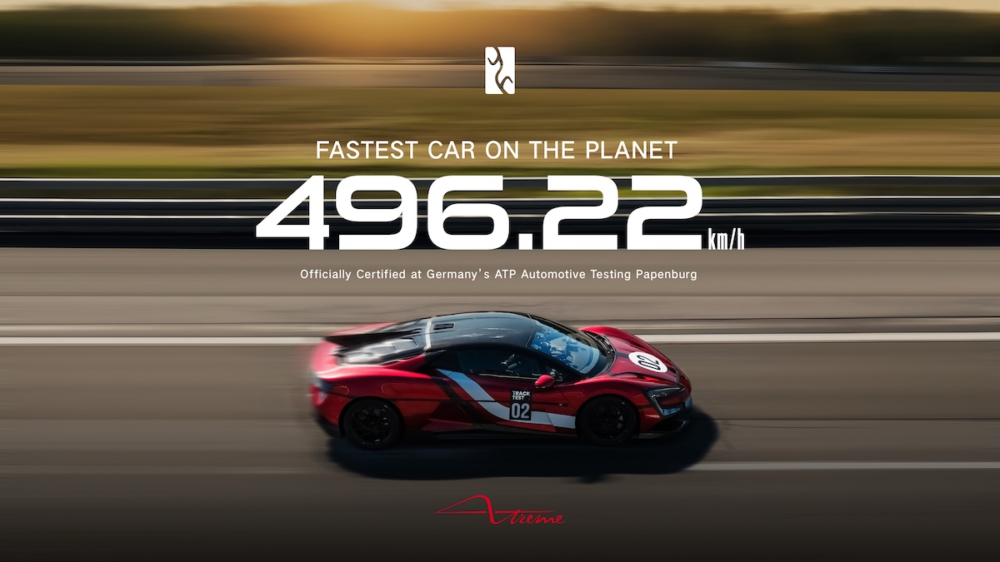
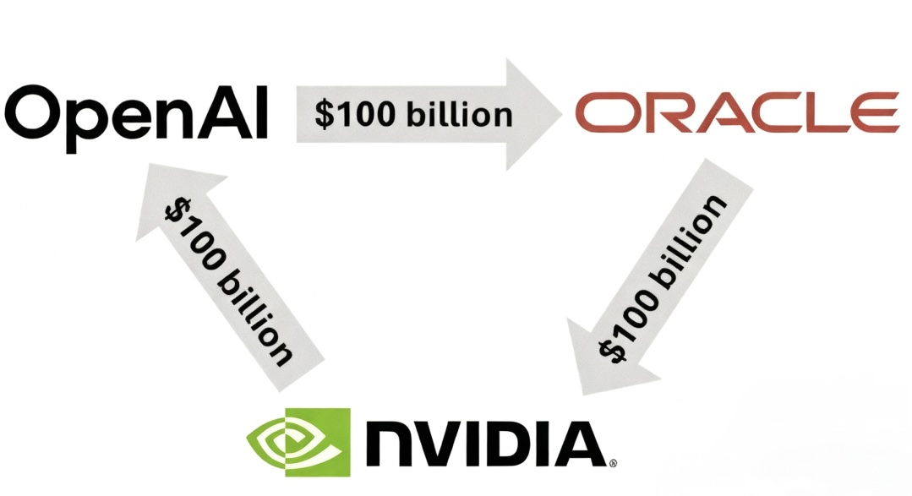
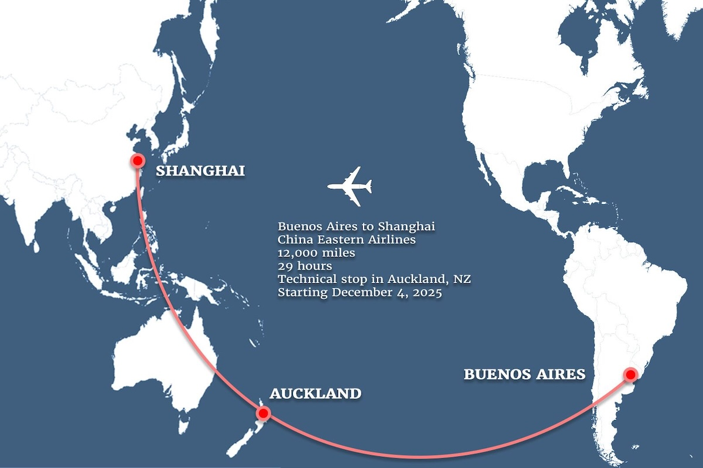
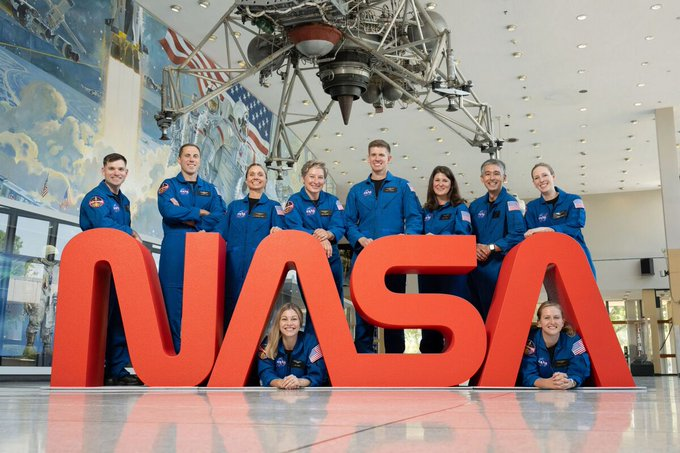
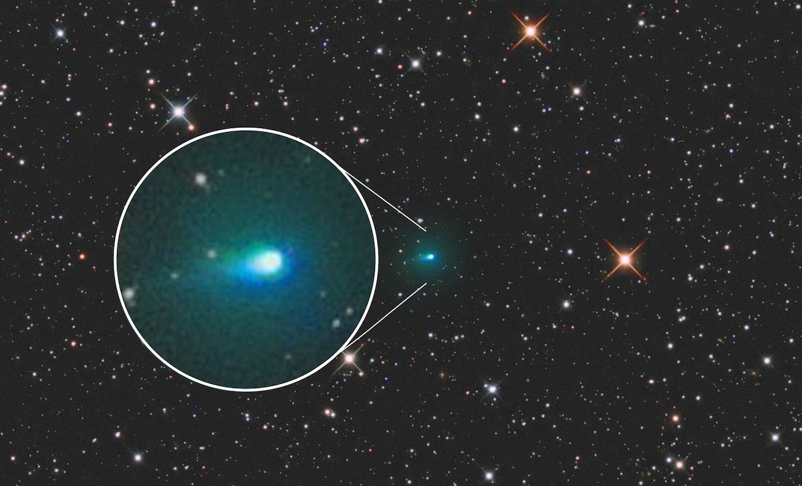
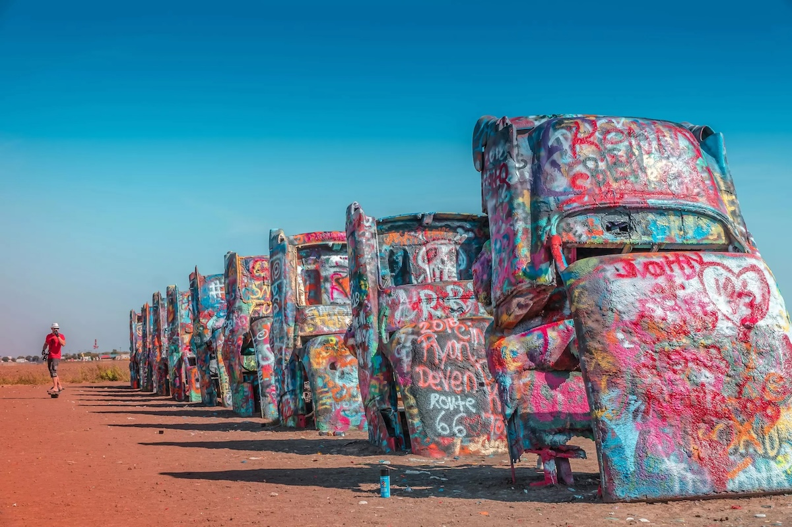
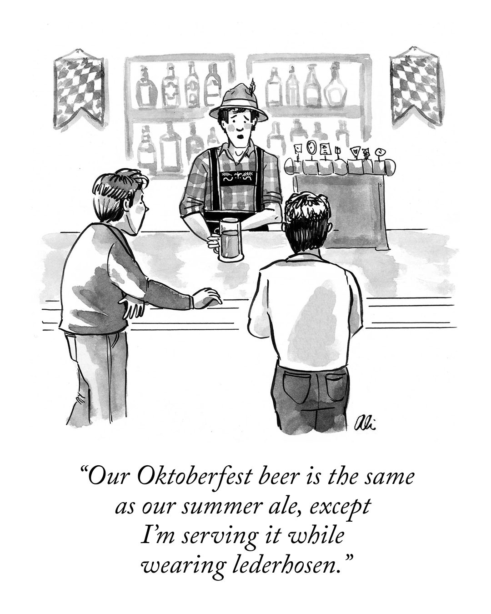

## Tech

**Audi**'s new AUDI **E5 Sportback** received `10,153` orders within 30 minutes of its China launch, showing how German brands are adapting to win Chinese hearts. This isn't regular Audi - it's spelled "AUDI" in capitals without the four rings logo, created specifically for Chinese customers through partnership with local company **SAIC**. The strategy blends "German engineering with China's cutting-edge technology and digital ecosystem". Key features include a massive `59-inch` dashboard screen, `480-mile` range , and pricing starting at just `$32,800`. The electric fastback represents Audi's bold move to create China-only products that match local preferences.

**NASA** selected **Blue Origin** to deliver its **VIPER** rover to the moon's south pole in late 2027, rescuing a mission that was canceled in 2024 due to ballooning costs. VIPER stands for "Volatiles Investigating Polar Exploration Rover" and will hunt for water ice deposits over 100 days on the lunar surface. About the size of a golf cart, the rover will drill into permanently shadowed craters to map precious resources that could become drinking water, oxygen, and rocket fuel for future astronauts. Blue Origin's `$190 million` contract uses their Blue Moon MK1 lander, giving **Jeff Bezos**' company a major NASA endorsement. This resurrection proves that even "dead" space missions can find new life through creative partnerships.

Chinese auto giant **BYD**'s **Yangwang U9 Xtreme** broke the world production car speed record, hitting `496.22 km/h` at Germany's ATP Papenburg test track. This electric hypercar dethroned **Bugatti**'s **Chiron Super Sport 300+**, which held the crown for five years at `490.4 km/h`. The U9X features four electric motors spinning at `30,000 rpm` each, producing over `3,000 horsepower` from a revolutionary `1,200V` architecture. German racing driver Marc Basseng piloted the record run, with only `30` units planned for production. This achievement proves electric powertrains can now outperform the most extreme gasoline supercars.

**NVIDIA** announced plans to invest up to `$100 billion` in **OpenAI** as part of a strategic partnership to deploy `10 gigawatts` of AI computing power, with the first phase launching in late 2026. This complements OpenAI's existing `$300 billion` agreement with **Oracle** over five years to purchase computing power, part of the broader `$500 billion` **Stargate** project. The NVIDIA investment will primarily fund GPU leasing arrangements rather than outright purchases, allowing OpenAI to spread costs while NVIDIA bears more risk. Oracle and **SoftBank** are expanding Stargate with five new US data center sites, bringing total planned capacity to nearly `7 gigawatts` and over `$400 billion` in investment. These interconnected deals represent massive infrastructure investments, though questions remain about funding sources given OpenAI's current unprofitability.

## Global

**President Trump** signed an executive action on Friday imposing a `$100,000` application fee for new H-1B visas, targeting what his administration calls overuse of the program. The White House later clarified this is a one-time fee for new applications only, not affecting existing visa holders or renewals. This move particularly impacts tech companies like **Amazon** (`14,000+` H-1B holders), **Microsoft**, **Meta**, and **Google**, which heavily rely on skilled workers from India and China. The surprise announcement sparked panic, with companies like Amazon urgently telling employees to return to the US before Sunday's deadline. Global talent hubs like the UK and Dubai see this as an opportunity to attract skilled workers.

**China Eastern Airlines** launches the world's longest "direct" flight on December 4, 2025, connecting Shanghai to Buenos Aires in up to `29` hours with a technical stop in Auckland, New Zealand. The journey spans `12,500 miles` - roughly half the Earth's circumference - using a **Boeing 777-300ER** flying twice weekly. Passengers must stay aboard during the two-hour Auckland refueling stop, but can stretch their legs briefly. The airline chose an unusual southerly route near Antarctica to save four hours compared to traditional paths. Economy tickets start at `$1,538` while business class costs over `$5,000`, reflecting the marathon journey's premium nature. This "Air Silk Road" connects Asia-Pacific with South America like never before.

**Lake Como**, the iconic Italian destination beloved by Hollywood celebrities, suffered severe flooding twice in two days on September 22-23, 2025, after torrential rain hit northern Italy. The historic medieval center of Como was submerged, with water flowing through streets and partially submerging cars in Piazza Cavour and the lakeside promenade. Firefighters used trucks and helicopters to rescue residents stranded in vehicles and evacuate people from homes as floodwaters surged. The extreme weather also caused a massive sinkhole on scenic road SP38. This strikes the heart of a region famous for its Gothic-Renaissance Duomo and celebrity villa retreats.

## Economy & Finance

China's securities regulator has advised domestic brokerages to pause their real-world asset (**RWA**) tokenization business in Hong Kong, signaling Beijing's concerns about the booming offshore digital assets market. The China Securities Regulatory Commission issued informal guidance to at least two major brokerages in recent weeks, aimed at strengthening risk management and ensuring legitimate business backing. RWA tokenization converts traditional assets like stocks, bonds, and real estate into digital tokens traded on blockchain platforms. The move contrasts with Hong Kong's aggressive push to become Asia's digital finance hub, causing Chinese brokerage shares to drop `2-6%` on Tuesday. This follows China's 2021 cryptocurrency ban and recent restrictions on stablecoin research.

In the shimmering vaults of global finance, gold embarked on an epic ascent in 2025, defying economic storms. Fueled by escalating geopolitical tensions and whispers of U.S. Federal Reserve rate cuts, the precious metal surged relentlessly. Investors, seeking safe haven amid market volatility, poured billions into bullion, driving prices from `$2,700` in January to a staggering all-time high of `$3,790.82` per ounce on September 23. By September 26, it hovered near `$3,781`, up over `40%` year-to-date. Analysts predict further climbs, as central banks hoard reserves and inflation looms, turning gold into the ultimate treasure in uncertain times.

## Nature & Environment

Canadian outdoor brand **Arc'teryx** partnered with renowned Chinese artist **Cai Guo-Qiang** to stage a massive "Rising Dragon" fireworks display on September 20, 2025, at `5,500 meters` altitude in Tibet's Himalayas near Mount Everest. The publicity stunt triggered fierce backlash on Chinese social media, with critics denouncing environmental damage to the pristine ecosystem and cultural disrespect to sacred Tibetan lands. Wildlife protection groups warned the loud noises and smoke could devastate local species like Tibetan antelopes and snow leopards. Both Arc'teryx and Cai issued public apologies by September 21, with local authorities launching an investigation. The controversy sparked boycott calls and highlighted the disconnect between Arc'teryx's environmental brand image and this destructive marketing stunt.

## Science

**NASA** selected 10 new astronaut candidates on September 22, 2025, from over `8,000 `applicants to join the agency's astronaut corps for future moon and Mars missions. The group includes six women and four men - the first time women outnumbered men in a NASA astronaut class. Notable candidates include Anna Menon, who flew on SpaceX's Polaris Dawn mission, and Dr. Lauren Edgar, who worked on Mars exploration rovers for 17 years. The candidates will undergo nearly two years of training before becoming eligible for missions to low Earth orbit, the Moon, and ultimately Mars. Acting Administrator Sean Duffy said one of them could become the first person to set foot on Mars.

Comet **3I/ATLAS**, designated C/2025 N1, was discovered on July 1, 2025, by the **ATLAS** survey in Chile. It is the third confirmed interstellar object, following **Oumuamua** and **Borisov**, originating from the direction of **Sagittarius** on a hyperbolic orbit. Observations show a coma and tail from cometary activity, rich in carbon dioxide, water ice, and other volatiles. Its nucleus is estimated at up to `20 km` in diameter, roughly similar to the length of **Manhattan**. It will reach perihelion on `October 29, 2025`. Speculation includes potential artificial origins, similar to debates on Oumuamua, though its cometary features suggest natural formation. It may be over `7 billion` years old, predating the Solar System, possibly ejected from a protoplanetary disk in the **Milky Way**'s disk. Scientifically, it provides insights into extrasolar chemistry, planet formation, and galactic dynamics, as a rare probe of interstellar material. 

## Lifestyle, Entertainment & Culture

**Demon Slayer: Kimetsu no Yaiba Infinity Castle** shattered US anime records with a `$70 million` opening weekend, demolishing the `26`-year-old record held by Pokémon: The First Movie (`$31` million). The Japanese film follows demon slayer Tanjiro in the climactic Infinity Castle arc, where he and his allies face their ultimate battle against the demon lord Muzan. This success highlights anime's growing mainstream acceptance in America, with `42%` of Gen Z watching anime weekly. With `$555 million` globally, the Japanese blockbuster has become the highest-grossing Japanese anime film worldwide, though it ranks behind China's **Ne Zha 2** among animated films overall. The breakthrough proves that Japanese anime can achieve massive theatrical success beyond its traditional fanbase, marking a cultural milestone for the medium.

China's micro-drama craze is turning stalled real estate projects into lavish film sets, breathing life into vacant buildings across the country. The micro-drama industry exceeded `$7.1 billion` in 2024, with `660 million` viewers nationwide, even surpassing China's box office revenue for the first time. Empty malls, unfinished Evergrande projects, and idle office buildings are being repurposed as filming locations, with one vacant mall in Xinzheng producing `700` micro-dramas in under a year. Urban romance dramas featuring luxurious settings have proven especially popular, transforming model flats into wealthy heiresses' bedrooms and empty clubhouses into high-end party venues. Despite this creative reuse, China's vast property glut remains largely untouched by the entertainment boom.

`September 22` marks the autumnal **equinox** in the Northern Hemisphere, when day and night are nearly equal in length worldwide. This astronomical event occurs when the Sun crosses the celestial equator, moving southward, officially beginning fall in the north while spring starts in the Southern Hemisphere. The word "equinox" comes from Latin meaning "equal night." During this time, the Sun rises directly in the east and sets directly in the west. For many cultures, this date holds deep significance as a time of balance, harvest celebrations, and preparation for winter. Ancient civilizations built monuments like **Stonehenge** to mark these precise solar alignments, recognizing the equinox's importance for agriculture and timekeeping.

Tokyo Game Show's headline reveal was Microsoft confirming **Forza Horizon 6** will be set in Japan and launch in 2026, fulfilling one of fans' most requested locations. Other major announcements included **Ninja Gaiden 4** adding accessibility features, **Call of Duty: Black Ops 7** showcasing Japan-themed maps, and a complete Gungrave Gore remake in Unreal Engine 5. Horror fans got **Fatal Frame II: Crimson Butterfly** remake coming early 2026. Square Enix revealed underwater content for **Dragon Quest** remakes, while Sega teased **New Virtua Fighter** updates. The show emphasized cross-platform gaming and **Microsoft**'s new ROG Ally Xbox handheld.

## Sports

**Paris Saint-Germain**'s **Ousmane Dembélé** won the 2025 Men's Ballon d'Or on September 22, becoming the first French player to claim the prize while wearing PSG colors. The 28-year-old forward led PSG to a historic quadruple, including their first-ever Champions League title, scoring `37` goals and providing `15` assists across all competitions. Barcelona's **Aitana Bonmatí**won her third consecutive Women's Ballon d'Or, while teammate **Lamine Yamal**claimed his second Kopa Trophy as best young player. Other winners included England coach Sarina Wiegman (women's coaching award), Luis Enrique (men's coaching award), and goalkeepers Hannah Hampton and Gianluigi Donnarumma. **PSG** was also named Men's Club of the Year for their unprecedented European success.

Belgium's **Remco Evenepoel** delivered a stunning performance to win his third consecutive world time trial title in Kigali, Rwanda, while pre-race favorite **Tadej Pogačar** suffered a crushing defeat. The Slovenian star struggled from the opening checkpoints on the challenging `41.8km` course, losing time at each split before being dramatically caught by Evenepoel on the final climb. Pogačar finished over `2:30` behind the winner and missed the podium by just one second, calling it "a hard one to swallow". The hilly parcours featuring cobbled climbs and high altitude proved decisive as Evenepoel's time trial prowess shone through. The upset sets up an intriguing rivalry ahead of next week's road race where Pogačar seeks redemption.

English superstar **Harry Kane** has had an extraordinary start to the 2025/26 Bundesliga season, scoring 10 goals in just five matches and recently reaching `100` goals for **Bayern Munich** in a record-breaking `104` games. This milestone broke a European record previously held by **Cristiano Ronaldo** and **Erling Haaland**, who needed 105 games to reach 100 club goals. The English striker has won back-to-back Bundesliga top scorer awards, netting `36` goals in his debut season and `26` in 2024/25, becoming the first player to win the Torjägerkanone in his first two German seasons. Kane's impact goes beyond goals - he's shown incredible efficiency with a `72.7%` shot accuracy and averages a goal every `79` minutes, faster than any player in Bundesliga history. His arrival has transformed Bayern, helping them reclaim the title and achieve his first senior team trophy.

## This Day in History

On **September 27, 1908**, automotive history was made when the first **Ford Model T** rolled off the assembly line at the Piquette Avenue Plant in Detroit, Michigan. Henry Ford's revolutionary "Tin Lizzie" was designed to be affordable, reliable, and simple enough for ordinary Americans to own and maintain. Priced at `$825`, the Model T featured a `20-horsepower`, four-cylinder engine and could reach speeds of `40-45 mph`. Ford's vision was to create "a motor car for the great multitude," democratizing transportation that had previously been a luxury for the wealthy. The Model T's durability, ease of repair, and mass production techniques would transform it into the world's first truly popular automobile, eventually selling over `15 million` units and fundamentally changing American society, culture, and the global economy.

## Art of the Week

**Cadillac Ranch** is a renowned public art installation located west of Amarillo, Texas, along historic **Route 66**. Created in 1974 by artists Chip Lord, Hudson Marquez, and Doug Michels of the Ant Farm collective, it features ten **Cadillac** automobiles, models from 1949 to 1963, half-buried nose-first in the ground at an angle mirroring the Great Pyramid of Giza. Commissioned by eccentric millionaire Stanley Marsh, the sculpture pays homage to the evolution of the Cadillac tailfin and American car culture. Relocated in 1997 to accommodate urban growth, it remains an interactive site where visitors are encouraged to spray-paint the cars, resulting in ever-changing, vibrant graffiti layers. This landmark attracts tourists worldwide, symbolizing pop art and roadside Americana.

## Funny

 *- by Ali Solomon, New Yorker*

---

## Previous Issues

---

September 20, 2025, **[All You Need Is Another AI Research Report](https://weekly.sundayblender.com/p/all-you-need-is-another-ai-research-report)**

September 13, 2025, **[Good Old Apple Strikes Back](https://weekly.sundayblender.com/p/good-old-apple-strikes-back)**

July 06, 2025, **[While Young Talents Trailblaze AI Frontier, Legendary Icons Write New Chapters](https://weekly.sundayblender.com/p/while-young-talents-trailblaze-ai-frontier-legendary-icons-write-new-chapters)**

---

Thanks for reading! If you enjoy this newsletter, please share it with friends who might also find it interesting and refreshing, if not for themselves, at least for their kids.