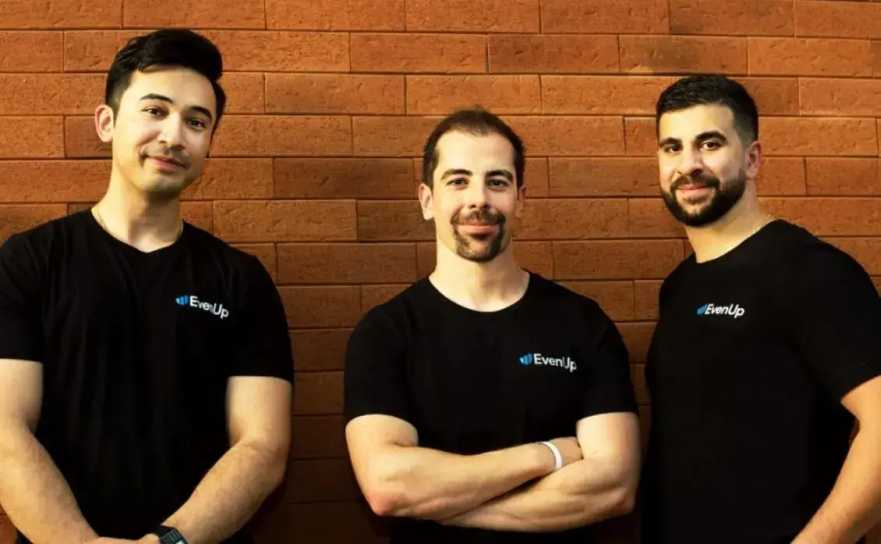
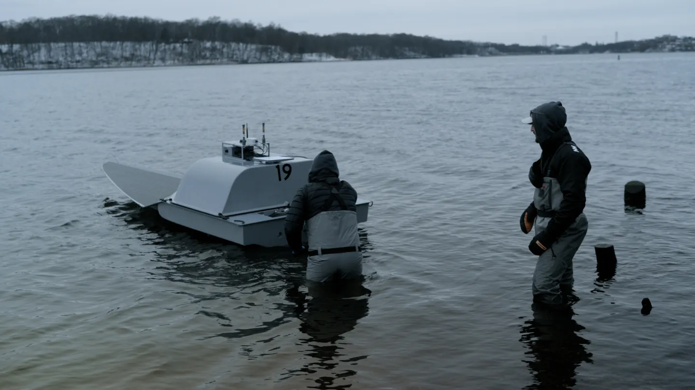
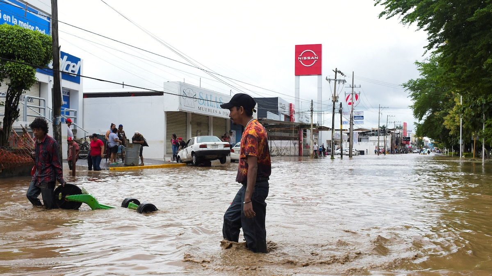
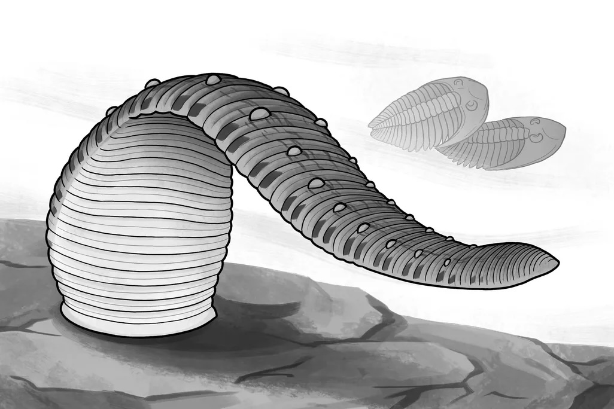
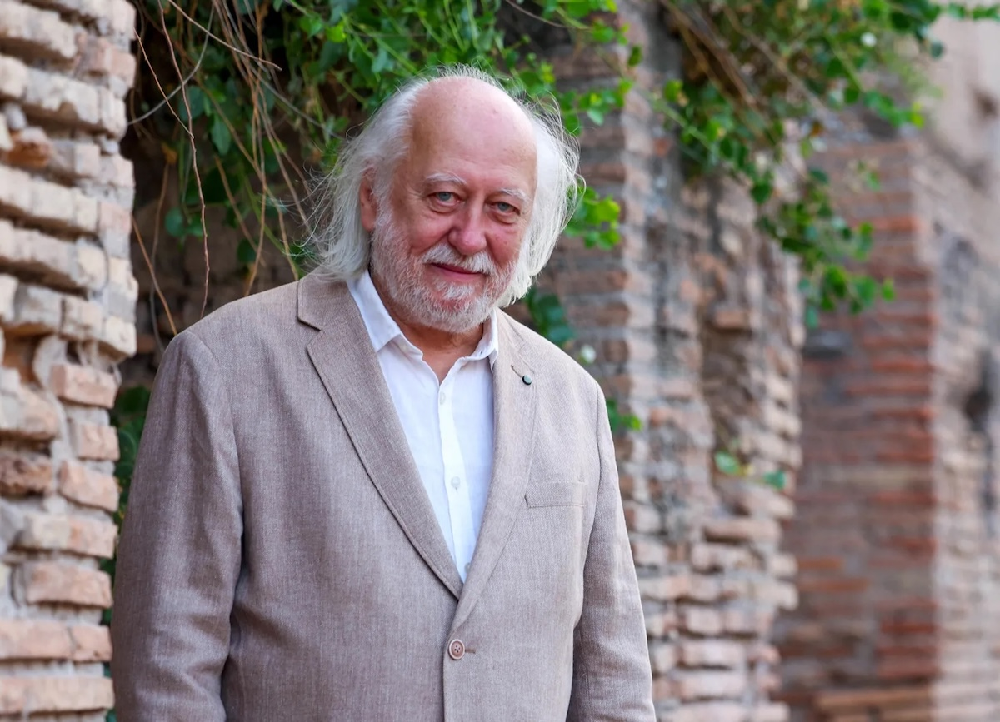
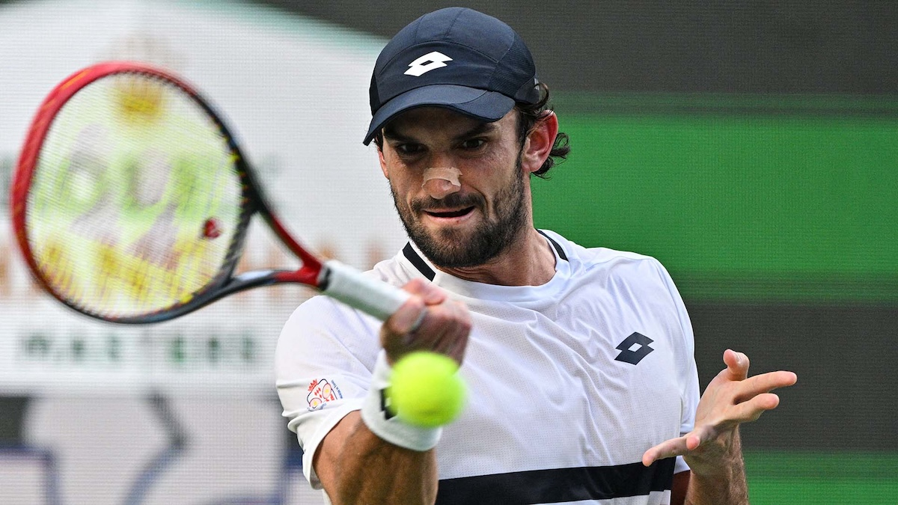
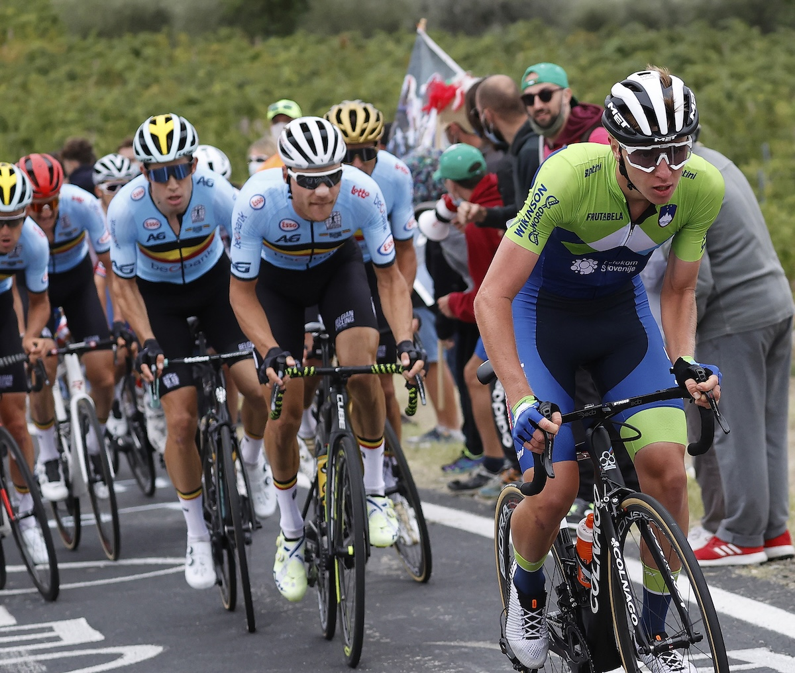
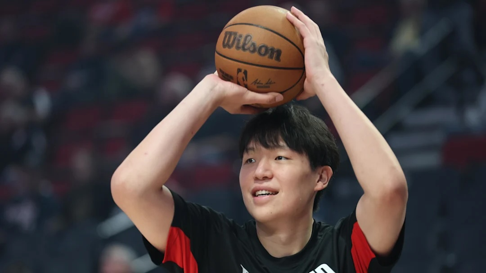
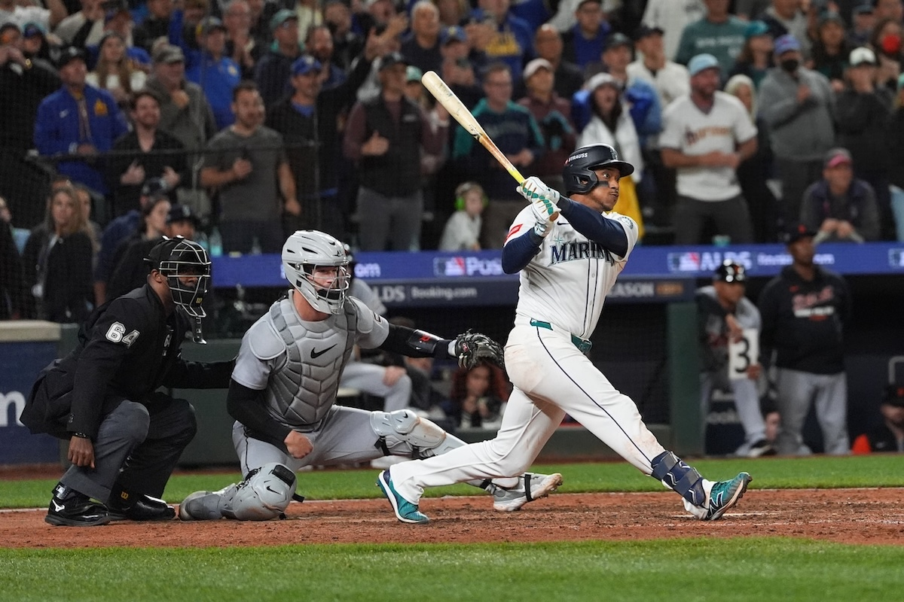
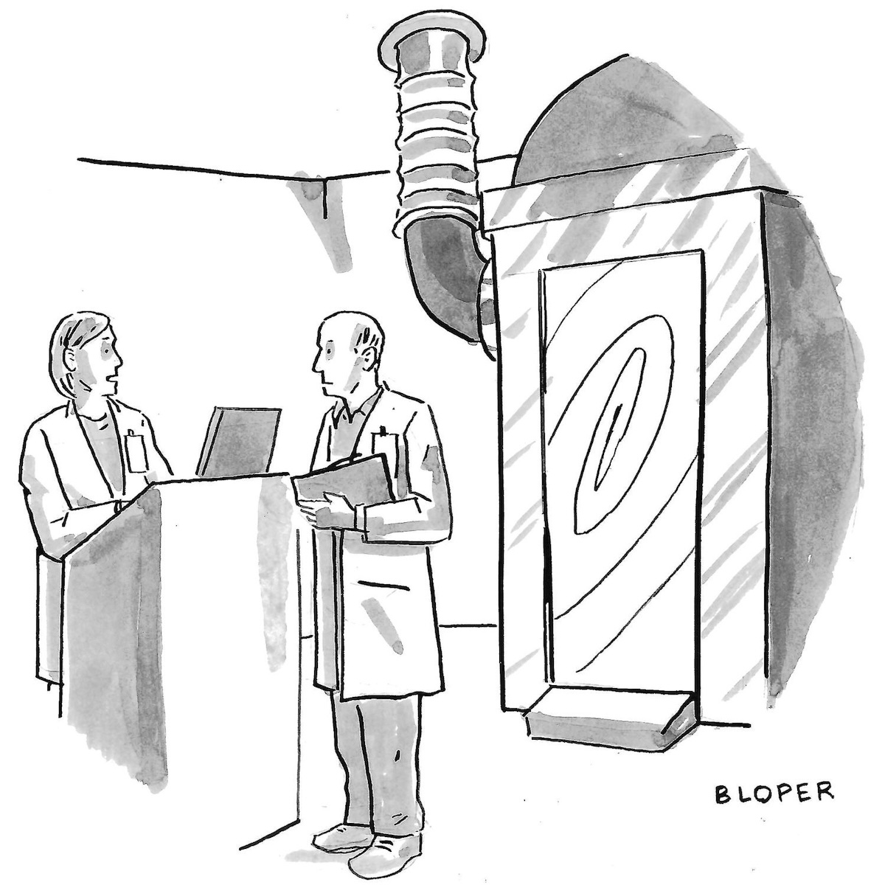

## Editor's Words

It's good to return from the week-long holiday, resume badminton, and continue to work on another issue of The Sunday Blender.  How come the sizzling summer hasn't left Shanghai yet?

It's getting harder to find worthy news stories. [Claude.ai](https://claude.ai) has been a huge help in validating sources of news and writing up summations. ChatGPT is still hallucinating a lot.

But who would have thought you could create ChatGPT in Minecraft!? 😛😛

## Tech

**OpenAI** launched **Sora 2**, its flagship video and audio generation model, on September 30, 2025, alongside a TikTok-style social app. The model creates videos up to 20 seconds long with synchronized dialogue, sound effects, and improved physics accuracy where objects behave realistically. The iOS app hit `1 million` downloads in under five days and reached #1 on Apple's App Store. However, the launch sparked intense backlash from Hollywood agencies and the Motion Picture Association over copyright concerns, as videos featuring characters from copyrighted shows like **SpongeBob SquarePants** proliferated on the platform, raising questions about AI-generated content and intellectual property rights.

**Qualcomm** announced on October 7, 2025, it will acquire **Arduino**, the Italian open-source electronics platform with a `33-million`-strong developer community, for undisclosed terms. The chipmaker aims to push deeper into robotics by gaining direct access to hobbyists, startups, and makers at the ground level of the industry. Arduino will become an independent subsidiary, and the companies unveiled the Arduino Uno Q board featuring Qualcomm's Dragonwing chip, priced at $44-$59. The deal helps Qualcomm diversify revenue away from mobile chips as the smartphone market stalls, targeting the growing robotics and edge AI markets where developers prototype concepts before commercialization.

**Tesla** unveiled more affordable versions of its **Model Y** SUV and **Model 3** sedan on October 7, 2025. The Model Y Standard is priced at `$39,990` with `321 miles` of estimated range, while the Model 3 Standard starts at `$36,990`—both about `$5,000` less than previous entry-level versions. The stripped-down models lack panoramic glass roofs, leather seats, light bars, and even basic Autopilot features. The launch came just days after the $7,500 federal EV tax credit expired, effectively making the "more affordable" models actually more expensive than last week for consumers. Tesla's stock dropped `4.45%` following the announcement as investors had hoped for more significant innovations.

**EvenUp**, a San Francisco-based legal tech startup, closed a `$150 million` Series E funding round on October 7, 2025, doubling its valuation to `$2 billion`. Led by **Bessemer Venture Partners**, the investment will support EvenUp's growth in AI-driven personal injury law services. The company's platform uses a proprietary AI model trained on hundreds of thousands of injury cases to automate tasks like drafting legal documents, reviewing evidence, and strategizing case lifecycles. The massive funding round solidifies EvenUp's position as a category-defining player in the legal tech space, demonstrating strong investor confidence in AI's ability to transform traditional law practices and streamline complex legal workflows.

**HavocAI**, a Rhode Island-based defense tech startup, raised `$85 million` in funding announced on October 9, 2025, to scale production of its autonomous, AI-driven military boats. Co-founded by former U.S. Navy officers, HavocAI retrofits commercial vessels with proprietary AI autonomy software, dramatically cutting the cost and time needed to field unmanned naval craft. Investors include B Capital Group, UP.Partners, In-Q-Tel (the CIA's venture arm), Lockheed Martin, and Taiwania Capital. The company plans to expand its fleet from small `14-foot` "Rampage" unmanned boats (sold to the U.S. Navy for just `$100,000` each) up to `100-foot` autonomous ships for surveillance and patrol, having already deployed over 20 vessels since launching in 2024.

A fire at South Korea's National Information Resources Service (NIRS) data center in **Daejeon** on September 26, 2025, permanently destroyed `858 terabytes` of government data with no backups available. The blaze started from a lithium-ion battery explosion, triggering thermal runaway that crashed `647` government digital services including emergency response systems, postal logistics, and administrative portals. The **G-Drive** cloud storage system, used by approximately `125,000` civil servants, was completely destroyed. Four people were arrested for suspected criminal negligence. The disaster exposed critical infrastructure vulnerabilities and sparked global discussions about backup strategies and disaster recovery planning.

## Global

In early October 2025, **Israel** and **Hamas** agreed to a U.S.-brokered ceasefire, marking the first phase of a broader peace framework. The Israeli government approved the deal on October 10, with the ceasefire taking effect shortly after. The agreement provides for the release of approximately `48` Israeli hostages and nearly `2,000` Palestinian prisoners. Israeli forces are withdrawing from parts of Gaza to new defensive positions. The plan calls for Hamas to disarm and step aside from governing Gaza, with an international "Board of Peace" chaired by President Trump overseeing reconstruction. This breakthrough follows two years of devastating conflict.

The U.S. government shutdown began on October 1, 2025, after both Republican and Democratic funding proposals failed in the Senate. Democrats refused to support a Republican stopgap measure without extensions to Affordable Care Act health subsidies and reversals to Medicaid cuts. The shutdown is now extending into its second week, with military members missing paychecks and flight delays occurring due to air traffic control staffing shortages. President Trump began mass layoffs of federal workers, with over `4,000` employees across seven agencies receiving reduction-in-force notices. Both parties remain deadlocked, with the Senate adjourning until next week without resolution.

During the ongoing government shutdown, air traffic controllers working without pay have increasingly been absent from towers, causing widespread flight disruptions. On Monday, California's **Burbank Airport** tower closed for several hours with no controllers present, forcing pilots to communicate on a common frequency typically used at smaller airports. Nashville's approach facility shut down for five hours, with Memphis handling traffic instead. The FAA faces a shortage of `3,000` controllers, with over `90%` of towers already understaffed. Transportation Secretary Sean Duffy attributed the absences to increased sick calls from controllers worried about missing paychecks, with over `10,000` flights delayed early in the week.

**Sanae Takaichi**, 64, was elected president of Japan's ruling Liberal Democratic Party on October 4, 2025, becoming the first woman to lead the party. She is set to become Japan's first female prime minister when parliament votes on October 15. A hardline conservative and protégé of former Prime Minister Shinzo Abe, Takaichi defeated Agriculture Minister Shinjiro Koizumi in a runoff vote. She regularly visits the controversial Yasukuni Shrine and supports revising Japan's pacifist constitution. However, she faces immediate challenges, including potentially losing the LDP's longtime coalition partner Komeito due to her ultra-conservative positions. Takaichi models herself after **Margaret Thatcher** and is often called Japan's "Iron Lady".

China launched a new **K visa** category effective October 1, 2025, specifically designed to attract young foreign science and technology professionals. The visa targets STEM (Science, Technology, Engineering, and Mathematics) graduates with bachelor's degrees or higher from recognized universities, and notably does not require applicants to have a Chinese employer or invitation letter before applying. Compared to China's existing 12 ordinary visa types, K visas offer more flexibility with multiple entries, longer validity periods, and extended stays. Holders can engage in educational, cultural, and scientific exchanges, as well as entrepreneurial and business activities. However, the policy has sparked backlash domestically amid China's youth unemployment crisis, with hashtags reaching half a billion views on social media.

## Economy & Finance

The cryptocurrency market experienced a historic crash on October 11, 2025, triggered by President Trump's announcement of an additional `100%` tariff on Chinese imports. Data tracker **Coinglass** described it as "the largest liquidation event in crypto history", with over `$7 billion` in liquidations from leveraged positions. Bitcoin plunged from `$122,000` to below `$110,000`, dropping over `10%`, while Ethereum crashed `16%`, and altcoins like **XRP** and **Solana** fell 20-30%. The total cryptocurrency market capitalization fell from `$4.25 trillion` to $`4.05 trillion`, wiping out nearly `$200 billion` in value within hours. Some altcoins reportedly crashed up to `90%`.

China's Golden Week holiday in early October 2025 showed mixed consumer spending trends. Average spending per trip dropped to 911.04 yuan (`$113.52`), marking a `0.55%` decrease from the previous year and hitting a three-year low. The decline reflected weak consumer confidence due to trade tensions and property sector issues, with consumers opting for budget-friendly, regional travel. However, retail and catering enterprises reported a `2.7%` year-on-year sales increase, while major business districts saw passenger traffic rise `8.8% `and revenues grow `6%`. A record `2.43 billion` trips were made nationwide, though spending remained cautious as consumers prioritized savings over discretionary purchases.

## Nature & Environment

Heavy rains in central and southeastern **Mexico** have caused devastating flooding, leaving at least `22` people dead as of Friday. The central state of **Hidalgo** was hardest hit with `16` deaths reported, while at least `1,000` homes, `59` hospitals and clinics, and `308` schools suffered damage from landslides and overflowing rivers. In neighboring Puebla state, three people died and `13` were missing, with approximately `80,000` people affected. The flooding also caused a gas pipeline rupture from a landslide. In Veracruz state on the Gulf coast, two additional deaths were reported, including a police officer, with the city of **Poza Rica** severely impacted by river flooding.

## Science

A `430-million`-year-old fossil has fundamentally altered our understanding of leech evolution, revealing these creatures are at least `200 million` years older than scientists previously thought. The discovery challenges everything we knew about these invertebrates' origins and lifestyle. Unlike today's bloodsucking leeches, their ancient ancestors were ocean hunters, representing a dramatic shift in ecological niche over evolutionary time. This finding pushes leech origins back to a much earlier period in Earth's history and suggests a complex evolutionary journey from marine predators to the parasitic freshwater and terrestrial species we know today. The fossil provides crucial missing links in understanding how these animals adapted and diversified across different environments over hundreds of millions of years.

Scientists have finally unlocked a way to identify the elusive W state of quantum entanglement, solving a decades-old problem that has puzzled physicists for years. The W state represents a special type of quantum entanglement involving three or more particles, where correlations persist even if one particle is lost. This breakthrough is significant because it opens paths to quantum teleportation and advanced quantum computing applications. The ability to reliably identify and work with W states could enable more robust quantum communication networks and fault-tolerant quantum computers. This discovery represents a major step forward in harnessing quantum mechanics for practical technologies, potentially revolutionizing secure communications and computational capabilities in ways previously thought impossible.

## Lifestyle, Entertainment & Culture

The 2025 Nobel Prizes recognized groundbreaking achievements across multiple fields. In Literature, Hungarian author **László Krasznahorkai** won for his compelling and visionary work that reaffirms the power of art amid apocalyptic terror. The Physics Prize honored discoveries of macroscopic quantum mechanical tunnelling and energy quantisation in electrical circuits. In Chemistry, laureates created metal-organic frameworks that can harvest water from desert air and capture carbon dioxide. The Physiology or Medicine Prize went to **Mary E. Brunkow**, **Fred Ramsdell**, and **Shimon Sakaguchi** for discoveries concerning peripheral immune tolerance, advancing treatments for cancer and autoimmune diseases. These awards highlight humanity's progress in understanding both artistic expression and scientific frontiers.

In late September 2025, British writer **JK Rowling** issued a nearly 700-word response on X after **Emma Watson**, who played **Hermione Granger** in the **Harry Potter** films, made conciliatory comments about their relationship on a podcast. Watson expressed that she could still "treasure" Rowling despite their differing views on women's rights, saying she hoped for eventual dialogue. However, Rowling called Watson "ignorant of how ignorant she is," claiming the actress lacks real-life experience due to her wealth and fame. Rowling revealed Watson sent her a handwritten note saying "I'm so sorry for what you're going through" after Watson's 2022 speech stating "I'm here for all the witches," which Rowling viewed as adding "petrol on the flames" during peak death threats against her. Rowling contrasted her own experience of poverty while writing the books that made Watson famous with Watson's privileges, stating the actress "enthusiastically participated" in the "trashing of women's rights".

**Oktoberfest** is the world's largest beer festival, held annually in **Munich**, **Germany**, drawing around seven million visitors who consume approximately `7.4 million` liters of beer. The celebration has become a global phenomenon with hundreds of festivals worldwide. Major international celebrations include Oktoberfest Blumenau in **Brazil** (attracting around one million visitors), Kitchener-Waterloo in **Canada** (over 700,000 annually), and Oktoberfest Zinzinnati in **Cincinnati**, Ohio (the largest in the United States with over 500,000 visitors). Celebrations are also held in Australia, China, Argentina, the Philippines, Russia, South Africa, and Sri Lanka, each featuring traditional German beer, food, music, and **Bavarian** culture mixed with local traditions.

The historic **Rolex Oyster**—the world's first practical waterproof wristwatch—worn by **Mercedes Gleitze** during her 1927 "Vindication Swim" will be auctioned at **Sotheby's** Geneva on November 9, 2025, with estimates exceeding `$1.3 million`. After becoming the first British woman to swim the English Channel on October 7, 1927, Gleitze's record was challenged by a false claim, prompting her second attempt on October 21. Though she abandoned the swim after 10 hours in icy conditions, the waterproof Oyster—tied around her neck—kept perfect time after complete immersion in seawater. This provided dramatic proof of Rolex's groundbreaking hermetically sealed case technology and became the brand's first major endorsement, establishing the blueprint for modern sports sponsorship. The watch hasn't been publicly auctioned in 25 years.

Legendary Minecraft creator **Sammyuri** built **CraftGPT**, a functioning AI chatbot constructed from `439 million` blocks (1,020 x 260 x 1,656) using only vanilla **Minecraft**'s redstone mechanics. The small language model has `5,087,280` parameters, trained on the TinyChat dataset of basic English conversations, with an embedding dimension of `240` and vocabulary of `1,920` tokens. While impressive, CraftGPT takes about two hours to generate a response even with the tick rate increased to `40,000x` speed using specialized Minecraft servers. The model is prone to going off topic, producing grammatically incorrect responses, or outputting garbage, with a tiny context window of just 64 tokens for very short conversations. Nevertheless, it's a remarkable engineering achievement. Previously mind-blowing Minecraft Redstone feats include standalone 16-bit CPUs and the IRIS Computer, which was capable of running a version of first-person-shooting game **DOOM** (1993) in Minecraft.

## Sports

World No. 204 tennis player **Valentin Vacherot** delivered one of the tournament's biggest upsets, defeating four-time champion **Novak Djokovic** 6-3, 6-4 in the **Shanghai Masters** semifinal to become the lowest-ranked finalist in ATP Masters 1000 history. The Monegasque qualifier remained cool and composed while capitalizing on Djokovic's physical struggles, as the Serbian received treatment twice on his lower back during the opening set. Vacherot struck `23` winners to Djokovic's nine and won `78%`of his first-serve points. The former Texas A&M college player will face his cousin Arthur Rinderknech or Daniil Medvedev in Sunday's final, having guaranteed his first top-100 ranking.

Cycling superstar **Tadej Pogačar** continued his extraordinary 2025 season with back-to-back championship victories, winning the European road title on October 5 just one week after claiming his second consecutive world championship in Rwanda. The Slovenian launched his trademark `75-kilometer` solo breakaway on the Côte de Saint-Romain-de-Lerps, leaving **Remco Evenepoel** behind once again. Days later, Pogačar added Tre Valli Varesine with another dominant solo attack from `19 kilometers` out. This marked his `18th` victory of 2025, extending a remarkable winning streak that includes the Tour de France, Tour of Flanders, and Liège-Bastogne-Liège. His crushing dominance has left rivals without answers as he heads toward **Il Lombardia**.

**Yang Hansen**, the 20-year-old Chinese rookie center for the NBA **Portland Trail Blazers**, bounced back impressively in his second preseason game against the **Sacramento Kings** on October 10, 2025. In just 17 minutes, Hansen scored `16 points` on efficient `5-of-8` shooting, including 2-of-3 from three-point range, while adding four rebounds, one assist, and three blocks. His shooting performance was particularly promising, as he connected on back-to-back three-pointers in the third quarter. Hansen also showcased his ball-handling skills with a highlight play featuring a pump fake, behind-the-back dribble, spin move, and tough finish against Sacramento's Drew Eubanks. The performance validated Portland's decision to draft him 16th overall. He is the third Chinese player ever drafted in the first round and the first since **Yi Jianlian** in 2007. His arrival coincides with the NBA's renewed outreach to China.

MLB (Major League Baseball) team **The Seattle Mariners** made history on October 10, defeating the **Detroit Tigers** 3-2 in the longest winner-take-all postseason game ever played. Jorge Polanco delivered a walk-off single in the `15th` inning with the bases loaded, driving in J.P. Crawford on the `472nd `pitch of the epic contest. The Mariners advanced to the ALCS for the first time since 2001 despite **Tarik Skubal**'s dominant performance, striking out `13` batters through six innings. **Kerry Carpenter**became the first player since **Babe Ruth** in 1926 to reach base five times and hit a home run in a winner-take-all postseason game. The marathon lasted `four hours and 58 minutes`.

## This Day in History

On this day, **October 11, 1971,** **John Lennon** released "**Imagine**", which became the best-selling single of his solo career after the Beatles disbanded and one of the most influential peace anthems of the 20th century. Since 1971, the song has become closely associated with the Olympic Games, reflecting shared values of peace, hope and solidarity. It has been performed at multiple Olympics including Atlanta 1996 by Stevie Wonder, Turin 2006 by Peter Gabriel, London 2012, PyeongChang 2018, Tokyo 2020, Beijing 2022, and Paris 2024. The song has been performed at memorials following tragedies worldwide and plays annually at **New York City** Times Square's New Year's celebration.

## Cartoon

>“When you travel back in time, remember not to do anything that may alter things in the present—you know what? Never mind. Go for it.”

*- Brendon Loper, The New Yorker*

## Previous Issues

---

September 27, 2025, **[150x Acceleration from Ford Model T to BYD Yangwang U9 Extreme](https://weekly.sundayblender.com/p/1500x-acceleration-from-ford-model-to-to-byd-yangwang-u9-extreme)**

September 20, 2025, **[All You Need Is Another AI Research Report](https://weekly.sundayblender.com/p/all-you-need-is-another-ai-research-report)**

September 13, 2025, **[Good Old Apple Strikes Back](https://weekly.sundayblender.com/p/good-old-apple-strikes-back)**

---

Thanks for reading! If you enjoy this newsletter, please share it with friends who might also find it interesting and refreshing, if not for themselves, at least for their kids.