## Editor's Words

I had to skip last week's issue as I was on a cycling trip. It's good to be back.

Do you get the feeling that it's becoming more and more difficult to find interesting and uplifting news stories?  Too much political polarization, too much finger-pointing, and too much distrust fill up the Twitter feed and social media. It's ugly out there.

But by the time I finished this fresh issue, I felt hopeful again.

**New feature**: you can now leave comments (anonymously) and like this article on the web. Just scroll to the bottom of this article. I built a new product called "**Rapport**" and integrated that into all my publications. I'd love to see your comments, feedback, and suggestions on Rapport. Let's have a conversation.

## Tech

On October 20, 2025, a DNS failure in **AWS** (Amazon Web Services)'s US-EAST-1 region caused a seven-hour outage that disrupted over `1,000 `services globally, affecting hundreds of millions of users. **Snapchat**'s `375 million` daily users couldn't send messages, **Fortnite** and **Roblox** gamers were locked out, **Ring** doorbells stopped working, and financial apps like **Robinhood** and **Venmo** became inaccessible. UK banks including **Lloyds** and **Halifax** faced login issues, airlines struggled with booking systems, and even the British government's tax website went down. The incident exposed the fragility of the modern digital economy's consolidated dependency on a few hyperscale cloud providers, with potential economic losses reaching billions of dollars. With AWS controlling roughly `30% `of the global cloud market, the outage demonstrated that a single regional failure can ripple across industries worldwide.

**Anthropic** has signed a multiyear, multibillion-dollar agreement with **Google** to access up to one million Tensor Processing Units (TPUs) and more than `one gigawatt` of compute power by 2026. The deal significantly deepens Anthropic's reliance on Google Cloud as it scales training for its Claude family of AI models. This partnership underscores a major shift in the AI landscape where compute supply has become the scarcest resource, not data or talent. The agreement also positions Google as a crucial infrastructure ally in the ongoing competition against **Amazon**, **Microsoft**, and **OpenAI** for control over high-performance AI compute.

**Oracle** shares surged `36%` in September 2025—the biggest gain since 1992—after securing a historic `$300 billion`, five-year cloud computing deal with **OpenAI**, briefly making co-founder **Larry Ellison** the world's richest person. The unprecedented contract marks Oracle's dramatic transformation from legacy database vendor to AI infrastructure powerhouse, providing OpenAI with `4.5 gigawatts` of computing capacity. Meanwhile, the Ellison family is building a media empire: Larry's son David finalized an `$8 billion` merger of **Skydance** with **Paramount Global**, while Larry's Oracle manages **TikTok**'s U.S. operations—creating a rare convergence of Silicon Valley cloud dominance and Hollywood entertainment power under one dynasty.

On October 22, 2025, **Meta** announced it was cutting approximately `600` jobs from its AI division, affecting its legacy Fundamental AI Research (FAIR) team and AI product and infrastructure units. The layoffs came just months after Meta invested `$14.3 billion` in **Scale AI** and hired CEO Alexandr Wang to lead its new Superintelligence Labs. The elite TBD Lab team, which includes top-tier AI talent hired over the summer with multi-million-dollar offers, was completely untouched. Meta concluded its existing AI efforts had become "overly bureaucratic" and bloated. This represents a radical strategic pivot from Meta's open-source research approach toward a closed, focused race against OpenAI and Google to build superintelligence. The irony is stark: AI researchers are losing jobs because companies need to build better AI faster.

## Global

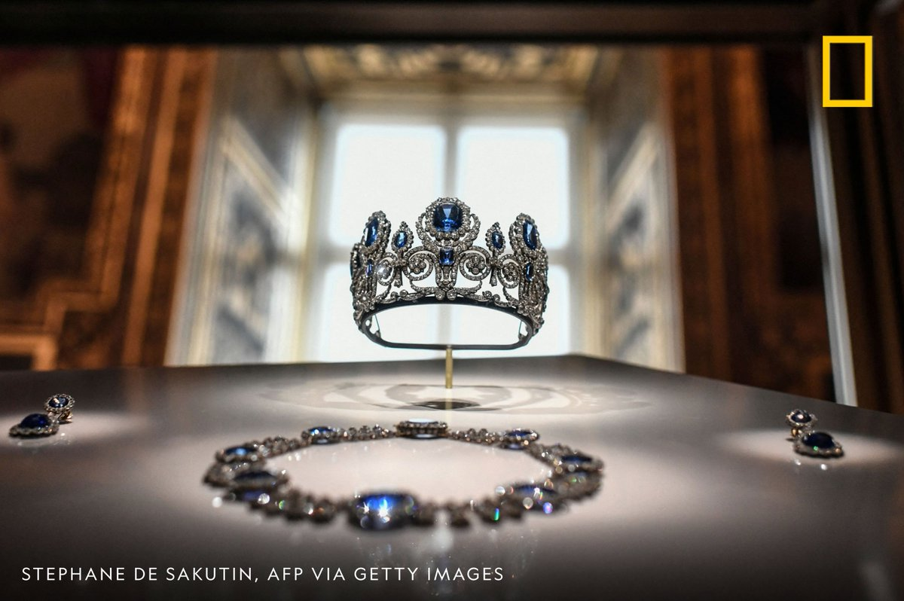

On October 19, 2025, four thieves executed a brazen seven-minute heist at Paris's **Louvre Museum**, stealing eight pieces from France's Crown Jewels valued at €88 million (`$102 million`). Disguised as construction workers in yellow and orange vests, they used a truck-mounted ladder to access the Apollo Gallery through a window at 9:30 AM, smashing display cases with angle grinders. The stolen Napoleonic-era treasures included emerald necklaces, sapphire tiaras, and diamond jewelry once worn by Napoleon's wives and French empresses. The thieves fled on powerful Yamaha scooters, dropping Empress Eugénie's damaged crown during escape. The heist exposed severe security gaps at the world's most-visited museum.

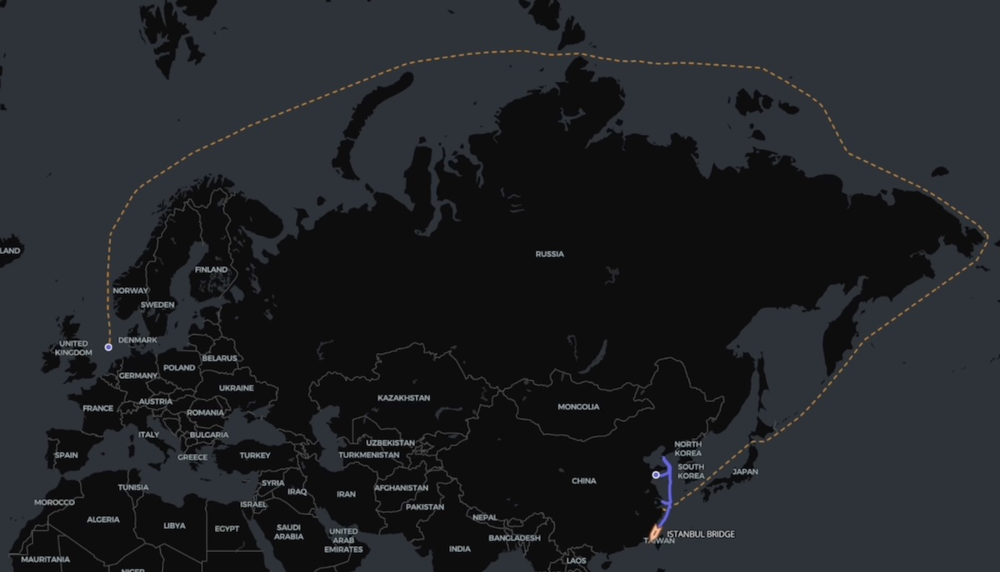

The Chinese containership Istanbul Bridge completed a record `20-day` journey from **Ningbo**-**Zhoushan** to the UK's **Felixstowe** port via the **Arctic Northern Sea Route**, covering `7,500` nautical miles—nearly half the distance of the traditional **Suez Canal route** which takes `40-50 days`. The vessel crossed Russia's Northern Sea Route in just 5 days without icebreaker escort, marking the first liner-type service connecting multiple Chinese and European ports via the polar region. The company highlighted reduced emissions and `40%` lower business inventory requirements, though environmental advocates warned about local emissions impact. This summer saw record Arctic containership activity with over `20` transits, as shipping companies explore faster alternatives for Asian goods delivery.

## Economy & Finance

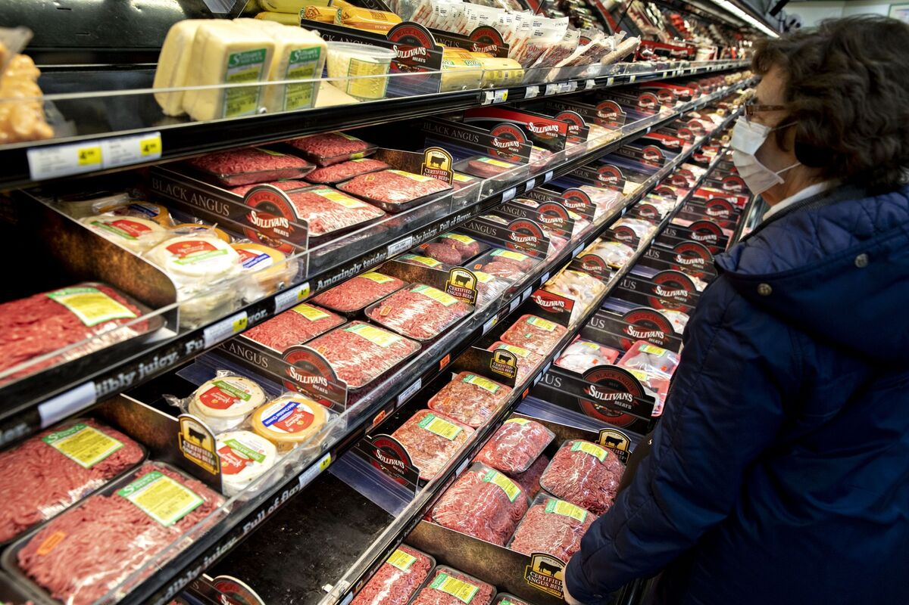

US inflation rose to `3%` in September 2025, up from `2.9%` in August—the highest rate since January. Consumer prices increased `0.3%` monthly, driven primarily by a `4.1%` surge in gasoline prices. Core inflation (excluding food and energy) remained at `3%`, with evidence that Trump's tariffs are impacting prices for apparel, furniture, footwear, and appliances. The typical American household now spends `$208` more monthly than a year ago due to inflation. Released during the government shutdown, the report signals the Federal Reserve will proceed with a quarter-point interest rate cut at its October 29 meeting.

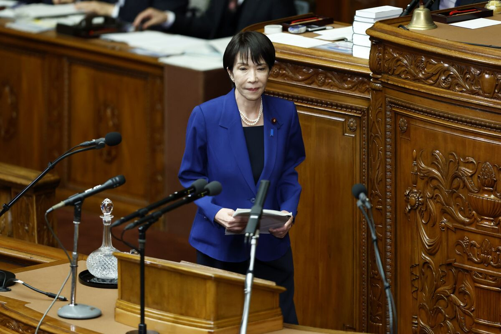

**Sanae Takaichi**'s surprise victory as **Japan**'s Liberal Democratic Party leader has galvanized investors with enthusiasm for her pro-stimulus agenda. Markets erupted in celebration as stocks soared to record highs, with traders betting she'll revive "Abenomics"—aggressive government spending paired with easy monetary policy. However, the euphoria split sharply: while equities rallied on hopes of cheap money fueling growth, the yen plummeted to historic lows and long-term bonds sold off heavily. Investors are anticipating a familiar pattern under Japan's likely first female prime minister—generous fiscal stimulus, a dovish central bank, and policies favoring exporters and growth over currency strength and fiscal restraint.

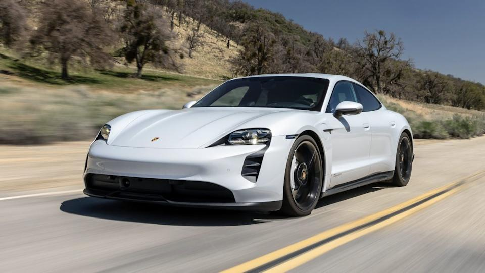

**Porsche** suffered its first quarterly loss as a public company—`$1.1 billion`—marking a stunning reversal from the previous year's profit. The crisis stems from a failed electric vehicle strategy, with the luxury automaker taking a `$3.6 billion` hit from scrapping battery production plans and delaying EV launches. U.S. tariffs cost roughly `$700 million`, while Chinese demand collapsed as domestic competitors offered superior technology at lower prices. The company's profitability margin plummeted from `14%` to just `2%`, forcing thousands of job cuts and prompting executives to acknowledge market conditions won't improve soon. Porsche is now reversing course, adding combustion engines back to originally planned EVs.

## Science

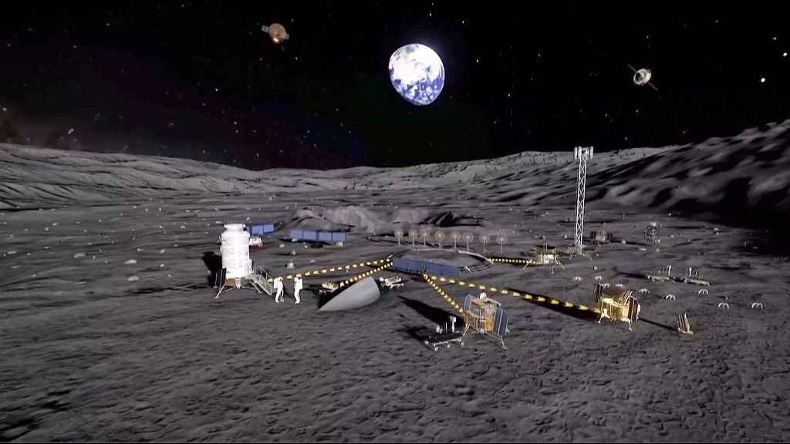

**China**'s **Chang'e-7** lunar mission, scheduled to launch in **August 2026**, will be humanity's first mission to confirm the presence of water ice at the moon's south pole. The space agency reports smooth progress with all international payloads from seven partners—including **Egypt**, **Bahrain**, **Italy**, **Russia**, **Thailand**, **Switzerland**, and **Hawaii**'s International Lunar Observatory Association—already delivered. The complex spacecraft will include an orbiter, lander, rover, hopper, and relay satellite to study the lunar south pole environment and search for water ice in permanently shadowed craters. This vital resource could be converted into drinking water, breathable oxygen, and rocket fuel for future crewed exploration, making it crucial for establishing lunar bases.

**Pfizer** CEO Albert Bourla warned that China has surpassed the US in pharmaceutical patent filings for the first time in history—a dramatic reversal from just five years ago when the US held a `90%-10%` advantage. China's rapid rise stems from surging R&D spending, regulatory reforms, and a national strategy prioritizing life sciences. Bourla noted China now rivals the US in clinical trials and leads in CRISPR gene editing publications, attracting significant private biotech investment. He urged American policymakers to focus less on slowing China and more on revitalizing domestic innovation through regulatory stability.

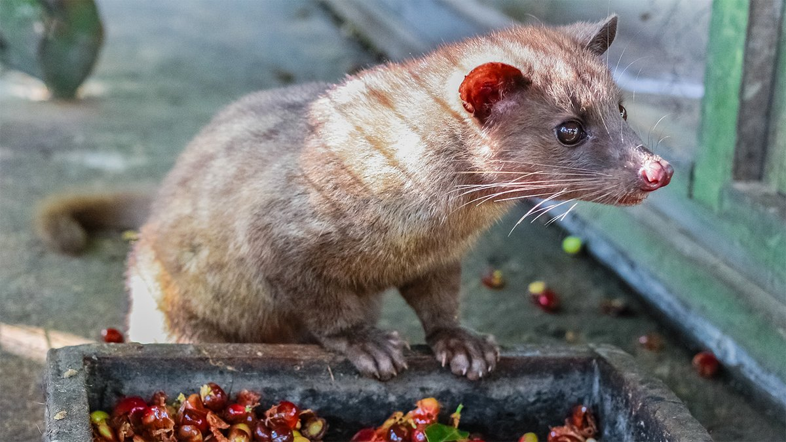

Scientists have confirmed that coffee beans pooped out by Asian palm civets are genuinely tastier than regular beans. Chemical analysis reveals why: as beans pass through the civet's digestive system, fermentation increases fat content and aromatic compounds while reducing bitterness-causing caffeine and protein. This unique digestive process adds dairylike flavors from fatty acids and creates civet coffee's prized smooth, low-bitter taste profile. Researchers in India analyzed `68`fecal samples, comparing civet-processed beans to unpicked ones. The findings validate why these poop-derived beans command extraordinary prices of `$600-$1,300` per pound—they're chemically distinct and demonstrably more flavorful.

## Lifestyle, Entertainment & Culture

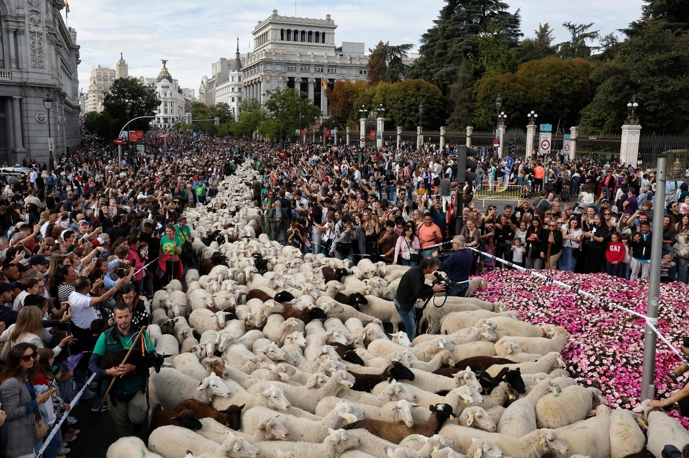

On October 19, 2025, **Madrid**'s streets transformed into a pastoral spectacle as `1,100` Merino sheep and `200` goats paraded through the Spanish capital during the annual **Transhumance Festival**. Held since 1994, the event honors ancient grazing rights dating back to a 1418 agreement, with shepherds paying a symbolic toll of 50 maravedis (medieval coins) to city hall. Thousands watched as the flock traveled from Casa de Campo through famous landmarks like Gran Vía and Puerta del Sol. The festival celebrates rural heritage while highlighting environmental benefits—livestock clear flammable undergrowth, reducing wildfire risks by 20%. The 2025 event returned after cancellation in 2024 due to bluetongue disease.

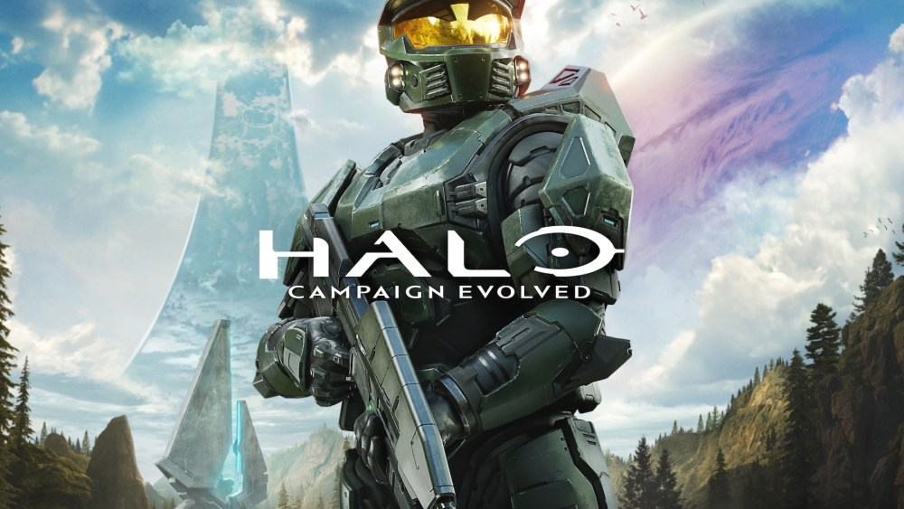

**Microsoft** announced that its flagship **Halo** franchise is coming to PlayStation 5 for the first time in 2026 with "**Halo: Campaign Evolved**", a modernized remake of the original 2001 game rebuilt in **Unreal Engine 5**. The campaign-only release features upgraded visuals, refined controls, three new prequel missions with Master Chief and Sgt. Johnson, nine additional weapons including the energy sword, and vehicle hijacking capabilities. It supports two-player split-screen couch co-op on console and four-player online co-op with crossplay between PlayStation, Xbox, and PC. The announcement at Halo World Championship 2025 marks a significant strategic shift for Microsoft, bringing its iconic exclusive franchise to a competing platform for the series' 25th anniversary.

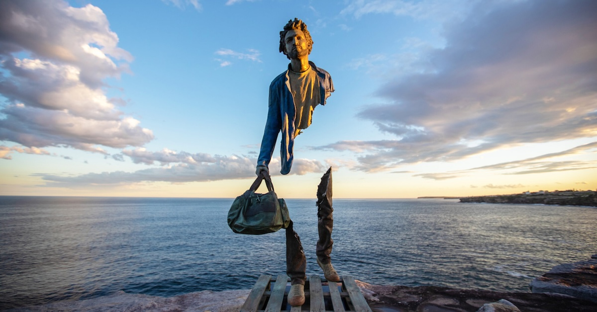

**Sculpture by the Sea** returned to **Sydney**'s Bondi to Tamarama coastal walk from October 17 to November 3, 2025, for its 27th edition. The world's largest free outdoor sculpture exhibition features over 100 artworks by artists from 18 countries, including Australia, China, Japan, Brazil, and Denmark. The iconic event, nearly cancelled due to a `$200,000` funding shortfall, was saved by NRMA Insurance and private donors. Approximately `450,000` visitors are expected to walk the 2-kilometer clifftop path viewing sculptures ranging from whimsical dolphins leaping from toasters to massive abstract installations. Highlights include first-time exhibitor Tim Storrier and seven artists marking their 20th year participating.

**The Odeon of Herodes Atticus**, **Athens**' ancient marble theater beneath the **Acropolis**, held its final performance on October 16, 2025, before closing for extensive restoration expected to last at least three years. The 2nd-century amphitheater, which has hosted legendary performers from **Maria Callas** to **Coldplay** over recent decades, will undergo its first long-term closure in years. Culture Minister Lina Mendoni confirmed the reopening depends on ongoing structural studies. The closure marks a significant pause for the venue that serves as the heart of the Athens Epidaurus Festival and represents a deeply personal loss for generations of audiences.

## Sports

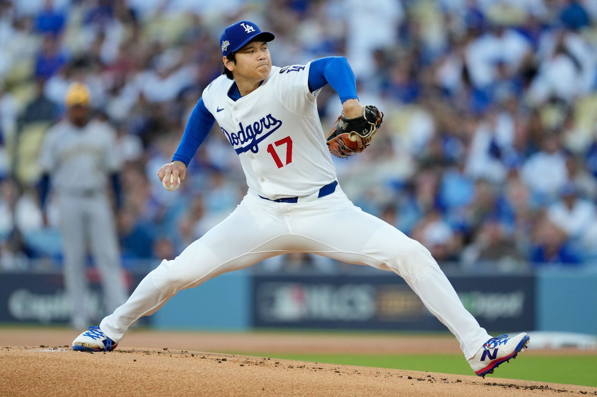

**Los Angeles Dodgers** superstar **Shohei Ohtani** delivered what many are calling the greatest baseball performance in history during Game 4 of the National League Championship Series on October 17th. In an absolutely jaw-dropping display, Ohtani became the first pitcher ever to hit three home runs in a playoff game while dominating on the mound with six scoreless innings and 10 strikeouts. His monster `469-foot` blast cleared Dodger Stadium entirely. Dodgers manager Dave Roberts declared it "the greatest postseason performance of all time." The mind-bending two-way masterpiece earned Ohtani NLCS MVP honors as the Dodgers swept Milwaukee 5-1 to reach the World Series.

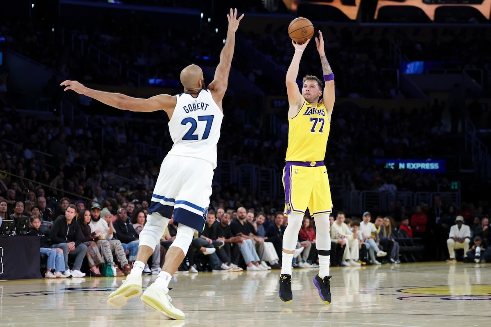

**Los Angeles Lakers** superstar **Luka Doncic** made NBA history in his first two games of the 2025-26 season with back-to-back 40-point performances. In the season opener against Golden State, Doncic scored `43` points with `12` rebounds and `nine` assists, though the Lakers lost 119-109. He followed up with an even more explosive `49` points in a 128-110 victory over Minnesota, adding `11` rebounds and `eight` assists while scoring 32 points in the first half alone. Doncic became just the fourth player ever to start a season with consecutive 40-point games, joining **Michael Jordan**, **Wilt Chamberlain**, and **Anthony Davis**.

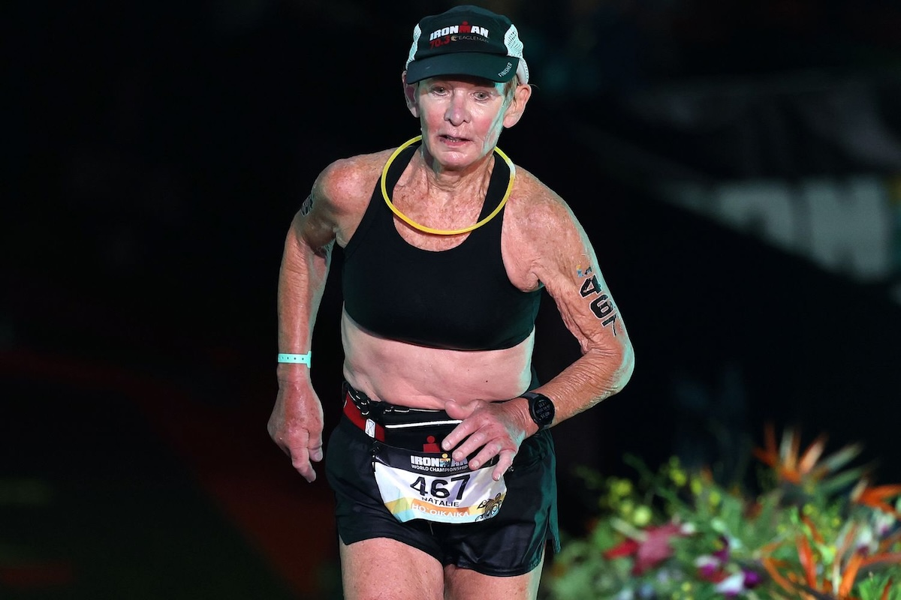

Natalie Grabow, an `80-year-old` grandmother from New Jersey, became the oldest woman to finish the **Ironman World Championship** in Kailua-Kona, **Hawaii** on October 11, 2025. She completed the grueling triathlon—consisting of a `2.4-mile` swim, `112-mile` bike ride, and full marathon—in `16 hours, 45 minutes, and 26 seconds`, beating the 17-hour cutoff. Remarkably, Grabow only learned to swim at age 59 specifically to compete in triathlons. This was her 11th Ironman World Championship at Kona. A former software engineer, she was the sole competitor in the 80-84 age group and outlasted over 60 younger athletes who failed to finish. She's already signed up for two half-Ironman races in 2026.

American mountaineer Jim Morrison, 50, made history on October 15, 2025, by becoming the first person to ski down **Mount Everest**'s treacherous Hornbein Couloir on the North Face. The four-hour-five-minute descent included sections where he had to rappel `650 feet` through areas devoid of snow. Morrison dedicated the feat to his late partner, Hilaree Nelson, spreading her ashes at the summit before descending. Nelson died in an avalanche while skiing Manaslu in 2022, and the couple had planned to ski the Hornbein Couloir together. French snowboarder Marco Siffredi disappeared attempting the same route in 2002. The historic run will be featured in an upcoming documentary by Jimmy Chin and Chai Vasarhelyi.

## This Day in History

On this day **October 25, 1881**, **Pablo Picasso** was born in Málaga, **Spain**. The son of an art professor, the precocious young Spaniard demonstrated extraordinary talent from childhood, holding his first exhibition at age 13. He would go on to revolutionize 20th-century art, co-founding **Cubism** with **Georges Braque** and pioneering collage and constructed sculpture. Across nearly 80 years of relentless creativity, Picasso produced over `50,000` works spanning paintings, drawings, sculptures, and ceramics. His masterpieces—from the proto-Cubist "Les Demoiselles d'Avignon" to the haunting anti-war "Guernica"—transformed modern art forever, establishing him as perhaps the most influential artist of his era.

## Art of the Week

**Pablo Picasso**'s portrait "Bust of a Woman with a Flowered Hat (Dora Maar) 1943" sold for `$31 million` at Paris auction Friday after eight decades hidden from public view. The Spanish artist, one of history's most influential painters, created this work depicting his longtime muse Dora Maar during a pivotal emotional moment—as their relationship was ending. The painting exemplifies Picasso's genius through its vivid, unvarnished colors and expressive power, part of his "Woman in a Hat" series. The sale marks the highest price paid for artwork at French auction this year, though modest compared to Picasso's auction records reaching `$179 million`, underscoring his enduring dominance in the global art market.

## Funny

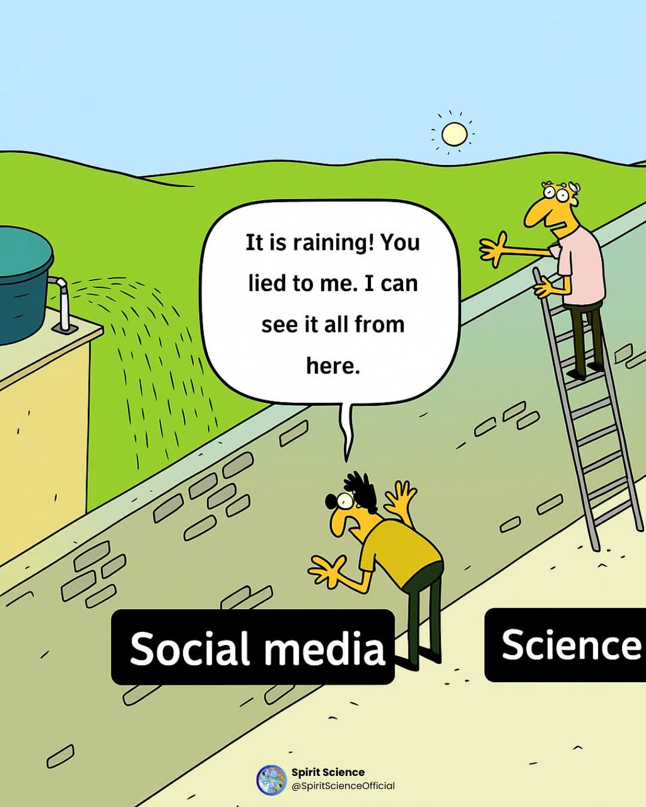

---

## Previous Issues

---

October 11, 2025, **[Djokovic Falls to Vacherot at 2025 Shanghai Masters](https://weekly.sundayblender.com/p/djokovic-falls-to-vacherot-at-2025-shanghai-masters)**

September 27, 2025, **[150x Acceleration from Ford Model T to BYD Yangwang U9 Extreme](https://weekly.sundayblender.com/p/1500x-acceleration-from-ford-model-to-to-byd-yangwang-u9-extreme)**

September 20, 2025, **[All You Need Is Another AI Research Report](https://weekly.sundayblender.com/p/all-you-need-is-another-ai-research-report)**

---

Thanks for reading! If you enjoy this newsletter, please share it with friends who might also find it interesting and refreshing, if not for themselves, at least for their kids.