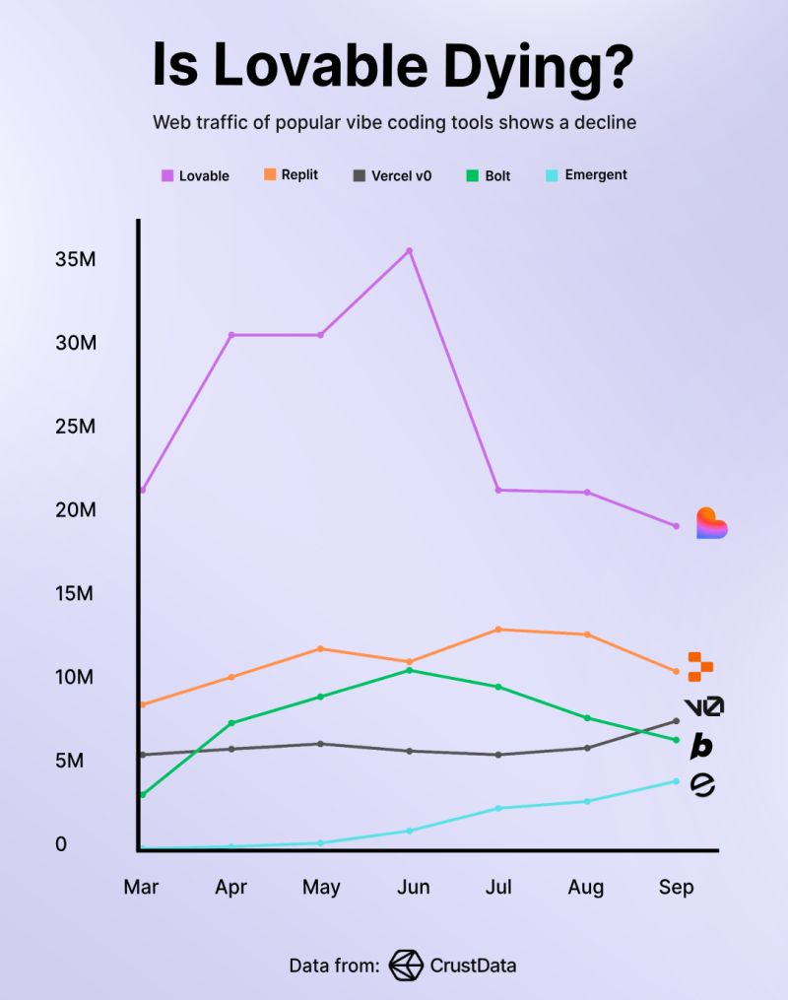
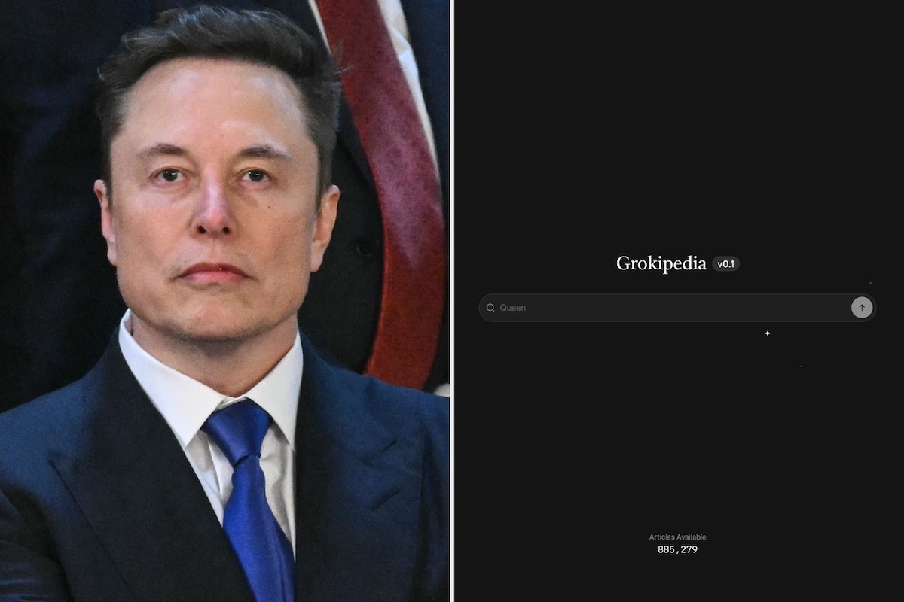
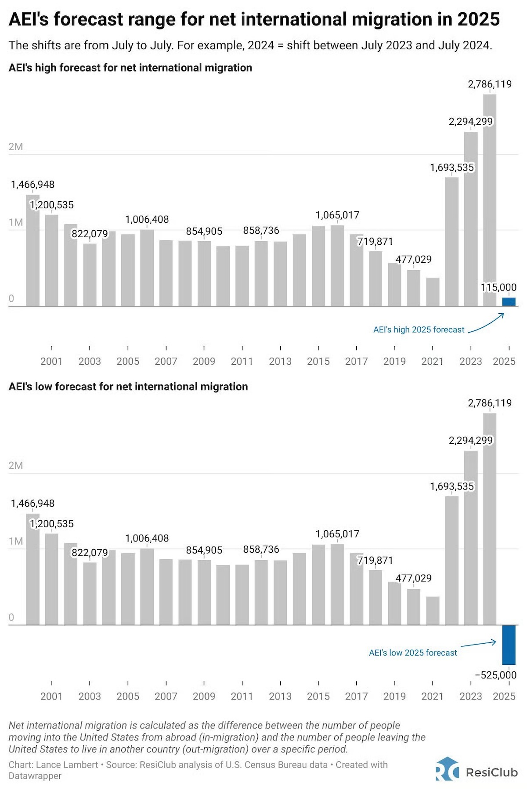
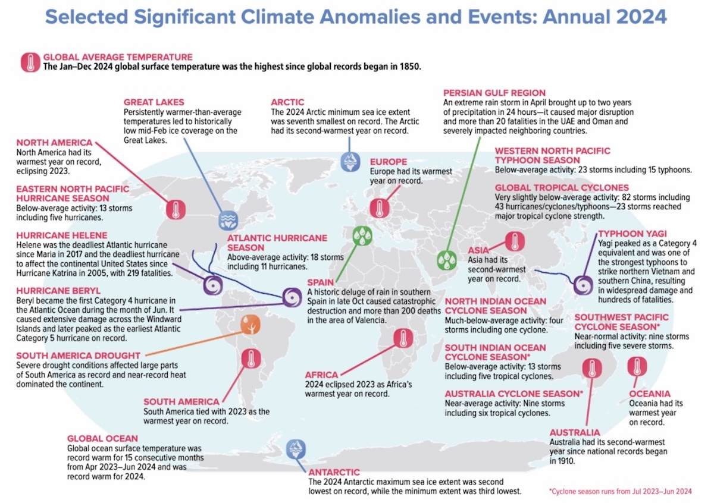

## Editor's Words

People still came out in droves on the streets, not necessarily dressed in Halloween costumes, but seeking out other free-spirited party-crashers and hoping for serendipitous encounters.

Holding a year's supply of candy in their hands, boys screamed and laughed in the elevators, pressing buttons for 10 floors at a time. The delivery bros frowned and were not amused.

A burst of such gleeful joy on Friday is all we need.

## Tech

**NVIDIA** held its GTC conference October 27-29 in Washington, D.C., where CEO **Jensen Huang** unveiled major AI and robotics initiatives. Key announcements included partnerships with **Uber** to launch `100,000` self-driving robotaxis by 2027, a collaboration with **T-Mobile** and **Nokia** on AI-powered 6G wireless networks, and seven quantum supercomputers for the U.S. Department of Energy. NVIDIA introduced new Blackwell Ultra AI chips and the compact DGX Spark desktop supercomputer for developers. The company also released blueprints for building massive AI data centers and announced manufacturing expansion in Arizona. Over `9,000` attendees participated in` 70+` sessions focused on AI, robotics, and accelerated computing.

"**The State of Chinese AI Apps 2025**" released by Tech Buzz China in late October, reveals a striking paradox: China's AI applications achieve massive user reach but lag significantly in revenue generation. As of August 2025, the top 100 Chinese AI companies reached `4.78 billion` monthly active users globally, with China accounting for `46%` (2.2 billion MAUs). Six of the ten largest AI platforms by scale are China-based, including **Baidu** (`730 million` users), **ByteDance**, **DeepSeek**, and **Alibaba**. However, monetization remains challenging. Most Chinese AI firms focus on infrastructure and enterprise contracts rather than consumer subscriptions, hampered by competitive pricing, limited willingness to pay, and a culture of free services. The report highlights that user reach and revenue growth no longer correlate—real advantage comes from embedding AI into workflows rather than showcasing isolated features. Key companies profiled include Butterfly Effect's **Manus** ($91M revenue), **Zuoyebang** (edtech), and **Glority** (computer vision tools).

No-code AI tools like **Lovable** are experiencing a significant slowdown in late 2025. After hitting `$100 million` in annual recurring revenue in June, Lovable's traffic dropped `40%` by October. **Vercel**'s v0 fell `64%` since May, while **Bolt.new** declined `27%`. A METR study found AI coding tools actually slow experienced developers by `19%`, contradicting expectations. **Barclays** analysts warn of "questionable economics" as monthly subscribers leave quickly. The tools struggle beyond prototypes—users hit walls when code gets complex. Heavy users cost companies too much, forcing price increases amid falling traffic. The market appears to be entering a "trough of disillusionment" after initial hype.

**Elon Musk** launched **Grokipedia** on October 27, 2025, an AI-powered encyclopedia created by his company **xAI** to rival **Wikipedia**. Starting with `885,000` articles compared to Wikipedia's `7 million`, the site uses Musk's Grok AI to generate content. Musk promoted it as a less biased alternative to what he calls "Wokepedia," aiming to "purge out the propaganda." The website crashed hours after launch but returned online. Critics quickly noted many articles were copied directly from Wikipedia, while others promoted right-leaning perspectives or omitted Musk's controversies. Even Grok AI itself questioned whether Grokipedia was truly fair and unbiased, calling it "a critique wearing encyclopedia clothing."

**Visa** announced on October 28, 2025, that it's adding support for four new stablecoins across four different blockchains, representing two currencies convertible to over 25 fiat currencies. CEO Ryan McInerney revealed this during the company's fourth-quarter earnings call, noting that stablecoin-linked Visa card spending quadrupled year-over-year. Visa already supports stablecoins including USDC, Euro Coin, PayPal USD, and Global Dollar on **Ethereum**, **Solana**, **Stellar**, and **Avalanche** networks. Since 2020, Visa has facilitated over `$140 billion` in crypto and stablecoin flows. The company now operates more than `130` stablecoin-linked card programs across `40` countries and is enabling banks to mint their own stablecoins.

## Global

President **Donald Trump** and Chinese President **Xi Jinping** met on October 30th in **Busan**, **South Korea**, for nearly two hours to ease trade tensions between the world's two largest economies. Trump called the meeting a "12 out of 10" success. The leaders agreed that China would pause rare earth export restrictions for one year and resume buying American soybeans, while the U.S. would reduce tariffs on Chinese goods from `57%` to `47%`. They also discussed fentanyl control and technology exports. Trump plans to visit China in April 2026, with Xi visiting the U.S. afterward, continuing their personal diplomatic relationship.

The ninth **Future Investment Initiative (FII) summit**, known as "Davos in the Desert," took place October 27-30 in **Riyadh**, **Saudi Arabia**. Over `9,000` global leaders, investors, and CEOs gathered under the theme "The Key to Prosperity: Unlocking New Frontiers of Growth." Major announcements included `$8.6 billion` in UK-Saudi trade deals and a `$3 billion` data center project by HUMAIN and AirTrunk. Artificial intelligence dominated discussions, with speakers from **OpenAI** and the White House participating. Syrian President Ahmed al-Sharaa addressed regional reconstruction. Saudi Arabia showcased its economic transformation, with asset management surging `20%` to `$320 billion`, reinforcing Riyadh's position as a global investment hub.

## Economy & Finance

**The United States** may experience its first population decline since the 1918 Spanish flu epidemic. While births still exceed deaths, net immigration has turned sharply negative in 2025. The foreign-born population fell by approximately 1.5 million people in the first six months of this year due to deportations and people leaving voluntarily out of fear of detention. This demographic shift stems entirely from immigration policy changes including deportations, reduced refugee access, and discouragement of foreign students. The population decline has already slowed labor force growth, which means slower economic growth and potential labor shortages in key industries, likely leading to higher wages and prices.

## Nature & Environment

The **UK** ranked a shocking 59th out of 65 national groups for nature connectedness—making it one of the least nature-connected nations among developed countries, with only **Israel**, **Japan**, and **Spain** ranking lower. This places the UK far behind other European nations and highlights a crisis in how British adults relate to the natural world. The study of 56,968 adults found UK residents struggle to feel "oneness with nature" or understand how their actions affect the environment. While the UK performed better on physical nature exposure (31st), the psychological disconnection is stark. Researchers attribute this to significant socioeconomic barriers: financial insecurity, urban living, lower education, and racial minorities facing reduced access and belonging in natural spaces. This profound disconnect has serious implications for a developed nation's environmental stewardship and public health.

## Science

**The 2025 State of the Climate** report, published October 29 in **BioScience** by an international coalition led by **Oregon State University,** reveals that `22` of Earth's `34` vital signs are at record levels, with many trending sharply in the wrong direction. The report warns that 2024 was the hottest year in at least `125,000` years, with global temperatures exceeding `1.5°C` above pre-industrial levels for the first time. Ocean heat content, wildfire-related tree cover loss, and ice loss all reached record highs, while fossil fuel consumption also peaked despite renewable energy growth. The researchers warn of accelerating climate crisis risks, including potential tipping points like AMOC collapse, but emphasize swift action through fossil fuel phaseout and ecosystem restoration could still limit damage.

In 2025, both **Greenland** and **Antarctic** ice masses have reached record lows, marking a critical climate milestone. The Greenland and West Antarctic ice sheets may be passing irreversible tipping points that could commit the planet to meters of future sea-level rise. This alarming development comes as ocean heat content simultaneously hit record highs, accelerating ice melt. Scientists warn these ice sheets contain enough water to dramatically reshape coastlines worldwide if they continue melting. The potential crossing of these tipping points means even if global warming were halted today, the ice loss momentum could continue for centuries, threatening coastal cities and low-lying nations with catastrophic flooding.

**The Middlebury Institute of International Studies - MIIS** is widely regarded as the "Harvard" of translation and interpretation program in the Western Hemisphere—the only institution offering graduate degrees in conference interpretation for English-Chinese, English-Japanese, and English-Korean. The official supplier of translators to the Olympic Games since 1984, MIIS will close by June 2027 due to over `$25 million` in annual losses. While officially attributed to enrollment declines following the pandemic, the closure coincides with AI's dramatic disruption of the `$72.7 billion` language services industry. The International Association of Conference Interpreters warns this leaves America without any comprehensive conference interpreter training program. Though MIIS held events exploring AI's impact on translation careers, the existential question remains: can elite human translator training survive when AI translation tools advance exponentially?

## Lifestyle, Entertainment & Culture

**Halloween**, celebrated every **October 31st**, traces back over `2,000` years to the ancient Celtic festival of Samhain. The Celts believed that on this night, the boundary between the living and the dead blurred, allowing spirits to walk among us. When Christianity spread, the holiday merged with All Saints' Day. Irish immigrants brought Halloween to America in the 1800s, where it evolved into today's celebration of costumes, trick-or-treating, and carved pumpkins. Now a cultural phenomenon, Halloween generates billions in candy and costume sales, inspiring movies, decorations, and parties that blend spooky fun with community tradition worldwide.

The Chongyang Festival (重阳节), or **Double Ninth Festival**, celebrated on **October 29th** this year, is a 2,000-year-old Chinese tradition honoring the elderly and celebrating longevity. The name comes from the ninth day of the ninth lunar month—"nine" being a powerful yang (masculine) number in Chinese philosophy. Ancient legends tell of climbing mountains to escape disasters, establishing traditions still practiced today. Families hike together, drink chrysanthemum wine, eat special cakes, and visit ancestral graves to pay respects. In 1989, China officially designated it "Senior's Day," emphasizing filial piety and respect for elders—core Confucian values that remain central to Chinese culture.

## Sports

[`Soccer`] **Cristiano Ronaldo**s 15-year-old son, Cristiano Ronaldo Jr. (known as "Cristianinho"), was called up to Portugal's U-16 national team for the Federations Cup tournament in Turkey, running October 30 to November 4, 2025. He made his debut on October 30th as a 90th-minute substitute in Portugal's 2-0 victory over Turkey in Antalya. The young forward plays for Al-Nassr's youth academy in Saudi Arabia, the same club where his 40-year-old father stars. His progression through Portugal's youth system raises the tantalizing prospect that father and son could one day share the pitch wearing Portugal's colors together, a historic first in international football.

[`Soccer`] **Real Madrid** defeated **Barcelona** 2-1 in the first **El Clásico** of the season on October 26, 2025, at Santiago Bernabéu Stadium. **Kylian Mbappé** opened scoring in the 22nd minute after an assist from **Jude Bellingham**. Barcelona's Fermín López equalized in the 38th minute, but Bellingham restored Madrid's lead in the 43rd minute. Mbappé later missed a penalty saved by Barcelona goalkeeper Wojciech Szczęsny. Barcelona's Pedri was sent off with a second yellow card in stoppage time. The victory ended Real Madrid's four-game losing streak against Barcelona and extended their La Liga lead to five points.

[`Basketball`] **Denver Nuggets** superstar **Nikola Jokić** made NBA history by recording four consecutive triple-doubles to start the 2025-26 season, tying a record held by Oscar Robertson (1961-62) and Russell Westbrook (2020-21). On October 30th, the three-time MVP posted 21 points, 12 rebounds, and 10 assists in just 28 minutes during Denver's 122-88 rout of the New Orleans Pelicans, sitting out the fourth quarter due to a blowout. Jokić, who now has `168` career triple-doubles (third all-time), had the chance to become the first player ever to open a season with five straight triple-doubles when facing Portland on November 1st.

[`Baseball`] The 2025 World Series between the **Los Angeles Dodgers** and **Toronto Blue Jays** is tied 3-3, heading to Game 7 on November 1st in Toronto. Toronto dominated Game 1 (11-4), but the Dodgers' **Yoshinobu Yamamoto** threw complete games in Games 2 and 6 to even things up. Game 3 became the second-longest World Series game ever at 18 innings, ending with Freddie Freeman's walk-off homer. Toronto won Games 4 and 5 to take a 3-2 lead before the Dodgers forced Game 7. Los Angeles seeks back-to-back championships while Toronto pursues its first title since 1993.

[`Football`] The **New York Jets** finally won their first game of the 2025 season with a thrilling `38-37` comeback victory over the **Cincinnati Bengals** on October 27th. The previously winless 0-7 Jets trailed 31-16 entering the fourth quarter but staged a dramatic rally. Running back Breece Hall scored three touchdowns in the final 15 minutes, including a go-ahead TD pass to tight end Mason Taylor with under two minutes remaining. Hall became the first running back to throw a go-ahead touchdown pass in the final two minutes of regulation since the NFL merger. The comeback means there are no winless teams remaining in the 2025 NFL season.

## This Day in History

On **November 1, 1997**, the movie "**Titanic**" held its world premiere at the Tokyo International Film Festival. The film tells the story of Jack and Rose, two passengers from different social classes who fall in love aboard the doomed ship in 1912. Director James Cameron had spent over `$200 million` making it—the most expensive movie ever at the time. Many worried it would be a financial disaster. Instead, "Titanic" became a global phenomenon, earning over `$2 billion` worldwide and winning 11 Academy Awards, including Best Picture. It remained the highest-grossing film for over a decade. Its young male lead **Leonardo DiCaprio** went on to become one of the biggest movie stars of this generation.

## Art of the Week

This Ming Dynasty (1368-1644) painting by artist **Zhou Chen** is housed in the Tianjin Museum's collection and celebrates the Double Ninth Festival's themes of honoring elders. It depicts Tang Dynasty poet **Bai Juyi** (772-846) in his later years, living in seclusion at Xiangshan (east of modern-day Longmen Mountain, Luoyang). The painting shows Bai gathering with eight like-minded elderly companions to enjoy poetry, music, and nature together. Their retreat from worldly affairs and pursuit of harmony with the natural world embody the ideal lifestyle of ancient Chinese literati. The artwork perfectly captures the festival's spirit of respecting elders and celebrating longevity, making it an iconic representation of Double Ninth traditions.

## Funny

---

## Previous Issues

---

October 25, 2025, **[The Greatest Performance in Baseball History](https://weekly.sundayblender.com/p/the-greatest-performance-in-baseball-history)**

October 11, 2025, **[Djokovic Falls to Vacherot at 2025 Shanghai Masters](https://weekly.sundayblender.com/p/djokovic-falls-to-vacherot-at-2025-shanghai-masters)**

September 27, 2025, **[150x Acceleration from Ford Model T to BYD Yangwang U9 Extreme](https://weekly.sundayblender.com/p/1500x-acceleration-from-ford-model-to-to-byd-yangwang-u9-extreme)**

---

Thanks for reading! If you enjoy this newsletter, please share it with friends who might also find it interesting and refreshing, if not for themselves, at least for their kids.