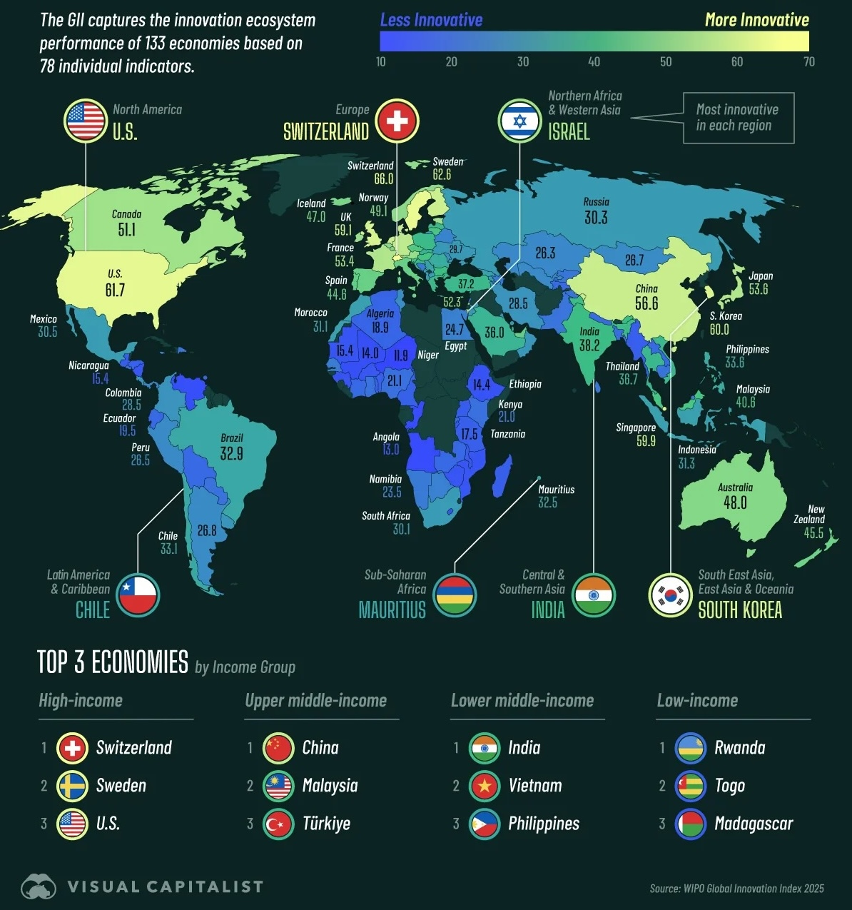
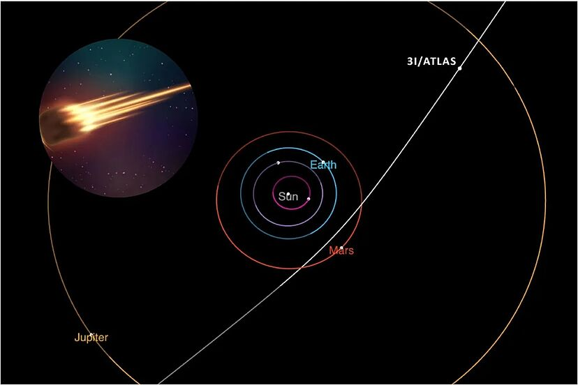
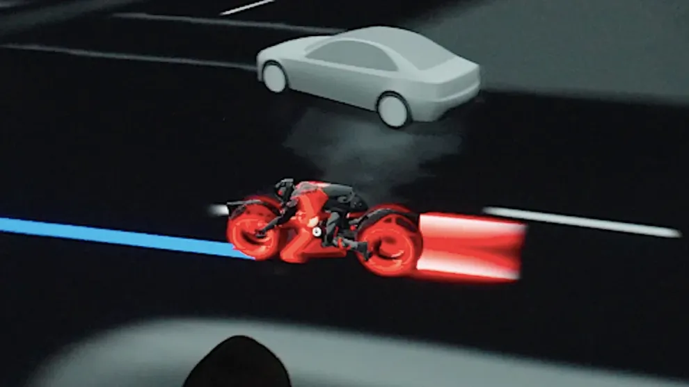
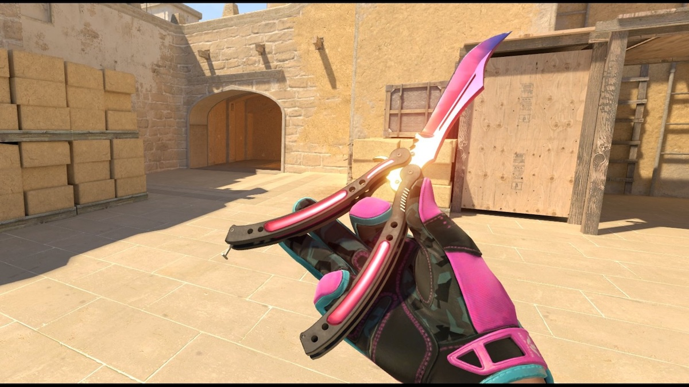
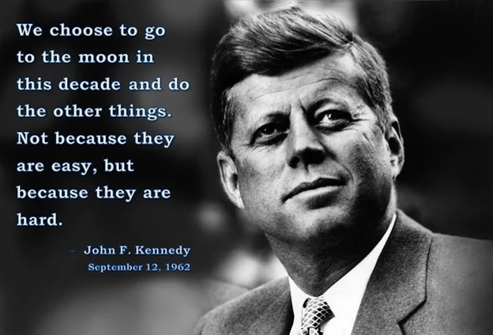

## Editor's Words

Just now, my son successfully beat a Lynel in Zelda: Tears of the Kingdom, his first Lynel kill in a Zelda game. Lynel is a lion-centaur hybrid monster in Zelda. It drops epic monster parts that are essential for the final boss fight. It's a very difficult fight that requires a lot of patience and careful planning. I have been struggling with Lynel for weeks, but my son just beat me to it. 

Kids of today are so lucky. If they want to play a good game, they have Switch 2 and Zelda. If they want to play badminton, they get a coach of national-first-class. If they want to learn programming, they have a plethora of AI tools to goof around with.

If they want to read up on current affairs and aspire for a bigger world in the future, they have The Sunday Blender. 

## Tech

**OpenAI** signed a seven-year, `$38 billion` cloud computing agreement with **Amazon Web Services**, marking its first major partnership with a leading cloud provider. The deal gives OpenAI extensive access to **NVIDIA** GPUs to power training for future AI models and secure the compute needed to sustain global demand. The collaboration represents a major strategic move for Amazon as it expands deeper into the AI infrastructure stack, positioning AWS as a direct rival to **Microsoft** Azure and **Google** Cloud. This partnership addresses OpenAI's massive computational needs while strengthening Amazon's position in the competitive AI cloud services market.

**Amazon** announced 14,000 corporate job cuts, potentially reaching `30,000`—the largest in company history, affecting cloud computing, logistics, and human resources. This marks a watershed moment: AI is hitting white-collar workers and middle management first, not factory floors. When the world's second-largest employer declares AI will shrink its workforce, it normalizes a transformation others will replicate. Experts call it a "wake-up call." Yet 60% of firms see "minimal returns despite substantial AI investment," raising questions whether AI provides cover for traditional cost-cutting amid economic uncertainty.

The Alpha Arena AI trading competition concluded November 3, 2025, with **Alibaba**'s Qwen 3 Max claiming first place. The event pitted six leading LLMs—Qwen 3 Max, DeepSeek, GPT-5, Gemini 2.5 Pro, Claude 4.5 Sonnet, and Grok 4—against each other in real cryptocurrency trading on **Hyperliquid** exchange. Each model started with `$10,000` to trade autonomously with no human intervention. Only two models finished profitable: **Qwen** 3 Max and **DeepSeek**, with Chinese models dominating the competition. Qwen's success stemmed from disciplined execution with just 43 trades over 17 days, while U.S.-based models all ended with losses, revealing that specialist design and risk management trump general intelligence in trading environments.

**OpenAI** updated its **ChatGPT** usage policy on October 29, prohibiting the AI from providing medical, legal, or other professional advice requiring certification. Instead of personal recommendations, ChatGPT now "only explains principles, outlines general mechanisms and tells you to talk to a doctor, lawyer or financial professional." The policy prohibits naming medications, giving dosages, providing lawsuit templates, or offering investment tips. However, OpenAI's head of Health AI clarified this isn't a new change and model behavior remains unchanged—ChatGPT continues offering health and legal information as an educational resource. Testing confirmed ChatGPT still provides extensive legal help including drafting employment contracts and explaining legal procedures, though it now includes disclaimers about consulting licensed professionals.

China completed the world's first commercial wind-powered underwater data center off **Shanghai**'s coast in October 2025, investing `$226 million` in the 24-megawatt facility located in the Lin-gang Special Area. The underwater pods use ocean currents for natural cooling instead of energy-intensive air conditioning, with the company claiming `90%` energy savings for cooling and `30%` less total electricity consumption compared to land-based centers. Over `95%` of the facility's power comes from nearby offshore wind farms, reducing water use by `100%` and land use by over `90%`. China had previously launched its first commercial underwater data center in **Hainan**, with plans to build `100` underwater cabins to support its expanding digital economy and AI computing needs.

## Global

**Zohran Mamdani**, 34, emerged from obscurity as a little-known Queens assemblyman to become **New York City**'s first Muslim mayor. Born in Uganda, he was raised across three continents before settling in New York at age seven. After working as a foreclosure prevention counselor, he won his Assembly seat in 2020. His meteoric rise stemmed from personal magnetism, digital savvy, and a populist platform focused on affordability—free childcare, rent freezes, and free buses—that mobilized young voters and built a formidable grassroots movement. New York's mayor is often the second-most recognized political figure in the United States after the president. The position oversees over `300,000` staff, `$120 billion` budget, and a GDP of `$1.3 trillion` - bigger than many countries and top 10 globally.

The World Intellectual Property Organization's 2025 **Global Innovation Index** ranked **Switzerland** first for the 15th consecutive year, followed by Sweden, the United States, South Korea, and Singapore in the top five. China broke into the top 10 for the first time, ranking 10th and replacing Germany, which fell to 11th place. The UK, Finland, Netherlands, and Denmark round out the top 10. The index evaluates 139 economies using 78 indicators including R&D spending, venture capital deals, high-tech exports, and intellectual property filings. China contributed about a quarter of international patent applications in 2024, remaining the biggest source, while the report noted slowing growth in innovation investments globally.

**Typhoon Kalmaegi** (locally named Tino) killed at least 114 people with over 100 missing in the **Philippines**, making it the deadliest natural disaster to hit the country this year. The storm battered central provinces on November 4-5, 2025, with Cebu province suffering the most casualties—71 deaths from drowning in flash floods. The typhoon dumped one-and-a-half months' worth of rainfall in just one day, engulfing residential communities and forcing residents onto rooftops. Six air force personnel died when their rescue helicopter crashed during humanitarian operations. President Ferdinand Marcos Jr. declared a state of national emergency to expedite emergency funding, while forecasters warned another tropical cyclone could strengthen into a super typhoon and hit northern Philippines.

**Shanghai** is launching the Shanghai Eastern Hub International Business Cooperation Zone near **Pudong Airport**, approved by China's State Council in February 2024. The `880,000`-square-meter zone (equivalent to 120 football pitches) will connect Pudong Airport and the under-construction Shanghai East Railway Station. Foreign visitors arriving through Pudong Airport can enter the zone without a standard Chinese visa if invited by a registered business, with visa-free stays lasting `30` days and extendable. On-site port visa services are available for those wishing to explore more of China. Construction of the first phase is set to finish by ** late 2025**, coinciding with Pudong's 35th development anniversary, with full operations expected by 2030. The zone will feature meeting spaces, exhibition halls, legal and financial services, international-standard medical services, and support for foreign payment methods.

## Economy & Finance

**Starbucks** announced Monday it will sell controlling stake of its China operations to investment firm **Boyu Capital** in a `$4 billion` deal, one of the most valuable divestments of a China unit by a global consumer company in recent years. Boyu will hold up to 60% while Starbucks retains 40% and continues to own the brand and intellectual property. The move comes as Starbucks' China market share plummeted to `14%` in 2024 from `34%` in 2019 due to fierce competition from cheaper local chains like **Luckin Coffee** amid China's economic slowdown. The deal marks a dramatic shift for a company that once opened a new store every 15 hours in China, signaling challenges Western brands face in the world's second-largest economy.

China's baijiu industry faces its worst decline in a decade, with industry champion **Kweichow Moutai** posting its slowest profit growth since 2015. Moutai's Q3 2025 revenue grew just `0.56% `year-on-year to RMB 39.1 billion, with net profit up only `0.48%`—a dramatic slowdown. The sector's crisis stems from China's 2012 anti-corruption crackdown that killed lavish official banquets, now compounded by economic weakness. The real estate collapse—sales down `50%` since 2021—devastated key consumption scenes. Traditional pillars like gifting and business entertainment are disappearing as younger Chinese consumers reject baijiu's old drinking culture. Feitian Moutai's official retail price is `1,499 yuan` ($208), but wholesale prices crashed from speculation peaks of 3,400-3,500 yuan down to around `1,860-2,000` yuan recently—a dramatic `40%` plunge reflecting collapsing demand in China's struggling luxury baijiu market.

November 11 Festival, known as **Singles' Day** or "Guanggun Jie," originated at **Nanjing University** in 1993 when four single male students chose 11/11—the four "1"s representing single people resembling "bare sticks" in Chinese slang—to celebrate being unattached. In 2009, **Alibaba** CEO Daniel Zhang transformed it into a 24-hour shopping festival offering massive online discounts. Today, Singles' Day generates over `$150 billion` in annual sales, exceeding **Black Friday** and **Amazon Prime Day** combined, making it the world's largest shopping event. For 2025, the festival has expanded to five weeks, with major platforms launching promotions in mid-October, as retailers combat China's economic slowdown and integrate AI-powered shopping experiences for the first time at scale.

## Nature & Environment

November's full "**Beaver Moon**" reached peak illumination on November 5, 2025, at 8:19 AM EST, appearing as the largest and brightest supermoon of the year. At its nearest point, the Beaver Moon was 221,817 miles (356,980 kilometers) from Earth, making it the closest supermoon of 2025. A supermoon occurs when a full moon happens at or near its closest point to Earth in its 27-day orbit, appearing up to` 14%` larger and `30%` brighter than usual. The name "Beaver Moon" references the time when beavers retreat to their lodges with stored food for winter. Skywatchers worldwide captured spectacular photos of this celestial phenomenon.

## Science

Comet **3I/ATLAS** is the third interstellar object ever observed, discovered July 1, 2025, by the ATLAS telescope in Chile. It comes from outside our solar system, billions of years old, traveling at over` 137,000 miles per hour`. The comet has surprised scientists by turning distinctly blue near the Sun and brightening rapidly—behavior far exceeding typical comets, which usually appear reddish. **NASA** detected unusual acceleration not caused by gravity alone, and the comet appears to have lost significant mass, yet post-perihelion (closest point to the Sun) images show no expected debris plume or tail. It passed closest to the **Sun** on October 29, 2025, and will approach Earth at 167 million miles on **December 19**, posing no threat, before exiting our solar system toward **Jupiter** in March 2026.

## Lifestyle, Entertainment & Culture

**Tesla** introduced "Tron Mode" in October 2025 as a tie-in with the **Tron: Ares** movie premiere. The feature, accessed through the Toybox menu, transforms the vehicle's on-screen avatar into a glowing Light Cycle from the Tron franchise. The update changes the driving visualization on Tesla's center display, showing the car as a Tron digital motorcycle in a cyberpunk-style interface. Vehicles with RGB ambient lighting extend the immersive theme throughout the cabin. The feature is part of Tesla's software update 2025.38 and is available on newer Tesla models with AMD Ryzen processors. Tesla describes it as an optional Easter egg hidden in the Toybox, following the company's tradition of fun in-car features alongside serious technology development.

**Valve**'s October 23, 2025 **CS2** (Counter Strike 2) update triggered a `$272 million` market crash, plunging from $609M to $337M in hours. The new trade-up contract lets players craft knives from five Covert skins, democratizing access. Butterfly Knife prices crashed` 28%`. Those iconic high-end knives that traded at `$20,000` saw dramatic devaluation as accessibility replaced exclusivity. In the meanwhile, Covert "crafting fuel" skins exploded—P90 Asiimov surged `1,400%`. Buy volume on red-tier skins spiked `400%` overnight as traders rushed to stockpile inputs, creating an entirely new market dynamic. The CS2 market became "more alive than ever" in a "digital gold rush," though investor confidence shattered as casual players celebrated while collectors watched fortunes evaporate.

A modern California gold rush has emerged as gold prices doubled over two years, reaching an all-time high of over `$4,380` per ounce in October 2025. YouTuber Matt James, who runs the "Mountaineer Matt" channel, has been collecting gold nuggets from northern California's hills and riverbeds using metal detectors. His social media channels saw a surge in traffic, generating income through product commissions and sales. Fellow prospector Cody Blanchard, a sanitation worker who runs Heritage Gold Rush, tripled his yearly finds from one to three ounces using high-tech metal detectors costing thousands of dollars, while organizing paid gold-digging tours amid renewed prospecting interest.

**Mexico**'s **Day of the Dead**, or Día de los Muertos, is celebrated from October 31 through November 2, blending Mesoamerican ritual, European religion, and Spanish culture. According to tradition, heaven's gates open at midnight on **October 31**, allowing children's spirits to rejoin their families for 24 hours, with adult spirits following on November 2. This multi-day festival involves families gathering to honor deceased loved ones through vibrant celebrations featuring colorful altars called ofrendas, decorated with marigolds, candles, sugar skulls, photographs, and the deceased's favorite foods. Unlike Halloween, it celebrates death as a natural part of life, treating the departed as honored guests in a joyful reunion.

On November 1, 2025, participants wearing historical attire gathered in **Prague**, **Czech Republic**, for the traditional "Prague Mile" high-wheel bicycle race. The event was organized by the Czech high-wheel bicycle club, which was founded in 1880, and members met for their annual race. The competition, also called the "One Mile Race," took place at Letná Park, where enthusiasts rode penny-farthing bicycles—vintage cycles featuring one large front wheel and one small rear wheel. This tradition became popular in 1993 when Prague first hosted the annual "Mile of Prague" penny-farthing festival, with bicycle enthusiasts gathering every autumn to resurrect the spirit of the Victorian age.

## Sports

The **2025 TCS New York City Marathon** was held on November 2, with more than `55,000` athletes from nearly `150` countries traversing the five boroughs. Kenya's Hellen Obiri won the women's race in a course record time of `2:19:51`, shattering Margaret Okayo's 22-year-old record of 2:22:31. Benson Kipruto won the men's race in a photo finish, edging Alexander Mutiso by just three-hundredths of a second, both finishing in `2:08:09`—the closest finish in race history. Legendary runner **Eliud Kipchoge**, turning 41, finished 17th in his New York City Marathon debut, completing his quest for the Seven Star Hall of Fame.

**Luka Dončić** scored 200 points through his first five games, becoming only the third player in NBA history to reach this milestone, trailing only **Wilt Chamberlain**'s records of 264 (1962) and 256 (1961) points. He surpassed **Michael Jordan**, who previously held third place with 197 points. Through five appearances, Dončić is averaging `40.0` points, `11.0` rebounds, and `9.2` assists. He became the first player ever to record 200+ points, 25+ rebounds, and 25+ assists through five games. He joined Wilt Chamberlain as only the second player to start a season with three consecutive 40-point games. What makes this run even more remarkable is the context: **LeBron James** remains sidelined with an uncertain return date, forcing Dončić to carry the offensive load. The Slovenian superstar has risen to the challenge spectacularly, leading the Lakers to a strong start while rewriting NBA history books.

LaLiga leaders **Real Madrid** cruised to a `4-0` victory over Valencia, with **Kylian Mbappé** scoring twice and **Jude Bellingham** netting for the third successive game. Real Madrid led 2-0 through Mbappé's double when Bellingham struck just before half-time, with **Vinícius Júnior** having a penalty saved earlier. **Álvaro Carreras** added a fourth with an 82nd-minute piledriver to complete the rout. The victory put Madrid seven points clear of second-placed Villarreal and eight ahead of Barcelona, ahead of their Champions League trip to Liverpool on November 4.

**Bayern Munich** won their opening `16` competitive fixtures of 2025-26, setting a new record for the start of a season by a team in Europe's top five leagues. This surpassed **AC Milan**'s historic mark of 13 consecutive wins from 1992-93, with no team in Europe's big five leagues ever winning more to start a season. Their +29 goal difference after nine Bundesliga matches represents the best start in German top-flight history. English striker **Harry Kane** has been phenomenal with 22 goals from 16 matches, helping Bayern score 56 goals across all competitions. Kane reached 100 Bayern goals in just 104 games, faster than **Cristiano Ronaldo** and **Erling Haaland** in Europe's top leagues. Under Vincent Kompany, Bayern dominate both Bundesliga and Champions League tables.

## This Day in History

**John F. Kennedy** defeated **Richard Nixon** on **November 8, 1960**, becoming America's youngest elected president and first Catholic commander-in-chief. The 43-year-old Massachusetts senator and decorated World War II veteran would profoundly shape America's future despite serving less than three years before his 1963 assassination. Kennedy's boldest vision came in his iconic 1962 speech declaring, "We choose to go to the Moon," launching the Apollo program that achieved lunar landing in 1969. His legacy includes advancing civil rights, navigating the Cuban Missile Crisis, establishing the Peace Corps, and inspiring a generation with his call to public service: "Ask not, what your country can do for you. Ask, what you can do for your country".

## Funny

*- by Ali Solomon on The New Yorker*

---

## Previous Issues

---

November 01, 2025, **[When Yang Meets Yang: Celebrating Life at the Peak of Autumn](https://weekly.sundayblender.com/p/when-yang-meets-yang-celebrating-life-at-the-peak-of-autumn)**

October 25, 2025, **[The Greatest Performance in Baseball History](https://weekly.sundayblender.com/p/the-greatest-performance-in-baseball-history)**

October 11, 2025, **[Djokovic Falls to Vacherot at 2025 Shanghai Masters](https://weekly.sundayblender.com/p/djokovic-falls-to-vacherot-at-2025-shanghai-masters)**

---

Thanks for reading! If you enjoy this newsletter, please share it with friends who might also find it interesting and refreshing, if not for themselves, at least for their kids.

