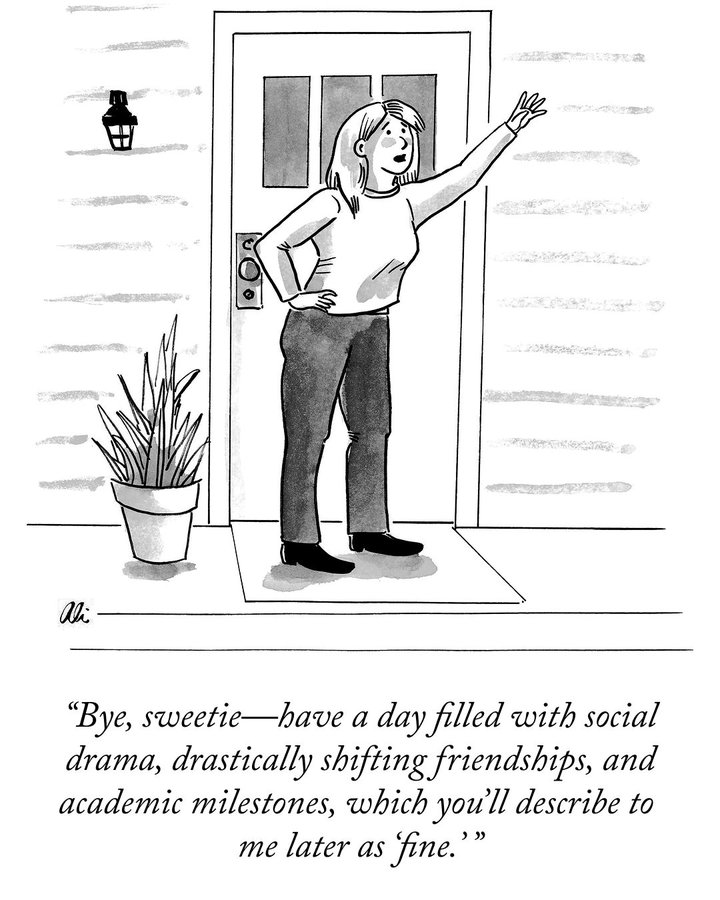

## Tech

Amazon and OpenAI's $38 billion deal

Alpha Arena's result

chatGPT stopped giving advice as lawyer or doctor

Chinese AI and Humanoid robot made Time magazine's best inventions of 2025 list

wind-powered and underwater data center

## Global

Indonesia on trash

The world's most innovative countries

Philippines's typhoon

## Economy & Finance

Starbucks is out of China

## Nature & Environment

A national park is created in Sydney to protect koalas

## Science

Nature's article about restoring a blindman's vision

## Lifestyle, Entertainment & Culture

introduce 11-11 光棍节 in China

Tesla's Tron mode

AliExpress' electric bike

## Sports

## This Day in History

## Art of the Week

## Funny

*- by Ali Solomon on The New Yorker*

---

## Previous Issues

---

November 01, 2025, **[When Yang Meets Yang: Celebrating Life at the Peak of Autumn](https://weekly.sundayblender.com/p/when-yang-meets-yang-celebrating-life-at-the-peak-of-autumn)**

October 25, 2025, **[The Greatest Performance in Baseball History](https://weekly.sundayblender.com/p/the-greatest-performance-in-baseball-history)**

October 11, 2025, **[Djokovic Falls to Vacherot at 2025 Shanghai Masters](https://weekly.sundayblender.com/p/djokovic-falls-to-vacherot-at-2025-shanghai-masters)**

---

Thanks for reading! If you enjoy this newsletter, please share it with friends who might also find it interesting and refreshing, if not for themselves, at least for their kids.

