## Editor's Words

Rock is not really a thing anymore in China. But when I see thousands of people jumping up and down on the arena floor in Kuala Lumpur, Malaysia, on Nov 12, I know the spirit is still there, just brewing in some unlikely corners. 

Not just in China. Does anyone still rock in America? The last three rock bands I listened to were Smashing Pumpkins, Oasis, and X-Japan. Music is not the same anymore after that.

Many things have changed: music, the web, and news. 

Sometimes, they are still better in the old-fashioned way. 

## Tech

AI coding startup **Cursor** raised a landmark `$2.3 billion` Series D funding round that propelled the company to a `$29.3 billion` valuation. The funding round was among the largest venture capital raises in recent tech history and highlights the massive investor interest in AI-powered development tools. Cursor has been gaining significant traction as developers increasingly adopt AI assistance for coding tasks. The enormous valuation reflects growing confidence in AI's ability to transform software development and the competitive race among tech companies to dominate the AI coding assistant market. The funding will enable Cursor to accelerate product development and expand its engineering capabilities.

**Google** announced a massive `$40 billion` investment in **Texas** through 2027, marking its largest commitment to any U.S. state. This funding is primarily aimed at building new Cloud and AI infrastructure, including three new data center campuses in Armstrong and Haskell Counties. The investment will create thousands of jobs and fund workforce development programs for electrical workers and apprentices, strengthening the state's technical talent. Furthermore, Google is expanding its energy initiatives, including adding renewable energy capacity to the Texas grid and establishing a `$30 million` Energy Impact Fund. This move solidifies Texas's role as a major hub in the global AI race.

## Global

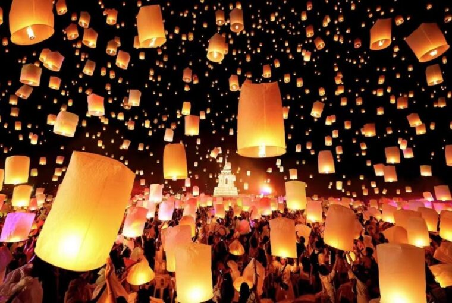

**Chiang Mai**, Thailand's enchanting **Yi Peng** and **Loy Krathong** festivals took place on November 5-6, 2025, coinciding with the full moon of the 12th lunar month. Yi Peng featured thousands of glowing sky lanterns (khom loi) released into the night sky to symbolize letting go of misfortune and welcoming blessings, while Loy Krathong involved floating decorated baskets (krathongs) made of banana leaves and flowers on rivers to honor the water goddess. Due to safety regulations, sky lanterns were banned in the city center, so organized ticketed events were held outside the city at venues like CAD Cultural Center and I Love Ban Thi, featuring ceremonies, cultural performances, traditional buffets, and fireworks. Free celebrations occurred throughout Chiang Mai at the Ping River, Tha Phae Gate, and temples decorated with colorful lanterns, parades, and traditional Lanna dance performances.

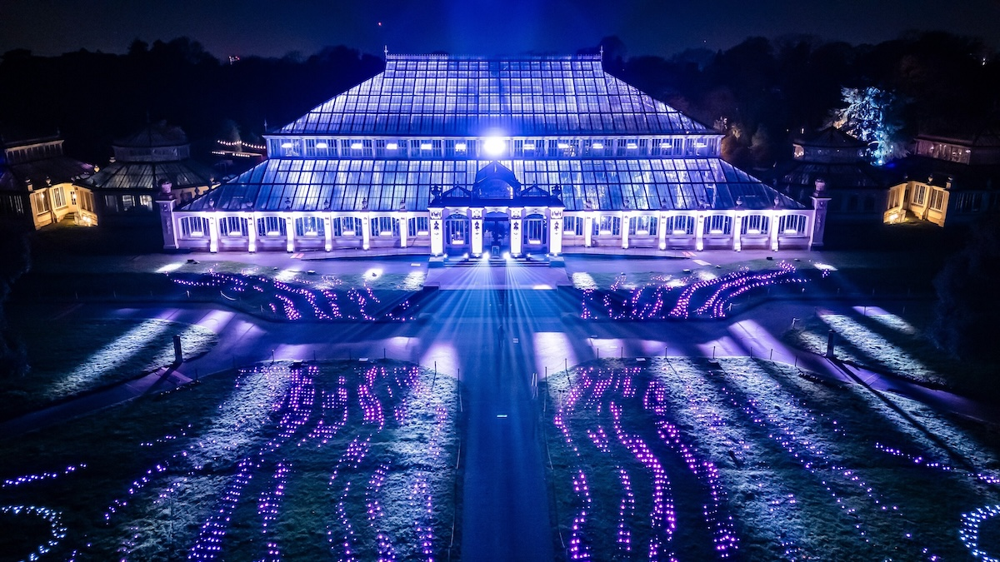

Christmas at Kew, London's original festive light trail, has been a beloved seasonal tradition since 2013, pioneering illuminated winter events across the UK. Now in its twelfth year, the event attracts over `2.5 million` annual visits to the **UNESCO** World Heritage Site. The 2025 edition runs **November 14** to **January 4**, featuring eight world premiere installations including the first-ever illumination of the historic 18th-century **Great Pagoda**. The 3km trail showcases new interactive displays, the stunning **Temperate House** finale, and returning favorites like the Fire Garden and Christmas Cathedral. Visitors enjoy festive food, Father Christmas visits, and botanical beauty transformed by dazzling lights.

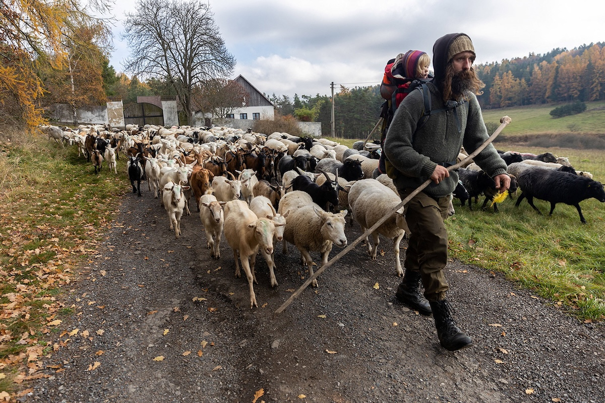

In November 2025, a Czech shepherd led his flock of sheep and goats on a four-day trek from summer pastures in the Brdy Hills to their winter grazing grounds in Čížkov, a village near Plzeň, **Czechia**.  Traveling entirely on foot — without vehicles — the journey honors an ancient transhumance tradition. Along the route, shepherds crossed streams, rested with their animals, and helped preserve the biodiversity of the protected Brdy area.

## Economy & Finance

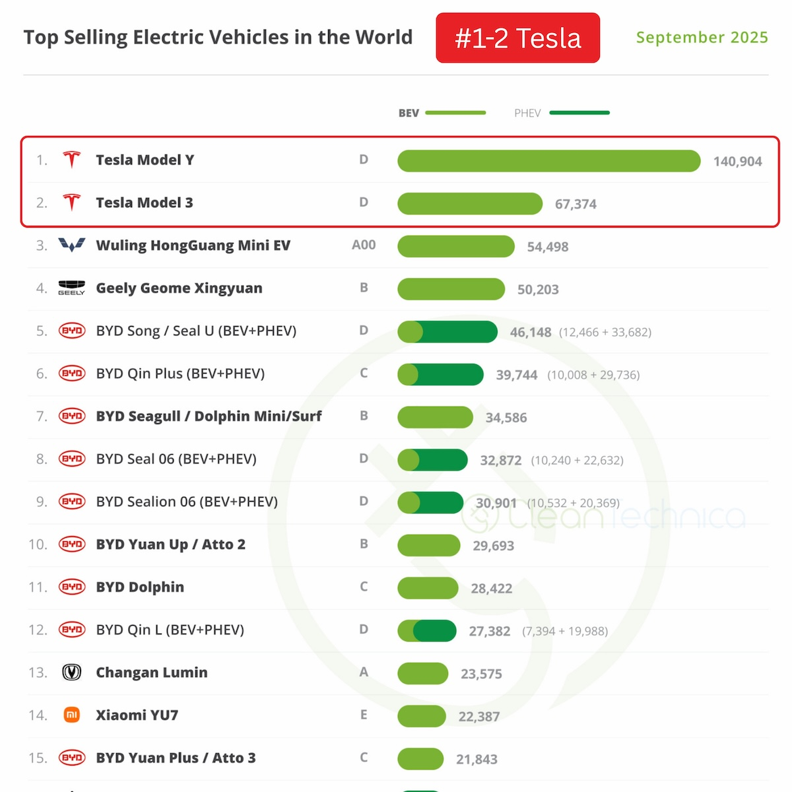

**Tesla**'s Model Y and Model 3 secured the #1 and #2 positions as the world's best-selling electric vehicles in September 2025, with the Model Y selling `140,904` units and the Model 3 selling `67,374` units globally. CEO **Elon Musk** highlighted this achievement on X after tech watcher @XFreeze posted the global sales data. The ranking is particularly impressive considering both are premium-priced models and the list includes both battery electric vehicles and plug-in hybrids. Tesla's strong September performance likely benefited from its end-of-quarter delivery push and the expiration of the $7,500 U.S. federal EV tax credit on September 30. The Model Y also reclaimed its title as Europe's best-selling car overall in September, regardless of fuel type. Chinese cars, especially **BYD**, dominated the rest of the chart. 

## Nature & Environment

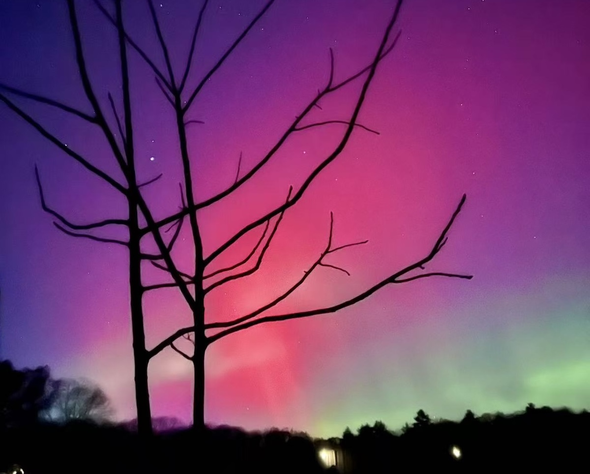
*by [Lu Wei, Massachusetts, USA](https://imluwei.wixsite.com/photos)*

This week's spectacular northern lights were triggered by an X5.1 solar flare—2025's strongest—that sent charged particles hurtling toward Earth. When these particles collided with atmospheric gases, they created breathtaking displays of green, pink, purple, and red dancing across the night sky Tuesday and Wednesday nights. The auroras were so intense they reached unusually far south to Florida and Texas, stunning residents unaccustomed to seeing this typically Arctic phenomenon. Even urban skygazers in Chicago, Boston, and Denver witnessed glowing skies from downtown locations. Social media exploded with breathtaking photos showing shimmering curtains of color, while smartphone cameras revealed delicate hues invisible to the naked eye.

## Science

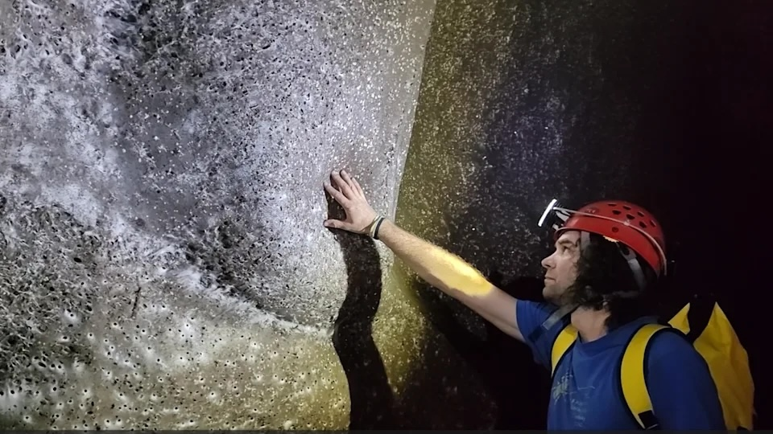

Scientists discovered the world's largest spider web spanning `106` square meters in Sulfur Cave on the Albania-Greece border, home to approximately `111,000` spiders—69,000 Tegenaria domestica (domestic house spiders) and 42,000 Prinerigone vagans. The Czech Speleological Society first spotted the web in 2022 during an expedition. This marks the first documented case of colonial web formation in both typically solitary species. The entire ecosystem is powered by sulfur-oxidizing microbes consumed by midges, which the spiders eat. Genetic analysis revealed the cave spiders are becoming genetically distinct from outside populations, with an abundant food supply possibly driving this unprecedented colonial behavior.

## Lifestyle, Entertainment & Culture

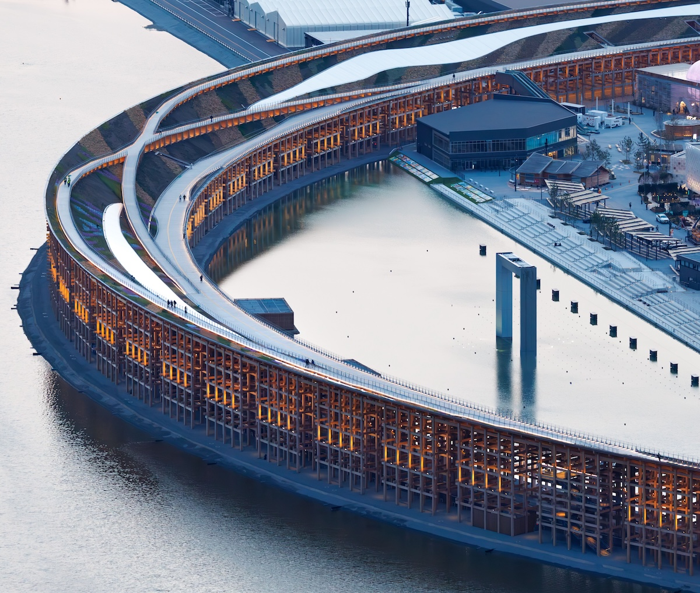

**Expo 2025 Osaka Kansai** ran from April 13 to October 13, 2025, on Yumeshima Island under the theme "Designing Future Society for Our Lives". The centerpiece was the Grand Ring, recognized by **Guinness World Records** as the world's largest wooden structure—a `2-kilometer` circular walkway designed by Sou Fujimoto. Over `150` pavilions from nations worldwide showcased innovations in sustainability and technology, including standout designs by renowned architects like Kengo Kuma, Lina Ghotmeh, and Shigeru Ban. Popular attractions included the GUNDAM NEXT FUTURE Pavilion, Japan's Better Co-Being pavilion, and the Future City pavilion featuring interactive experiences. **Kura Sushi** opened its largest restaurant ever, serving dishes from 70 participating countries on the longest conveyor belt in company history.

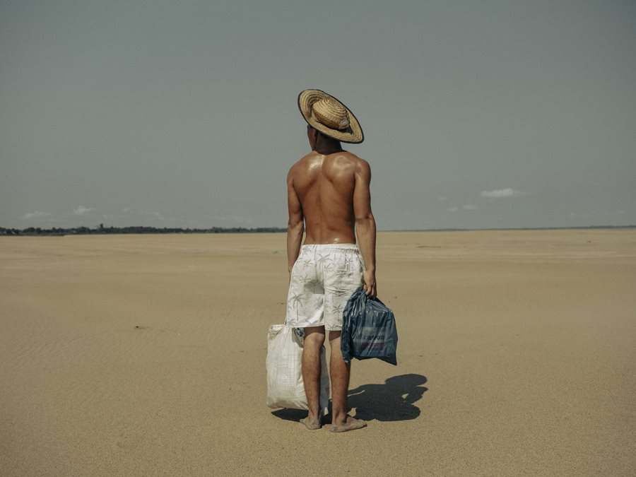
*finalist "Droughts in the Amazon", by Musuk Nolte, Peru/Mexico, Panos Pictures, Bertha Foundation*

**The World Press Photo 2025** exhibition—the most renowned exhibition in the field of photojournalism worldwide runs November 7-December 14 at **Barcelona**'s CCCB, marking its 21st consecutive year in the city. Palestinian photographer Samar Abu Elouf won Photo of the Year for "Mahmoud Ajjour, Nine Years Old," showing a nine-year-old Gaza boy who lost both arms in a March 2024 Israeli attack. Both photographer and subject were evacuated to Doha, Qatar, where Abu Elouf captured this powerful image for The New York Times. Selected from nearly `60,000` entries by `3,778` photographers across `140+` countries, the exhibition features `42` winning photographers addressing urgent issues including conflict, migration, and climate crisis.

## Sports

World number one **Shi Yuqi** delivered an epic comeback against **Sun Chao** (ranked 171 in the world) at the National Games men's badminton team final on November 14, battling for `94` minutes and saving four match points to win 16-21, 21-17, 25-23. After losing the first game, Shi fell behind again in the second but rallied to level the match. In the decisive third game, Sun Chao surged from behind with a 6:0 run to lead 20-18 with match point. Shi saved four consecutive match points in a heart-stopping finish, finally prevailing 25-23 to give Jiangsu a 1-0 lead. The world champion threw down his racket and roared in celebration after this grueling victory, showcasing incredible mental toughness under extreme pressure.

**Stephen Curry** delivered a spectacular `49`-point performance against the San Antonio Spurs on Friday during NBA Cup play, shooting `16-of-26` from the field. The historic night saw Curry tie Michael Jordan for the most 40-point games after turning 30, marking his 44th such performance. The Warriors star came alive down the stretch after San Antonio held a 10-point lead in the fourth quarter, leading **Golden State**'s comeback victory. Only one other Warrior, Jimmy Butler, scored more than 10 points in the game, making Curry's performance even more crucial to the win.

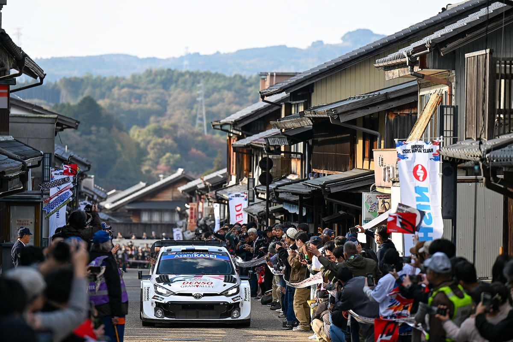

**The 2025 FORUM8 Rally Japan**, held November 6-9 as the WRC's 13th round, was contested over twenty special stages covering `305.34 km` in the Aichi and Gifu prefectures. Based in **Toyota City**, the event featured narrow, twisty asphalt stages lined by barriers and dense trees. Sébastien Ogier and Vincent Landais won for Toyota Gazoo Racing WRT, claiming his sixth victory of the year with maximum points and moving to just three points behind championship leader Elfyn Evans. Kalle Rovanperä's title hopes faded after a mistake cost him five minutes, leaving him 24 points behind heading into the Saudi Arabia finale.

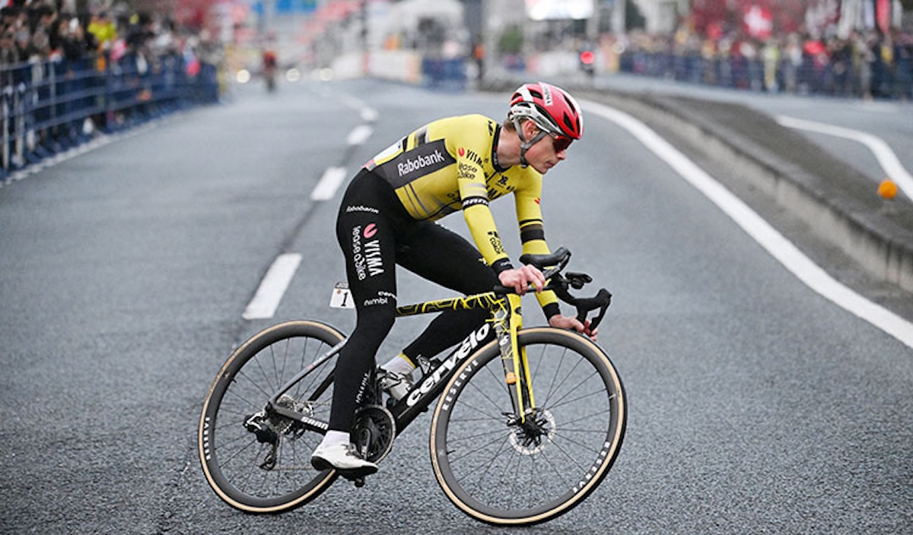

**Jonas Vingegaard** won the **Tour de France Saitama Criterium** on November 9, 2025, completing 17 laps of a 3.5 km circuit through Saitama, Japan. The Danish cyclist crashed with 16 kilometers remaining but was helped back by UAE Team Emirates rider Davide Stella. Vingegaard joined a breakaway with Primoz Roglic, Tim Wellens, and Jonas Abrahamsen, then dropped his former teammate Roglic on the final lap for a solo victory, with Jonathan Milan second and Kaden Groves third. Vingegaard called himself "finally back to his best" after recovering from a 2024 crash that caused a punctured lung and broken bones.

**Aston Villa**'s 2-0 **Europa League** victory over **Maccabi Tel Aviv** on November 6, 2025, unfolded against an extraordinarily tense backdrop in **Birmingham**, UK. Birmingham's demographics played a crucial role in the match atmosphere—with `30%` of the city's population identifying as Muslim according to the 2021 census, representing the highest Muslim population of any UK local authority. Over `700` police officers were deployed as pro-Palestinian protests erupted outside Villa Park, resulting in 11 arrests. Maccabi fans were banned from attending due to safety concerns following violent clashes in Amsterdam, where antisemitic riots had targeted Israeli supporters the previous year. Maccabi Tel Aviv declined their ticket allocation, citing safety concerns amid what they called a "toxic atmosphere." On the pitch, Ian Maatsen and Donyell Malen scored for Villa, but the football was completely overshadowed by the intense security operation and community tensions surrounding this politically charged encounter.

## This Day in History

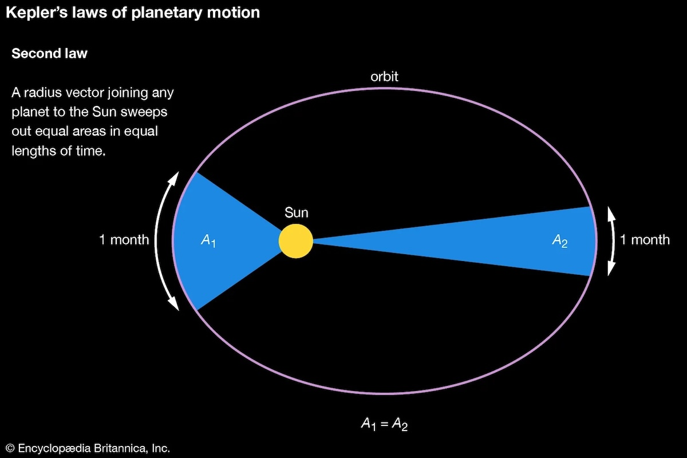

German astronomer **Johannes Kepler** died on **Nov 15, 1630**, in Regensburg. Kepler transformed astronomy through his three revolutionary laws of planetary motion. His **First Law** revealed that planets orbit in ellipses, not circles, challenging centuries of assumptions. The **Second Law** showed planets move faster when nearer the Sun, sweeping equal areas in equal times. The **Third Law** mathematically linked orbital periods to distances from the Sun. Kepler's meticulous analysis of **Tycho Brahe**'s observations demonstrated that mathematics could describe celestial mechanics, paving the way for **Isaac Newton**'s gravitational theory. His work exemplified the Scientific Revolution's empirical approach, proving that natural phenomena follow discoverable mathematical laws rather than philosophical speculation.

## Art of the Week

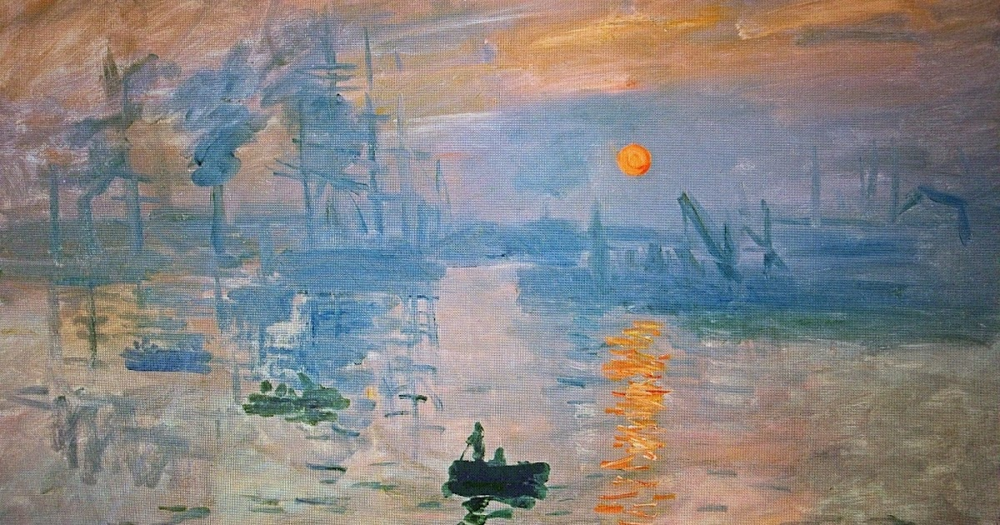

French painter **Claude Monet**'s "Impression, Sunrise" (1872) is the seminal work that gave **Impressionism** its name. Monet captured this scene at Le Havre harbor in Normandy, northern France, depicting an orange sun rising through morning mist over water during what appears to be early winter or late autumn. His loose brushstrokes captured fleeting atmospheric effects rather than precise details. When exhibited in 1874, critic Louis Leroy mockingly called the artists "Impressionists" based on this painting's title—a label the movement proudly adopted. The work revolutionized art by prioritizing the artist's immediate visual impression over academic realism. Its emphasis on light, color, and momentary perception broke from traditional painting conventions, launching one of art history's most influential movements and fundamentally changing how artists approached their craft.

## Funny

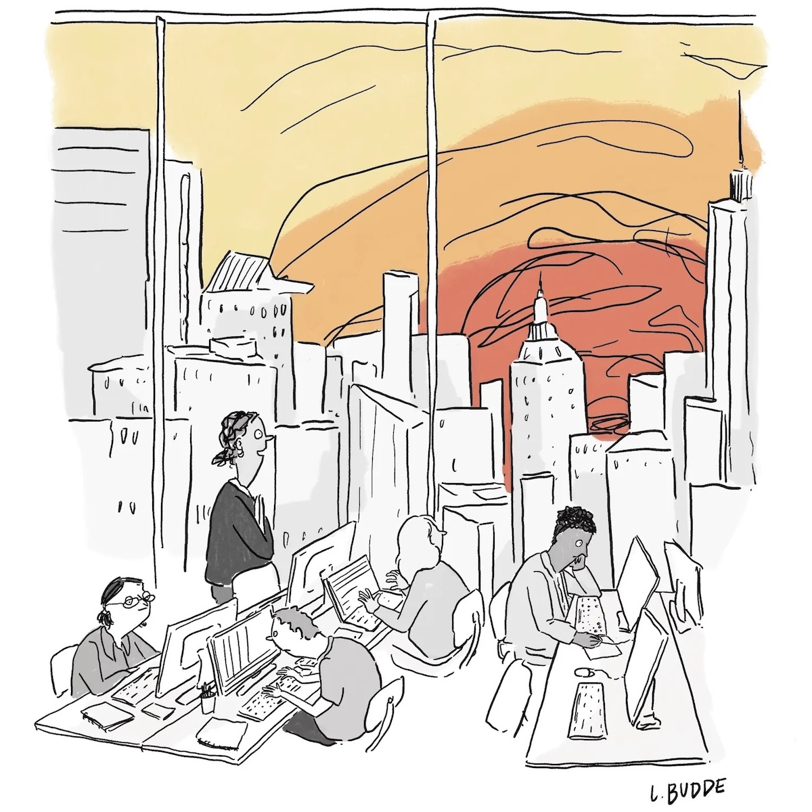

"There are few things more romantic than the sun setting early enough to watch it from the office."

*Cartoon by Lindsey Budde for The New Yorker*

---

## Previous Issues

---

November 08, 2025, **[Who Wins In This AI Bonanza?](https://weekly.sundayblender.com/p/who-wins-in-this-ai-bonanza)**

November 01, 2025, **[When Yang Meets Yang: Celebrating Life at the Peak of Autumn](https://weekly.sundayblender.com/p/when-yang-meets-yang-celebrating-life-at-the-peak-of-autumn)**

October 25, 2025, **[The Greatest Performance in Baseball History](https://weekly.sundayblender.com/p/the-greatest-performance-in-baseball-history)**

---

Thanks for reading! If you enjoy this newsletter, please share it with friends who might also find it interesting and refreshing, if not for themselves, at least for their kids.