## Editor's Words

I listen to many podcasts and toyed with creating my own half-heartedly a few times in the past. Couldn't really get one going though. The setup is intimidating. I don't have the chops of Stephen Fry. It is very time-consuming to convert a transcript into audio form. 

Well, Google proved me wrong. One of its AI killer apps, NotebookLM, [transformed the PDF version of the Nov 15 issue](https://digitalsovereignty.herbertyang.xyz/p/the-end-of-human-podcast-host-the-menace-of-google-notebooklm/) into a podcast episode in just five minutes, with two AI-generated hosts that would give Jake Tapper a run of his money. It was a magical moment.

Boys and girls, you can now listen to "**The Sunday Blender Podcast**" on [Apple](https://podcasts.apple.com/us/podcast/the-sunday-blender-podcast/id1853996806?i=1000737342457), [Spotify](https://open.spotify.com/show/0p6Boxgcyy9eJzdBQlu4CG?si=G-o4KNlSRC6aUBmyvvxzFw), and [Xiaoyuzhou](https://www.xiaoyuzhoufm.com/podcast/691d248b88967822c085fda5), while brushing your teeth in the morning. 

What do you think of the male and female hosts? They seem to know what they are doing. Leave your comments at the end of the article (on the web).

## Tech

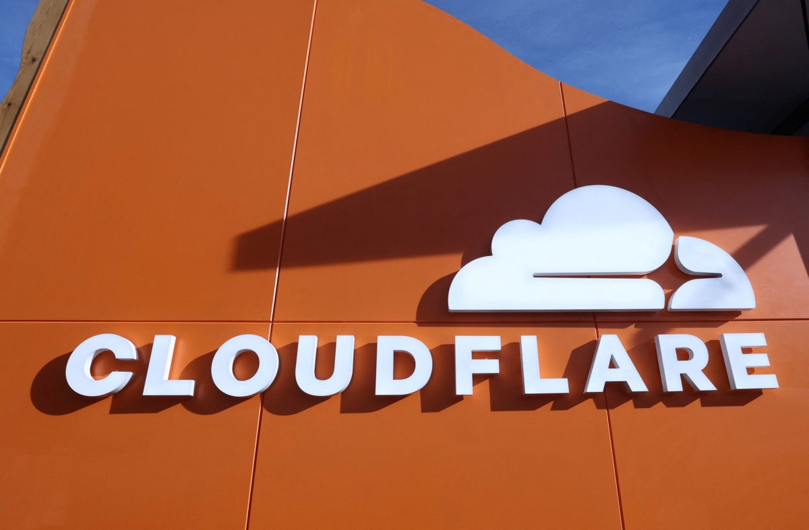

On November 18, 2025, **Cloudflare** experienced a major global outage that knocked numerous high-profile websites offline. Roughly one-fifth of webpages and a third of the world's `10,000` most popular websites were affected, including **X**, **ChatGPT**, **Spotify**, **Zoom**, and **Coinbase**. The root cause was an automatically generated configuration file for managing threat traffic that grew beyond expected size, triggering crashes in traffic-handling software. The incident highlighted the fragility of internet infrastructure, where a single point of failure at one company can cascade across vast portions of the web, disrupting businesses and services worldwide.

**Google** released **Gemini 3** on November 18, 2025, after weeks of social media hype, with early leaked benchmarks sparking excitement among developers. Testing shows it outperforms **OpenAI**'s **GPT-5.1** and **Anthropic**'s **Claude Sonnet 4.5** on key benchmarks. Gemini 3 introduces "generative interfaces" that create visual layouts and dynamic views instead of plain text responses, with developers praising its ability to intuitively understand coding intent and fill in gaps without explicit instructions. In head-to-head coding tests, Gemini excelled at rapid prototyping, adding features like keyboard controls unprompted. The release came just six days after OpenAI's GPT-5.1 update, intensifying AI competition. However, Claude 4.5 maintains advantages in code debugging, while GPT-5.1 offers better cost efficiency. The rapid-fire releases have created "integration fatigue" among developers.

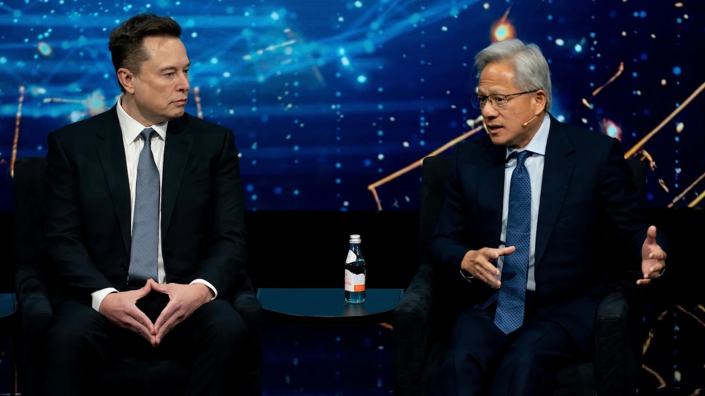

**Elon Musk** and **Jensen Huang** spoke at the US-Saudi Investment Forum on November 19, 2025, at Washington's Kennedy Center, discussing AI's future and announcing plans to build a `500-megawatt` AI factory in the Saudi desert equipped with **Nvidia** GPUs. Musk predicted work would become "optional" within 10-20 years, claiming AI and humanoid robots would eliminate poverty, while he also suggested money would eventually become irrelevant. Huang countered that AI would actually make people busier in the near term, citing radiologists who became more productive rather than unemployed. Musk also proposed space-based AI computing using solar power and zero-gravity cooling as the future solution to energy constraints. Huang jokingly asked Musk for advance warning before currency becomes irrelevant.

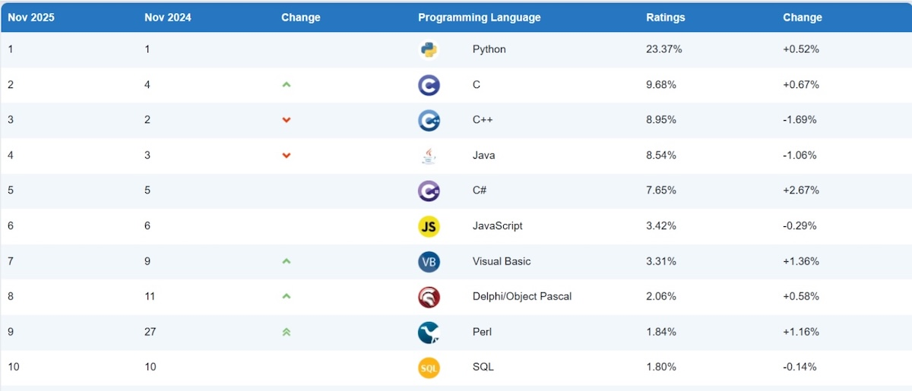

The November 2025 **TIOBE** index shows **Python** maintaining dominance at `23.37%`, representing a 9.3% annual growth that earned it 2024's "Programming Language of the Year" award. Python's lead stems from its central role in AI, machine learning, data science, and automation, powered by frameworks like **TensorFlow** and **PyTorch**. TIOBE CEO Paul Jansen notes Python has plateaued recently after years of unprecedented growth. Meanwhile, **Rust** sits at eighth place with 1.98%, gaining recognition as the top secure language adopted by **Microsoft**, **Google**, and **AWS**, with government agencies like **NSA** and **CISA** pushing memory-safe languages including Rust for critical infrastructure. Rust has been rising through 2024 and could reach the top 10 soon.

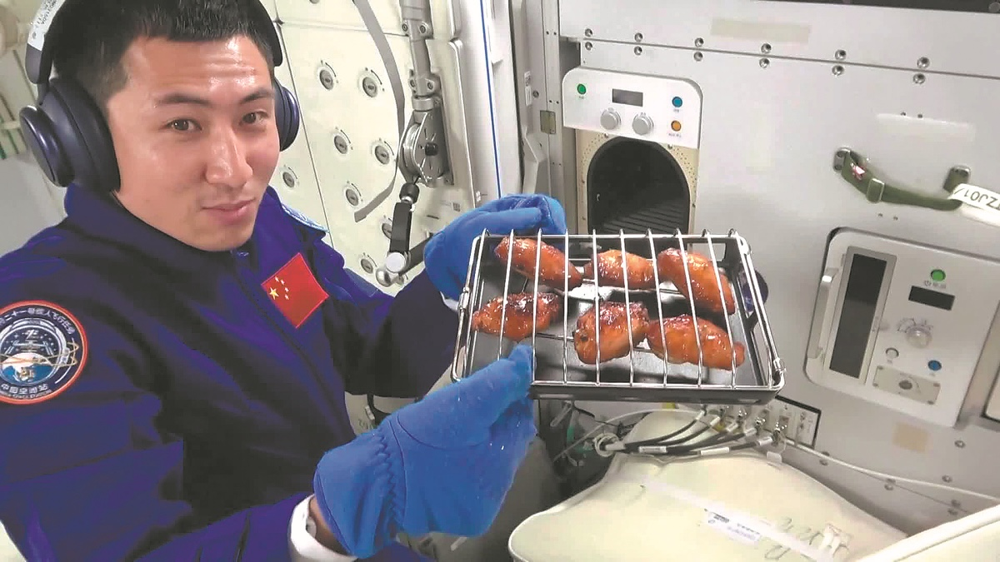

Chinese astronauts aboard the **Tiangong** space station achieved a first by using a new hot air oven to cook food in orbit in early November 2025. The Shenzhou-21 crew cooked marinated chicken wings and black pepper steaks, with the wings taking approximately `28` minutes to bake. The upgraded oven reaches `190` degrees Celsius, enabling genuine cooking with chemical reactions rather than just reheating, using high-temperature catalysis and multi-layer filtration for smoke-free, oil-free baking. Experts note hot meals help keep crews psychologically grounded during long missions. The device is rated for 500 uses, significantly exceeding earlier ISS demonstrations, marking an important advancement for sustaining astronauts on extended deep-space missions where fresh food preparation becomes crucial for crew morale and nutrition.

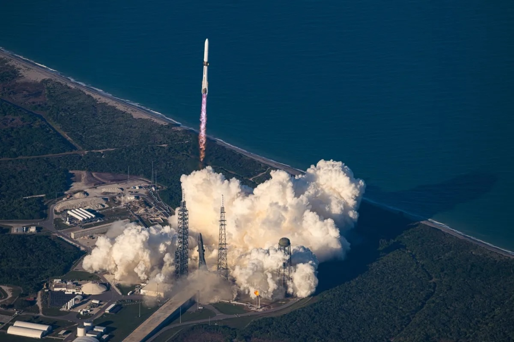

**Blue Origin** successfully launched its **New Glenn** rocket on November 13, 2025, marking its second flight, carrying **NASA**'s ESCAPADE mission—twin spacecraft that will study how Mars lost its atmosphere. The `320`-foot-tall rocket is powered by seven BE-4 engines generating over `3.8 million` pounds of thrust. Crucially, Blue Origin successfully landed the first-stage booster on its seafaring platform Jacklyn for the first time, after the booster exploded during the inaugural launch attempt in January. This achievement makes Blue Origin only the second company in history to recover a rocket during an operational flight, positioning the company to compete with **SpaceX**'s dominant market position. Even SpaceX CEO Gwynne Shotwell congratulated Blue Origin, calling it "Magnificent".

## Global

**Beijing**'s **Yitu School**, founded in 2016 by former **McKinsey** partner and **Gates Foundation** China head **Li Yinuo**, recently "imploded" amid financial crisis. In November 2025, Li revealed the school couldn't pay teachers' salaries starting October, with her co-founder borrowing personally to cover half of October's wages. Li blamed their partner school Zhizhi for borrowing over `50 million` yuan using the school's cash flow as collateral, then diverting funds to related companies. Li admitted "poor management capability" led to the crisis and acknowledged pursuing legal action to recover misappropriated funds. Once dubbed the "pioneer of innovative schools",  Yitu attracted elite families with its slogan of cultivating "children with fulfilled hearts", but faced teacher layoffs, management chaos, and enrollment losses.

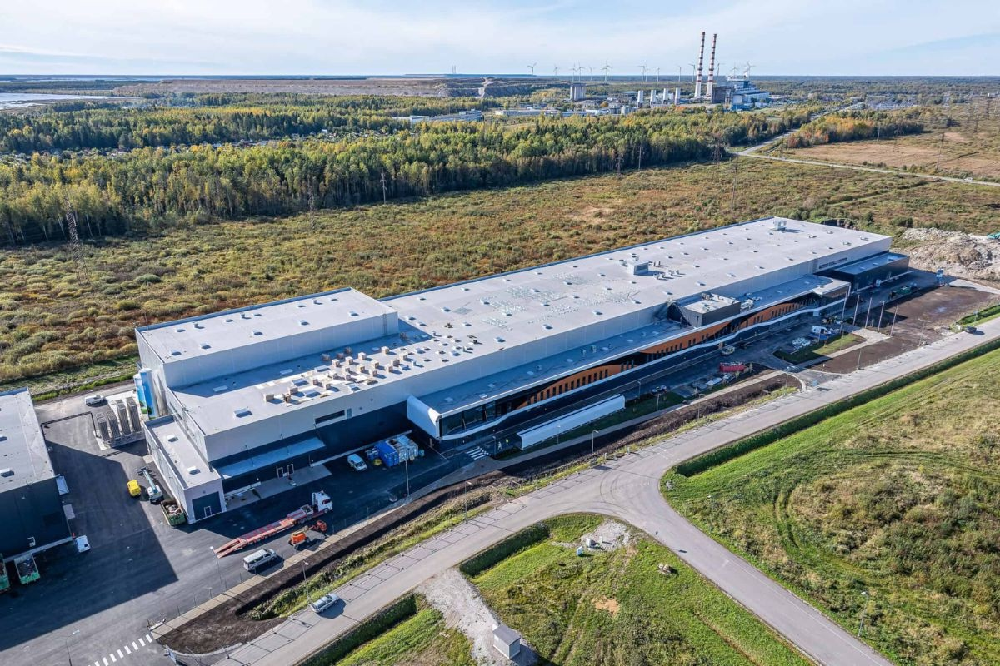

Europe's first rare-earth magnet plant officially opened September 19, 2025, in **Narva, Estonia**, built by Canadian company Neo Performance Materials with a `$75 million` investment. Supported by `€14.5 million` from the EU's Just Transition Fund, the facility has an annual capacity of `2,000` metric tonnes—enough to supply magnets for over one million electric vehicles or 1,000 offshore wind turbines. This addresses Europe's critical dependence on China, which currently supplies `90%` of EU permanent magnet demand. The plant is expected to create up to `1,000` jobs in Narva, a city transitioning from oil shale extraction, marking a significant step toward European strategic autonomy in green technology supply chains.

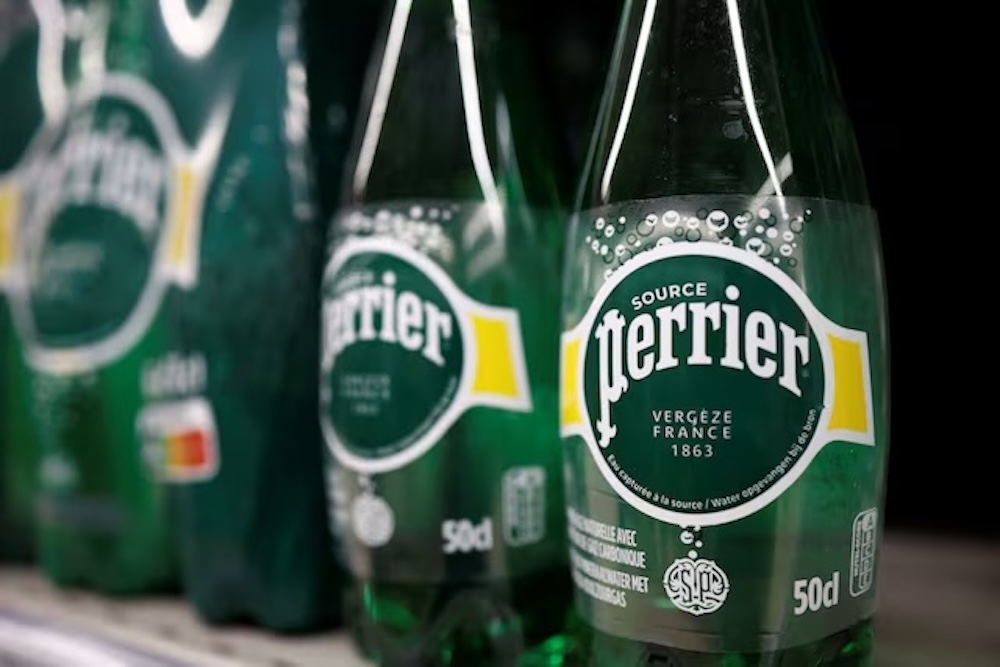

A French court ruled November 19 that **Perrier** can continue marketing as "natural mineral water" despite an ongoing scandal over **Nestlé**'s use of banned water treatments. The controversy erupted in 2024 when media revealed Nestlé Waters had illegally used ultraviolet treatment and activated carbon filters on multiple brands including **Perrier**, **Vittel**, and **Contrex**. A Senate inquiry found French government officials had concealed these unauthorized treatments for years. The ruling allows one of France's most iconic beverage exports to remain on shelves, though Nestlé now acknowledges on its website that "Perrier water carries the designation 'natural mineral water,' even though it may not fully qualify as such". The decision raises questions about consumer trust in "natural" labeling standards and European water quality regulations.

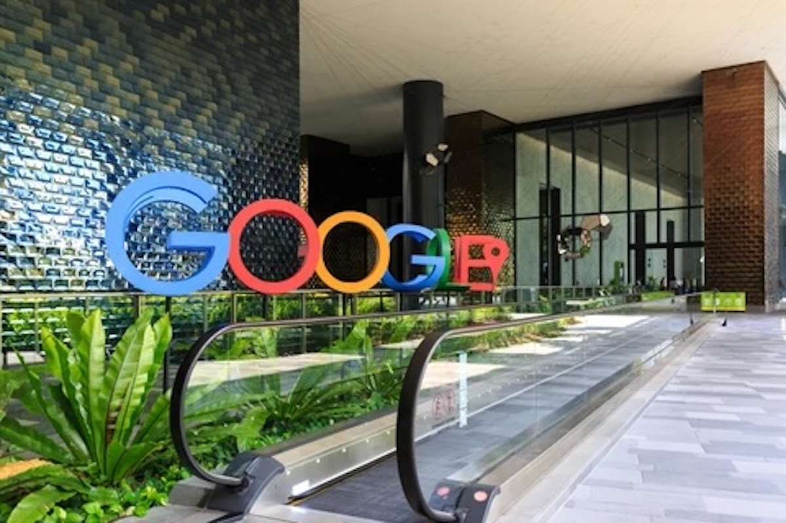

**Google DeepMind** announced November 19, 2025, the opening of a new AI research lab in Singapore, its first built entirely from the ground up in Southeast Asia. The expansion follows Google DeepMind more than doubling its Asia-Pacific team over the past year. The lab will focus on advancing **Gemini AI** capabilities with emphasis on linguistic and cultural inclusivity for the region's diverse populations. The facility aims to position Asia-Pacific as an AI creator rather than merely a consumer, working with governments, businesses, and academic institutions. Singapore's **National AI Strategy 2.0** and **Smart Nation 2.0** initiatives, along with openness to global talent, made it an ideal location. The lab will collaborate on applications spanning healthcare, cybersecurity, and public services.

## Economy & Finance

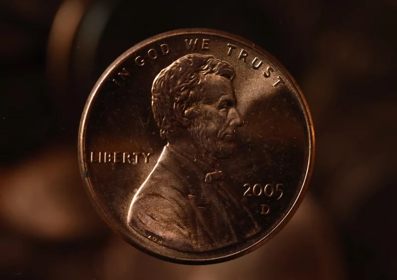

**The US Mint** stamped its final penny on November 12, 2025, in **Philadelphia** after `230` years of production, following President Trump's February directive to halt production due to mounting losses. Each penny cost `3.69 cents` to produce, resulting in an `$85.3 million`  loss in 2024. This marks the first US coin elimination since the half-cent in 1857. While existing pennies remain legal tender, the abrupt cessation without federal guidance has created shortages nationwide, forcing retailers to round cash transactions. The government expects to save `$56 million` annually, though cash transactions now comprise only `14%` of all US transactions.

## Nature & Environment

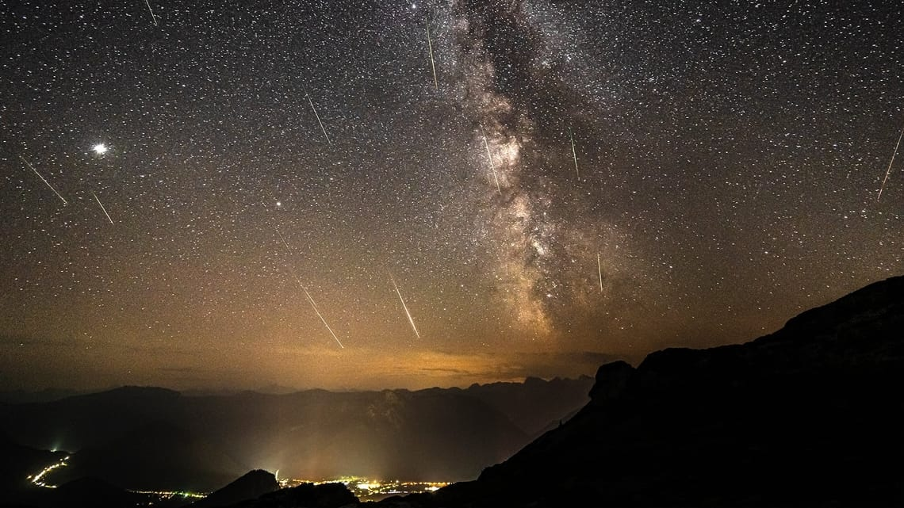

**The Leonid meteor shower** is an annual event occurring from November 3 through December 2, peaking this year on November 17-18 with 10-15 meteors per hour visible under dark skies. The shower occurs when Earth passes through debris left by Comet 55P/Tempel-Tuttle. With favorable viewing conditions this year—a waning crescent moon providing minimal light interference—the best viewing window is between midnight and dawn on November 17-18. While the comet takes 33 years to orbit the sun, occasionally producing spectacular meteor storms with thousands per hour, the last major storm occurred in 2002. The shower's name comes from meteors appearing to radiate from the constellation Leo.

## Science

At **Web Summit** in **Lisbon, Portugal** this month, Théau Peronnin, CEO of Alice & Bob (**Nvidia**'s quantum computing partner), warned that quantum computers will be powerful enough to crack Bitcoin's encryption shortly after `2030`. Google's `105-qubit` Willow chip demonstrated in January 2025 showed significant error reduction, making quantum threats feel increasingly practical. A Federal Reserve study warned about "harvest now, decrypt later" attacks, where adversaries collect encrypted blockchain data today for future decryption. Approximately `6.51 million` Bitcoin—worth over `$700 billion`—remains quantum vulnerable in older address formats. Peronnin stated Bitcoin "needs to fork by 2030, basically", though implementing quantum-safe transitions could take seven years.

## Lifestyle, Entertainment & Culture

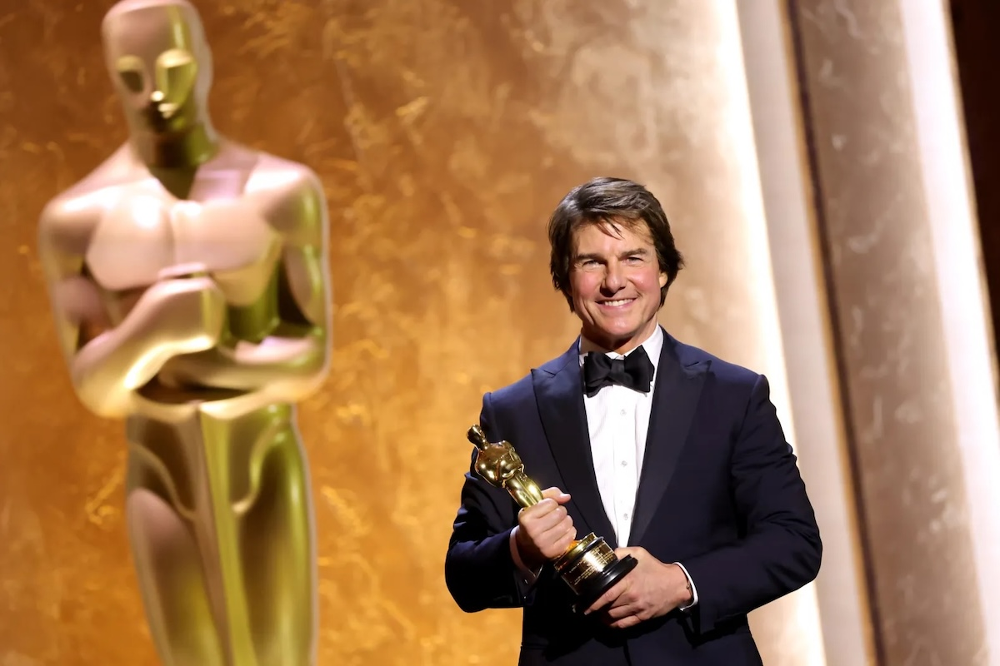

**Tom Cruise** received his first **Oscar** - an honorary Academy Award—at the Governors Awards on November 16, 2025, recognizing his unwavering commitment to filmmaking, vital support of the theatrical experience, and unmatched body of work. Cruise's films have grossed over `$11 billion` worldwide as lead actor, with box office hits spanning four decades since the late 1980s, making him one of Hollywood's most bankable stars. From his 1986 breakthrough with **Top Gun**—the year's highest-grossing film—through the **Mission: Impossible** franchise he's led since 1996, to 2022's **Top Gun: Maverick** earning over `$1.4 billion`, Cruise remains Hollywood's last true action superstar. Presenter director **Alejandro González Iñárritu** declared "Tom Cruise doesn't just make movies, he is movies". In his emotional speech, Cruise humbly celebrated fellow honorees before paying tribute to cinema's unifying power.

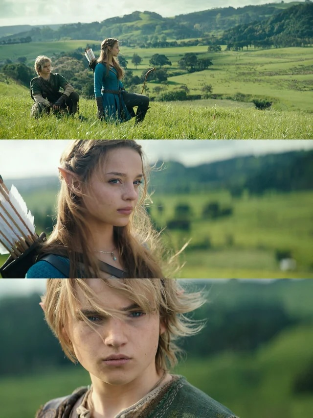

**Nintendo** released the first official set photos from the live-action Legend of **Zelda** movie on November 17, 2025, showing Link and Zelda in full costume against New Zealand's lush landscapes. The images sparked an overwhelming fan frenzy, with reaction videos, comment threads, and social posts filled with excitement as longtime fans said seeing the characters in live action made the project "feel real for the first time". Fans praised the costume accuracy and applauded details like the pointed **Hylian** ears, relieved Hollywood wouldn't tone down fantasy elements. Social media immediately lit up with reactions about how faithful the adaptation appears, with fans expressing they're "already hyped" while questioning whether it can capture the games' magic without feeling "too Hollywood". The hashtag #ZeldaMovieCasting trended for hours, with some fans declaring they'd "been waiting 20 years for a Zelda movie", though cautious viewers remain nervous about Hollywood's involvement with the beloved franchise.

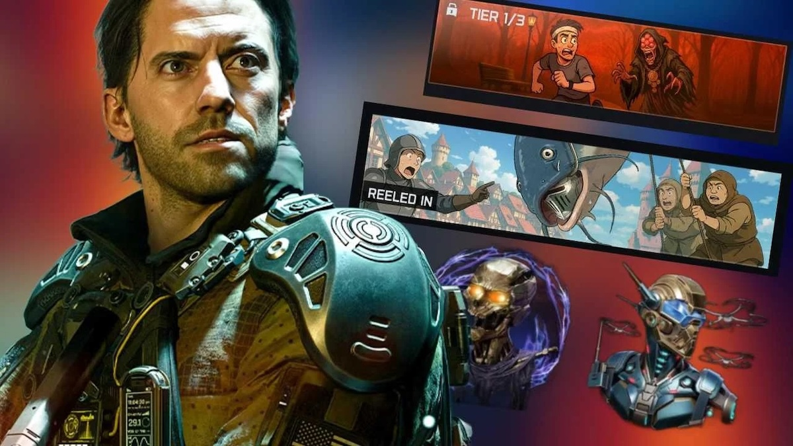

**Call of Duty: Black Ops 7** sparked controversy at launch over AI-generated calling cards featuring Studio **Ghibli**-style artwork that players deemed "AI slop". **Activision** confirmed via Steam disclosure that it uses "generative AI tools to help develop some in-game assets," after players spotted telltale signs like a zombie Santa with six fingers. The backlash was severe enough that some players secured **Steam** refunds, with one completing the entire campaign before citing undisclosed AI content. **Reddit** users expressed frustration at being fed AI content in a full-price AAA title already packed with microtransactions. The controversy drew political attention when US Congressman Ro Khanna called for regulations preventing companies from using AI to eliminate creative jobs. Black Ops 7 plummeted to a `1.7/10` **Metacritic** user score, the lowest in franchise history.

**Collins Dictionary** named "`vibe coding`" as its **Word of the Year 2025**, a term describing software development that uses AI and natural language to write computer code. The term was coined by AI pioneer **Andrej Karpathy**, former **Tesla** AI director and **OpenAI** founding engineer, to describe creating apps while being able to "forget that the code even exists". Lexicographers monitored the 24-billion-word Collins Corpus and noted a large uptick in usage since the term's first appearance in February 2025. Collins managing director Alex Beecroft said the selection "perfectly captures how language is evolving alongside technology" and signals "a major shift in software development, where AI is making coding more accessible". The shortlist reflected society grappling with authenticity in an increasingly AI-dominated, performative world.

A silver titanium **Speedwell** bicycle ridden by German electronic band **Kraftwerk**'s Florian Schneider in the 1984 "**Tour de France**" music video recently sold at auction for `$57,600`—over `14` times its initial estimate. The 1983 electronic anthem became synonymous with cycling culture, serving as Channel 4's theme music for UK Tour de France broadcasts, cementing its status as the race's unofficial soundtrack. The innovative track used sampled cycling sounds like chain rattles and gear shifts, becoming a blueprint for later techno and house genres while positioning itself as a timeless electronic sports anthem. Kraftwerk's celebration captured the race's spirit through hypnotic rhythms mirroring cycling's mechanical nature, with references to mountains, valleys, and the coveted yellow jersey. The band released a full album for the race's 100th anniversary in 2003, which became their first number-one album in Germany.

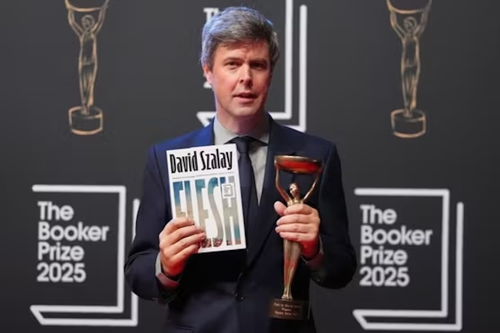

**David Szalay** won the **2025 Booker Prize** on November 10 for his sixth novel, **Flesh**, becoming the first Hungarian-British author to win the award. The Booker Prize is regarded as one of the most prestigious literary awards in the world, with winners receiving `£50,000` and international publicity that usually leads to significant sales boosts. The spare, propulsive novel follows protagonist István from adolescence to old age through events beyond his control. Judging panel chair Roddy Doyle said judges kept returning to Flesh "because of its singularity," noting they'd "never read anything quite like it". Szalay wanted to explore Europe's cultural divides while writing "about life as a physical experience, about what it's like to be a living body". This was his second Booker nomination.

**Thanksgiving** 2025 falls on **Thursday, November 27**, celebrated on the fourth Thursday of November, a tradition established by US Congress in 1941. The holiday traces back to 1621 when **Pilgrims** and **Wampanoag** people shared a harvest feast after the Native Americans helped colonists survive a harsh winter. President **Abraham Lincoln** proclaimed it a national holiday in 1863 to unite Americans during the Civil War. Traditional celebrations include family gatherings with roast turkey, stuffing, potatoes, cranberry sauce, and pumpkin pie, while parades like the Macy's Thanksgiving Day Parade mark the festivities. This year's late Thanksgiving date creates a shorter holiday season with less than four weeks until Christmas, making it one of the busiest travel periods.

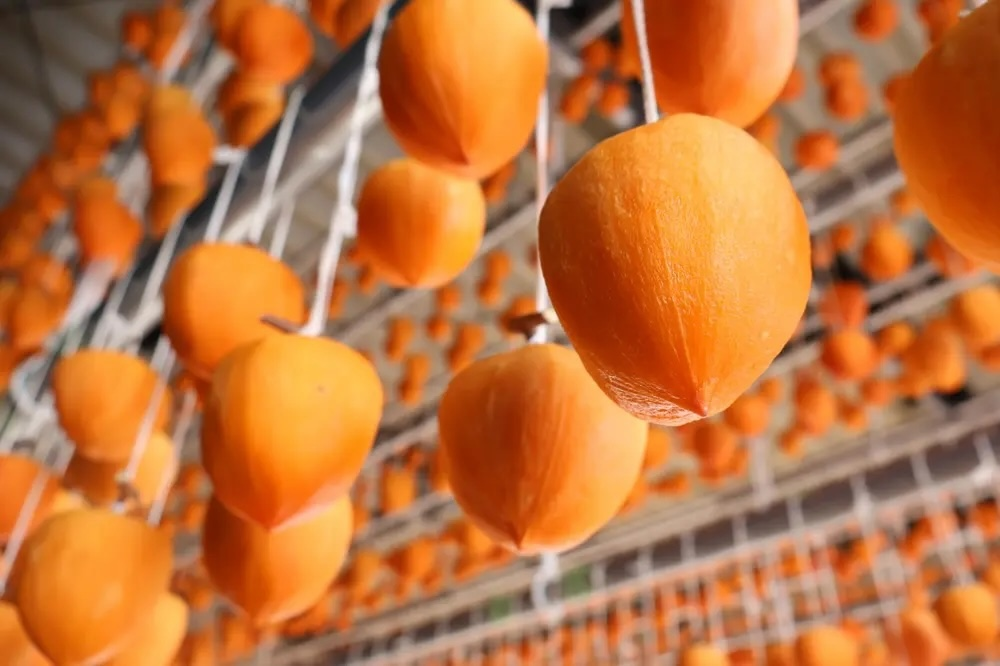

**Koroshigaki**(枯露柿) is a premium Japanese dried persimmon specialty from Yamanashi Prefecture, particularly the Matsuri district of Kōshū. Made from large Kōshū Hyakume persimmons weighing 350-400 grams each, production begins in early November when the fruit is carefully peeled and hung to sun-dry for approximately 40 days. Premium koroshigaki develops a beautiful amber color adorned with white crystallized sugar coating called "ko," creating an appearance like a delicate veil. The tradition dates back 500 years to warlord **Takeda Shingen**, who promoted dried persimmon as portable provisions. During autumn, strings of orange persimmons hanging from eaves create iconic curtains throughout the region, symbolizing Japanese patience and artisanal craftsmanship in preserving seasonal bounty.

## Sports

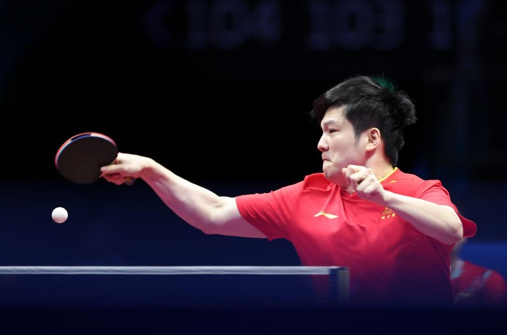

Table tennis star **Fan Zhendong** successfully defended his men's singles title at **China's 15th National Games** on November 16, 2025, defeating Hainan's Lin Shidong `4-1` in the final held in Macau. With this victory, Fan became the second player after **Ma Long** to win consecutive National Games men's singles titles. The win brought his National Games gold medal total to `six`, making him the active table tennis player with the most National Games gold medals. In the dramatic first game, Fan rallied from a 4-9 deficit by scoring seven consecutive points to win 11-9. Following his Paris Olympics gold medal, Fan had spent time playing for German Bundesliga club **Saarbrücken** before returning for the National Games after a `469-day` absence from competition.

**LeBron James** made his highly anticipated 2025-26 season debut on November 18, 2025, becoming the first player in NBA history to appear in `23` seasons, surpassing **Vince Carter**'s previous record of 22 consecutive seasons. The `40`-year-old returned after missing the opening 14 games with sciatica and posted 11 points and 12 assists in the **Lakers**' `140-126` victory over the **Utah Jazz**. James made two three-pointers to surpass **Reggie Miller** with `2,561` career triples, moving into `sixth` place on the NBA's all-time list. He also extended his remarkable streak of consecutive games with double-digit scoring to `1,293`, dating back to January 2007. When told seven Jazz players hadn't even been born when he made his NBA debut, James joked: "That just made my back hurt".

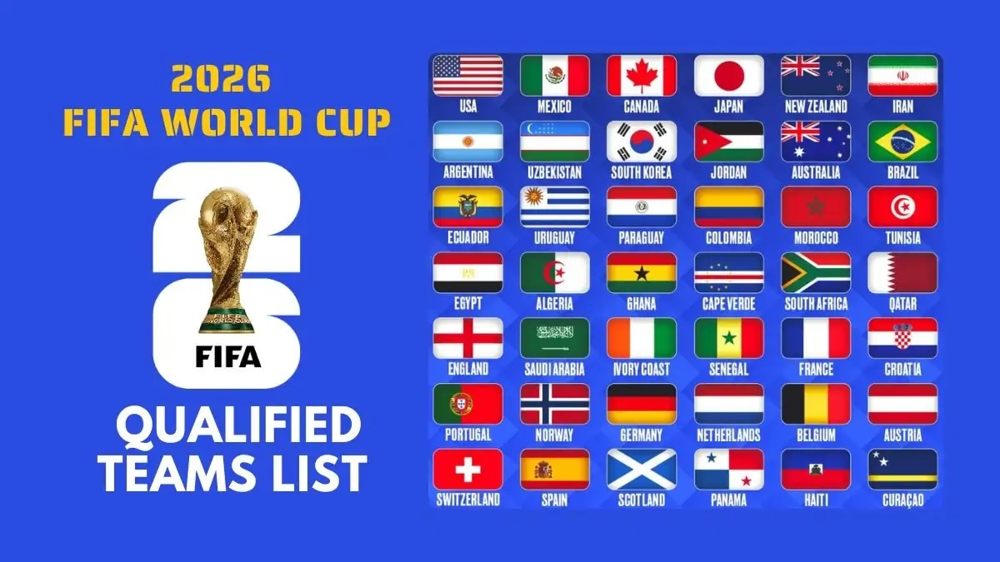

**Curaçao** became the smallest country ever to qualify for the World Cup on November 18, 2025, with a population of just `156,000`, securing their spot after a 0-0 draw with Jamaica. **Haiti** qualified for the first time in `52` years, sparking jubilant celebrations in Port-au-Prince. **Scotland** qualified for the World Cup for the first time since 1998 after a dramatic 4-2 victory over Denmark, with two stoppage-time goals sealing their historic return. **Panama** also booked their spot on the same night. Among European qualifiers, the 12 nations that secured automatic qualification as group winners are **Austria**, **Belgium**, **Croatia**, **England**, **France**, **Germany**, **Netherlands**, **Norway**, **Portugal**, Scotland, **Spain**, and **Switzerland**. Major shock eliminations include Nigeria, Greece, Cameroon, and Serbia. The 2026 tournament will be the first expanded 48-team World Cup, co-hosted by the **United States**, **Canada**, and **Mexico**.

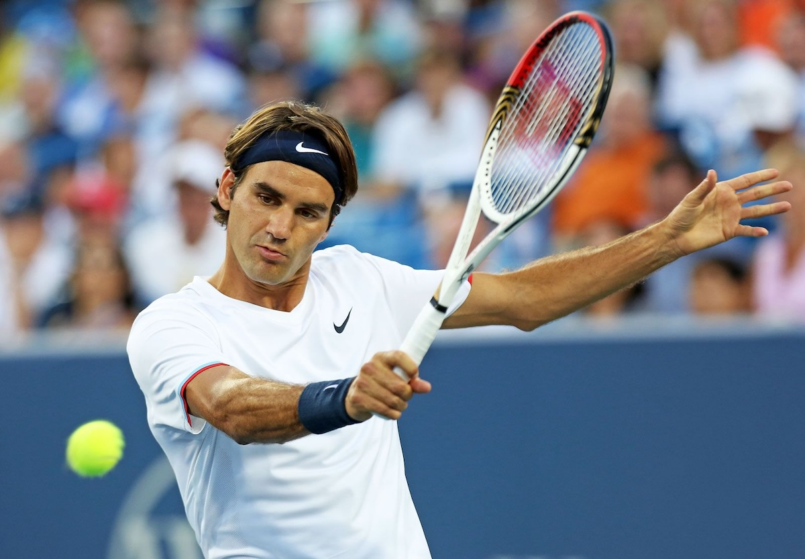

**Roger Federer** was elected to the International Tennis Hall of Fame in his first year of eligibility, announced November 19, 2025. He will be inducted in Newport, Rhode Island in August 2026. Federer became the first man to win `20` Grand Slam singles titles, including eight **Wimbledon** championships, six **Australian Open**s, five **US Open**s, and one **French Open**. He held the world No. 1 ranking for `310` weeks total, including a record `237` consecutive weeks, and won `103` tour-level titles. At his peak, Federer reached a record `10` consecutive Grand Slam finals from 2005-07, winning eight, part of an unprecedented era alongside rivals **Nadal** and **Djokovic**.

## This Day in History

On **November 22, 1963**, President **John F. Kennedy** was assassinated in Dallas, Texas, sending shockwaves across America and the world. The nation entered a period of profound mourning as television networks broadcast continuous coverage of the tragedy. Kennedy's state funeral drew leaders from over 90 countries, reflecting his global stature. His death marked the end of an era characterized by youthful optimism and the promise of a "New Frontier." Kennedy's legacy endures through his vision for civil rights advancement, the space program that would land Americans on the moon, and the Peace Corps. His eloquent calls for public service—"Ask not what your country can do for you; ask what you can do for your country"—continue to inspire generations, cementing his place as an iconic figure in American history.

## Art of the Week

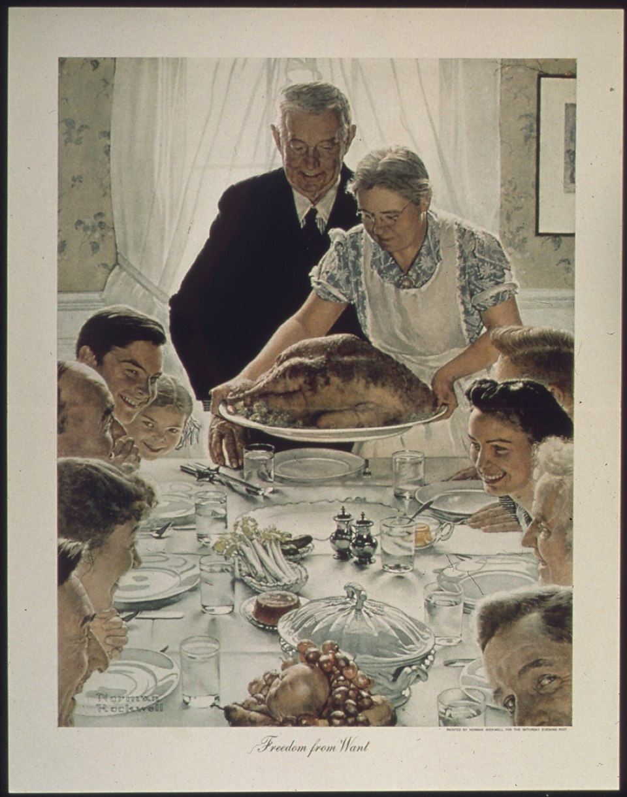

"**Freedom from Want**", painted by **Norman Rockwell** in 1943, depicts an idealized Thanksgiving dinner scene featuring a grandmother presenting a golden turkey to a multigenerational family gathered around a table. Part of Rockwell's "Four Freedoms" series inspired by President **Franklin D. Roosevelt**'s 1941 State of the Union address, the painting became one of America's most recognizable images. Published in The Saturday Evening Post, it resonated deeply during World War II, symbolizing American abundance and domestic harmony. The warm, detailed portrayal of middle-class prosperity embodied what Americans were fighting to preserve. Though sometimes criticized for its sentimentalized vision, the painting remains a powerful cultural touchstone representing American values of family, gratitude, and plenty.

---

## Previous Issues

---

November 15, 2025, **[The Return of Chinese Rock in Kuala Lumpur](https://weekly.sundayblender.com/p/the-return-of-chinese-rock-in-kuala-kumpur)**

November 08, 2025, **[Who Wins In This AI Bonanza?](https://weekly.sundayblender.com/p/who-wins-in-this-ai-bonanza)**

November 01, 2025, **[When Yang Meets Yang: Celebrating Life at the Peak of Autumn](https://weekly.sundayblender.com/p/when-yang-meets-yang-celebrating-life-at-the-peak-of-autumn)**

---

Thanks for reading! If you enjoy this newsletter, please share it with friends who might also find it interesting and refreshing, if not for themselves, at least for their kids.