## Tech

**South Korea** is making an aggressive push for AI sovereignty. The country has emerged as a magnet for major US tech companies, with **Nvidia**, **OpenAI**, and **AWS** pouring billions into investments — including Nvidia's ~`$10 billion` deal to supply `260,000` Blackwell GPUs and AWS committing `$9 billion` for AI data centers. Domestically, Seoul committed ~`$390 million` to fund five "AI champions" — **LG**, **SK Telecom**, **Naver**, **NC AI**, and **Upstage** — competing to build Korean-language foundation models, with underperformers eliminated every six months. The goal is a "full-stack" sovereign AI industry combining Korea's memory chip dominance with indigenous AI development, positioning itself as an alternative to US and Chinese dependence.

**Alibaba** launched its **Quark AI Glasses** on November 27, marking its first consumer smart glasses. The lineup includes the flagship S1 starting at ¥3,799 (~$536) with dual micro-OLED displays and swappable 24-hour batteries, plus the lighter G1 at ¥1,899. Powered by Alibaba's **Qwen AI** models, they offer real-time translation, AI-generated meeting notes, voice commands via "Hello Qwen," image-based Q&A, and navigation. The glasses integrate with Alibaba's ecosystem including **Alipay**, **Taobao**, and **QQ Music**. They're positioned to compete with **Meta**'s **Ray-Ban** glasses at roughly `30%` lower price. Currently, it's only available in China.

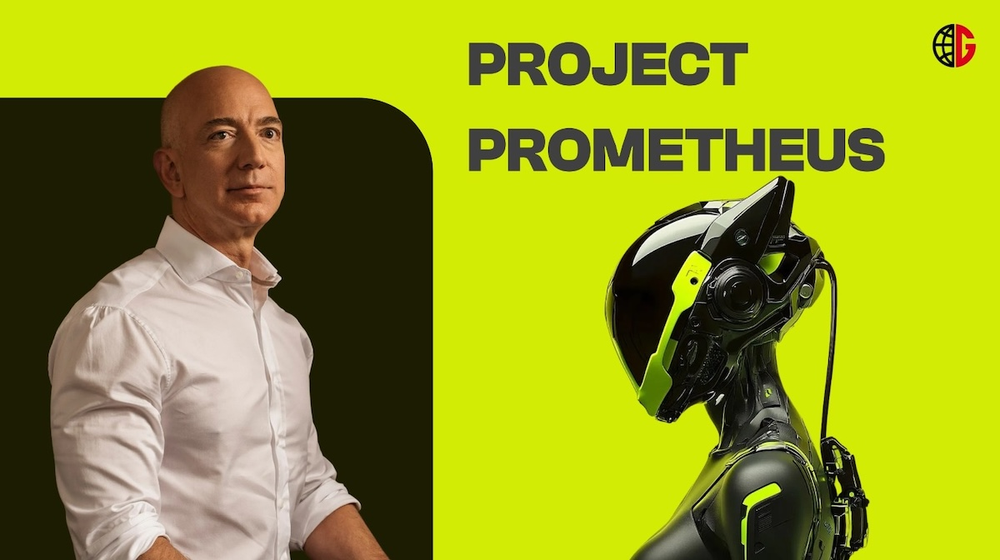

**Jeff Bezos** is returning to an operational role for the first time since stepping down as **Amazon** CEO in 2021, taking the co-CEO position at **Project Prometheus**, a new AI startup that has raised `$6.2 billion` in funding. Bezos founded Amazon in 1994 as an online bookstore, growing it into one of the world's most valuable companies spanning e-commerce, cloud computing, and streaming. He's currently the world's second-richest person after E**lon Musk**. Project Prometheus is building "AI for the physical economy," focusing on engineering and manufacturing in aerospace, automobiles, and computers—work that could tie closely to Bezos's space company **Blue Origin**. The startup has hired about 100 employees from **OpenAI**, **DeepMind**, and **Meta**.

## Global

A devastating fire engulfed the Wang Fuk Court housing estate in **Hong Kong**'s Tai Po district, killing at least `94` people—making it the city's deadliest blaze in over a century. Hundreds remain missing as rescue operations continue. The fire spread rapidly through bamboo scaffolding and highly flammable styrofoam materials used during ongoing renovations. Authorities upgraded it to a Level 5 alarm—the first since 2008. Three individuals connected to the renovation contractor have been arrested on manslaughter charges. Chief Executive John Lee called it a "massive catastrophe," and President Xi Jinping pledged emergency relief funds and urged "all-out efforts" in rescue work.

Devastating floods across southern **Thailand** have killed at least `145` people, with Songkhla province alone accounting for 110 deaths. More than `1.2 million` households and `3.6 million` people have been affected by floods triggered by heavy rains in 12 southern provinces. Hat Yai, the region's commercial hub, received a record `630mm` of rain over three days—the highest in `300` years—submerging hospitals and stranding thousands. Prime Minister Anutin declared a state of emergency citing "unprecedented severity." As waters recede, rescuers are recovering more bodies while widespread damage to roads, power lines, and buildings is being revealed.

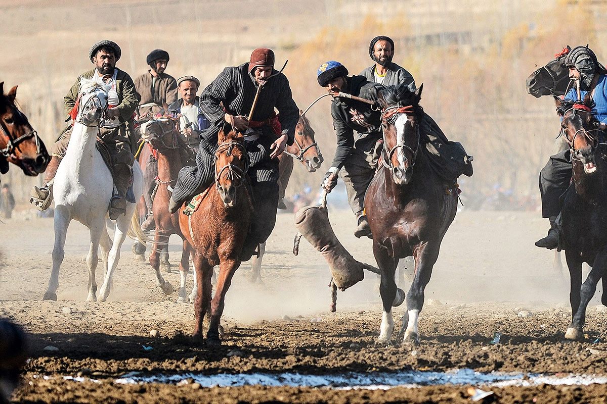

**Afghanistan**'s ancient sport **Buzkashi** — imagine polo, but replace the ball with a headless goat carcass — roared back in November 2025 with over `450` riders competing across five provinces. Dating back to **Genghis Khan**'s era as training for mounted warfare, the brutal game sees horsemen wrestle for a `50kg` carcass while galloping at full speed. Champion horses, imported from **Kyrgyzstan** and **Kazakhstan**, cost up to `$200,000` — and can play for 20 years. A skilled rider (chapandaz) typically peaks in his forties, as the sport demands decades of physical training and observation. Thousands of spectators called the matches "a symbol of pride and unity."

**McGill University**, one of Canada’s oldest and most prestigious institutions, recently announced the elimination of `25` varsity and competitive teams across `15` sports starting in 2026–27. The cuts include long-running programs such as men’s and women’s track and field, badminton, fencing, rowing, rugby, tennis, and more. For an institution founded in `1821` and celebrated for producing `156` Olympians, the move cuts deep. Longstanding teams—some with more than a century of tradition—will vanish, taking with them the rituals, rivalries, and community that helped define life on campus. Beyond the immediate shock, the cuts threaten McGill’s identity as a place where academic excellence and athletic ambition thrived together, leaving students and alumni questioning what will remain of the university’s rich sporting legacy.

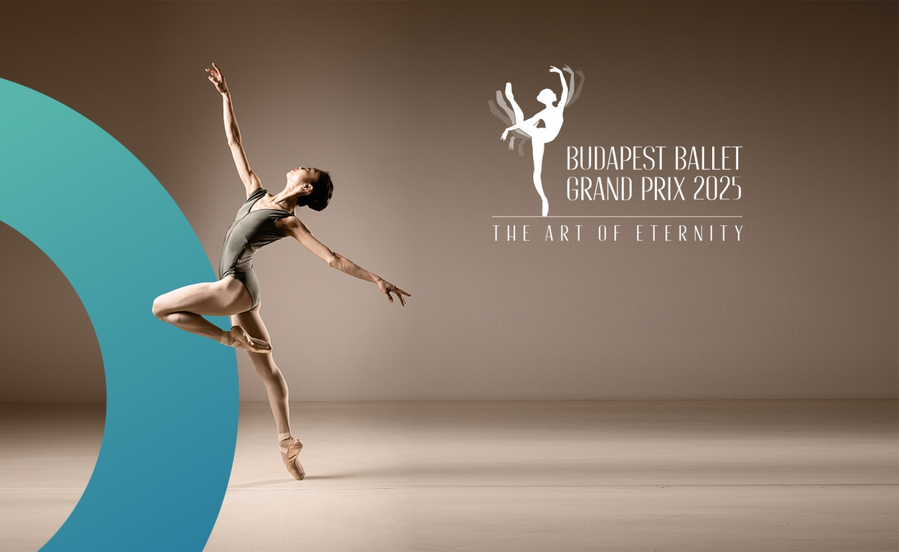

**The 3rd Budapest Ballet Grand Prix** wrapped up November 21 at **Hungary**'s National Dance Theatre and Palace of Arts. Over `80` dancers aged 14-24 from `22` countries competed for scholarships and career opportunities—organizers note a single invitation can launch an entire ballet career. The jury included New York City Ballet principal Megan Fairchild and Semperoper Ballet artistic director Kinsun Chan. Why Budapest? Hungary has been a ballet powerhouse since 1884, when the Hungarian National Ballet was founded alongside the ornate State Opera House. Hungarian choreographers pioneered fusing folk dance with classical technique, creating a distinctive national style that influenced European dance for over a century.

## Economy & Finance

Chinese conglomerate **Xiaomi** has seen its stock plunge over `30%` from its June highs, erasing tens of billions in market value. Multiple factors converged: a fatal **SU7** crash in Chengdu in October wiped out ~`$10 billion` in a single day, while warnings about rising chip costs and reduced EV tax breaks spooked investors about 2026 margins. CEO **Lei Jun**'s public relations missteps worsened matters — his deflection to "paid trolls" after the crash, rather than addressing safety concerns directly, sparked public backlash and triggered mass order cancellations. The company went from "market darling to worst-performing Chinese tech stock" in just months.

## Nature & Environment

The ghost silverfish, a 1cm-long paper-eating insect first identified in **Sri Lanka** in 1910, is rapidly spreading across **Japan** and threatening the country's priceless cultural treasures, historic records, and delicate scrolls. Discovered in Japan in 2022, the pest has now crawled into institutions across `19` prefectures after reportedly arriving in a shipment of documents or artwork. The insect reproduces parthenogenetically — females lay eggs without fertilization — allowing populations to explode quickly; one silverfish can become `20,000` in three years. Museums and libraries, with their climate-controlled environments ideal for preserving artifacts, ironically create perfect conditions for the pest to thrive.

## Science

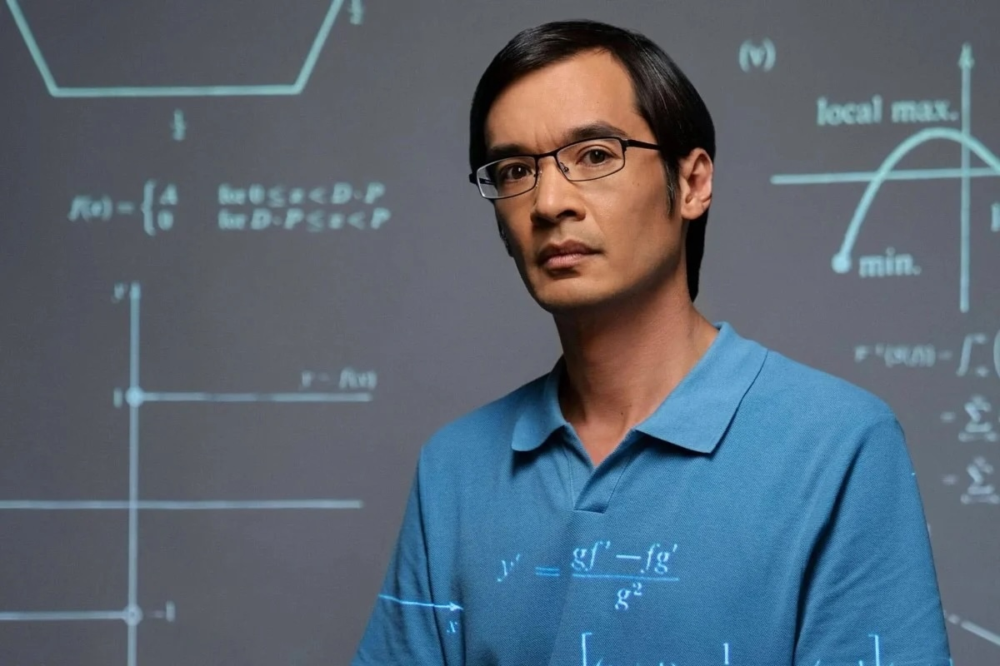

**Terence Tao** — widely considered the world's greatest living mathematician, **Fields Medal** winner, and **UCLA** professor known for his work across virtually every mathematical subfield — has published results from testing **Google DeepMind**'s **AlphaEvolve** AI tool on `67` unsolved math problems. The tool evolves Python code rather than raw numbers, letting it discover structured solutions humans might miss. Highlights: it rediscovered the optimal "Gerver sofa" for the famous moving sofa problem and cracked this year's IMO (International Mathematical Olympiad) Problem 6. However, Tao notes AlphaEvolve excels at finding solutions "within reach" of current math, but can't generate the deep insights needed for truly hard problems.

## Lifestyle, Entertainment & Culture

The 99th annual **Macy's Thanksgiving Day Parade** took place on November 27, bringing joy, nostalgia, and style to **Manhattan**. Cynthia Erivo opened the show with a breathtaking performance of "Feeling Good." The parade featured `32` giant character balloons, `27` floats, 11 marching bands, and over `600` clowns. New balloon debuts included Buzz Lightyear, Pac-Man, Shrek's Onion Carriage, and Mario. Performers included Ciara, Busta Rhymes, Lil Jon, and Lainey Wilson. HUNTR/X from Netflix's KPop **Demon Hunters** performed their hit "Golden." Millions gathered along the route from the Upper West Side to Herald Square.

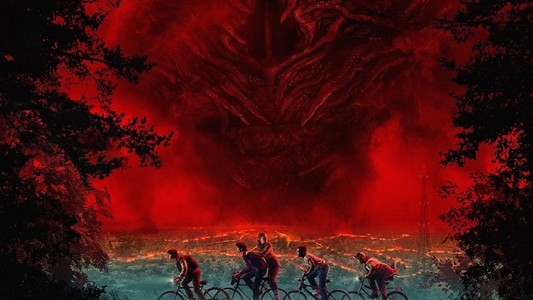

**Stranger Things** Season 5 premiered November 26, 2025, bringing the beloved saga to its epic conclusion, and has already made history—it's the first **Netflix** series to have all four previous seasons charting in the streamer's Top 10 English-language series simultaneously as fans rewatched ahead of the finale. Season 4 remains Netflix's third most-watched English-language series ever with `1.8 billion` hours viewed. Set in the 1980s, the series follows a group of teenage friends in Hawkins, Indiana, as they battle supernatural forces. At its heart, the show celebrates the power of friendship, loyalty, and courage in the face of unimaginable darkness. Through five seasons, we've watched this tight-knit group grow up together, learning that trust and unity are their greatest weapons against evil.

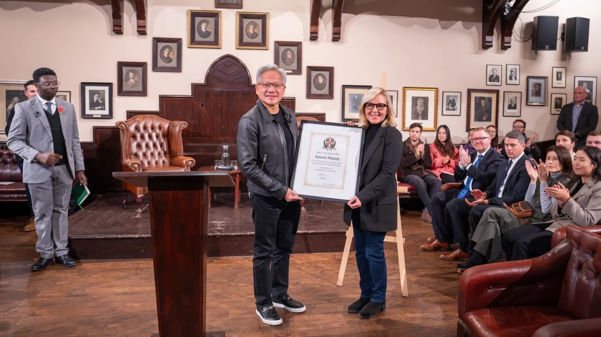

**Nvidia** CEO Jensen Huang spoke at the **University of Cambridge**, where he received the 2025 Professor Stephen Hawking Fellowship Award. He told students that being a CEO is far from glamorous: "Most people think it's about leading and being in command and being on top. None of that is true. You're in service of the company." Huang described leadership as "a lifetime of sacrifice," involving painful decisions during difficult times. He credited his immigrant upbringing and his mother, who always told him he was "special," for instilling the resilience needed for leadership. When asked what matters most as intelligence becomes cheap, Huang answered: "courage, intellectual honesty, letting go of one's ego, and the ability to show vulnerability."

## Sports

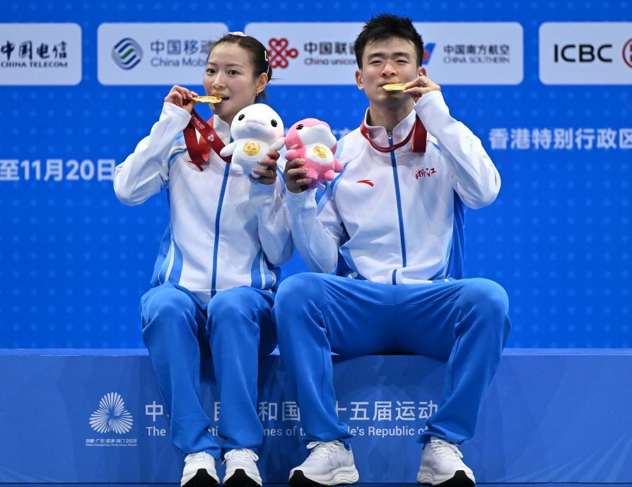

[*Badminton*] Legendary Chinese mixed doubles pair **"YaSi" Zheng Siwei and Huang Yaqiong** won the 15th National Games mixed doubles gold with a dominant 21-11, 21-12 victory over Wei Yaxin/Zhou Zhihong. This was their "last dance"—the final competitive match of their eight-year partnership. The gold completed their "Super Grand Slam," as they had won every major title (Olympics, World Championships, Asian Games, All England) but Huang Yaqiong had twice finished with National Games silver. With `43` international titles, they surpassed Korea's Kim Dong-moon/Ra Kyung-min as the most decorated mixed doubles pair in badminton history.

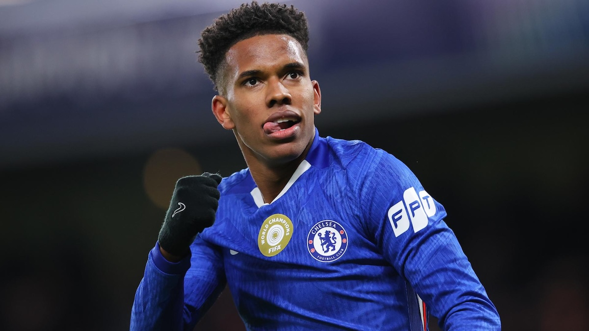

[*Soccer*] **Chelsea**'s 18-year-old **Estevao** became just the third teenager in history to score in each of his first three Champions League starts, joining an elite list occupied only by **Kylian Mbappé** and **Erling Haaland**. Against **Barcelona**, he cut inside, glided past his marker, and rifled the ball into the top corner from a tight angle. BBC noted that Barcelona's **Lamine Yamal** "found himself overshadowed" by the Brazilian, with Yamal recording just `64` touches—the fewest in a single match this season. South American football expert Tim Vickery declared Estevao "the most talented player out of Brazil since **Neymar**."

[*Soccer*] **Kylian Mbappé** scored the second-fastest hat-trick in Champions League history and four goals in total as **Real Madrid** came from behind to beat **Olympiacos** `4-3` in Piraeus. After trailing to Chiquinho's early strike, the France superstar launched a one-man mission, scoring in the 22nd, 24th, 29th, and 60th minutes. Only Mohamed Salah's six-minute treble against Rangers in 2022 was faster. The haul took Mbappé to nine goals in five Champions League games, making him the competition's top scorer. It was a magical pass from **Vinícius Junior**—who was at times impossible to contain—that changed the match, with the Brazilian becoming the joint second-highest assist provider for Madrid in UCL history.

[*Soccer*] **Neymar** has suffered a torn meniscus in his left knee—his `fourth` injury of 2025—and will miss the rest of the year, requiring arthroscopic surgery. Since 2013/14, he's endured `45` different injuries, missing `1,429` days and `265` matches. Carlo Ancelotti hasn't called him up once since becoming Brazil coach, demanding "continuity, minutes, and physical condition—talent alone isn't enough." With the Brazilian season not resuming until late March, Neymar has almost no runway to prove fitness before the World Cup. As 18-year-old **Estevao** dazzles in the Champions League, the torch may have already passed.

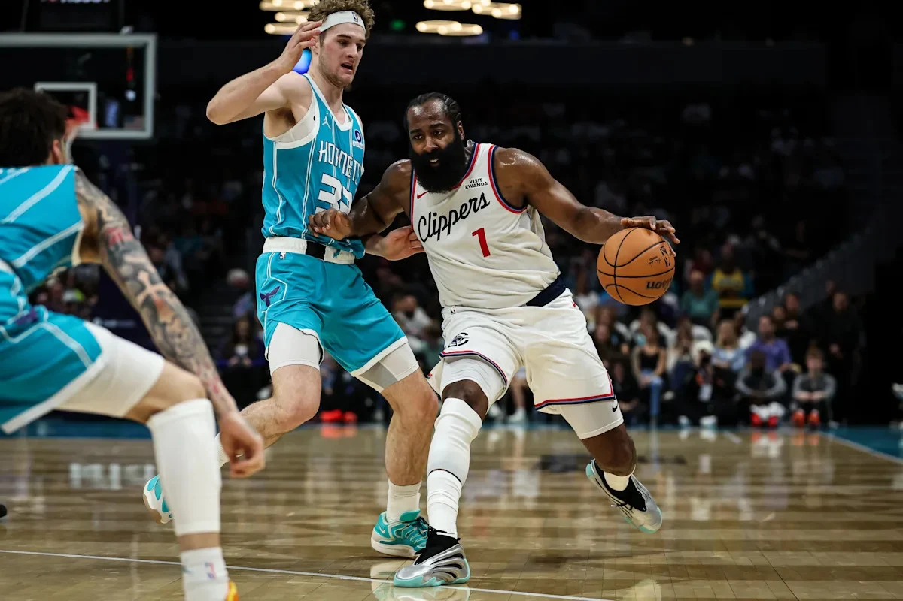

[*NBA*] **James Harden** scored a **Clippers** franchise record `55` points, including a franchise record `27` first-quarter points, while tying his career high with `10` three-pointers in a `131–116` victory over the **Charlotte Hornets**. The 36-year-old broke the previous franchise record held by Bob McAdoo (52 points) from the 1970s. Harden also holds the **Houston Rockets**' single-game record with `61` points in 2019—making him the only player in NBA history to hold the single-game scoring record for two different franchises. This was his `25th` career 50-point game, tying **Kobe Bryant** and trailing only **Michael Jordan** (31) and **Wilt Chamberlain** (118).

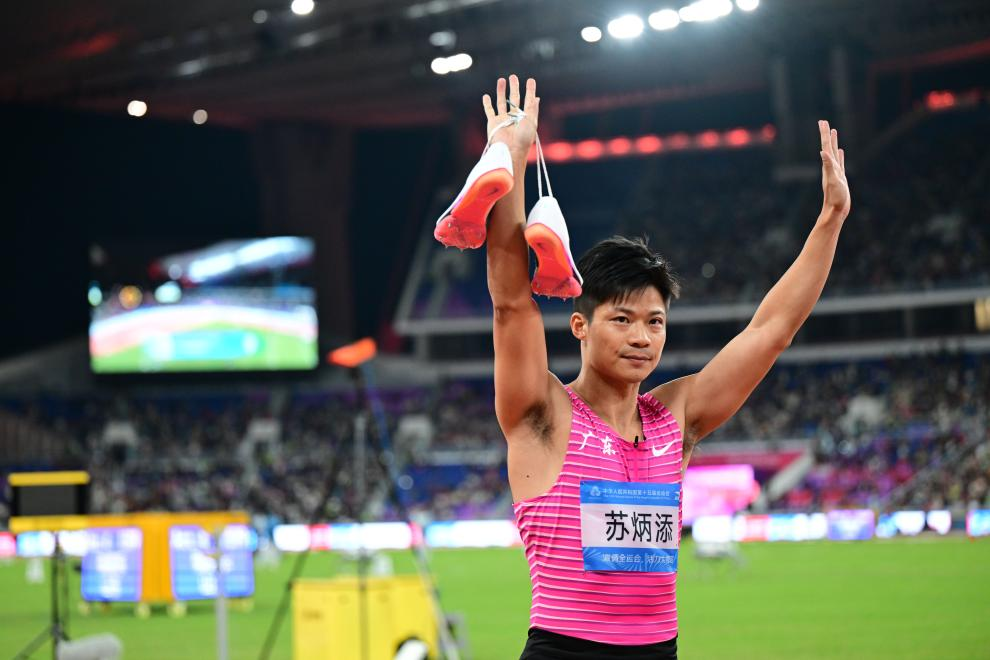

[*Sprinting*] On November 20, 2025, 36-year-old Chinese sprint legend **Su Bingtian** ran his final race at the 15th National Games, competing as the first leg in the men's 4×100m relay for his home province Guangdong. As the classic Cantonese song "Can't Say Goodbye" (by Alan Tam) played, he walked around the track bowing to the crowd in an emotional moment. Su became the first Asian-born athlete to break 10 seconds in 2015 with `9.99`. His crowning achievement: a `9.83`-second Asian record at the 2021 Tokyo Olympics, making him the first Chinese sprinter in an Olympic 100m final. Beyond raw speed, Su's legacy lies in proving that with scientific training and relentless determination, Asian sprinters could compete at the highest level globally.

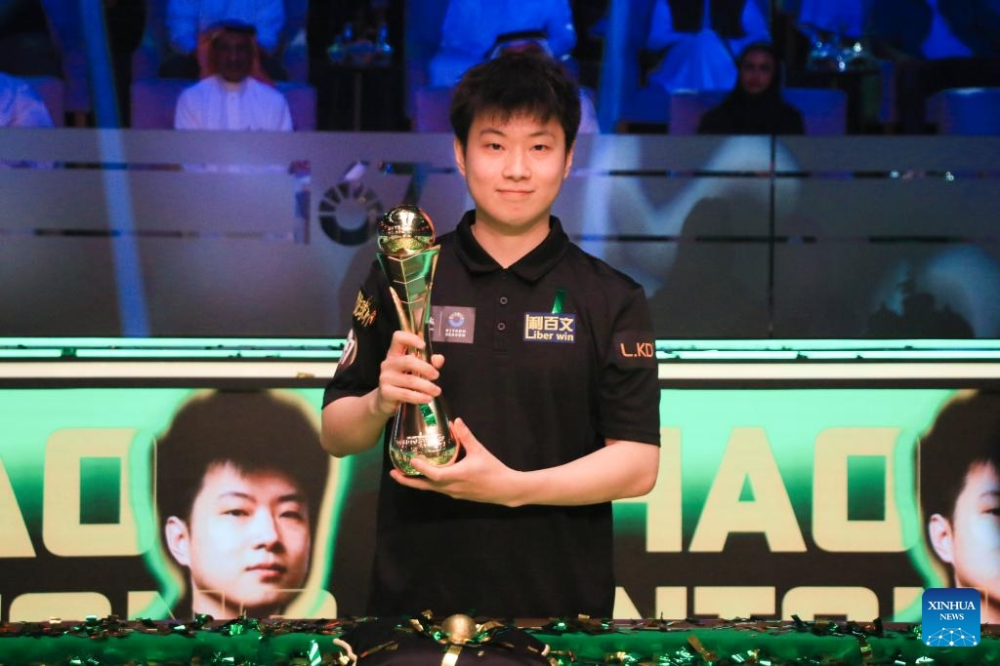

[*Snooker*] **Zhao Xintong** defeated **Neil Robertson** 5-2 in the final to win the **2025 Riyadh Season Snooker Championship**, claiming his first title since his World Championship victory in May. The 28-year-old Chinese star pocketed £250,000 and compiled back-to-back century breaks of 131 and 134 to pull away in the final. En route to the title, Zhao defeated **Shaun Murphy** and world number one **Judd Trump**, compiling a tournament-high break of 138. "I really needed it at this moment—a good title run to prove myself," Zhao said. This caps a remarkable comeback for the player who returned from a 20-month match-fixing ban to become China's first World Champion.

[*F1 Racing*] In a twist rivaling scenes from **Brad Pitt**'s blockbuster **F1**, both **McLaren** drivers **Lando Norris** and **Oscar Piastri** were disqualified from the **Las Vegas Grand Prix** after post-race inspections found their cars' skid blocks worn below the minimum `9mm` thickness. Norris's breach was just `0.12mm`—thinner than a human hair. Team boss Andrea Stella blamed unexpected "extensive porpoising" that caused excessive ground contact, not aggressive setup choices. The disqualification erased Norris's second-place finish, cutting his championship lead to `24` points with two races remaining. The FIA ruled it unintentional.

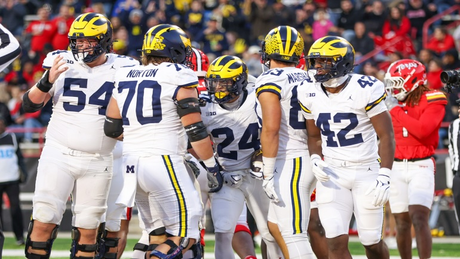

[*NCAA Football*] **Michigan** is chasing history in their rivalry with **Ohio State**, aiming for a fifth consecutive victory—something not achieved in 99 years since the 1920s. Despite entering as 10.5-point underdogs, **the Wolverines**' recent dominance includes last year's stunning 13-10 upset that sparked chaos when Michigan planted their flag at midfield. The stakes couldn't be higher: Michigan's playoff hopes hang in the balance while Ohio State seeks to protect their undefeated record. Buckeyes coach Ryan Day, despite winning last season's national championship, faces mounting pressure with his 1-4 record against Michigan. This rivalry has evolved from competitive to combustible, fueled by sign-stealing scandals and on-field confrontations.

## This Day in History

On **November 29, 1972**, **Atari** co-founder Nolan Bushnell installed **Pong** at Andy Capp's Tavern in **Sunnyvale**, **California**, marking a pivotal moment in gaming history. The simple tennis-style arcade game, designed by Allan Alcorn, featured two paddles and a bouncing ball with the instruction "Avoid missing ball for high score." Within days, the machine broke down—not from malfunction, but because the coin box overflowed with quarters. Pong's instant popularity demonstrated video games could be commercially viable, launching the arcade era and establishing Atari as an industry pioneer. This tavern test proved gaming had mass-market appeal.

## Art of the Week

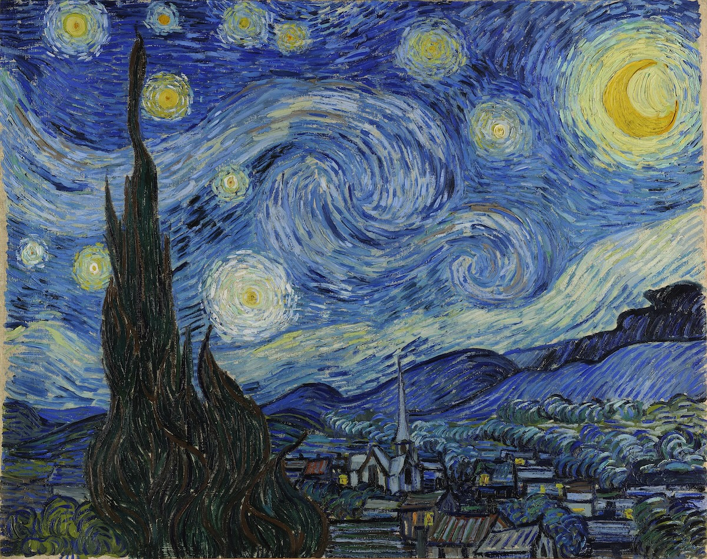

**Vincent van Gogh**’s **Starry Night** (1889) is one of the most iconic paintings in Western art, created during his stay at the **Saint-Rémy-de-Provence** asylum. The swirling sky, luminous stars, and bold, rhythmic brushstrokes capture an emotional, dreamlike vision rather than a realistic night scene. Van Gogh painted it from memory, blending observation with imagination to express turbulence, longing, and awe for the natural world. The quiet village below contrasts with the sky’s movement, emphasizing inner turmoil versus peace. Though uncelebrated in his lifetime, Starry Night later became a symbol of artistic genius, emotional depth, and the expressive power of post-Impressionism.

## Joke

Teacher: "If I gave you 3 dogs today and 5 dogs tomorrow, how many dogs would you have?"

Student: "Nine."

Teacher: "No, listen carefully. If I gave you 3 dogs today and 5 dogs tomorrow, how many would you have?"

Student: "Nine!"

Teacher: "How?!"

Student: "Because I already have one dog at home!"

---

## Previous Issues

---

November 22, 2025, **[The Most Intelligent AI Model Yet?](https://weekly.sundayblender.com/p/the-most-intelligent-ai-model-yet)**

November 15, 2025, **[The Return of Chinese Rock in Kuala Lumpur](https://weekly.sundayblender.com/p/the-return-of-chinese-rock-in-kuala-kumpur)**

November 08, 2025, **[Who Wins In This AI Bonanza?](https://weekly.sundayblender.com/p/who-wins-in-this-ai-bonanza)**

---

Thanks for reading! If you enjoy this newsletter, please share it with friends who might also find it interesting and refreshing, if not for themselves, at least for their kids.

