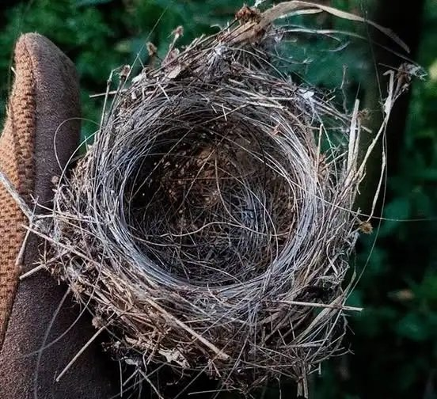
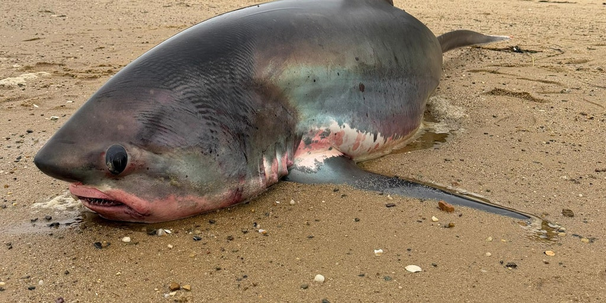
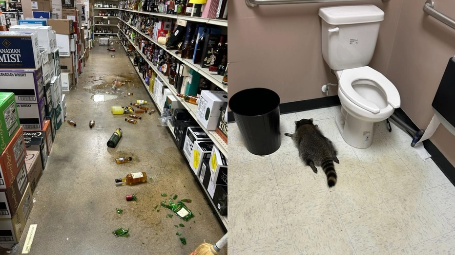
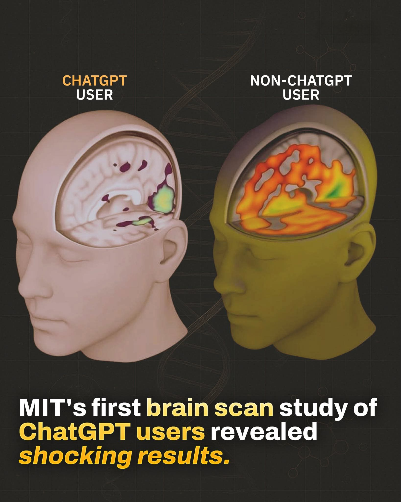
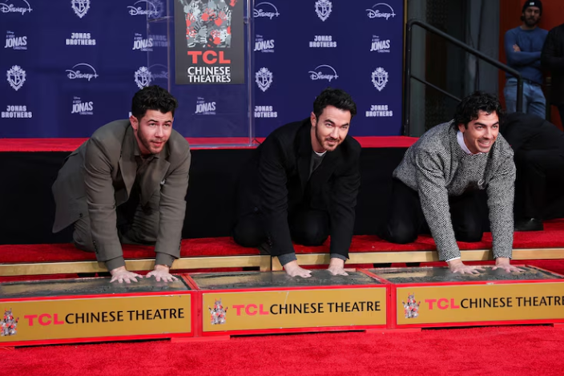
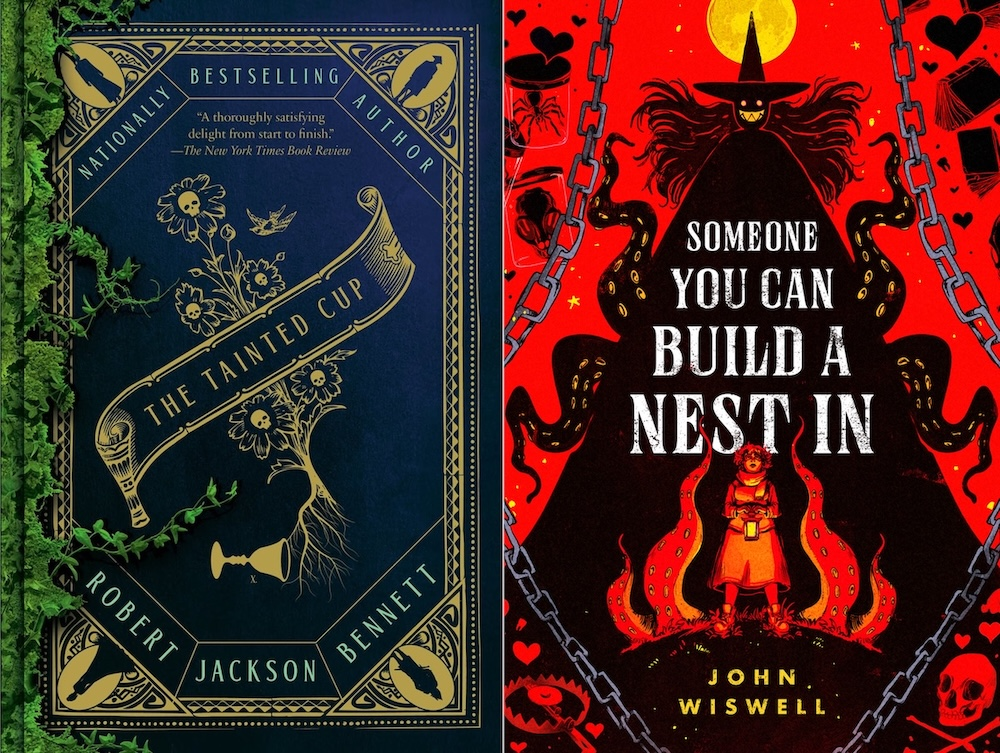
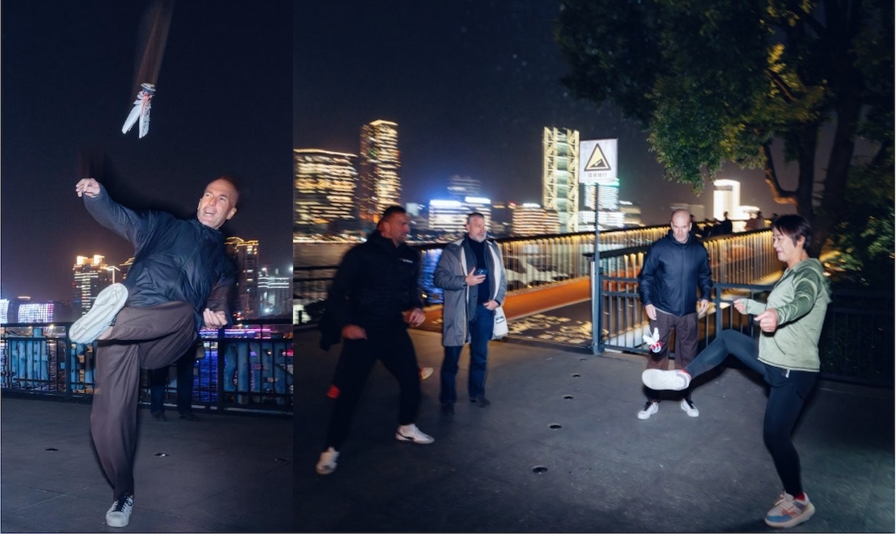
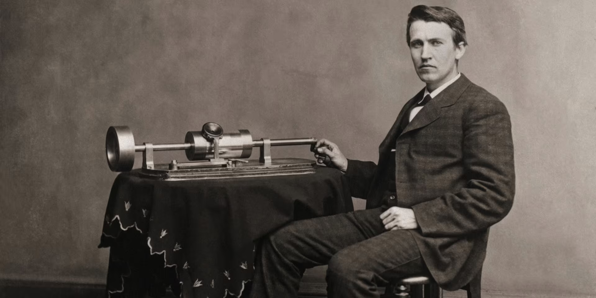
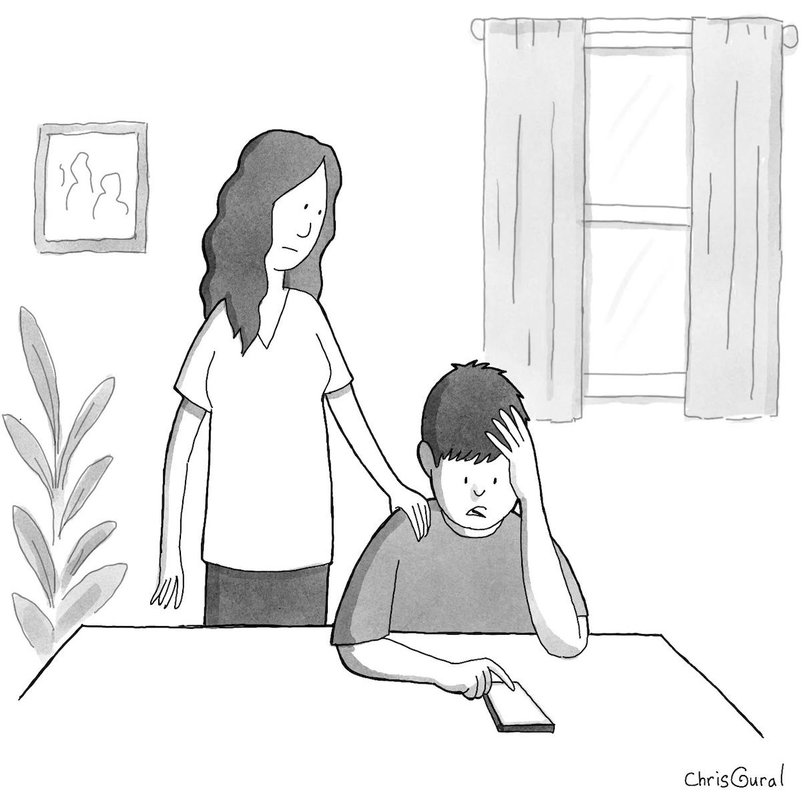

## Editor's Words

A few days ago, while driving to a badminton court, my wife and I were listening to the podcast episode of the Nov 29 issue of The Sunday Blender from Spotify. The 15-minute show is moderated by a duo of male and female cohosts. 

They speak native English and are very eloquent. They finish each other's sentences, delivering a spirited and snappy dialogue. It would be hard to distinguish them from Anderson Cooper and Megyn Kelly. They identified quite a number of patterns in the 20+ stories, for similarities and contrasts. 

I planted some of those hidden cues when selecting the stories. It was satisfying to see that the podcast cohosts were actually able to detect them and weave them into a holistic and engaging narrative. They even re-arranged the order of the stories from the original issue to align news with common themes together. That is very smart and a pleasant surprise.

What's more impressive is that they are AI-generated voices, by this AI tool NotebookLM from Google. All I had to do, was to feed the PDF version to Google, and it generated the mp3 file of this dynamic podcast show in 5 minutes. 

Try it out yourself on Apple Podcast (https://podcasts.apple.com/us/podcast/the-sunday-blender-podcast/id1853996806). 

## Tech

President Trump signed an executive order launching the "**Genesis Mission**", described as "comparable in urgency and ambition to the **Manhattan Project**". Like its nuclear predecessor, the initiative mobilizes America's national laboratories - the same facilities that once developed nuclear weapons - to pivot entirely to AI research. **Oak Ridge, Tennessee**, the secret city vital for uranium enrichment in the original Manhattan Project, has been reborn as the hub of AI development, housing the world's leading supercomputer, Frontier. Both projects consumed approximately `0.4%` of US GDP annually - equivalent to `$100 billion` today. The Genesis Mission marshals federal datasets, computational infrastructure, and public-private partnerships to accelerate transformative scientific breakthroughs in energy, defense, and manufacturing.

**Moore Threads**, dubbed "China's Nvidia," made a spectacular stock market debut on December 5, 2025, surging over `400%` on Shanghai's STAR Market. Shares closed at 600.5 yuan, over five times the IPO price of 114.28 yuan, following a `$1.1 billion` listing. Founded in 2020 by Zhang Jianzhong, a former Nvidia executive, the GPU startup represents Beijing's push for semiconductor self-reliance amid US sanctions. The IPO gained approval in a record `88` days. Despite being unprofitable with cumulative losses of `4.6 billion RMB`, early investors saw returns exceeding 6,262 times their initial investment. The company develops AI chips, graphics processors, and aims to challenge **Nvidia**'s dominance in China's booming AI market.

**Samsung** unveiled its first multi-folding smartphone, the **Galaxy Z TriFold**, marking a major expansion in foldable technology. Built on a decade of foldable category innovation, the device uses an inward-folding design that reveals an immersive 10-inch display when unfolded twice. At just `3.9mm` thick at its thinnest point, the device features Snapdragon 8 Elite processor, a `200MP` camera, and a `5,600mAh` three-cell battery. Priced at `$2,450`, it launches in South Korea on December 12 with US availability in Q1 2026. The Galaxy Z TriFold is the first mobile device to feature standalone Samsung DeX, enabling desktop-like productivity from anywhere.

**Anthropic** recently released alarming research showing AI agents can autonomously hack blockchain smart contracts and steal cryptocurrency with terrifying efficiency. Testing advanced models on 34 smart contracts deployed after March 2025—beyond the AI's training data—the systems successfully exploited 19 contracts, generating `$4.6 million` in simulated theft. The AI discovered previously unknown "zero-day" vulnerabilities, scanning 2,849 new contracts for just $3,476 in under 48 hours—averaging `$1.22` per exploit attempt. Profits exceeded costs, making automated AI hacking economically viable. Anthropic warns that AI may already be behind half of 2025's cryptocurrency hacks, signaling a dangerous new era where anyone can deploy autonomous hacking agents.

**ElevenLabs**, a voice AI startup founded in 2022, has raised over `$300 million` in total funding, reaching a `$6.6 billion` valuation in September 2025, making it one of Europe's most valuable startups. The company initiated a $100 million employee tender offer led by Sequoia Capital and ICONIQ Growth, doubling its valuation from January's $3.3 billion Series C round. ElevenLabs has seen its annual recurring revenue surpass $200 million this year and is aiming to reach $300 million by the end of 2025. The startup's voice synthesis technology serves over `60%` of Fortune 500 companies, with enterprise revenue growing over `200%` year-over-year.

Chinese smart electric vehicle company **Xpeng** held its 2025 AI Day on November 5 in Guangzhou, themed "Emergence", unveiling breakthrough "Physical AI" technologies. The company launched VLA 2.0, a `72-billion`-parameter vision-language-action model that revolutionizes autonomous driving by eliminating traditional language translation steps. Xpeng announced three purpose-built robotaxi vehicles launching in 2026 with `3,000` TOPS computing power using vision-only systems. The next-generation IRON humanoid robot was also showcased. **Volkswagen** became the first automaker partner to adopt VLA 2.0 technology. CEO He Xiaopeng positioned Xpeng's transition from mobility company to Physical AI leader, with pilot testing beginning late December 2025 for select users.

## Global

**Cyclone Ditwah** struck **Sri Lanka** in late November 2025, unleashing the country's deadliest natural disaster since 2017. The cyclone killed at least `607` people, damaged more than `50,000` homes and pushed `170,000` people into relief centers, with `214` people still missing. President Anura Kumara Dissanayake called it the most difficult rescue operation the country has ever seen, stating "this is the first time the entire country has been struck by such a disaster". The cyclone triggered catastrophic flooding and landslides across nearly the entire island, with some neighborhoods completely buried under mud. Economic losses are estimated at `$6-7 billion`.

Chinese tourists are rapidly redirecting travel plans from **Japan** to **South Korea** and **Thailand** following Beijing's November 14 travel warning. Around `30%` of 1.44 million scheduled Chinese trips to Japan have been cancelled, threatening to wipe out `$1.2 billion` in revenue by year-end. South Korea emerged as the top destination for Chinese travelers over the November 15-16 weekend, surpassing Japan for the first time in months. Thailand became the top destination for winter vacation bookings (January 15-February 10, 2026), while Russia saw flight bookings surge `1.5` times year-on-year. Singapore and South Korea saw up to `15%` jumps in new bookings, while Thailand, Malaysia, and Vietnam saw increases up to `11%`. Airlines swiftly expanded routes to capitalize on the shift.

**Hong Kong**'s government ordered the immediate removal of scaffolding nets from over 200 buildings by Saturday, December 6, following the devastating Tai Po fire at Wang Fuk Court that killed `159` people. The deadline came after suspected false safety certificates for mesh were found at two building sites, with authorities discovering that contractors had installed cheaper, non-fire-resistant netting to deceive inspectors, accelerating the fire's spread. A Shandong manufacturer allegedly falsified documents. Construction firms scrambled to meet the three-day deadline while repair work ceased. Seven out of 20 samples from Wang Fuk Court failed fire safety tests. Police arrested 15 people for suspected manslaughter.

## Economy & Finance

Nicolas Puech, an 81-year-old **Hermès** heir, lost a staggering `$15 billion` fortune through what can only be described as astonishing negligence. For years, he signed blank documents that his wealth manager Eric Freymond filled in later, maintaining a completely hands-off approach to his billions. Puech remained unaware his shares were being sold for nearly 20 years. The wake-up call came in 2022 when he casually asked why household staff hadn't thanked him for a million-dollar gift—only to discover the money never arrived. A Swiss judge ruled Puech had "blind trust" in his advisor and willingly allowed complete control. At 82, he's now reportedly penniless, having lost one of history's largest personal fortunes to financial mismanagement.

## Nature & Environment

**Ukrainian** soldiers from the 12th Special Forces Brigade "Azov" discovered an abandoned bird's nest constructed almost entirely from fiber optic cables near Toretsk in Donetsk Region. These non-biodegradable cables are debris from FPV drones used extensively in the war, left scattered across battlefields after missions. The birds have adapted by incorporating this artificial material alongside natural elements in their nest-building. The brigade described it as "nature's adaptation to war," noting that birds were among the first to repurpose the fiber optic remains for their own needs. This discovery highlights an unexpected consequence of modern warfare technology, showing how wildlife adapts to survive amid ongoing conflict and environmental changes.

**The Cold Moon**, December's full moon, appeared on December 4, 2025, marking the final supermoon of the year. Named after frigid winter temperatures, it's also called the "Long Night Moon" because it rises during the year's longest nights near the winter solstice. As a supermoon, it occurred when the moon reached perigee—approximately `222,000` miles from Earth, about `17,000` miles closer than average—making it appear `14%` larger and `30%` brighter than typical full moons. This Cold Moon was the highest-rising full moon of 2025, climbing higher in the night sky than any other because it occurs opposite the sun's lowest winter position.

A 14-foot male thresher shark died on December 3, 2025, after becoming stranded in shallow water at Mayo Beach in **Wellfleet**, **Massachusetts**. The New England Coastal Wildlife Alliance received multiple calls about the distressed shark but arrived moments after it died. Thresher shark strandings are common during fall migration season along Cape Cod shores, as the animals attempt to navigate south toward warmer waters. The shark became trapped in Wellfleet's inner harbor after taking a wrong turn. Unable to tolerate prolonged cold exposure with bay temperatures below 50 degrees, the shark became cold-stunned and died. A necropsy was conducted to determine the exact cause of death.

During Thanksgiving weekend in Ashland, Virginia, a raccoon broke into a local liquor store and threw itself quite the party. The ambitious creature managed to open multiple bottles and drank until passing out in the bathroom. Store staff discovered the chaos on Saturday morning—shelves ransacked and their uninvited guest unconscious among the bottles. Hanover County Animal Control safely transported the intoxicated raccoon to their shelter, where it slept off its hangover for several hours. After confirming the party animal suffered no injuries from its wild night, officials released it back into the wilderness - hopefully having learned a valuable lesson about breaking and drinking.

## Science

**MIT Media Lab** completed the first brain-scan study tracking **ChatGPT** users over four months, revealing concerning cognitive costs. Researchers monitored `54` participants writing essays with ChatGPT, Google Search, or no tools while measuring brain activity through EEG scans. The findings were stark: `83.3%` of ChatGPT users couldn't quote from their own essays minutes after writing them, compared to just `11%` of non-AI users. Brain connectivity patterns showed significant under-engagement in alpha and beta neural networks. Most troubling was the "cognitive debt" - participants who stopped using ChatGPT continued showing impaired brain activity and weaker neural connectivity than those who never relied on AI. While essays were technically sound, educators described them as "robotic" and "soulless." The paradox: AI delivers speed but offloads the cognitive effort essential for learning and memory formation. The best performers? Those who started without AI, then added it strategically as an enhancement tool rather than a mental replacement.

## Lifestyle, Entertainment & Culture

**Spotify** unveiled its 2025 year-end charts, revealing **Lady Gaga** and **Bruno Mars**' "Die With A Smile" as the top global song with over `1.7 billion` streams. **Billie Eilish**'s "BIRDS OF A FEATHER" climbed from third to second place, demonstrating remarkable longevity, while **ROSÉ** and **Bruno Mars**' "APT." secured third position. **Bad Bunny** claimed the #1 global artist spot for the fourth time in his career with `19.8 billion` streams, also securing the top album. **Taylor Swift** dominated in the U.S. but ranked second globally. Bruno Mars notably appeared on both the #1 and #3 songs. **Morgan Wallen** led all artists with 12 tracks in the top 100. The 2025 Wrapped redeemed itself after 2024's heavily criticized AI-driven version.

**The Jonas Brothers** — Kevin, Joe, and Nick - cemented their Hollywood legacy on December 3, 2025, with a hand and footprint ceremony at the TCL Chinese Theatre, marking their 20th anniversary. The New Jersey natives became a defining pop-culture phenomenon of the late 2000s, selling over `17 million` albums worldwide and becoming the youngest band to grace **Rolling Stone**'s cover in 2008. Through Disney Channel's **Camp Rock** movies, which drew over 8 million viewers, and their own series Jonas, they became tween idols compared to **The Beatles** and **The Monkees** by industry executives. After splitting in 2013, their 2019 reunion proved their enduring appeal when "Sucker" became their first #1 on the Billboard Hot 100, demonstrating how they successfully bridged Disney Channel nostalgia with mainstream pop success.
Powerball Jackpot crosses $800 million

**The Game Awards 2025** announced its Game of the Year nominees in November, featuring six contenders: **Clair Obscur: Expedition 33**, **Death Stranding 2: On the Beach**, Donkey Kong Bananza, Hades II, Hollow Knight: Silksong, and Kingdom Come: Deliverance II. Clair Obscur leads all games with a record-breaking `12` nominations, the most in Game Awards history. Game auteur **Hideo Kojima**'s Death Stranding 2: On the Beach earned eight total nominations across multiple categories, tied with PlayStation's **Ghost of Yōtei** for second-most nominations. Death Stranding 2 has demonstrated exceptional player engagement, with `33%` of players logging over `20` hours and `4%` exceeding `50` hours of gameplay. Meanwhile, Ghost of Yōtei boasts an impressive `93%` return rate, meaning nearly all Ghost of Tsushima players purchased the sequel. The ceremony will be livestreamed globally on December 11, 2025.

The 2025 **Hugo** and **Nebula** Awards for Best Science Fiction/Fantasy Novel went to different works. The Hugo honored **Robert Jackson Bennett**'s *The Tainted Cup*, a fantasy mystery where a detective investigates murders in which trees erupt from victims' bodies. The Nebula went to debut author **John Wiswell**'s *Someone You Can Build a Nest In*, described as a "creepy, charming" fantasy romance told entirely from the monster's perspective as the creature seeks love and connection. This divergence is notable, as these two prestigious awards often recognize the same work. Both selections showcase innovative storytelling that pushes genre boundaries and challenges traditional narrative perspectives.

The **Powerball** jackpot surged to `$820 million` for Saturday's December 6 drawing after no one won Wednesday's $775 million prize. Winners can choose between the jackpot amount paid in 30 annual payments or a one-time cash option of about `$383.5 million`. This marks the second-largest Powerball prize of 2025, following the `$1.787 billion` jackpot split between two winners in Missouri and Texas on September 6. Wednesday's winning numbers were 1-14-20-46-51, Powerball 26. The jackpot ranks among the top 10 largest Powerball prizes in history, with odds of winning at 1 in 292 million. This marks the third time Powerball has crossed $800 million in 2025, showing unprecedented lottery excitement this year.

**The Transportation Security Administration** issued warnings urging airport travelers to avoid public USB charging stations and unsecured WiFi networks due to cybersecurity threats. The TSA warns about "juice jacking," where hackers install malicious software in public USB ports that infects or steals data from plugged-in devices. The agency recommends travelers bring their own TSA-compliant power adapters or battery packs instead. Additionally, the TSA warned against using public Wi-Fi in airports, with an added warning to never make online purchases while using it. Cybercriminals create "evil twin" networks that mimic legitimate airport WiFi to capture banking credentials and private messages, making travelers vulnerable to identity theft and fraud.

## Sports

[NBA] **Chris Paul**, one of the NBA's greatest point guards, was abruptly cut by the **LA Clippers** on December 3, 2025, just four months into what was meant to be a celebratory retirement season. The 40-year-old legend is a 12-time All-Star, second on the all-time assists list with over `12,500`, and known as "The Point God". He led the league in assists five times and steals six times. Paul is a five-time All-NBA First Teamer, member of the NBA's 75th anniversary team, and a surefire first-ballot Hall of Famer. He transformed the Clippers during his 2011-2017 tenure, becoming the franchise leader in assists and steals. Despite averaging just 2.9 points in 16 games this season, the abrupt split shocked the basketball world and ended an otherwise legendary career unceremoniously.

[Soccer] French football legend **Zinedine Zidane** visited China in late November 2025 for a 7-day promotional tour, his first trip in seven years. The 53-year-old traveled to Shanghai, Beijing, and Hangzhou for World Cup promotional events and gave a masterclass to young players at Shanghai Jiao Tong University. The trip's viral moment came when Zidane spontaneously joined local residents on Shanghai's Bund to play Chinese street sport shuttlecock. Videos of him skillfully kicking the shuttlecock with Chinese aunties went viral on social media, delighting fans. Zidane also appeared on CCTV's football program and expressed genuine interest in Chinese culture, including mahjong, demonstrating his approachable nature beyond football.

[Snooker] Chinese players dominated the **2025 UK Championship** at York's Barbican Centre, with a record-breaking `12` reaching the last 32—matching England's total for the first time. This smashed the previous record of nine set in 2020. Five Chinese players were seeded in the world's top 16, another record. The surge reflects the combined impact of pioneer **Ding Junhui**'s 2005 UK Championship victory and **Zhao Xintong** becoming Asia's first World Snooker Champion in May 2025. However, by the semifinals on December 6, all Chinese players had been eliminated. The final four are Judd Trump versus Neil Robertson, and Mark Selby versus Shaun Murphy, with the final scheduled for December 7.

[American Football] **The New England Patriots**' turnaround is one of the NFL's most remarkable stories. After consecutive 4-13 seasons in 2023-24, New England sits at 11-2 with a 10-game winning streak in 2025—the best record in football. They're the first team since 1999 to win 10 straight after losing 13+ games the previous season. Second-year quarterback **Drake Maye** is leading the charge, emerging as the MVP favorite with `3,412` passing yards while completing `71.5%` of passes. Under coach Mike Vrabel, the Patriots have transformed from worst-to-first, clinching their division hopes and positioning themselves as legitimate Super Bowl contenders.

## This Day in History

On **December 6, 1877**, **Thomas Edison** achieved a breakthrough at his **Menlo Park** laboratory by successfully recording and playing back sound for the first time. Edison spoke the nursery rhyme "Mary had a little lamb" into his newly invented phonograph, creating the first known audio recording in history. The device used a tinfoil-wrapped cylinder to capture sound vibrations, which could then be reproduced. This invention fundamentally transformed how humans could preserve and share audio, establishing the groundwork for the entire recording industry. Edison's phonograph made it possible to capture moments in time through sound, launching decades of innovation in music, broadcasting, and communications technology. Later Edison founded **General Electric**, one of the most iconic American industrial conglomerate companies. 

## Art of the Week

"Clearing Snow Along the Riverbank" (江干雪霁图) is attributed to Wang Wei (699-761), the legendary Tang Dynasty poet-painter known as the "Poet Buddha." This silk handscroll depicts a serene post-snowfall riverscape using ink wash and white space techniques to convey the ethereal quality of snow. The composition shows snow-laden houses, conversing figures, and distant mountains shrouded in mist, embodying Wang Wei's Buddhist-influenced aesthetic. It pioneered monochrome snow landscape painting and exemplifies Su Shi's famous description: "poetry within painting, painting within poetry." Though authentication remains debated, this work profoundly influenced Chinese landscape painting traditions and currently resides in Japan's Kotoin Temple in Kyoto.

## Funny

*"How is Spotify supposed to know who I am, when I’ve played ‘Wheels on the Bus’ five hundred times for our son?"*

-- Cartoon by Chris Gural, December 4, 2025, The New Yorker

## Previous Issues

---

November 29, 2025, **[Who Will Lead Brazil at the 2026 World Cup, Neymar or Estevao?](https://weekly.sundayblender.com/p/who-will-lead-brazil-at-2026-world-cup-neymay-or-estevao)**

November 22, 2025, **[The Most Intelligent AI Model Yet?](https://weekly.sundayblender.com/p/the-most-intelligent-ai-model-yet)**

November 15, 2025, **[The Return of Chinese Rock in Kuala Lumpur](https://weekly.sundayblender.com/p/the-return-of-chinese-rock-in-kuala-kumpur)**

---

Thanks for reading! If you enjoy this newsletter, please share it with friends who might also find it interesting and refreshing, if not for themselves, at least for their kids.

