## Editor's Words

I always enjoyed playing badminton when growing up. It however completely vanished from my life as I started working, traveling, and moving from one country to another. I picked up the racket at the end of last year to keep the game interesting for my son, who loves the sport. It has since then become our family sport and we plan to keep it that way for years to come. 

Shanghai Badminton Open will take place on Dec 20-21, 2025. Just for fun, I registered for myself and my wife under the mixed double category, thinking the lottery odds would be too low for us to take this seriously. 

But surprise! We won the lottery. We're listed as one of the 50 teams for mixed double, along with many professional players and even Olympic silver medalists. Massive public humiliation awaits us next week.  

The Sunday Blender will take a break for next week as a result. I will be busy collecting shuttlecocks on the floor. Can't wait!

## Tech

**ByteDance**, the owner of **TikTok**, recently made a significant move into the hardware space by launching an AI-powered smartphone prototype in China that integrates their operating-system-level AI assistant, **Doubao Mobile Assistant**. Designed to be a seamless, unified interface, the Doubao assistant utilizes ByteDance's **Doubao** large language model to execute complex, cross-application tasks—like finding a dinner reservation while cross-referencing user schedules and reviewing social media—all through natural voice commands. While the phone quickly sold out, its aggressive integration prompted major rivals like **Tencent** (**WeChat**) and **Alibaba** (**Alipay**) to immediately restrict Doubao's access to their apps. The controversy centers on security and the threat to established business models that rely on controlling user traffic, forcing ByteDance to temporarily disable some of the assistant's advanced, cross-platform capabilities.

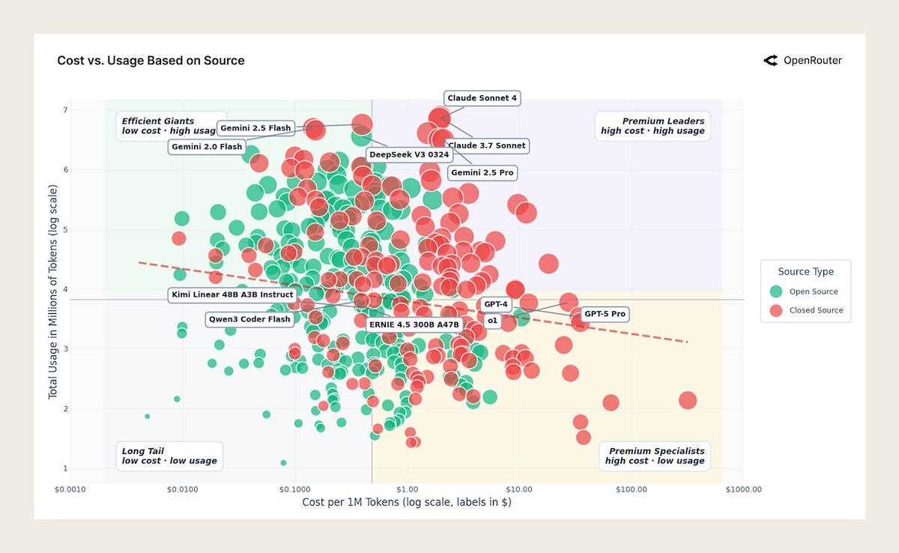

The recent **OpenRouter State of AI** report, based on analysis of over `100 trillion` tokens, reveals several key shifts in AI usage. Contrary to the productivity narrative, creative role-playing accounts for over `50%` of open-source model usage, surpassing coding and other tasks, due to fewer content filters. Furthermore, the report highlights the "rise of agents," noting that models with multi-step reasoning and tool-use capabilities now dominate traffic, transforming AI from a text generator into a task executor. Chinese models are rapidly gaining open-source market share, and a "Cinderella's Glass Slipper Effect" suggests that models that solve a high-value problem perfectly retain users much better than models that are only generically superior on benchmarks.

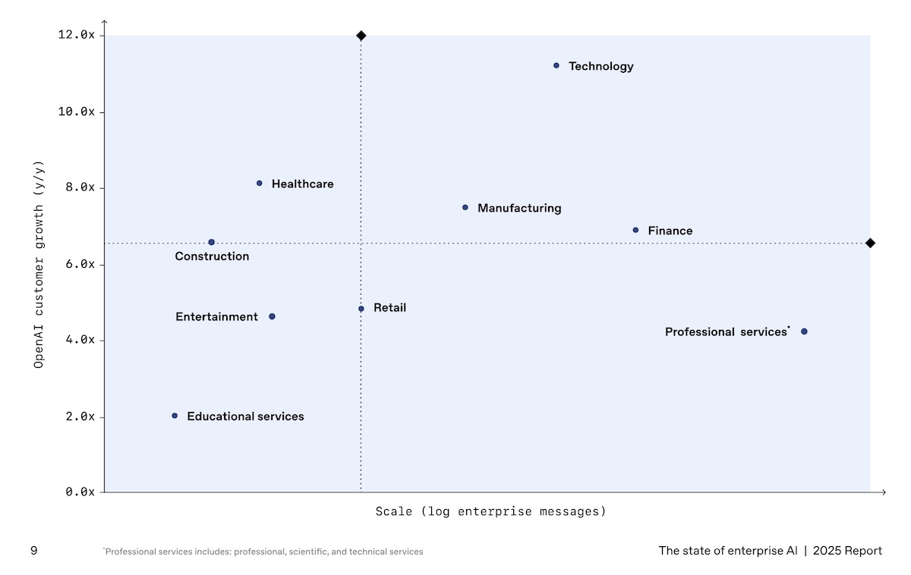

The recent **OpenAI State of Enterprise AI** report reveals that enterprise adoption is deepening significantly, though still in its "early innings." The volume of custom, complex workflows, such as specialized Custom GPTs and reasoning token consumption, has surged by over `300%` year-to-date, indicating a shift from casual querying to integrated, production-level tasks. While most workers report modest daily productivity gains of 40–60 minutes, a widening gap exists, with "frontier" users achieving dramatic increases (over 10 hours per week) by deeply integrating AI into processes. Crucially, the report finds that organizational readiness, not model performance, is now the primary constraint for enterprises looking to fully capture AI's value.

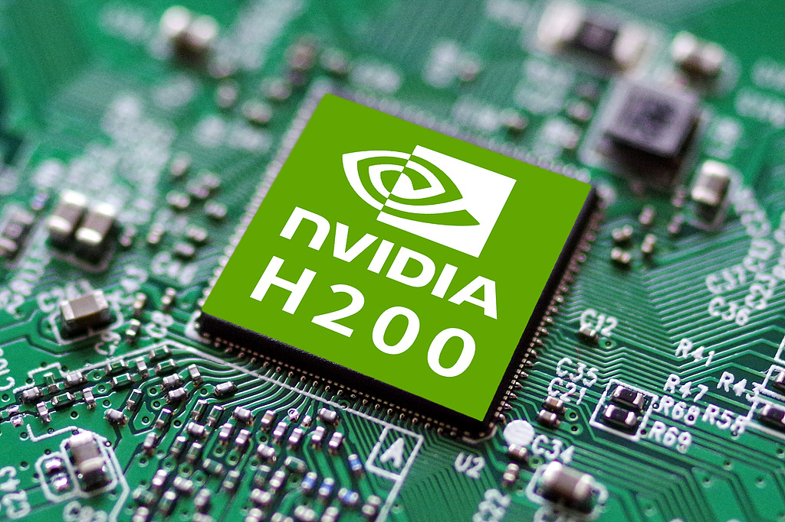

**President Trump** reversed Biden-era export controls on December 8, approving **Nvidia**'s `H200` AI chip sales to "approved customers" in China, with the US government taking `25%` of revenues. The decision sparked bipartisan congressional opposition and national security concerns, as H200s power advanced AI systems including military applications. The move marks a shift from security-focused restrictions to transactional trade policy. Beijing held emergency meetings with **Alibaba**, **ByteDance**, and **Tencent** to assess demand but may cap purchases or restrict H200 use in strategic sectors to favor domestic alternatives like **Huawei**'s `Ascend` chips. Nvidia's CEO expressed uncertainty whether China would accept the offer given Beijing's self-sufficiency drive.

## Global

**Australia** enacted the world's first social media minimum age law on December 10, 2025, requiring platforms to prevent users under 16 from holding accounts. Major services including **TikTok**, **YouTube**, **Instagram**, **Facebook**, **X**, and **Snapchat** must implement "reasonable steps" to block underage users or face penalties up to `$50 million`. The legislation places responsibility on platforms rather than parents or children, mandating age verification systems while protecting user privacy. The controversial law passed despite opposition from digital rights advocates and mental health experts concerned about privacy invasion and cutting off support channels. Australia's move signals potential global regulatory momentum on youth social media access.

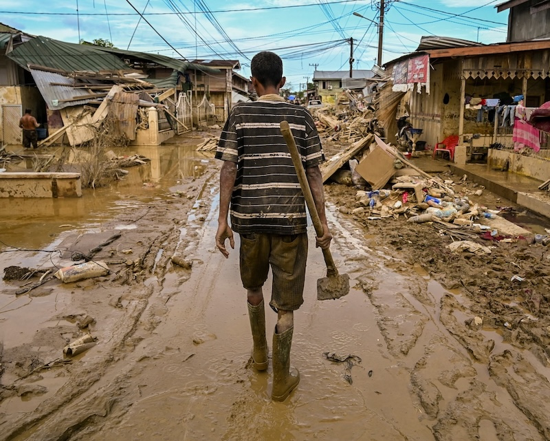

In **Indonesia**, at least 961 people were killed in Aceh, North Sumatra, and West Sumatra, with 293 still missing and over 5,000 injured. More than 1.1 million people were affected, with 570,000 displaced, making it Indonesia's deadliest natural disaster since the 2018 Sulawesi earthquake and tsunami. Over 156,000 homes were damaged and 975,075 people are in temporary shelters. Flash floods carried logs that smashed houses, while contaminated wells and shattered pipes forced survivors to boil floodwater for drinking, causing children to fall ill. Aceh's governor reported people dying from starvation rather than flooding, with critical shortages of medical personnel.

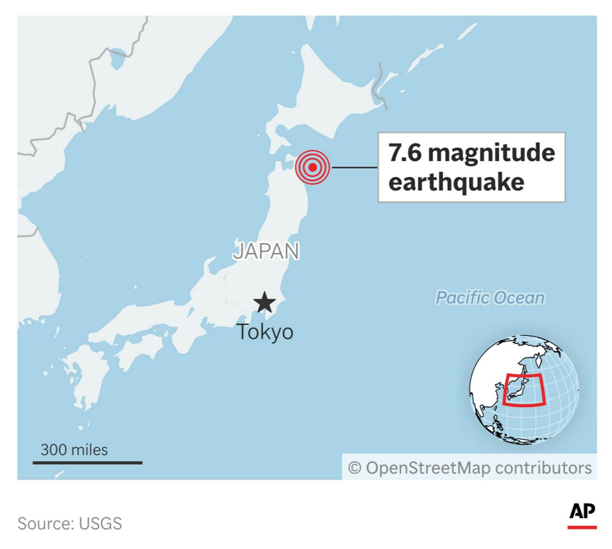

A powerful `7.5-magnitude` earthquake struck off the coast of **Japan**'s northeastern regions, including **Aomori** and **Hokkaido** prefectures, on Monday night, December 8, 2025. Prime Minister Sanae Takaichi confirmed early reports of at least 30 injuries and one residential fire. The strong tremor triggered tsunami warnings and advisories, prompting the evacuation of about `90,000` coastal residents to higher ground. Tsunami waves up to `70 centimeters` were observed, though the warnings were later lifted. The Japan Meteorological Agency has cautioned that there is an increased risk of another large quake in the same area in the coming week, urging residents to remain vigilant.

## Economy & Finance

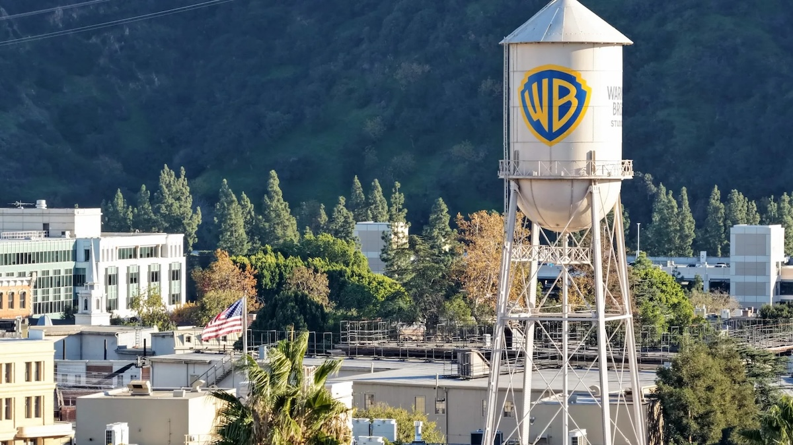

**Warner Brothers Discovery** (WBD) found itself at the heart of a massive takeover battle after falling into significant debt and putting its assets up for sale. **Netflix** first secured an agreement to acquire WBD's studio and streaming businesses—a package including the **DC Universe**, **HBO**, and the **Harry Potter** franchises—valued at approximately `$82.7 billion`. Days later, rival **Paramount Skydance** launched an unsolicited, all-cash, `$108.4 billion` bid for the entire WBD company. This struggle has profound entertainment implications: the winning bidder will control one of Hollywood's most valuable content libraries, dictating the theatrical future of films and, crucially, reshaping the theme park industry by gaining direct ownership or control over licensing for lucrative intellectual property like **DC Comics** and the **Wizarding World of Harry Potter** attractions currently licensed to competitors.

**HashKey Holdings** operates Hong Kong's largest licensed crypto exchange, offering trading, custody, staking services, and tokenization businesses. This IPO marks the first time a dedicated crypto exchange has sought a public listing in Hong Kong, distinguishing it from OSL Group, which entered crypto after its IPO. HashKey is one of 11 virtual asset trading platforms recognized by Hong Kong's Securities and Futures Commission, part of the city's 2022 push to position itself as a global hub for digital assets. If successful, the listing could serve as a reference point for future cryptocurrency exchange offerings in the city and influence how other digital-asset firms structure their fundraising plans. The IPO tests Hong Kong's ambitions to become Asia's regulated crypto center despite mainland China's continued cryptocurrency ban.

## Nature & Environment

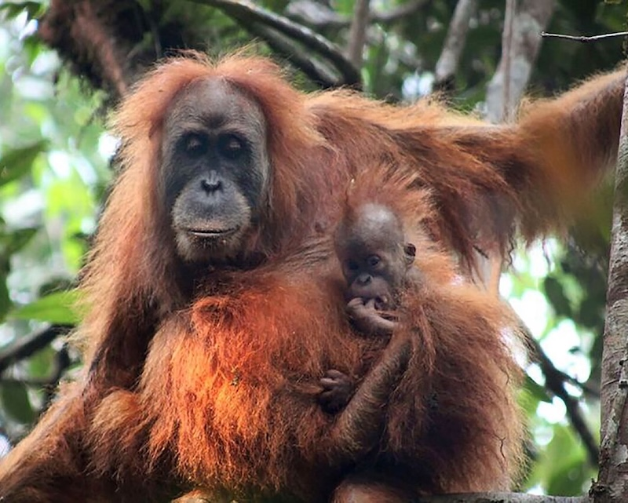

Scientists warned that Indonesia's deadly flooding was an "extinction-level disturbance" for the world's rarest great ape, the **Tapanuli orangutan**, causing catastrophic damage to its habitat. Only classified as a species in 2017, fewer than `800` Tapanulis remain in the wild, confined to Sumatra's Batang Toru region. As many as 35 critically endangered Tapanuli orangutans — `4%` of the species' total population - may have been wiped out, with one carcass already found. Over `9%` of their West Block habitat was destroyed. Indonesia's government acknowledged that industrial plantations, hydropower, and gold mining contributed significantly to environmental pressure, announcing suspension of operating permits pending review.

## Science

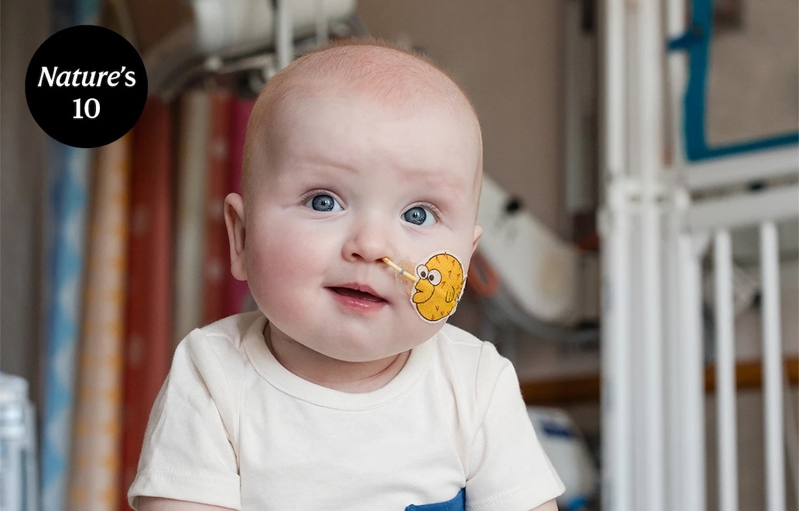

**Nature** Magazine's 10 for 2025 spotlights individuals who shaped the year's most significant science stories, from groundbreaking discoveries to political battles over scientific integrity. The list includes deep-sea explorer Mengran Du, who descended `9,000` meters beneath the ocean to discover strange new ecosystems, and physicist Tony Tyson, whose decades-long work enabled the Vera Rubin Observatory in Chile. Chinese financier Liang Wenfeng disrupted AI development with **DeepSeek**, an open-weight model built with minimal resources that scientists can download free, while Brazilian researcher Luciano Moreira opened the first factory producing Wolbachia-infected mosquitoes for disease control. Toddler KJ Muldoon flashed a chubby-cheeked smile seen around the world after receiving innovative gene-editing therapy that cured his ultra-rare metabolic disorder. CDC (Centers for Disease Control and Prevention) director Susan Monarez was fired after refusing to compromise scientific integrity under political pressure. The list also features researchers advancing Huntington's disease treatment, pandemic negotiations, and research integrity watchdogs who exposed publication fraud.

## Lifestyle, Entertainment & Culture

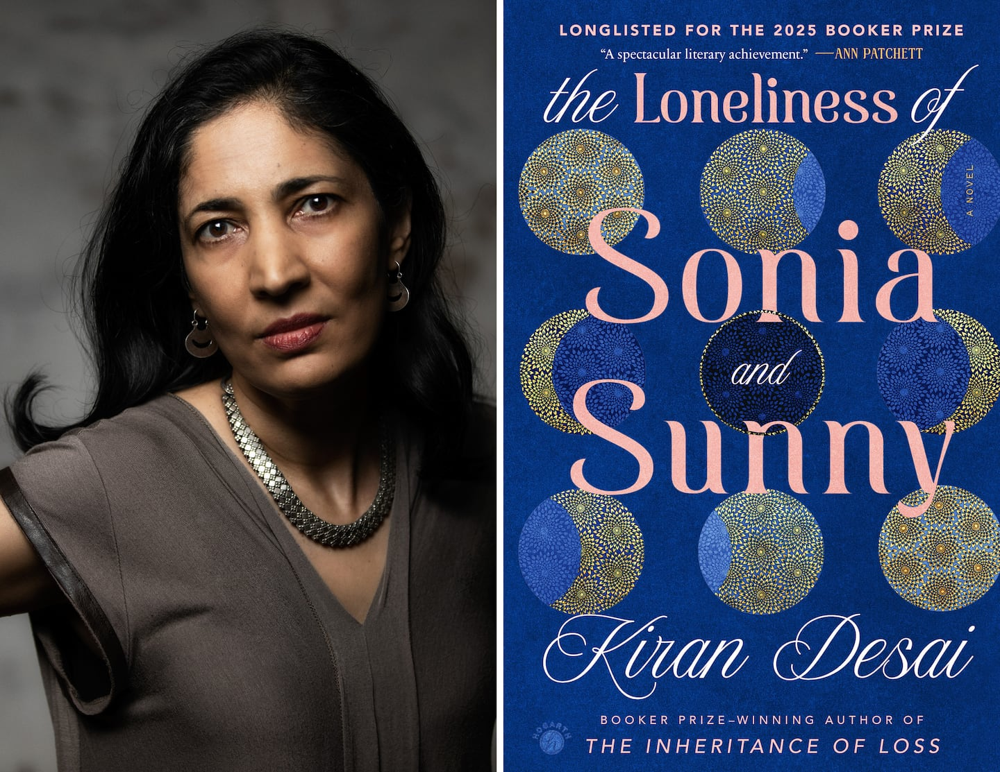

**Kiran Desai**'s "**The Loneliness of Sonia and Sunny**" achieved rare distinction as the only book appearing on all three major year-end lists: The New York Times Best Books of 2025, Amazon Best Books of the Year, and Barnes & Noble Books of the Year. The novel, a **Booker Prize** and **Kirkus Prize** finalist, tells a sweeping story about two young people whose fates intersect across continents and years. It's an epic exploring love, family, India and America, tradition and modernity by the Booker Prize-winning author of "The Inheritance of Loss". Readers praised it as "unforgettable," cementing its status as 2025's standout literary achievement across diverse critical perspectives.

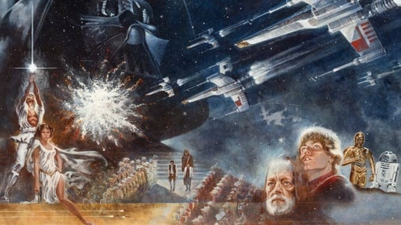

The original painting that introduced **Star Wars** to the public sold for `$3.875 million` at auction, setting a record as the most expensive Star Wars memorabilia ever. Created by artist Tom Jung in acrylic and airbrush, the artwork first appeared in newspaper ads on May 13, 1977, giving Americans their first glimpse of the galaxy far, far away. Producer Gary Kurtz kept the painting on his office wall before passing it to his daughter, who put it up for auction at Heritage Auctions with bidding starting at $1 million. The sale surpassed the previous record holder - **Darth Vader**'s lightsaber at `$3.6 million`.

The 83rd Annual **Golden Globe** nominations were announced on December 8, 2025, with the ceremony airing January 11, 2026 on CBS. "**One Battle After Another**" leads film categories with nine nominations, including best musical/comedy and best director, while "**The White Lotus**" leads television with six nominations. Major surprises included nominations for Dwayne Johnson and Julia Roberts, while "Wicked: For Good" was notably snubbed from the best musical/comedy category. For the first time, the Golden Globes will honor podcasting with a new category featuring nominees like Dax Shepard's "Armchair Expert" and "Call Her Daddy". Comedian Nikki Glaser returns as host.

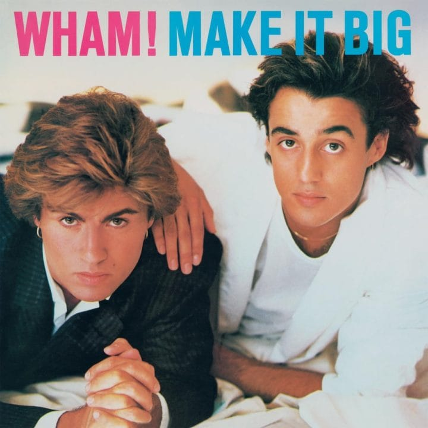

**Mariah Carey**'s "All I Want for Christmas Is You" leaped to No. 1 on the Billboard Hot 100, securing its 19th week atop the chart and seventh consecutive holiday season dominance. In the UK, **Wham!**'s "Last Christmas" displaced **Taylor Swift** to claim the top spot as the official Christmas Number 1 race kicked off December 12. Thirteen of Billboard's current top 20 songs are classic holiday tracks, with six released between 1946 and 1963. Contenders for the UK Christmas No. 1 include Netflix phenomenon KPop **Demon Hunters**' "Golden," **Kylie Minogue**'s "XMAS," and **RAYE**'s "WHERE IS MY HUSBAND!" Christmas classics continue their annual chart domination.

## Sports

[Soccer] The week's soccer headlines are dominated by the global phenomenon of **Lionel Messi** and **Cristiano Ronaldo**, both securing their futures while creating massive World Cup buzz. Messi extended his contract with **Inter Miami** through the 2028 MLS season, reaffirming his commitment to the league after capping the recent season by leading his club to the MLS Cup. Meanwhile, the seemingly ageless Ronaldo, who recently turned 40, extended his lucrative contract with **Al-Nassr** in Saudi Arabia until 2027, inspiring younger stars with his exceptional longevity. Crucially, the looming 2026 FIFA World Cup is expected to be the final international tournament for both legends, leading to unprecedented fan frenzy; the latest phase of ticket sales saw prices for matches featuring Argentina and Portugal soar to record highs, driven by the chance to witness the final chapter of the epic rivalry.

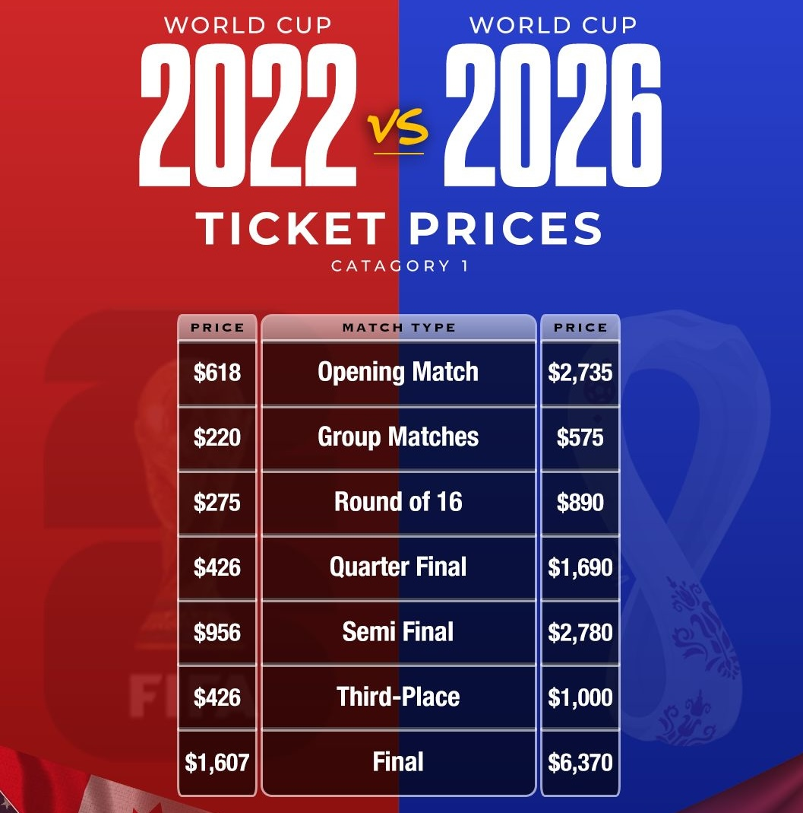

[Soccer] **FIFA** revealed 2026 World Cup ticket prices this week, sparking outrage among supporters, with the cheapest final ticket costing over `$4,185`. Football Supporters Europe described FIFA's approach as a "monumental betrayal" of fans and called for immediate halt to ticket sales. Premium final tickets at MetLife Stadium in New York are priced at `$8,680`, compared with roughly `$1,600` for equivalent category in Qatar 2022. FIFA implemented dynamic pricing at a World Cup for the first time, with prices fluctuating based on demand. The pricing dramatically departs from FIFA's 2018 bid document projecting group stage tickets starting at `$21`. Despite backlash, FIFA received `5 million` ticket requests in 24 hours.

[F1 Racing] **Lando Norris** captured his maiden **Formula 1 World Championship** in 2025, defeating **Max Verstappen** by just two points (423-421) in a dramatic **Abu Dhabi** finale. **Oscar Piastri** finished third with 410 points, making it **McLaren**'s first constructors' title since 1998. **Lewis Hamilton**'s debut **Ferrari** season proved challenging—finishing sixth with 156 points and no podiums, marking a stark contrast to his **Mercedes** glory years. The seven-time champion struggled to adapt to Ferrari machinery while teammate **Charles Leclerc** secured fifth place. McLaren dominated the constructors' championship, clinching their tenth title in Singapore and ending **Red Bull**'s recent dominance.

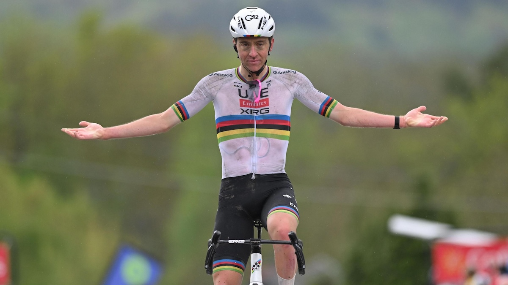

[Cycling] **Tadej Pogačar** was snubbed from the BBC Sports Personality of the Year 2025 nominations despite his staggering season featuring 20 victories, including three monuments, the **Tour de France**, and both European and World Road Race titles. This marks the second consecutive year the Slovenian cyclist missed the shortlist. The six nominees announced were Mariona Caldentey (football), Terence Crawford (boxing), Armand Duplantis (pole vault), Sydney McLaughlin-Levrone (athletics), Shohei Ohtani (baseball), and Mohamed Salah (football). The omission sparked outrage, with fans calling it "an absolute joke". Critics highlighted the frustrating double standard in recognizing cycling greatness compared to other sports, despite modern cycling having some of the most rigorous anti-doping measures in all sport. Even sports fans outside cycling expressed surprise at overlooking Pogačar's dominant achievements. The snub underscores cycling's ongoing struggle for mainstream recognition in major sporting awards.

[NBA] **The Oklahoma City Thunder** started the 2025-26 season with a historic `24-1` record, tying the 2015-16 Golden State Warriors for the best 25-game start in NBA history. The defending NBA champions are beating opponents by an average of 17.4 points per game, putting them on pace to challenge the 73-9 regular season record. Across their last 82 games, they've outscored opponents by `1,189` points—the largest point differential in any 82-game stretch in league history. The Thunder destroyed the Phoenix Suns 138-89, Phoenix's most lopsided loss in franchise history. Led by reigning MVP **Shai Gilgeous-Alexander** averaging `32.6` points, the Thunder have seven players averaging double figures.

## This Day in History

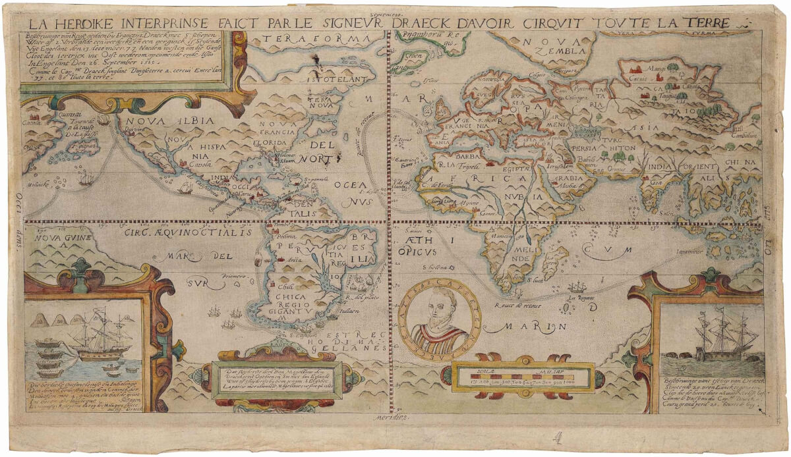

On **December 13, 1577**, **Sir Francis Drake** set sail from Plymouth, England, aboard the *Pelican* ship, commencing a secret, state-sponsored mission to circumnavigate the globe and raid Spanish holdings. This expedition, lasting nearly three years, was of profound historical significance as it directly challenged Spain's claim to global dominance. Drake returned in 1580, having successfully completed the first English circumnavigation, bringing back immense wealth that greatly enriched the English crown and cemented Drake's status as a national hero. This act of privateering severely heightened Anglo-Spanish tensions, accelerating the path toward war and establishing England as a formidable maritime power.

## Art of the Week

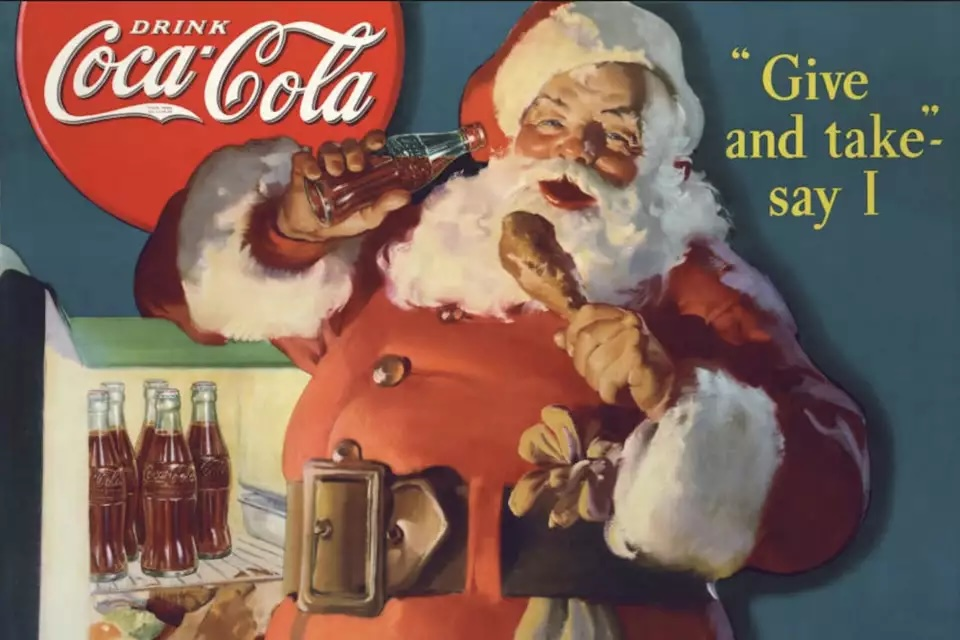

Before 1931, there were many different depictions of **Santa Claus** around the world, including a tall gaunt man and an elf. While **Coca-Cola** didn't create Santa Claus, its advertising played a major role in standardizing his image. In 1931, Coca-Cola commissioned illustrator **Haddon Sundblom** to paint Santa for Christmas advertisements. From 1931 to 1964, Sundblom created images showing Santa as a plump, cheerful man with rosy cheeks, white beard, and twinkling eyes, dressed in red and white—colors matching Coca-Cola's branding. Coca-Cola turned to Santa hoping the popular figure would help boost winter sales. Sundblom's paintings appeared on magazines, billboards, and store displays worldwide, cementing the modern Santa image we recognize today. 

## Funny

---

## Previous Issues

---

December 06, 2025, **[Humans Are No Longer the Only Species to Use Fiber Optics](https://weekly.sundayblender.com/p/human-are-no-longer-the-only-species-to-use-fiber-optics)**

November 29, 2025, **[Who Will Lead Brazil at the 2026 World Cup, Neymar or Estevao?](https://weekly.sundayblender.com/p/who-will-lead-brazil-at-2026-world-cup-neymay-or-estevao)**

November 22, 2025, **[The Most Intelligent AI Model Yet?](https://weekly.sundayblender.com/p/the-most-intelligent-ai-model-yet)**

---

Thanks for reading! If you enjoy this newsletter, please share it with friends who might also find it interesting and refreshing, if not for themselves, at least for their kids.

