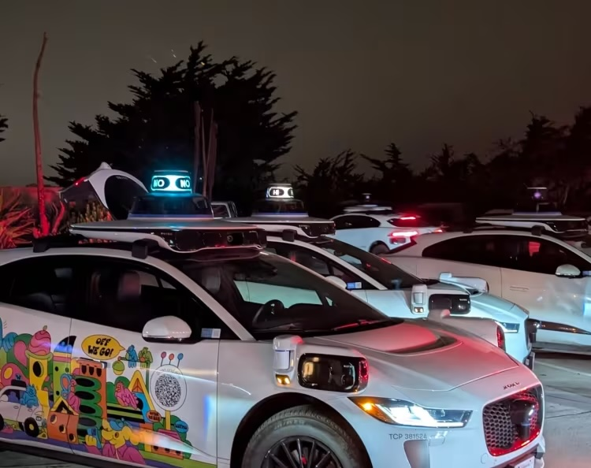
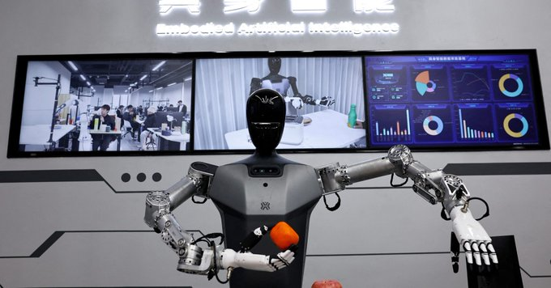
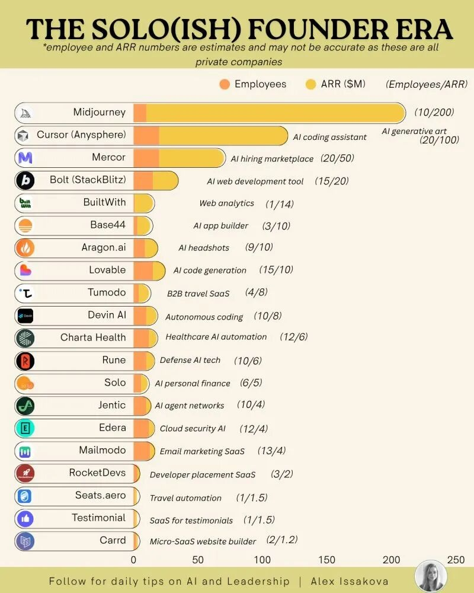
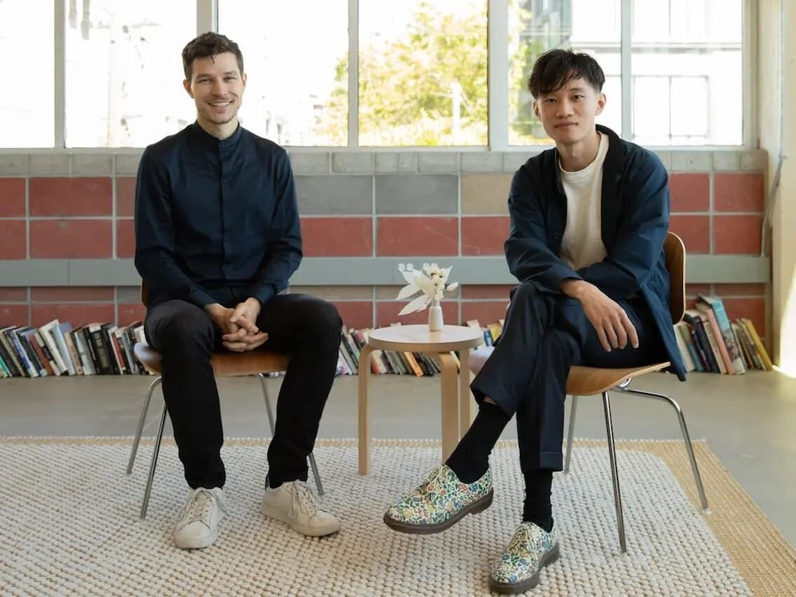
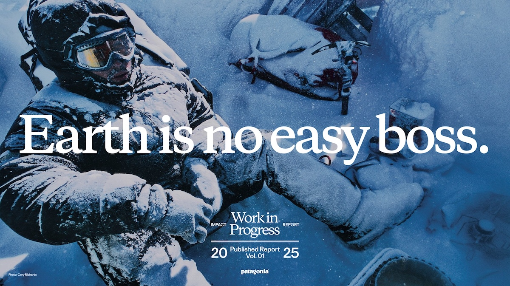
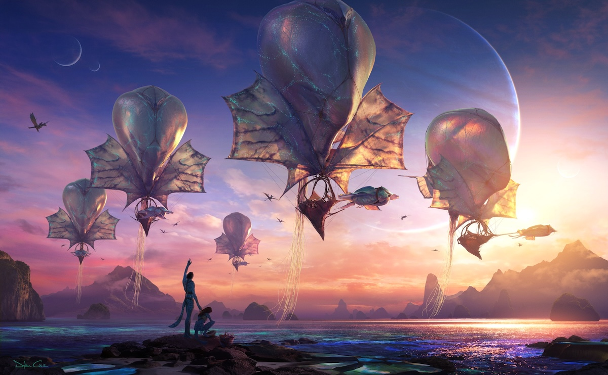
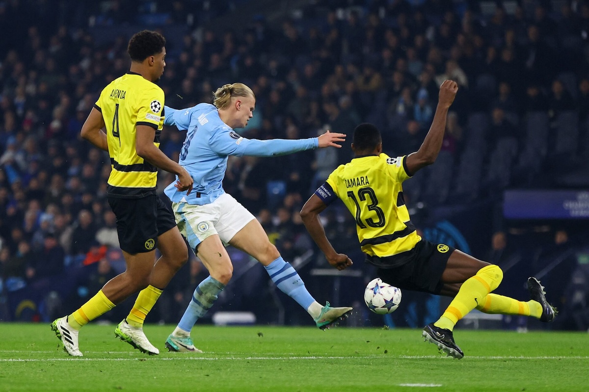
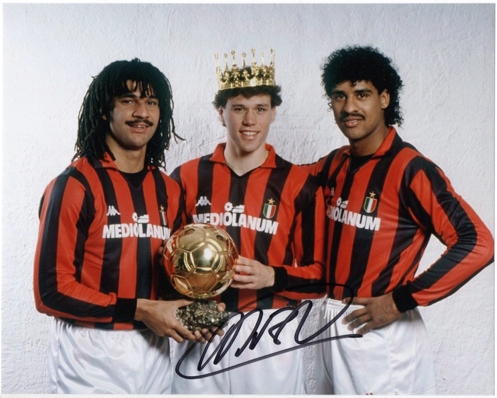
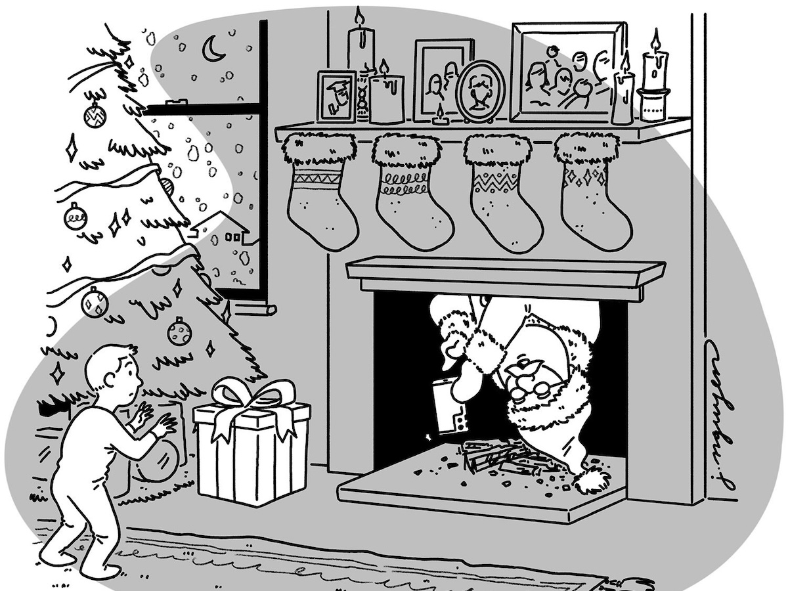

## Editor's Words

Have you noticed that reading articles on website has become a very unpleasant experience?

Those webpages are full of ads in every corner. They are in the beginning of the article, even before the body of the article is loaded. They are on the left and the right margins of the page - just to make sure you will not miss them. They are planted in the middle of the paragraphs, so that you have to look at them in order to read on. They also jump into your face as a pop-up window, often with a cancellation sign that is hard to detect. Who would care to read them, humans or AI bots?

While people's attention in the end of 2025 is shifting toward apps, social media platforms, and AI chat windows, the original World Wide Web is slowly degenerating into a wasteland that few would visit.

Getting quality content from an ad-free newsletter is one alternative route to fight against this overlord. Savvy?

## Tech

On December 21, a fire at a power substation caused a massive outage affecting roughly `130,000` homes and businesses - about a third of **San Francisco**. With traffic lights knocked out citywide, robotaxi company **Waymo**'s self-driving cars became stranded at intersections, blocking roads and causing traffic jams. Though the vehicles are programmed to treat dead signals as four-way stops, a sudden flood of "confirmation requests" to Waymo's remote support team overwhelmed the system. The company temporarily suspended service. Waymo says it successfully navigated over `7,000` dark stoplights that day and is now rolling out a software update to handle outages more decisively. **Elon Musk** seized the moment, posting on **X**: "**Tesla** Robotaxis were unaffected by the SF power outage" — though notably, Tesla doesn't actually operate a driverless robotaxi service in San Francisco.

**Luminar**, the lidar ("Light Detection and Ranging") maker once valued at over `$3 billion`, filed for Chapter 11 bankruptcy on December 15 after a tumultuous year. The collapse came shortly after **Volvo** — its largest customer — canceled a five-year contract in November. Luminar developed longer-range lidar sensors—laser-based technology that helps autonomous vehicles perceive road conditions, obstacles, and objects around them. **Elon Musk** has long dismissed lidar as unnecessary, famously calling it "a fool's errand" — **Tesla** relies on cameras alone instead. Ironically, Tesla was actually one of Luminar's biggest customers, contributing over `10%` of its Q1 2024 revenue. The company cited slower-than-expected adoption of autonomous vehicle technology as a key factor in its downfall.

China's Cyberspace Administration released draft rules today targeting AI services that simulate human personalities and engage users emotionally. The regulations cover AI products displaying simulated personality traits, thinking patterns, and communication styles through text, images, audio, or video. Key requirements include warning users against excessive use, intervening when addiction signs appear, and implementing safety measures throughout the product lifecycle — including algorithm reviews, data security protocols, and personal information protection. Providers must ensure services are ethical, secure, and transparent. The draft is now open for public comment, reflecting Beijing's proactive stance on consumer-facing AI governance.

**OpenAI** CEO Sam Altman revealed that his "little group chat with tech CEO friends" has a betting pool for when the first one-person billion-dollar company will emerge — "which would have been unimaginable without AI and now will happen." Data shows the share of solo-founded startups has risen sharply, with over one-third of new companies in the first half of 2025 launched by single founders. Author Tim Cortinovis believes 2025 will be remembered as the year the necessary tools became available, and **Anthropic**'s Mike Krieger suggests the milestone is "closer than you think." Companies like **Cursor** ($200M Annual Recurring Revenue with 20 people) and **Midjourney** (~$500M ARR with 10 employees) hint at what's coming.

**Notion**, the productivity platform founded by Ivan Zhao and Simon Last in 2013, has grown to `100 million` users and a `$10 billion` valuation. In a recent essay titled "**Steam, Steel, and Infinite Minds**", Zhao argues that every era is shaped by its "miracle material" — steel forged the Gilded Age, semiconductors powered the Digital Age, and now AI has arrived as "infinite minds." His co-founder Simon, once a "10× programmer," now rarely writes code — instead orchestrating multiple AI agents simultaneously, becoming a "30-40× engineer." Yet Zhao cautions that AI struggles more with general knowledge work than coding: context is fragmented across dozens of tools, and unlike code, knowledge work lacks verifiability through tests. Notion itself now deploys over `700` AI agents handling meeting minutes, IT requests, and onboarding — but Zhao believes the real limitation isn't technology, it's imagination and inertia.

## Global

`Storyteller` becomes corporate America's hottest job title. Professional social network **LinkedIn**'s job postings including the term doubled in the past year, with `50K+` open roles. Major tech companies like **Google** and **Microsoft** are building dedicated storytelling teams - Google for its Cloud division to drive customer acquisition, Microsoft for cybersecurity narrative. The surge reflects two converging trends: the collapse of traditional media (journalist roles down `25%` since 2000, print circulation dropped `70%` since 2005) and the flood of AI-generated content creating distrust. As one CEO noted, brands winning now are "the most authentic and human." Companies mentioned "storytelling" on earnings calls `469` times this year versus just `147` a decade ago.

**Hudson's Bay Company** — founded in **1670**, before **Canada** itself existed — is North America's longest continuously operating company. It once controlled vast fur-trading territories across British North America. Now, the `355`-year-old retailer is fighting to avoid a full shutdown in a **Toronto** courtroom. The chain filed for creditor protection in March after losing money and shoppers to the pandemic, inflation, and U.S.-Canada trade tensions. High-end department stores have struggled across North America — the pandemic boosted online shopping, inflation tightened budgets, and luxury brands increasingly bypass department stores to connect directly with customers. "This marks the end of a nearly 400-year-old institution," said one retail expert, warning of major consequences for malls that rely on department stores as anchors.

The Hong Kong Professional Education Publisher (HKPEP) recently released its **2026 Global Most Competitive International Schools Top 100** ranking. Evaluating over `1,500` schools worldwide on education input, process, and effectiveness, the list highlights Shanghai's prominence in global education. America and UK contributed `34` and `27` schools, combining for over `60%` of this list, continuing a steady trend over the past decade. `19` schools from China made the list, including `6` from Shanghai: **YK Pao**, **Shanghai High School International Division (SHSID)**, **Shanghai World Foreign Language Academy (WFLA)**, **Shanghai Pinghe School**, **Shanghai American School (SAS)**, and **Shanghai Starriver Bilingual School**, underscoring Shanghai's growing global influence in international education. 

## Economy & Finance

**Yiwu**, a city in eastern China, now produces an estimated `60% `of the world's Christmas decorations. Global supply chains have made importing resin ornaments from Zhejiang cheaper than carving them locally, and stall fees in major markets have risen to the point where only vendors with access to bulk-manufactured goods can afford entry — pricing out local artisans. What began as medieval winter fairs provisioning households before roads froze has become a sea of identical imports. Some cities are pushing back: **Strasbourg** bans mass-produced goods and requires regional sourcing, while **Nuremberg**'s Christkindlesmarkt preserves a dense ecosystem of local craftsmen.

The phrase "**US kill line**" has gone viral on Chinese social media, sparking discussion about economic vulnerability in American society. Borrowed from video games — where a "kill line" is a health threshold below which a character can be instantly defeated — the term describes a brutal financial collapse mechanism: once savings, income, or credit fall below a critical point, the system pushes individuals toward irreversible collapse. The case of Jack, a Seattle programmer earning `$450,000` annually, illustrates the phenomenon: burdened by $12,000 monthly mortgage, $3,000 car payments, and $1,500 insurance, a sudden layoff triggered foreclosure, then a $60,000 emergency visit crushed him — six months later, he was living under a bridge.

American outdoor apparel brand **Patagonia** has released its first comprehensive "**Work in Progress**" report covering fiscal year 2025. In September 2022, founder Yvon Chouinard and his family transferred ownership of the company to the Holdfast Collective and the Patagonia Purpose Trust — a structure that directs all excess profits to environmental nonprofits rather than private shareholders. The outdoor brand's carbon footprint rose `2%` to 182,646 metric tons, attributed to more carbon-intensive materials in new packs and duffels. The company reached `98%` renewable electricity and targets net zero by `2040` without offsets. Patagonia was blunt: while it runs North America's largest repair center, `85%` of its products lack end-of-life solutions.

## Nature & Environment

**Mars**' **Olympus Mons** is the largest volcano in the solar system, standing `16 miles` high and `374 miles` wide — bigger than **Hawaii** and two and a half times taller than **Everest**. It grew so massive primarily because Mars lacks mobile tectonic plates. Unlike Earth, where moving plates spread magma around, Mars' crust remains fixed over a stationary hotspot, allowing lava to pile up in the same spot for billions of years. Weaker gravity and less erosion from weather also helped. It's a shield volcano — slowly oozing lava rather than explosively erupting. Scientists believe it may still be active and could erupt again.

A study published in **Nature Climate Change** calculates when each of Earth's · glaciers will disappear under various warming scenarios. Even at the **Paris Agreement**(a global treaty adopted in 2015 to combat climate change by limiting global warming to well below `1.5°C` above pre-industrial levels)'s most ambitious `+1.5°C` target, roughly half would survive to `2100` — about `100,000` glaciers. At +4°C warming, only 18,000 would remain, with peak extinction around 2055 losing 4,000 glaciers annually. The Alps face severe losses: of 3,000 current glaciers, just 430 would survive at +1.5°C, dropping to about 20 at +4°C. Researchers emphasize this transforms glacier loss from a scientific concern into a deeply human story.

## Science

In **The Atlantic** magazine, Charlie Warzel explores what he calls the "phone-based retirement" — adult children noticing their aging parents consumed by devices, constantly scrolling **TikTok**, **Instagram**, or **Facebook**. In multiple instances, people reported that some of these adults seemed to not pay much attention to their grandchildren. A 2019 Pew study found people `60+` spend over `four hours` of daily leisure time on screens, while `40%` of adults aged 59-77 report feeling anxious without device access. Warzel notes the irony: for years, parents worried about kids' screen time, but now the problem exists "on the opposite side of the age spectrum." Adult children are increasingly reporting that their aging parents have developed what looks remarkably like the smartphone addiction typically associated with teenagers.

## Lifestyle, Entertainment & Culture

**Avatar: Fire and Ash**, the third installment in **James Cameron**'s epic sci-fi franchise, was released on December 19, 2025. The film follows Jake Sully (Sam Worthington) and Neytiri (Zoe Saldaña) as their family grapples with grief and faces a new aggressive Na'vi tribe, the Ash People, led by Varang (Oona Chaplin), amid escalating conflict on Pandora.Praised for stunning IMAX 3D visuals and action sequences, it explores darker Na'vi perspectives. Despite a softer domestic opening of `~$88 million` (below **The Way of Water**'s `$134 million`), it achieved a strong `~$347 million` global debut and crossed $500 million worldwide by late December, boosted by holiday legs, helping Disney surpass `$6 billion` in annual box office. Reviews highlight technical marvels but note less narrative innovation.

**Stranger Things** Season 5, the epic final chapter, unfolds in three parts on **Netflix**. Volume 1 (episodes 1-4) launched November 26, 2025, followed by Volume 2 (episodes 5-7) on Christmas Day, December 25. The two-hour finale, "The Rightside Up," arrives December 31. Set in fall 1987, the story centers on the Hawkins friends' desperate united front against Vecna's apocalyptic threat from the Upside Down. Themes of enduring friendship, sacrifice, grief, identity, and found family shine through emotional arcs amid intense action, powers awakening, and revelations about the Upside Down's origins. Volume 1 shattered records with `59.6 million` views in five days, the biggest English-language series premiere ever, topping charts in `90` countries. Reviews praise nostalgic spectacle and closure (`~84-85%` on Rotten Tomatoes), though some critique familiar plotting; audiences remain enthusiastic overall.

## Sports

[NBA] **Nikola Jokić** made NBA history on Christmas Day, recording `56` points, `16` rebounds, and `15` assists in **Denver**'s `142-138` overtime win over **Minnesota** — becoming the first player ever with a 55/15/15 game. He scored 18 points in overtime alone, setting an NBA record for the highest-scoring overtime period by an individual. His 56 points rank third-highest ever on Christmas Day, behind only **Bernard King** (60 in 1984) and **Wilt Chamberlain** (59 in 1961). **Anthony Edwards** scored 44 for Minnesota and hit a clutch shot to force overtime, but was ejected late after picking up two technical fouls. Teammate Peyton Watson summed it up: "We're watching history on a night-to-night basis."

[Soccer] **Erling Haaland** scored twice in **Manchester City**'s 3-0 win over **West Ham** on December 20, passing **Cristiano Ronaldo** on the **Premier League** all-time scoring list. The Norwegian now has `104` Premier League goals in just `114` games — while Ronaldo needed `236` appearances across two stints at Manchester United to reach `103`. That's `122` fewer games to surpass the five-time **Ballon d'Or** winner. With `38` goals in `28` games for club and country, this is shaping up to be the most prolific season of Norwegian superstar Haaland's career. At his current pace, Haaland is on course to break his own single-season record of `36` goals — with Alan Shearer's all-time career mark of `260` for Premier League now firmly in his sights.

## This Day in History

On **December 27, 1988**, Dutch striker **Marco van Basten** received the **Ballon d'Or** — with **AC Milan** teammates **Ruud Gullit** finishing second and **Frank Rijkaard** third. It marked the first and only time in the award's history that the top three finishers came from the same club and shared the same nationality. The award crowned Van Basten's extraordinary **Euro 1988** campaign, where he scored five goals including that unforgettable volley against the Soviet Union in the final — considered one of the greatest goals ever struck. "Marco, the Ballon d'Or? It's both brilliant and normal at the same time because he's the best in his position," said Dutch soccer legend **Johan Cruyff**. "Mentally, he's very strong. A wall! He's my spiritual son." It would be `22` years before **Barcelona**'s **Messi**, **Iniesta**, and **Xavi** replicated the club sweep. Van Basten would win two more Ballon d'Ors, cementing his place among the all-time greats.

## Art of the Week

Qiu Ying (仇英, c.1505-1552) was a remarkable rags-to-riches story in Chinese art history — a lacquer craftsman from a humble family who became one of the "Four Masters of Ming," alongside Shen Zhou (沈周), Wen Zhengming (文徵明), and Tang Yin (唐寅). His **"江南春" (Spring in Jiangnan)** is a 7-meter handscroll inspired by Yuan poet Ni Zan (倪瓒)'s lyrics, showcasing his mastery of blue-green landscape painting. The work blends meticulous brushwork with literati elegance — praised as "refined without being rigid, beautiful without being saccharine." After Qiu completed the painting, Wen Zhengming, Wang Chong (王宠), and eight other Wu School (吴门画派) masters added poetic inscriptions, forming a complete artistic chain of "poetry-painting-verse"—a rare collaboration that elevates it beyond mere painting into a cultural treasure.

## Funny

*"Hold on. Let me take a picture to prove I've delivered it."*

---

## Previous Issues

---

December 13, 2025, **[So Many AI Reports, So Little Time to Read](https://weekly.sundayblender.com/p/so-many-ai-reports-so-little-time-to-read)**

December 06, 2025, **[Humans Are No Longer the Only Species to Use Fiber Optics](https://weekly.sundayblender.com/p/human-are-no-longer-the-only-species-to-use-fiber-optics)**

November 29, 2025, **[Who Will Lead Brazil at the 2026 World Cup, Neymar or Estevao?](https://weekly.sundayblender.com/p/who-will-lead-brazil-at-2026-world-cup-neymay-or-estevao)**

---

Thanks for reading! If you enjoy this newsletter, please share it with friends who might also find it interesting and refreshing, if not for themselves, at least for their kids.

