## Editor's Words

At the age of 82, my dad started learning piano. He sent us a video of him playing Auld Lang Syne, with two hands no less. I don't have any Scottish friends around me. I don't know if the Scottish are aware how popular and famous this song is for Chinese people. Literally every Chinese, from young to old, knows this song. 

My mom has been playing piano for over 20 years. My wife started learning piano during Covid days and is now working on Turkish March by Mozart. My son's forte is violin but he can play simple piano tunes if he wants to - he's a natural. My brother used to practice Guzheng.

That leaves me as the only deprived soul in the family who cannot manage a musical instrument. I exceeded many personal goals in 2025 but failed this one - couldn't spend enough time learning guitar. 

Because I have been vibe-coding too much, to bring you another issue of The Sunday Blender.

Meanwhile, in another corner of the world, my hometown Wuhan became famous again, not for Covid this time.

## Tech

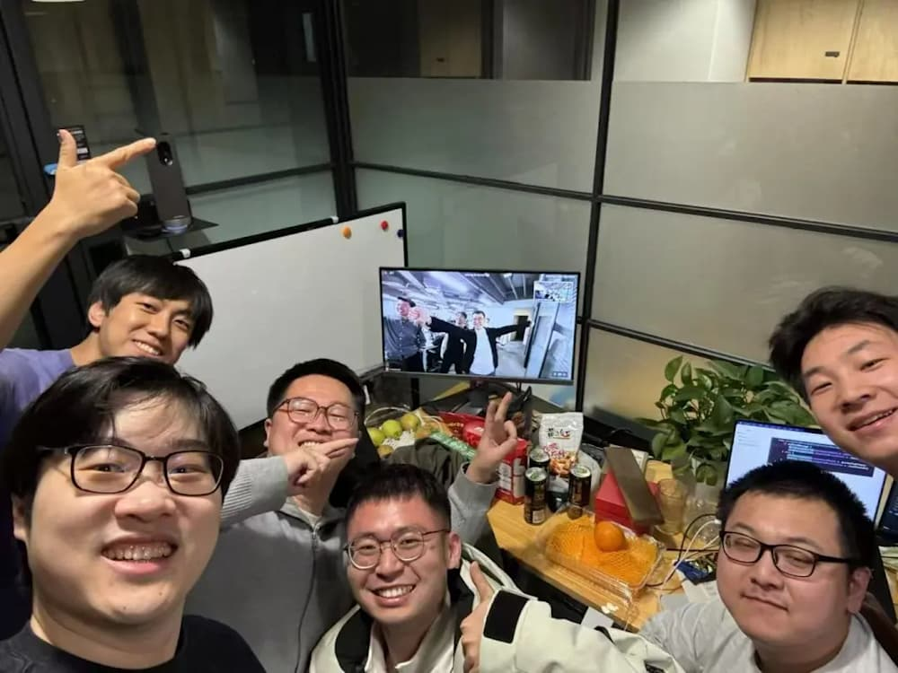

In late December 2025, **Meta** acquired **Manus**, a Singapore-based AI startup, for an estimated `$2 billion` to `$4 billion`. Founded by Xiao Hong - a serial entrepreneur who started in Wuhan and built tools for millions of students before creating the popular Monica browser extension — Manus is celebrated for its "general-purpose" autonomous agents. The team’s rise was meteoric: they began 2025 in a rented office and reached a `$100M` revenue run rate in just nine months. Leveraging a "vibe-coded" approach and cloud-based virtual machines to execute complex tasks like coding and research, the startup’s explosive growth and "action-oriented" tech led to its acquisition by Meta only 10 months after its public debut.

In late December 2025, **NVIDIA** finalized a massive `$20 billion` deal to acquire the core assets and talent of **Groq**. This "reverse acqui-hire" allowed NVIDIA to bypass lengthy antitrust reviews by licensing Groq’s Language Processing Unit (LPU) technology rather than buying the legal entity. Founded in 2016 by Jonathan Ross — the former **Google** engineer who co-invented the TPU (Tensor Processing Unit) — Groq became legendary in the developer community for its "software-first" approach. Crucially, Groq’s secret weapon was its use of functional programming language **Haskell**. The team utilized Haskell to build its high-performance compiler and assembler, ensuring the mathematical determinism required for its chips to hit record-breaking inference speeds. 

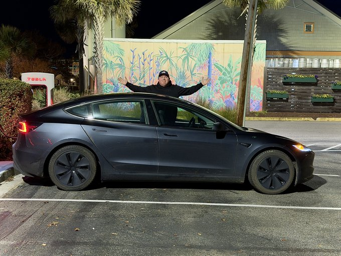

In late December 2025, a **Tesla** owner named David Moss achieved the long-awaited "holy grail" of autonomous driving by completing a zero-intervention coast-to-coast trip. Driving a `Model 3` equipped with FSD v14.2, Moss traveled `2,732` miles from **Los Angeles** to **Myrtle Beach, South Carolina** in under three days. The system handled all driving tasks, including city streets, complex highway interchanges, and even autonomous parking at `30` Supercharger stops. This milestone fulfills a prediction made by **Elon Musk** in 2016 and showcases the massive leap in Tesla’s neural-network-based AI, marking the first documented transcontinental journey without a single human takeover (no touching of the steering wheel or pedals).

In 2025, Chinese automaker **BYD** officially dethroned **Tesla** as the world’s top seller of battery-electric vehicles (BEVs). BYD delivered a record **2.26 million** pure EVs, a`28%` increase from the previous year. In contrast, Tesla’s sales fell `9%` to **1.64 million**, marking its second consecutive annual decline. BYD’s surge was driven by its vertical integration, diverse model lineup, and aggressive expansion into markets like Europe and Southeast Asia. Meanwhile, Tesla faced headwinds from an aging lineup, increased competition, and the expiration of U.S. tax credits. Including hybrids, BYD’s total 2025 sales reached a staggering **4.6 million** vehicles.

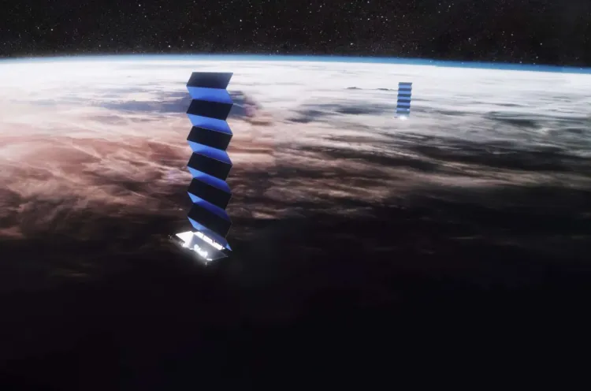

In January 2026, **SpaceX** announced a major reconfiguration of its **Starlink** network, planning to lower approximately `4,400` satellites from an altitude of `550` km to `480` km. This strategic move aims to enhance space safety by moving nearly half the fleet into a less congested orbital shell with fewer debris objects. At this lower altitude, atmospheric drag is significantly stronger; if a satellite fails, it will now deorbit and burn up in months rather than years. The decision follows a rare December 2025 incident where a malfunctioning Starlink satellite created debris, highlighting the risks of orbital crowding.

## Global

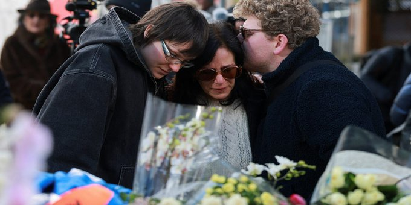

On New Year’s Day 2026, a catastrophic fire and subsequent "flashover" explosion devastated **Le Constellation** bar in the Swiss ski resort of **Crans-Montana**, killing at least `40` people and injuring `119`. The tragedy occurred at 1:30 a.m. during holiday celebrations. Investigators believe the blaze was ignited when sparklers on champagne bottles set fire to highly flammable acoustic foam on the ceiling. The fire spread within seconds, causing a deadly crowd surge as young revelers—many of them teenagers—struggled to escape through a narrow staircase. Switzerland has declared five days of national mourning following one of its worst-ever tragedies.

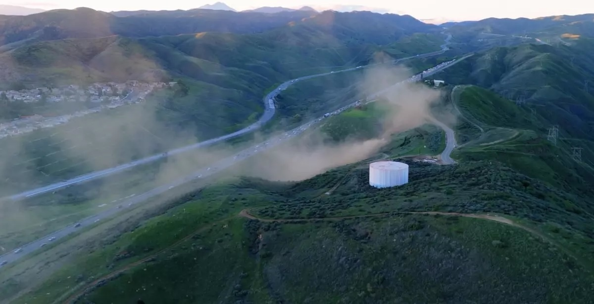

On December 27, 2025, a massive natural gas leak near **Castaic** forced the total closure of **Interstate 5 Highway** in Northern Los Angeles County. The rupture involved a high-pressure, 34-inch transmission line, which sent plumes of dust and debris into the air. Residents reported a deafening roar "like a jet engine" and a strong sulfur odor that spread as far as the San Fernando Valley. While no injuries occurred, over `19,000` residents were ordered to shelter in place for several hours. Officials cited significant land movement and mudslides from recent heavy rains as the most likely cause.

On December 30, 2025, thousands of travelers were stranded following a major power failure in the **Channel Tunnel** connecting the UK and France. The disruption, caused by damaged overhead electrical cables, forced the suspension of all Eurostar and Le Shuttle services during the peak New Year travel period. Some passengers were trapped underground for over four hours on a failed Le Shuttle train, while others spent up to eleven hours stuck on stationary Eurostar services with limited power and heating. The ordeal culminated in a dramatic "under-sea evacuation," where passengers were forced to walk through the central service tunnel to reach rescue shuttles.

## Economy & Finance

**Christian Aid**'s annual report found that extreme weather events made more likely by climate change caused over `$120 billion` in economic losses worldwide in 2025. The Palisades and Eaton wildfires in California topped the list at `$60 billion` in damage, leading to more than 400 deaths. Second were the cyclones and floods that struck Southeast Asia in November, causing `$25 billion` in losses and killing over 1,750 people across Thailand, Indonesia, Sri Lanka, Vietnam, and Malaysia. No continent was spared, the report noted, calling these disasters "not natural—but the predictable result of continued fossil fuel expansion and political delay."

## Nature & Environment

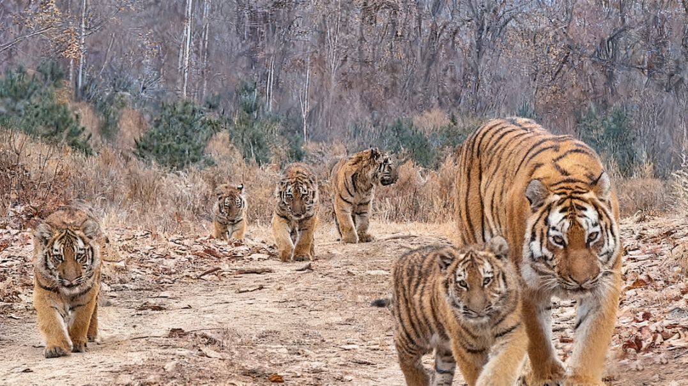

Camera traps in **Northeast China Tiger and Leopard National Park** captured China's first-ever footage of a wild Amur tigress with five cubs — an extraordinary sighting recorded in November 2025 and released in early January. WWF China called litters of five "extremely rare," as Amur tigers typically give birth to one to four cubs even under ideal conditions. The nine-year-old tigress and her six-to-eight-month-old cubs represent a beacon of hope for a species once nearly extinct. By the 1930s, fewer than 30 Amur tigers remained; today, roughly 70 roam China's northeast — proof that decades of habitat protection and anti-poaching efforts are paying off.

## Science

A **Nature** magazine article highlights a growing concern that peer-review reports generated by artificial intelligence are increasingly difficult to distinguish from human-written reviews. Researchers tested current AI-detection tools and found they fail to reliably identify AI-generated peer reviews, raising alarms about the integrity of the review process. This issue exacerbates existing pressures on peer review for the scientific and academic community, including rising submissions and limited reviewer availability, potentially undermining scientific quality control. Scientists warn that unchecked use of AI in peer review could dilute accountability and make it harder to ensure trustworthy evaluations of research.

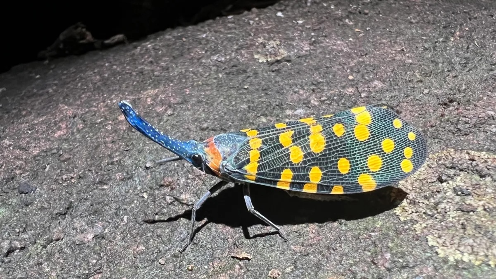

A University of Arizona-led study published in **Science Advances** on December 24 confirmed that scientists are now identifying over `16,000` new species annually — the highest rate ever recorded. Remarkably, `15%` of all known species have been discovered in just the past `20` years. This "Golden Age" is fueled by technological breakthroughs: environmental DNA (eDNA) allows researchers to detect cryptic species previously impossible to observe directly, while AI-driven models trained on satellite imagery and eDNA samples are demonstrating remarkable ability to predict species distributions and detect new organisms. These discoveries span insects, plants, fungi, and hundreds of new vertebrates—proof that Earth's biodiversity remains far richer than we ever imagined.

## Lifestyle, Entertainment & Culture

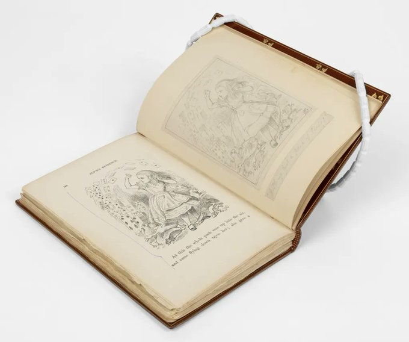

In late 2025, American philanthropist Ellen Michelson donated **Lewis Carroll**’s personal copy of *Alice’s Adventures in Wonderland* to the **University of Oxford**. This rare volume, one of only `23` surviving first editions from the suppressed `1865` run, returned to Carroll’s former college, **Christ Church**, and the **Bodleian Library**. As Carroll’s own working copy, it is uniquely significant, featuring ten original pencil sketches by illustrator John Tenniel and the author’s handwritten notes for the subsequent *Nursery Alice*. This acquisition provides scholars with unparalleled insight into Carroll's creative process and the collaborative evolution of one of literature's most beloved masterpieces.

On December 25, 2025, **Frankfurt**'s Palmengarten was transformed into a magical winter wonderland through its annual **Winterlichter** festival, running from November 29, 2025 to January 11, 2026. Visitors strolled through colorfully illuminated garden landscapes featuring around 30 artistic light installations — giant luminous moons, glowing snowdrops, and floating hearts that turned trees and pathways into enchanting backdrops. Sound and video installations created an extraordinary sensory experience, while hot drinks from garden vendors offered warmth against the winter chill. This year's edition emphasized energy efficiency, proving that sustainable practices and spectacular artistry can beautifully coexist in Germany's beloved botanical garden.

**Katy Perry** performed at **Bilibili**'s 2025 New Year's Eve Gala, becoming the undisputed highlight of China's biggest youth-oriented countdown celebration. The gala peaked at `350 million` live viewers across `200+` countries, generating over `10 million` real-time bullet comments. Perry delivered electrifying renditions of "Firework" and her emotional new single "Bandaids," teasing an upcoming music video release. Chinese audiences voted her performance the best of the entire show—a testament to her enduring star power among Gen Z fans who affectionately call her "水果姐" (Fruit Sister).

## Sports

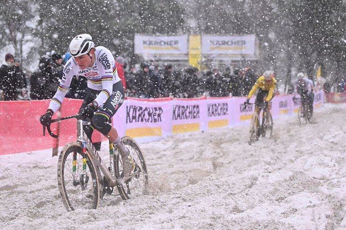

[Cycling] At the **2026 Exact Cross Mol**, Mathieu van der Poel claimed a dominant solo victory amidst a brutal snowstorm at the Zilvermeer. The race featured an epic showdown with Wout van Aert, who had successfully closed a 25-second gap to challenge the world champion. However, the duel ended tragically on lap six when Van Aert suffered a heavy crash on a slick, frozen corner. The Belgian sustained an ankle fracture requiring surgery, abruptly ending his cyclocross season. Van der Poel navigated the treacherous ice to win by over a minute, with Toon Aerts and Felipe Orts completing the podium.

[Tennis] On December 28, 2025, women’s World No. 1 **Aryna Sabalenka** faced **Nick Kyrgios** in a modern "Battle of the Sexes" exhibition in Dubai. To balance the play, the court on Sabalenka’s side was reduced by 9%, and both players were limited to a single serve per point. Despite the handicaps, Kyrgios, who ranked 671 in men's single world wide, won 6-3, 6-3. While the atmosphere was lighthearted — featuring Sabalenka dancing to the "Macarena"—the event drew sharp criticism. Many fans and analysts labeled it a "gimmick" that lacked the cultural weight of the 1973 original between Billie Jean King and Bobby Riggs, with some arguing the modified rules actually highlighted physical disparities.

## This Day in History

On **January 3, 1920**, **Boston Red Sox** owner Harry Frazee sold **Babe Ruth**'s contract to the **New York Yankees**, beginning a championship era for New York and decades of heartache for Boston. Prior to the sale, the Red Sox had won five of the first fifteen World Series titles — more than any other team. Ruth had contributed to three of those championships.  In the 84 years following the sale, the Yankees played in 39 World Series, winning 26 — while Boston's drought lasted until 2004, when the Red Sox finally broke the "Curse of Bambino" after `86` years. George Herman "Babe" Ruth is considered by many to be the greatest baseball player of all time. His most famous nickname is "Bambino", for his playful nature, enormous appetites, and joyful approach to the game.

## Art of the Week

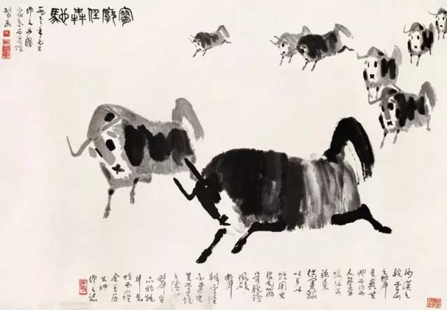

**Wu Zuoren** (1908–1997) was a towering figure in 20th-century Chinese art, celebrated for his masterful fusion of traditional Chinese ink painting with Western oil techniques. After studying in Paris and Brussels under the mentorship of **Xu Beihong**, Wu developed a unique "spontaneous" ink-wash style that emphasized anatomical precision and realistic proportions within a freehand aesthetic. This famous painting, likely from his acclaimed yak series, reflects his deep connection to western China. During his travels to the Qinghai-Tibet Plateau in 1943, he was captivated by the raw power of the Tibetan yak. Using bold, condensed brushwork and subtle ink washes, Wu captures the "potent spirit" and momentum of these majestic animals. His portrayals of yaks and camels became iconic, symbolizing the endurance and nationalistic spirit of the Chinese people.

## Funny

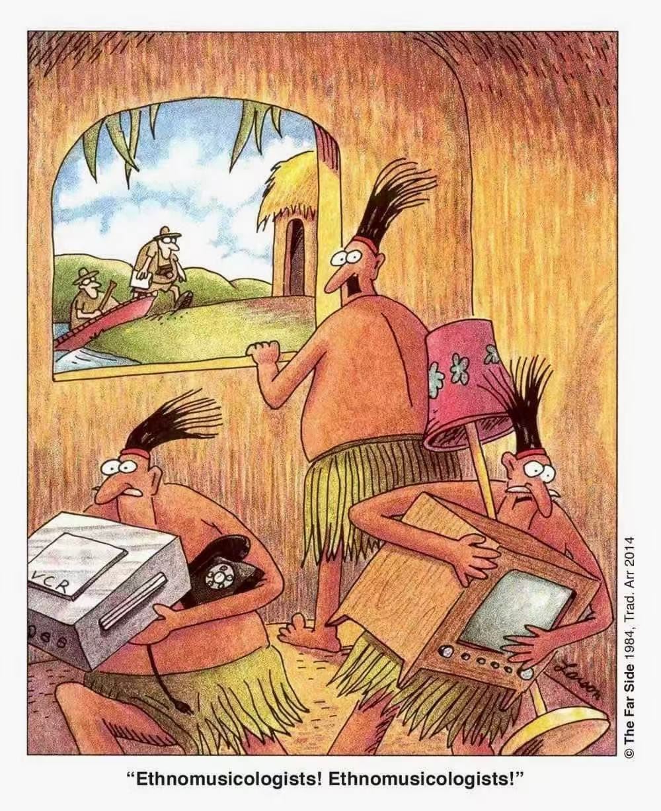

> "Quick—hide the electronics! They're here to study our 'traditional' musical culture!"

---

## Previous Issues

---

December 27, 2025, **[The Age of One-Person Billion Dollar Company](https://weekly.sundayblender.com/p/the-age-of-one-person-billion-dollar-company)**

December 13, 2025, **[So Many AI Reports, So Little Time to Read](https://weekly.sundayblender.com/p/so-many-ai-reports-so-little-time-to-read)**

December 06, 2025, **[Humans Are No Longer the Only Species to Use Fiber Optics](https://weekly.sundayblender.com/p/human-are-no-longer-the-only-species-to-use-fiber-optics)**

---

Thanks for reading! If you enjoy this newsletter, please share it with friends who might also find it interesting and refreshing, if not for themselves, at least for their kids.

