## Editor's Words

We're back! We were at a game last weekend, so we had to skip an issue.

## Tech

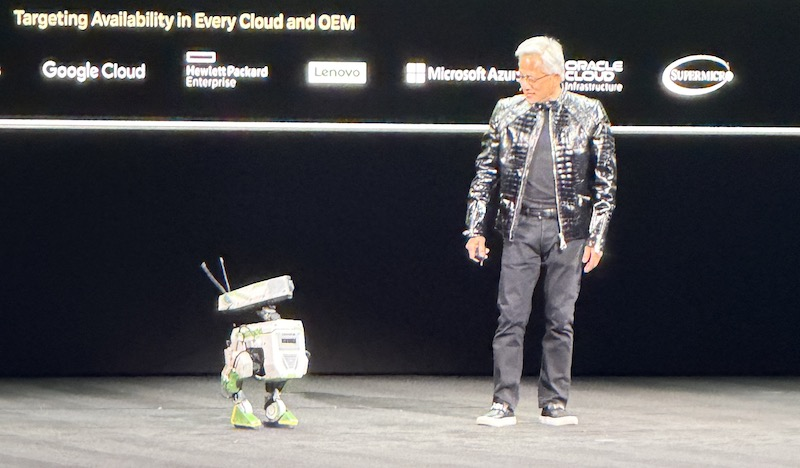

**Nvidia** founder and CEO **Jensen Huang** opened **CES 2026** at the Fontainebleau Las Vegas, declaring that AI is scaling into every domain and device. "Computing has been fundamentally reshaped," Huang said, noting that "`$10 trillion` of computing is now being modernized." "The **ChatGPT** moment for **physical AI** is here — when machines begin to understand, reason and act in the real world," Huang announced. He unveiled **Rubin**, Nvidia's next-generation AI platform now in full production, promising to deliver AI tokens at one-tenth the cost of previous platforms. He also introduced **Alpamayo**, an open reasoning model family for autonomous vehicles, with the **Mercedes-Benz CLA** becoming the first passenger car featuring the technology.

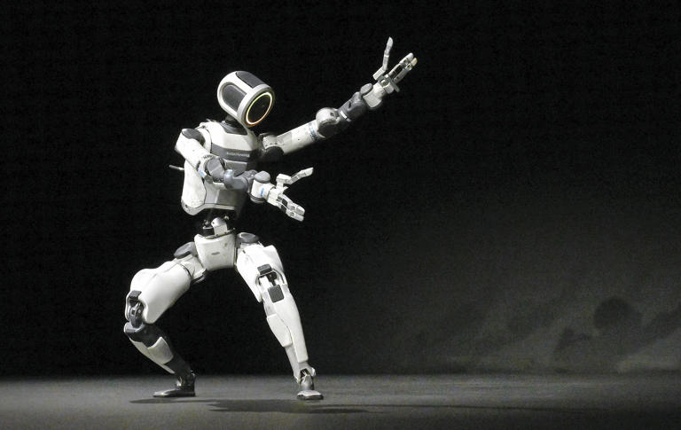

After 30+ years of R&D, **Boston Dynamics** unveiled the production **Atlas** at **CES 2026**. The all-electric humanoid has 56 degrees of freedom, allowing its head, torso, and hands to rotate 360° — moving more efficiently than humans in tight spaces without turning its whole body. Four-fingered hands with tactile sensing in fingers and palms enable dexterous manipulation. When battery runs low, Atlas autonomously swaps its own batteries and returns to work. It can rise from a folded position to minimize idle footprint, and limbs are field-replaceable in under five minutes. Once one Atlas learns a task, the skill deploys instantly across the entire fleet. First deployments go to majority shareholder **Hyundai** and new AI partner **Google DeepMind**. Hyundai plans to use Atlas in its car plants by 2028 for parts sequencing, expanding to component assembly by 2030. 

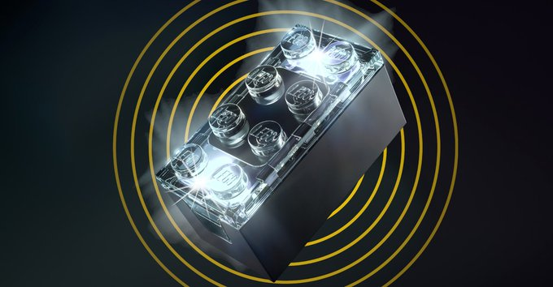

**Lego** unveiled its **Smart Play** system at **CES 2026 (Consumer Electronics Show)**, calling it the most significant innovation since the Minifigure debuted in 1978. The **Smart Brick** is a standard 2x4 brick packed with a tiny 4.1mm chip, sensors, accelerometers, and a miniature speaker—all enabling screen-free interactive play. Using copper coils, magnetic fields, and Bluetooth, Smart Bricks communicate with Smart Tags and Smart Minifigures to produce sounds and lights in response to movement. Launching **March 1, 2026**, the first sets feature **Star Wars** themes, with prices ranging from `$70 `to `$160`. Some play experts have raised concerns about digitizing a traditionally analog toy, though Lego emphasizes this complements rather than replaces classic building.

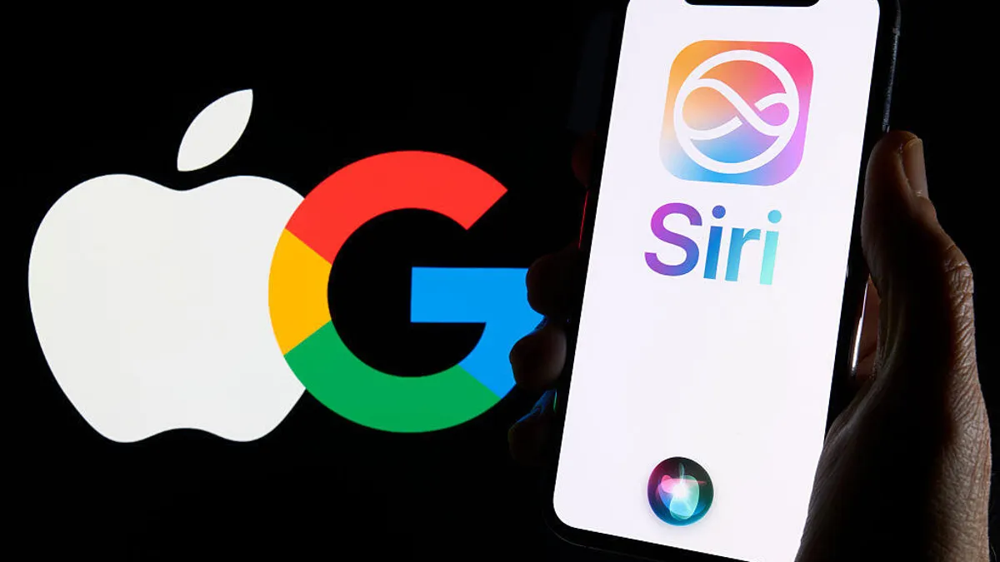

When **Apple** launched **Siri** in 2011, it was the first mainstream voice assistant - years ahead of **Google** Assistant or **Amazon**'s Alexa. Fourteen years later, that lead has evaporated. Apple and Google announced a multi-year collaboration where the next generation of Apple Foundation Models will be based on Google's **Gemini**. Siri's brain will now run on a competitor's technology. Apple is paying roughly `$1 billion` annually for access. After careful evaluation, Apple determined that Google's AI technology provides the most capable foundation — an acknowledgment that its own models weren't cutting it. Internal evaluations revealed Siri was failing complex queries about `33%` of the time. For a company that built its identity on vertical integration, this is a pragmatic concession: partner now, compete later. The pioneer has become the customer.

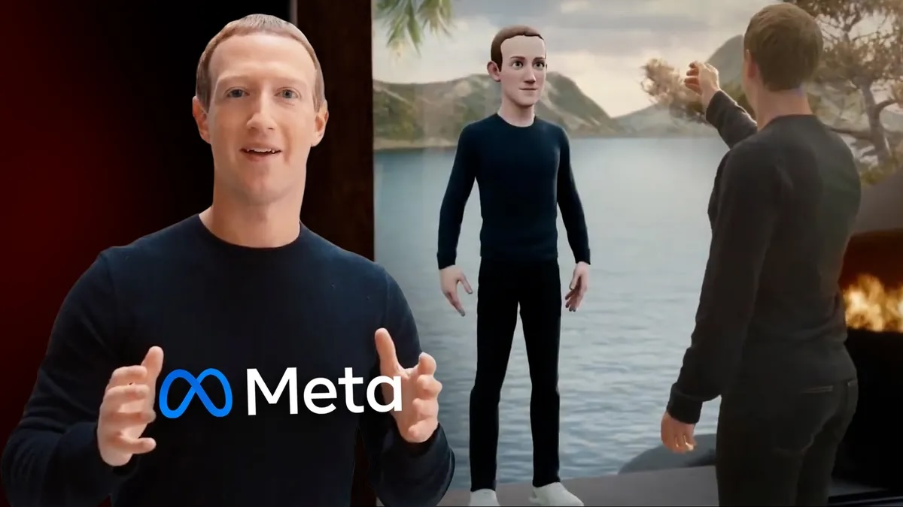

In 2021, **Facebook** rebranded itself as **Meta**, staking its entire identity on a virtual world that never materialized. Four years and $73 billion later, the company is quietly dismantling that vision—cutting `1,500` Reality Labs jobs this week, shuttering VR game studios, and redirecting resources toward AI wearables and chatbots. The pivot marks one of the most expensive strategic retreats in tech history. Meta is now betting that AI-powered **Ray-Ban** smart glasses, not VR headsets, will define the next computing platform. Whether this represents hard-won wisdom or simply another hype cycle remains Silicon Valley's billion-dollar question.

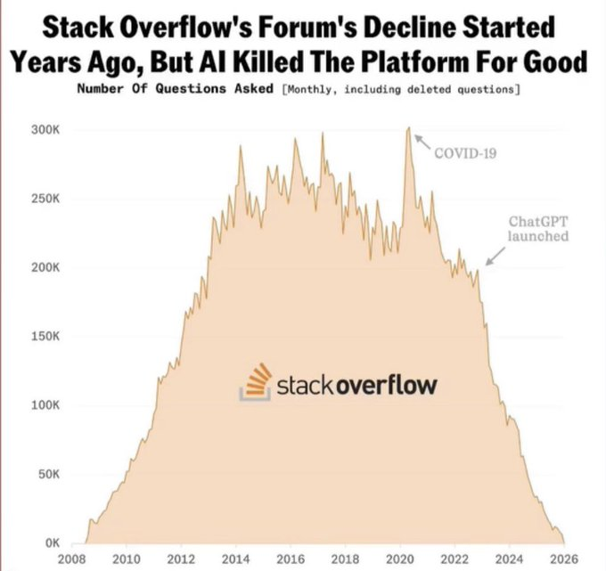

Launched in 2008, Q&A forum **Stack Overflow** quickly became the go-to hub for programmers seeking answers to coding problems, fostering a community-driven repository that powered everything from startup scripts to enterprise software. For years, it was an almost universal experience: find a thread, copy the top-voted answer, run it, problem solved. At its peak around 2014, the platform received over `250,000` questions per month. By early 2026, monthly questions have collapsed to about `300` — levels not seen since 2009.  Developers are switching en masse to AI assistants like **GitHub** Copilot and **Claude Code** directly that answer without the platform's notoriously hostile culture where newbies were routinely humiliated for asking "basic" questions. Ironically, Stack Overflow's own content trained the very AI models now supplanting it.

## Global

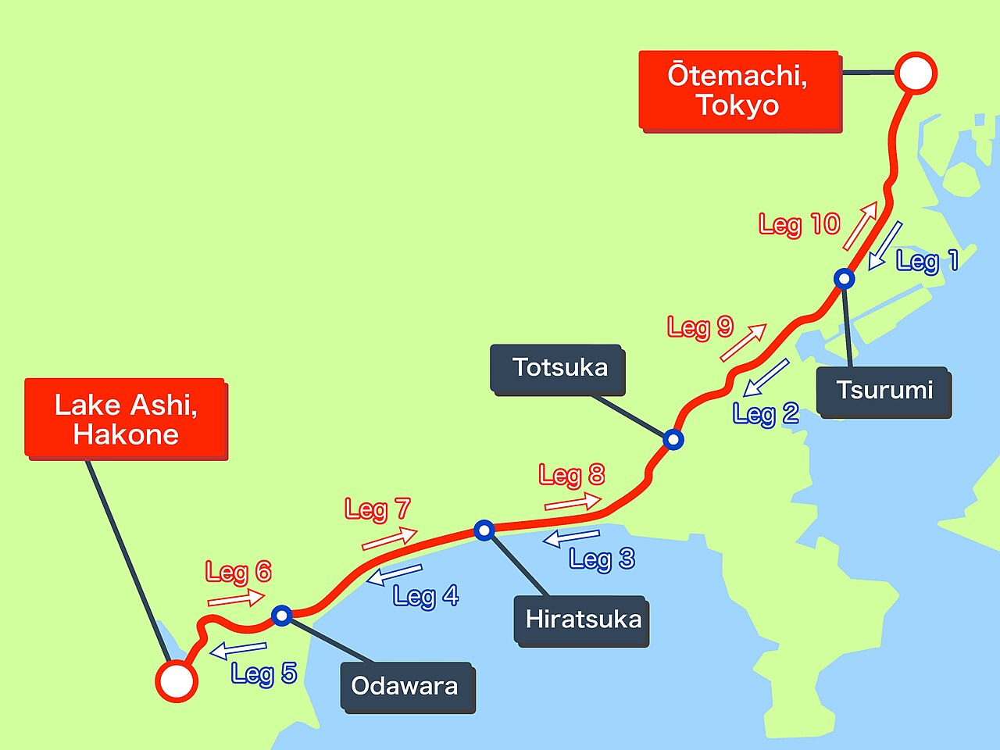

**The Hakone Ekiden** is a two-day, 217-kilometer road relay run by Japan's top university teams between central Tokyo and the mountain resort town of Hakone, near Mount Fuji. The race was first held in `1920`, making this year's edition the `102nd`. It's the event Japanese distance runners grow up watching — like the **Tour de France** in cycling, it shapes recruiting, coaching careers, and public reputations. Each team fields 10 runners covering roughly half-marathon distances per stage, passing a traditional sash called a "tasuki" between teammates. This year, **Aoyama Gakuin University** won with a record time of `10:37:34`, smashing their own course record by nearly 4 minutes. This made them the first university to complete two separate three-peats in the race's history.

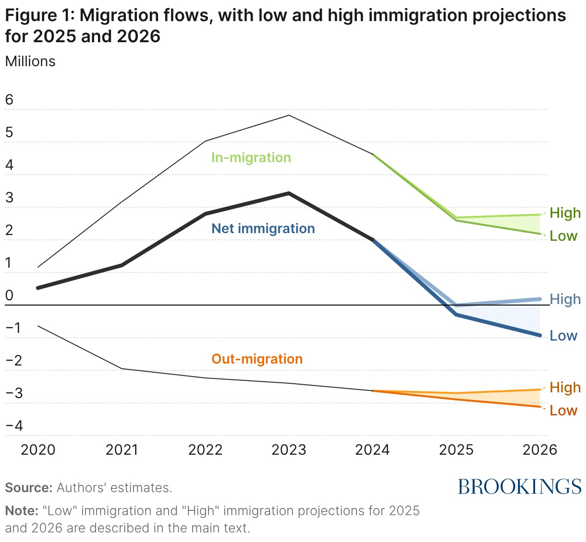

The United States — a country built by generations of newcomers seeking opportunity — recorded more people leaving than entering for the first time in at least half a century. A **Brookings Institution** report estimates net migration of `-10,000` to `-295,000` for 2025, a stunning reversal from `2.8 million` arrivals just a year earlier. The shift stems less from deportations than from a sharp drop in entries, suspended refugee programs, reduced visas, and a chilling effect that's kept would-be migrants away. Brookings warns the trend will dampen labor force growth, consumer spending, and GDP, with negative migration likely continuing into 2026. For a nation whose identity is woven from immigrant stories, the numbers mark an unsettling turning point.

## Economy & Finance

Luxury department stores **Saks Fifth Avenue**, **Neiman Marcus**, **Bergdorf Goodman** — names that defined American luxury for over a century — are now under Chapter 11 protection. Saks Global filed for bankruptcy on Wednesday, crushed by debt from its `$2.7 billion` acquisition of Neiman Marcus just over a year ago. The deal was supposed to create a powerhouse, backed by tech heavyweights **Amazon** and **Salesforce**. Instead, Saks couldn't pay vendors, who began withholding inventory — leaving shelves bare during the critical holiday season. Running out of cash, Saks sold the Neiman Marcus Beverly Hills flagship last month and scrambled for emergency financing. "Department stores used to be the gateway to luxury," notes **Vogue**'s Jenna Rennert. "Today, they're the middleman that luxury brands no longer need." Shoppers simply walk into **Prada** or **Louis Vuitton** directly.

## Nature & Environment

## Science

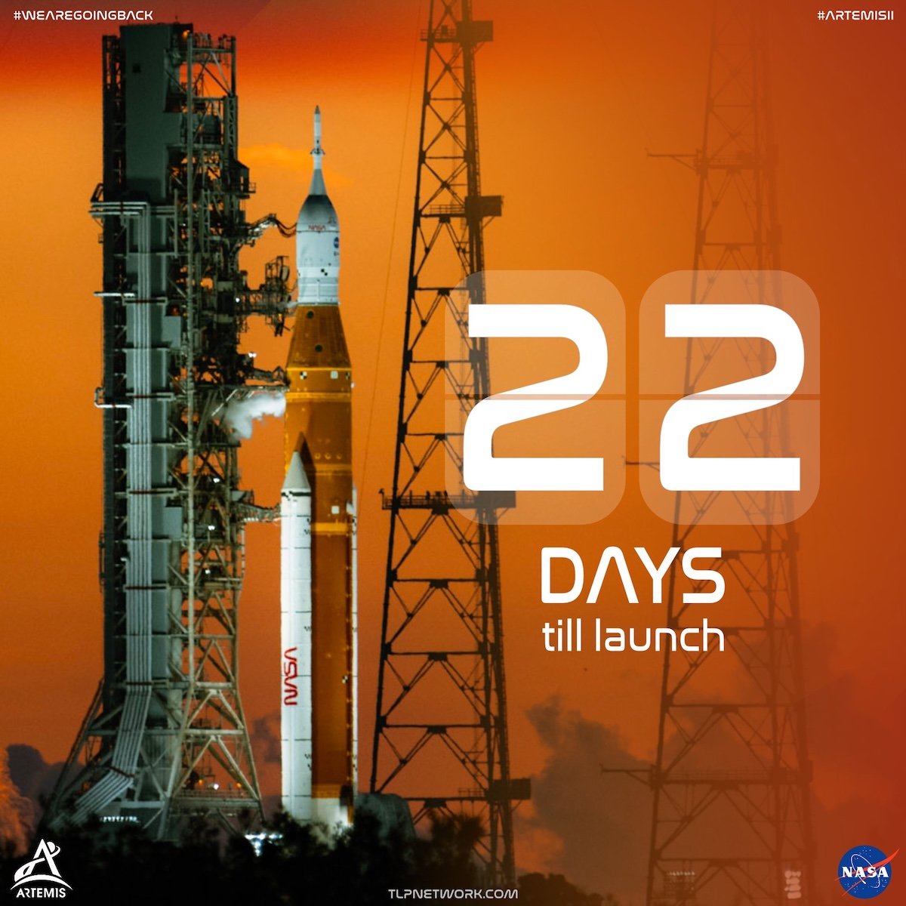

NASA's Artemis II mission, scheduled to launch no earlier than February 6, 2026, will send astronauts beyond Earth orbit for the first time since Apollo 17 in 1972—a 53-year gap. The 10-day mission will carry NASA astronauts Reid Wiseman, Victor Glover, and Christina Koch, along with Canadian Space Agency astronaut Jeremy Hansen, on a free-return trajectory around the Moon. Glover will become the first person of color and Koch the first woman to travel to lunar distance. The mission will test the Orion spacecraft - made by Lockheed Martin - for its life support and navigation systems, paving the way for Artemis III, which aims to land astronauts on the lunar surface by 2028.

What if the Big Bang wasn't the start of everything — but merely a transition? Nobel laureate **Roger Penrose**, now in his 90s, proposes a radical alternative: our universe is just one stage in a potentially infinite cycle of cosmic extinction and rebirth. Here's how it works: The universe expands, matter clumps together, and eventually gets swallowed by supermassive black holes. Over unimaginable timescales, those black holes evaporate, leaving behind a cold, empty cosmos. That dying universe then becomes the seed for the next Big Bang. Penrose claims faint "Hawking points" — hot spots in the cosmic microwave background — are echoes from a previous universe. Most cosmologists remain skeptical. But it's a poetic idea: our universe as one chapter in an eternal story with no first page.

## Lifestyle, Entertainment & Culture

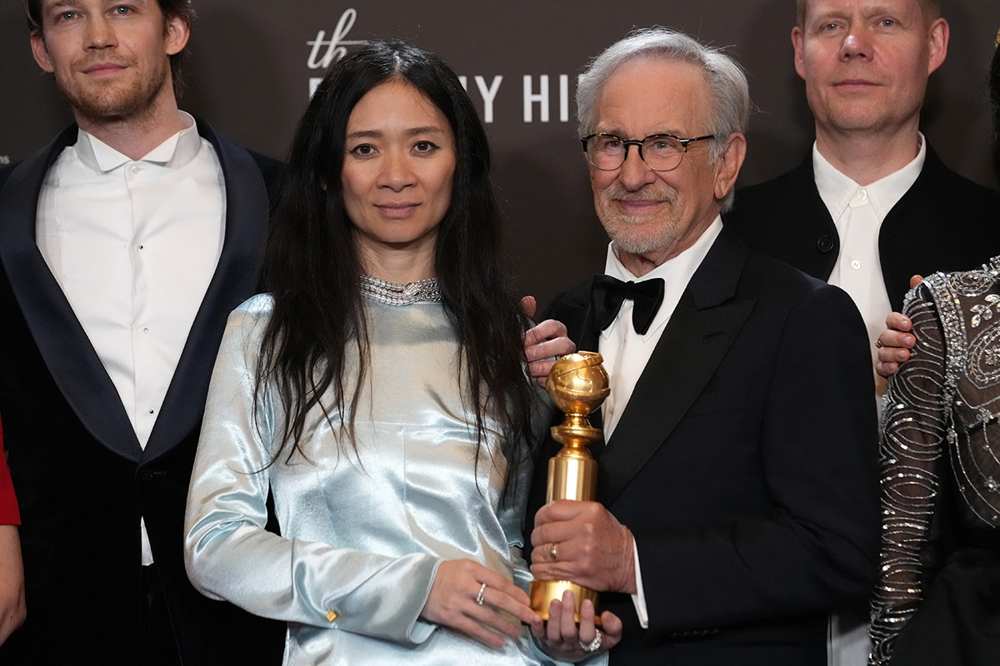

The 83rd Golden Globes on January 11 crowned *Hamnet* as Best Picture (Drama) and *One Battle After Another* as Best Picture (Musical/Comedy). Beijing-born **Chloé Zhao** — who made history in 2021 as the first woman of color to win the Oscar for Best Director (*Nomadland*) — directed, co-wrote, produced, and edited *Hamnet*, an adaptation of Maggie O'Farrell's novel about Shakespeare's family and the death of his son. Jessie Buckley won Best Actress (Drama) for the film. **Timothée Chalamet** took Best Actor (Musical/Comedy) for *Marty Supreme*. **Paul Thomas Anderson**'s political satire *One Battle After Another* — starring **Leonardo DiCaprio** as an ex-revolutionary — swept the comedy categories with four wins including directing and screenplay.

## Sports

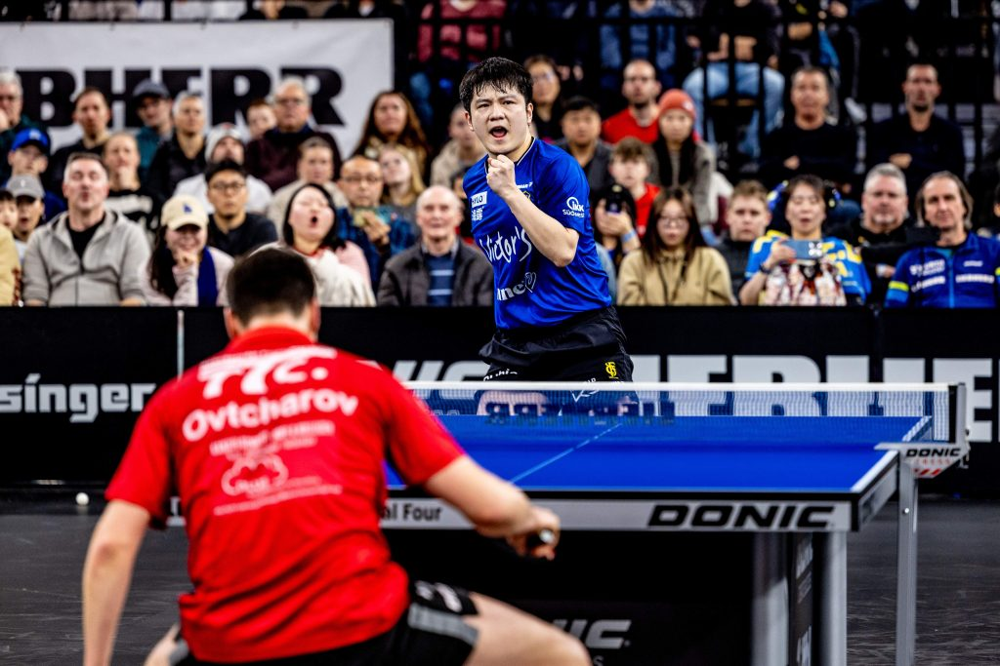

[Table Tennis] Chinese table tennis star **Fan Zhendong** celebrated his first title in Germany as his club Saarbrücken lifted the German Cup after a 3-1 victory over Fulda-Maberzell at the Liebherr Cup Final Four in Neu-Ulm. In front of a record crowd of `5,200` spectators at the ratiopharm arena, the Olympic champion played a decisive role, defeating Dimitrij Ovtcharov and Ruwen Filus both in straight games. For Saarbrücken, it was the club's third cup victory after 2012 and 2022. "It was my first Cup Final Four, and it was a special moment in my career," said Fan. The victory marks the first step in the club's ambitious "triple mission," with further title opportunities ahead in the Bundesliga and Champions League.

## This Day in History

## Art of the Week

**Banksy**, the anonymous British street artist whose satirical works have appeared on walls from London to Gaza, has spent decades mocking the art establishment while becoming one of its most valuable commodities. In October 2018, he pulled off art history's greatest prank. Seconds after his **Girl with Balloon** sold for `$1.4 million` at **Sotheby's** London, a hidden shredder activated inside the gilt frame, slicing the canvas into ribbons as stunned bidders watched in disbelief. The stunt could have destroyed the work's value. Instead, it created a legend. Re-authenticated and renamed **Love is in the Bin**, the partially shredded canvas returned to the same auction house in October 2021. It sold for `$25.4 million` — 18 times the original price. Sotheby's went to great lengths ahead of the 2021 sale to make sure Banksy was not planning any additional funny business. They weighed the framed canvas to make sure there were no hidden components and double checked that the batteries had been removed from the shredder. Banksy had set out to mock art market absurdity. Instead, he accidentally proved its most perverse truth: even destruction is just another form of appreciation.

## Funny

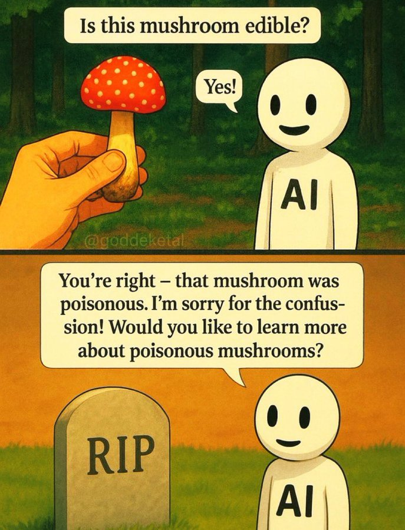

---

## Previous Issues

---

January 03, 2026, **[An Incredible Journey From Wuhan To Singapore](https://weekly.sundayblender.com/p/an-incredible-journey-from-wuhan-to-singapore)**

December 27, 2025, **[The Age of One-Person Billion Dollar Company](https://weekly.sundayblender.com/p/the-age-of-one-person-billion-dollar-company)**

December 13, 2025, **[So Many AI Reports, So Little Time to Read](https://weekly.sundayblender.com/p/so-many-ai-reports-so-little-time-to-read)**

---

Thanks for reading! If you enjoy this newsletter, please share it with friends who might also find it interesting and refreshing, if not for themselves, at least for their kids.

