## Editor's Words

Check out the sports section of this issue. It's got quite a variety. 

If you have come this far, you must come from a family of readers in the pursuit of intellect and knowledge - a rare species in 2026. Congratulations! 

Do you know of any other friend's family who might also be in the same pursuit?

If you do, please forward the Sunday Blender to them, surprising them with the proof that the art of reading has not died, yet.

Thank you.

## Tech

**Google** announced on January 21 that its AI assistant **Gemini** now offers free, full-length SAT practice exams — a direct challenge to the multibillion-dollar test prep industry. The SAT is a standardized test most American high schoolers take for college admissions, covering reading, writing, and math. Using content developed with The **Princeton Review** to mirror real exam conditions, Gemini scores each section after completion, identifies strengths and weaknesses, explains incorrect answers, and helps build a personalized study plan. With private tutors charging `$135–155` per hour, the free tool could reshape how the nearly two million annual SAT takers prepare.

**Turing Award** winner **Yann LeCun** has launched **Advanced Machine Intelligence** (AMI) Labs, a Paris-based startup pursuing "world models" — AI systems that understand physics and simulate cause-and-effect rather than simply predicting text like large language models. LeCun, who left **Meta** in November 2025 after 12 years as Chief AI Scientist, serves as executive chairman, with former Nabla CEO Alex LeBrun running operations. The company is reportedly seeking `US$586 million` at a `US$3.5 billion` valuation before even launching. LeCun has long argued that scaling LLMs alone won't achieve human-level AI, and believes world models can solve the hallucination problems inherent to current systems.

At Davos, Switzerland, this week, **Anthropic** (the developer of **Claude AI**) CEO Dario Amodei and **Google DeepMind** CEO Demis Hassabis appeared on stage together and found themselves agreeing on something uncomfortable: the disruption is coming faster than most realize. Amodei took the aggressive stance, predicting AI will replace most software engineering work within 6–12 months and reach "Nobel-level" scientific capability by 2027. Hassabis was more cautious, saying current systems are "nowhere near" AGI (Artificial General Intelligence) and estimating a 50% chance of achieving it within 5–10 years, noting AI still needs "one or two more breakthroughs." Both warned that half of white-collar jobs could vanish within five years.

**Elon Musk** made his first-ever Davos appearance this week, predicting AI will surpass individual human intelligence by the end of 2026 and exceed all of humanity's collective brainpower within five years. Interviewed by **BlackRock** CEO Larry Fink, Musk forecast robots will eventually outnumber humans, with **Tesla**'s Optimus humanoid robots going on sale to the public by the end of 2027 — initially for elder care in aging societies. He declared self-driving "essentially a solved problem," with Tesla robotaxis expanding across the U.S. this year. Musk also called human aging "a very solvable problem" and warned that electricity — not chips — is now the limiting factor for AI growth.

## Global

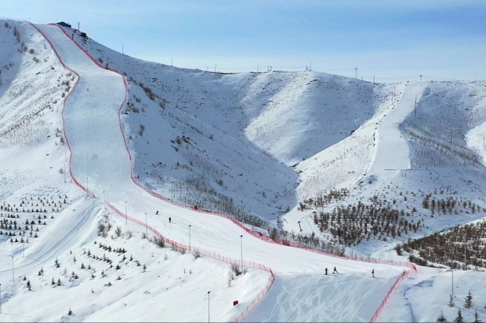

On January 17, over `300` athletes raced on handmade wooden skis wrapped in horse hide at the **Ancient Fur Ski Race** held at Jiangjunshan International Ski Resort in **Altay**, **Xinjiang, China**. The event celebrates the region's claim as the birthplace of skiing — a 2005 discovery of rock paintings in nearby Handgait township depicts ancient hunters on fur-covered skis, estimated to be at least `12,000` years old. In 2015, skiing historians from 18 countries signed the Altay Declaration recognizing Altay as the world's oldest skiing region. The traditional skis, still crafted by locals today, were even displayed at the 2022 Beijing Winter Olympics museum.

**Japan** bid farewell to its last giant pandas this week as twin siblings Xiao Xiao and Lei Lei departed Tokyo's **Ueno Zoo** for China on January 27. Born at the zoo in 2021, the pair had their final public viewing on January 25, with visitors limited to one-minute slots allocated by lottery — some days saw 24 applicants competing for each spot. Their departure marks the first time since 1972 that Japan has been without a panda, ending over `50` years of continuous panda presence that began when China gifted two pandas to commemorate the normalization of diplomatic ties. Chief Cabinet Secretary Minoru Kihara noted that pandas have "contributed to improving public sentiment" between the two nations. 

## Economy & Finance

**Canada** is breaking ranks with the **United States** on Chinese electric vehicles. During Prime Minister Mark Carney's visit to Beijing last week, Canada agreed to slash its `100%` tariff on Chinese EVs down to just `6.1%`, opening the door for affordable electric cars from manufacturers like **BYD**. The deal caps imports at `49,000` vehicles annually, rising to `70,000` by 2030 — with over half expected to be priced under `$24,500`. In exchange, China will reduce tariffs on Canadian canola from `84%` to `15%`. The move marks a significant pivot away from U.S. trade policy, as Carney seeks to diversify Canada's economy amid strained relations with Washington.

## Nature & Environment

**Russia**'s Kamchatka Peninsula is experiencing what locals call a "snow apocalypse" — the heaviest snowfall in over 140 years. In December 2025, Petropavlovsk-Kamchatsky received `370mm` of snow — more than three times the monthly average. Snow depth has reached `1.7 meters`, with drifts up to `2.4 meters`, burying cars and blocking building entrances up to the second floor. The surreal images of people tunneling out of their homes and entire streets vanishing under white have drawn comparisons to the 2004 Sci-Fi disaster blockbuster film **The Day After Tomorrow**. Schools and businesses are closed, roads remain impassable, and stores are running short on essentials as the remote region struggles to dig out.

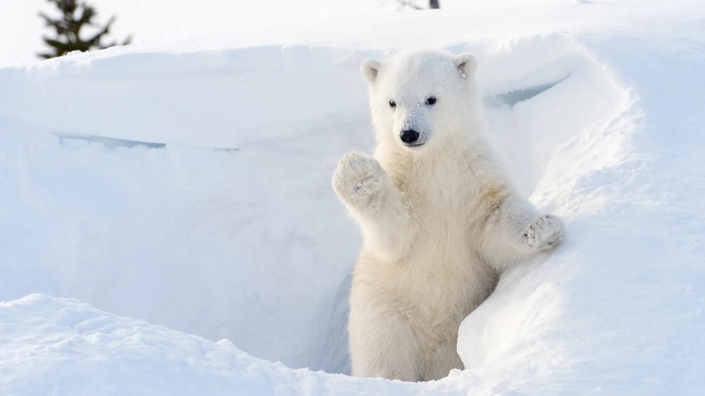

Polar bear trackers are reporting encouraging news from **Hudson Bay, Canada** this January, with GPS data showing mothers and yearlings — including the popular "AAC Bear" — currently hunting seals deep on the sea ice during the sunless Arctic winter. However, researchers are also flagging a troubling development: some Arctic regions are experiencing an unusual "**no-snow**" crisis, with unseasonably warm temperatures leaving patches of ground completely bare. Scientists warn this is disorienting for local wildlife — polar bears rely on snow for denning, while Arctic foxes depend on their white winter coats for camouflage, now useless against the exposed dark terrain.

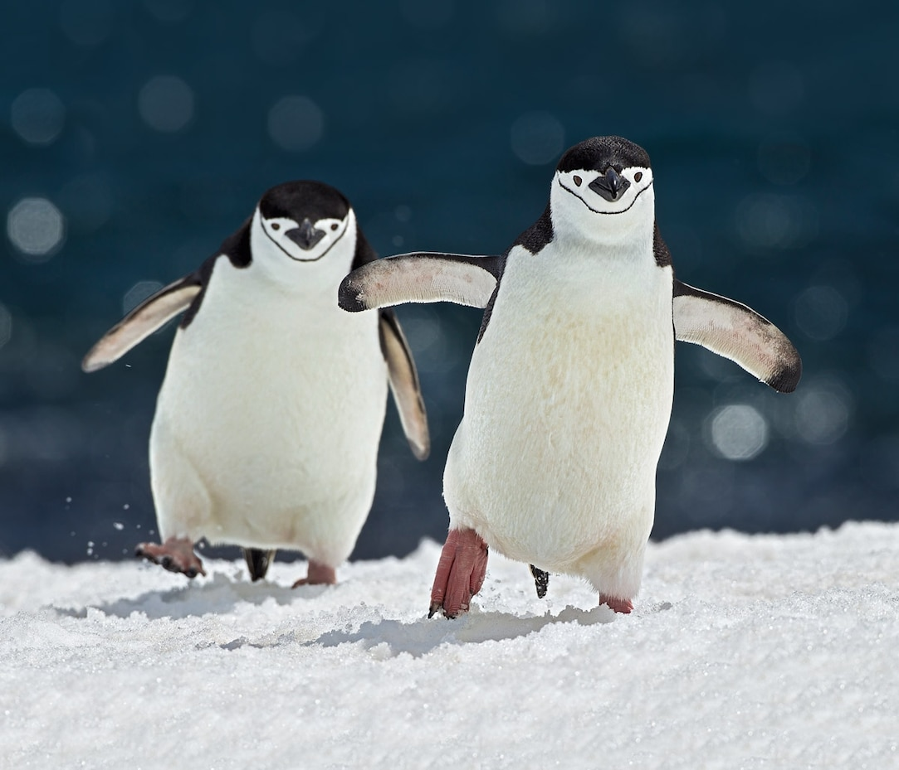

A major study released January 20 reveals that **Antarctic** penguins are breeding up to two weeks earlier than they did a decade ago. Researchers tracking Gentoo, Adélie, and Chinstrap penguins found that Gentoos are adapting so quickly they're now out-competing the other species for prime nesting sites. But scientists warn this accelerated timeline could backfire: if baby penguins hatch before peak krill and plankton season, they may face food shortages during their most vulnerable weeks. The shift highlights how climate change is reshaping Antarctic ecosystems in complex ways, creating winners and losers even among closely related species.

## Science

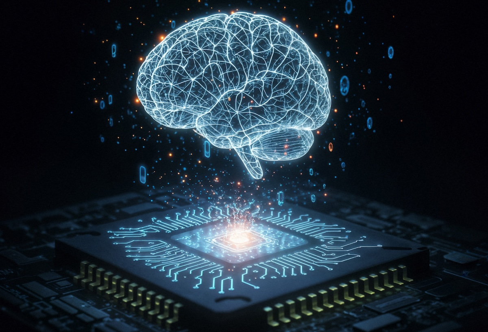

Scientists at the **Indian Institute of Science** (IISc) in Bangalore have created molecular devices that can switch roles on command — acting as memory, logic gates, processors, or artificial brain synapses depending on how they're stimulated. The team built 17 specially designed ruthenium-based molecules that reorganize their electrons and ions dynamically, allowing a single device to store information, compute with it, or even learn and unlearn. "With the right molecular chemistry, a single device can store information, compute with it, or even learn and unlearn," said lead researcher Pallavi Gaur. The breakthrough could lead to AI hardware that physically encodes intelligence into the material itself—computers that learn the way brains do.

## Lifestyle, Entertainment & Culture

**Martin Luther King Jr. Day**, observed on the third Monday of January, honors the life and legacy of Dr. Martin Luther King Jr., America's most influential civil rights leader. Born January 15, 1929, King championed nonviolent resistance to end racial segregation, delivering his iconic "**I Have a Dream**" speech during the 1963 March on Washington. Following his assassination in 1968, a campaign for a federal holiday began, finally signed into law by President Reagan in 1983. The holiday, first celebrated nationwide in 1986, is also designated as a National Day of Service — encouraging Americans to volunteer and embody King's vision of the "**Beloved Community**". This concept, central to King's philosophy, described an achievable society transformed by justice, equality, and unconditional love — where poverty is eliminated, racial harmony prevails, conflicts are resolved through dialogue, and former enemies become friends through understanding. 

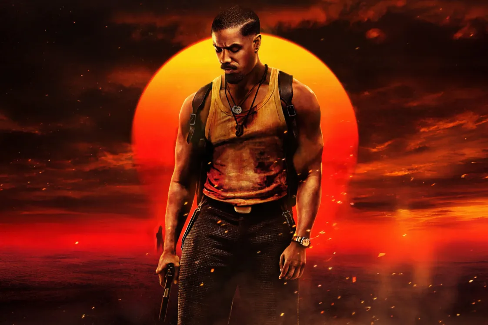

The vampire epic **Sinners** dominated the 2026 **Oscar** nominations, earning a record-breaking `16` nominations — the most in Academy history, surpassing the `14` held by **All About Eve** (1950), **Titanic** (1997), and **La La Land** (2016). The film, starring **Michael B. Jordan** in a dual role, scored nominations across major categories, including Best Picture, Director, and Actor — Jordan's first Oscar nomination. Following behind were **One Battle After Another** with 13 nominations, and **Frankenstein**, **Marty Supreme**, and **Sentimental Value** with nine each. Sinners marks the fifth collaboration between director **Ryan Coogler** and Jordan, following Fruitvale Station, Creed, and both Black Panther films.

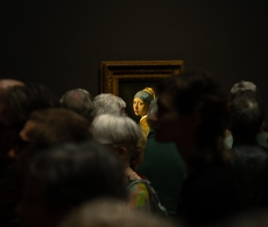

**Johannes Vermeer**'s **Girl with a Pearl Earring** will travel to Japan this summer in a rare international loan. The 17th-century masterpiece, often called the "Mona Lisa of the North," will be displayed at **Osaka**'s Nakanoshima Museum of Art from August 21 to September 27 while its home, the Mauritshuis in The Hague, closes for renovations. The painting almost never leaves the Netherlands — its last international trip was a 2012–2014 world tour that drew `1.2 million` visitors in Japan alone. Mauritshuis director Martine Gosselink noted this may be "the very last time" the work travels to Japan, making it a once-in-a-generation opportunity.

After years of limited access following the pandemic, international rock acts are heading back to mainland China. **The Pixies** bring their 40th anniversary tour to Shanghai's VAS LIVE venue in May 2026, while Mac DeMarco, Behemoth, and Oneohtrix Point Never are also confirmed for 2026 dates. This follows a broader thaw: **Kanye West**'s surprise 2024 Hainan concerts signaled Beijing's renewed openness to foreign performers. China's live music market generated nearly `US$8 billion` in ticket revenue in 2024, and expanded visa-free policies for dozens of countries are making touring logistics easier. For bands like **Suede** — who have a cult following since their 2014 MIDI Festival appearances — China represents both nostalgia and a massive untapped market hungry for live rock.

## Sports

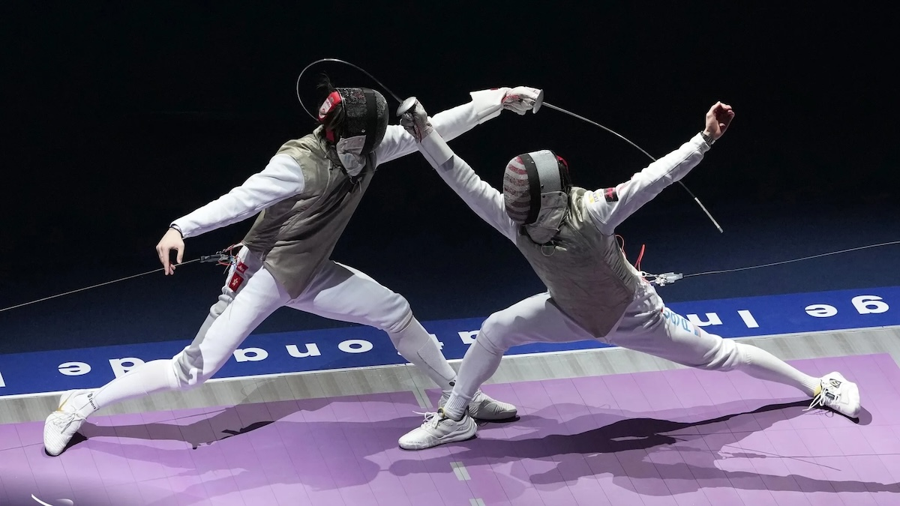

[Fencing] Hong Kong's men's foil team struck gold at the **Fédération Internationale d'Escrime (FIE) World Cup** in Paris this January, staging a thrilling comeback against the United States in the final. Trailing 4-10 early on, the squad — featuring two-time Olympic champion **Edgar Cheung Ka-long** and reigning world champion **Ryan Choi Chun-yin** — rallied to win `45-38`, with Choi delivering a decisive `5-0` final bout. It marks Hong Kong's second World Cup team gold, following their 2024 home victory. The triumph continues the city's fencing renaissance sparked by Cheung and Paris Olympic gold medallist **Vivian Kong**, who retired after last summer's Games. Hong Kong will host the **2026 World Fencing Championships** in July.

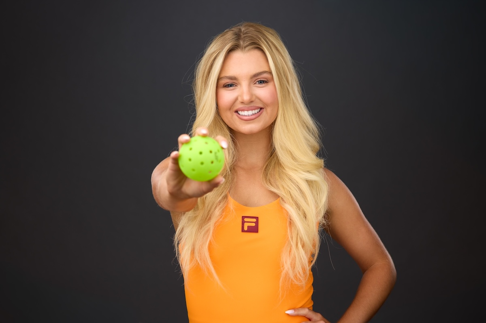

[Pickleball] Pickleball superstar **Anna Leigh Waters** is off to a blazing start in 2026. The 18-year-old from Allentown, Pennsylvania, just became the first pickleball athlete to sign with **Nike**, joining the brand's elite global roster after her previous **Fila** deal expired. Days later, she backed up the hype at the **PPA Masters** in Palm Springs, claiming her record-extending `40th` career Triple Crown by sweeping singles, doubles, and mixed doubles titles. Waters, who holds the world No. 1 ranking in all three disciplines, lost just five games across the entire tournament. With `181` career gold medals and landmark deals with Nike and **Franklin paddles**, she's cementing her status as the undisputed face of pickleball.

[Rubik's Cube] The Rubik's Cube world has been shattered — literally in seconds. On January 11, 2026, China's Xuanyi Geng set a new 3x3 World Record Average of `3.84 seconds` at the Beijing Winter event, breaking the once-mythical "sub-4 second" barrier that cubers long considered the holy grail. He surpassed the previous `3.90-second` mark held by child prodigy Yiheng Wang, and during the round posted a jaw-dropping `3.37-second` counting solve. Geng also holds the single-solve world record at `3.05 second`s (set April 2025), with many believing a sub-3 second solve is imminent. Meanwhile, blindfolded cubing saw its own breakthrough: Stanley Chapel from USA shattered the 2-minute barrier for 5x5 Blindfolded with a time of `1:58.59` — one of the most mentally demanding feats in speedcubing.

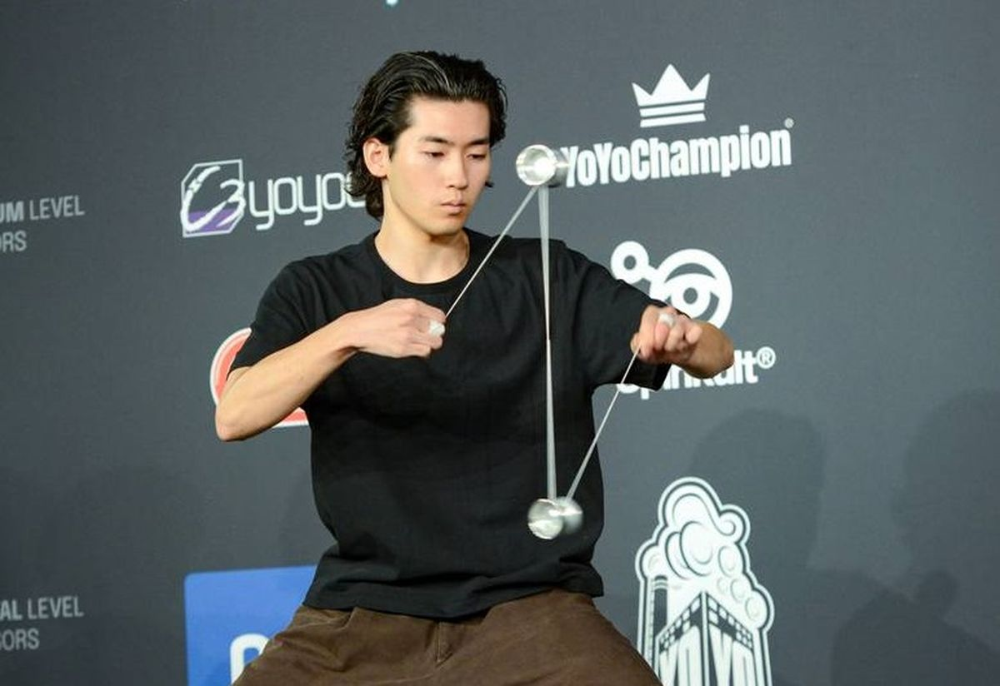

[Yo-Yo] Japan's **Hajime Miura** has cemented his status as a yo-yo legend, claiming his eighth world championship title at the **World Yo-Yo Contest 2025** in Prague. At just 22 years old, he's now the second most decorated yo-yo player in history — trailing only **Shinji Saito**'s 13 titles. Miura competes in 3A, a style where players control two yo-yos at the same time, one in each hand. His jaw-dropping three-minute routine marked a triumphant comeback after finishing fourth last year. The contest drew over `300` competitors from `43` countries. Miura has dominated the scene since winning his first world title in 2014 at age 10.

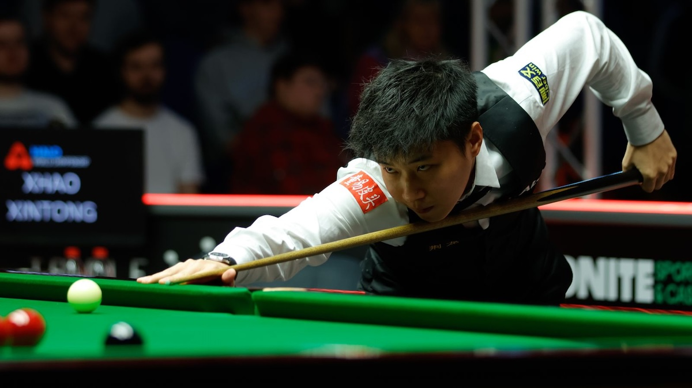

[Snooker] Chinese snooker made history at the **Championship League** in Leicester this week as three players delivered perfect **147** breaks within two days. On January 21-22, Xiao Guodong, Wu Yize, and reigning World Champion Zhao Xintong each cleared the table flawlessly during Group 6 matches. For Wu and Zhao, these were career-first maximums, while Xiao notched his third. The trio's display pushed the season's 147 tally to a record-breaking `21` — smashing the previous high of `15`. Remarkably, Chinese players have now contributed more than a third of those 21 maximums this season, underscoring the country's growing dominance in professional snooker.

[Soccer] **Arsenal** sit atop the UK's **Premier League** with a commanding seven-point lead after 22 matches — their biggest advantage at this stage in club history. Mikel Arteta's side ended 2025 leading both the league and Champions League group phase, going unbeaten in October with six wins and zero goals conceded. Their dominance rests on elite defending (Gabriel-Saliba partnership), set-piece mastery (14 league goals from dead balls, highest percentage ever for a potential champion), and improved depth following `£250 million` in summer signings including Martin Zubimendi. After three consecutive runner-up finishes, Arsenal finally look like a team that won't collapse — chasing their first title since 2004.

[Soccer] **Real Madrid** have endured a chaotic few weeks. After losing the **Supercopa de España** final 3-2 to **Barcelona** on January 11, the club sacked Xabi Alonso just 233 days into his tenure, citing "mutual agreement" — though sources indicate it was a dismissal following reports of player unrest, particularly with **Vinícius Júnior**. Former right-back Álvaro Arbeloa was promoted from the reserve team to replace him. His debut went disastrously: a 3-2 **Copa del Rey** exit to second-division **Albacete**. But Arbeloa bounced back emphatically, thrashing **Monaco** `6-1` in the Champions League on January 20, with **Mbappé** scoring twice against his former club. Madrid sit second in **La Liga**, four points behind Barcelona.

[NBA] The **Oklahoma City Thunder** (37-8) have emerged as the league's dominant force, holding a commanding six-game lead atop the Western Conference over the surprising **San Antonio Spurs**. Out East, the **Detroit Pistons** (32-11) are the story of the season — a shocking turnaround from perennial lottery team to conference leaders, ahead of the defending champion **Celtics** and resurgent **Knicks**. Individually, **Luka Dončić** is scorching nets at `33.5` points per game to lead all scorers, while **Nikola Jokić** continues his nightly triple-double pursuit, pacing the league in both rebounds (`12.2`) and assists (`11.0`). "The Joker"'s all-around dominance makes him the early MVP frontrunner.

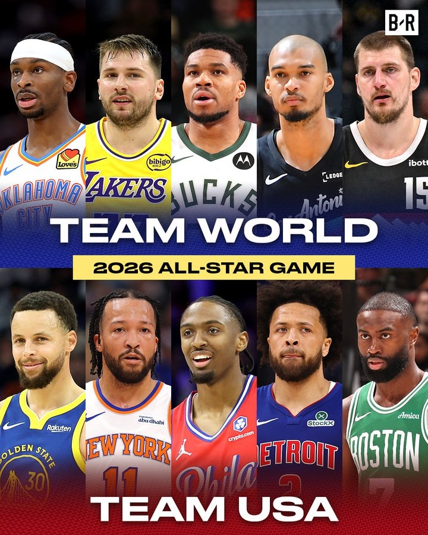

[NBA] The NBA unveiled a groundbreaking format for the **75th All-Star Game**: USA vs. World. For the first time, two American teams will face one international squad in a round-robin tournament at LA's Intuit Dome on February 15. Luka Dončić (Slovenia) and Giannis Antetokounmpo (Greece) led fan voting, headlining a stacked World team alongside Nikola Jokić (Serbia), Shai Gilgeous-Alexander (Canada), and Victor Wembanyama (France). The USA starters feature Stephen Curry, Jalen Brunson, Cade Cunningham, Tyrese Maxey, and Jaylen Brown. Notably absent: LeBron James missed the starting lineup for the first time since his 2003-04 rookie season, ending a 22-year streak. Reserves will be announced February 1.

## This Day in History

On **January 24, 1848**, James W. Marshall discovered gold flakes in the American River while building a sawmill for John Sutter in **Coloma, California**. Though Sutter tried to keep the find secret, word spread rapidly. By 1849, some `300,000` prospectors — dubbed "**forty-niners**" — flooded into California from across the U.S. and the world. The Gold Rush transformed **San Francisco** from a tiny settlement into a booming city and accelerated California's path to statehood in 1850. It reshaped the American economy, spurred westward migration, and devastated Native American communities. Ironically, neither Marshall nor Sutter profited — both died in poverty. As of 2026, California would rank as the 5th largest economy in the world, trailing only the **United States**, **China**, and **Germany**. 

## Art of the Week

**Girl with a Pearl Earring** is a small oil painting created around 1665 by Dutch master **Johannes Vermeer**. It depicts an unknown young woman in an exotic blue and gold turban, glancing over her shoulder with parted lips and a luminous pearl earring catching the light. What makes it extraordinary is Vermeer's mastery of light — the way the pearl gleams, the soft glow on her skin, and the mysterious dark background that makes her seem to emerge from shadow. Her ambiguous expression has drawn comparisons to the Mona Lisa. The painting was virtually unknown until the 1990s, when it became a global icon after inspiring a bestselling novel and Hollywood film starring **Scarlett Johansson**.

## Funny

Wife: You’re not buying new books, are you?

Husband: Absolutely not. These books were published years ago.

---

## Previous Issues

---

January 17, 2026, **[The Attack of Robots, Elephant, Banksy, and Heat](https://weekly.sundayblender.com/p/the-attack-of-robots-elephant-banksy-and-heat)**

January 03, 2026, **[An Incredible Journey From Wuhan To Singapore](https://weekly.sundayblender.com/p/an-incredible-journey-from-wuhan-to-singapore)**

December 27, 2025, **[The Age of One-Person Billion Dollar Company](https://weekly.sundayblender.com/p/the-age-of-one-person-billion-dollar-company)**

---

Thanks for reading! If you enjoy this newsletter, please share it with friends who might also find it interesting and refreshing, if not for themselves, at least for their kids.

