## Editor's Words

Howdy! We're back after a two-week break from school break during the Lunar New Year. 

On the occasion of the Year of the Red Fire Horse, wishing you and your family a joyful New Year, happiness at home, and soaring success in your endeavors!

2026 seems to be a year like no other. Rules are being rewritten. Old paradigms are being dismantled. Jobs are being redefined. 

Are you ready yet?

## Tech

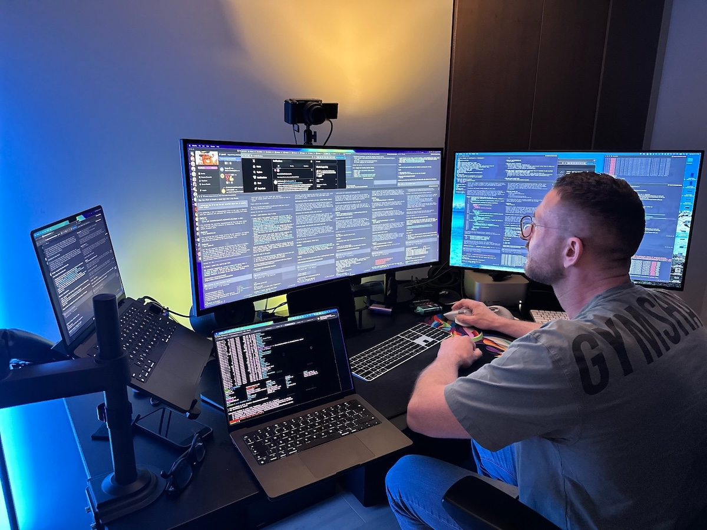

In a move that sent shockwaves through the AI community, **OpenAI** announced on February 15, 2026, that **Peter Steinberger** — the solo developer behind viral open-source agent framework **OpenClaw** — was joining the company to lead its next generation of personal agents. Originally launched in November 2025 as **ClawdBot** (later rebranded after a trademark dispute with **Anthropic**), OpenClaw exploded to `1.5 million` active agents in just weeks. OpenClaw will move to an independent open-source foundation, but the hire signals a decisive industry shift — from AI that *talks* to AI that *acts*. The irony is that Anthropic handed OpenAI their biggest win of 2026. OpenClaw was built on Anthropic's AI model **Claude**, named after Claude, and used Claude Opus as its default model — making Steinberger arguably Anthropic's biggest unpaid evangelist. Then Anthropic's legal team sent a trademark notice over the name "Clawdbot," and as one writer put it: "Anthropic's lawyers sent the letter. OpenAI sent the offer."

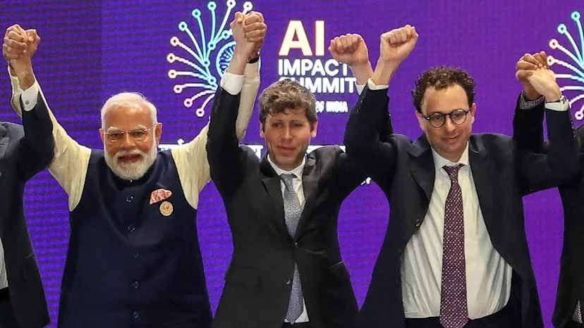

**New Delhi**'s **AI Impact Summit 2026** marked a historic shift in global AI governance — the first in the Bletchley-Seoul-Paris series to be hosted by a Global South nation. India positioned itself as a bridge between advanced economies and developing nations, pointing to its massive digital public infrastructure as a model for deploying AI at scale. Standout announcements included **Google**'s `$15 billion` AI infrastructure commitment to India, a new America-India fiber-optic connectivity initiative, and a `$30 million` AI for Science research fund. Indian AI lab **Sarvam AI** unveiled powerful new large language models built for Indian languages. Not all was harmonious, however — cameras caught an awkward moment when **OpenAI**'s Sam Altman and **Anthropic**'s Dario Amodei visibly avoided holding hands during a group photo with Prime Minister **Modi**, a subtle reminder that the **OpenClaw** saga had left some tension between the two rival labs.

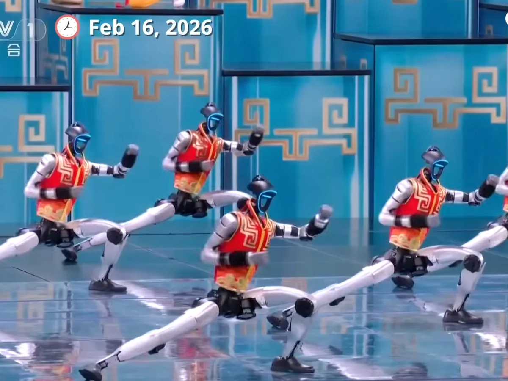

China's most-watched television event, the **CCTV Spring Festival Gala**, delivered a stunning statement of technological ambition this Lunar New Year. Four humanoid robotics startups — **Unitree**, **Galbot**, **Noetix**, and **MagicLab** — took center stage in performances that left last year's handkerchief-twirling robots looking primitive. Highlights included over a dozen Unitree humanoids performing backflips, aerial spins, and a full kung fu routine alongside child martial artists wielding swords and nunchucks. The contrast with **Tesla**'s **Optimus** robot was hard to miss — Musk had just admitted on an earnings call that no Optimus robots were yet doing "useful work" in Tesla factories, even as he acknowledged China as his biggest competition, calling them "an ass-kicker next level."

**ByteDance**, the Chinese company behind **TikTok**, unleashed **Seedance** 2.0 on the world in February 2026 — and Hollywood immediately reached for its lawyers. The AI video model, capable of generating hyper-realistic cinematic clips from a simple text prompt, went viral within hours as users shared videos of **Tom Cruise** brawling with **Brad Pitt**, **Donald Trump** fighting kung fu masters, and **Kanye West** singing in Mandarin through a Chinese palace. **Disney** and **Paramount** fired off cease-and-desist letters, the Motion Picture Association declared it "mass copyright infringement," and **Deadpool** screenwriter Rhett Reese delivered the line everyone in the industry was thinking: "I hate to say it. It's likely over for us."

**Google DeepMind** quietly dropped one of the most disruptive demos in gaming history when it rolled out **Project Genie** to Google AI Ultra subscribers in late January. Built on the Genie 3 world model, the tool lets anyone type a text prompt or upload a sketch and instantly explore a fully interactive 3D environment — no code, no game engine, no development team required. Users quickly generated knockoff versions of Zelda and GTA, video game stocks slid, and the internet declared the death of traditional game studios. Google itself was careful to say Genie is "not a game engine" — but the gaming industry wasn't entirely convinced the distinction would matter for long.

## Global

A football field-sized slab of snow broke loose near **Castle Peak** in California's Sierra Nevada on February 17, killing nine backcountry skiers in the deadliest avalanche in the United States in `45` years. The group of 15 — eleven clients and four guides from Blackbird Mountain Guides — were on the final day of a three-day hut trip in the mountains north of **Lake Tahoe** when one skier shouted "avalanche" before the snow overtook them. Six survived, located by emergency beacons in whiteout conditions. Six of the victims were later identified as close friends — mothers and wives from the Bay Area — who had bonded over a shared love of the mountains. The six survivors — huddled in a makeshift tarp shelter, located by emergency beacons and iPhone SOS signals — had spent hours in gale-force winds waiting for rescue teams who could only travel the final two miles on skis.

## Economy & Finance

When Hong Kong markets reopened after the Lunar New Year holiday, investors wasted no time. Shares of **Zhipu** — China's first publicly listed large language model company — surged `43%` on February 20, while rival **MiniMax** jumped `15%`, pushing both companies' market capitalizations past `HK$300 billion`. The gains capped a remarkable run: since their back-to-back IPOs in January, both stocks have risen more than fourfold. The rally reflects a broader investor rotation out of established internet giants like **Alibaba** and **Tencent** into pure-play AI startups, driven by new model releases, surging user growth, and intensifying conviction that China's AI race has entered a new commercial phase. 

## Nature & Environment

California's **Highway 1** through **Big Sur** had barely celebrated its triumphant reopening when nature had other ideas. After a three-year closure due to the infamous Regent's Slide — finally resolved 90 days ahead of schedule in January 2026 — the iconic coastal road was forced to close again on February 17 after powerful storms dumped over `30` inches of snow in the Sierra and unleashed rockslides and debris across a `45-mile` stretch between Ragged Point and Big Sur. Caltrans crews scrambled to clear mud that had overtopped concrete barriers. In a memorable subplot, one impatient driver moved road closure barriers to sneak through — and promptly got stuck in a mudslide. The road finally reopened again on February 20.

For the first time, scientists have a complete picture of floating algae across every ocean on Earth — and the view is alarming. Led by researchers at the **University of South Florida** and **NOAA** (National Oceanic and Atmospheric Administration), the landmark study used AI to analyze `1.2 million` satellite images taken between 2003 and 2022, training a deep-learning model to detect algae blooms invisible to traditional methods. The findings, published in **Nature Communications**, reveal macroalgae blooms expanding at `13.4%` per year in the tropical Atlantic and western Pacific, with the Indian Ocean seeing a three-to-four-fold increase. Scientists attribute the surge to ocean warming and agricultural nutrient runoff. In open water, algae support marine ecosystems — but once they reach coastlines, the decaying biomass devastates tourism, economies, and human health. The global ocean, researchers conclude, has undergone a fundamental shift: it now actively favors algae growth.

## Science

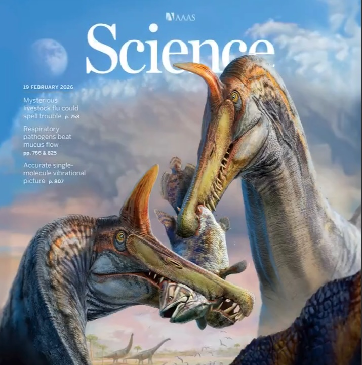

Scientists have unveiled **Spinosaurus Mirabilis**, the first new Spinosaurus species discovered in over a century, unearthed from a remote fossil site in **Niger**'s central Sahara. Led by **University of Chicago** paleontologist Paul Sereno, the team found skulls from three individuals during a grueling 2022 expedition — guided into the desert by a local Tuareg man on a motorbike. The `40-foot`, `5–7 ton` predator sported a dramatic scimitar-shaped skull crest unlike anything seen before in its family. Crucially, the find was located up to `1,000 kilometers` from the nearest ancient coastline, dealing a decisive blow to the theory that Spinosaurus was a fully aquatic swimmer — painting it instead as a wading "hell heron," stalking fish from shallow inland rivers.

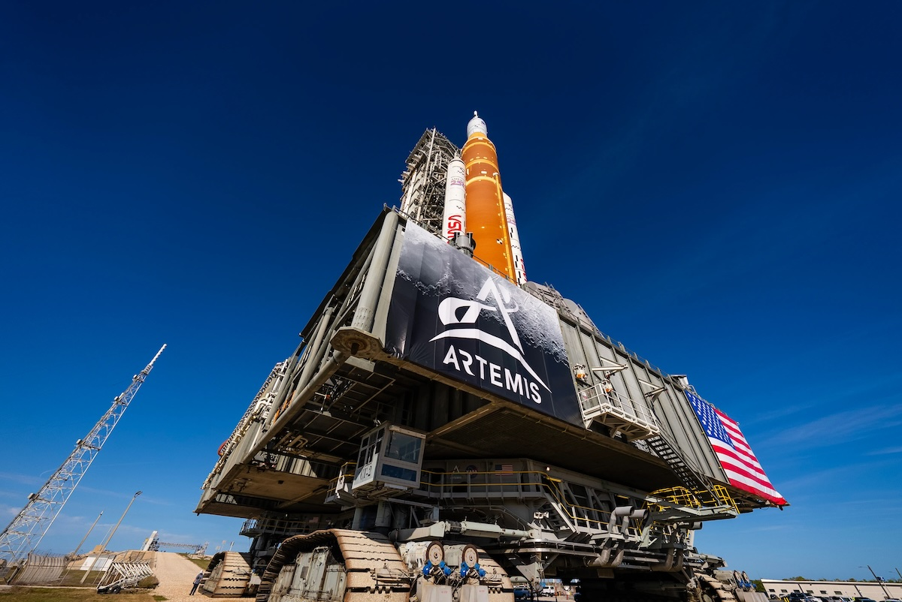

For the first time in more than half a century, humans are preparing to leave Earth orbit. **NASA**'s **Artemis II** mission — targeting launch no earlier than March 6 from **Kennedy Space Center** — will send four astronauts on a `10-day`, `600,000-mile` journey around the Moon and back. Commander Reid Wiseman, pilot Victor Glover, mission specialist Christina Koch, and Canadian astronaut Jeremy Hansen entered quarantine this week after a successful fueling rehearsal cleared the final major technical hurdle. The mission carries historic firsts: Glover will become the first person of color, Koch the first woman, and Hansen the first non-American to venture beyond low Earth orbit. It won't be a landing — but it will pave the way for Artemis III to finally return humans to the lunar surface for the first time since `1972`.

## Lifestyle, Entertainment & Culture

Every Lunar New Year's Eve, nearly a billion Chinese people sit down together. China's **CCTV Spring Festival Gala** — running continuously since `1983` — is less a television program than a national ritual, pulling in hundreds of millions of viewers and reaching audiences from Shanghai penthouses to remote village homes. This year's show, themed "Joy and Auspiciousness, Festive and Cheerful," blended Silk Road dance and Peking opera with cutting-edge humanoid robots performing backflips and kung fu, threading ancient tradition alongside China's technological ambitions. The 2026 edition was also the most international in the Gala's 40-year history: **John Legend** performed "All of Me" before midnight, while **Lionel Richie** joined **Jackie Chan** at a sub-venue in Yiwu — China's cosmopolitan trading capital — for a cross-cultural performance that felt like a deliberate East-meets-West handshake. For migrant workers separated from family, elderly grandparents, and tech-savvy youth alike, the Gala serves the same quiet purpose it always has: a shared moment that says, whatever divides us through the year, tonight we watch together.

On February 17, as China rang in the Lunar New Year with robot acrobatics and billion-viewer galas, South Korea marked the same moment in characteristically quieter fashion. **Seollal** — Korea's most cherished holiday — brought the country to a near-standstill across a three-day national break, as tens of millions made the annual pilgrimage back to hometowns clogged with the season's legendary traffic. This year carried extra weight: 2026 is the Year of the Red Horse, a rare cycle that only arrives once every sixty years, combining the Horse's natural fire — energy, ambition, restless forward motion — with the intensifying force of the red flame element. Families rose early to perform **charye**, the ancestral memorial rite, before sharing bowls of **tteokguk** and watching children bow deeply to elders in the **sebae** ritual. 

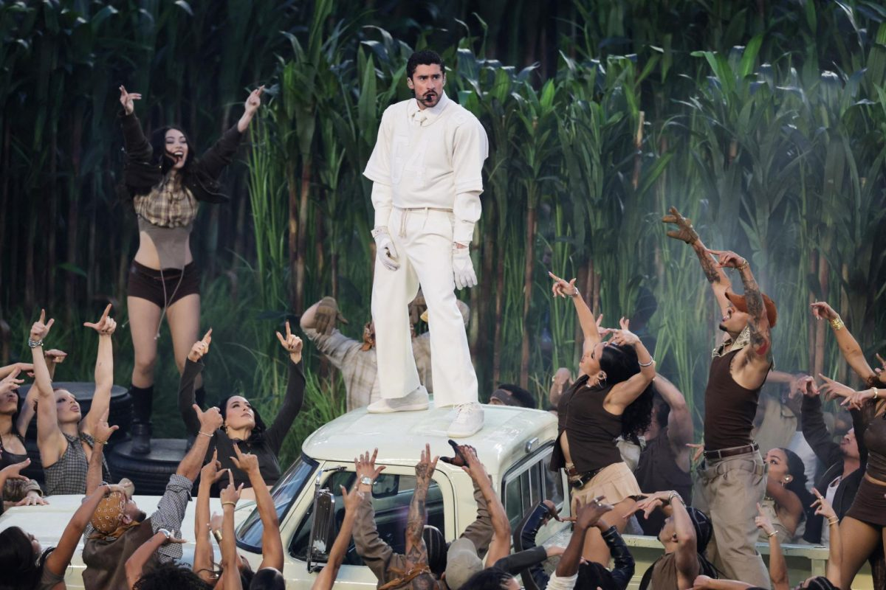

Puerto Rican superstar **Bad Bunny** delivered a halftime show for the ages at Levi's Stadium — the first ever headlined by a Latino solo artist and performed almost entirely in Spanish. Every generation has its defining halftime moment: **Michael Jackson** standing motionless for two minutes in 1993 until `130 million` people collectively lost their minds; **Prince** playing guitar through a biblical rainstorm in 2007, performing "Purple Rain" as real rain poured down in one of sport's most cinematic scenes. Bad Bunny's contribution was different but equally seismic — a full-throated celebration of Puerto Rican culture on America's biggest stage. Opening in an elaborate sugarcane field set, he waved the Puerto Rican flag and tore through hits alongside surprise guests **Lady Gaga**, **Ricky Martin**, and **Pedro Pascal**. The `128.2 million` viewers made it the fourth most-watched halftime in history, and his Spanish-language single rocketed to number one on the **Billboard Hot 100** days later.

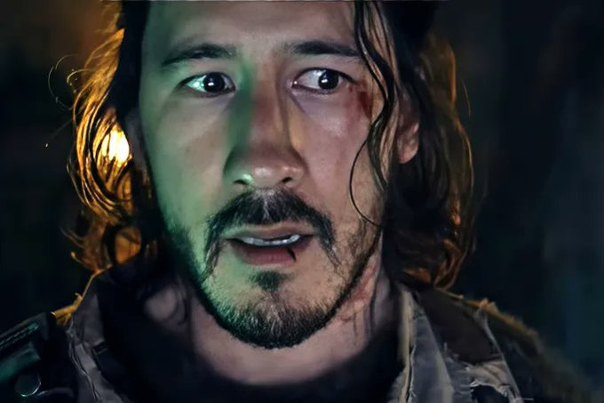

When **YouTube** star **Mark Fischbach**, known as Markiplier, announced he was self-financing and self-distributing a sci-fi horror film adapted from a cult indie video game, Hollywood raised an eyebrow. Then **Iron Lung** opened on January 30, 2026, and the industry's jaw dropped. The film — shot for just `$3 million` and marketed almost entirely through Markiplier's `74 million` YouTube followers — debuted at number one on Friday with `$8.9 million`, eventually finishing the weekend at `$18.2 million`, narrowly behind Sam Raimi's big-budget Disney thriller **Send Help**. It has since crossed `$43 million` worldwide, earning over `14` times its budget. Markiplier reportedly keeps `50%` of global box office receipts — a deal no studio would ever offer.

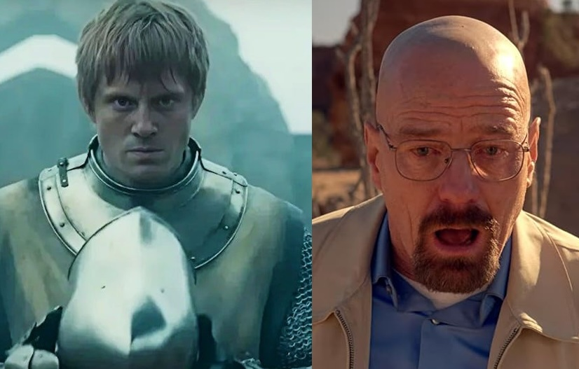

**Breaking Bad**'s "Ozymandias" — **IMDb** (Internet Movie Database)'s undisputed greatest single TV episode for 13 years — has finally lost its perfect 10. The culprit? Its own fans. When **HBO**'s **Game of Thrones** prequel **A Knight of the Seven Kingdoms** went viral for its stunning fifth episode, briefly touching a 10.0 rating, Breaking Bad loyalists flooded its page with one-star reviews to protect Heisenberg's throne. Game of Thrones fans retaliated in kind, bombing "Ozymandias" until it dropped to 9.9. Both fandoms drew blood — and both lost. The real winner? **Six Feet Under**'s series finale, which quietly ascended to IMDb's number one spot while the fanboy armies were busy fighting each other. History, it turns out, has a sense of humor: the exact same thing happened in 2008 between **The Dark Knight** and **The Godfather** — and **The Shawshank Redemption** claimed the top spot then too.

## Sports

[Olympics] With just one day remaining before the closing ceremony, the **Milano Cortina 2026 Winter Olympics** have delivered a historic medal race. **Norway** has dominated, claiming `17` gold medals — a new all-time Winter Games record, surpassing their own mark from Beijing 2022. **The United States** sits second overall with `27` medals, edging out host nation **Italy** in third. Team USA's **Mikaela Shiffrin** captured slalom gold in a triumphant return, while China's **Ning Zhongyan** stunned the speed skating world with an Olympic record in the 1500m. In a storybook moment, **Brazil** claimed their first-ever Winter Olympic gold. With the Games closing February 22, Norway leaves Milan having rewritten the record books.

[Olympics] Four years after finishing seventh in Beijing, 26-year-old **Ning Zhongyan** stood on top of the world in Milan. On February 19, the Chinese speed skater shattered the men's 1500m Olympic record with a stunning time of `1:41.98` — more than a second faster than the previous mark — to claim gold ahead of pre-race favorite Jordan Stolz of the United States. It was the first Asian athlete to win Olympic gold in the event since the Winter Games began in `1924`. Ning, who had already earned two bronzes at these Games, wept as he circled the ice draped in China's flag. "It felt like there was a mountain in front of me," he said afterward. "Today was the day I finally got over it."

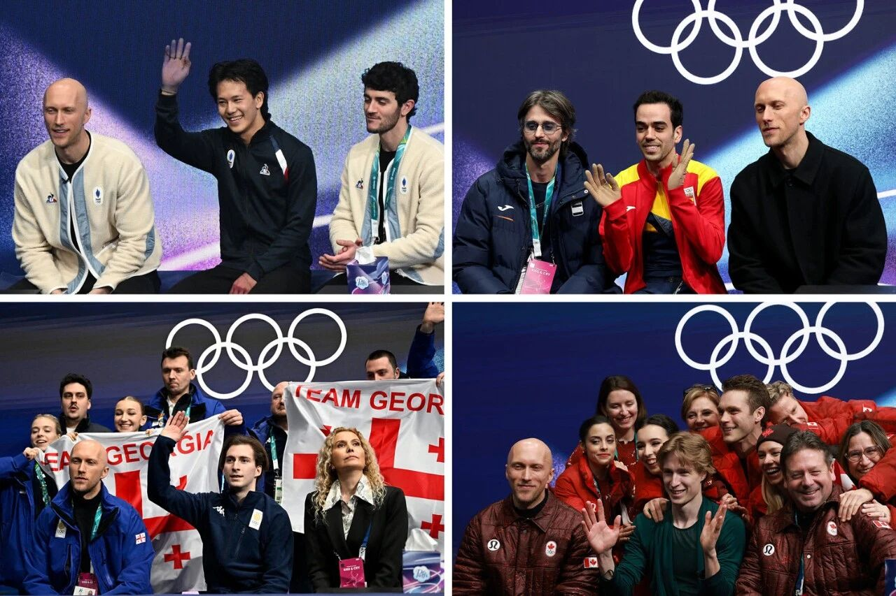

If you watched figure skating at the **2026 Winter Olympics** and kept seeing the same tall, bald Frenchman in a different national team jacket every few minutes, you weren't imagining things. **Benoît Richaud**, 38, a choreographer and coach based in Nice, became one of the unlikely stars of the Milan Games after cameras caught him switching jackets between consecutive skaters — once changing from Georgia to Canada in just 14 minutes. Richaud was working with `16` skaters from `13` countries, including athletes from the US, France, Canada, Mexico, and Georgia — all legally permitted under Olympic rules. "As soon as they step on the ice," he said, "I'm already in their world."

[NFL] The **Seattle Seahawks** claimed their second **Super Bowl** title on February 8, 2026, dismantling the **New England Patriots** `29–13` at Levi's Stadium in Santa Clara, California. The story of the night was quarterback **Sam Darnold**, once written off as one of the NFL's biggest busts, who signed with Seattle and led them to the championship in a remarkable redemption arc. The real work, though, was done by his defense — Macdonald's squad sacked Patriots quarterback **Drake Maye** six times and held New England scoreless through three quarters. Kenneth Walker III ran for 135 yards, and linebacker Uchenna Nwosu sealed it with a 45-yard pick-six late in the fourth.

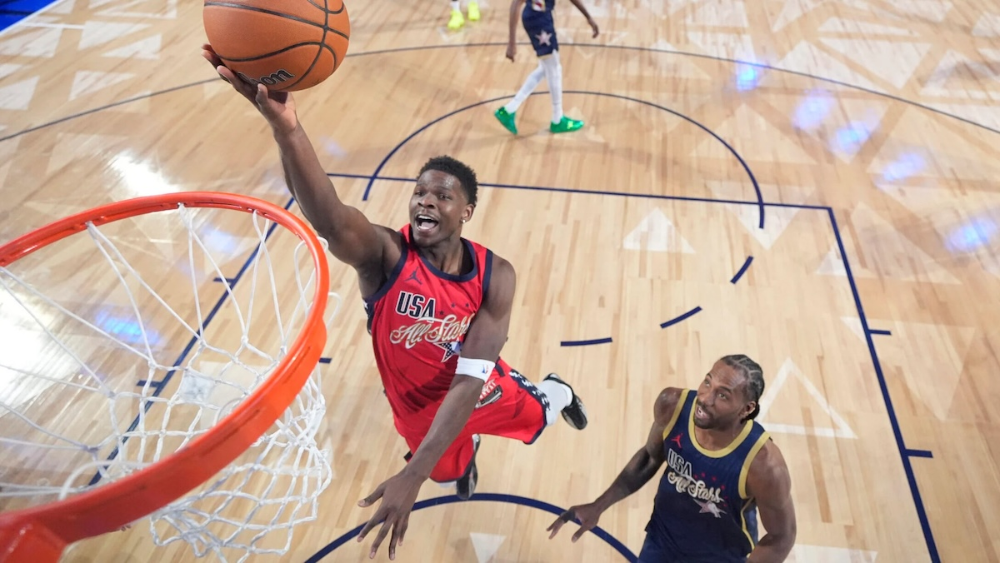

[NBA] The NBA's bold new format paid off in a big way at the **75th All-Star Game**, held February 15 at Intuit Dome in Inglewood, California. A three-team round-robin — USA Stars, USA Stripes, and Team World — replaced the traditional East vs. West matchup, and the result was the most competitive All-Star showcase in years. **Victor Wembanyama** set an electrifying tone for Team World, finishing with `33` points across two razor-thin losses. But **Anthony Edwards** was the night's defining figure, scoring `32` points to lead the young-gun USA Stars to a 47-21 blowout win over the veteran-laden Stripes in the championship game, earning MVP honors and the Kobe Bryant Trophy.

[Soccer] **Real Madrid**'s **Champions League** playoff win at Benfica on February 17 was meant to be about a brilliant goal. Instead, it became another chapter in **Vinícius Júnior**'s exhausting fight against racism. Moments after curling a sublime finish past goalkeeper Trubin, the Brazilian accused Benfica's young Argentine winger Gianluca Prestianni of calling him a monkey — covering his mouth with his shirt as he said it. The referee halted play for ten minutes under FIFA's anti-racism protocol as Madrid's players briefly left the field. Prestianni denies it. Benfica's manager, controversially, suggested Vinicius had provoked the incident. UEFA has opened a formal investigation. For Vinicius, it was his `18th` racism complaint since 2022. The second leg is February 25 at the Bernabéu — a powder keg waiting to ignite.

## This Day in History

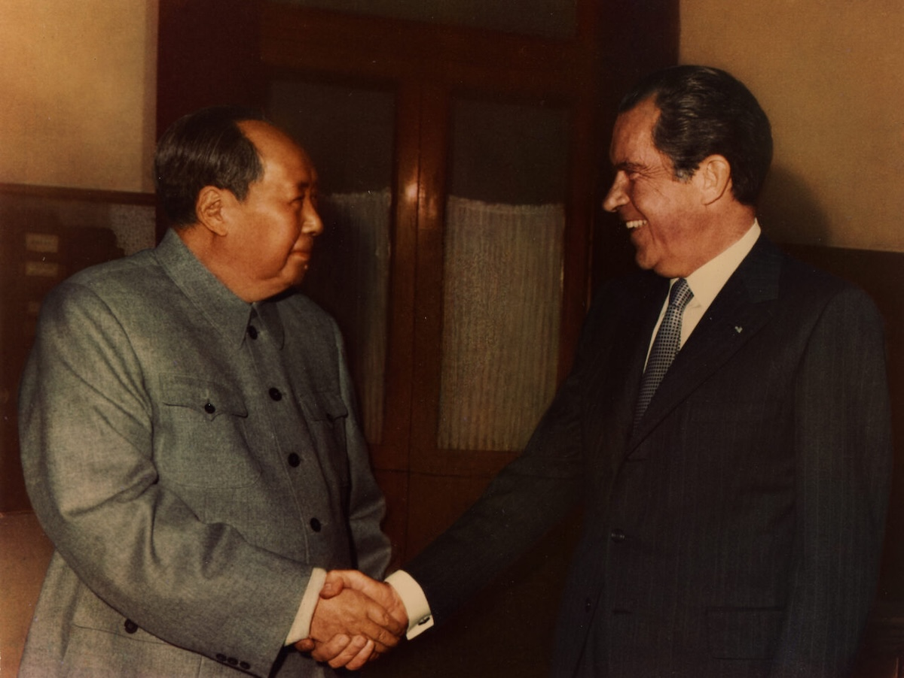

In one of the Cold War's most stunning diplomatic reversals, President **Richard Nixon** touched down in Beijing on **February 21, 1972**, becoming the first sitting U.S. president to visit the People's Republic of China. Nixon met with Chairman **Mao Zedong** at Zhongnanhai in a historic encounter that shattered more than two decades of American isolation policy toward communist China. The groundwork had been quietly laid the previous year, when the U.S. ping-pong team's surprise visit to China — the famous "Ping-Pong Diplomacy" — signaled both nations' readiness for a thaw. Nixon's week-long visit ended with a landmark joint agreement that reopened relations between the two superpowers and reshaped the global balance of power against the Soviet Union.

## Art of the Week

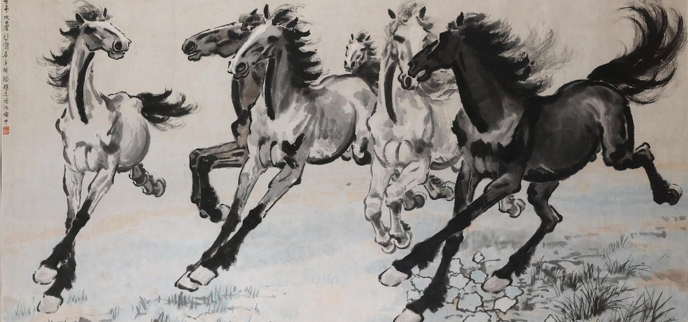

Few images are more synonymous with Chinese modern art than **Xu Beihong**'s horses. The early 20th-century master fused Chinese ink brushwork with Western anatomical precision, producing galloping stallions of extraordinary vitality — muscles taut, manes flying, hooves barely touching the ground. Where traditional Chinese painters rendered horses as symbols of imperial power, Xu transformed them into something more urgent: expressions of freedom, resilience, and national spirit during China's turbulent years of war and occupation. His 1942 masterpiece Galloping Horse became an icon. Today his works command tens of millions at auction. The horse, for Xu Beihong, was never just an animal — it was a nation in motion.

## Funny

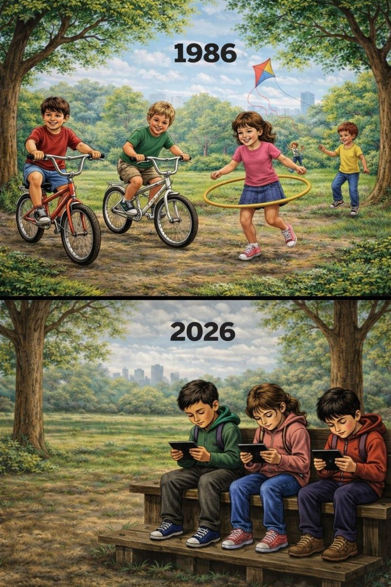

---

## Previous Issues

---

January 31, 2026, **[The Dawn of Machine-to-Machine Society](https://weekly.sundayblender.com/p/the-dawn-of-machine-to-machine-society)**

January 24, 2026, **[Destination: China - The Return of Western Rock Bands](https://weekly.sundayblender.com/p/destination-china-return-of-western-rock-bands)**

January 17, 2026, **[The Attack of Robots, Elephant, Banksy, and Heat](https://weekly.sundayblender.com/p/the-attack-of-robots-elephant-banksy-and-heat)**

---

Thanks for reading! If you enjoy this newsletter, please share it with friends who might also find it interesting and refreshing, if not for themselves, at least for their kids.