## Editor's Words

Children are a very ephemeral species. 

When they meet each other again on Monday in school after a long holiday, they don't say "hey, how was your vacation, and where did you go?" 

As they leave school on Friday afternoon, they don't ask "what's your plan for the weekend?"

They just hang and play. They live in the present, however for a fleeting moment that might be.

At the same time, all the AI tools in the world try very hard to make sure adults don't forget anything. We're always haunted by our memory from the past and anxiety into the future.

My mother-in-law graduated from Shanghai High School (SHS) many years ago. See if you can find the clue in this issue that references SHS. It still shines ever more brightly.

Can you feel how hard I try to tell the audience what's going on in the world without saying what's going on in the world? You feel me?

If you do, share this issue with a friend. This issue is a personal favorite.

## Tech

Chinese AI models have stormed to dominance on **OpenRouter**, the world's largest LLM (large language model) API aggregation platform. As of late February 2026, Chinese models account for `61%` of total token consumption, with the top three spots all held by Chinese labs. **MiniMax** M2.5 leads with 2.45 trillion tokens consumed in a single week — a `197%` surge followed by **Moonshot AI**'s Kimi K2.5 and **Zhipu AI**'s GLM-5. The catalyst? Programming tasks have grown from `11%` to over `50%` of all token consumption on OpenRouter, with agentic workflows now generating the majority of output tokens — a shift turbocharged by AI assistant **OpenClaw**'s viral explosion in early 2026, which brought autonomous multi-step AI agents to hundreds of thousands of developers practically overnight. At 10–20x cheaper than Western counterparts like **Claude** Opus 4.6, Chinese open-weight models are tailor-made for these token-hungry agent loops. **Andreessen Horowitz estimates roughly `80%` of startups using open-source AI stacks now run Chinese models.

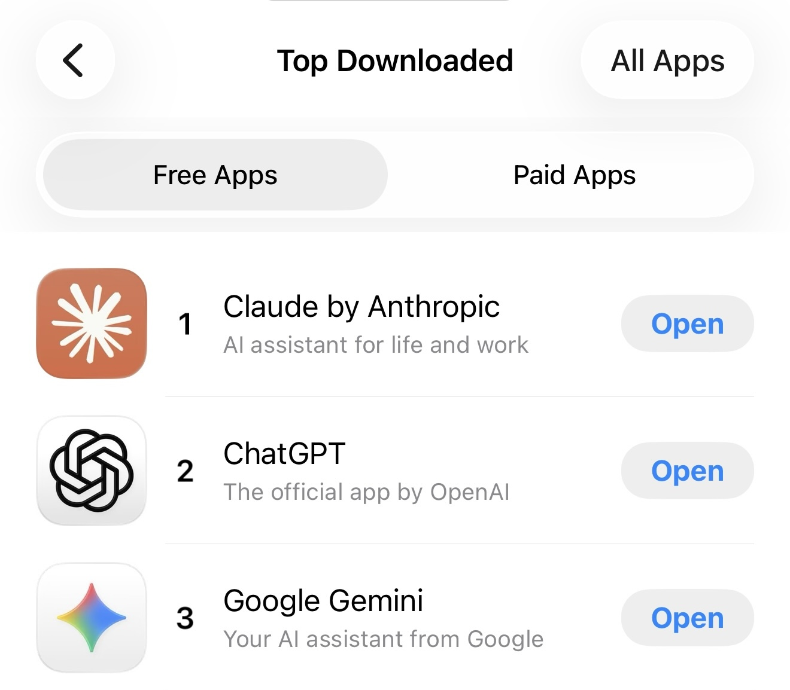

**Anthropic**'s Claude rocketed from #131 on **Apple**'s US App Store in late January to #1 by March 1 — leapfrogging **ChatGPT** and **Gemini** for the first time ever. The surge wasn't just headlines. Free signups jumped `60%` since January; daily registrations tripled since November, breaking all-time records every day last week. Paying subscribers more than doubled this year. **Claude Code** became the most widely adopted coding agent across startups and enterprises. Its state-of-the-art model **Opus 4.6** took the top spot on both Artificial Analysis benchmarks and Arena.ai blind tests. **Katy Perry** posted a heart over her Pro subscription. 

## Global

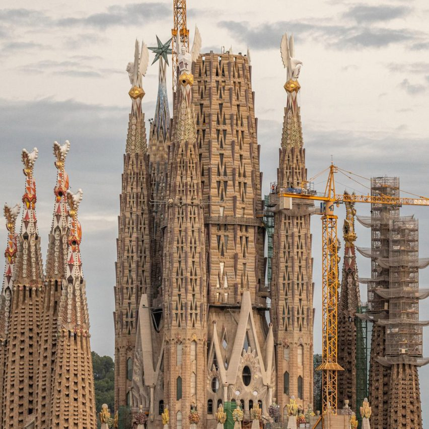

After `144` years of construction, Barcelona's **Sagrada Família** reached a historic milestone on February 20, 2026, when the upper arm of the cross on the Tower of Jesus Christ was installed, completing the external works of the basilica's central tower Vatican News. Standing at `172.5` meters, it is now the world's tallest church, surpassing **Ulm Minster** in Germany. The basilica was designed by **Antoni Gaudí**, widely regarded as one of the greatest architects of all time, who transformed a neo-Gothic design into a masterpiece of Barcelona's famously ornate, nature-inspired architectural style after taking over the project in `1883`. The structural completion marks the end of one of architecture's most extraordinary sagas.

The Middle East's skies went dark this weekend. After joint US-Israeli strikes on Iran on February 28, at least eight countries — **Iran**, **Israel**, **Iraq**, **Jordan**, **Qatar**, **Bahrain**, **Kuwait**, and the **UAE** — closed their airspace, shutting down some of the world's busiest aviation corridors. More than `1,800` flights were cancelled on Saturday alone, with Emirates, Qatar Airways, and Etihad — carriers that collectively move around `90,000` passengers daily through Gulf hubs — all suspending operations. Iran's retaliatory strikes hit **Dubai International Airport**, forcing evacuations, while drone strikes damaged airports in **Abu Dhabi** and **Bahrain**. With Russian airspace already closed from the Ukraine war, Europe-Asia traffic that had rerouted through the Middle East now has nowhere left to go. As of Sunday, disruptions are entering their second day with no end in sight.

President Trump's record-length **State of the Union** address on February 24, 2026 produced its most powerful moment when he turned to honor a centenarian war hero. Retired Navy Captain **Royce Williams**, 100 years old, received the **Medal of Honor** for a 1952 Korean War dogfight in which he engaged seven Soviet MiG-15s alone for `35` minutes (the longest dogfight in US Navy history), shot down four, and survived 263 bullet holes to his aircraft in blizzard conditions. The mission was classified for over fifty years — he couldn't even tell his wife. As a military aide carried the medal down the House gallery stairs, First Lady Melania Trump placed it around his neck. The entire chamber — both sides — rose for a standing ovation lasting more than three minutes. Williams is the last living Korean War Medal of Honor recipient.

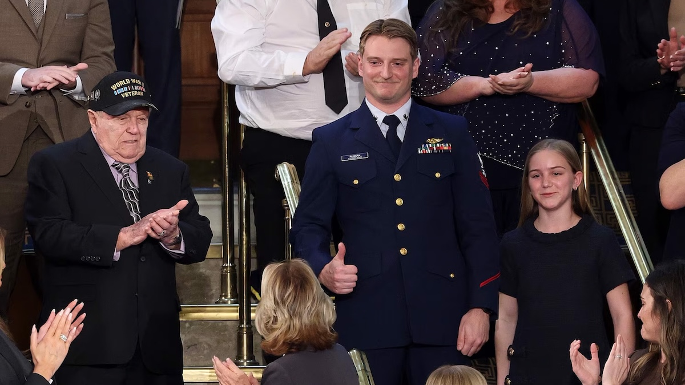

Coast Guard Petty Officer **Scott Ruskan** was a 26-year-old former KPMG accountant on his very first rescue mission when catastrophe struck. On July 4, 2025, the Guadalupe River surged from 3 feet to nearly 30, devastating Camp Mystic — an all-girls summer camp in Texas Hill Country with over 700 campers. His helicopter crew made a calculated call: leave the rookie on the ground alone while the chopper airlifted the first children out. For three hours — no radio, no cell service, no backup — Ruskan was the sole rescuer, triaging nearly 200 terrified girls. He bandaged wounds, carried barefoot children across jagged terrain, and organized extractions wave by wave, youngest first. He saved `165` lives. In a teary moment at the 2026 State of the Union, Trump reunited Ruskan with 11-year-old Milly Cate McClymond — one of the girls he carried to safety — for the first time since that day, then awarded him the **Legion of Merit** for extraordinary heroism.

## Nature & Environment

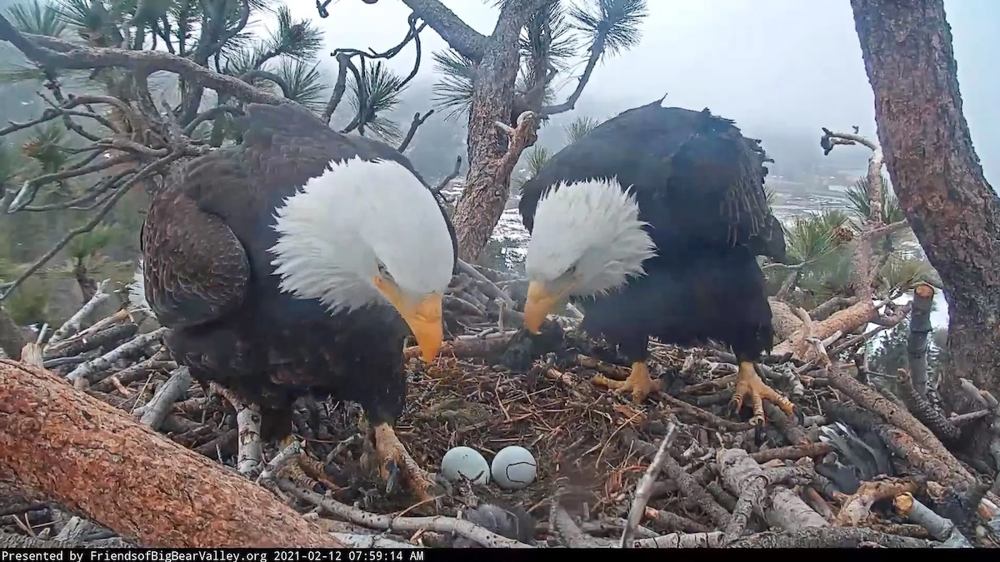

**Jackie and Shadow**, the beloved bald eagle pair, have captivated millions as stars of the **Big Bear Bald Eagle Cam** in Southern California's San Bernardino Mountains. Perched `145` feet high in a Jeffrey pine tree overlooking Big Bear Valley, this devoted couple symbolizes resilience and family bonds. Jackie, the experienced female, and Shadow, her loyal mate since 2018, share incubation duties, prey deliveries, and nest maintenance with endearing teamwork. They've raised eaglets like Sunny and Gizmo in past seasons, drawing global viewers to the 24/7 livestream. This season has been a rollercoaster. Jackie laid two eggs in late January — then ravens destroyed both while the couple was away. Fans were devastated. But Jackie's hormones reset, and on February 24 she laid a brand new egg — the start of a second clutch. A second egg followed on February 28. Fans cheer their persistence amid habitat threats, celebrating this iconic duo's grace, strength, and second-chance spirit in the wild.

## Science

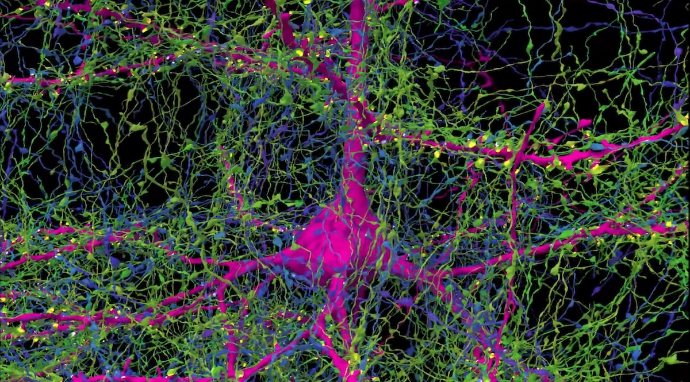

**Harvard** and **Google** spent a decade mapping a single cubic millimeter of human brain — half the size of a grain of rice — and found `57,000` cells, `230` millimeters of blood vessels, and `150` million synapses, all compressed into `1.4` petabytes of raw data. The imaging alone took `326` days: `5,000` tissue slices, each `30` nanometers thick, run through a `$6` million electron microscope, then stitched into 3D by Google's AI. The humbling math: the full human brain is one million times larger — mapping it at this resolution would produce roughly `1.4` zettabytes, approximately equal to all data generated on Earth in a single year. We are walking universes.

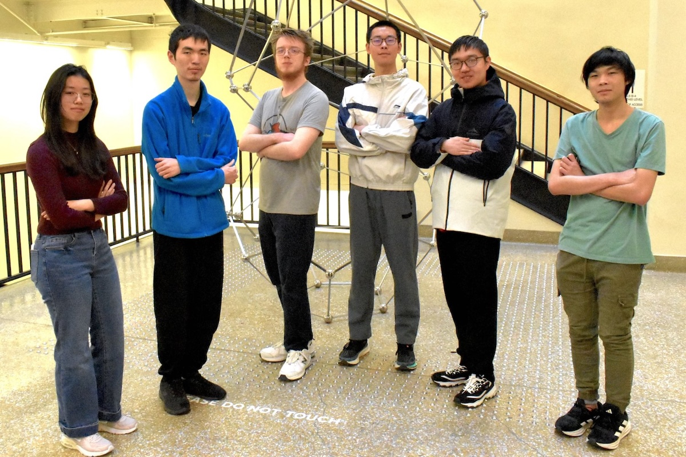
*2024 MIT Putnam winners, as no public photo exists yet for 2025's*
 
The Putnam Competition is the most prestigious undergraduate mathematics contest in the world — a six-hour, twelve-problem exam so brutally difficult that the median score is typically 2 out of 120, and only five perfect scores have been recorded in its 86-year history. This year, `4,329` students from `487` institutions competed on December 6, 2025, with the top score reaching `110`. **MIT** won the team title again — their tenth in twelve years — with four of five Putnam Fellows: Cheng Jiang, Luke Robitaille, Chunji Wang, and Zixiang Zhou. Jack Hu of the **University of Chicago** was the lone outsider in the top five. Chicago placed second, **Harvard** third, **Stanford** fourth, **Caltech** fifth. Jessica Wan of MIT won the Elizabeth Lowell Putnam Prize Mathematical Association of America as top-scoring woman. Both Jiang and Wang graduated from **Shanghai High School (SHS)**. MIT's stranglehold on elite mathematics is now less a streak than a dynasty — the rest of the world is competing for second place.

## Lifestyle, Entertainment & Culture

On February 16, 2026, American professional wrestler and boxer Logan Paul's **PSA 10 Pikachu Illustrator** card sold at Goldin Auctions for a jaw-dropping `$16.492` million, making it the most expensive trading card ever sold. Paul originally purchased the card for `$5.275` million in 2021, netting a near `212%` return on his investment. Only `39` Pikachu Illustrator cards were given out to illustration contest winners in 1998, and Paul's was the only one graded a perfect 10. The record-breaking sale reflects the staggering cultural power of Pokémon, which has grossed over `$100` billion to become the highest-grossing media franchise of all time, surpassing even **Disney**. **Guinness World Records** officially confirmed the record on-site.

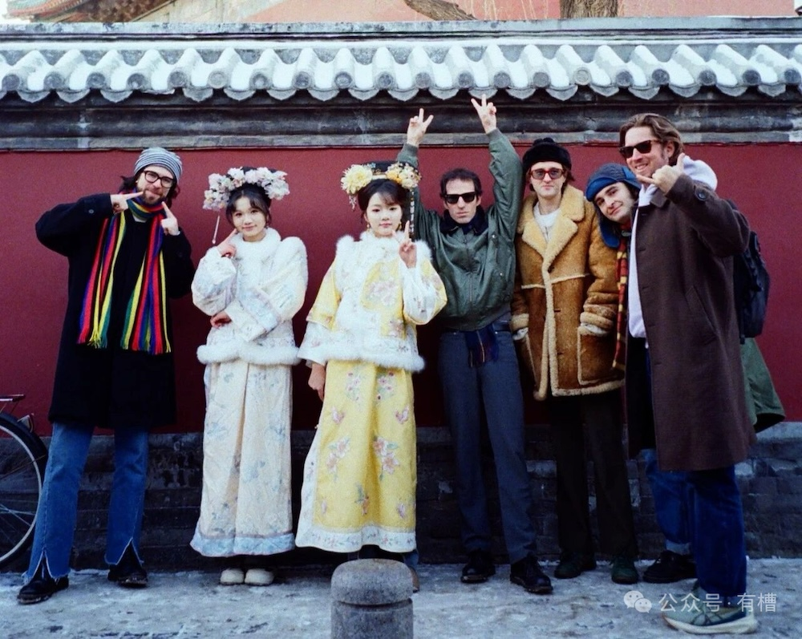

In a charming first-person piece for British magazine **The Guardian**, **Swim Deep** keyboardist and freelance writer James Balmont explores why mid-level British indie bands are finding massive, passionate audiences in China. Swim Deep's biggest UK festival show drew `500` people — months later they played to `10,000` at Guangzhou's **Strawberry Music Festival**, enjoying VIP treatment, luxury hotels, and fervent fan adoration. He attributes this boom to China's growing appetite for grassroots British indie music, post-pandemic cultural openness, and easier visa access for UK artists. The cultural connections are wonderfully random — **Sea Power** broke through via the video game Disco Elysium, **The KVB** were told they resemble Chinese soap opera characters, and **Galway's NewDad** went viral on Rednote for their album art. 

**The BRIT Awards** — Britain's biggest annual music ceremony, the UK's answer to the **Grammys** — made history on February 28, 2026, leaving London for the first time in its 46-year existence, setting up at Manchester's Co-op Live arena. **Olivia Dean** dominated the night, sweeping four awards — Album of the Year for *The Art of Loving*, Artist of the Year, Pop Act, and Song of the Year for her Sam Fender collaboration "Rein Me In". **Wolf Alice** won Group of the Year, **Lola Young** took Breakthrough Artist, and **Rosalía** became the first Spanish-language artist to win International Artist. **Rosé** and **Bruno Mars**' "APT." made history as the first K-pop win at the BRITs. **Ozzy Osbourne** received a posthumous Lifetime Achievement Award with a tribute performance from **Robbie Williams**, and **Harry Styles** made his first public performance in three years. 

## Sports

[Marathon] At the **2026 Osaka Marathon**, 23-year-old **Hibiki Yoshida** delivered one of the most thrilling marathon debuts in recent memory. The former **Hakone Ekiden** star surged ahead of pacemakers before 8km, pushing projected finish times deep into `2:03` territory — a staggering pace for a first-timer targeting the Japanese national record of `2:04`. He passed halfway in 1:02:39 with stunning composure, but the marathon's brutality struck after 25km. Compounding his troubles, he missed four of his first five drink bottles, and dehydration took its toll. He crossed the line in 2:09:33. This audacious feat is almost unheard of in marathons. In an era of cautious pacing and calculated splits, Yoshida threw the playbook out the window and delivered a pure tour de force — all guts, no fear, and the kind of reckless brilliance that makes legends.

[Ice Hockey] At the **2026 Milano Cortina Winter Olympics**, Team USA captured its first men's ice hockey gold medal in `46` years, ending a drought stretching back to the legendary 1980 "Miracle on Ice" — when a scrappy squad of American college players stunned the four-time defending gold medalist Soviet Union 4–3 at the height of the Cold War, in what **Sports Illustrated** voted the greatest sports moment of the 20th century. This time, the miracle came courtesy of NHL stars. Jack Hughes scored one of the most dramatic goals in Olympic hockey history, netting the winner 1:41 into overtime to give the U.S. a 2-1 victory over Canada. Connor Hellebuyck was sensational in net, making 41 saves, including stopping all 14 shots he faced in the third period to force overtime. Remarkably, the U.S. also won gold in the women's tournament, beating Canada in overtime as well — a historic sweep that cemented American dominance on Olympic ice.

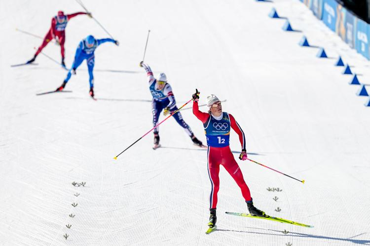

[Cross-Country Skiing] Norwegian cross-country skier **Johannes Høsflot Klæbo** made history at the **2026 Milano Cortina Winter Olympics** by becoming the first athlete to win six gold medals at a single Winter Games, sweeping every men's cross-country event he entered. His victory in the 50km mass start shattered the nearly 50-year record set by American speed skater Eric Heiden, who won five golds at the 1980 Lake Placid Olympics. The 29-year-old now holds `11` career Olympic gold medals — the most of any Winter Olympian in history — and trails only **Michael Phelps** (`23` golds) across all Olympic sports. His final race featured a Norwegian sweep of the podium, capping a dominant Games for Norway.

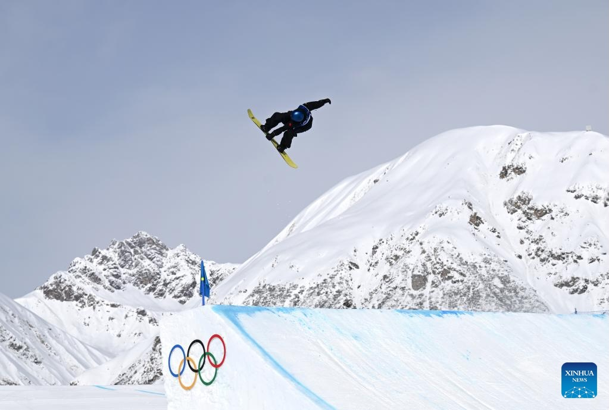

[Ski] Team China delivered its best-ever overseas Winter Olympics performance at **Milano Cortina 2026**, winning five golds, four silvers, and six bronzes — surpassing the previous record of 5-2-4 set at Vancouver 2010. Star freeskier **Eileen Gu** defended her halfpipe title and added two silver medals, becoming the most decorated freeskier in Olympic history. Snowboarder **Su Yiming** won slopestyle gold, while speed skater **Ning Zhongyan** upset favorite Jordan Stolz to claim the men's 1,500m with a new Olympic record. In a remarkable family story, five-time Olympian **Xu Mengtao** defended her women's aerials title, while her husband **Wang Xindi** won the men's event — a rare married couple both winning individual golds at the same Games.

[Soccer] **Der Klassiker**, Germany's premier soccer rivalry, pits Bayern Munich against Borussia Dortmund in a clash of titans that often shapes the **Bundesliga** title race. Known as the "German Clásico," it pits Bavaria's dominant powerhouse — famous for consistent supremacy, multiple Champions League triumphs, and stars like **Harry Kane** — against Dortmund's passionate, youth-driven "Yellow Wall" supporters. In a thrilling Der Klassiker on Saturday, **Bayern Munich** came from behind to beat **Borussia Dortmund** `3-2` at Signal Iduna Park, stretching their **Bundesliga** lead to a commanding `11` points. Nico Schlotterbeck headed Dortmund in front in the 26th minute, but Harry Kane leveled after halftime and then converted a penalty for his 30th league goal of the season. Just when Dortmund looked finished, Daniel Svensson's stunning volley made it 2-2. But the drama wasn't over — Joshua Kimmich sensationally volleyed home the winner in the 87th minute, breaking Dortmund hearts and all but sealing the title race for Vincent Kompany's side.

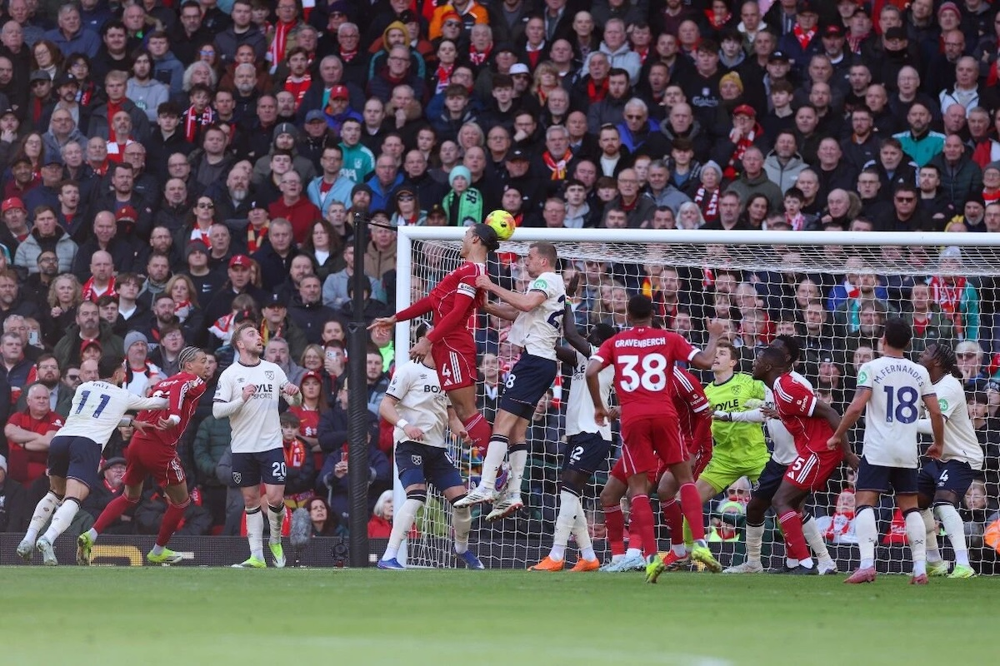

[Soccer] **Liverpool** thrashed **West Ham** `5-2` at Anfield on Saturday in a display that showcased a remarkable set-piece turnaround. Hugo Ekitike, Virgil van Dijk, and Alexis Mac Allister all scored from first-half corners, making Liverpool only the second team in Premier League history to net three set-piece goals in a single half. The result capped an extraordinary transformation: across their first 20 league matches, Liverpool scored just three set-piece goals — the fewest in the division. They have now scored nine in their past eight games, more than any competitor, making them the league's most prolific set-piece side in 2026. West Ham fought back through Souček and Castellanos, but Gakpo and a Disasi own goal sealed a vital win in Liverpool's push for Champions League qualification.

## This Day in History

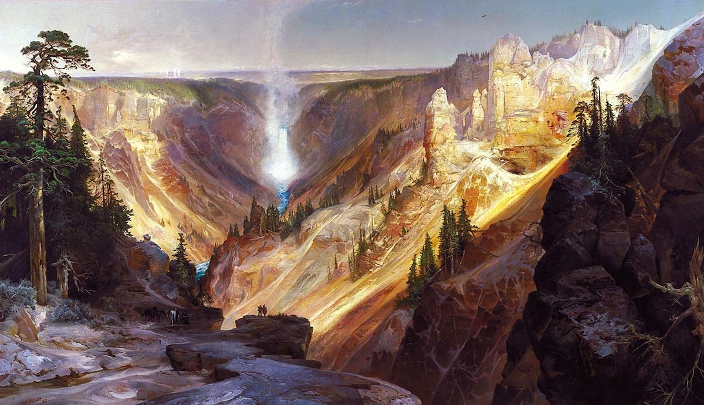

On **March 1, 1872**, US President **Ulysses S. Grant** did something no leader in history had ever done — he signed a law declaring that a piece of wild land belonged not to any person or company, but to everyone, forever. That land was **Yellowstone**, and it became the world's first national park. Two million acres of geysers, hot springs, grizzly bears, and bison, protected by law in an era when America was busy conquering its frontier, not preserving it. The idea was radical: nature has value beyond what you can dig out of it or build on top of it. Today, over `4,000` national parks exist worldwide across more than `100` countries — every single one traces its lineage back to that one audacious signature `154` years ago today.

## Art of the Week

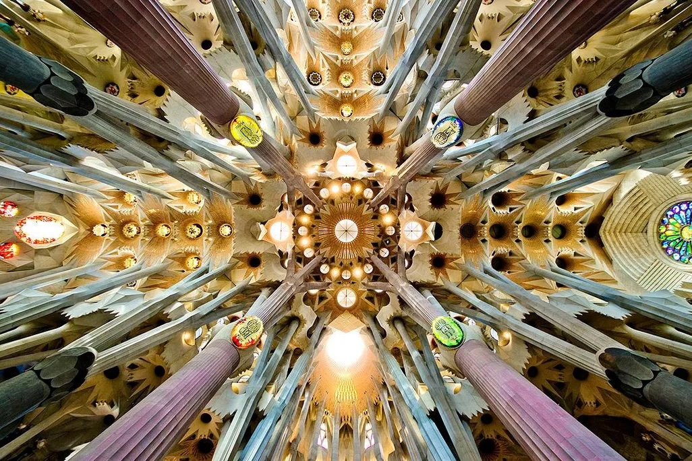

Spanish architect **Antoni Gaudí** spent 43 years of his life on a single building — the **Sagrada Família** in Barcelona — and died in 1926 knowing he would never see it finished. He didn't care. "My client is not in a hurry," he said, meaning God. Gaudí didn't design buildings the way other architects did. He studied trees, bones, and shells, then turned nature's geometry into stone. His columns branch like forests. His rooftops ripple like ocean waves. Nothing is straight because, as he put it, "the straight line belongs to man, the curved line belongs to God." A century after his death, his masterpiece was finally completed on February 20, 2026 — and it looks like nothing else on Earth, because Gaudí looked at the Earth itself for inspiration.

## Funny

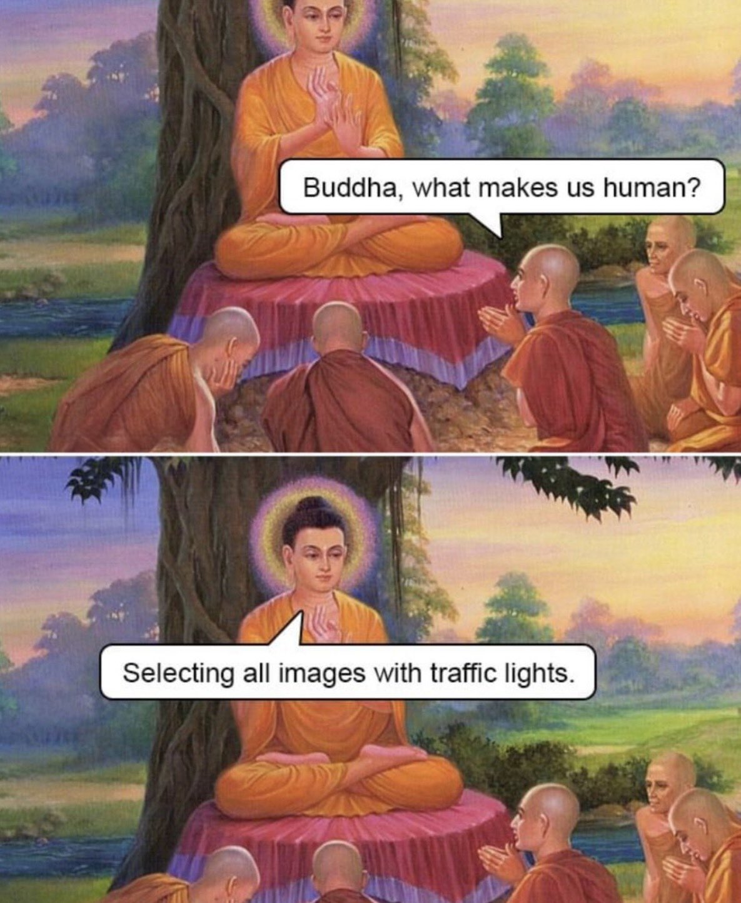

---

## Previous Issues

---

February 21, 2026, **[Celebrate the Year of the Fire Horse](https://weekly.sundayblender.com/p/celebrate-the-year-of-the-fire-horse)**

January 31, 2026, **[The Dawn of Machine-to-Machine Society](https://weekly.sundayblender.com/p/the-dawn-of-machine-to-machine-society)**

January 24, 2026, **[Destination: China - The Return of Western Rock Bands](https://weekly.sundayblender.com/p/destination-china-return-of-western-rock-bands)**

---

Thanks for reading! If you enjoy this newsletter, please share it with friends who might also find it interesting and refreshing, if not for themselves, at least for their kids.