## Editor's Words

My mother is a retired professor in translatology - the science of translation, interpreting, and localization. She has taught many students who have become English professors and teachers. 

Right before the Lunar New Year, she received a greeting letter from her university congratulating that the book she wrote many years ago, "Chinese to English Translation Course Guide", has been selected into the list of 38 national-level course guides for undergraduate study by the Ministry of Education of China. 

This is heart-warming, a great recognition for my mother's decades of work.

Though the timing is a bit ironic. Some universities have recently stopped teaching translatology. Translation was the first industry that got hit pretty hard when this wave of AI revolution arrived in late 2022 with the launch of chatGPT. Many in the industry think that machines can do translation better than humans. 

That would start an endless debate, but maybe a more practical question is, how can we use AI's power for translation to work for us? 

The Sunday Blender is one such experiment. Many interesting stories are discovered originally in Chinese news media, and I just asked Claude to draft an English write-up. 

Hope you enjoy this hybrid work of machine and man. You can forward this to another family with curious kids if you find it helpful. Thank you!

## Tech

**Apple** did something different this week — no keynote, no livestream. Instead, it rolled out products over several days, saving the star for last: the **MacBook Neo**, its most affordable laptop ever at `$599`. Powered by an iPhone chip and available in four fun colors, it's Apple's first real play at the budget market. The week also brought the **iPhone** 17e with an A19 chip, faster **MacBook Air** and Pro models, a refreshed **iPad Air**, and two new Studio Displays. Apple even accidentally leaked the MacBook Neo's name early — a rare slip for the famously secretive company.

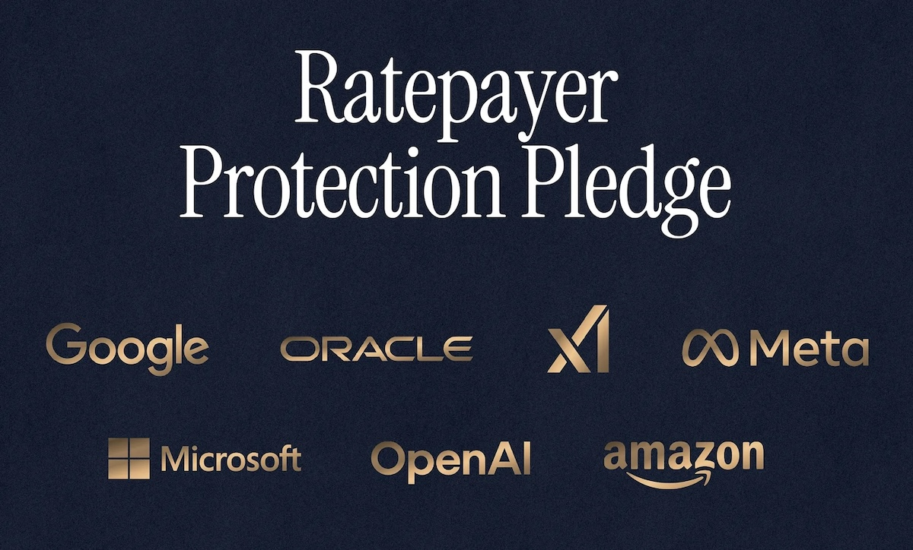

AI needs a lot of electricity — and people are starting to feel it in their power bills. On March 4, seven of the world's biggest tech companies — **Amazon**, **Google**, **Meta**, **Microsoft**, **OpenAI**, **Oracle**, and **xAI** — signed a "Ratepayer Protection Pledge" at the White House, promising to build or buy their own power supply for AI data centers instead of relying on local electricity grids. AI data centers currently consume about `4%` to `6%` of U.S. electricity but are projected to reach as high as `12%` by 2028. The race to secure power is already underway: Microsoft has signed a `$1.6` billion deal to restart a reactor at Three Mile Island, Meta locked in `1.1` gigawatts of nuclear power from Illinois, and Amazon is buying nearly `2` gigawatts from a Pennsylvania nuclear plant. One thing is becoming clear: the AI race isn't just about who builds the smartest model — it's about who can keep the lights on.

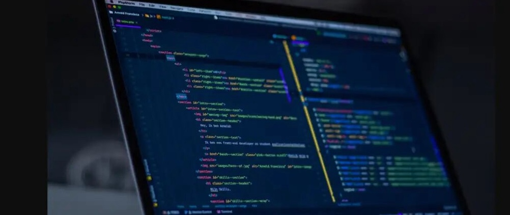

On March 2, **Anthropic**'s popular AI assistant **Claude** went down for nearly three hours, and something funny happened — millions of software engineers suddenly couldn't do their jobs. Many developers have become so used to AI helping them write code that when Claude disappeared, they were stuck. Social media filled with jokes about programmers forgetting how to code on their own. The outage was caused by "unprecedented demand" — too many people trying to use Claude at once after it shot to the top of the App Store. It was a reminder of how quickly we've come to depend on AI tools, and how lost we can feel when they're taken away — even for the people who build technology for a living.

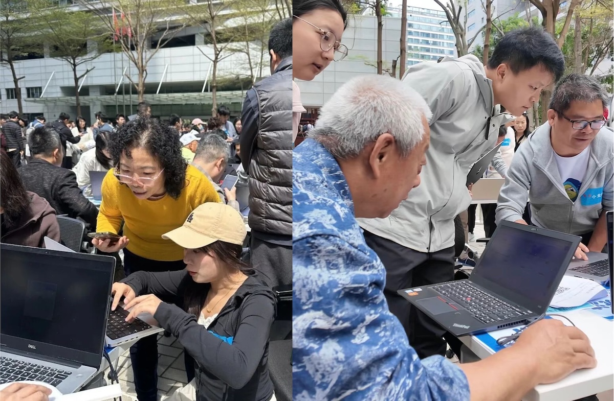

Just a year after China's **DeepSeek** shook up the American AI scene, the favor is being returned. **OpenClaw**, the open-source AI agent created by Austrian developer Peter Steinberger and recently acquired by **OpenAI**, has sparked an intense development frenzy across China's tech sector. Unlike chatbots that just talk, OpenClaw actually does things — managing emails, browsing the web, and automating tasks on your computer. Chinese AI companies like **MiniMax** and **Moonshot AI** are racing to offer their own cloud-based versions, a booming side hustle has emerged around on-site installation services charging `500` yuan a visit, and developer meetups in Beijing are drawing crowds of `300`. Could this be AI's iPhone 4 moment — the point where it stops being a novelty and starts becoming part of everyday life?

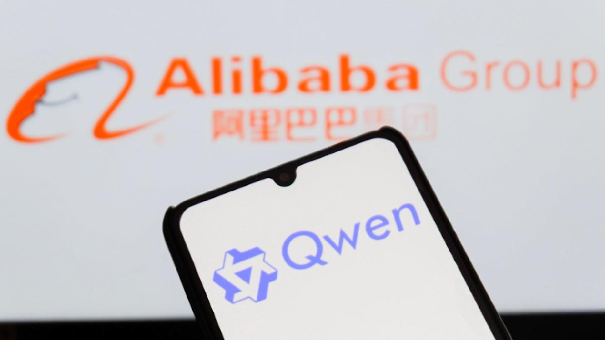

**Alibaba**'s **Qwen** team released its Qwen 3.5 model family in February and March 2026, and it immediately shook up the AI landscape. The small model series — spanning 0.8B, 2B, 4B, and 9B parameters — was designed from the ground up for efficiency rather than distilled from larger models, using a clever design that squeezes maximum intelligence out of minimal computing power. The 9B variant scored `70.1` on visual reasoning benchmarks, outperforming cloud-based models from **Google** and **OpenAI**. Community members reported the 2B model running smoothly on iPhones at `30–50` tokens per second. For a growing number of developers and hobbyists, running capable AI on personal devices is starting to feel like a real option.

## Global

The 350-kilometer railway connecting **Budapest** and **Belgrade** is set to fully open in March 2026, capping off a decade of planning and construction. The modernized line will cut travel time between the two capitals from a grueling eight hours to roughly three and a quarter hours, with trains reaching speeds of up to `200` km/h on the Serbian section. The project is a flagship piece of China's **Belt and Road Initiative**, designed to link the Chinese-operated Port of Piraeus in Greece with Central Europe. Freight traffic on the Hungarian section launched in late February, with passenger services expected to follow shortly after.

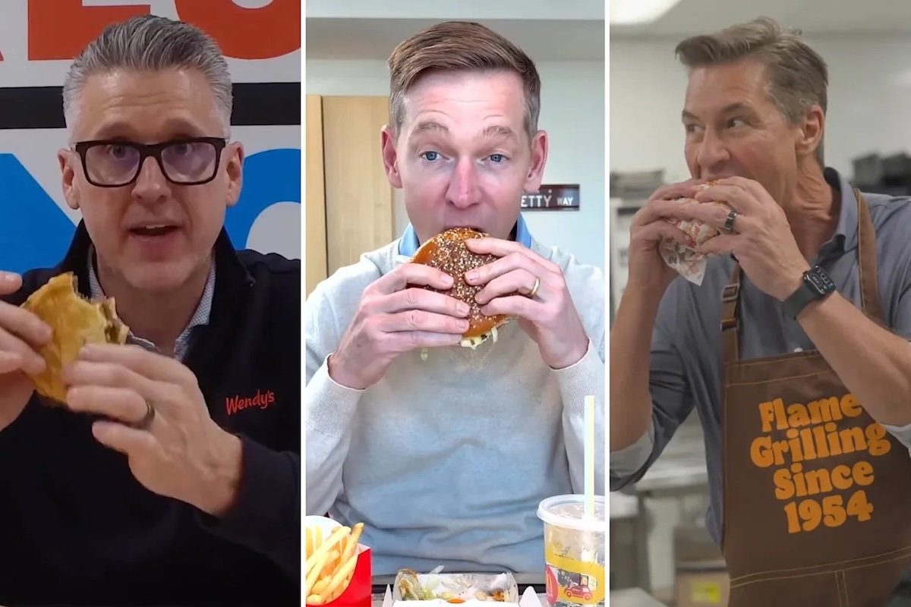

**McDonald**'s CEO Chris Kempczinski posted a video of himself tasting the chain's new Big Arch burger — and it backfired spectacularly. Speaking in monotone, he repeatedly called it a "product," and when he finally took a bite, it was tiny. The internet had a field day. **Burger King** then posted a clip of its president Tom Curtis, taking a massive bite out of a Whopper, wearing a "Flame Grilling Since 1954" apron and working the kitchen — a sharp contrast to Kempczinski's boardroom vibe. **Wendy**'s president then jumped in too, filming himself eating an entire burger. Who knew a single bite — or lack thereof — could start a fast-food war?

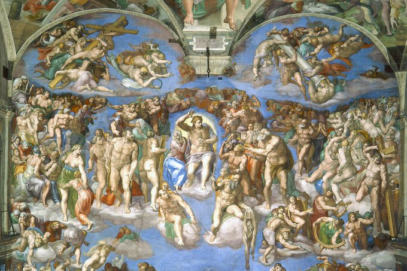

Between 1508 and 1512, Italian Renaissance master **Michelangelo** painted the ceiling of the **Sistine Chapel** in Vatican City, producing one of the most celebrated works of art in history. The ceiling features nine scenes from the **Book of Genesis**, including the iconic **Creation of Adam**. He later returned to paint the **Last Judgment** on the altar wall, completing it in 1541 — a dramatic scene depicting the second coming of Christ. But over the centuries, the millions who came to admire his work left something behind. Tiny particles from human perspiration reacted with the plaster walls, forming a white film that gradually dulled the fresco's vibrant colors. With five to six million visitors passing through each year, Vatican restorers are now carefully cleaning the buildup — using special paper and purified water to gently lift the residue away, revealing Michelangelo's original colors for the first time in 30 years. The work is expected to be completed by early April.

## Economy & Finance

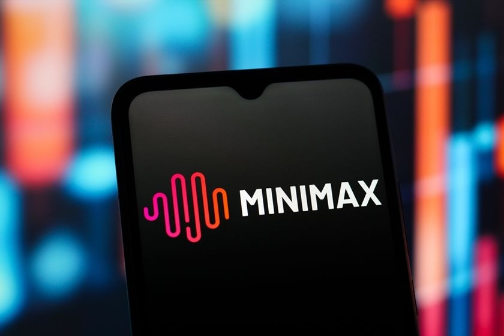

Shanghai-based **MiniMax** made history earlier this year as the largest IPO among AI foundation model companies when it listed on the **Hong Kong Stock Exchange** in January. On March 2, it released its first-ever earnings report — what analysts called "the AI industry's first open book." Revenue hit `$79` million in 2025, up `159%` year over year, with over `70%` coming from international markets. The company has served `236` million users across `200` countries. A four-year-old startup with just `428` employees, MiniMax's market cap now sits at around `HK$227` billion (~`$29` billion) — already approaching that of **Baidu**, a tech giant that took over two decades to build.

American payment technology company **Block** just reported strong fourth-quarter results, with gross profit up `24%` year over year. And yet, CEO **Jack Dorsey** cut more than `4,000` employees, nearly half its global workforce, taking it from over `10,000` down to just under `6,000`. This wasn't a panic move — it was a bet. Dorsey argued that AI tools and smaller, flatter teams are fundamentally changing how companies operate, and he chose to act now rather than make repeated rounds of cuts as the shift plays out. He went further, predicting most companies will eventually do the same. Whether he's right or premature, the message is clear: the age of agentic AI is rewriting how businesses think about headcount.

## Nature & Environment

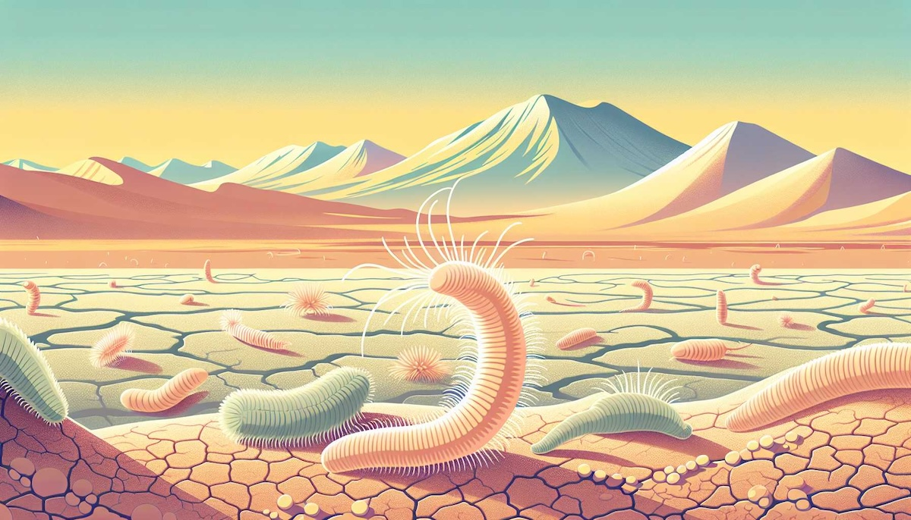

Chile's **Atacama Desert** is one of the driest places on Earth — so dry that **NASA** uses it to test its Mars rovers. But beneath its barren surface, life is thriving. An international team of scientists discovered surprisingly diverse communities of nematodes — tiny worms invisible to the naked eye — living in the desert's soil. The team collected hundreds of soil samples and found `36` different groups of nematodes across sand dunes, salt flats, mountain zones, and fog-fed oases. In the harshest zones, many of these worms reproduce without needing a mate — a clever survival trick. Even in the most extreme places, life finds a way.

## Science

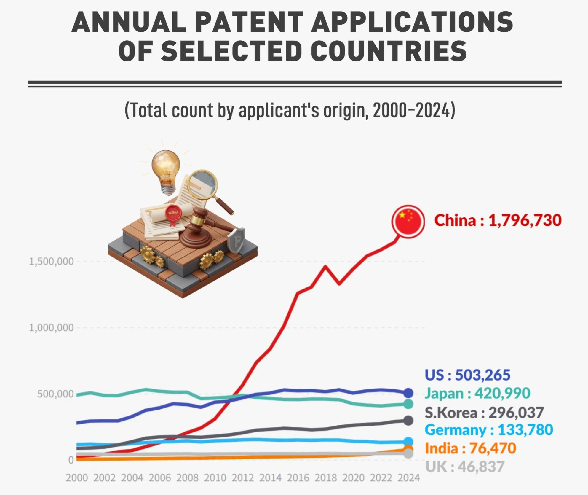

The **United Nations** released a report on Friday showing that international patent applications in digital communications and semiconductors surged in 2025, driven by the global rush to invest in artificial intelligence. **China** topped the world rankings with `73,718` filings, a `5.3%` increase from the year before, followed by the **United States**, **Japan**, **South Korea**, and **Germany**. Patents are like official claims on new inventions — when someone comes up with something new, they file a patent to protect the idea. U.S. patent filings continued to slide for the third straight year, while China's **Huawei** held its spot as the world's top corporate filer since 2017.

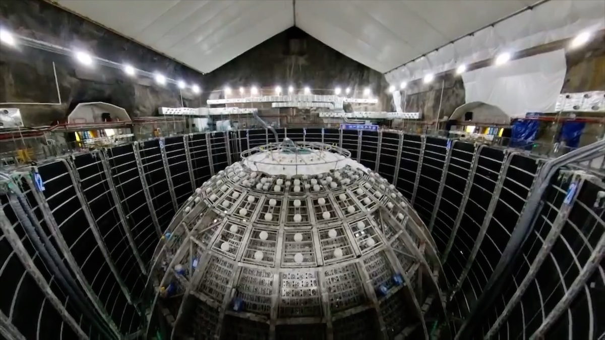

Deep beneath the hills of southern China, `700` meters underground, sits one of the most ambitious science experiments on Earth. The **Jiangmen Underground Neutrino Observatory** — or **JUNO** — is the world's largest transparent spherical detector, built to study neutrinos, tiny "ghost particles" that pass through everything, including you, by the trillions every second. The project cost around `2.7` billion yuan and brings together over `700` scientists from `74` institutions across `17` countries — with about `40%` of the team coming from outside China. In just 59 days of operation, JUNO measured two key properties of neutrinos with greater precision than the previous 50 years of experiments combined. It's a powerful reminder that the biggest questions about our universe can only be answered when countries work together.

## Lifestyle, Entertainment & Culture

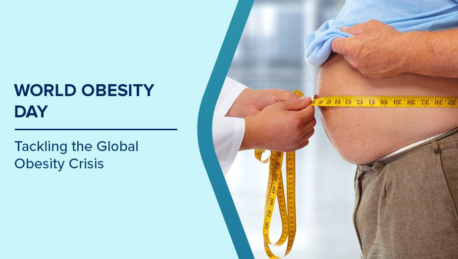

March 4 marked **World Obesity Day**, and this year's theme — "8 Billion Reasons to Act on Obesity" — hit close to home, especially for kids. Childhood obesity rates among school-aged children have surged from `4%` in 1975 to nearly `20%` in 2022, with the steepest rises in lower-income countries. By 2035, half the world's population — around 4 billion people — is projected to be living with overweight or obesity. Small habits make a big difference — drinking more water instead of sugary drinks, staying active for at least 30 minutes a day, eating more fruits and vegetables, and cutting back on screen time. Your body will thank you later.

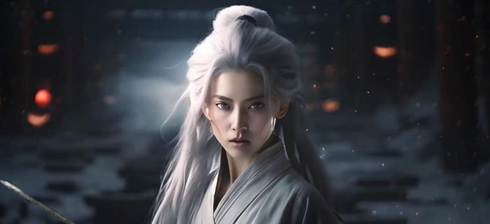

China's short drama industry hit new heights this Lunar New Year. During the Spring Festival window, short dramas racked up `8.67` billion views, with AI-generated comic dramas accounting for nearly `30%` of the total. Among those, AI "hyper-realistic" dramas — featuring lifelike digital actors instead of real ones — contributed over `80%` of AI comic drama views. One title, produced by a three-person team in just five days, crossed `200` million views in `29` hours. With production costs expected to drop from over a million yuan to as low as `100,000`, industry insiders are calling 2026 the breakout year for AI-generated dramas. 

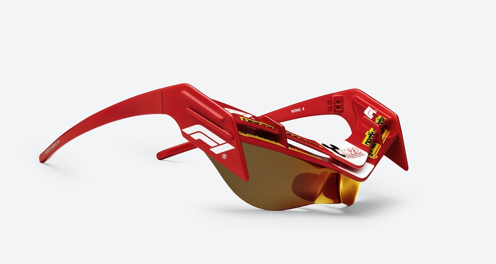

When Formula 1, Disney, and Korean eyewear brand **Gentle Monster** team up, you get something wild. The 2026 Circuit Collection features eight styles of sunglasses that reinterpret the structural language of racing cars through Gentle Monster's unique design lens. The standout **F1-Wing 4** takes its shape directly from the front wings and air ducts of an F1 car, with sharp wraparound frames that look like they belong on the starting grid. Three of the eight designs are inspired by Disney's Mickey and Friends, blending playfulness with full-throttle mechanical energy. Pop-ups in Seoul and Shanghai will feature a monumental Mickey Mouse sculpture standing next to an actual F1 car. Racing aesthetics have never looked this cool off the track.

## Sports

[NBA] **LeBron James** added another chapter to his legendary career on Thursday, March 6, 2025, surpassing **Kareem Abdul-Jabbar** for the most field goals made in NBA history. James hit a turnaround 12-foot jumper over Denver's Zeke Nnaji with 12 seconds left in the first quarter, giving him `15,838` career field goals. Abdul-Jabbar had held the record since retiring in 1989 — nearly `37` years. The milestone came during his remarkable `23rd` season in the league. James already holds the all-time scoring record, having passed Abdul-Jabbar for that mark back in February 2023. The record-breaking night was bittersweet, though — the Lakers still lost `120-113` to the Nuggets, with James also leaving the game with a sore left elbow.

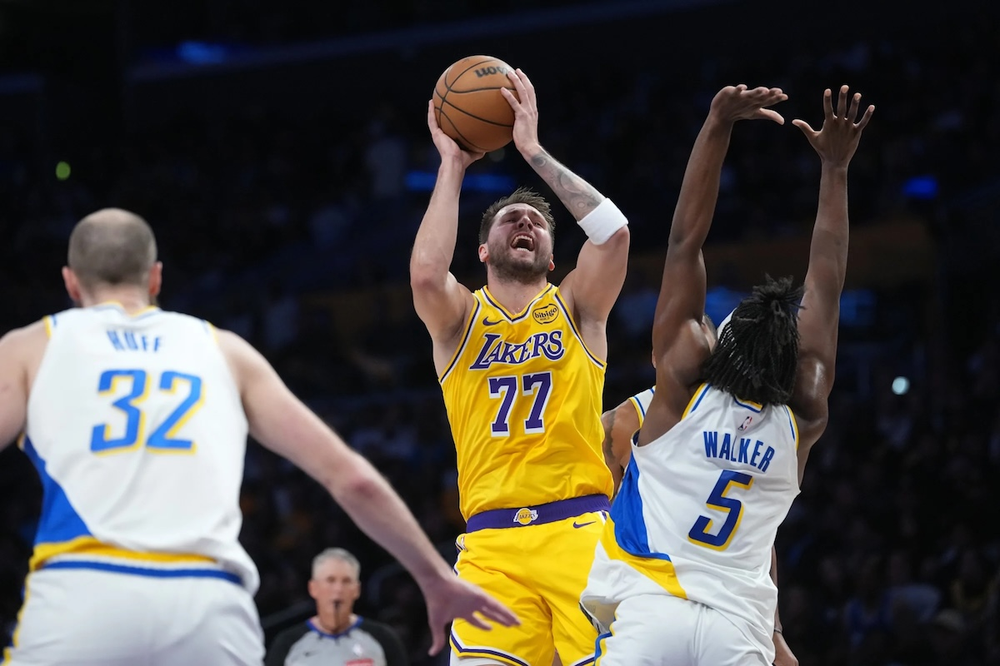

[NBA] **Luka Doncic** put on an absolute masterclass Friday night, erupting for `44` points, `9` rebounds, and `5` assists in just three quarters as the Lakers cruised past the **Pacers** `128–117`. He drilled seven three-pointers on `14-of-25` shooting before sitting out the entire fourth quarter. With LeBron James resting, Doncic carried the offensive load from the jump, and the performance marked his `10th` 40-point game of the season — making him only the fourth Laker to reach that milestone, joining **Kobe Bryant**, **Elgin Baylor**, and **Jerry West**. He also leads the NBA in 40-point games this season, surpassing **Anthony Edwards**. Doncic is playing at a level this season that puts him in the company of legends — and he's making it look effortless.

[Soccer] **Barcelona** came agonizingly close to pulling off a miracle. Trailing 4-0 from the first leg of their **Copa del Rey** semi-final against **Atletico Madrid**, Barça stormed out at Camp Nou and delivered one of their best performances of the season. 18-year-old Marc Bernal scored twice and Raphinha converted a penalty to make it 3-0 on the night — just one goal short of forcing extra time. Atletico goalkeeper Juan Musso made several crucial saves, and Lamine Yamal curled a late strike just past the far post in the dying seconds. Atletico held on to advance `4-3` on aggregate, reaching the Copa del Rey final for the first time in 13 years.

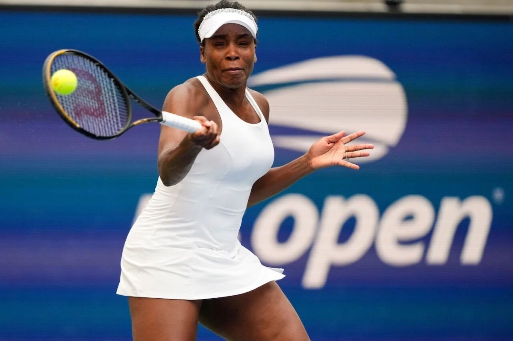

[Tennis] **Venus Williams** is one of the greatest tennis players of all time. Together with her younger sister Serena, the two dominated women's tennis for over two decades, winning a combined `30` Grand Slam singles titles. Now `45`, Venus never officially retired — but she took a 16-month break due to health issues before returning to the tour last July, where she won her comeback match in Washington D.C. Since that lone win, however, things have been rough. Her first-round loss at **Indian Wells** this week extended her losing streak to eight consecutive matches. In 2026, she's `0-5`, falling in the opening round at every tournament entered. At 45, with nothing left to prove, Venus Williams keeps showing up, just for the love of the game.

## This Day in History

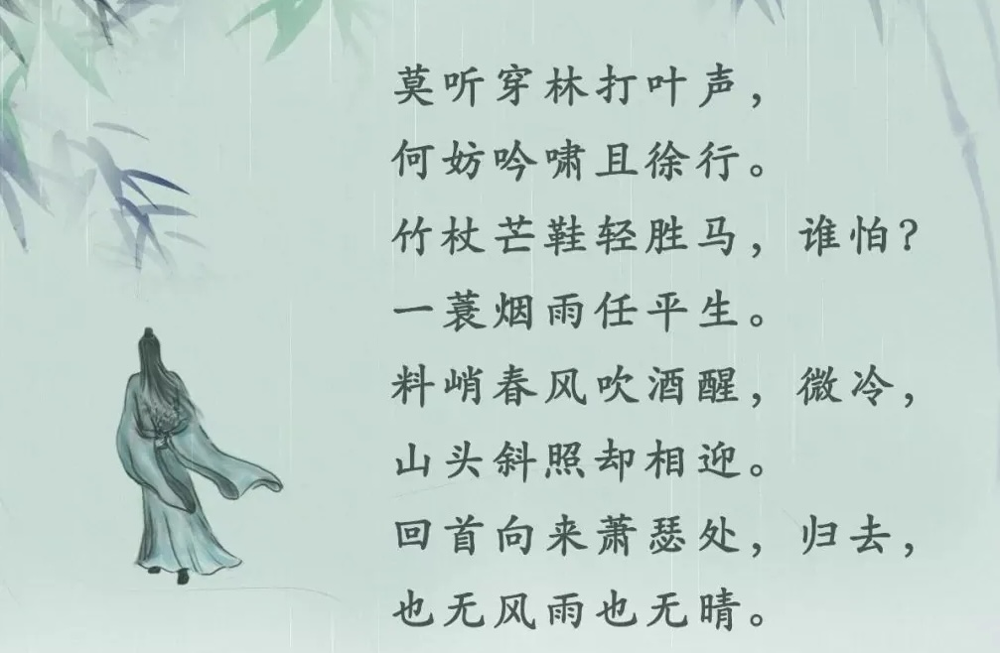

On **March 7, 1082**, the famous Chinese poet **Su Dongpo** was out walking with friends when a sudden rainstorm hit. Everyone panicked — but not Su Dongpo. He strolled calmly through the rain, singing and tapping his bamboo walking stick. When the sun came out, he wrote a poem called "**Calming Wind and Waves**" (定风波), about how rain and sunshine are really no different — what matters is how you face the storm. At the time, Su Dongpo was living in exile after being punished for criticizing the government through his poetry. He was so poor he divided his savings into daily portions hung on a string. Yet he found joy in simple things — farming, cooking, and writing some of China's greatest poems. Nearly a thousand years later, his words still inspire millions across Asia. The image of Su Dongpo smiling in the rain has been painted again and again by artists through the centuries, and the poem is memorized by schoolchildren across China to this day. His message? Don't let life's storms get you down.

## Art of the Week

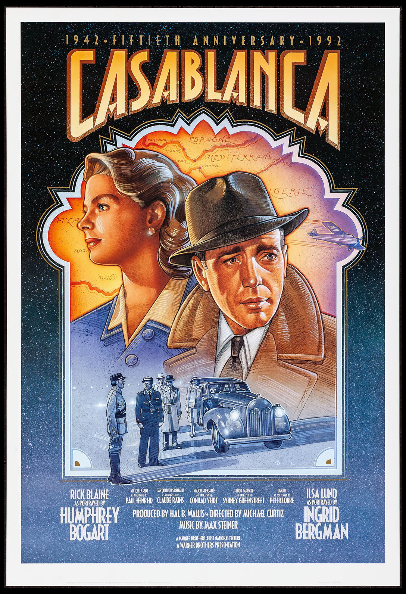

Widely regarded as one of the greatest films ever made, **Casablanca** is set during World War II in the Moroccan port city of Casablanca — a real-life crossroads where refugees fleeing Nazi-occupied Europe gathered, hoping to secure passage to freedom in the Americas. It's in this desperate, uncertain setting that Rick, an American café owner played by **Humphrey Bogart**, reunites with Ilsa, played by **Ingrid Bergman**. What unfolds is a story about sacrifice, doing the right thing, and putting something bigger than yourself ahead of your own happiness. The black-and-white cinematography, iconic music, unforgettable dialogue, and a supporting cast that included actual war refugees give the film an emotional weight that still hits hard — so much so that in some cities, watching it on Valentine's Day has become a tradition.

## Funny

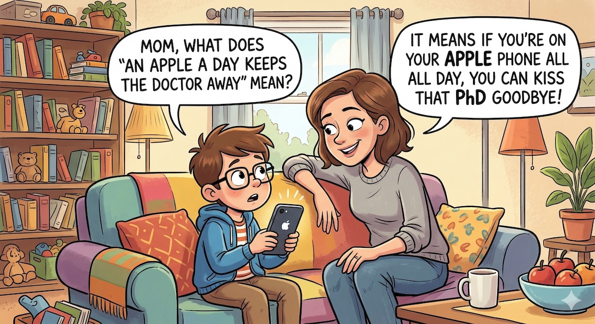

**Kid**: Mom, what does "an apple a day keeps the doctor away" mean?

**Mom**: It means if you're on your Apple phone all day, you can kiss that PhD goodbye.

---

## Previous Issues

---

March 01, 2026, **[The Making of a Hero](https://weekly.sundayblender.com/p/the-making-of-a-hero)**

February 21, 2026, **[Celebrate the Year of the Fire Horse](https://weekly.sundayblender.com/p/celebrate-the-year-of-the-fire-horse)**

January 31, 2026, **[The Dawn of Machine-to-Machine Society](https://weekly.sundayblender.com/p/the-dawn-of-machine-to-machine-society)**

---

Thanks for reading! If you enjoy this newsletter, please share it with friends who might also find it interesting and refreshing, if not for themselves, at least for their kids.

