## Editor's Words

On Friday afternoon, I was driving to Qiantan, Shanghai to drop off my boy to a STEAM class. I don't drive often. It felt good to take a ride out every now and then.

AMAP, the leading map service in China owned by tech giant Alibaba, gave me the usual directions from my iPhone in the Tesla. It was doing the usual "please turn right at the next junction" or "please keep going straight on this road for the next 1.2 km", etc.

Then, suddenly and subtly, it said:

"According to your **usual driving behavior**, you might want to take the second lane on the right ...".

I was like, what?! How.do.you.know.THAT?

Obviously, now I think about it, this is pretty easy for Alibaba to do - it can record all my driving activities, including which lane I usually take and give me tailor-made advice.

But honestly, I wish it didn't do that. The machine knows too much about me.

The trend is going the other way though. Kimi just became an $18 billion unicorn in record time, thanks to the worldwide phenomenon of OpenClaw, which allows everyone to delegate many daily tasks to AI agents, by giving intimate personal information to the machine. OpenClaw meetups or bonanza are spreading to major tech hub cities in China.

Are we going too far? 

## Tech

**Nvidia** is committing `$26` billion over the next five years to build open-weight AI models — the largest investment in open-source AI development in history. Confirmed via **SEC** filings and reported by **Wired**, the move transforms the GPU giant from a pure chipmaker into a frontier AI lab. The timing is strategic: Chinese labs like **DeepSeek** and **Alibaba**'s Qwen have dominated the open-model landscape while major U.S. players keep their best models proprietary. Nvidia has already released **Nemotron** 3 Super, a 128-billion-parameter model optimized for its hardware. America is back in the open-source AI race — and Jensen Huang is writing the check.

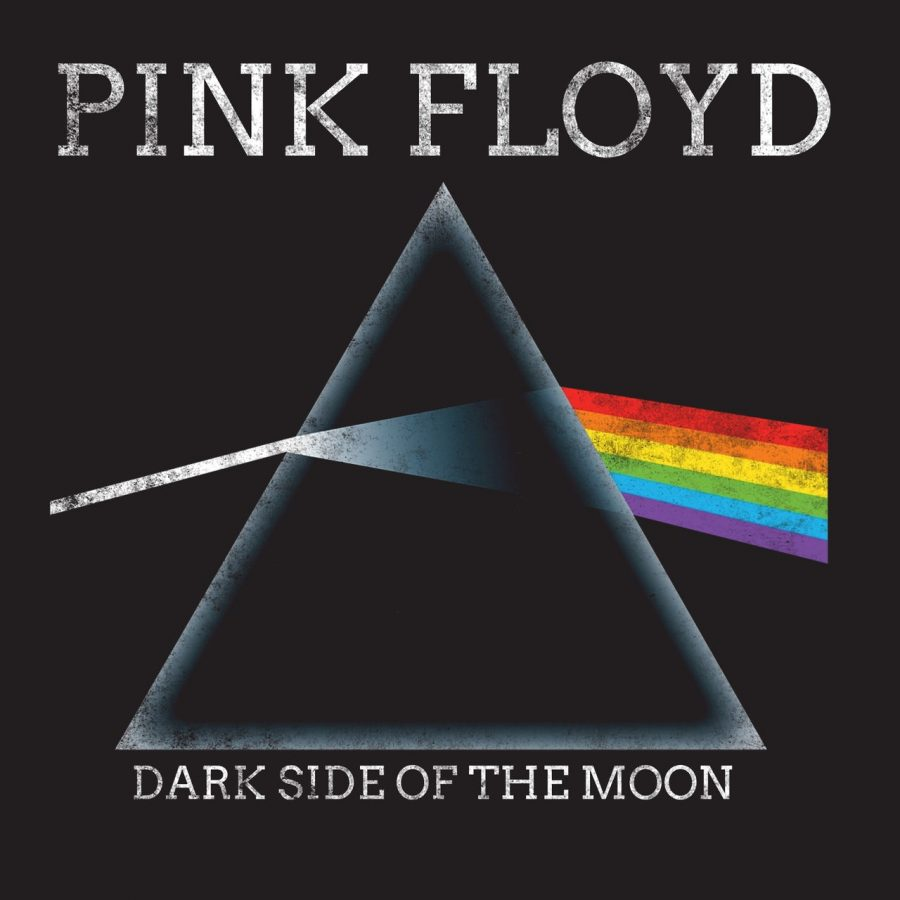

Beijing-based **Moonshot AI**, the Chinese AI foundation model company behind the open-source **Kimi** large language models, has become the fastest Chinese company ever to reach decacorn status — a valuation exceeding `$10` billion — achieving the milestone in roughly two years, outpacing even **ByteDance** and **Pinduoduo**. And it's not stopping there: the company is now seeking up to `$1` billion in an expanded funding round that would value it at approximately `$18` billion, more than quadrupling its valuation in just three months. **Alibaba** and **Tencent** are among the backers fueling the frenzy. The explosive growth was driven by the launch of **Kimi Claw**, powered by the K2.5 model — after which Moonshot's monthly sales exceeded its total revenue for all of 2025. Founded in March 2023 by former Tsinghua professor **Yang Zhilin**, the company's name was inspired by rock band **Pink Floyd**'s **The Dark Side of the Moon** — Yang's favorite album. From `$300` million seed valuation to `$18` billion in under three years: Moonshot is rewriting the rules of AI fundraising.

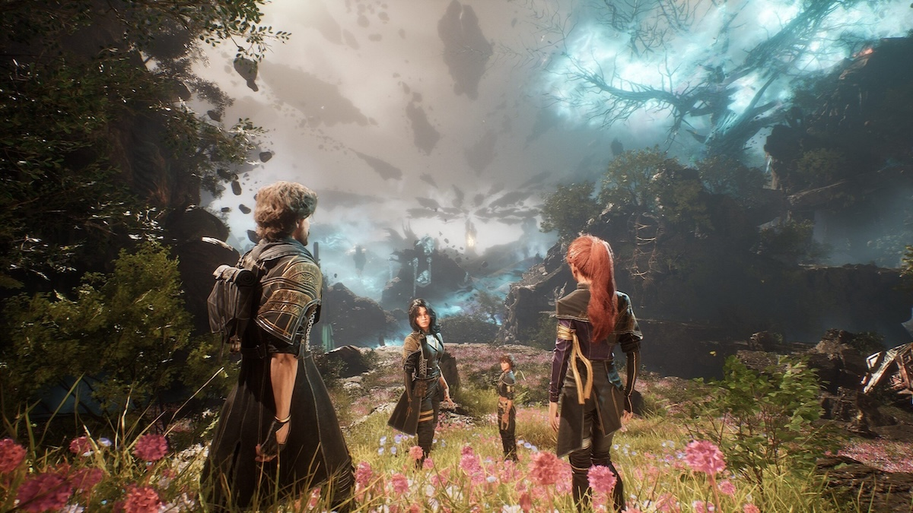

The gaming world's biggest developer gathering, **GDC (Game Developer Conference)**, took place in San Francisco from March 9-13. **Clair Obscur: Expedition 33**, a dark fantasy RPG from small French studio **Sandfall Interactive**, dominated the Game Developers Choice Awards with five wins including **Game of the Year**, Best Debut, Best Visual Art, Best Narrative, and Best Audio. The game is a loving evolution of the classic Japanese RPG genre with a distinctly French-inspired aesthetic — proof that a tiny debut studio can outshine industry giants. Meanwhile, **NVIDIA** and **CD PROJEKT RED** announced a collaboration to integrate a new RTX Mega Geometry foliage system into the massively anticipated **The Witcher 4**, promising path-traced environments with millions of detailed plants and trees — a glimpse of how next-gen games will look.

## Global

Every spring, millions of people across India and around the world celebrate **Holi** — the Hindu Festival of Colours. This year it fell on **March 3-4**. Friends, families, and complete strangers take to the streets to throw brightly colored powders and splash colored water at each other in a joyful, messy, rainbow-hued free-for-all. Nobody is spared — not your neighbor, not your teacher, not even your grandma. The festival celebrates the arrival of spring and the triumph of good over evil. During Holi, differences in age and background melt away as everyone becomes equally drenched in pink, purple, yellow, and green. If you ever get the chance to experience it, wear white — it won't stay white for long.

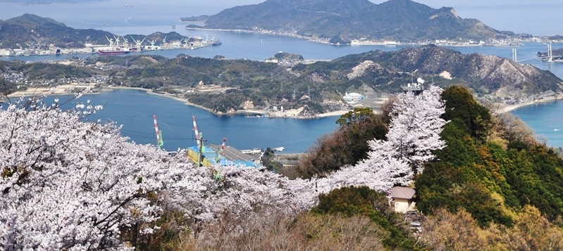

Imagine cycling across the sea on a 70-kilometer path that hops between six islands, crossing soaring suspension bridges with the sparkling **Seto Inland Sea** stretching out below you. That's the **Shimanami Kaido** — Japan's most famous cycling route, connecting Onomichi in Hiroshima Prefecture to Imabari in Ehime Prefecture. And right now is the perfect time to ride it: cherry blossoms typically bloom along the route in late March to early April, lining the island roads and bridge approaches in soft pink. The entire path is marked with a blue line painted on the road, so you literally just follow it — no getting lost. Along the way, expect fishing villages, citrus groves, fresh seafood lunches, and views that will make you forget to pedal.

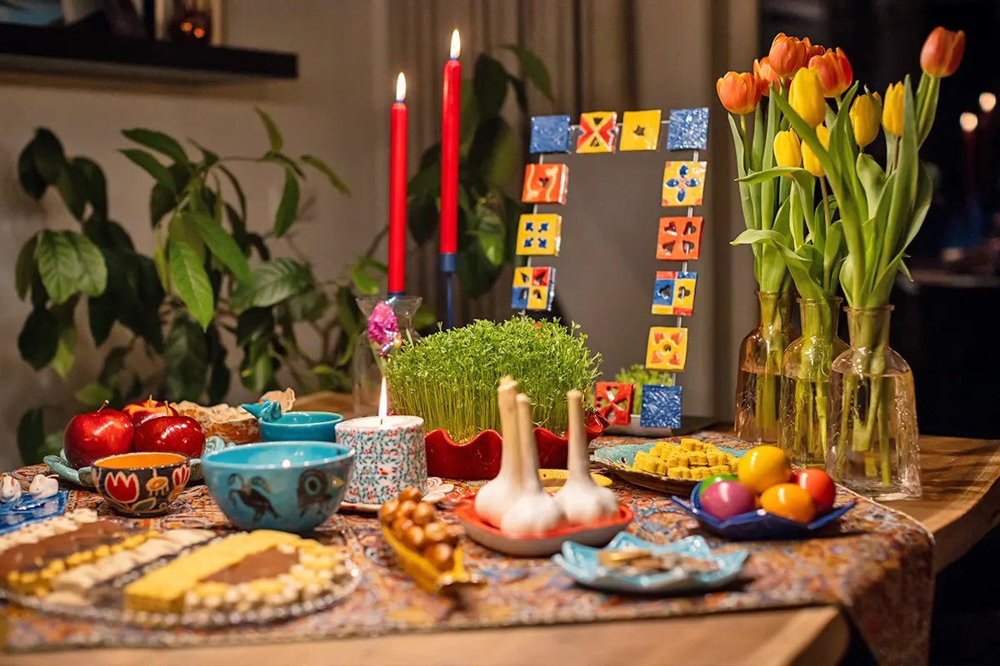

On March 20, over 300 million people worldwide will celebrate **Nowruz** — the Persian New Year marking the first day of spring. With roots stretching back over `3,000` years to ancient Persia, it's one of the oldest celebrations in human history. Nowruz is the biggest holiday of the year in Iran — but it's also widely celebrated across Afghanistan, Central Asia, Kurdistan, Turkey, and Persian-speaking communities on every continent. Families set a special "Haft-Seen" table with seven symbolic items that all start with the letter "S" in Persian — including sprouted wheatgrass for rebirth, garlic for health, and vinegar for patience. Kids jump over bonfires in the days before Nowruz to symbolize leaving the old year's darkness behind. The holiday ends thirteen days later with "Sizdah Bedar" — Nature Day — when the entire country heads outdoors for a massive nationwide picnic.

## Economy & Finance

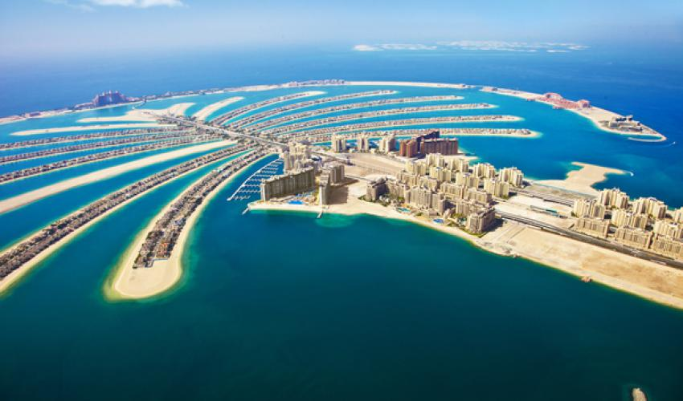

**Dubai**'s real estate market has been hammered by the US-Israeli-Iran war, with the DFM (Dubai Financial Market) Real Estate Index plunging roughly `30%` since February 28 — falling from `16,140` to around `11,500`, its lowest level since April 2025. The index had delivered extraordinary gains — `63%` in 2024, `38%` in 2023 — before war erased all 2025 and 2026 gains in just two weeks. Iranian retaliatory strikes hit UAE soil, damaging landmarks including the **Burj Al Arab** and **Fairmont The Palm**, shattering Dubai's "safe haven" image. Industry insiders insist long-term fundamentals remain intact, but the psychological blow to investor confidence is undeniable. A seismic moment for the Gulf's hottest property market.

## Nature & Environment

A rare mountain lion standoff in **San Francisco** ended peacefully on January 27, after a 30-hour search involving multiple city and state agencies. The 77-pound, two-year-old male was spotted roaming the wealthy Pacific Heights neighborhood near **Lafayette Park**, prompting emergency alerts and temporary closures of the park and a nearby school. Officials eventually found the cat hiding in a courtyard between two apartment buildings on California Street, where it was tranquilized and safely caged. The cougar was later released into the Santa Cruz Mountains, fitted with a GPS tracking collar. Experts say young mountain lions increasingly wander into the city after separating from their mothers, as shrinking habitat on the peninsula pushes them northward.

Every winter, hundreds of thousands of flamingos fly from Siberia and Central Asia to **Sambhar Lake** in **Rajasthan**, turning India's largest inland salt lake into a spectacular sea of pink. The birds feed on algae in the shallow, salty water — the same algae that gives flamingos their famous pink color. A January 2025 census counted over `100,000` migratory birds at the lake, a massive jump from just 7,000 the year before. Sambhar sits along the **Central Asian Flyway** — one of the world's great bird migration highways. From October to March, so many flamingos pack the lake that it earns the nickname "India's Pink Lake" — visible from satellite images, the sheer density of pink turning an entire landscape into something that looks more like another planet than Rajasthan.

## Science

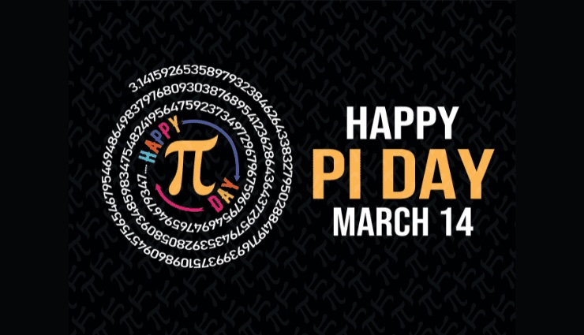

**March 14** (3/14) is **Pi Day** — a celebration of π, the number that begins 3.14159... and never ends. Pi is the ratio of a circle's circumference to its diameter, meaning every circle in the universe — from a pizza to a planet's orbit — follows this exact same number. First calculated by the ancient Greek mathematician **Archimedes** over 2,000 years ago, it has since been computed to over `100 trillion` digits without ever finding a pattern or an end. People celebrate by eating pie, holding digit-memorizing competitions, and geeking out over math. The world record for reciting pi from memory? `70,000` digits by India's Rajveer Meena in 2015 — that took nearly `10` hours.

## Lifestyle, Entertainment & Culture

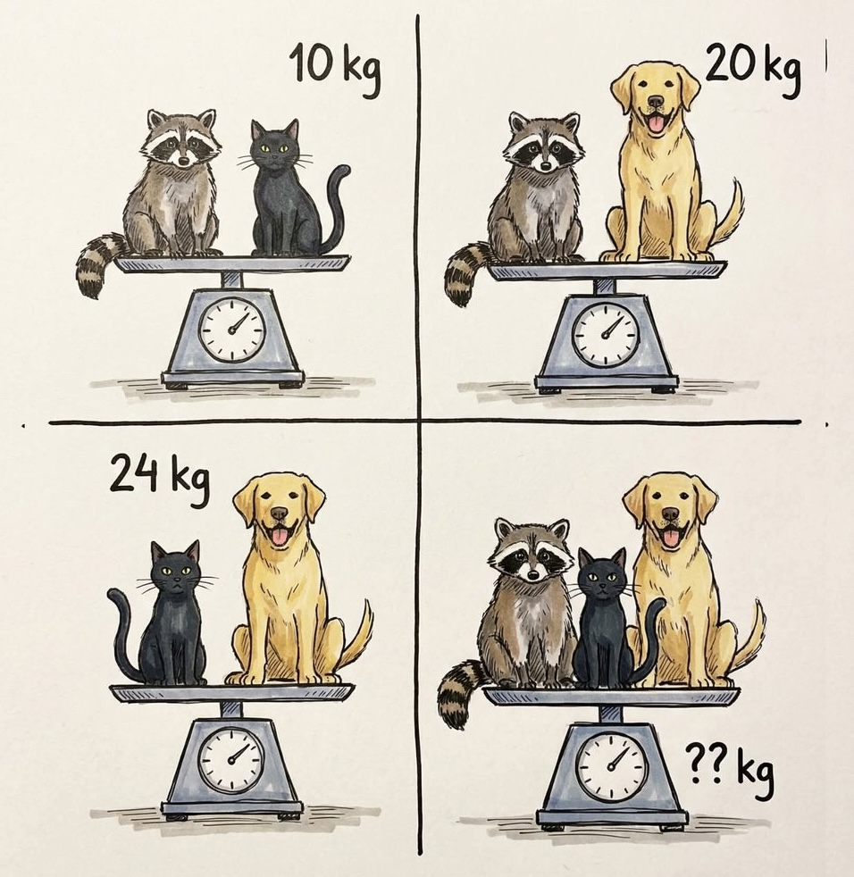

What is the total weight in the last picture? 

When conductor Teodor Currentzis cancelled his March 5–7 Rome concerts due to illness, pianist **Yuja Wang** (王羽佳) seized the moment — transforming a scheduling crisis into a landmark event. Returning to the **Accademia Nazionale di Santa Cecilia** after a nine-year absence, Wang performed double duty: playing Barber's Piano Concerto under substitute conductor Eric Jacobsen in the first half, then assuming the dual role of soloist and conductor for Prokofiev's ferociously difficult Piano Concerto No. 2. Directing the orchestra from the keyboard in one of the repertoire's most punishing scores, Wang delivered three nights of what Italian critics called a potentially legendary event.

**Tencent**'s tactical shooter **Delta Force**, developed by its Team Jade studio, has exploded into one of China's biggest games ever. The game recently hit `30 million` daily active players in China alone, rivaling global giants like **Call of Duty** and **Battlefield**. Players have spent over `$300` million on the mobile version in just five months. Tencent has now launched a 24-team esports Pro League featuring China's top gaming organizations, with a World Cup planned for later this year. The game's success has prompted a major strategic shift at Tencent, with executives seeing a change in Chinese gamer tastes from mobile-first casual gaming toward PC and shooters — a category long dominated by Western studios. Delta Force may be the first Chinese-made shooter to seriously challenge that order.

## Sports

[Racing] **Kimi Antonelli**, the 19-year-old Italian sensation, claimed his first ever Formula 1 victory at the **Chinese Grand Prix** in Shanghai, becoming the second youngest race winner in the sport's history — only **Max Verstappen** was younger when he first won. After becoming the youngest ever pole-sitter on Saturday — breaking **Sebastian Vettel**'s 2008 record — Antonelli briefly lost the lead to **Lewis Hamilton** at the start but retook it before the end of lap two and was never headed again, finishing `5.5` seconds clear of teammate **George Russell**. He is also the first Italian to win an F1 race since Giancarlo Fisichella at the 2006 Malaysian Grand Prix — a twenty-year wait for the country that gave the world **Ferrari**. Hamilton completed the podium, taking his first Grand Prix rostrum for Ferrari. Antonelli only passed his regular driving test six weeks before his F1 debut, and **Mercedes** gave him a road car he can't legally drive in Italy because it's too powerful for new licence holders. Though he can win at `350km/h`, he can't drive himself home. Mercedes now hold a commanding 1-2 in the championship after just two races. A star is born.

[Rugby] **The Six Nations Championship** — Europe's premier annual rugby union tournament featuring England, France, Ireland, Italy, Scotland, and Wales — delivered high drama on its Super Saturday finale. **Wales** ended a 15-match losing streak spanning `1,099` days with a commanding `31-17` victory over **Italy** at Cardiff's Principality Stadium. The tournament, contested every spring since 2000 in its current six-team format (and dating back to `1883` as the Home Nations), remains one of rugby's most storied competitions. Aaron Wainwright starred with two tries as Wales built an insurmountable 31-0 lead before Italy's late consolation scores. A cathartic day for Welsh rugby.

[NCAA] Fourth-seeded **Dayton** pulled off a stunning `70-69` upset of top-seeded **Saint Louis** in the Atlantic 10 Tournament semifinal at PPG Paints Arena in Pittsburgh, delivering one of the wildest finishes of Championship Week. Three lead changes in the final `11` seconds told the story: Jacob Conner drilled a deep three to put Dayton ahead 68-66, then A-10 Player of the Year Robbie Avila answered with a clutch three of his own to reclaim the lead 69-68 for the Billikens (Saint Louis' mascot) with 6.6 seconds left. On the final play, Jordan Derkack drove to the rim but his layup fell short — only for Amaël L'Etang to tip in the putback with 0.6 seconds remaining, sealing a 70-69 Dayton win. Pure March Madness.

[NBA] **Miami Heat** center **Bam Adebayo** scored `83` points against the Washington Wizards on March 10, surpassing **Kobe Bryant**'s `81` for the second-highest single-game total in NBA history behind **Wilt Chamberlain**'s `100` - both considered impossible to break. But the achievement sparked fierce debate. Adebayo's `43` free-throw attempts set an all-time NBA record, and the Heat intentionally fouled the Wizards multiple times late in a blowout to create extra possessions. Adding to the controversy: Adebayo averages just `20.0` points per game this season — a solid center known more for defense and rebounding than elite scoring. For many fans, the spectacle encapsulates everything wrong with today's NBA: a foul-baiting, free-throw-laden stat chase replacing the beautiful, flow-driven basketball that made legends like Kobe transcendent. When records are engineered rather than earned, the game loses a little of its soul.

[NBA] **Oklahoma City Thunder** star **Shai Gilgeous-Alexander ("SGA")** broke a record held by **Wilt Chamberlain** for over six decades, scoring 20+ points for his `127th` consecutive game in a `104-102` win over **Boston Celtics** on March 13. Yet even on his historic night, the controversy followed. Celtics star Jaylen Brown shouted "That's not basketball!" after a foul call on SGA, and the reigning MVP has faced constant "free-throw merchant" chants on the road from fans who see his game — the foul-drawing, the arm extensions, the contact manipulation — as boring or mechanical. Undeniably dominant, yet polarizing — a historic week for the NBA record books that leaves fans debating not just who's the best, but what kind of basketball they actually want to watch.

[Soccer] **Federico Valverde** struck the first hat-trick of his career as **Real Madrid** swept aside **Manchester City** `3-0` in the **Champions League** round-of-16 first leg at the Santiago Bernabéu. Right foot, left foot, volley — all three goals came within a devastating 22-minute first-half blitz, completing only the fifth first-half hat-trick in Champions League knockout history. With **Mbappé**, **Bellingham**, and **Rodrygo** all injured, Madrid needed someone to step up — and the Uruguayan midfielder delivered emphatically. Remarkably, the hat-trick was no one-off: Valverde has now scored five goals across three consecutive games, adding a last-gasp winner at **Celta Vigo** and a curling strike against **Elche** in Saturday's 4-1 La Liga win. Not bad for a midfielder not known as a goalscorer.

[Badminton] **Lin Chun-yi** (林俊易) made history on March 9 by becoming the first Taiwanese player to win the men's singles title at the **All England Open**, badminton's oldest and most prestigious tournament, dating back to `1899`. The 26-year-old left-hander defeated India's **Lakshya Sen** `21-15`, `22-20` in a grueling 57-minute final in Birmingham. After trailing 4-9 in the second game, Lin clawed back and converted his second match point, collapsing onto the court in celebration before tossing his jersey and racket to fans. It was a golden day for Taiwanese badminton overall — **Ye Hong-wei** and **Nicole Gonzales Chan** (葉宏蔚/詹又蓁) also took the mixed doubles title, giving the island two crowns at a single All England for the first time.

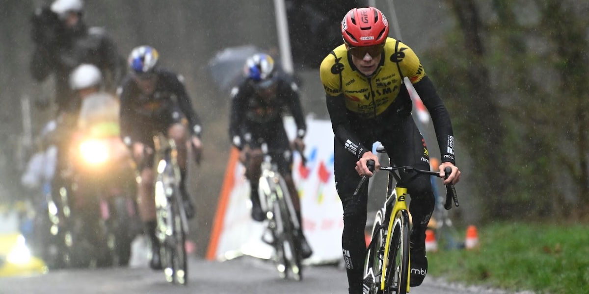

[Cycling] **Jonas Vingegaard** has crushed the **2026 Paris-Nice** field in his first race of the season, allaying any doubts about his ambitions after a difficult winter. The two-time **Tour de France** champion won two stages, including a devastating 20km solo attack on stage 5 that left even teammate Victor Campenaerts declaring "Jonas just destroyed everybody." Heading into Sunday's final stage around Nice, the Dane holds a commanding `3:22` lead over Dani Martínez — a margin almost unheard of in a race typically decided by seconds. After **Tadej Pogačar** swept the Giro-Tour double last year in historically dominant fashion, the cycling world wondered who could challenge the Slovenian in 2026. Vingegaard's Paris-Nice demolition job is a compelling answer — the sport's greatest rivalry isn't over yet.

## This Day in History

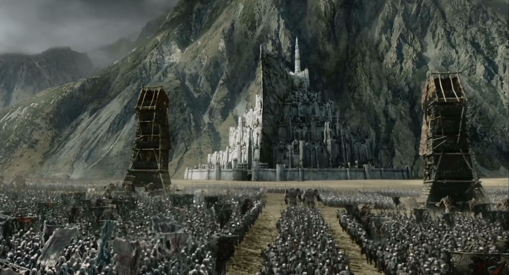

On March 15 in the year 3019 of the Third Age in **Lord of the Rings**, the **Battle of the Pelennor Fields** erupts outside **Minas Tirith**, the great city of **Gondor**, as the dark lord **Sauron**'s army smashes through its gates at dawn.  All hope seems lost. Then, just as the sun rises, horns echo across the hills — the Riders of **Rohan** have arrived! In the battle that follows, brave **Éowyn** and the hobbit **Merry** do the impossible: they slay the Witch-king, whom no man can kill (Éowyn's famous reply: "I am no man!"). King **Théoden** falls heroically, and **Aragorn** arrives with reinforcements to turn the tide against Sauron's forces. Meanwhile, far away in **Mordor**, **Frodo** and **Sam** escape captivity and begin their final trek toward Mount Doom to destroy the One Ring. Three great battles rage simultaneously across Middle-earth on this single day. It's basically the Lord of the Rings equivalent of the **Avengers** assembling — except Tolkien wrote it first!

## Art of the Week

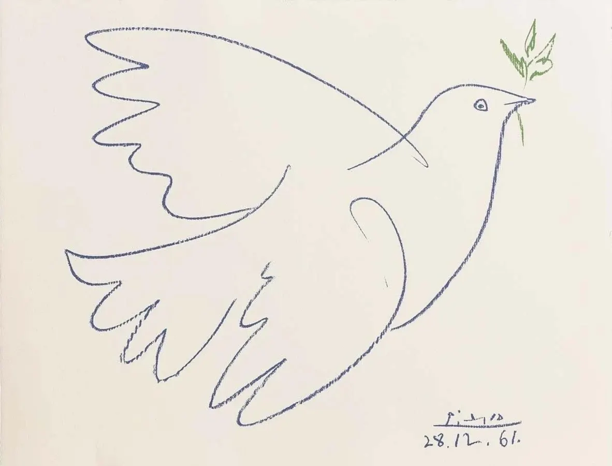

In 1949, Spanish artist **Pablo Picasso** drew a simple, beautiful lithograph of a white dove for the Paris World Peace Congress — and it became one of the most recognized symbols of peace in history. The story behind it is personal: Picasso's father was a painter who loved pigeons, and young Pablo grew up sketching them as a boy in Málaga, Spain. His friend, the French poet Louis Aragon, chose the image for the congress poster, and it spread worldwide. Picasso later named his daughter "Paloma" — Spanish for "dove." Today, with conflict raging across the Middle East, Picasso's **The Dove** feels more relevant than ever. Sometimes the most powerful message comes not from words or weapons, but from a simple drawing of a bird carrying hope.

## Funny

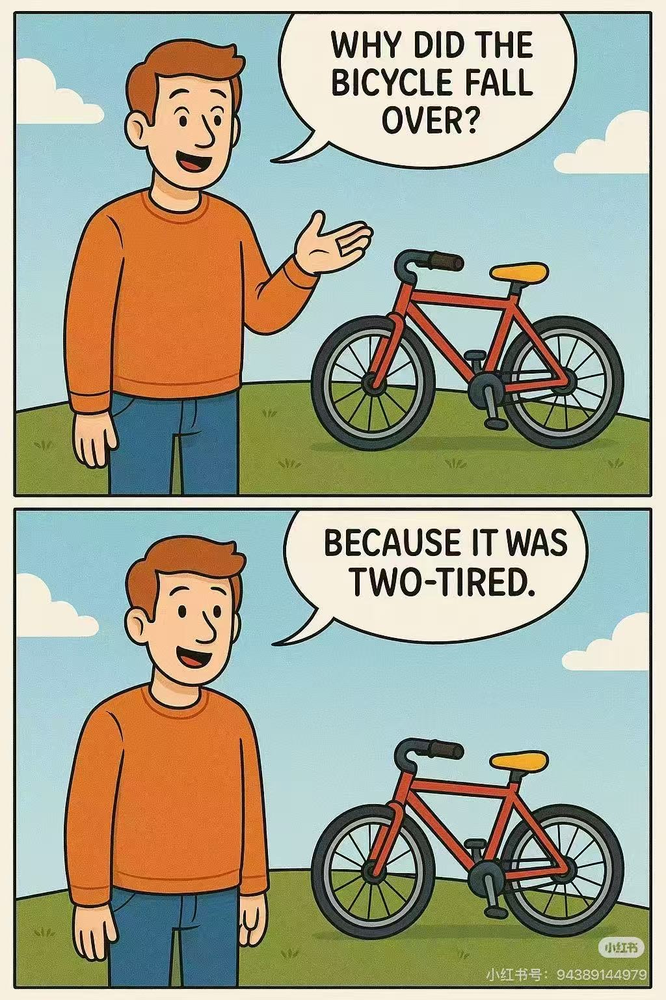

---

## Previous Issues

---

March 07, 2026, **[Facing the Storm](https://weekly.sundayblender.com/p/facing-the-storm)**

March 01, 2026, **[The Making of a Hero](https://weekly.sundayblender.com/p/the-making-of-a-hero)**

February 21, 2026, **[Celebrate the Year of the Fire Horse](https://weekly.sundayblender.com/p/celebrate-the-year-of-the-fire-horse)**

---

Thanks for reading! If you enjoy this newsletter, please share it with friends who might also find it interesting and refreshing, if not for themselves, at least for their kids.

