## Editor's Words

Spring break is coming next week. At a birthday party, parents chatted about travel plans. Some are going to Japan for one last ski trip of the season. Some are going to Southeast Asia. Some are going to check off major tourism destination of the bucket list, when the traffic will still be moderate during early April in China. It's good to stay in the region where we don't have to worry about missiles or drones flying over our heads. 

I'll be out of town with my family. The Sunday Blender will return on April 5th. 

## Tech

On March 16, **Nvidia** CEO **Jensen Huang** took the stage at a sold-out arena in San Jose for **GTC 2026** — the tech world's biggest AI gathering. His message was staggering: companies will spend `$1 trillion` buying Nvidia's AI chips through 2027, double what he predicted just months ago. To put that in perspective, that's roughly the entire GDP of Indonesia. Huang predicted that "every SaaS company will become an Agent-as-a-Service company" — meaning the software tools we use today, from spreadsheets to project managers, will be replaced by AI agents that do the work themselves instead of helping humans do it. Huang unveiled faster chips, smarter robots, and declared "the ChatGPT moment for autonomous driving is here," with car makers like **BYD**, **Nissan**, and **Hyundai** building self-driving vehicles on Nvidia technology. The keynote ended with a chorus of Nvidia-powered robots singing on stage. 

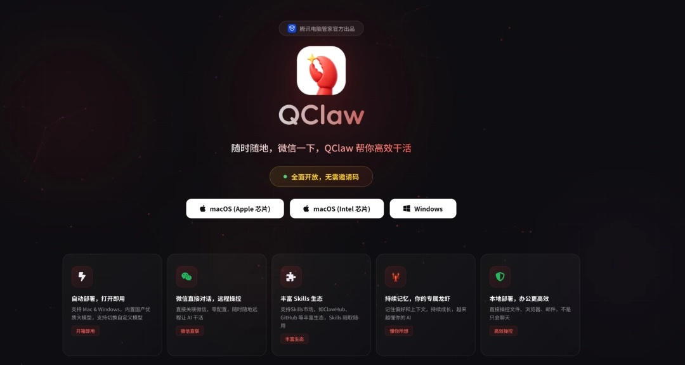

**OpenClaw** — the open-source AI agent people in China call "raising a lobster" — had a very public dust-up with **Tencent** this month. On March 11, Tencent launched SkillHub, which scraped over `13,000` skills from OpenClaw's marketplace without asking, pushing creator **Peter Steinberger**'s server bill into five digits. Steinberger fired back on X: "They copy yet they don't support the project in any way." Tencent's reply — claiming SkillHub was just a helpful "localized mirror" — struck many as corporate spin. But as the backlash went viral, Tencent moved fast: within five days, it became an official OpenClaw sponsor, providing free deployment servers across `17` Chinese cities. On March 22, Tencent launched a full WeChat integration **QClaw**, putting OpenClaw one tap away from over a billion users — turning a bitter rival into its biggest distribution partner in under two weeks.

On March 19, AI coding editor **Cursor** launched Composer 2, billing it as a major in-house breakthrough that beat **Claude** **Opus 4.6** on coding benchmarks at one-tenth the price. Within hours, a developer spotted the model ID in API traffic: "kimi-k2p5-rl-0317-s515-fast" — pointing straight to **Kimi K2.5**, an open-source model from Beijing's **Moonshot AI**. **Elon Musk** amplified the finding: "Yeah, it's Kimi 2.5." Cursor co-founder Aman Sanger admitted the omission: "It was a miss to not mention Kimi as the base model." Moonshot AI responded gracefully: "Congratulations to the Cursor team. We're proud that Kimi K2.5 provides the foundation." The episode captures a new reality in AI: a `$29 billion` American coding tool's flagship product runs on a Chinese open-source model, and the only reason anyone found out is because someone read the fine print.

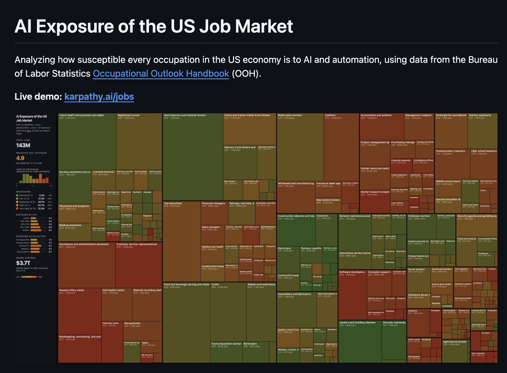

**OpenAI** co-founder **Andrej Karpathy** sparked a firestorm on March 15 with a weekend side project. He "vibe coded" an interactive heatmap scoring 342 U.S. occupations for AI exposure, using **Bureau of Labor** Statistics data and an AI model to rate each job from `0` (least affected by AI) to `10` (most likely to be reshaped by it) . The results covered `143 million` employed workers and painted a stark picture: high-paying white-collar professions — software developers, financial analysts, copywriters — scored 8 or 9, while physical, hands-on jobs scored near zero. Construction laborers, roofers, painters, janitors, and ironworkers all scored just 1. Barbers, bartenders, nursing assistants, and massage therapists scored 2. the Jobs heatmap went viral: AI is reshaping office and screen-based work first, while jobs that require you to physically show up and use your hands remain the safest.

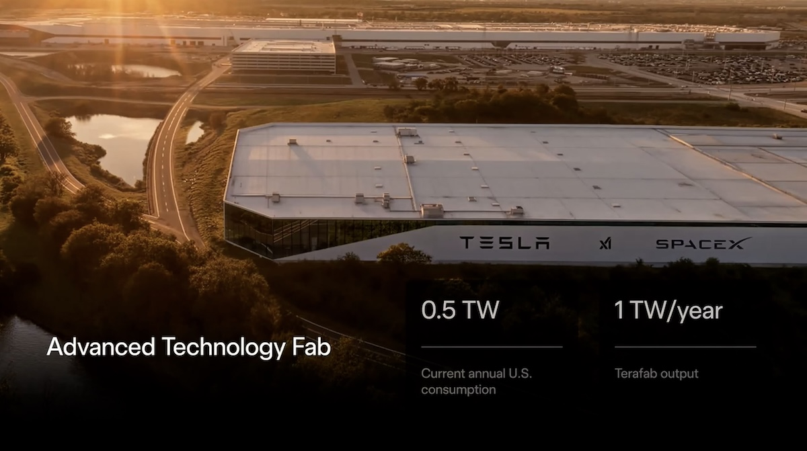

On March 21, **Elon Musk** officially launched "**Terafab**" — a vertically integrated chip fabrication project combining logic processing, memory, and advanced packaging under one roof. The facility will be built in Austin, Texas and jointly run by **Tesla** and **SpaceX**. Why build your own chip factory? Musk told investors that even the best-case supply from existing chipmakers like **TSMC** and **Samsung** won't be enough for **Tesla**'s ambitions in self-driving cars, the **Optimus** humanoid robot, and **xAI**'s Grok supercomputers. The project carries an estimated cost of around `$25 billion` and targets production of 100 to 200 billion custom AI chips per year. At its target of one million wafer starts per month by 2030, Terafab would nearly match TSMC's entire current global output — and TSMC spent decades and tens of billions of dollars building that capacity. 

## Global

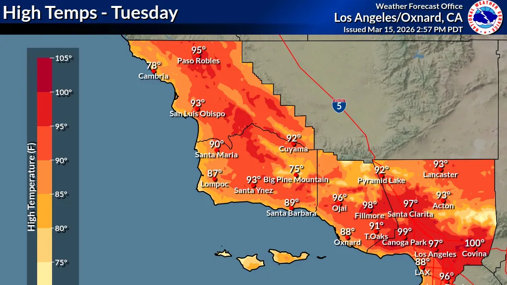

It's still technically spring, but Southern California feels like summer. A powerful high-pressure system has been pushing temperatures up to `35 degrees` above average, shattering records across the region. Burbank hit `98°F`, breaking a 1997 record. Idyllwild recorded its hottest March day ever. Woodland Hills saw its earliest-ever `100°F` reading, and across four days, `40` daily high-temperature records were broken. San Francisco — a city better known for fog and chilly summers — flirted with nearly `90°F`, its hottest March in over two decades. UC Merced climatologist John Abatzoglou called it "an event without precedent in the modern era," following what **NOAA** confirmed was the warmest winter on record across a huge portion of the western U.S. The heat is also accelerating snowmelt across the Sierra Nevada, raising concerns about water supply and an earlier wildfire season.

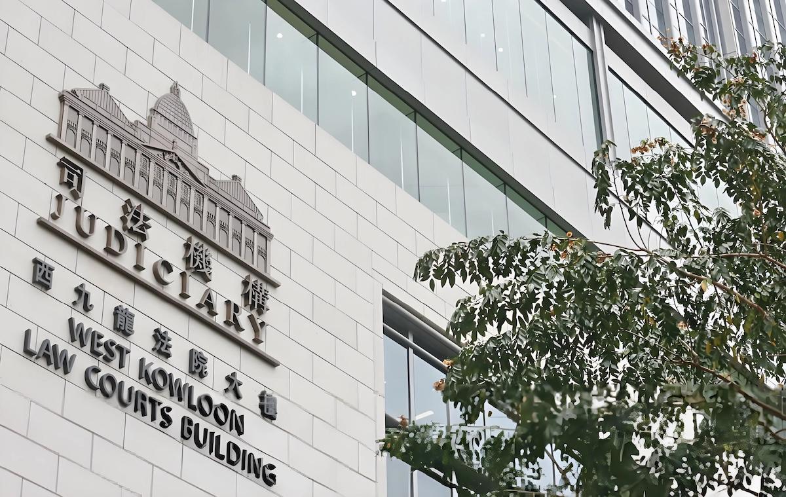

Thirteen parents and a middleman were found guilty in a Hong Kong court of bribing a former administrator at an English Schools Foundation (ESF) international kindergarten to secure priority K1 admission for 12 children. The bribes totaled `HK$1.1 million`, ranging from `HK$20,000` to `HK$200,000` per family. The children had all passed their interviews but were placed at the bottom of the waiting list — the bribes bumped them to the front. What makes this case striking is the profile of those involved: these weren't desperate outsiders — they were affluent, highly educated professionals who knew exactly how Hong Kong's system works. And Hong Kong is a city famous for its rule of law, where the **ICAC (Independent Commission Against Corruption)** has a decades-long reputation for going after everyone equally, no matter how wealthy or connected. The judge said prison sentences were "inevitable."

## Economy & Finance

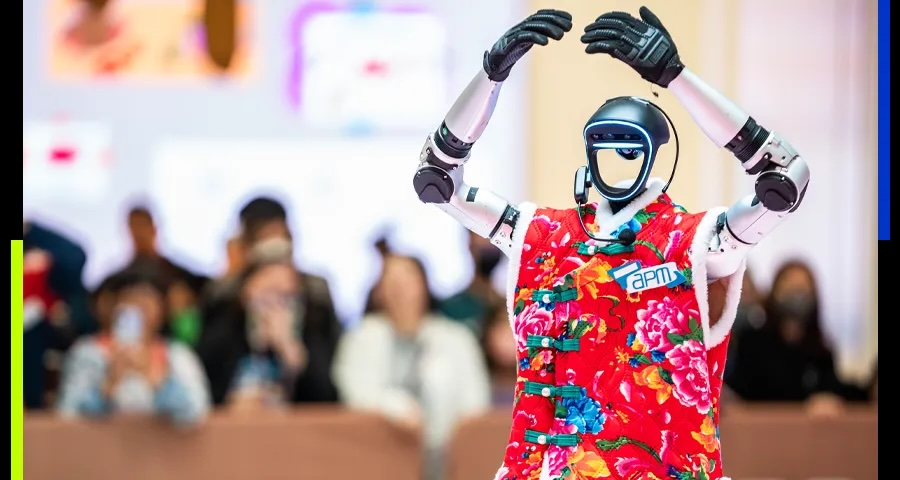

Hangzhou-based **Unitree Robotics** has filed for a `$610` million IPO on Shanghai's STAR Market, marking one of China's biggest onshore tech listings in years. Founded in 2016 by Wang Xingxing, the company rose to fame with affordable quadruped robots before pivoting hard into humanoids. Revenue surged `335%` in 2025 to `1.71` billion yuan, with adjusted net profit rising nearly eightfold. Humanoid robots now account for over half of revenue, up from just `27.6%` in 2024, driven by the consumer-friendly G1 model. Unitree delivered `5,500` humanoid units last year, claiming the top global spot. Proceeds will fund AI research, new products, and manufacturing expansion — positioning Unitree at the center of China's embodied intelligence ambitions.

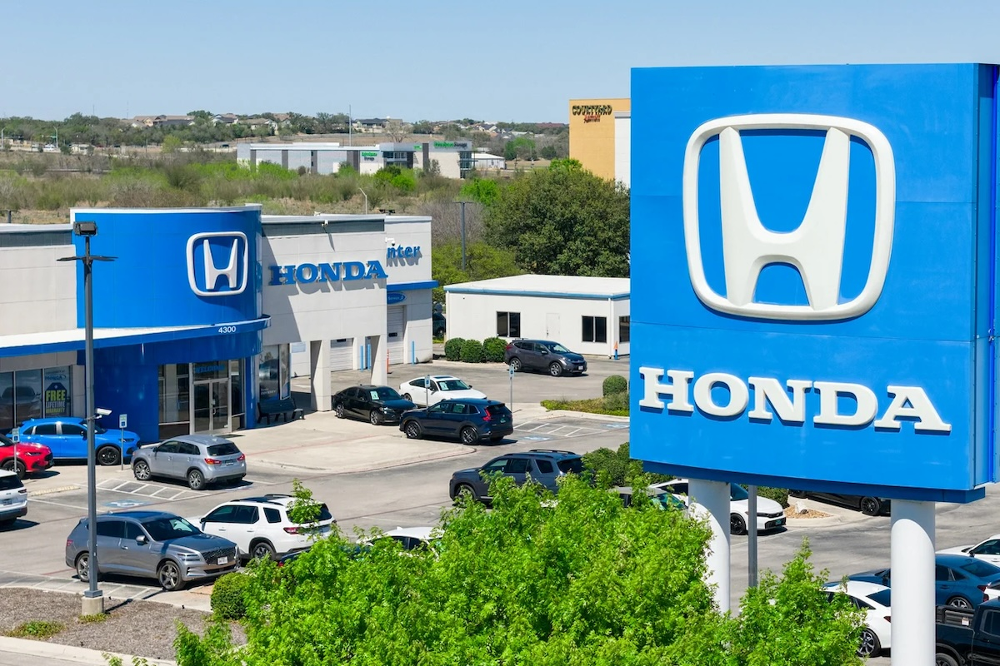

**Honda** reported its first annual loss in seven decades, announcing up to `$15.7 billion` in charges after canceling three electric vehicles that were planned for North America. The 0 Series SUV, Saloon, and Acura RSX EVs were scrapped before ever reaching the assembly line. What went wrong? A combination of U.S. tariffs, the reversal of federal EV tax credits, and fierce competition from Chinese EV makers forced Honda to rethink its electrification strategy entirely. Honda isn't alone — **General Motors**, **Ford**, and **Stellantis** have booked similar write-downs, bringing the industry total to about `$67 billion`. Honda is now pivoting toward hybrids, where its electrified lineup already accounts for over a third of sales, up from just `5%` five years ago.

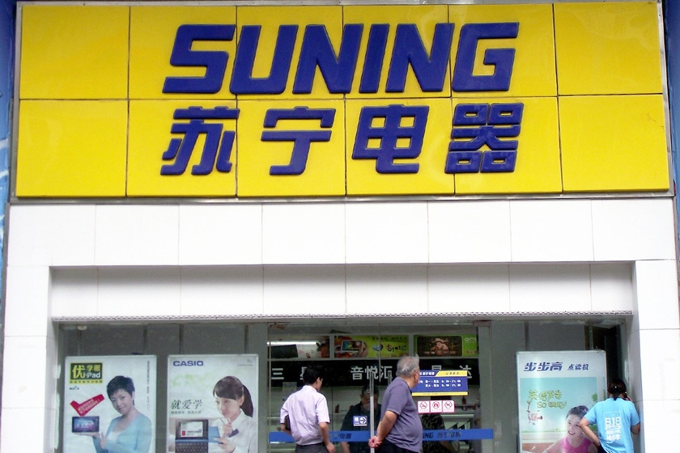

In 1990, a 27-year-old named **Zhang Jindong** opened a 200-square-meter air conditioning shop in Nanjing called **Suning**. Over three decades, he built it into China's retail king — over `1,700` stores, a Fortune 500 company, and a personal fortune of `39.5 billion yuan`. Then came catastrophic bets: a `20-billion-yuan` gamble on **Evergrande** that went to zero, reckless expansion into sports, real estate, and e-commerce, and a price war with **JD.com** he couldn't win. In early 2026, a Nanjing court finalized the restructuring of 38 Suning companies carrying `2,387 billion yuan` in debt. Zhang surrendered everything — stocks, mansions, art collections — keeping only a 68-square-meter walk-up apartment, a social security card, and a health insurance card. Unlike many tycoons who hid assets or fled the country, Zhang chose to face his creditors and take full responsibility — a rare act in Chinese business that earned him respect even in defeat.

## Nature & Environment

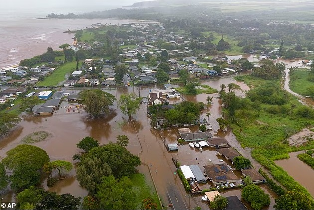

In mid-March 2026, a slow-moving Kona Low stalled northwest of the **Hawaiian Islands**, unleashing six days of torrential rain, wind gusts up to `135` mph, and catastrophic flooding across every major island. Honolulu shattered a 75-year-old rainfall record, while parts of Maui received `46` inches over five days. Over `130,000` customers lost power at the storm's peak, and Governor Josh Green warned of potentially `$1` billion in damage. The century-old **Wahiawa Dam** on **Oahu** rose to imminent failure risk as water levels surpassed the spillway, threatening `2,500` lives downstream. Investigations revealed owner Dole Food Co. had ignored decades of state warnings about the dam's inadequate spillway, turning a weather disaster into a mounting infrastructure crisis.

## Science

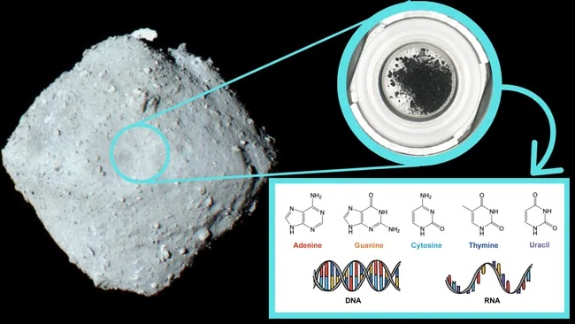

DNA is written in five chemical "letters" called nucleobases — adenine, guanine, cytosine, thymine, and uracil. Scientists announced on March 16 that all five have been found in rock samples from **Ryugu**, a near-Earth asteroid, about `900 meters` wide, orbiting the Sun between Earth and Mars. They were collected by Japan's **Hayabusa-2** spacecraft during a six-year, 300-million-kilometer round trip. Because asteroids like Ryugu formed `4.6 billion` years ago when the planets were being born, and have remained largely unchanged since, the discovery offers a window into the chemistry that existed at the dawn of our solar system. **NASA** found the same building blocks on asteroid Bennu, and they've turned up in meteorites that fell in France and Australia. This "does not mean that life existed on Ryugu," lead author Toshiki Koga said. "Instead, their presence indicates that primitive asteroids could produce and preserve molecules important for the origin of life." The implication is staggering: life on Earth may not have started here — it may have been delivered by rocks falling from space billions of years ago.

## Math

What is the value of **?**

## Lifestyle, Entertainment & Culture

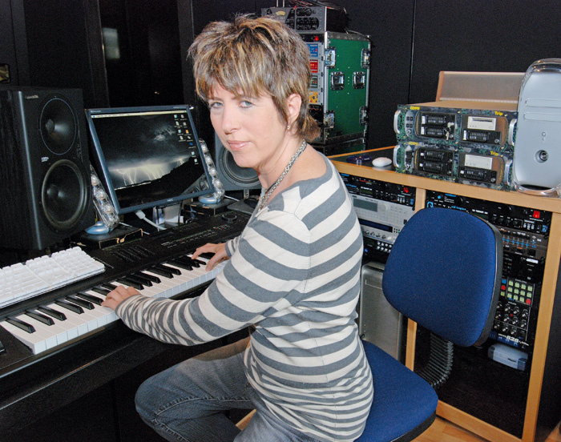

The **98th Academy Awards** on March 15 crowned *One Battle After Another* as Best Picture, but the night's most lovable storyline belonged to songwriter **Diane Warren**. With her 17th consecutive loss in Best Original Song, Warren now holds the record for the most Oscar nominations without a competitive win. Warren is the powerhouse behind iconic hits like **Aerosmith**'s "I Don't Want to Miss a Thing" and **Tony Braxton**'s "Un-Break My Heart" — songs that defined entire movie moments and topped charts worldwide. Warren took it in stride, declaring she'd rather have the title of "biggest loser ever" than a single win, posting: "Well at least I'm consistent!" A legend who proves showing up matters more than trophies.

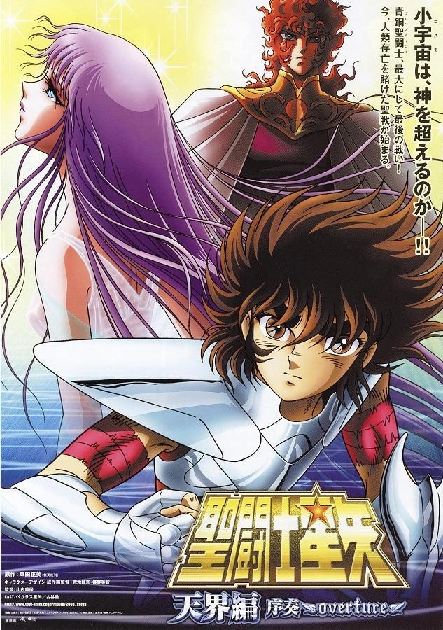

Forty years after young warriors in constellation armor first captivated readers, creator **Masami Kurumada** has announced *Saint Seiya: Tenkai-hen* ("The Heavens Arc"), launching May 14, 2026 in **Weekly Shonen Champion**. The franchise, which first appeared in 1985 and has over `50` million copies in circulation, follows mystical Saints who wear sacred armor to protect the goddess Athena — a story built on friendship, sacrifice, and burning through impossible odds with sheer willpower. Now 72, Kurumada is finally delivering the heavenly realm storyline fans have waited decades for. **Saint Seiya** is one of the most popular anime of all time worldwide, especially in Europe and Latin America, where it rivals **Dragon Ball Z** — in countries like Brazil, Mexico, and Argentina, it shaped an entire generation's relationship with anime and manga.

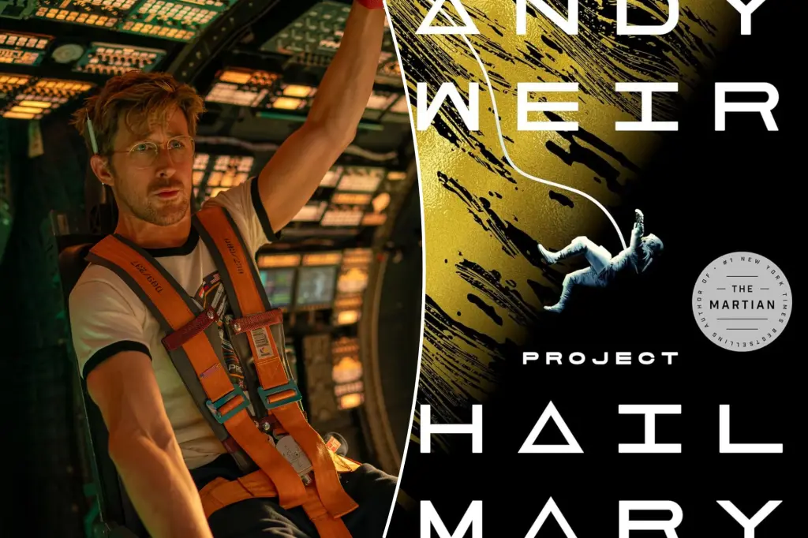

**Andy Weir** — the author behind *The Martian*, the 2015 blockbuster starring **Matt Damon** — is back with *Project Hail Mary*, about a schoolteacher who wakes up alone on a spaceship with no memory and a mission to save Earth. The film hit theaters on March 20 starring **Ryan Gosling**, directed by Phil Lord and Christopher Miller. The results are spectacular: it opened to `$80.6 million` domestically, the biggest launch of 2026 and the best opening ever for **Amazon MGM Studios**. Critics gave it a `95%` on **Rotten Tomatoes**, calling it "a near-miraculous fusion of smarts and heart." It's now the second-best opening for a non-franchise film ever, just behind *Oppenheimer*. The hero is a science teacher who uses biology, physics, and problem-solving to save humanity — and the alien friendship at the story's center is one of the best in all of science fiction.

## Sports

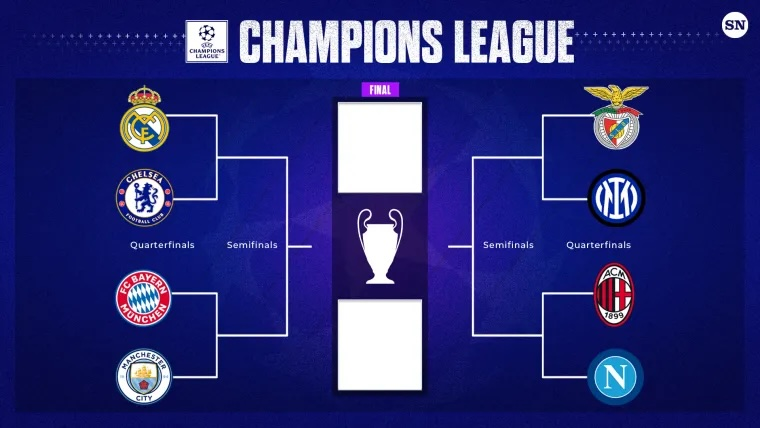

[Soccer] The UEFA Champions League quarter-finals are set, and they're loaded. **Barcelona** demolished **Newcastle** 7-2 in the second leg (8-3 on aggregate), **Bayern Munich** crushed **Atalanta** 4-1 (10-2 on aggregate), and **Liverpool** steamrolled **Galatasaray** 4-0. Two English giants were sent home: **Chelsea** fell 0-3 to **PSG** (2-8 on aggregate), and **Manchester City** lost 1-2 to **Real Madrid** (1-5 on aggregate). The quarter-final matchups are now: **Sporting CP** vs **Arsenal**, **Real Madrid** vs **Bayern Munich**, **Barcelona** vs **Atlético de Madrid**, and **Paris Saint-Germain** vs **Liverpool** — with first legs on April 7-8. The final is scheduled for May 30 at the Puskás Aréna in Budapest. Barcelona and Bayern look devastating, Real Madrid are doing what they always do in this tournament, and Liverpool are quietly building a case as the most complete team left standing.

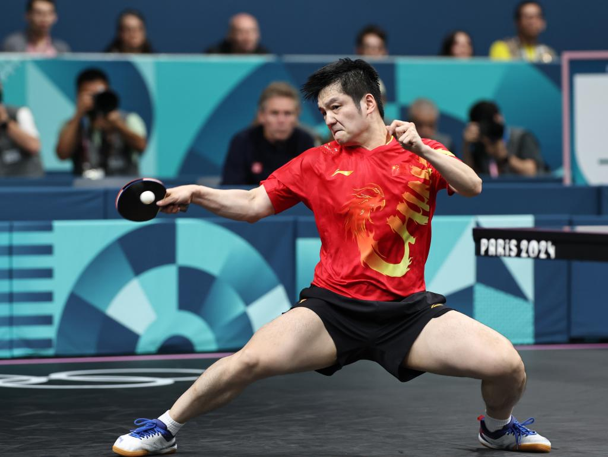

[Table Tennis] The German **Tischtennis Bundesliga** has been the strongest table tennis league in Europe since 1966, and **Borussia Düsseldorf** is its most dominant club — holders of a record `34` league titles and `12` Champions League trophies, more than any club in competition history. **Saarbrücken** has emerged as their chief rival, with the two meeting in four consecutive Bundesliga finals. Düsseldorf just announced the signing of Chinese superstar **Fan Zhendong** on a one-year contract for the 2026/27 season, sending shockwaves through European table tennis. The nine-time World Champion and former world number one for over `250` weeks will leave current club Saarbrücken, where he led the squad to the German Cup title in January. Saarbrücken expressed disappointment but gratitude, while Düsseldorf instantly becomes the Bundesliga and Champions League favorite heading into next season.

[Snooker] British snooker superstar **Ronnie O'Sullivan** made history on Friday with a break of `153` against Ryan Day at the **2026 World Open** — the highest ever in professional snooker. In snooker, a "maximum" break is `147`, but a rare free ball rule let O'Sullivan effectively create an extra red at the start of the frame, opening the door to surpass it. The achievement eclipses Jamie Burnett's `148` from 2004, a record that stood for 22 years. At 50, O'Sullivan already holds records for most world titles (`7`, tied), most ranking titles (`41`), most maximum 147 breaks (`17`), and the fastest maximum — `five minutes and eight seconds`, unbeaten for `28` years. As fellow champion Neil Robertson put it: "The best ever and the best there ever will be."

[[Baseball] On January 3, 2026, the U.S. military launched strikes across Venezuela and captured President Nicolás Maduro in a predawn raid on his compound in Caracas. Ten weeks later, Venezuela's baseball team arrived in Miami for the **World Baseball Classic** — in the backyard of `250,000` Venezuelan expatriates. Their first target: defending champion Japan, stacked with MLB superstars including four-time MVP **Shohei Ohtani** and World Series MVP **Yoshinobu Yamamoto**. The game opened with fireworks as Venezuela's Ronald Acuña Jr. and Ohtani traded lead-off home runs in the first inning. Japan built a 5-2 lead, but their bullpen collapsed — Wilyer Abreu hit a go-ahead three-run homer in the sixth, and the eight runs were the most Japan have ever conceded in a single WBC game. It was Japan's worst-ever finish in tournament history. Venezuela then beat dark horse Italy in the semis before facing star-studded Team USA in the final. Bryce Harper hit a dramatic game-tying two-run homer in the eighth — but Venezuela answered in the ninth when Eugenio Suárez doubled in the winning run for a 3-2 victory. After the final out, the team sang their national anthem in tears on the center field stage, with thousands of Venezuelan fans weeping alongside them. This was Venezuela's first WBC title and their first baseball world championship since 1945. For a country in political turmoil, it was a moment that transcended baseball.

## This Day in History

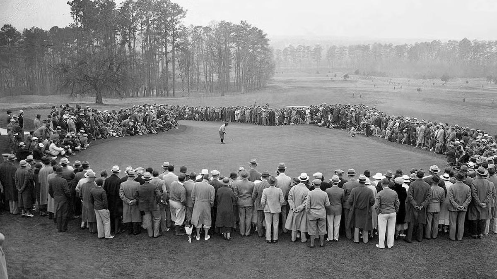

On **March 22, 1934**, a new golf tournament teed off in Augusta, Georgia, USA — and quietly changed the sport forever. Founded by legendary amateur Bobby Jones on the site of a former plant nursery, **Augusta National** hosted what became the Masters — one of golf's four major championships and the only one played at the same course every year. Today it's golf's most sacred ground: membership is invitation-only with no application process, and even three-time champion **Gary Player** was recently denied a tee time with his grandsons. Volunteers who work the full Masters week earn a rare reward — one round on "Appreciation Day." For everyone else, Augusta remains a beautiful, tantalizing dream behind locked gates.

## Art of the Week

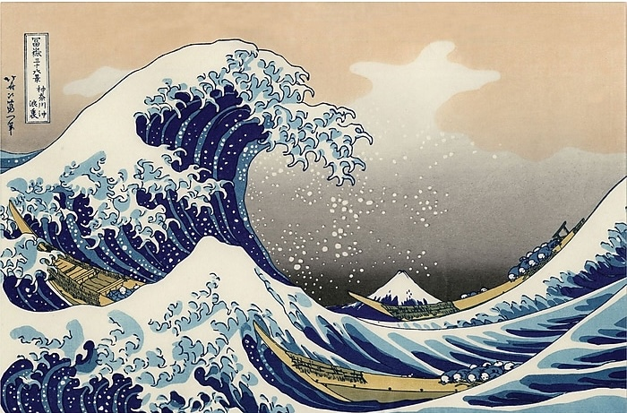

Around 1831, a 70-year-old Japanese artist created what has been called "possibly the most reproduced image in the history of all art." **Katsushika Hokusai** had spent decades in obscurity, changed his name over 30 times, and moved house 93 times. Just before his masterpiece, he'd suffered a stroke, lost his wife, and was nearly broke — writing: "No money, no clothing, barely enough to eat." Then came *The Great Wave off Kanagawa*: a towering wall of water about to swallow three fishing boats, with sacred Mount Fuji sitting tiny and calm in the distance. The massive wave dwarfs the mountain through dramatic perspective — nature's fury frozen in the instant before the crash. The composition fused Japanese and European techniques, and went on to inspire **Van Gogh**'s swirling skies, **Monet**'s landscapes, and **Debussy**'s *La Mer*. On his deathbed at 88, Hokusai reportedly said: "If only Heaven will give me just another ten years..." Proof that it's never too late to make something the whole world remembers.

## Funny

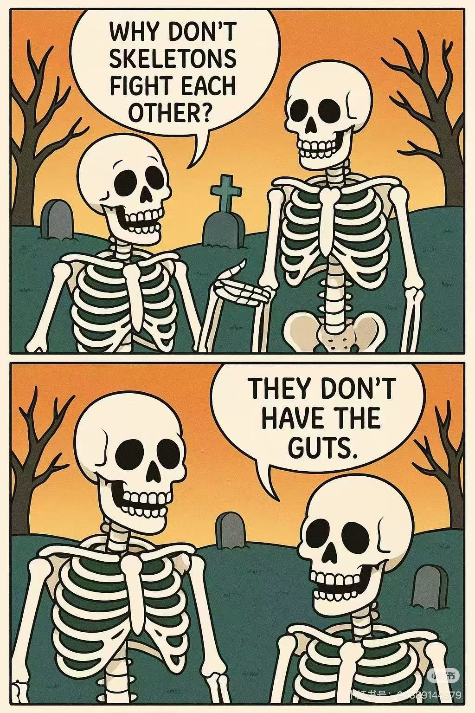

---

## Previous Issues

---

March 15, 2026, **[The Unstoppable Kimi](https://weekly.sundayblender.com/p/the-unstoppable-kimi)**

March 07, 2026, **[Facing the Storm](https://weekly.sundayblender.com/p/facing-the-storm)**

March 01, 2026, **[The Making of a Hero](https://weekly.sundayblender.com/p/the-making-of-a-hero)**

---

Thanks for reading! If you enjoy this newsletter, please share it with friends who might also find it interesting and refreshing, if not for themselves, at least for their kids.

