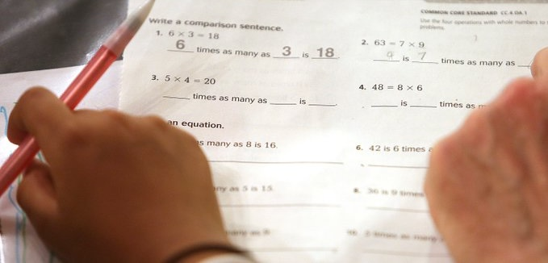
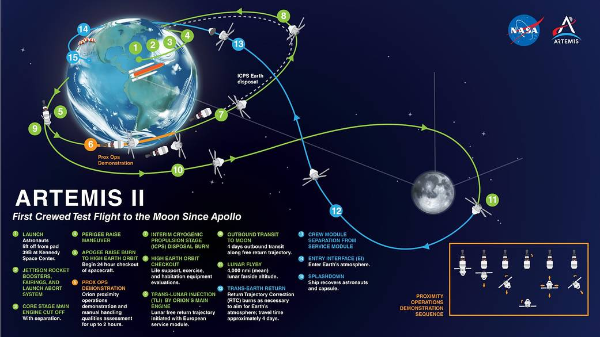
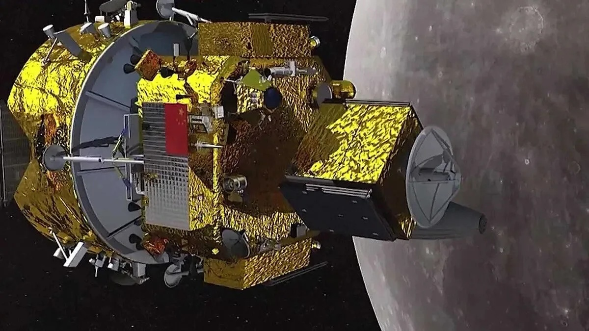
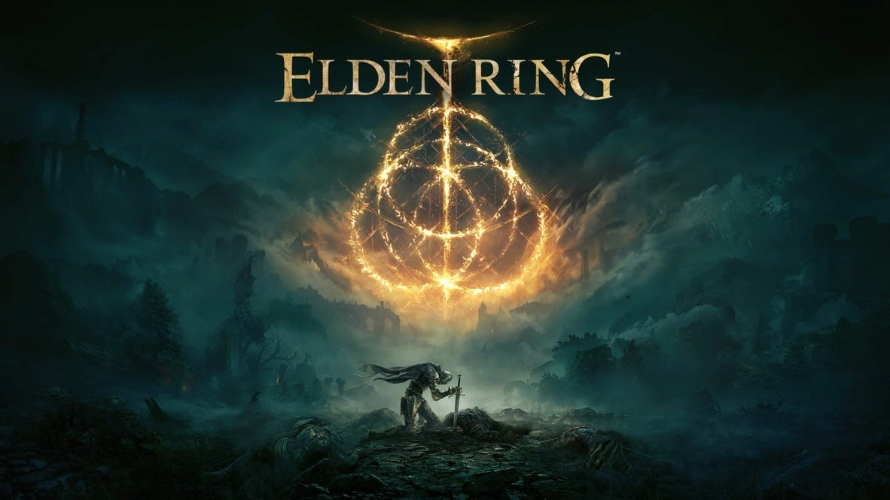
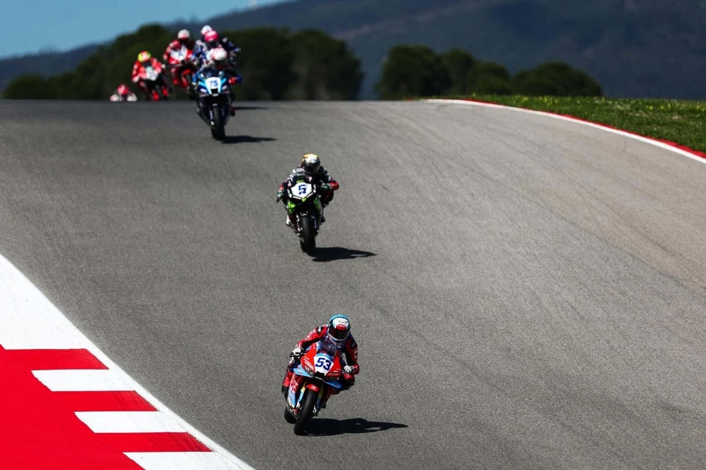
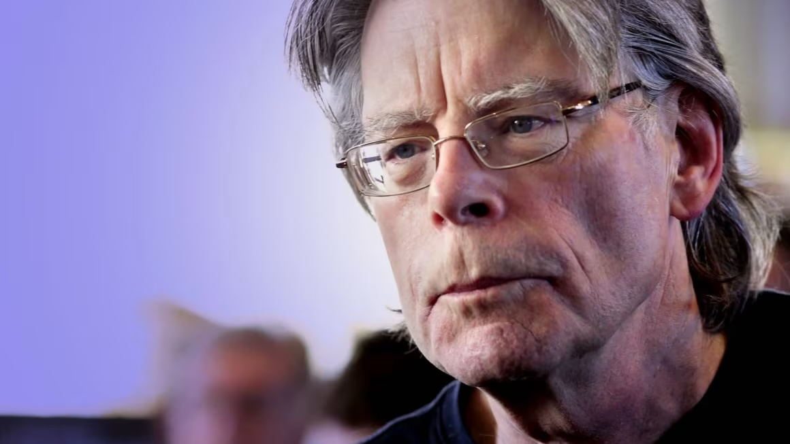
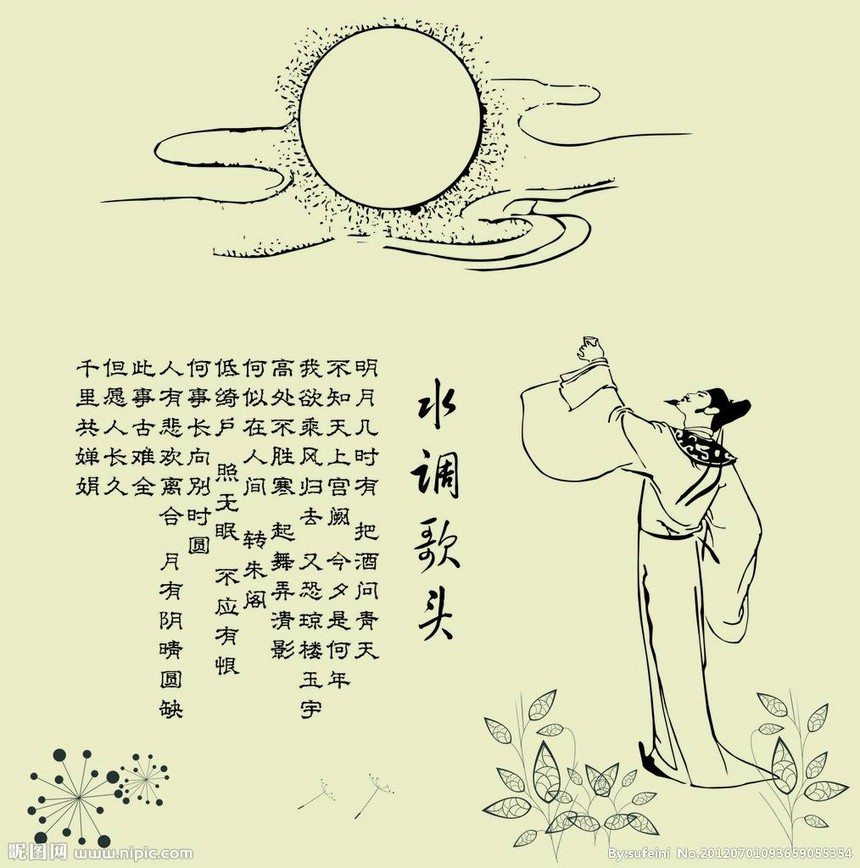
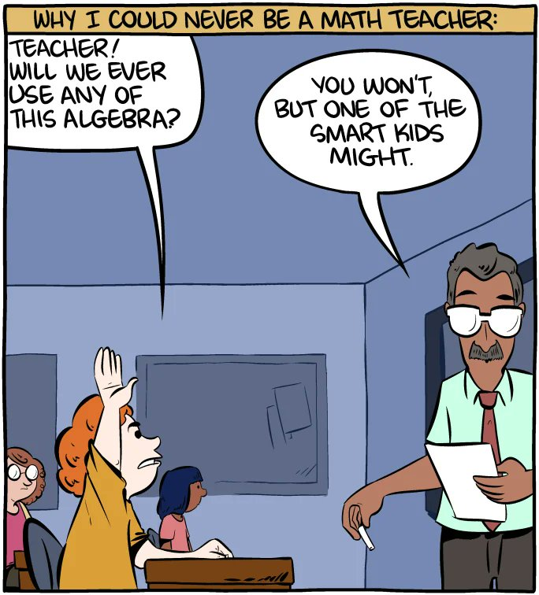

## Editor's Words

We're back from the spring break! 

Despite the petty fight between Anthropic and OpenClaw in the world of cutthroat AI competition, men still have a higher cause to race for - going to the Moon, turning the Moon into a second base for humanity, and making space travel a regular activity, if not a sport already. 

On top of that, Messi and Ronaldo will have their last World Cup in June. This World Cup will be epic in every way. There is so much to look forward to in 2026.

By the way, it is almost impossible to get a decent-looking 2026 World Cup final match-up table on Google. You'd imagine this picture should be floating around everywhere, but no. The good ones are all behind digital walls by big tech platforms like Facebook and Instagram. WeChat has plenty good ones, but it's not accessible to non-WeChat users, either. 

On one hand, we tirelessly explore the physical boundary of human adventures. On the other hand, we shrewdly isolate ourselves in towering digital fortresses. Ironic, isn't it?

## Tech

**Anthropic**, the company behind the AI assistant **Claude**, accidentally published the full source code for its popular coding tool Claude Code. A debug file was mistakenly included in a routine software update pushed to **npm**, a public registry where developers download packages. Security researcher Chaofan Shou spotted it and posted the discovery on **X**, where it racked up over `21 million` views within hours. The code — roughly `500,000` lines across `1,900` files — was quickly mirrored on **GitHub** and picked apart by thousands of developers. For a company valued at `$380 billion` and known for building some of the most capable AI on the planet, the cause was almost comically mundane: someone forgot to exclude a file from the build pipeline. Anthropic called it human error and said no customer data was exposed. It was the company's second such leak in just over a year.

**OpenAI** announced it is shutting down **Sora**, its AI video generation app. When Sora first debuted in early 2024, its demo clips stunned the internet and made OpenAI look like the undisputed leader in AI video. But after launching as a standalone app in September 2025, it struggled: the tool was burning through roughly `$1 million` a day in compute costs while its user base collapsed from a peak of about `3.3 million` monthly downloads to just over a million. CEO Sam Altman said the company needed to redirect resources toward its core AI models and coding tools. Meanwhile, **ByteDance**'s **Seedance** 2.0, **Google**'s **Veo**, and **Runway** have all surpassed it — and OpenAI is walking away from the field entirely.

When the US banned **Huawei** from using **Google**'s Android in 2019, the Chinese tech giant had no choice but to build its own operating system from scratch. Six years later, **HarmonyOS** now runs on over `one billion` devices — phones, tablets, watches, TVs, cars, and now laptops. Huawei recently launched HarmonyOS Next, a version built entirely in-house with zero Android code. PC shipments running HarmonyOS are forecast to grow tenfold this year, and analysts say the platform could surpass Google's **ChromeOS** by 2027. Huawei claims its app ecosystem will match Android and iOS quality by this month. Whether HarmonyOS can break out of China and compete globally remains the big question — but the fact that it exists at all is one of the more remarkable comebacks in tech.

## Global

Twelve years ago, **San Francisco**'s school district removed Algebra from middle school in the name of equity, hoping to close racial gaps in math achievement. It backfired. Eighth-grade math proficiency dropped from `51%` to `40%` district-wide, and proficiency among Black students fell from `11%` to `4%`. Enrollment in advanced high school math, including AP Calculus, also declined. Wealthier families simply hired tutors or enrolled their kids in private programs, widening the gap the policy was supposed to close. In 2024, `82%` of San Francisco voters approved a nonbinding measure demanding algebra's return. On March 24, the school board finally voted `4–3` to bring it back. As one parent group put it: "We're the center of technological innovation in the United States, and we can't teach our kids math?"

## Economy & Finance

Elon Musk's **SpaceX** has confidentially filed for an IPO targeting a `$1.75 trillion` valuation and a raise of up to `$75 billion`, which would make it the largest public offering in financial history. The filing comes two months after SpaceX acquired Musk's AI company **xAI** in an all-stock deal valued at `$1.25 trillion`, merging rockets, Starlink satellite internet, the Grok AI model, and the X social media platform under one roof. A June listing on **Nasdaq** is reportedly the target. There's one awkward detail: all eleven of xAI's original co-founders have since left the company, and Musk has acknowledged the AI division is being "rebuilt from the foundations up."

## Nature & Environment

A humpback whale nicknamed **Timmy** has been stranded in Germany's Baltic Sea since early March, and the story has gripped the entire country. The 12-to-15-meter whale likely wandered in while chasing herring and couldn't find its way back to the Atlantic — a journey of several hundred kilometers through narrow straits. Rescuers tried everything: excavators dug escape channels, boats created waves to guide it, **Greenpeace** deployed teams. Twice the whale freed itself, only to get stuck again. It also had fishing net tangled in its mouth. On April 1, experts called off all rescue efforts, saying further intervention would only cause more suffering. The story became a national moment in Germany — millions followed every update, every small sign of hope. Sometimes the world stops to care about one lost whale, and that says something worth holding onto.

## Science

On April 1, **NASA**'s **Artemis II** mission launched four astronauts toward the Moon — the first crewed lunar voyage since **Apollo 17** in 1972. The road to launch was rough: the rocket suffered hydrogen fuel leaks during test countdowns in February, then a helium leak in the upper stage forced a rollback to the assembly building, pushing the launch from February to April. Hours after liftoff, the toilet malfunctioned — a jammed fan disabled urine collection for five hours, forcing the crew to resort to backup bags. They fixed it. The spacecraft is now en route to the Moon on a 10-day flyby mission, looping around the far side before returning to Earth. **Artemis III**, scheduled for 2027, will test docking with **SpaceX**'s Starship and **Blue Origin**'s Blue Moon lander in Earth orbit. The actual lunar landing is planned for **Artemis IV** in 2028, with roughly one landing per year after that.

While NASA's Artemis II circles the Moon this week, China is quietly building its own path to a crewed lunar landing by 2030. The **Chang'e-7** mission, set to launch later this year, will send an orbiter, a lander, and a mini-flying probe to the Moon's south pole to scout for water ice and resources. A follow-up mission, **Chang'e-8**, planned for 2028, will test 3D printing on the lunar surface using local materials — a key step toward building a permanent base. China has already tested its new **Mengzhou** crew capsule and **Lanyue** lunar lander, and is constructing a launch pad at the **Wenchang** spaceport in **Hainan**. If successful, China would become only the second country ever to land humans on the Moon.

## Math

In order to be born, you needed:

2 parents  
2² = 4 grandparents  
2³ = 8 great-grandparents  
2⁴ = 16 second great-grandparents  
2⁵ = 32 third great-grandparents  
2⁶ = 64 fourth great-grandparents  
2⁷ = 128 fifth great-grandparents  
2⁸ = 256 sixth great-grandparents  
2⁹ = 512 seventh great-grandparents  
2¹⁰ = 1024 eighth great grandparents  
2¹¹ = 2048 ninth great-grandparents  

For you to be born today from `12` previous generations, you needed a total of `2¹² = 4096` ancestors over the last `400` years.

## Lifestyle, Entertainment & Culture

**Apple** turned 50 on April 1, and to celebrate, the company brought **Sir Paul McCartney** to perform a private concert for employees at Apple Park — the circular headquarters in **Cupertino** known as "**The Spaceship**." McCartney played a 25-song set under the campus's rainbow arches, covering **Beatles** classics like "Hey Jude," "Let It Be," and "Blackbird," Wings hits like "Band on the Run," and his signature pyrotechnics-laden "Live and Let Die." Employees had to win a lottery just to get in. The choice of McCartney carried extra meaning: The Beatles founded Apple Corps in 1968, eight years before **Steve Jobs** started Apple Computer. The two Apples famously feuded over the name for decades, settling only in 2007 — just in time for the iPhone to change everything.

**Ryan Gosling**'s new movie **Project Hail Mary** — based on **Andy Weir**'s bestselling novel about a schoolteacher launched into space to save Earth — has grossed `$300 million` worldwide, making it one of the year's biggest hits. But one of its most talked-about moments has nothing to do with special effects. In a karaoke scene, actress **Sandra Hüller** belts out **Harry Styles**' 2017 hit "**Sign of the Times**," and the moment has become the emotional centerpiece of the film. Hüller picked the song herself from a playlist of goodbye songs, then realized the lyrics — "just stop your crying, have the time of your life, breaking through the atmosphere" — fit the story perfectly. She checked with her daughter first to make sure it was still cool. Gosling called it "the anthem of the film," and even sang it to Styles when he hosted **Saturday Night Live**.

The video game **Elden Ring** — a massive open-world fantasy RPG that has sold over `30 million` copies since 2022 — is getting a live-action movie. A24 is producing with director Alex Garland, the filmmaker behind **Ex Machina** and **28 Days Later**. Garland pursued the project himself, writing a 160-page script on spec and flying to Japan to pitch the game's creator **Hidetaka Miyazaki** in person. Set footage leaked this week on TikTok showing a Statue of Marika and stone ruins that fans say look pulled straight from the game. Filming reportedly starts next week in England. No release date yet, but expect 2027.

April 1 is **April Fools' Day** — the one day a year when pranking people is not only acceptable but expected. Nobody knows exactly how it started. The most popular theory traces it to 1582, when France switched to the Gregorian calendar and moved New Year's Day from late March to January 1. People slow to get the memo became the butt of jokes. In France, tricked people are called poisson d'avril (April fish). In Scotland, it's a two-day affair — the second day is devoted entirely to butt-related pranks, called Taily Day. Even major corporations get in on it: **Google**, **BMW**, and **Burger King** have all run elaborate fake product launches on April 1.

## Sports

[Motorbike] **ZXMOTO**, a Chinese motorcycle manufacturer founded in Chongqing just two years ago, made history on March 28–29 by winning both races in the **World Supersport Championship** at the Portimão circuit in Portugal. French rider Valentin Debise dominated on the ZXMOTO 820RR-RS, winning Race 1 by nearly four seconds and taking Race 2 in a tight finish. It was only the brand's fourth race ever — and its first season competing at this level. The sport has long been dominated by **Ducati**, **Yamaha**, **Kawasaki**, and **Honda**. What made it even more striking: the 820RR retails for about `$6,000`, a fraction of its European and Japanese rivals. But the real story is founder Zhang Xue. Born in 1987 in a village in Hunan province, he had only a junior high school education. At 16 he was repairing motorcycles. At 19 he chased a TV crew for over 100 kilometers in the rain just to get a chance to show off his riding. He raced until he ran out of money, then worked at factories, co-founded another brand called Kove, and finally started ZXMOTO in April 2024. Less than two years later, he was watching his bike win on a world stage, in tears.

[Soccer] The **2026 FIFA World Cup** kicks off June 11 across the US, Canada, and Mexico — the first World Cup with `48` teams, up from `32`, the biggest expansion in the tournament's history. Both **Lionel Messi** (38) and **Cristiano Ronaldo** (41) are expected to play in their record-tying sixth World Cup — likely the last for both legends. Meanwhile, Brazil's all-time leading scorer **Neymar**, 34, may not even make the squad after two years of injuries. France's **Kylian Mbappé** will lead Les Bleus in a group that includes Norway, back at the World Cup for the first time since 1998, led by Manchester City's towering striker **Erling Haaland**. Spain's 18-year-old **Lamine Yamal** will make his World Cup debut as arguably the best player in the world. And Argentina will try to become the first team to win back-to-back titles since Brazil in 1962.

[Soccer] On March 31, **Japan**'s Samurai Blue beat **England** `1–0` at **Wembley Stadium**, with winger Kaoru Mitoma scoring the only goal. With that, Japan has now beaten seven of the eight nations that have ever won a World Cup — **Uruguay**, **Argentina**, **France**, **Germany**, **Spain**, **Brazil**, and **England**. Only **Italy** remains unchecked, but they have other problems: on the same day Japan was winning at Wembley, Italy lost to **Bosnia & Herzegovina** in a penalty shootout and failed to qualify for the World Cup for the third straight time — an unprecedented low for a four-time champion. Most of these Japan's wins came in friendlies, but the Germany and Spain victories were at the 2022 World Cup, and the trend is unmistakable. Coach Hajime Moriyasu has said openly that Japan's goal is to win the World Cup. Few are laughing anymore. Japan opens their 2026 campaign in Group F against the **Netherlands**, **Tunisia**, and **Sweden**.

[Golf] The Masters tees off at **Augusta National** on April 9, but the biggest story isn't on the course. **Tiger Woods** — `82` PGA Tour wins, `15` major titles, five green jackets, widely considered the greatest golfer ever — will not be there. On March 27, the 50-year-old was involved in a rollover crash near his Florida home and arrested for DUI (Driving Under Influence). Woods has since announced he is stepping away from golf to seek treatment. His body has been breaking down for years: a devastating car crash in 2021, a ruptured Achilles in 2025, seven back surgeries. His last Masters appearance in 2024 ended with his worst score ever as a professional, finishing last among all players who made the cut. He once held the world No. 1 ranking for a record `683` weeks. Today he is ranked `3,736th`.

## This Day in History

On **April 5, 1974**, a 26-year-old high school English teacher in Maine named **Stephen King** published his first novel, *Carrie*. He had written it on evenings and weekends, working on a secondhand typewriter in the laundry room of a trailer he shared with his wife and two small children. He actually threw the early draft in the trash — his wife Tabitha fished it out and told him to finish it. The book sold a million copies in its first year in paperback and launched one of the most prolific careers in literary history. King has since published over `60 `novels and sold more than `350 million` copies worldwide, becoming one of the best-selling authors of all time. If you've seen *It*, *The Shining*, *Stand by Me*, or *The Shawshank Redemption* — those are all Stephen King. 

## Art of the Week

In 1076, the Chinese poet **Su Shi (苏轼)** wrote **Shuidiao Getou (水调歌头)** during the Mid-Autumn Festival, gazing at a full Moon and missing his brother whom he hadn't seen in years. The poem's closing lines have become some of the most quoted in the Chinese language: 

> 人有悲欢离合
> 
> 月有阴晴圆缺
> 
> 此事古难全
> 
> 但愿人长久
> 
> 千里共婵娟。

The great Chinese writer **Lin Yutang (林语堂)** translated them as: 

> But rare is perfect happiness
> 
> the moon does wax, the moon does wane
> 
> and so men meet and say goodbye
> 
> I only pray our life be long
> 
> and our souls together heavenward fly!

In Chinese literary tradition, the Moon has always been far more than an astronomical object. For centuries, poets and scholars have turned to it to express longing, solitude, reunion, and the passage of time — making it perhaps the most enduring symbol in all of Chinese literature.

## Funny

---

## Previous Issues

---

March 22, 2026, **[The Future of SaaS Companies and Knowledge Workers](https://weekly.sundayblender.com/p/the-future-of-saas-companies-and-knowledge-workers)**

March 15, 2026, **[The Unstoppable Kimi](https://weekly.sundayblender.com/p/the-unstoppable-kimi)**

March 07, 2026, **[Facing the Storm](https://weekly.sundayblender.com/p/facing-the-storm)**

---

Thanks for reading! If you enjoy this newsletter, please share it with friends who might also find it interesting and refreshing, if not for themselves, at least for their kids.

