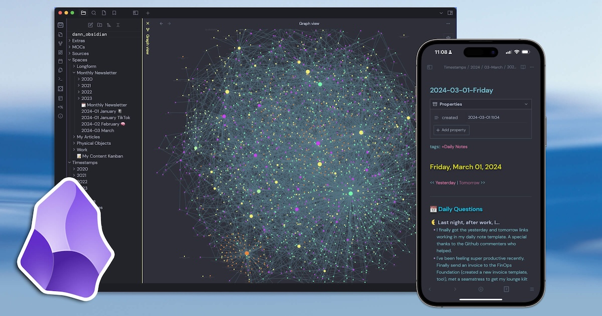
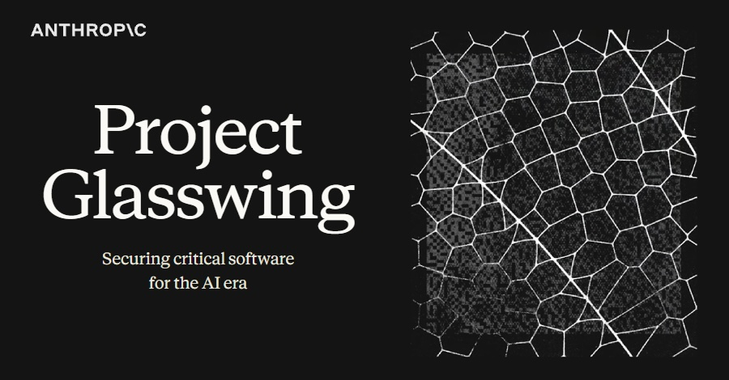
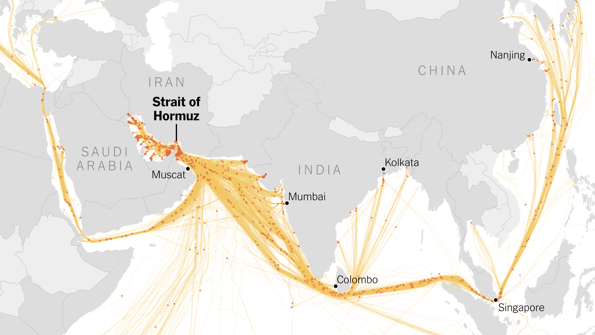
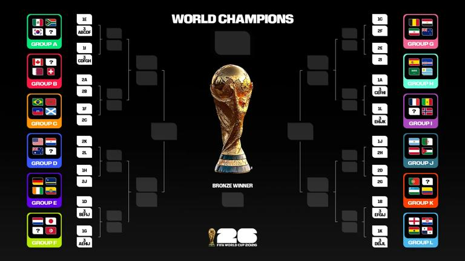
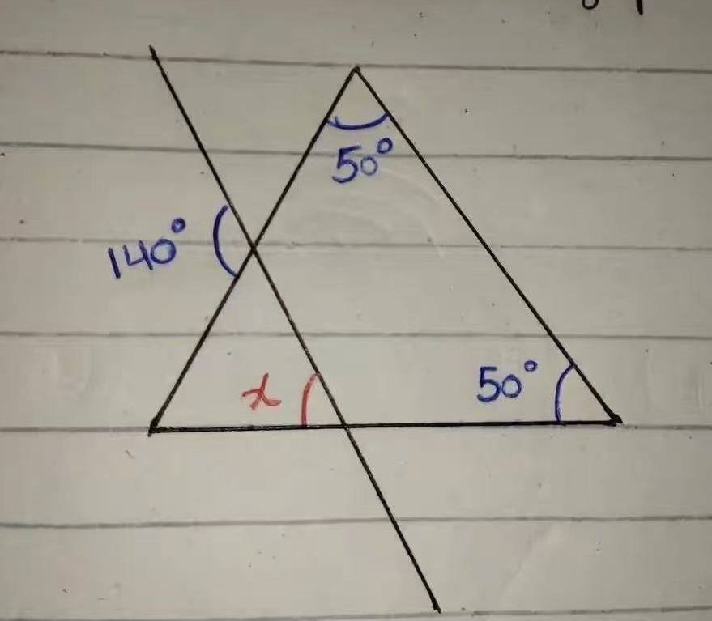
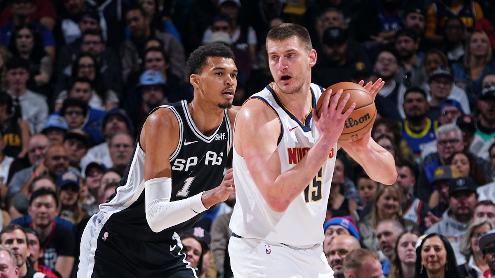
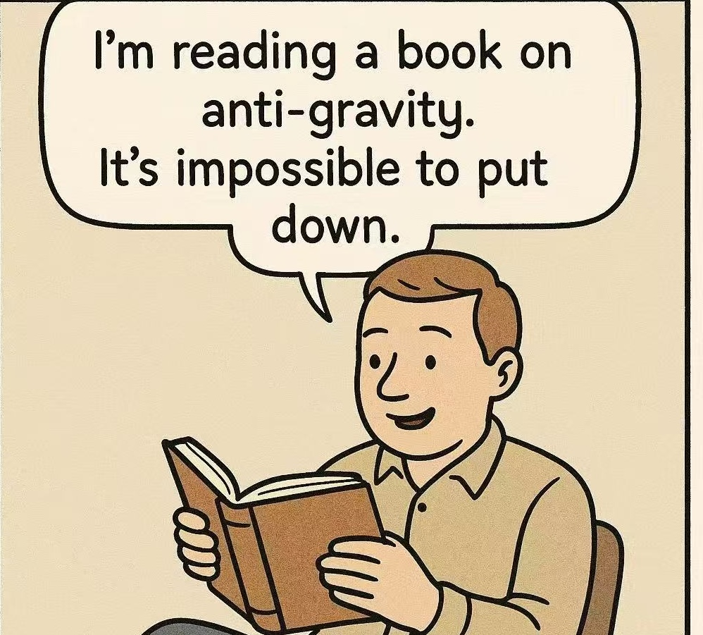

## Editor's Words

I've used many note-taking apps over the years, such as Evernote, Bear Note, Day One, Roam Research, Notion, and Obsidian. One criterion for me is that it must support the markdown format. 

If it doesn't support Markdown (like Evernote and Notion), it feels like wasting my time to write notes in those apps, as their data format is proprietary and very hard, if not impossible, to be exported to another platform. 

The recent development in AI underscored the advantages of Markdown. It can be easily read by machine and men, on any platform. It is very easy to write. It doesn't disrupt the flow of the mind. 

Every issue of the Sunday Blender is written and edited in Markdown. 

## Tech

**Obsidian** is a note-taking app built on a simple idea: your notes are just plain text files stored on your own computer, not locked inside someone else's cloud. Users organize thoughts, research, and ideas using links between notes, building what fans call a "second brain" — a personal knowledge base that grows over time. The app recently got a major endorsement when AI pioneer Andrej Karpathy — former AI director at **Tesla** and co-founder of **OpenAI** — revealed he uses Obsidian as the foundation for his personal research wiki, letting AI tools compile and organize hundreds of articles from his notes. Obsidian was founded during the **COVID** lockdown by two University of Waterloo alumni **Shida Li** and **Erica Xu**, who couldn't find a note-taking tool they liked. The company announced this week that its engineering team is expanding — from three people to four. The **Twitter** post went viral, racking up over `2 million` views, as the internet marveled at the math: a `$350-million` company, `1.5 million` active users, `2,000+` community plugins, zero venture capital funding, and a total staff of seven (plus a cat). For comparison, competitor **Notion** has `1,200` employees.

New app submissions to **Apple**'s **App Store** jumped `84%` in the first quarter of 2026 compared to a year ago, with roughly `235,800 `new apps added in just three months. The boom reverses a years-long decline — submissions had actually dropped `48%` between 2016 and 2024. The driving force: "vibe coding" tools like **Anthropic**'s **Claude Code** and **OpenAI**'s **Codex**, which let people with little or no programming experience build working apps using plain English. But the flood has created problems. Apple removed several vibe coding apps in March, and developers have reported longer review wait times. Apple says it still processes `90%` of submissions within 48 hours.

AI company **Anthropic** — the maker of **Claude** — announced this week that its new model, **Mythos**, is so good at finding security flaws in software that it won't be released to the public. In testing, Mythos autonomously discovered thousands of previously unknown vulnerabilities in every major operating system and web browser — bugs that had been missed by the world's best human experts and millions of automated tests for decades. The most striking example: a 27-year-old flaw in **OpenBSD**, an operating system famous for its security. Just two data packets could crash any server running it. Mythos found the bug, confirmed it, and built the attack — all for under `$50` in computing costs. One researcher said: "I've found more bugs in the last couple of weeks than in the rest of my life combined." Rather than releasing Mythos publicly, Anthropic launched "**Project Glasswing**," sharing it with **Apple**, **Google**, **Microsoft**, and other tech giants to patch these flaws before hackers find them. Over `99%` of the vulnerabilities remain unpatched.

## Global

**Nantucket** is a small island about `50` kilometers off the coast of **Massachusetts** in the northeastern United States. Once the whaling capital of the world — it inspired **Herman Melville**'s famous novel *Moby-Dick* — the island is now known for its charming shingled cottages, cobblestone streets, and pristine beaches. It is one of America's most exclusive summer destinations, where homes can sell for tens of millions of dollars. But the ocean is swallowing the land. Along **Sconset Bluff** on the island's eastern shore, some homes have lost over `200` feet of ground to erosion — cliffs that once seemed permanent are crumbling into the sea, accelerated by rising sea levels and increasingly powerful storms. Some homeowners have spent millions physically moving their houses further inland. Others funded giant sand-filled tubes along the shoreline to slow the waves. A 2021 study found that by 2070, erosion and flooding could cause `$3.4 billion` in damage across the island each year. Nantucket is far from alone — coastlines around the world are facing the same threat.

## Economy & Finance

Gas prices in the United States crossed `$4 `per gallon in early April for the first time since August 2022. As of April 8, the national average stood at around `$4.16` — up about `26%` compared to a year ago. Prices surged roughly `20%` in just one month, driven by conflict in the Middle East. **The Strait of Hormuz** — a narrow waterway between Iran and Oman through which roughly `20%` of the world's oil passes — has been repeatedly closed and reopened amid tense negotiations. Prices vary widely by state. **California** leads at `$5.89` per gallon, while **Oklahoma** pays the least at `$3.27`. Analysts expect prices could climb further in the weeks ahead.

## Nature & Environment

Every spring, cherry blossoms (桜, sakura) sweep across Japan from south to north. This week, they reached peak bloom around **Mount Fuji** — about 7 to 10 days later than Tokyo, due to the higher elevation. At **Lake Kawaguchiko**, hundreds of cherry trees line the northern shore, their soft pink petals framing Japan's most iconic mountain across still water. Nearby at **Arakurayama Sengen Park**, visitors climb 398 stone steps to see the famous view: a five-story red pagoda, cherry blossoms, and snow-capped Fuji all in one frame. At night, the trees are lit up with lanterns until 9 p.m. The season is breathtaking but brief — the blossoms last only about a week before the petals scatter in the wind, a moment the Japanese call sakura fubuki (桜吹雪) — cherry blossom blizzard.

## Science

**NASA**'s **Artemis II** mission splashed down safely in the Pacific Ocean off San Diego on the evening of April 10, ending a 10-day journey around the Moon. The four astronauts launched on April 1 and flew around the far side of the Moon on April 6, breaking the record for the farthest any human has ever traveled from Earth — `252,757` miles. It was the first crewed mission beyond Earth orbit since **Apollo 17** in 1972, and a mission of firsts: the crew included the first woman, first person of color, and first non-American to travel this far into space. Millions watched the splashdown live, including on Netflix. Next up: **Artemis III**, which aims to land astronauts on the lunar surface.

Australian scientists have built the world's first working quantum battery — a tiny device that stores energy using the strange rules of quantum physics instead of ordinary chemistry. The prototype is charged wirelessly by a laser. Its most remarkable property: unlike regular batteries, which take longer to charge as they get bigger, this quantum battery actually charges *faster* as more molecules are added to it. The molecules don't act independently — they behave collectively through quantum effects. The device is still tiny and holds its charge for just nanoseconds. But the lead scientist compared it to the **Wright brothers**' first flight: the plane barely flew, but it proved something revolutionary was possible.

## Math

**The 2026 FIFA World Cup** kicks off on June 11 in the United States, Canada, and Mexico — the biggest World Cup ever, with 48 teams. The teams are split into 12 groups of 4. Each team plays 3 matches (one against every other team in the group). A win earns 3 points, a draw earns 1 point, and a loss earns 0. The top 2 teams in each group advance to the knockout round. The top 2 teams in each group advance to the knockout round. But here's a new twist for 2026: the 8 best 3rd-place teams also go through, making a Round of 32.

> Question 1: each group has 4 teams, and every team plays every other team once. How many total matches are played in one group?

> Question 2: if a team has 2 wins and 1 loss, can it advance to the next round for certain? 

> What is the angle X?

## Lifestyle, Entertainment & Culture

**Easter weekend** begins with **Good Friday**, which this year falls on April 3. It marks the day Christians believe **Jesus Christ** was crucified. Two days later, Easter Sunday celebrates his resurrection — the most important event in Christianity. The date shifts each year, following an ancient formula tied to the first full moon after the spring equinox. Traditions vary widely. Many families attend church, share festive meals, and enjoy a long weekend. Children hunt for colored eggs and chocolate left by the "Easter Bunny" — customs rooted in older European spring fertility symbols rather than the Bible. In Britain, spiced fruit bread rolls called hot cross buns, marked with a white cross representing the crucifixion, are a beloved Good Friday tradition.

**The Masters** tournament is underway this week at **Augusta National Golf Club** in Georgia — and if you attend, don't bring your phone. Augusta is one of the last major sporting events on Earth where cell phones, cameras (on tournament days), laptops, and tablets are all banned. Fans — called "patrons" — must leave devices behind before entering. Free courtesy phones are available on the course for anyone who needs to make a call. The rule exists to keep everyone focused on the golf, not their screens. Violators are removed immediately — even former champion **Mark Calcavecchia** was escorted out by security guards this week for using his phone. In a world where almost every moment is filmed and shared, Augusta offers something increasingly rare: a place where thousands of people simply watch, listen, and enjoy what's happening right in front of them, living the moment to the fullest. 

## Sports

[Cycling] **Tadej Pogačar** won the **2026 Tour of Flanders** on April 5, tying the all-time record with his third title. The 278-kilometer race through Belgium's rain-soaked countryside delivered the showdown fans had been promised: **Pogačar**, **Mathieu van der Poel**, **Remco Evenepoel**, and **Wout van Aert** — four of cycling's biggest stars — battled through punishing cobblestone climbs all afternoon. But Pogačar was a class above. He launched a decisive solo attack on the final hilltop stretch, dropping van der Poel and crossing the finish line alone in Oudenaarde, `34` seconds clear. Evenepoel took third on his race debut; van Aert finished fourth.

[Soccer] **Erling Haaland** scored three goals in just 18 minutes as **Manchester City** demolished **Liverpool** `4–0` in the **FA Cup** quarterfinal on April 4. Liverpool actually started well and had early chances, but the match turned when Virgil van Dijk clumsily fouled Nico O'Reilly in the box. Haaland converted the penalty, then headed in a second just before halftime. Antoine Semenyo made it three early in the second half, and Haaland completed his hat-trick shortly after. To make things worse, Mohamed Salah — playing his first match since announcing he will leave Liverpool this summer — had a penalty saved. City advance to the semifinals for a record eighth straight year.

[Table Tennis] Chinese table tennis star **Wang Chuqin**, the current world number one, claimed his first-ever World Cup singles title on April 5 in Macao. The 25-year-old defeated Japan's 18-year-old **Sora Matsushima** `4–3` in a gripping seven-game final that swung back and forth — Matsushima even led 3–2 before Wang fought back to take the last two games. Wang was the only Chinese men's player to reach the quarterfinals, surviving tough matches all week. The title fills the last gap in his major trophy collection: he now holds the World Championship, Olympic gold (mixed doubles and team), and World Cup. Only an Olympic singles gold remains.

[Snooker] Chinese snooker star **Zhao Xintong** defeated world number one **Judd Trump** `10–3` on April 5 to win the **Tour Championship** in Manchester. The victory made Zhao the first player ever to sweep all three Players Series events — the **World Grand Prix**, **Players Championship**, and **Tour Championship** — in a single season. It was his sixth ranking title, and remarkably, he has never lost a final. Just two years ago, Zhao's career was in doubt after a 20-month ban for a match-fixing investigation. Since returning to competition last season, the 29-year-old has been unstoppable — winning the 2025 World Championship to become Asia's first world snooker champion. He now heads to the **Crucible** in Sheffield later this month to defend that title.

[NBA] The NBA's two most dominant big men delivered an instant classic on April 4 when **Nikola Jokić**'s **Denver Nuggets** edged **Victor Wembanyama**'s **San Antonio Spurs** `136–134` in overtime. Jokić finished with `40` points, `13` assists, and zero turnovers — the first center in NBA history to hit those numbers in a single game. Wembanyama, just 22, answered with `34` points, `18` rebounds, and `5` blocks. The Spurs led by 11 in the fourth quarter, but Jokić took over down the stretch, sealing the win with his signature "Sombor Shuffle" fadeaway over Wembanyama's 2.4-meter reach. The two MVP candidates meet again on the season's final day, April 12 — and could face each other in the playoffs.

## This Day in History

On **April 11, 1970**, **NASA** launched **Apollo 13** from Cape Canaveral, Florida, sending three astronauts toward the Moon. It was supposed to be the third lunar landing mission. But 56 hours into the flight, an oxygen tank exploded, crippling the spacecraft's power and life support systems. The crew radioed the now-famous words: "Houston, we've had a problem." They never reached the Moon. Instead, they squeezed into the tiny lunar module — designed for two, not three — and used it as a lifeboat for the long journey home. With Mission Control working around the clock, all three splashed down safely six days later. The mission became known as a "successful failure," and was later made into a hit 1995 Hollywood film starring Tom Hanks, showcasing one of NASA's finest moments.

## Art of the Week

**Wu Guanzhong** (1919–2010) was one of China's most important modern painters. Born in Yixing, Jiangsu province — in the heart of the Jiangnan region — he studied art in Hangzhou before winning a government scholarship to study in Paris in 1947. When he returned to China, he spent his career blending what he had learned from Western styles like Impressionism and Fauvism with traditional Chinese ink-wash painting. His **Jiangnan** ("south of the river") paintings are among his most beloved works. Using simple geometric shapes — white rectangles for whitewashed walls, dark lines for roof edges, dots of green and red for foliage — Wu captured the quiet beauty of waterside villages in southern China. His scenes feel both abstract and deeply familiar: still water reflecting clustered houses, a stone bridge arching over a canal, swallows darting between rooftops. He painted these towns again and again, stripping away detail until only rhythm and feeling remained.

## Funny

---

## Previous Issues

---

April 05, 2026, **[To the Moon and Back](https://weekly.sundayblender.com/p/to-the-moon-and-back)**

March 22, 2026, **[The Future of SaaS Companies and Knowledge Workers](https://weekly.sundayblender.com/p/the-future-of-saas-companies-and-knowledge-workers)**

March 15, 2026, **[The Unstoppable Kimi](https://weekly.sundayblender.com/p/the-unstoppable-kimi)**

---

Thanks for reading! If you enjoy this newsletter, please share it with friends who might also find it interesting and refreshing, if not for themselves, at least for their kids.

