## Editor's Words

I have a pretty good relationship with the security guards of my compound. Occasionally when I left the compound in my Tesla after a brief parking, they would just buzz-lift the parking lot bar and let me out without charging any daily fees, sparing both from the bureaucratic procedures. It was a nice gesture.

That changed today as a new "smart" parking system was installed recently. 

My Tesla approached the bar and the monitor showed I should pay RMB30. The guard came over with a QR code on a piece of paper. I scanned it with my phone. The phone's connection was acting up and the payment transaction didn't seem to complete. Somehow the bar was lifted, so I drove through it. I realized this was an incomplete transaction and asked the guard what was going on. He said he thought I finished the payment so he manually buzz-lifted the bar. But now we're stuck. If I leave, he would be in a hole of RMB30 in the system. I said, can you give me the QR code to scan for payment again? He said, no, you can't. Your car already came out and the system doesn't flag there is any pending payment of any car. Seeing the bar is still hanging high in the air, I said, let me try to go backward and approach the bar from inside again. 

That sort of did the trick. I was not entirely sure. The guard gave me another QR code that seemed to allow me to transfer him the RMB30 without going through the official parking system. Anyway, I could make the payment and get out. We were both relieved, after this chaoic and confusing span of 5 minutes battling the system.

I'm sure in the future my exists from the compound's parking lot will be mechanical and deterministic, but I still miss the good old days when my pals could just exercise their own human judgment without the machine getting in the way.

Machines are just cold.

## Tech

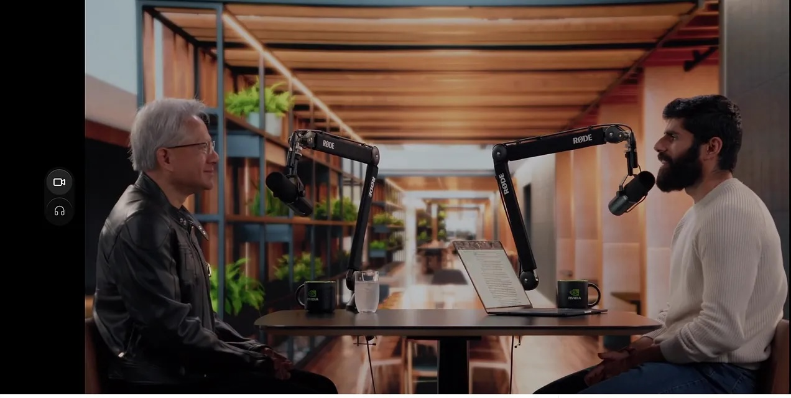

**Nvidia** CEO Jensen Huang went on the **Dwarkesh Patel** podcast this week and said something most Silicon Valley AI leaders won't touch: the US should let Nvidia sell its AI chips to China. His case: blocking the sales won't stop China from building AI — it just pushes Chinese companies to buy from **Huawei** instead, and Nvidia loses billions. He warned it would be "a horrible outcome" if **DeepSeek**, China's hottest AI startup, trained its next model on Huawei's Ascend 950PR chip instead of Nvidia's. The podcast set off a firestorm online — but Nvidia has already taken a `$4.5 billion` hit this year from US export restrictions.

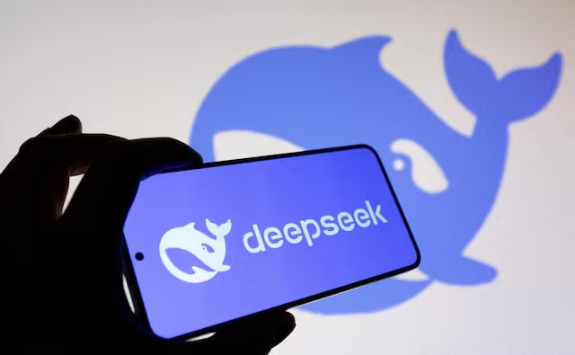

**DeepSeek**, the Chinese AI startup that shocked Silicon Valley last year with its low-cost R1 model, is raising outside money for the first time ever. The plan: at least `$300 million` at a `$10 billion` valuation. That's quite unusual for DeepSeek because it has spent its whole life turning down investors — it was bankrolled entirely by its parent hedge fund, **High-Flyer**. Why the change? Building top AI models is getting really expensive. DeepSeek suffered a 7-hour crash last month, and needs cash for more chips, bigger data centers, and to pay its engineers enough so they don't leave.

## Global

A 2-year-old wolf named Neukgu burrowed under a fence at O-World zoo in Daejeon, **South Korea** on April 8 and vanished into the countryside, kicking off a nine-day nationwide hunt that had the whole country glued to the news. More than `300` firefighters, police, and soldiers searched for him using drones, thermal cameras, and even recordings of wolf howls. Authorities once lost him on thermal camera while swapping a drone battery. Police got roasted online for releasing an obviously AI-generated photo of a wolf. A crypto meme coin was launched in his honor. He was finally tranquilized and safely returned on April 17.

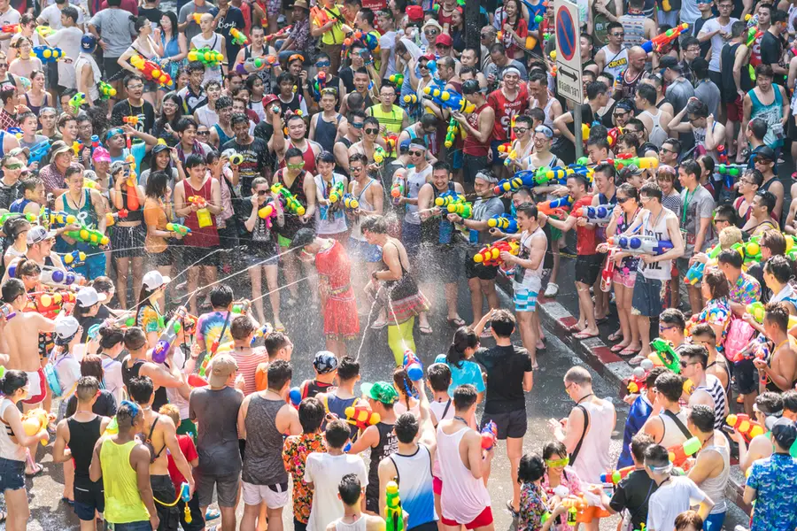

**Songkran**, the Thai New Year, is famous as the world's biggest water fight — a three-day festival where people soak each other with water guns and buckets on the streets. But it also has a grim nickname: the "Seven Dangerous Days." This year, from April 10 to 16, **Thailand** recorded `242` deaths and `1,242` road accidents across the country. Speeding and drunk driving were the top causes, and motorcycles were involved in `65%` of crashes. Thai authorities run a huge annual safety campaign, but the tradition of celebrating with alcohol makes the roads especially dangerous.

## Economy & Finance

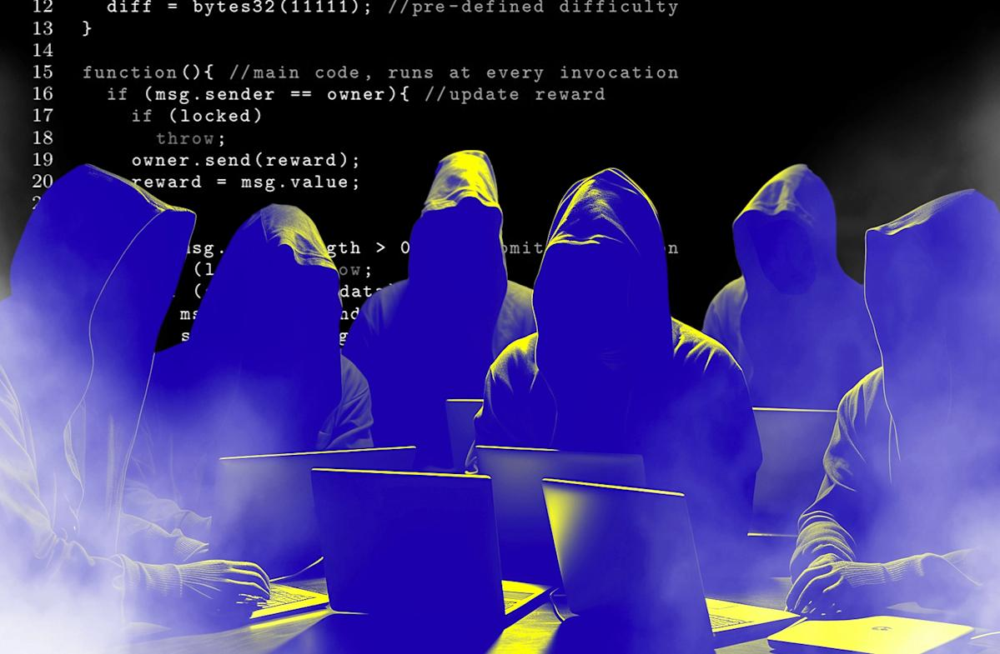

A hacker just pulled off the biggest DeFi heist of 2026. On Saturday, someone tricked a crypto protocol called **Kelp DAO** into handing over `$292 million` worth of a token called `rsETH`. Then they took that stolen token to **Aave**, the biggest lending protocol in crypto, and used it as collateral to borrow another `$236 million` in real `Ethereum`. Think of it like forging a fake gold bar, walking into a pawn shop, and borrowing real cash against it. Panicked users yanked over `$5.4 billion` out of Aave in hours. The whole DeFi world is rethinking how safe cross-chain bridges really are.

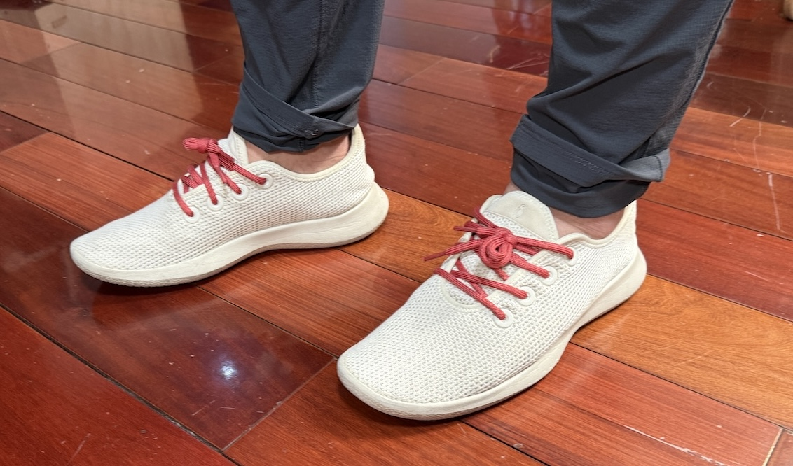
*photo credit by Brandonator*

**Allbirds**, the eco-friendly wool sneaker brand that was a Silicon Valley staple in the 2010s and worn by every investment guy with a **Patagonia** vest, is quitting the shoe business and pivoting to AI. The struggling company announced it will sell its sneaker brand to a licensing firm for `$39 million`, raise `$50 million` from an investor, and rebrand as "NewBird AI." The new plan: buy a bunch of GPU chips and rent out their computing power to AI companies. Wall Street loved it — the stock jumped over `500%` in a day. Allbirds was once valued at `$4 billion`. `

## Science

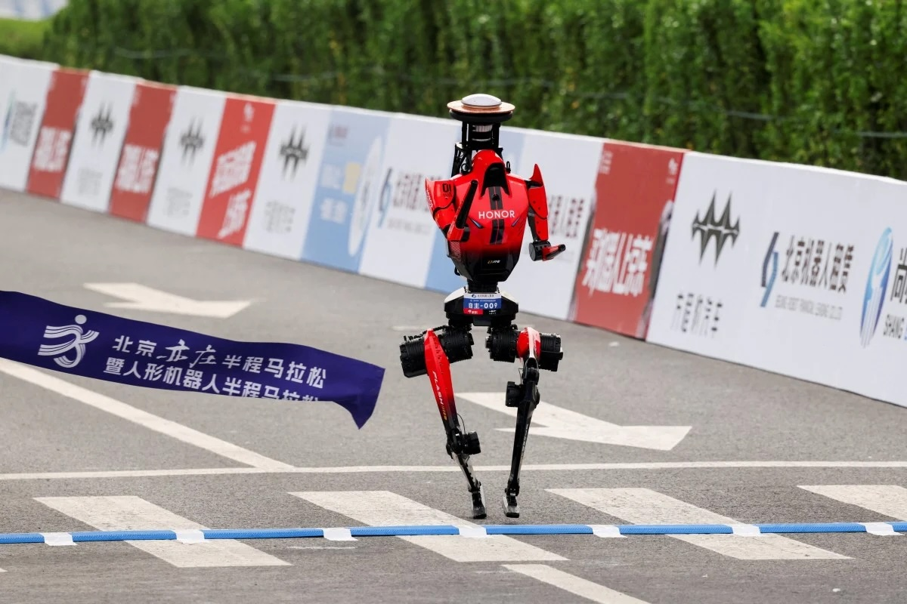

Over `100` humanoid robots raced alongside human runners in **Beijing** on Sunday in the world's second humanoid robot half-marathon. The winner, a robot named Lightning built by Chinese smartphone maker **Honor**, finished the 21-kilometer course in `50 minutes and 26 seconds` — faster than the current human world record of `57:20`. Last year's winning robot took over `2 hours and 40 minutes` and kept falling over. This year, the robots had legs designed to mimic elite human runners, and even used liquid cooling borrowed from smartphones. Honor's team swept all three podium spots, with Germany, France, and Brazil also competing.

## Math

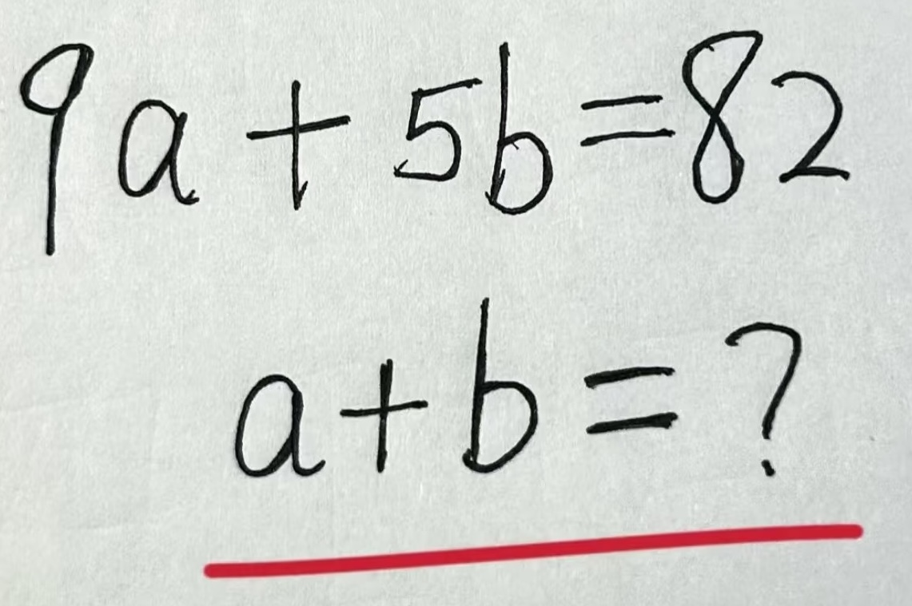

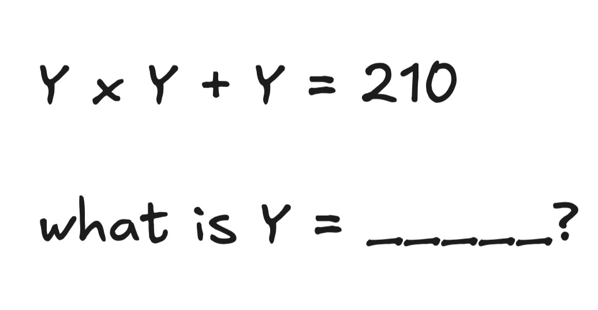

## Lifestyle, Entertainment & Culture

**Coachella** is one of the world's biggest music festivals, held every April in the California desert, where top pop stars, rappers, and DJs play to crowds of `125,000` a day. This year's headliners included **Sabrina Carpenter**, **Karol G**, and **Justin Bieber** — and Bieber's set left fans genuinely confused. In the middle of his show, the 32-year-old pop star sat down at a laptop, typed "baby" into YouTube, and sang along to his own old music video playing on the giant screen behind him — sometimes not singing at all. (The "Baby" video, released in 2010, has over `3.5 billion` views.) Bieber was reportedly paid `$10 million` — the highest fee in Coachella history. Critics called it lazy; defenders called it a clever statement about nostalgia and internet culture. **Katy Perry**, watching from the crowd, joked: "Thank god he has YouTube Premium, I don't wanna see no ads."

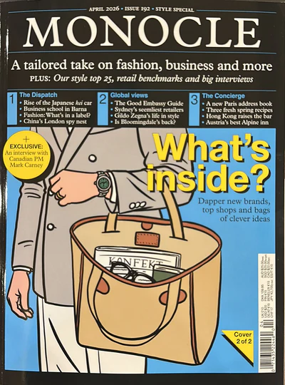

**Monocle**, the British lifestyle magazine famous for covering design, travel, and good coffee, is coming to Shanghai for the first time. From April 25 to June 30, it's opening a pop-up shop and café at the Jing An Kerry Centre, with furniture from Swiss brand **USM** and Shanghai-based **Stellar Works**. The magazine is also hosting its first-ever Entrepreneurs Live conference in China on April 29, bringing over `100` founders and business leaders together. Monocle was launched in 2007 by Canadian journalist Tyler Brûlé and is known for its thick glossy magazine, global city guides, and radio station broadcast from London.

British writer **Michael Rosen** just won the **2026 Hans Christian Andersen Award** for Writing, often called the "Little Nobel Prize" for children's books. Rosen, 80, is the author of the beloved *We're Going on a Bear Hunt* and has written over `200` books for kids across his 50-year career. He also wrote *Michael Rosen's Sad Book*, about the death of his son. You may also recognize his face from the internet — he's the "Noice" meme guy, whose wonderfully expressive delivery of the word "nice" in a 2013 children's poetry video went viral and has been turned into countless GIFs. Chinese illustrator **Cai Gao** won this year's prize for illustration — the first Chinese artist ever to win it.

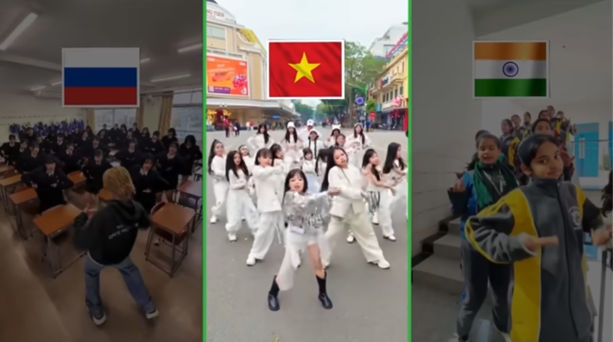

A song called "*No Batidão*" has been blasting out of **TikTok** for months. It's by two producers, ZXKAI and slxughter, who released it in September 2025. The song is in Portuguese and just 1 minute 29 seconds long — a mashup of Brazilian funk and phonk, a style of music built around heavy, distorted beats. What really made it explode was a slowed-down version that became the soundtrack to a viral dance challenge, with TikTokers everywhere copying its body-wave and footwork moves. The slowed version alone has racked up over `84 million` **Spotify** streams.

**Depeche Mode**, the English synth-pop band that helped invent the sound of modern electronic music, just teased a new round of 2026 tour dates, including stops in Berlin, Munich, and Hamburg. Formed in Basildon in 1980, the band's moody, synth-driven hits like "Enjoy the Silence", "Strangelove", and "A Question of Time" shaped how pop music sounds today — you can hear their influence in artists like **The Weeknd** and **Billie Eilish**. Their 1990 album **Violator** is considered a masterpiece, and "Personal Jesus" was later famously covered by **Johnny Cash**.

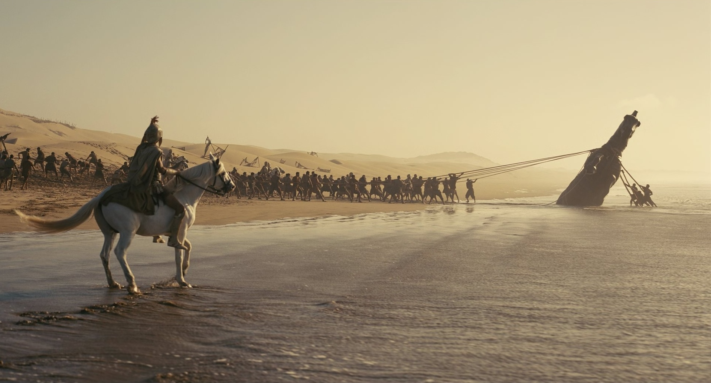

**Christopher Nolan**, the director behind *Interstellar* and *Inception*, is making a movie version of **The Odyssey** — the 3,000-year-old Greek epic poem by **Homer** about the hero **Odysseus**, who spends 10 years trying to get home from the Trojan War while battling one-eyed giants, sea monsters, and angry gods. At **CinemaCon 2026** — the Las Vegas trade show where Hollywood studios show off upcoming films to theater owners — Universal screened a scene of the Trojan Horse.  It's the first movie ever shot entirely on **IMAX** film cameras — a dream Nolan has chased since The **Dark Knight** in 2008, requiring IMAX to invent lighter, quieter cameras. Opens July 17, 2026.

## Sports

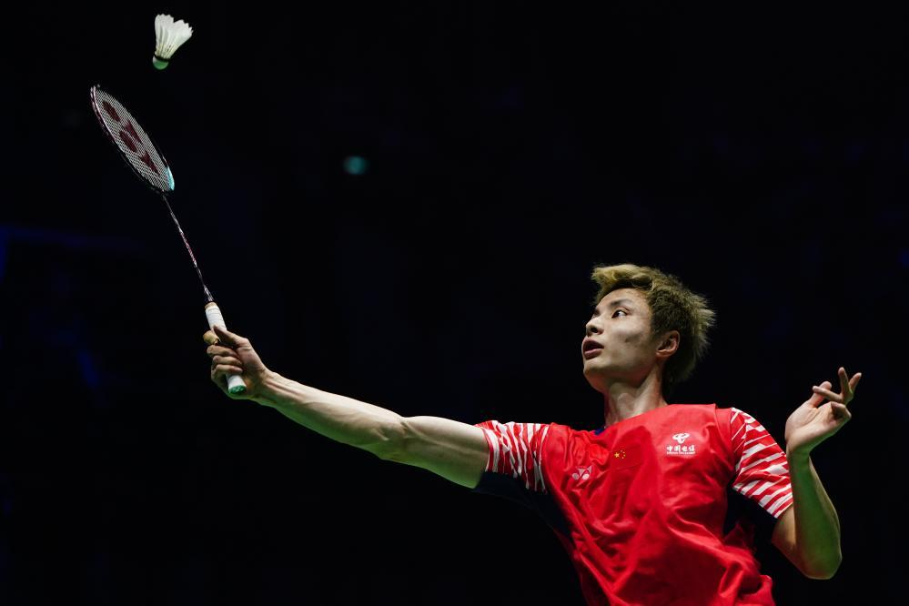

[Badminton] **Shi Yuqi**, China's world No. 2, won the **2026 Badminton Asia Championships** in Ningbo on April 12, beating India's 20-year-old **Ayush Shetty** `21-8`, `21-10` in the final. It took him just `41 minutes`. This was a title that had long eluded Shi — despite being the current world champion and having won nearly every other major tournament, including the All England Open and the BWF World Tour Finals. With this win, Shi is now just two trophies away from completing badminton's "Super Grand Slam" — the full set of 9 most prestigious titles in the sport. The missing pieces? Asian Games singles gold and Olympic gold. His next shot comes at the **2026 Aichi-Nagoya Asian Games** this September.

[Badminton] Denmark's **Viktor Axelsen**, one of the most decorated badminton players in history, announced his retirement on April 15 at age 32. Back injuries forced him out. Over his 16-year career, he won back-to-back Olympic gold medals at Tokyo 2020 and Paris 2024, two World Championship titles, and spent `183` weeks at world No. 1 — the third-longest run of all time. Standing `6'4"` with a giant wingspan, he redefined what a badminton player could do on court. Axelsen is also famous in China for speaking fluent Mandarin, which he began learning in 2014 to chat with his rivals and fans.

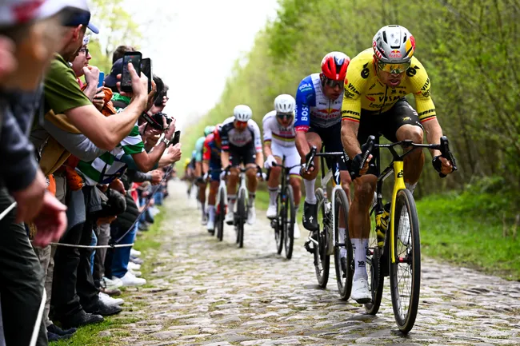

[Cycling] **Paris-Roubaix**, nicknamed "The Hell of the North," is one of cycling's oldest and most brutal races — a `258-kilometer` one-day race in northern France that includes `55 kilometers` of bone-rattling cobblestone roads. This year's edition on April 12 was one of the most thrilling ever. Belgian rider **Wout van Aert** finally won his first Paris-Roubaix after 8 years of trying, out-sprinting world champion **Tadej Pogačar** in a two-man dash inside the famous Roubaix velodrome. Both men had punctures along the way. The race was the fastest ever, averaging `48.91 km/h`. Van Aert dedicated the win to a teammate who died during the 2018 race.

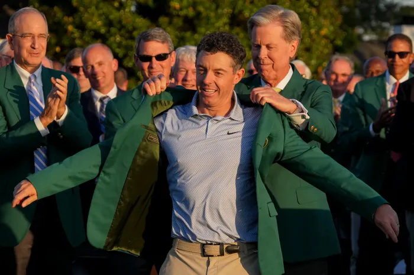

[Golf] **Rory McIlroy** won the **2026 Masters at Augusta National** on April 12, becoming just the fourth player ever to win golf's most prestigious tournament two years in a row — joining Jack Nicklaus, Nick Faldo, and Tiger Woods in the club. It wasn't easy. McIlroy had a massive six-shot lead heading into the weekend, then blew it with a disastrous third round that left him tied for first. He steadied himself on Sunday, shot a final-round 71, and beat Scottie Scheffler by one stroke. The Masters is held at the same course every year, and is famous for its strict traditions — no cell phones allowed on the course, and egg salad sandwiches still cost `$1.50`.

[Soccer] **Bayern Munich** beat **Real Madrid** `4-3` in an epic **Champions League** quarter-final in Munich on April 15, knocking the 15-time European champions out of the tournament. It was one of the greatest games in recent memory — seven goals, a red card, and two last-minute strikes. Madrid's 21-year-old Turkish star Arda Güler scored just 35 seconds in after Bayern's goalkeeper made a disastrous mistake. Harry Kane and Kylian Mbappé both found the net in a wild first half. But after Real's Camavinga was sent off in the 86th minute, Luis Díaz scored at 89' and Michael Olise added a stoppage-time gut-punch. Bayern now face defending champion **PSG** in the semifinals; **Arsenal** play **Atlético Madrid** in the other.

[Basketball] **The Golden State Warriors**, one of basketball's great dynasties of the last decade, will not be in the 2026 NBA Playoffs. On Friday, the **Phoenix Suns** beat them `111-96` in the final play-in game, ending their season. Legendary guard **Stephen Curry**, now `38` years old, could only manage `17` points on `4-of-16` shooting — a far cry from the sharpshooter who won four championships and two MVPs. It's the Warriors' first playoff miss since 2021. Curry is widely credited with transforming how basketball is played — his deadly long-range shooting made the three-pointer a weapon, and today every team, from kids' leagues to the pros, builds its offense around it.

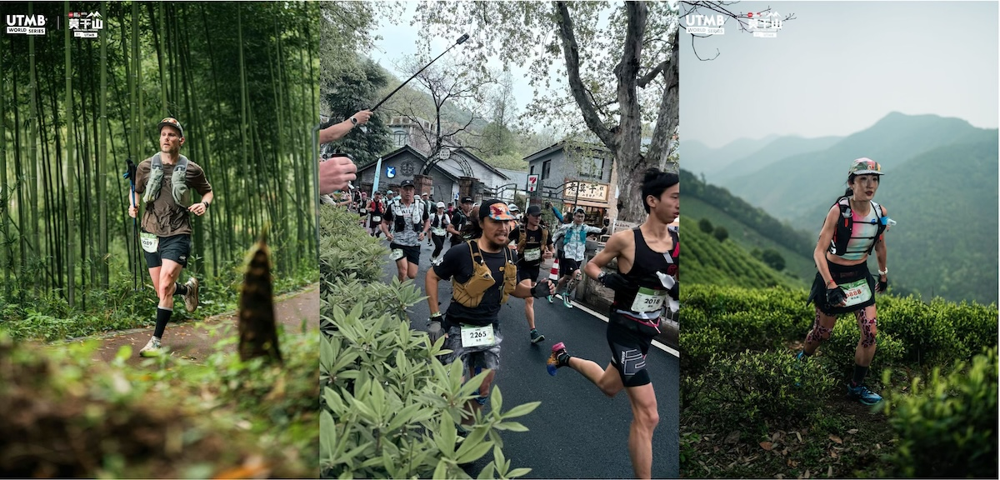

[Running] Shanghai's Moganshan mountains just hosted a brand-new race: **Ultra-Trail Mogan**, which debuted on April 10-12 as part of the **UTMB World Series** — the world's most prestigious circuit for trail running, sometimes called the "Olympics of ultra-running." Runners could pick from four distances: 20K, 50K, 100K, or a brutal 100-mile race that takes up to 32 hours to finish. The course winds through bamboo forests, tea terraces, and ancient stone paths. Moganshan gets its name from Gan Jiang and Mo Ye, a legendary couple from ancient China who, the story goes, forged the world's greatest swords right here `2,500` years ago.

## This Day in History

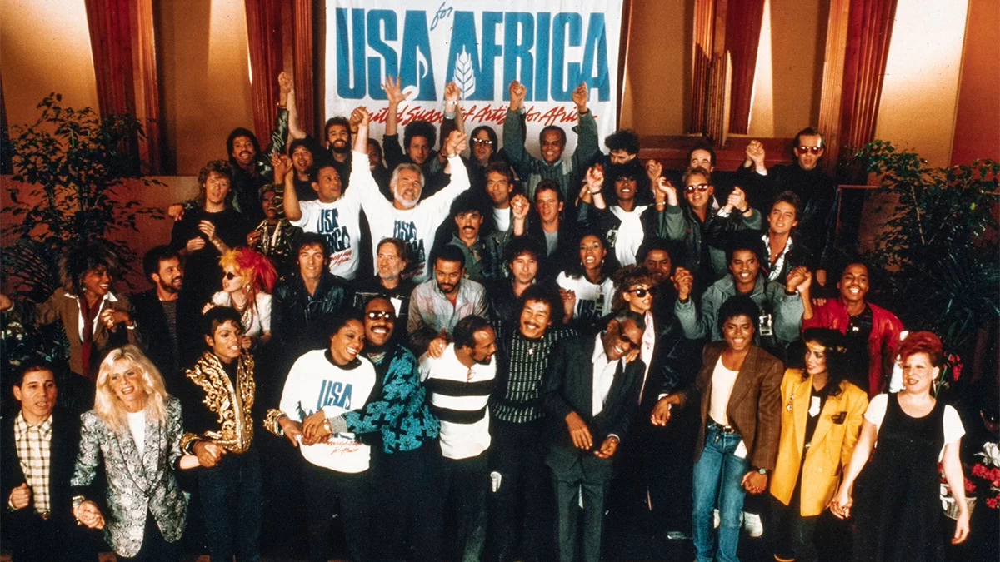

On **April 19, 1985**, "*We Are the World*" reached No. 1 on the **Billboard Hot 100**. The song was written by **Michael Jackson** and **Lionel Richie** to raise money for famine relief in Ethiopia, where millions were starving. On one night in January 1985, 46 of the biggest music stars in America crammed into a Los Angeles studio to record it. A sign on the door read: "Check your ego at the door." One huge name was missing though: **Prince**. He refused to sing, instead offering to play a guitar solo. Producer **Quincy Jones** was not amused. Huey Lewis took his part. The song raised over `$60 million` for Africa and became one of the best-selling singles ever.

## Art of the Week

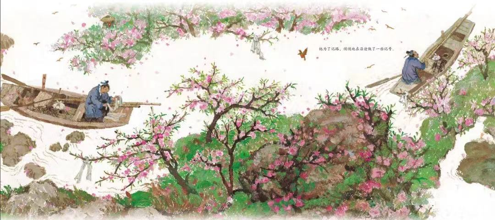

**Cai Gao**, the 79-year-old Chinese illustrator who just won the **2026 Hans Christian Andersen Award**, is known as "the grandmother of picture books" in China. Her most famous work is *The Story of the Peach Blossom Spring*, based on an ancient Chinese poem from the year 421 about a hidden utopia where people live in peace with nature. Cai blends classical Chinese ink painting, folk-art motifs, and impressionist colors into illustrations that feel both traditional and modern at once. She's also illustrated Chinese legends like Hua Mulan and Meng Jiangnü. Her work has been so popular in Japan that two illustrations appeared in Japanese school textbooks.

## Funny

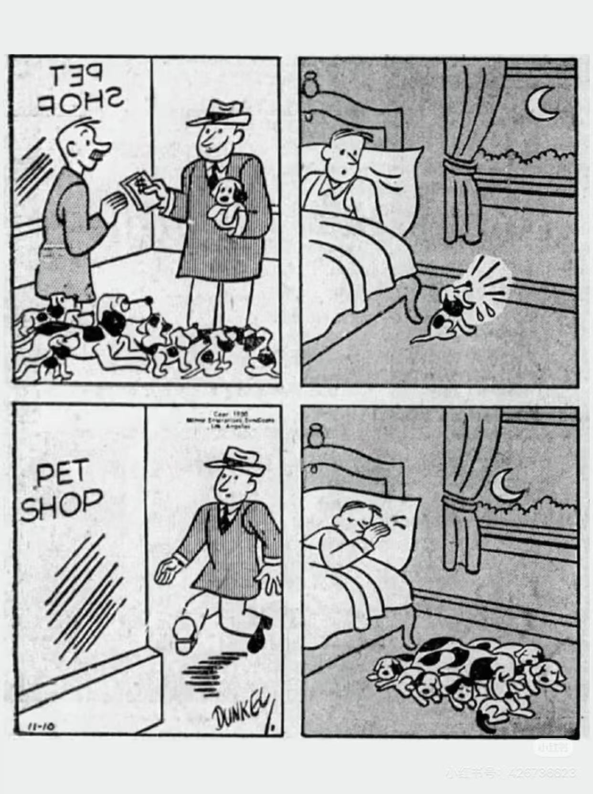

---

## Previous Issues

---

April 11, 2026, **[Build A Second Brain to Compound Knowledge Learning](https://weekly.sundayblender.com/p/build-a-second-brain-to-compound-knowledge-learning)**

April 05, 2026, **[To the Moon and Back](https://weekly.sundayblender.com/p/to-the-moon-and-back)**

March 22, 2026, **[The Future of SaaS Companies and Knowledge Workers](https://weekly.sundayblender.com/p/the-future-of-saas-companies-and-knowledge-workers)**

---

Thanks for reading! If you enjoy this newsletter, please share it with friends who might also find it interesting and refreshing, if not for themselves, at least for their kids.

