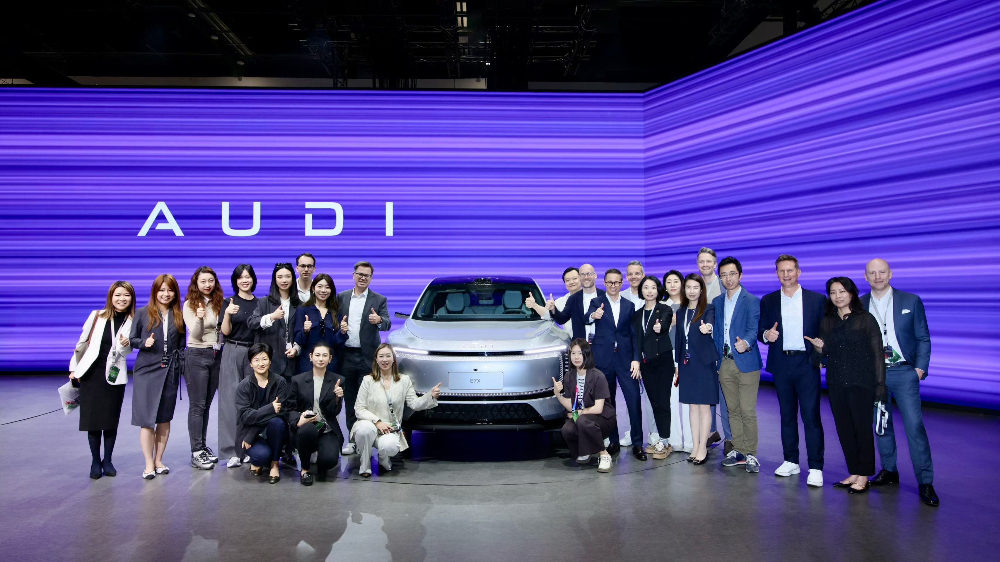
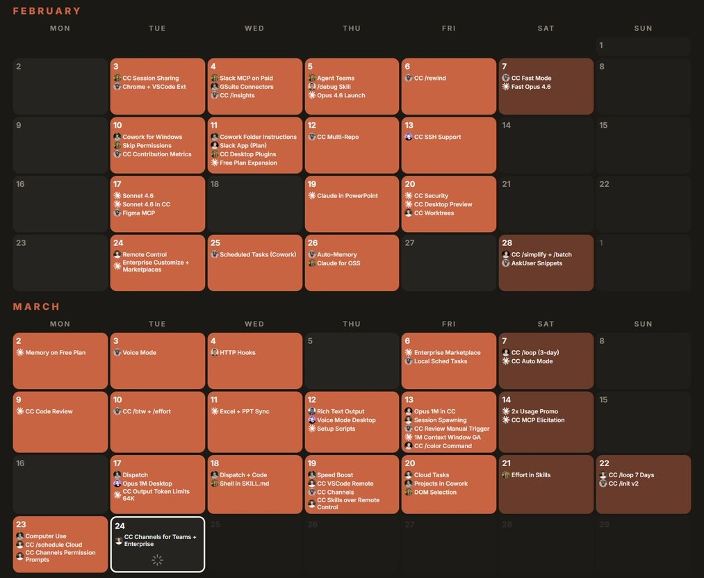
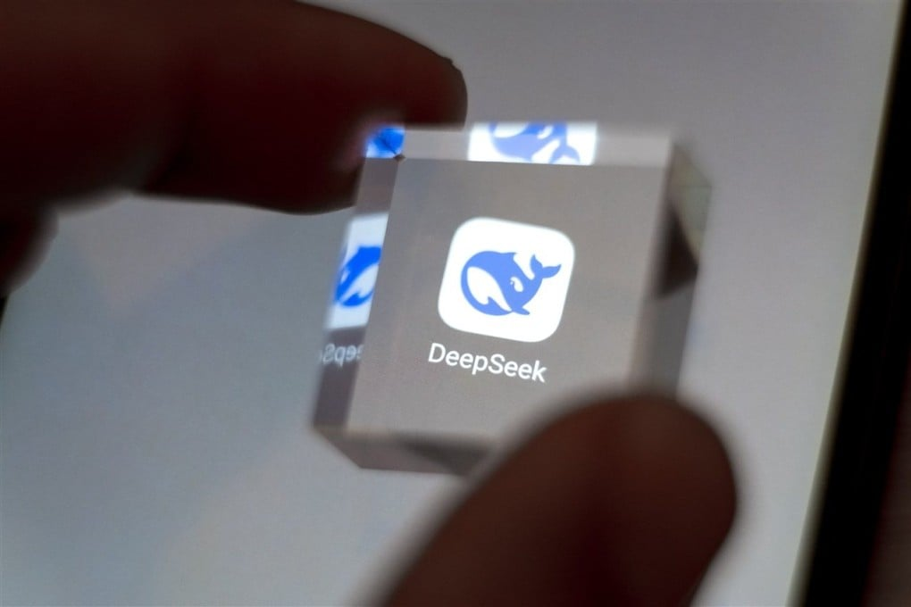
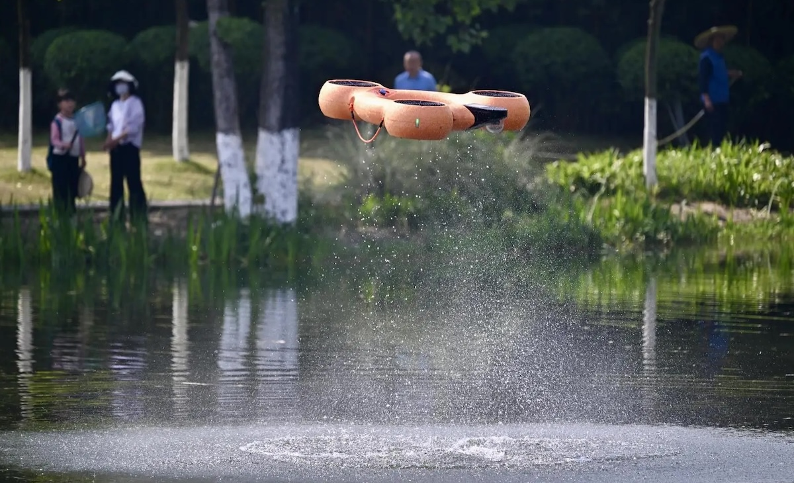
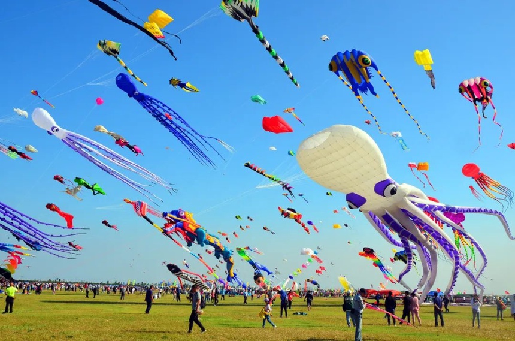
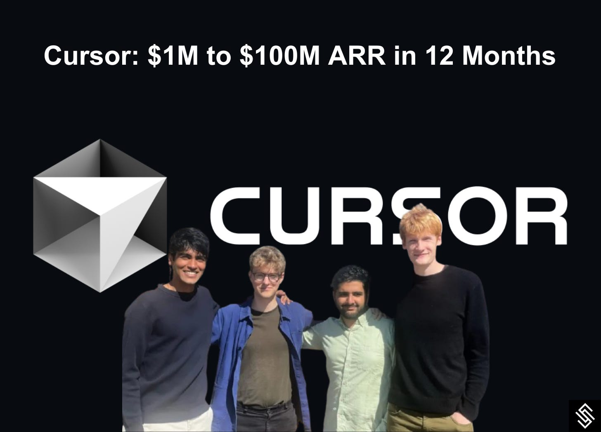
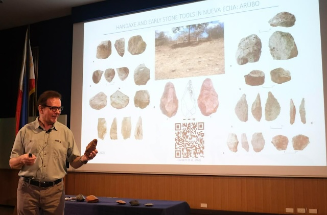
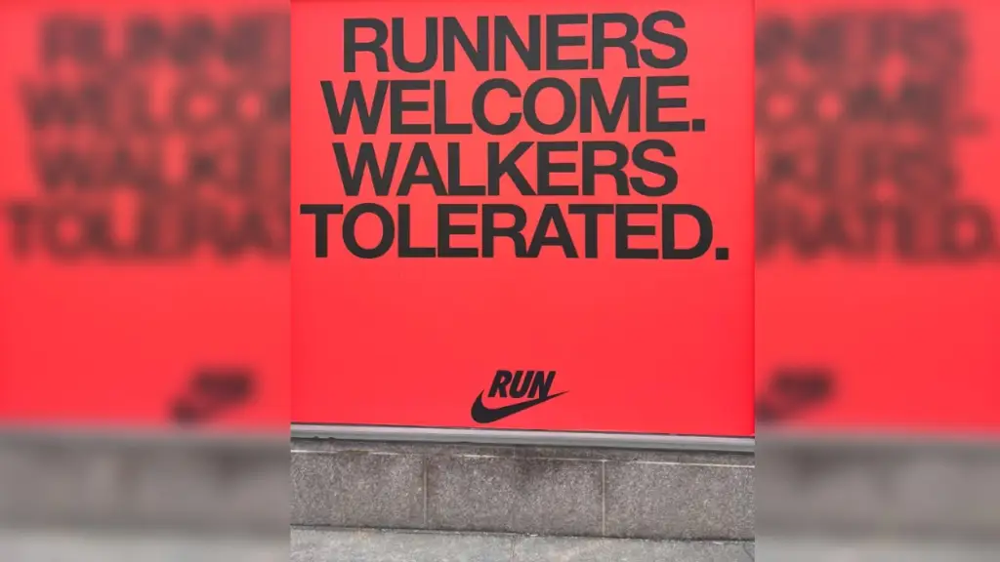
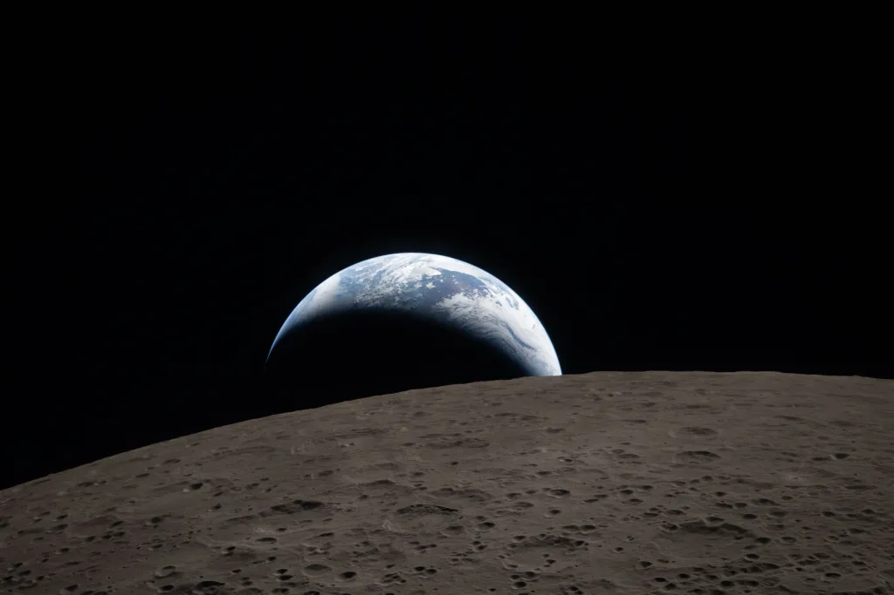

## Editor's Words

It was a beautiful weekend with great weather in Shanghai. Hope you all got out and enjoyed the sun.

## Tech

The **2026 Beijing International Auto Show** opened on April 24 and runs through May 3 — featuring `1,451` cars from `21` countries, including `181` world premieres. While auto shows in Europe, Japan, and the United States have been shrinking, Beijing's has become the world's biggest. German luxury brand **Audi** made a striking move: it unveiled the **AUDI E7X**, a fully electric SUV designed and built specifically for Chinese customers in partnership with Chinese carmaker **SAIC**. The car uses **Huawei**'s self-driving software and Chinese-made batteries from **CATL**. It is part of a broader shift where global brands are now building cars "in China, for China," instead of selling Chinese drivers their global models.

**Anthropic**, the American artificial intelligence company that makes the chatbot Claude, has been shipping new products at a record pace. A product analyst named Paweł Huryn recently counted every Anthropic release between February 1 and March 23 — and found that the company had launched `73` new products and features in just `52` days, more than one new product every single day. The releases included new versions of Claude itself, tools for AI agents that can complete tasks on their own, and add-ins for Microsoft Excel and PowerPoint. Investors have noticed: this week, private investors valued Anthropic at `$1 trillion`, briefly overtaking its rival OpenAI to become the most valuable private AI company in the world.

**iQiyi**, one of China's biggest streaming services, announced on April 20 that it had signed up over `100` actors for its new "AI artist library" — a digital system where AI can generate new scenes featuring an actor's face, voice, and body without the actor showing up on set. The company's CEO, Gong Yu, said live-action filming could one day become "intangible cultural heritage," like an old craft preserved in museums. The announcement sparked backlash online. Several well-known Chinese actors quickly denied ever signing AI agreements, and some sent legal teams to investigate. The hashtag "iQiyi has gone crazy" shot to the top of Chinese social media.

A Beijing-based startup called **Orbital Chenguang** has received `$8.4 billion` in credit lines from 12 major Chinese banks to build data centres — in space. Data centres are buildings filled with thousands of computers that power the internet, apps, and AI. On Earth, they use huge amounts of electricity, land, and water for cooling. Orbital Chenguang wants to put them in orbit instead, where sunlight is constant and space itself provides free cooling. The plan is to launch satellites that work together as a giant space computer, with the goal of building a full space data centre by 2035. Elon Musk's **SpaceX** has filed similar plans to launch up to one million solar-powered satellites for the same purpose.

**DeepSeek**, the Chinese AI company based in Hangzhou, released a preview of its newest model, DeepSeek V4, on April 24. The release continues a remarkable run for DeepSeek, which shocked the world in January 2025 when its R1 model matched top American AI systems despite being trained at a fraction of the cost — wiping nearly `$1 trillion` off global tech stocks in a single day.  V4 comes in two versions, Pro and Flash, and is "open source" — meaning anyone in the world can download it for free and run it on their own computers. What makes V4 a big deal is its low cost, with prices roughly one-sixth of leading American models like **OpenAI**'s GPT-5.5 and **Anthropic**'s Claude Opus 4.7. V4 is also designed to run on Chinese-made **Huawei** chips instead of US ones.

The world's first **International Drone Sports Games** kicked off on April 11 in Chengdu, China, and runs through April 25. Over `800` teams from multiple countries are competing in events you would not normally associate with drones — including weightlifting, fencing, basketball, and even equestrian (horse-riding) competitions. In drone basketball, multiple drones zip around mid-air, slamming a ball into a hoop. In drone fencing, drones identify and "tag" fast-moving targets. The closing event featured drones working together with robot dogs in a horse-riding-style course. Each event is designed to test real industrial skills like heavy lifting, precision, and team coordination.

## Global

[USA] Jamie Ding, a 33-year-old housing administrator and part-time law student from New Jersey, has just extended his winning streak on the American TV quiz show **Jeopardy!** to `30` games, earning nearly `$850,000`. Jeopardy! is a 60-year-old show where contestants answer trivia questions across history, science, literature, and pop culture — except that answers must be phrased as questions. Ding now ranks fifth all-time in both games won and money earned, behind legends like Ken Jennings, who holds the `74`-game record. To prepare, Ding borrowed stacks of books from his local library, took online trivia quizzes, practiced on a buzzer app, and watched old episodes.

[China] **The 43rd Weifang International Kite Festival** opened on April 18 in Shandong province, eastern China. Over four days, `260` teams from `57` countries flew more than `2,300` kites, including giant soft-bodied elephants, flying aircraft carriers, and robotic dogs soaring through the sky. Weifang is known as the "world capital of kites" — kites were invented in China around `2,400` years ago, and Weifang artisans have been making them for centuries. Modern makers now use carbon fibre to keep giant kites light, and AI software to test designs before building. The global kite-making industry is centred here: Weifang produces over `80%` of the world's kites.

## Economy & Finance

**SpaceX**, the rocket company owned by billionaire **Elon Musk**, announced on April 21 that it has signed a major deal with **Cursor**, a fast-growing AI startup that helps people write computer code by chatting with an AI. Under the deal, SpaceX can choose to buy Cursor outright later this year for `$60 billion` — or pay Cursor `$10 billion` to keep working together. That would be one of the biggest tech deals in history. Cursor was founded in 2022 by four **MIT** friends — Michael Truell, Sualeh Asif, Arvid Lunnemark, and Aman Sanger — who studied computer science and mathematics together. Two of them, Asif and Lunnemark, had competed in the **International Math Olympiad** as teenagers. They dropped out of MIT, joined **OpenAI**'s startup accelerator, and launched Cursor in March 2023. Less than four years later, their company is worth $60 billion — one of the fastest rises in software history.

## Nature & Environment

April 22 was **Earth Day** — an annual day, started in 1970, when people around the world celebrate the planet and think about how to protect it. To mark this year's Earth Day, **NASA**'s Kennedy Space Center launched a fun online tool called "Your Name in Landsat." Type in your name, and the tool builds it out of letter shapes found in real satellite images of rivers, mountains, lakes, coastlines, and forests around the world. It quickly went viral, with people posting their names and seeing exactly where on Earth each letter came from. The Landsat satellites have been photographing Earth from space since 1972. The one above is from Minecraft.

## Science

Researchers at **Ateneo de Manila University**, a leading Philippine college, have built a robot called ArchaeoBot to help dig up the country's ancient past. Recent discoveries show that people were living in the Philippine islands as far back as `35,000` years ago — and they were skilled seafarers who crossed open oceans, caught tuna and sharks, and traded with other islands. That is tens of thousands of years before Spain colonized the Philippines in `1565` and ruled for over three centuries, followed by nearly 50 years of American rule that ended in `1946`.

Scientists have discovered that giant octopuses up to `19 metres` (62 feet) long once ruled the oceans during the age of the dinosaurs, around `100 million` years ago. Researchers from Japan's Hokkaido University studied fossilised jaws of two extinct species, nicknamed "Cretaceous krakens" after the legendary sea monster. The wear on their beaks shows they crushed hard-shelled prey and even the bones of giant marine reptiles — making them apex predators, not just giant animals. Until now, scientists thought sharks and huge swimming reptiles like mosasaurs were the top hunters of the ancient seas. These octopuses may be the largest invertebrates ever discovered.

## Math

A rectangle is divided into four regions by four line segments, each starting at the midpoint of one of the rectangle's sides and all meeting at a single point inside the rectangle. Three of the regions have areas of 3, 4, and 5. What is the area of the fourth (shaded) region?

## Lifestyle, Entertainment & Culture

A new biographical film called *Michael* opens in theatres worldwide today, April 24. It tells the story of **Michael Jackson**, the "King of the Pop", who sold over `500 million` records with hits like "Beat It" and "Billie Jean" before his death in 2009. The role is played by Jackson's real-life nephew, Jaafar Jackson, in his acting debut. The film covers Jackson's life from his childhood in the **Jackson 5** through his 1980s superstardom, and has sparked fresh interest in his music among younger listeners who were not yet born when he died. Early reviews are mixed, but ticket sales are breaking records for musical biopics.

[Running] Sportswear giant **Nike** ran into trouble during last week's **Boston Marathon**, the oldest annual marathon in the world. In the days before the race, Nike put up a big sign at its store near the finish line that read "Runners Welcome. Walkers Tolerated." Runners and disability advocates quickly criticised the message as mean-spirited, since many marathoners walk parts of the 42-kilometre course — including athletes with injuries or disabilities who race in the adaptive division. Nike took down the sign, apologised, and replaced it with one that read "Movement is what matters." Notably, **Adidas** — not Nike — is the marathon's official sponsor.

## Sports

The 2026 **Laureus World Sports Awards** — often called the "Oscars of sports" — were held on April 20 in Madrid, Spain. Spanish tennis star **Carlos Alcaraz**, who finished 2025 ranked world No. 1 after winning the **French Open** and **US Open**, was named Sportsman of the Year. Belarusian tennis player **Aryna Sabalenka**, also the world No. 1 and the 2025 **US Open** champion, took the women's top prize. 17-year-old Spanish football star **Lamine Yamal** won Young Sportsperson of the Year, and French club **Paris Saint-Germain** won Team of the Year after sweeping six trophies. Slovenian cyclist **Tadej Pogačar** — hailed by many as the greatest of all time — was nominated but lost, while Chinese badminton world No. 1 **Shi Yuqi**, who won the 2025 World Championships, was not nominated at all. For the first time, the show was co-hosted by two athletes: Serbian tennis legend **Novak Djokovic** and Chinese-American freestyle skier **Eileen Gu**.

[Soccer] The second season of the Jiangsu City Football League — nicknamed "**Su Super**" — kicked off on April 11 in Changzhou, eastern China, with an opening ceremony that looked more like the Super Bowl halftime show than a sports event. Around `290` robots and robot dogs performed a synchronised dance routine, alongside `40` go-karts, `13` floating aerial screens, and a live performance by popular singer **Zhou Shen**. Over `40,000` fans packed the stadium. Tickets started at just `10` yuan and sold out instantly. . Su Super is a city-versus-city league made up of `13` teams representing Jiangsu province's 13 cities. Last season, it became an unexpected national phenomenon just as the Chinese men's national team was drawing criticism for another round of disappointing results. Fans say Su Super works because it strips football back to what people actually want: local pride, affordable tickets, honest effort on the pitch, and cities cheering for their own - even if that sometimes means the playful Su Super motto: "Game is No. 1, friendship is No. 14".

[Basketball] French basketball star **Victor Wembanyama** was named the **NBA**'s Defensive Player of the Year on April 20, making history as the first player ever to win the award unanimously — receiving all `100` votes from media judges. At just 22 years old, he is also the youngest winner ever. Known simply as "Wemby," the **San Antonio Spurs** center stands 7 feet 4 inches tall (`2.24` metres) and led the NBA this season in blocked shots. Teammates say opposing players often see him near the basket and choose not to shoot at all — changing how whole teams play without him even touching the ball. Last summer, Wemby made headlines for spending 10 days at the **Shaolin Temple** in China, where he shaved his head, wore monk robes, meditated, and practised kung fu alongside Buddhist monks to train his body and mind.

[Running] History was made at the **London Marathon** today, April 26, when Kenyan runner Sabastian Sawe became the first man ever to officially run a marathon in under two hours, finishing the 42.2-kilometre course in 1 hour, 59 minutes, and 30 seconds. A marathon is one of the most demanding races in athletics, and breaking two hours has long been considered one of running's holy grails. Sawe's time smashed the previous world record of `2:00:35`, set by Kenyan runner Kelvin Kiptum in 2023. In the women's race, Ethiopia's Tigst Assefa also broke her own world record, finishing in `2:15:41`.

[Baseball] **The New York Mets**, one of **Major League Baseball**'s most-watched teams, just snapped a 12-game losing streak — their worst slump in over two decades. Between April 8 and April 21, the Mets could not win a single game, scoring fewer than two runs in nine of those losses. Some joked about a curse — echoing the famous "*Curse of the Bambino*," when the **Boston Red Sox** went `86` years without a championship after selling star player **Babe Ruth** to the Yankees in 1919. The streak finally ended on April 22, with a 3-2 home win over the **Minnesota Twins**.

## This Day in History

This Sunday, April 26,  marks 40 years since the **Chernobyl** disaster — the worst nuclear accident in history. On that day in **1986**, a reactor at the Chernobyl nuclear power plant in Soviet Ukraine exploded during a safety test, releasing about `400` times more radioactive material into the air than the atomic bomb dropped on Hiroshima in 1945. A radioactive cloud drifted across much of Europe, and hundreds of thousands of people were evacuated. The nearby city of Pripyat, once home to `50,000`, remains abandoned inside a 30-kilometre "exclusion zone" that is still off-limits today. Surprisingly, wildlife has returned in large numbers, and scientists now study the zone as a rare accidental wilderness.

## Art of the Week

**NASA** released a stunning new image taken by the **Artemis II** astronauts on April 6, as they flew around the back of the Moon. The photograph shows a small blue Earth setting behind the rough, cratered grey surface of the Moon, with swirling white clouds visible over Australia. NASA describes the image as "reminiscent" of the famous Earthrise photograph taken by Apollo 8 astronaut Bill Anders 58 years ago, which inspired the very first Earth Day in 1970. Artemis II is the first crewed mission around the Moon since 1972, and the astronauts described seeing impact craters, ancient lava flows, and surface ridges as they passed.

## Funny

---

## Previous Issues

---

April 19, 2026, **[Robots Run Faster Than Humans Now](https://weekly.sundayblender.com/p/robots-run-faster-than-humans-now)**

April 11, 2026, **[Build A Second Brain to Compound Knowledge Learning](https://weekly.sundayblender.com/p/build-a-second-brain-to-compound-knowledge-learning)**

April 05, 2026, **[To the Moon and Back](https://weekly.sundayblender.com/p/to-the-moon-and-back)**

---

Thanks for reading! If you enjoy this newsletter, please share it with friends who might also find it interesting and refreshing, if not for themselves, at least for their kids.

