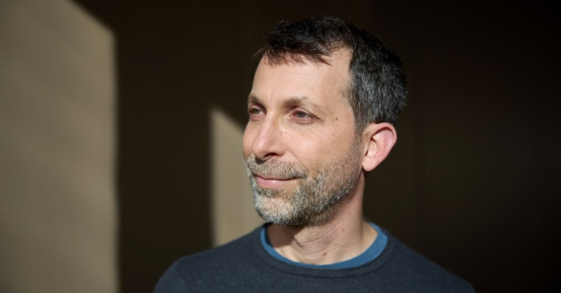
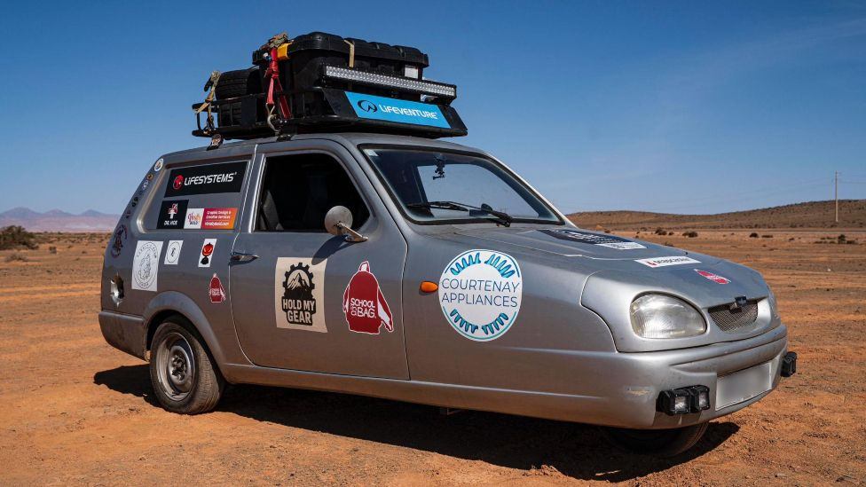
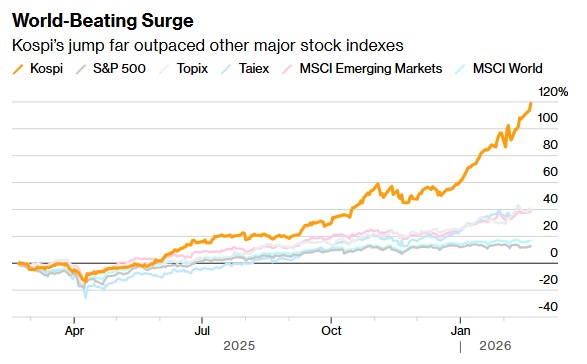
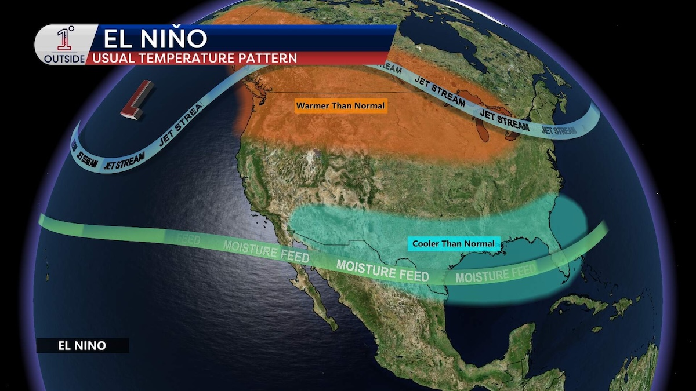
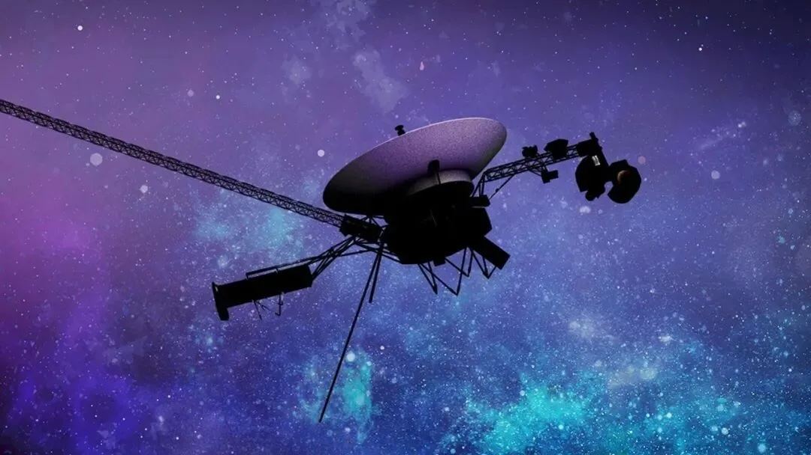
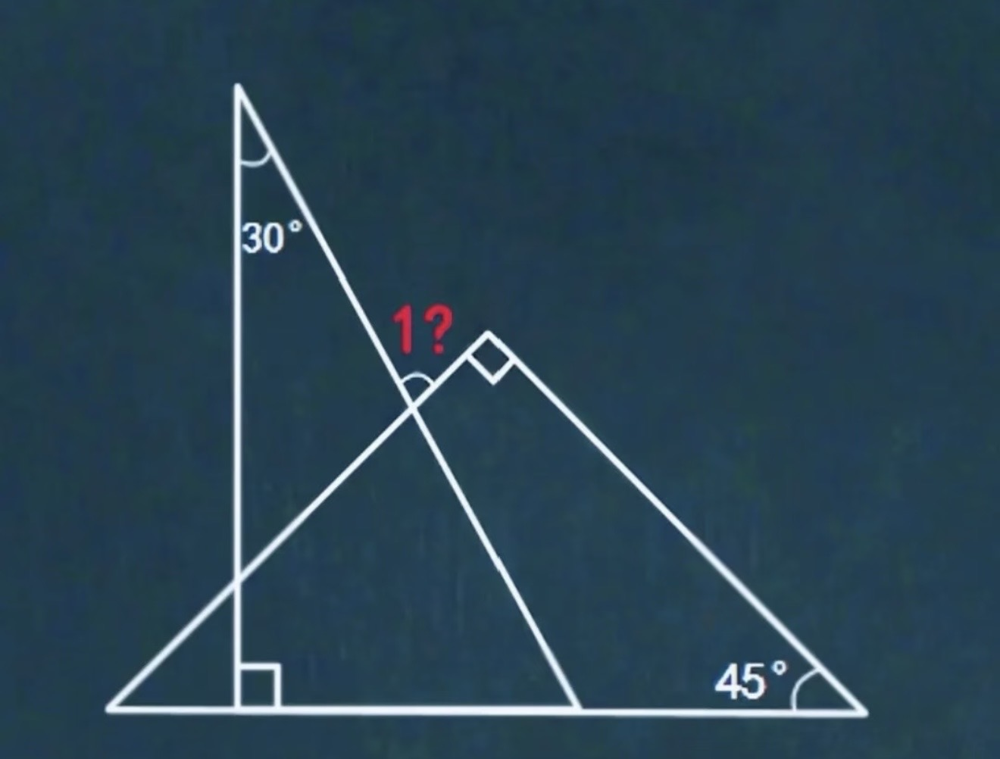
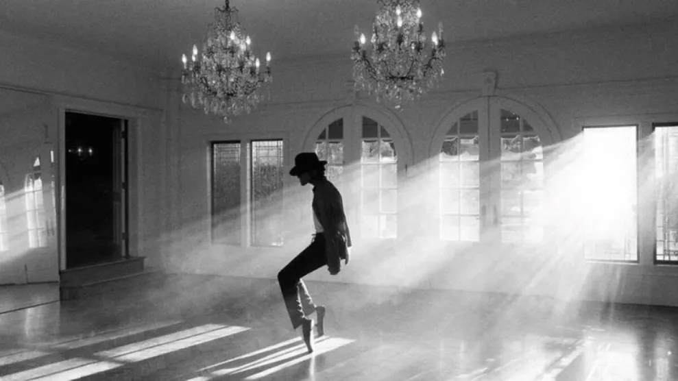
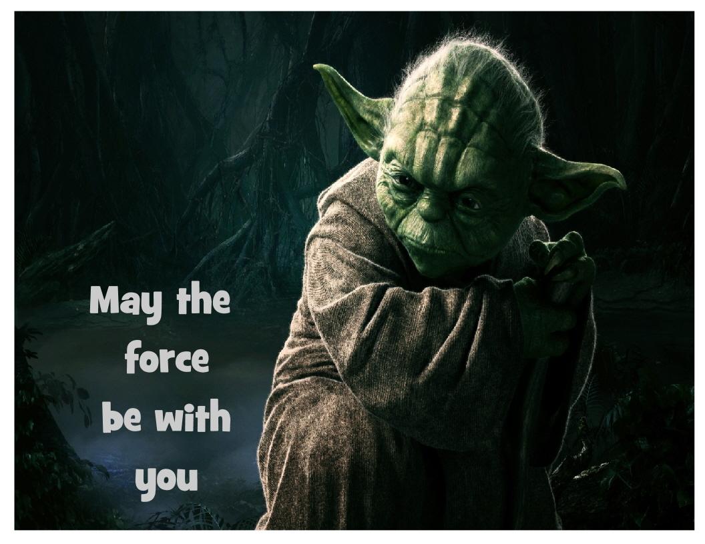
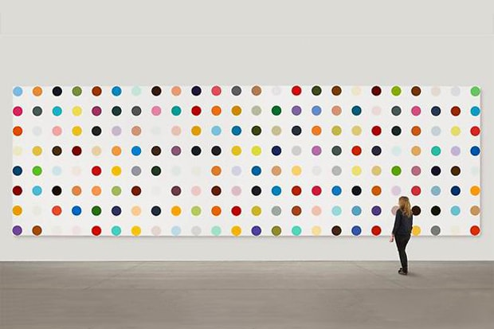
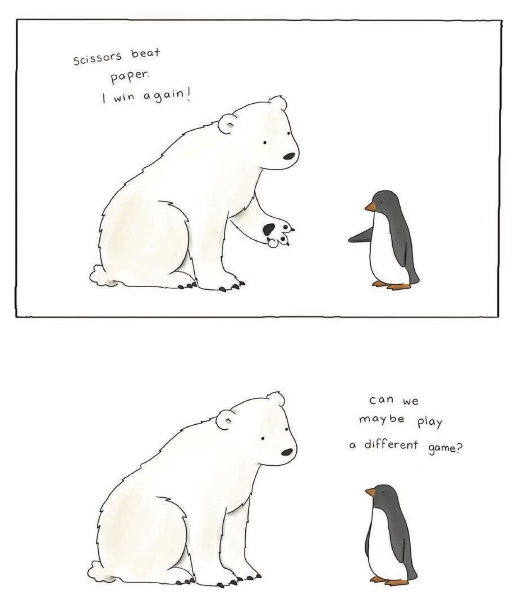

## Editor's Words

I was watching MJ's biopic "Michael" in Kerry Center's movie theatre. In the swimming pool scene, Michael is lying comfortably in a floater and one of his brothers asks him, what are you dreaming about Michael? 

Michael goes, I'm hoping God could give me more ideas and inspiration, otherwise they all go to Prince. 

I was LOLing loudly in the theatre. This writer is good. 

I'm a big fan to both MJ and Prince and have been to their live concerts (MJ's in Singapore and Prince's in Boston). It was a blessing to have lived through the 80's and 90's to witness the last breed of true superstars who redefined what music is and could be. 

And how interesting it is that MJ's music (especially *Beat It*) is enjoying a strong comeback in one of the prestigious international schools in Shanghai, among the 10-years olds.

## Tech

A new AI startup based in London has just raised `$1.1 billion` in seed funding — the very first round of money a startup raises from outside investors — at a `$5.1 billion` valuation. That makes it the largest seed round in European history. The company is called **Ineffable Intelligence**, and it was founded by David Silver, one of the most respected AI researchers alive. Silver led the team at Google **DeepMind** that built **AlphaGo**, the program that famously beat the world's best Go player in 2016. His new company will pursue a different approach to AI: building systems that learn from experience instead of from human-written text.

**Stripe** is one of the most important companies on the internet that you've probably never heard of. It builds the technology that lets businesses accept payments online — when you buy something from **Amazon** or **Shopify**, Stripe is often quietly running in the background. This week at its annual conference in San Francisco, Stripe announced `288` new products. What made it remarkable is that Stripe is now chasing three of the biggest prizes in tech all at once. First, AI: through partnerships with **Google**, **OpenAI**, and **Meta**, your AI chatbot will soon be able to shop and pay for things on your behalf. Second, crypto: Stripe expanded its stablecoin services to over `150` countries, letting businesses send digital dollars across borders almost instantly. Third, plain old finance: Stripe is now valued at `$159 billion`, making it one of the most valuable private companies in the world. Few companies are racing on all three tracks — and winning.

## Global

[China] In **Shaoxing**, a city in eastern China, an 8-year-old Iranian boy named Radin walked back into his classroom last week to a swarm of hugs from his Chinese classmates. He had been gone for more than three months. Radin left China in mid-January to visit Iran with his father, and told his teacher in late February he'd be back in about three weeks. Then conflict broke out in Iran, communication was cut off, and his classmates didn't hear from him for 42 days. The video of his return — kids running across the room to grab him — went viral across Chinese social media.

A `2,000-pound` sea lion named Chonkers has become **San Francisco**'s unlikeliest celebrity this spring. He showed up at **Pier 39**, a famous tourist dock, in mid-March and decided to stay. Chonkers is a Steller sea lion, a much bigger species than the California sea lions that usually lounge there — about twice their size, closer in build to a bear than a sea lion. When he hauls himself onto the dock, the smaller sea lions scatter to get out of his way. Crowds of over a hundred now gather every morning just to watch him sleep.

Englishman Ollie Jenks and his Canadian friend Seth Scott just set a **Guinness World Record** for the longest journey ever completed in a three-wheeled car. They drove a **Reliant Robin** — a tiny, wobbly British car from the 1970s, originally designed for short trips to the local grocery store — all the way from London to Cape Town, South Africa. That's `14,000 miles` across `22` countries, taking more than four months. They named the car Sheila. Even Sheila's original designer was reportedly too scared to drive her more than 20 miles. Things broke constantly: the engine had to be replaced in Cameroon, the gearbox in Ghana, and Sheila once had to be loaded onto a cattle truck after a breakdown. The pair drove through deserts, past elephants, alongside galloping giraffes, and even arrived in Benin during an attempted coup. Sheila will now be displayed in the **London Transport Museum**.

On April 28, **Guinness World Records** officially certified the **Huajiang Grand Canyon Bridge** in southwest China as the tallest bridge in the world. Its deck sits `626 meters` (about 2,054 feet) above the **Beipan River** below — high enough that the entire **Empire State Building** could fit underneath with room to spare. The bridge opened in September 2025 in Guizhou, one of China's most mountainous and historically isolated provinces. A drive that used to take two hours of winding mountain roads now takes just two minutes. China is now home to the world's seven tallest bridges, with three of them in Guizhou alone.

## Economy & Finance

South Korea's stock market is having an extraordinary year. The **KOSPI**, the country's main stock index (similar to the **S&P 500** in the US), started January 2026 at `4,300` and crossed `6,750` last week — a gain of more than `55%` in just four months. That kind of jump is rare for a major economy. The rally has been driven mostly by the global boom in artificial intelligence, since Korean firms like **Samsung Electronics** and **SK hynix** make the advanced memory chips that AI systems rely on. Some global investment banks now think the KOSPI could reach 8,000 before year-end.

## Nature & Environment

India is going through one of its hottest pre-summer stretches on record. Since mid-April, temperatures across the north and centre of the country have pushed past `45°C` (`113°F`), with some cities expected to top `46°C` (`115°F`) in the coming days. The India Meteorological Department, the country's official weather agency, has issued heat alerts across states including Rajasthan, Uttar Pradesh, Bihar, and Odisha. According to recent reports, `95` of the world's 100 hottest cities right now are in India. Schools have shortened hours, and farmers have been told to harvest wheat early before the heat ruins their crops.

Scientists are warning that a "Super El Niño" is likely to develop later this year, and it could reshape the world's weather into 2027. El Niño is a natural climate pattern that happens every few years when the surface of the Pacific Ocean near the equator gets unusually warm. That extra heat changes wind, rainfall, and storm patterns across the planet. A "Super" El Niño is the strongest version, with ocean temperatures more than `2°C` above normal. The expected impacts: heavier rain and flooding in California and South America, droughts and wildfires in Australia and Indonesia, a quieter Atlantic hurricane season, and 2026 likely setting another global heat record.

## Science

**Voyager 1** is a **NASA** spacecraft launched in 1977 — almost 49 years ago — and now the most distant human-made object in existence, more than `16 billion` miles from Earth in interstellar space (the region between stars). It runs on a tiny nuclear power source that loses about `4 watts` every year, so engineers have been switching off instruments one by one to keep the probe alive. On April 17, NASA powered down another one. The team's goal is to nurse Voyager 1 to its 50th birthday in 2027 and beyond, possibly into the 2030s, as it drifts deeper into uncharted space.

## Math

How much is the angle in red?

A 23-year-old named Liam Price, with no advanced math training, just helped crack a math problem that has stumped professional mathematicians for 60 years. He did it using **ChatGPT**. The problem was posed in the 1960s by **Paul Erdős**, one of the most famous mathematicians of the 20th century, and concerns a special type of number set. Price simply typed the problem into ChatGPT, and the AI produced a proof in about `80 minutes` — using a method no human had ever tried for this kind of problem. **Terence Tao**, one of the greatest living mathematicians, reviewed it and said the AI found a path that humans had collectively missed for decades.

## Lifestyle, Entertainment & Culture

The new **Michael Jackson** biopic, simply titled "Michael," opened in theaters on April 24 and immediately broke records. It pulled in roughly `$97 million` in the United States and `$218 million` worldwide in just its first weekend — the biggest opening ever for a music biopic, beating "Bohemian Rhapsody" and "Straight Outta Compton," and even topping last year's "Oppenheimer" for any biopic. The lead role is played by Jaafar Jackson, Michael's real-life nephew, who bears a striking resemblance to him. Critics gave the film mixed reviews, but audiences turned up anyway, drawn mostly by the music. A sequel is already being discussed.

Tomorrow is May 4, also known as **Star Wars Day**. The reason is a simple pun: "May the Fourth" sounds like "May the Force" — as in the famous Star Wars line, "*May the Force be with you*." Fans started making the joke as early as 1979, just two years after the first Star Wars film came out. It grew into an unofficial holiday over the decades, and **Disney** officially embraced it after buying **Lucasfilm** in 2012. Today, fans across the world dress up as Jedi, rewatch the films, and greet each other with "May the Fourth be with you."

## Sports

[Soccer] On April 28, **Paris Saint-Germain** beat **Bayern Munich** `5-4` in the first leg of their **UEFA Champions League** semifinal — the highest-scoring semifinal match in the tournament's history. The Champions League is the top club soccer competition in Europe, where the best teams from every country face off each year. The game in Paris was chaos from the opening minutes. Bayern's England striker Harry Kane converted a penalty in the 17th minute, and his teammate Michael Olise made it 2-1 to the visitors before halftime. Then PSG exploded. Georgia's Khvicha Kvaratskhelia and France's Ousmane Dembélé each scored twice, including two goals in three minutes after halftime to make it 5-2. Bayern refused to die — defender Dayot Upamecano and forward Luis Díaz pulled two goals back in three minutes. PSG, the defending champions, take a one-goal lead into the second leg in Munich next week.

[Rubik's Cube] In a small-town gymnasium in Falls City, Nebraska, 51 speedcubers gathered April 10–12 for the third annual **Nebraska Championship** — a Rubik's Cube competition sanctioned by the World Cube Association. Competitors raced through 17 events, from the classic 3x3x3 cube to puzzles solved blindfolded, one-handed, or with the fewest possible moves. Jayben Keene took the marquee 3x3 title with an average of `8.68` seconds across five solves. The weekend's standout, though, was Evan Liu, who won seven events including the 5x5, 6x6, 7x7, and an extraordinary blindfolded multi-cube round in which he memorized 15 cubes and solved 13 from memory in under an hour.

[Cycling] On April 26, two cyclists put on a show at **Liège–Bastogne–Liège**, one of the oldest and toughest one-day races in the world (about `260 km` through the Belgian Ardennes hills). The favorite, Slovenian world champion **Tadej Pogačar**, launched his usual brutal attack on the steep Côte de la Redoute climb. Most riders cracked instantly. But one stayed glued to his wheel: **Paul Seixas**, a 19-year-old French rookie sensation. The two opened a huge gap, climbing in lockstep. Pogačar eventually broke away in the final kilometers to win solo, but Seixas held on for second — announcing himself as cycling's next big star that could potentially challenge Pogacar's supremacy.

[Hyrox] A new fitness sport called **HYROX** is taking over New York City. HYROX is a race that mixes running with strength workouts: athletes run 1 kilometer, then do a tough exercise like sled pushes, rowing, or wall balls (throwing a heavy ball at a wall). They repeat that eight times. It started in Germany in 2017 and has exploded worldwide. Next month, NYC will host the largest HYROX event in North American history, with `50,000` athletes competing across eight days at Pier 76 on the Hudson River. Gyms across the city are filling up with people training for it, and HYROX has quickly become one of the fastest-growing sports in the world.

[Ice Hockey] For years, ice hockey has quietly become one of the most reliable ways for international students to get into top American universities. Many families at elite schools in Europe, Canada, and Asia have invested heavily in hockey training, knowing that a strong player can earn a spot at schools like **Harvard**, **Yale**, or **Michigan**. But last week the **NCAA**, which runs US college sports, announced a major rule change. A player's college eligibility clock will now start the year they turn 19 — regardless of when they actually enroll. The problem: school systems in Europe and Quebec don't line up with the American K-12 calendar, so many foreign students will arrive at college already having lost a year or two of eligibility before they've even played a game.

[NBA] The first round of the NBA playoffs is wrapping up, and it's been full of upsets. The defending Eastern Conference champion **Boston Celtics**, led by superstar Jayson Tatum, were knocked out in seven games by the #7 seed **Philadelphia 76ers**, powered by a healthy Joel Embiid. The **Denver Nuggets**, with three-time MVP Nikola Jokić, were eliminated by the **Minnesota Timberwolves**. Out west, French phenom Victor Wembanyama and his **San Antonio Spurs** cruised past Portland, LeBron James's **Lakers** beat the **Houston Rockets**, and the league-best **Oklahoma City Thunder** swept the **Phoenix Suns**. The **New York Knicks** also advanced, beating the **Atlanta Hawks**.

## This Day in History

On **May 3, 2002** — exactly 24 years ago today — the first **Spider-Man** movie hit theaters in the United States. Directed by Sam Raimi and starring Tobey Maguire as **Peter Parker**, the film was the first movie ever to make more than `$100 million` in a single opening weekend. It went on to earn over `$825 million` worldwide. Before Spider-Man, Hollywood treated comic book movies as risky and a bit silly. After it, every major studio rushed to make their own. Without Spider-Man's success, the Marvel Cinematic Universe (**Iron Man**, **the Avengers**, **Black Panther**) and the modern superhero boom probably wouldn't exist.

## Art of the Week

**Damien Hirst** is one of the most famous — and most controversial — living artists in the world. The British artist made his name in the 1990s with shocking works like a real shark preserved in a tank of formaldehyde. But his most recognizable series is much simpler: **the Spot Paintings**. Each one is a grid of perfectly round, brightly colored dots on a white background, with the rule that no two dots in a single painting can be the same color. Hirst started making them in 1986 and has produced over `1,400` since — though most weren't actually painted by him. He hires assistants to do the painting, which raises a real question: who's the artist?

## Funny

**Kenzaburō Ōe** was a Japanese writer who, as a child, told his mother he would one day win the Nobel Prize in Physics. He grew up, studied French literature instead of physics, and became one of Japan's most celebrated novelists. In 1994, he won the Nobel Prize in Literature. He proudly went to his mother and said, "See? I kept my promise. I won the Nobel Prize." Her reply: "No. You promised it would be in physics." 

Why is Six afraid of Seven?

Because Seven, Eight ("ate"), Nine

---

## Previous Issues

---

April 26, 2026, **[Game Is No. 1, Friendship is No. 14](https://weekly.sundayblender.com/p/game-is-no-1-friendship-is-no-14)**

April 19, 2026, **[Robots Run Faster Than Humans Now](https://weekly.sundayblender.com/p/robots-run-faster-than-humans-now)**

April 11, 2026, **[Build A Second Brain to Compound Knowledge Learning](https://weekly.sundayblender.com/p/build-a-second-brain-to-compound-knowledge-learning)**

---

Thanks for reading! If you enjoy this newsletter, please share it with friends who might also find it interesting and refreshing, if not for themselves, at least for their kids.

