## Editor's Words

What have you done today for your mom on this Mother's Day?

My son made omelette for his mom for the first time, with bacon, tomatoes, corn, spinach, and scallion. For the most part it was a smooth ride. Bacon was a bit too light. 

The father (in a supervising role) and the son were busy in the kitchen for an hour to serve a breakfast meal that was finished in 10 minutes. The mom was very happy.

New skill unlocked - not an AI one.

## Tech

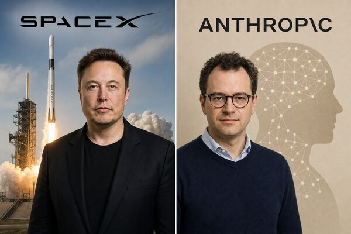

In a surprise move on May 7, AI company **Anthropic** — the maker of **Claude** — signed a deal with **Elon Musk**'s **SpaceX** to use the giant Colossus 1 data center in Memphis, Tennessee, with `220,000` chips and `300 megawatts` of computing power. The next day, Musk announced he was dissolving his own AI company, **xAI** (maker of the **Grok** chatbot), and folding it into SpaceX as a new product line called "SpaceXAI." The two men had been bitter rivals — Musk previously called Anthropic a company that "hates Western civilization." After meeting Anthropic's team last week, he changed his tune. The timing matters: SpaceX is preparing for what could be the biggest stock market debut in history, possibly valuing the company at `$2 trillion`. Renting out spare computing power is good for the IPO. xAI also struggled lately, with 11 of its 12 original co-founders having left the company.

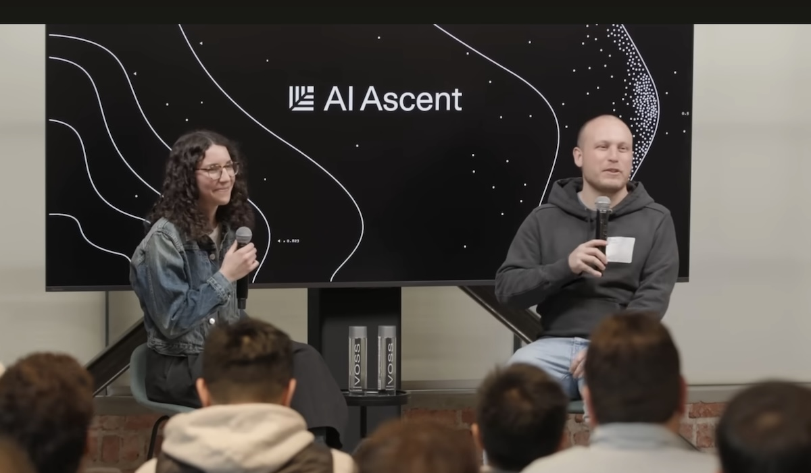

Boris Cherny, the engineer who created **Claude Code** at **Anthropic**, gave a talk last week at **Sequoia Capital**'s **AI Ascent 2026** conference that has tech and finance circles buzzing. His main claim: for him, programming is "solved." Cherny, a veteran software engineer who literally wrote textbooks on coding, revealed he hasn't written a single line of code by hand in 2026. Instead, he ships dozens of changes a day — from his phone — by directing AI agents that do the actual writing. He runs five to ten parallel sessions at once, plus thousands of background tasks overnight. Cherny compared the moment to the invention of the printing press in the 1400s, but moving much faster. He also predicted that the number of disruptive startups will grow tenfold over the next decade, because small teams can now build things that used to require huge companies. Coding, he said, is becoming everyone's job.

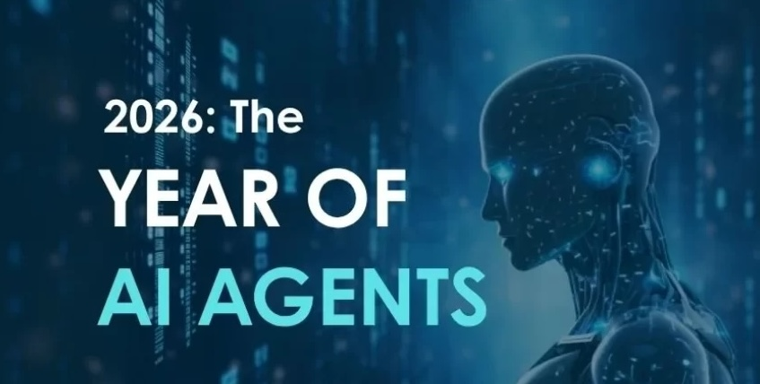

**The AI Ascent 2026** conference held by venture firm **Sequoia Capital** in San Francisco on April 20, brought together more than `150` of the biggest names in artificial intelligence. The host firm declared 2026 "the year of agents" — AI programs that can perceive, plan, and complete tasks on their own, not just answer questions. **OpenAI** president Greg Brockman said that over a single month last December, AI tools jumped from writing `20%` of new computer code to `80%`. Demis Hassabis, the Nobel Prize-winning CEO of **Google DeepMind**, said he believes AGI — artificial general intelligence, AI as smart as any human at any task — is achievable by 2030, and that drug discovery could collapse from ten years to days. Andrej Karpathy, who co-founded OpenAI, argued that we're entering "Software 3.0," where many traditional apps simply won't need to exist anymore.

Something unusual is happening in Silicon Valley: top tech executives are quitting their high-ranking jobs to take regular engineering roles at AI company Anthropic. Peter Bailis left his job as chief technology officer of **Workday**, a $50 billion enterprise software company, to become a "member of technical staff" — basically, a regular engineer. Bryan McCann, co-founder and CTO of AI startup **You.com**, did the same. Mike Krieger, the co-founder of **Instagram**, switched from an executive role at Anthropic to an engineering one. Normally, executives don't trade their corner offices for engineer desks. So why are they doing it? One working theory: these tech veterans believe AGI — artificial general intelligence, the holy grail of AI research — may be arriving soon, and they want a front-row seat when it happens. 

## Global

A rare and deadly virus broke out on the cruise ship MV Hondius in the South Atlantic earlier this month, killing three passengers and sickening several others. The culprit is **hantavirus**, a virus normally carried by wild rodents like mice and rats. Most strains spread to humans through contact with rodent droppings, but this one — the Andes strain — is the only hantavirus that can also pass between people. The ship was stranded off West Africa for days before being allowed to dock in the Canary Islands on May 10. The **World Health Organization** says the global risk is low. It's not the next COVID.

## Economy & Finance

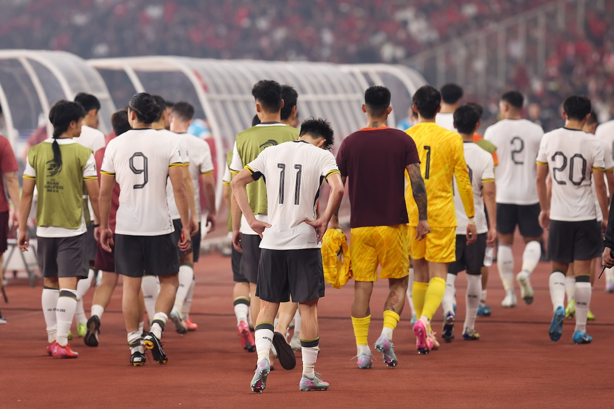

The **2026 World Cup** kicks off June 11 in North America, but with about a month to go, there's still no deal for it to air in China. **FIFA** reportedly asked **China Media Group** between `$250` and `$300 million` for the rights, while CMG's budget was closer to `$60–80 million`. Several things are working against a deal. The tournament is hosted across the US, Canada, and Mexico, meaning most matches kick off in the early hours Beijing time — brutal for viewers and a turnoff for advertisers. China's national team also failed to qualify, eliminated by Indonesia last year, which has cooled domestic interest. Yet Chinese companies have already poured over `$500 million` into sponsoring this World Cup, according to Beijing Daily, and Chinese viewers made up nearly half of all digital viewing hours in 2022. A blackout would sting both sides.

On May 2, tens of thousands of investors gathered in Omaha, Nebraska, for the annual **Berkshire Hathaway** shareholders meeting — an event so famous in finance circles it's nicknamed "Woodstock for Capitalists." This year was different. For the first time in six decades, the meeting wasn't headlined by **Warren Buffett**, the legendary 95-year-old investor often called the greatest of all time. Buffett took over Berkshire Hathaway in 1965 when it was a failing textile company. Over the next 60 years, he turned it into a giant conglomerate that owns insurance companies, railroads, **See's Candies**, and big stakes in **Apple** and **Coca-Cola**. The numbers are staggering: Berkshire's stock returned `19.9%` per year on average — nearly double the **S&P 500's** `10.4%`. A `$100` investment in 1965 would be worth over `$5.5 million` today. Buffett stepped down as CEO in January but still showed up, sitting in the front row.

## Nature & Environment

A new study published on May 4 in the journal **Nature Sustainability** warns that **New Orleans**, one of America's most beloved cities, has reached a "point of no return." Researchers at Tulane University say rising seas and sinking land have grown so severe that southern **Louisiana** is losing an area the size of a football field every `100 minutes`. Since the 1930s, the state has lost coastal land roughly equal in size to the state of **Delaware**. The scientists say the city likely won't exist by the end of the next century, and they're calling for governments to start planning now for the long-term relocation of residents.

## Science

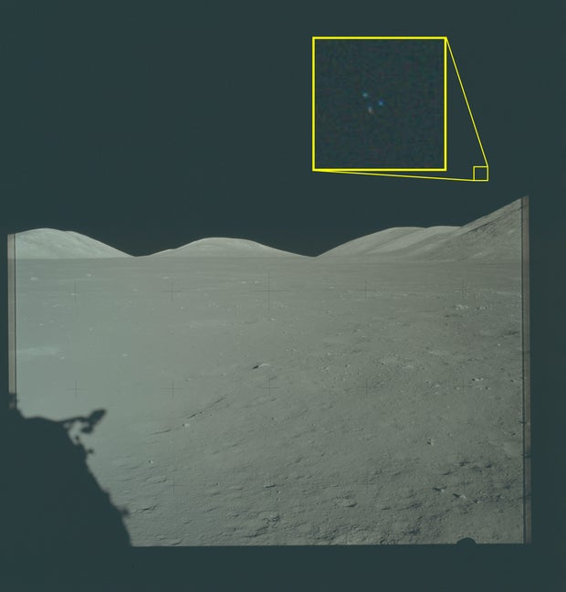

On Friday, the **Pentagon** released its first batch of declassified UFO files — `162` documents pulled from the FBI, State Department, NASA, and other agencies, posted on a new public website called PURSUE (Presidential Unsealing and Reporting System for UAP Encounters). UAP, or "**unidentified anomalous phenomena**," is the modern term for UFOs. Some of the more eye-catching items: an Apollo 17 photo from 1972 showing three small dots in a triangular formation above the lunar surface, with the Pentagon noting new analysis suggests it could be "a physical object in the scene." Apollo 12 photos show similar bright spots near the moon's horizon, and a transcript captures astronaut Buzz Aldrin describing "little flashes" inside the Apollo 11 cabin. Researchers say nothing in the batch is a smoking gun. More tranches are promised every few weeks. Stay tuned.

## Math

This rectangle consists of 6 squares. Two of them on the bottom right are of the same size. The smallest square in the center has an area of 4. What is the total area for the rectangle? 

## Lifestyle, Entertainment & Culture

This Sunday, **May 10**, is **Mother's Day** in the US, China, Japan, Australia, and dozens of other countries that mark it on the second Sunday of May. Over 100 countries celebrate some version of it, though the date shifts — the UK had Mothering Sunday back in March, and Thailand waits until August 12. Some numbers worth knowing: Americans will spend roughly `$38 billion` this year, and Mother's Day generates more phone calls than any other day on the calendar — about `122 million`. You don't need to spend anything. A handwritten note, a hug, or doing the dishes without being asked counts. Mom will remember it longer than flowers.

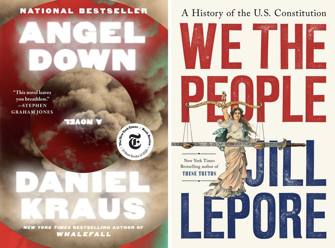

The **2026 Pulitzer Prizes** were announced on May 4 in New York. The Pulitzers, awarded since 1917, are considered the highest honor in American journalism, books, drama, and music. Twenty-three prizes are given out each year. The fiction winner was **Angel Down** by Daniel Kraus, a novel about World War I soldiers who find a fallen angel in No Man's Land — and the whole story is written as one long sentence. The history prize went to Harvard professor Jill Lepore for **We the People**, a book about the U.S. Constitution. The biography prize went to Amanda Vaill for **Pride and Pleasure**, about the Schuyler sisters, who played important roles during the American Revolution. The memoir prize went to celebrated Chinese-American writer Yiyun Li for **Things in Nature Merely Grow**. The poetry prize went to Juliana Spahr for **Ars Poeticas**.

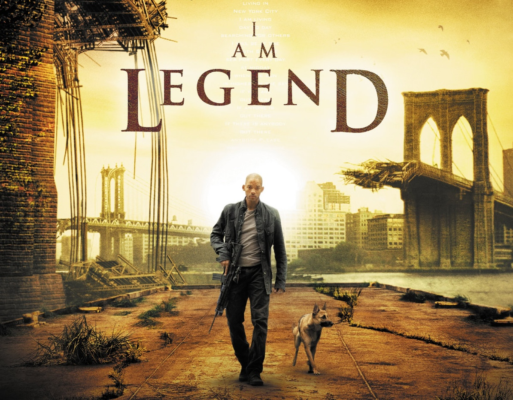

Hollywood is finally moving forward on **I Am Legend 2**, the long-awaited sequel to the 2007 post-apocalyptic thriller starring **Will Smith**. Will Smith and **Michael B. Jordan** are both attached to star. The original film, based on a 1954 novel by Richard Matheson, follows a scientist named Robert Neville who is one of the last people alive in New York City after a virus turns the rest of humanity into vampire-like creatures. Smith's character died in the theatrical version of the original, but the sequel will follow an alternate ending where he survives. The new story will pick up decades later, with nature reclaiming the city, asking what happens to the world when humans are no longer in charge. No release date has been announced yet.

## Sports

[Soccer] **Arsenal**, one of England's most famous football clubs, is on the brink of a historic season. With just a few matches left in the **Premier League**, they sit on top of the table, two points ahead of Manchester City. If they hold on, it will be their first league title in 22 years — since the legendary 2003-04 "Invincibles" team that went an entire season without losing a single game. At the same time, Arsenal just reached the **Champions League** final for the first time in club history. They'll play **Paris Saint-Germain** in Budapest on May 30. Arsenal has never won the Champions League in their 140-year history. Winning both trophies in the same season is called the "European double" — one of the rarest and most prestigious achievements in club football. Manager **Mikel Arteta**, who used to play for Arsenal himself, took charge of a struggling team in December 2019 and has patiently rebuilt it over six seasons into one of the best in Europe.

[Snooker] On May 4, 22-year-old Chinese snooker player **Wu Yize** won the **World Snooker Championship** at the Crucible Theatre in Sheffield, England — the sport's most prestigious tournament. He beat former champion Shaun Murphy `18-17` in a final that came down to the very last frame, and became the second-youngest world champion in snooker history. Only **Stephen Hendry**, who won at 21 in 1990, was younger. Wu's win continues a remarkable surge of Chinese snooker. Last year, **Zhao Xintong** became the first Chinese player ever to win the title. This year, a record `11` Chinese players reached the last 32. China is taking over the green baize.

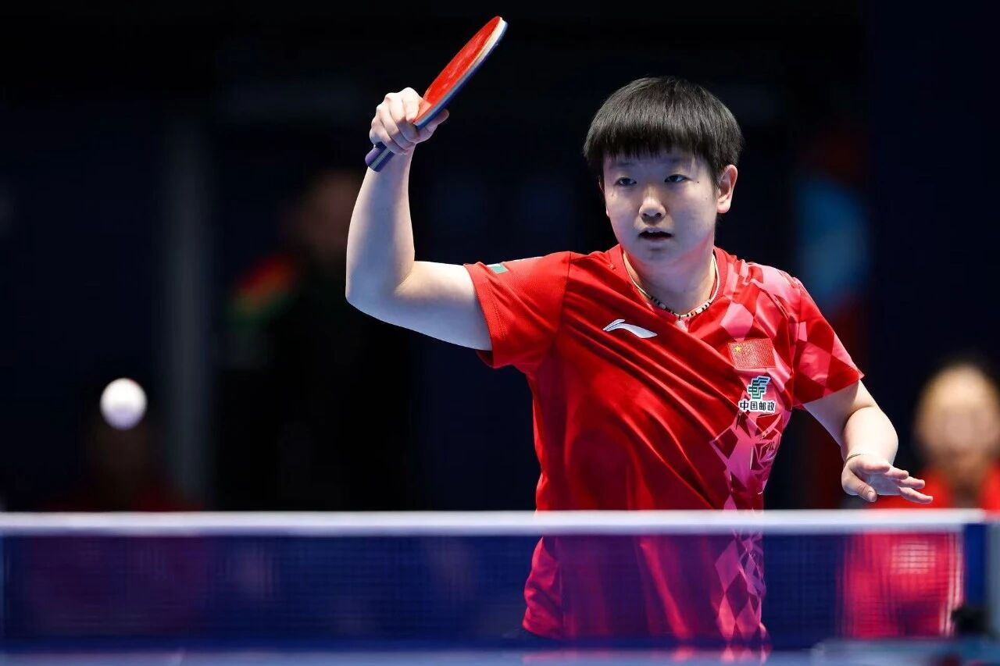

[Table Tennis] The world's best table tennis teams gathered in London this week for the **ITTF World Team Championships**, a special centenary edition held in the city where the tournament was first played in 1926. China's women, six-time defending champions, swept through the tournament without dropping a single game and set up a Sunday final against Japan — their sixth showdown in a row dating back to 2012. The men had a wobblier ride, losing twice in the group stage, including a stunning defeat to Sweden, before recovering to make the semifinals. Both finals are on Sunday, May 10, with China still favored.

[Tennis] On May 3, Italy's **Jannik Sinner** won the **Madrid Open**, beating Germany's **Alexander Zverev** 6-1, 6-2 in a one-sided final. With the win, the 24-year-old world No. 1 became the first male player ever to win five **Masters 1000** titles in a row. The Masters 1000 are the nine biggest tennis tournaments outside of the four Grand Slams, and Sinner's streak now includes Paris, Indian Wells, Miami, Monte-Carlo, and Madrid. Even legends like **Novak Djokovic** and **Rafael Nadal** had only managed four in a row. Sinner heads to Rome next week chasing his sixth straight, on his way to the French Open later this month.

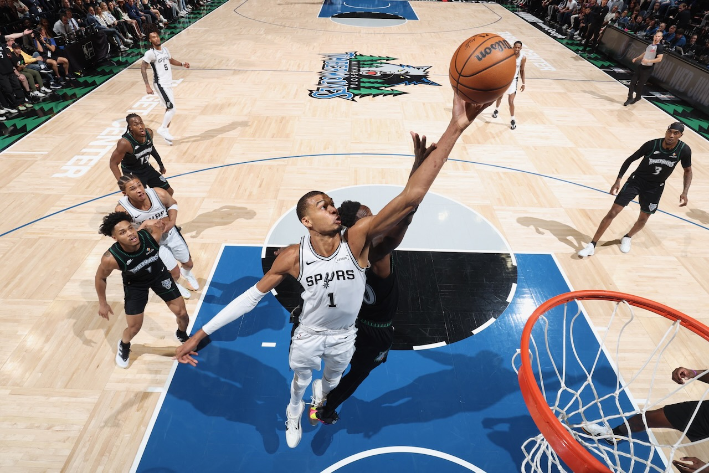

[Basketball] The NBA playoffs are heating up. In the East, the **New York Knicks** are 3-0 against the **Philadelphia 76ers**, including a stunning `137-98` Game 1 blowout. New York hasn't reached the Conference Finals since 2000, but they look unstoppable this year. In the West, France's **Victor Wembanyama** is showing why everyone thinks he might be the future of the NBA. The `7'4"` 22-year-old led the **San Antonio Spurs** past **Minnesota** in Game 2 by a 38-point margin and now leads the series 2-1. Meanwhile, the **Los Angeles Lakers** are in trouble. They're down 0-2 to the top-seeded **Oklahoma City Thunder** and have lost both games by double digits. **LeBron James**, now 41, and his teammates need to find an answer fast in Game 3 on Sunday. The Conference Finals start later this month, with the NBA Finals scheduled to begin on June 4.

## This Day in History

On **May 10, 1963**, five young Londoners walked into Olympic Sound Studios and recorded their first single — a cover of **Chuck Berry**'s "Come On." Their manager admitted he had no idea what he was doing, and lead singer **Mick Jagger** called the group "a bunch of bloody amateurs". Those amateurs were the **Rolling Stones**, one of the biggest bands in rock history alongside the **Beatles** and **Led Zeppelin**. While the Beatles broke up in 1970 and Zeppelin disbanded in 1980, the Stones kept going — and going. They're now 64 years into their career, the longest run of any major rock band. Founding members Mick Jagger and Keith Richards are both 82. Their 2024 **Hackney Diamonds** tour sold out stadiums across North America, though they recently scrapped a planned 2026 tour because Richards' arthritis made the schedule too tough.

## Art of the Week

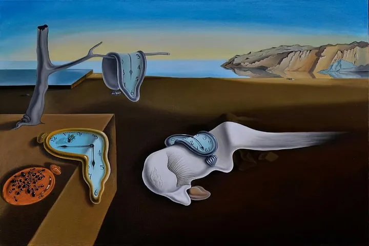

**Salvador Dalí** was a Spanish artist famous for his curled mustache, wild personality, and even wilder paintings. He was a leading figure in **Surrealism**, an art movement from the 1920s that tried to paint dreams, the unconscious mind, and impossible scenes — basically, the strange logic that takes over when you're asleep. What made Dalí great was his technical skill: he painted bizarre, dreamlike images with the precision of a Renaissance master, so the impossible looked completely real. His most famous work, **The Persistence of Memory** (1931), shows soft, melting clocks draped over a tree branch, a square block, and a strange sleeping creature in a quiet desert landscape. Dalí said the idea came from watching a wedge of Camembert cheese melt in the sun. The painting is surprisingly small — about the size of a sheet of paper. Maybe time isn't as solid as we think.

## Funny

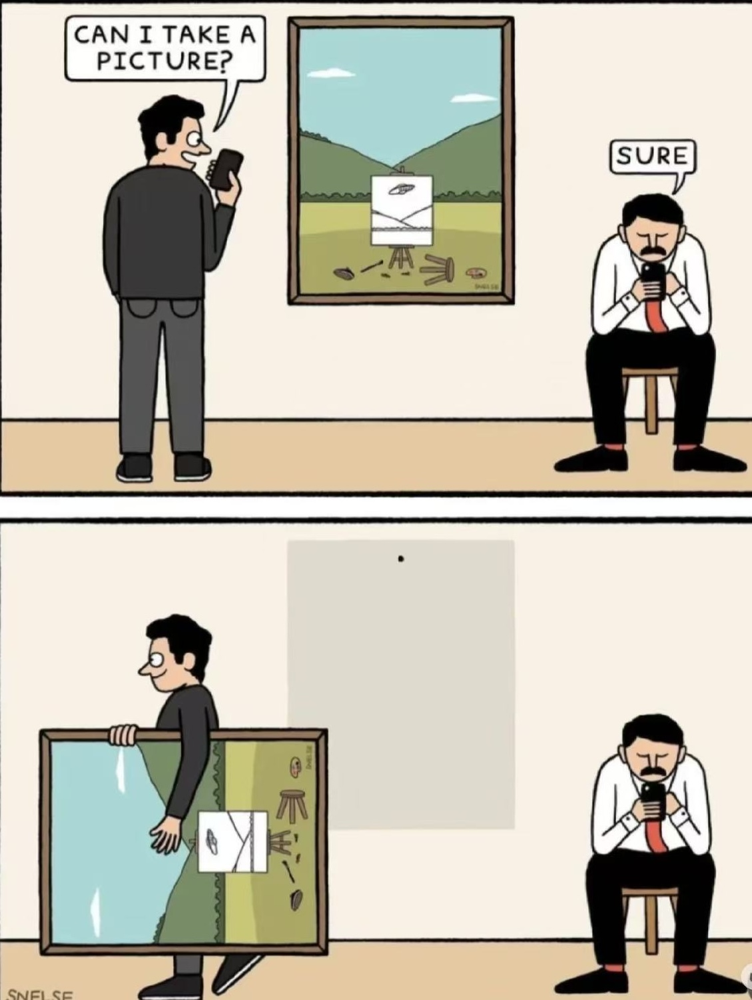

---

## Previous Issues

---

May 03, 2026, **[The Way You Make Me Feel](https://weekly.sundayblender.com/p/the-way-you-make-me-feel)**

April 26, 2026, **[Game Is No. 1, Friendship is No. 14](https://weekly.sundayblender.com/p/game-is-no-1-friendship-is-no-14)**

April 19, 2026, **[Robots Run Faster Than Humans Now](https://weekly.sundayblender.com/p/robots-run-faster-than-humans-now)**

---

Thanks for reading! If you enjoy this newsletter, please share it with friends who might also find it interesting and refreshing, if not for themselves, at least for their kids.

