## Editor's Words

After trying out OpenClaw for a few intense weeks since late January, I gradually stopped using it because it was always too buggy and unstable for meaningful tasks.

The new kid on the block in this AI agent craze - Hermes seems a much stronger replacement. It's much easier to switch to different AI models and its self-learning capability looks interesting.

I'm slowly hooking up my Hermes agent with all the web services/sites I'm developing, making this AI aide-de-camp the exclusive channel to receive notifications from my applications and transforming my operation into a true AI-native OPC. In the past, this channel used to be email, SMS, Telegram, and WeChat. It's now becoming my autonomous AI agent, which helps me not only with coding, but also with filtering and curating information that will reach me.

Maybe one day the agent can even help me produce the future issues of the Sunday Blender, once it learns of my taste and view of the world.

## Tech

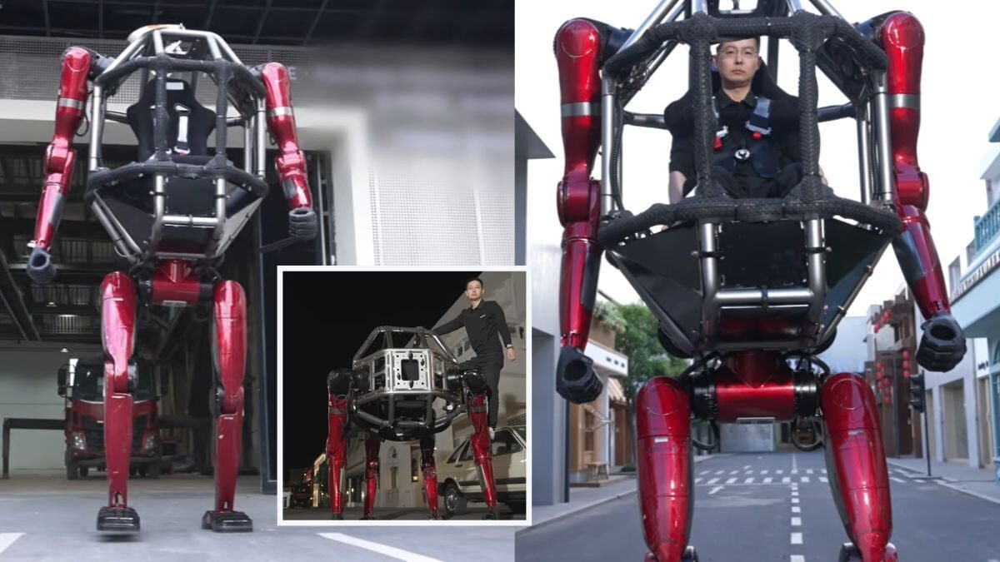

A Chinese robotics company just built something straight out of **Pacific Rim**. On May 12, Hangzhou-based **Unitree** unveiled the GD01, which it calls the world's first production-ready manned mecha — a giant robot suit with a cockpit in its chest where a human pilot climbs in. It stands `2.7` meters tall (nearly 9 feet), weighs around `500` kilograms with a rider inside, and can switch between walking on two legs and crawling on four. A demo video shows it punching through a brick wall with its hand. The price tag: `3.9 million` yuan, or roughly `$570,000`.

If you want to build AI agents that work for you, there's a fast-rising new tool called **Hermes Agent** — named after the Greek god of messengers, who carried words between the gods and mortals on his winged sandals. A fitting name for software that runs errands on your behalf. Released in February 2026 by an AI lab called **Nous Research**, Hermes is free, open-source (anyone can see how it's built), and it learns from what you ask it to do — so the more you use it, the better it gets. In just ten weeks it picked up over `110,000` stars on **GitHub**, the website where programmers share code, and is quickly stealing the spotlight from the older market leader, **OpenClaw**. To pull in more developers, Nous Research recently teamed up with Chinese AI company **Kimi** — whose newest model is tuned to work well with Hermes — to run a 16-day coding contest, called a hackathon, with `$25,000` in prizes.

When the US president travels abroad, his car, his security team, and his secure communications gear travel ahead of him on huge military cargo planes. Ahead of **President Trump**'s two-day visit to Beijing on May 14–15, at least four US Air Force **C-17 Globemaster III** transport planes landed at Beijing's airport carrying the goods. The C-17 is a flying truck the size of a small office building — `174` feet long, able to carry up to `77` tons, with enough room inside for an entire 69-ton **M1 Abrams** battle tank. What did they unload? The presidential limousine, nicknamed "The Beast" — an `18,000-pound` armored **Cadillac** with 8-inch-thick steel-and-ceramic armor, 5-inch bulletproof windows, doors as heavy as those on a Boeing 757, and a hermetically sealed cabin with its own oxygen supply in case of a chemical attack. It even carries a stash of the president's blood type in a built-in fridge. And the gadgets? Reportedly night-vision cameras, smoke screens, tear-gas cannons, oil-slick sprayers to spin out enemy cars, and door handles that can deliver a `120-volt` electric shock. Spotted by Beijing residents on the city's Third Ring Road, the convoy looked like something out of a James Bond movie.

## Global

While in Beijing this week as part of a US business delegation, **Nvidia** CEO **Jensen Huang** took an afternoon off to wander around **Nanluoguxiang**, one of Beijing's oldest and most famous alleyways. Even though it was a warm `27°C` (81°F) day, he wore his trademark black leather jacket — the same one he wears for every big public appearance. The man who runs the world's most valuable company (`$5.7 trillion`) ate street food, posed for selfies with tourists, and slurped a bowl of Beijing zhajiangmian noodles right on the sidewalk. He also tried douzhi — Beijing's famously divisive fermented mung bean drink — and the look on his face said it all. After he gave a thumbs-up to a peach tea at **Mixue**, the chain reported sales of that drink jumped `140%` the next day. Quite a side hustle for a chip-company CEO.

## Economy & Finance

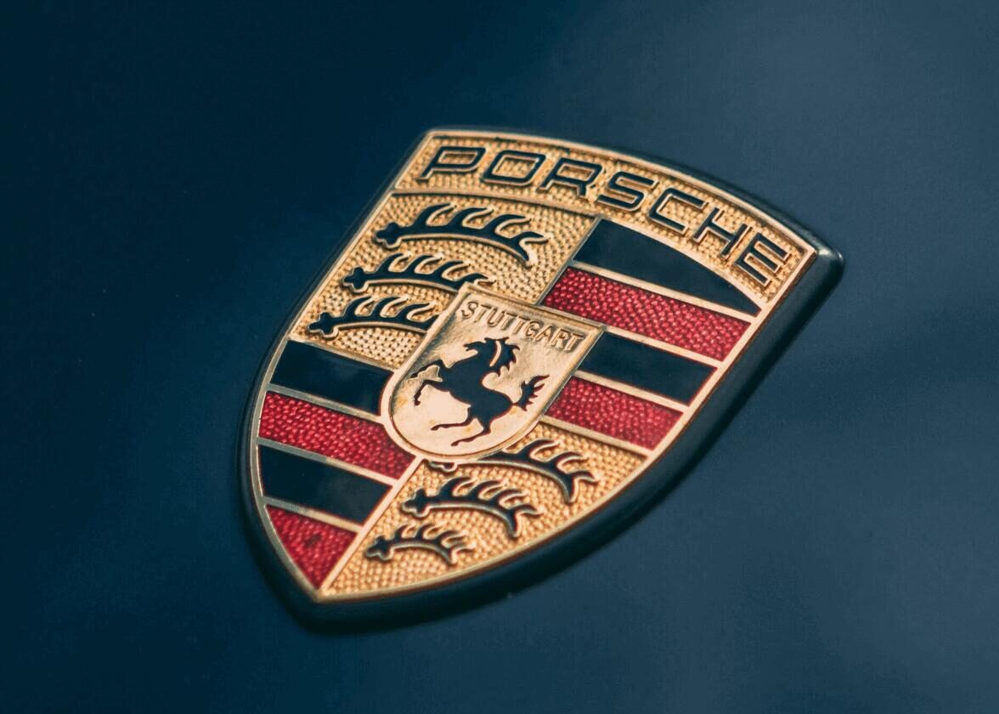

The German sports car maker **Porsche** is having a rough time in China. In 2025, Porsche sold `41,938` cars there — down `26%` from the year before, and less than half of what it sold in 2021. Things got worse in early 2026: deliveries fell another `21%` in the first three months. So Porsche is closing roughly a third of its Chinese dealerships, shrinking from `150` stores at the end of 2024 to around `80` by the end of 2026. The biggest reason? Chinese carmakers like **Xiaomi** and **BYD** are now making fast, fancy electric cars of their own — and many Chinese drivers prefer them.

A Silicon Valley company called **Cerebras** went public this week, in the biggest stock market debut of 2026 so far. Cerebras makes specialized chips for running AI models — and unlike normal computer chips the size of a fingernail, theirs are the size of a dinner plate, with about `4 trillion` tiny switches packed onto a single piece of silicon. The company raised `$5.5 billion` when it listed on the **Nasdaq** stock exchange on May 14, and its shares almost doubled on the first day of trading, briefly valuing Cerebras at around `$66 billion`. Cerebras is trying to challenge **Nvidia**, currently the world's most valuable company.

## Nature & Environment

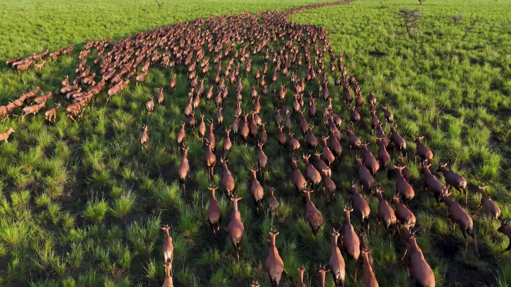

Scientists have just released the first-ever drone footage of the largest land mammal migration on Earth — and it's not the famous wildebeest stampede across the **Serengeti**. It's happening in **South Sudan**, where roughly six million antelope migrate across grasslands and wetlands every year, more than twice the size of the East African wildebeest migration. The migration was hidden from the world for decades because of war in the region, which kept scientists and tourists out. It was only confirmed in 2024, when researchers flew planes over the area and took `330,000` aerial photos. The May 2026 issue of **National Geographic** features the stunning new drone images.

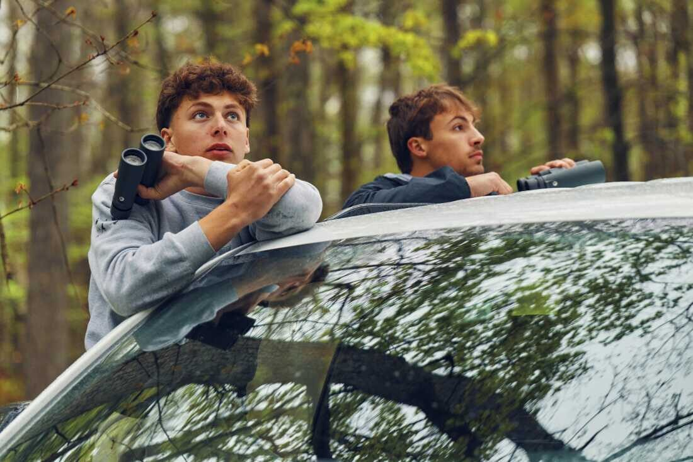

There's a competition called the **World Series of Birding**, where teams race across the state of **New Jersey** for 24 straight hours, trying to spot or hear as many bird species as possible. The 43rd annual event was held on May 9, and one team that drew lots of attention was The Pete Dunnelins — three high school friends, ages 16 and 17, who had won the past two years. Starting just after midnight, they sprinted from park to park with binoculars, fueled by energy drinks and M&Ms. By the end of the day, they had counted `206` species — but lost by three to their rivals, The Flying Penguins, who got `209`.

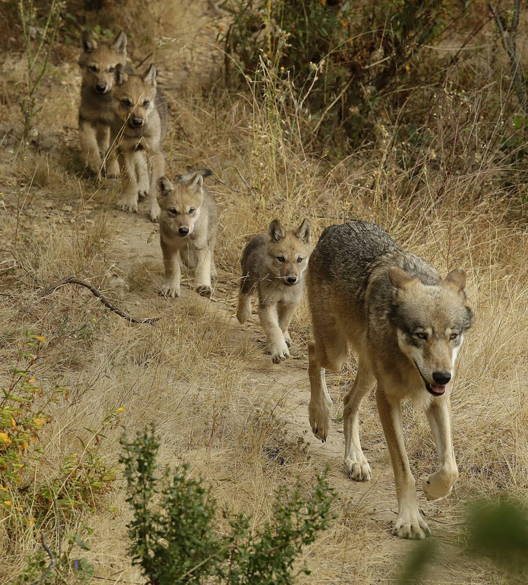

This past Friday, May 15, was **Endangered Species Day** — a yearly reminder to celebrate animals that are at risk of dying out, and to highlight species that are making a comeback. One of the most surprising returns: gray wolves are back in California. The state's last wild wolf was shot in 1924, and for the next 87 years there were none. Then in December 2011, a young radio-collared wolf nicknamed "Journey" walked south from Oregon into California — entirely on his own. More wolves followed his trail over the years. Today, an estimated 50 to 70 wolves roam California in at least 10 packs. Nobody released them. They just walked back home.

## Science

Scientists just discovered that one of the world's most popular houseplants — the **Chinese money plant**, known for its perfectly round, coin-shaped leaves — hides a famous mathematical pattern in its veins. Researchers at Cold Spring Harbor Laboratory and two Canadian universities analyzed 34 leaves and found that the web of veins on each leaf follows a **Voronoi diagram** — a pattern where every point on a surface "belongs" to whichever center it's closest to, like dividing a playground into zones around each kid. The same math is used by mobile phone networks to assign you to the nearest cell tower, and by biologists to study how cells pack together. The Chinese money plant has been quietly drawing it on every leaf, all along.

A Brazilian scientist just discovered a possible shortcut to Mars hiding in the orbital path of an asteroid. In a paper published last month in the journal Acta Astronautica, astrophysicist Marcelo de Oliveira Souza showed that if a spacecraft followed a route geometrically similar to the orbit of asteroid 2001 CA21, the trip to **Mars** could in theory be done in just `34` days — instead of the usual 6 to 9 months. The catch: a spacecraft would need to leave Earth at around `32.5` kilometers per second (faster than any rocket has ever launched) and would arrive at Mars going about `108,000 km/h` — way too fast to land safely with today's technology. So the shortcut is real on paper. We just need to build the rocket.

## Math

> Fill in the missing numbers

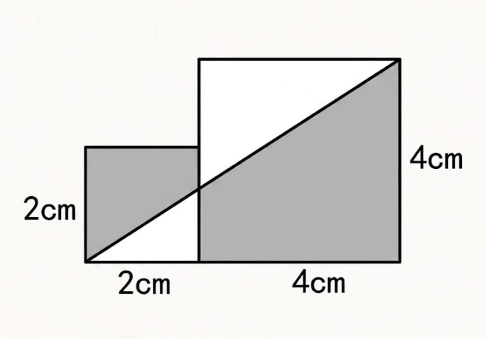

> What's the size of the shaded area?

## Lifestyle, Entertainment & Culture

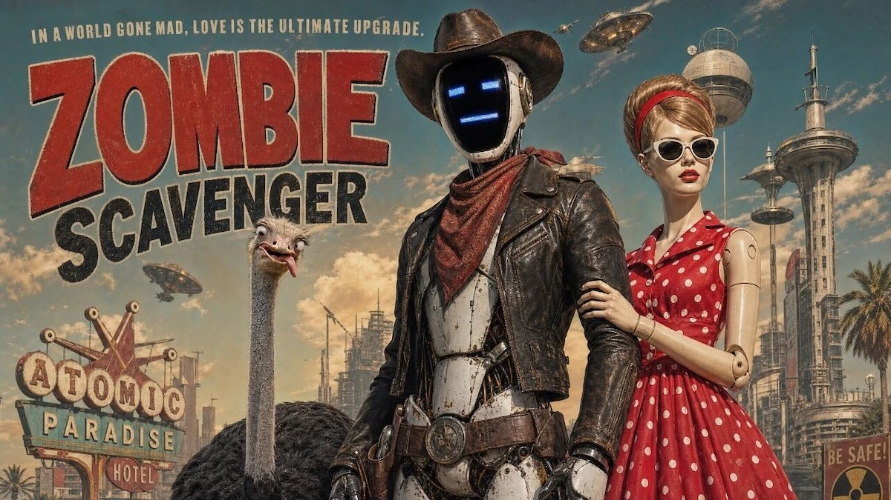

A 5-minute AI-made short film called **Zombie Scavenger** went viral around the world this week — and the director's day job is in real estate. The film, made by a young Chinese creator who goes by **MX-Shell**, features a lonely robot wandering a post-apocalyptic wasteland (think **WALL-E**, which inspired it, but with zombies and cowboys). Here's the wild part: he made the whole thing by himself, in just 10 days, for about `3,000 yuan` (roughly $420) — paying only for AI tool credits. After the film racked up over `13 million` views on X, a Hollywood AI filmmaker named PJ Ace posted a public plea: "I would love to hire him but I cannot find him." Internet sleuths tracked MX-Shell down. He's now in talks to turn the short into a full-length movie.

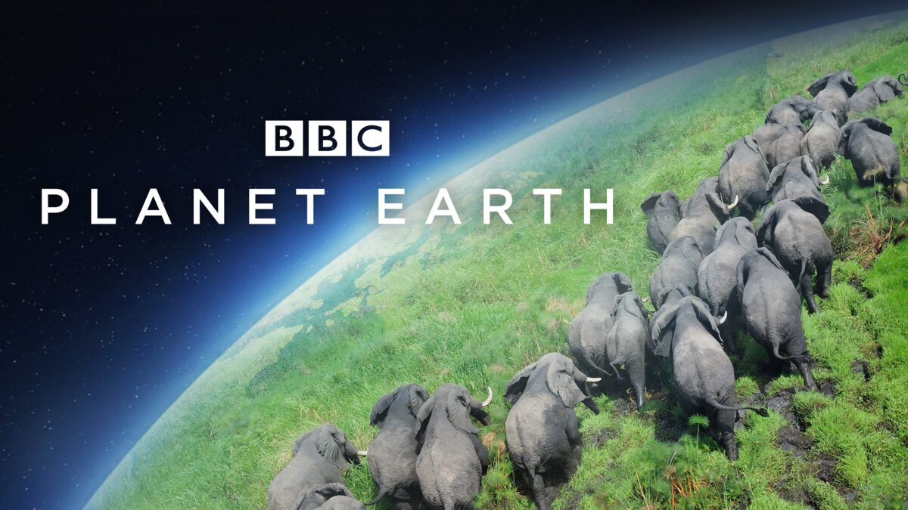

The most famous voice in nature documentaries just turned 100. On May 8, **Sir David Attenborough** — the British broadcaster who has narrated **Planet Earth**, **Blue Planet**, **Frozen Planet**, and dozens of other BBC nature series — celebrated his 100th birthday. He has been making wildlife films for over 70 years, since 1952, and his calm, half-whispered voice has introduced generations of kids to gorillas, polar bears, deep-sea creatures, and everything in between. To mark the milestone, the **Royal Albert Hall** in London hosted a gala concert attended by **Prince William**, **King Charles III** sent a birthday card, and scientists named a newly discovered parasitic wasp after him.

Last weekend, the city of Albany — the capital of New York State — held its 78th annual **Tulip Festival** in Washington Park. Over `140,000` tulips in `150` different varieties bloomed across the `81-acre` park, drawing thousands of visitors over Mother's Day weekend. Why tulips in upstate New York? Because Albany was originally a Dutch settlement, founded by traders from the Netherlands in 1614 and called Fort Orange. The Dutch brought tulips with them — the flower is a national symbol of the Netherlands — and the tradition has continued for centuries. Every year, the festival crowns a "Tulip Queen" and features a Dutch street-scrubbing ceremony, where people sweep the streets with brooms before the celebration begins. 

**Bulgaria** just won **Eurovision** for the first time ever. Eurovision is one of the world's biggest TV events — a song contest where dozens of European countries each send one song, perform live on a single stage, and then everyone votes for their favorites. Each country gets to give points from 1 to 12, and the country with the most points wins. It's been running every year since 1956 — that's 70 years, making it the longest-running annual TV music competition in the world. Last night in Vienna, Austria, a Bulgarian pop singer named **Dara** won the 70th edition with a dance song called "**Bangaranga**," beating 24 other countries with 516 points. Bulgaria will get to host next year's contest. Famous past Eurovision winners include the Swedish band **ABBA**, who won in 1974 with "Waterloo" and went on to become one of the biggest pop groups in history.

The official song of next month's **FIFA World Cup** dropped on Thursday: "Dai Dai," a high-energy track by Colombian pop star **Shakira** and Nigerian Afrobeats star Burna Boy. The title comes from an Italian phrase that means "come on, come on," and the song's chorus mixes English, Spanish, Italian, French, and Japanese words for "let's go." The lyrics name-drop soccer legends past and present: **Pelé**, **Maradona**, **Beckham**, **Cristiano Ronaldo**, **Messi**, **Mbappé**, and **Salah**. It's Shakira's fourth World Cup song — her 2010 hit "Waka Waka (This Time for Africa)" remains one of the most recognized World Cup anthems ever. The 2026 World Cup kicks off on June 11 in Mexico City, hosted by the US, Canada, and Mexico.

Get your popcorn ready — Hollywood's summer blockbuster season kicks off next weekend with a packed lineup. First up on May 22 is **The Mandalorian and Grogu**, the first Star Wars movie in theaters in seven years, starring everyone's favorite **Baby Yoda**. Pixar follows in June with **Toy Story 5**, bringing Woody and Buzz back for another adventure. July is the biggest month: **Minions & Monsters** takes the little yellow troublemakers to 1920s Hollywood; **Moana** gets a live-action remake with Dwayne "The Rock" Johnson reprising his role as Maui; legendary director Christopher Nolan releases **The Odyssey**, an epic adaptation of the 3,000-year-old Greek poem starring Matt Damon; and **Spider-Man: Brand New Day** swings into theaters with Tom Holland and Zendaya. With ticket sales already `16%` higher than last year, 2026 might be the biggest movie year since before the pandemic.

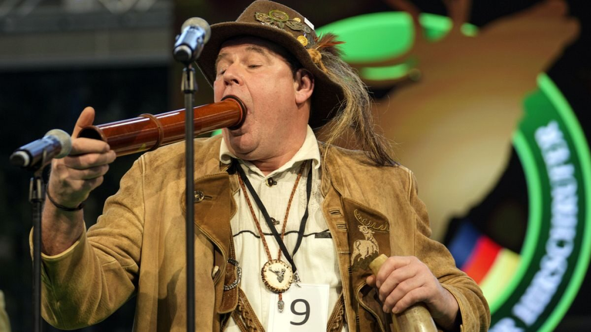

You may have seen viral videos this month of grown men in green hunting jackets blowing into giant curved horns, making haunting calls that echo through a German trade hall. That's the **German National Deer-Calling Championship**, held on January 30 in **Dortmund** — but clips from it went viral worldwide this May. Contestants imitate the sounds of red deer using only their voices or specially crafted horns, judged on accuracy and emotional realism. The tradition dates back over `800` years to medieval hunters, who used these calls to lure deer during mating season. This year's winner was Fabian Menzel, who has now claimed the title five years in a row. There's also a kids' version called the Kidsfiep World Championship.

## Sports

[Soccer] Two of Europe's biggest clubs lifted trophies on Saturday. In Munich, **Bayern Munich** collected the **Bundesliga** trophy at home after thrashing Köln `5-1`, sealing their `35th` German league title — a championship they'd already mathematically locked up a month earlier. England striker **Harry Kane** scored a hat-trick (three goals in one game) to finish the season with `36` Bundesliga goals, winning the top-scorer prize for a third year in a row — something no one had ever done in their first three Bundesliga seasons. The same afternoon at Wembley Stadium in London, **Manchester City** beat Chelsea `1-0` in the **FA Cup** final, England's oldest football competition, dating back to `1871`. The winning goal was a thing of beauty: winger Antoine Semenyo flicked the ball past Chelsea's goalkeeper with the back of his heel. For City, it's their `8th` FA Cup title. Pep Guardiola's side now turn their attention to chasing **Arsenal** in the **Premier League**.

[Soccer] **Lionel Messi** keeps finding new ways to break records. On May 13, **Inter Miami** beat FC Cincinnati `5-3` on the road, and Messi was at the center of it — scoring twice and setting up a third goal. It capped a wild week. Four days earlier, in a 4-2 win at Toronto, the 38-year-old Argentine became the fastest player in MLS (Major League Soccer) history to reach `100` regular-season goal contributions, hitting the mark in just `64` games. The previous record, held by Toronto's Sebastian Giovinco, took 95 games. Miami have now won six road games in a row, and Messi is heating up just one month before he leads Argentina at the **World Cup**.

## This Day in History

`234` years ago today, on **May 17, 1792**, 24 stock traders met under a buttonwood tree (a type of sycamore) outside 68 Wall Street in New York City and signed a short, two-sentence agreement promising to trade only with each other and at fair, fixed prices. That handshake deal, known as the Buttonwood Agreement, is the founding moment of the **New York Stock Exchange** — today the biggest stock market in the world. What's a stock exchange? It's a marketplace where people buy and sell tiny pieces of companies, called shares. If you own a share of **NVIDIA**, you own a tiny slice of NVIDIA. When lots of people want to buy a company's shares, the price goes up; when they want to sell, the price goes down. The exchange is the place where all that buying and selling happens — back in 1792, under a tree; today, mostly on computers.

## Art of the Week

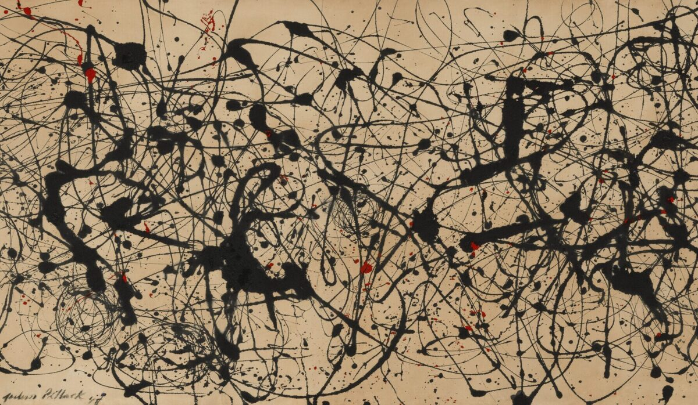

Tomorrow at art auction house **Christie's** in New York, a painting called Number 7A is expected to sell for around `$100 million`. It was made in 1948 by an American artist named **Jackson Pollock**, who had a wild way of working: instead of putting a canvas on an easel and using a brush, he laid the canvas flat on the floor and dripped, splattered, and flung paint at it from above, walking around all sides. Critics laughed at first — one magazine nicknamed him "Jack the Dripper" — but Pollock's drip paintings are now considered some of the most important American art of the 20th century. The funny part? Number 7A was once discovered hanging in someone's kitchen, covered in years of cooking smoke and grime, before being recognized as a masterpiece.

## Funny

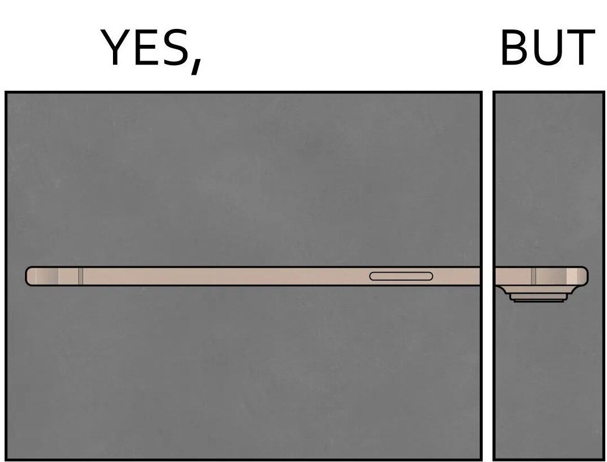

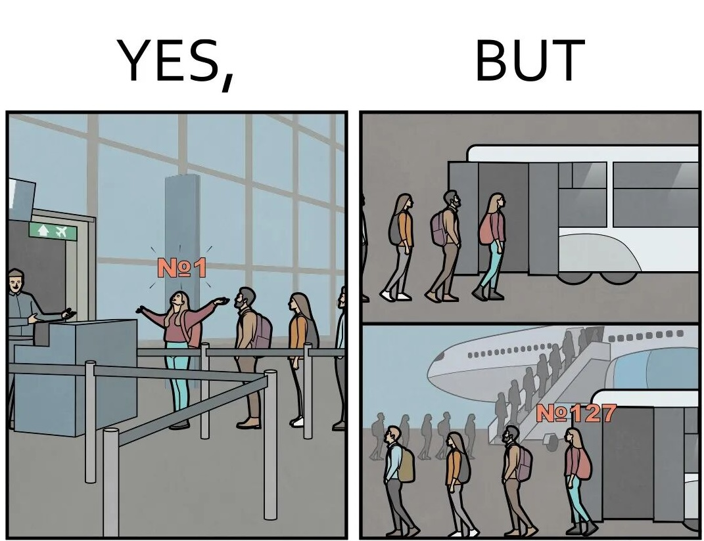

---

## Previous Issues

---

May 10, 2026, **[Double Wins for Arsenal in 2026?](https://weekly.sundayblender.com/p/double-wins-for-arsenal-in-2026)**

May 03, 2026, **[The Way You Make Me Feel](https://weekly.sundayblender.com/p/the-way-you-make-me-feel)**

April 26, 2026, **[Game Is No. 1, Friendship is No. 14](https://weekly.sundayblender.com/p/game-is-no-1-friendship-is-no-14)**

---

Thanks for reading! If you enjoy this newsletter, please share it with friends who might also find it interesting and refreshing, if not for themselves, at least for their kids.

