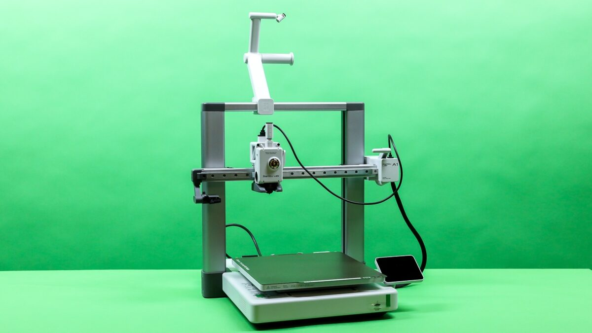
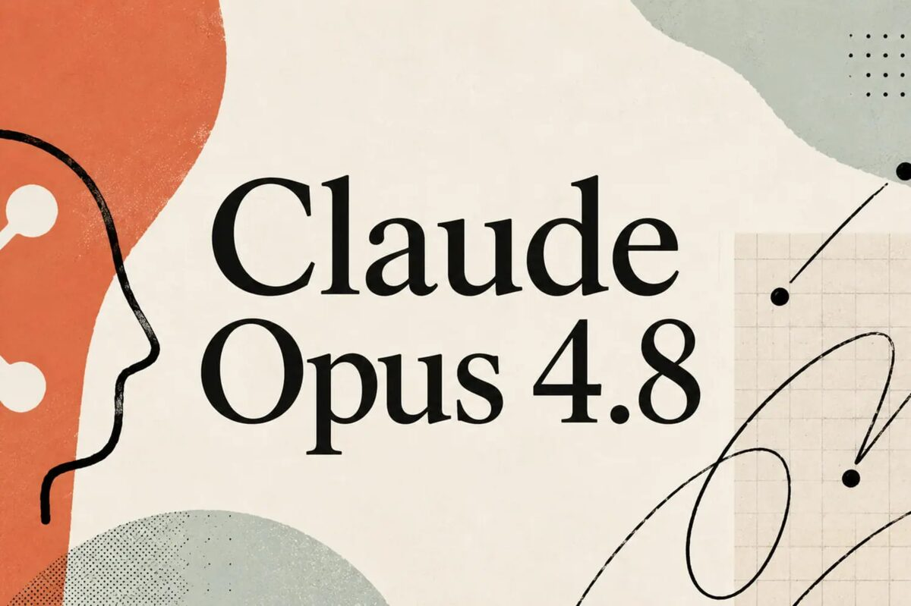
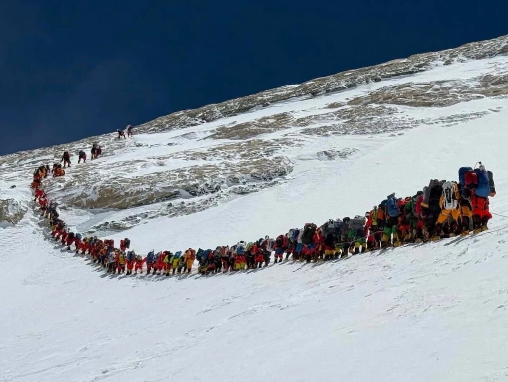
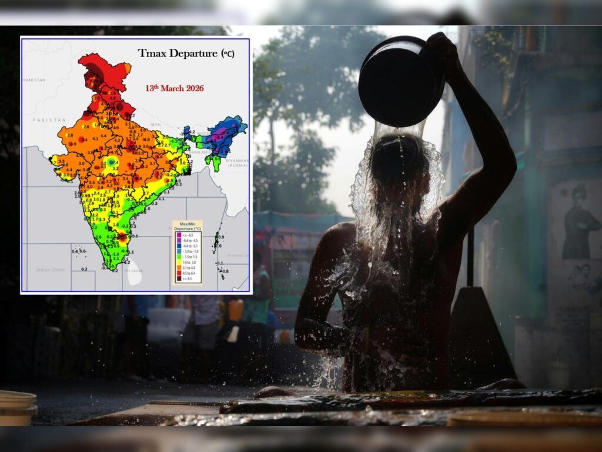
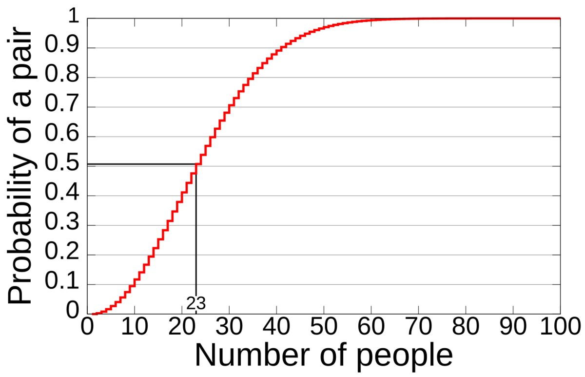
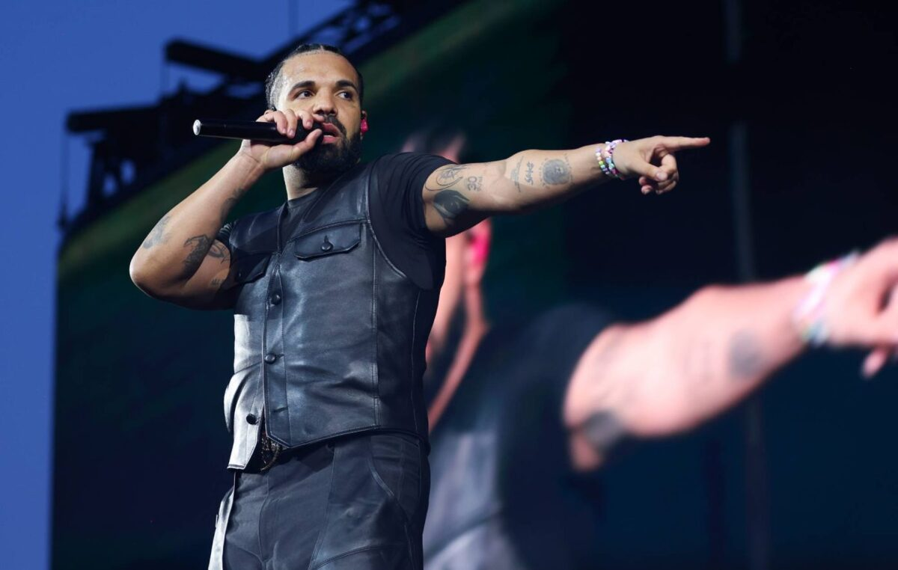
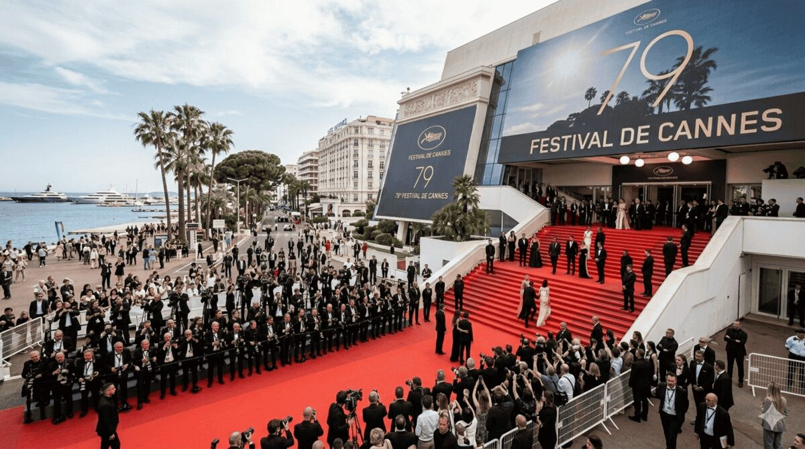
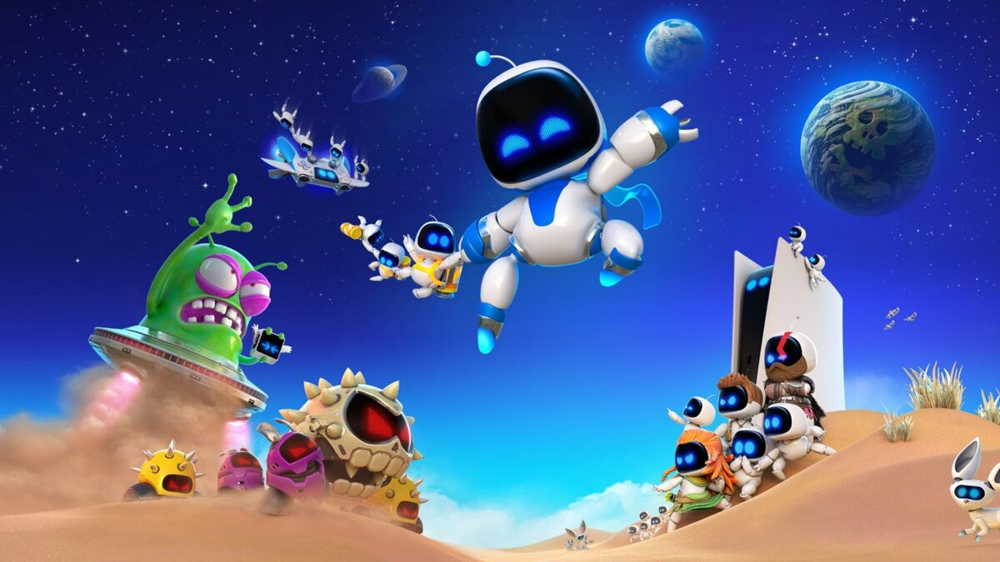
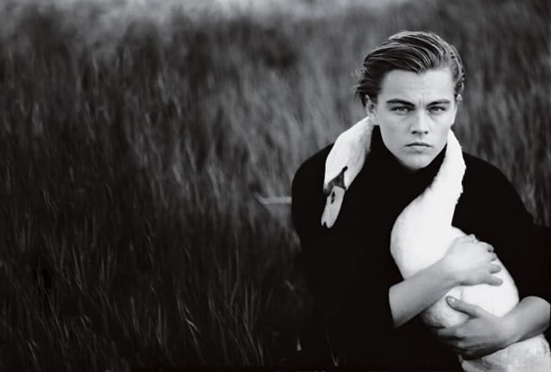
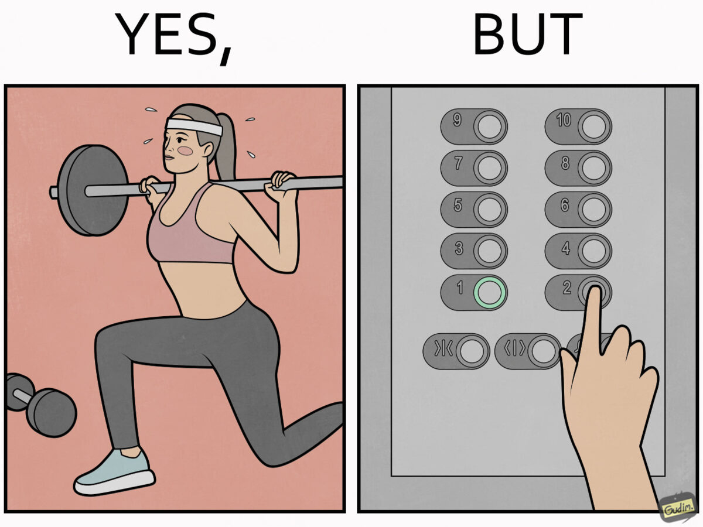

## Editor's Words

I joined a pickup badminton game this morning, playing men's double with five other guys. I was paired with someone I had never played with before, against two other pairs. 

The other two pairs were better players. They beat us repeatedly. I was struggling with my new racket grip. My partner's footwork had limited court coverage. 

We were a cheerful pair though. We clapped when winning a hard-fought rally. We laughed when losing to a lucky shot by the opponent. We chatted about how the game might have gone the other way when sitting on the bench. Usually for such a pickup game, players don't talk much.

One thing that was certain - we were closing the score margin, game by game, even though we kept losing. We could see that we were getting better playing together and learned to complement each other. We were playing with heart out.

After almost two hours, we finally won a game 21:19. It was the only game we wont today, but it felt really good.

## Tech

**Huawei**, the Chinese tech giant, just announced a chip breakthrough that could shake up the global tech race. On May 25, the company unveiled a new way of designing chips it calls the "**Tau Scaling Law**" — named after the Greek letter τ, which engineers use to measure how fast a signal can switch on and off inside a chip. Instead of making transistors — the tiny switches that power chips — ever smaller, Huawei's approach stacks them in layers and shortens the distance signals have to travel, packing more computing power into the same space. This matters because the U.S. has banned Huawei from buying the most advanced chipmaking machines, made in the Netherlands. The Tau approach is a workaround. The first chip using it, the Kirin 2026, is expected to power Huawei phones launching this fall. Huawei says it can match the world's most cutting-edge chips by 2031, though that would still trail leaders like Taiwan's **TSMC** by a few years.

**Bambu Lab**, a Shenzhen-based company that makes some of the most popular home 3D printers in the world, landed in hot water this month. A solo developer in Poland had built a free, modified version of the software people use to control these printers, sharing his code openly — which the software's open-source license allows. Bambu Lab sent him legal threats demanding he take it down. The 3D-printing community erupted. Popular tech YouTubers piled on, one pledging `$10,000` toward the developer's legal defense and daring the company to sue. Then a software-rights nonprofit, the Software Freedom Conservancy, accused Bambu Lab of breaking the very license its software is built on. Facing the backlash, the company dropped its threats, but the watchdog group says it will keep an eye on Bambu Lab. At the heart of the fight is a bigger question: when you buy a device, how much control should the maker still have over how you use it?

When AI giant **Anthropic** released its newest AI model, **Claude Opus** 4.8, a developer in Taiwan ran a simple test: he asked it in Chinese, "what model are you?" four times. Strangely, the AI answered that it was **Qwen** or **DeepSeek** — two Chinese AI systems made by other companies — and only correctly called itself Claude once. This kicked off an online debate, with some people claiming it proved Claude had been secretly copied from Chinese models using a technique called distillation. Distillation is real: it's a way of training a smaller, cheaper AI by having it learn from the answers of a bigger, smarter one, like a student taking notes from an expert teacher. But most experts think this test proves no such thing. An AI learns to talk by reading enormous amounts of text from the internet, which is full of mentions of other AI systems. So when asked what it is, it sometimes just repeats the most common pattern it saw, like a parrot, rather than stating a real fact about itself. Interestingly, people had used this same test before to accuse Chinese AIs of copying American ones — on equally shaky ground.

## Global

**Mount Everest** just had its busiest season ever. According to **Nepal**'s Department of Tourism, `1,008` climbers reached the summit during the 2026 spring season — the most in the mountain's history, beating the previous record of around 900. Nepal also issued a record `494` permits, each costing `$15,000`, and on May 20, a record `274` climbers reached the top from the Nepal side in a single day. The crowds have renewed worries about safety. High on Everest sits the "death zone," where oxygen is so thin that delays from traffic jams can turn deadly. Two climbers died during this year's season.

## Economy & Finance

Shares of companies that make computer memory chips have been on a wild run this year, and the biggest American one, **Micron**, just became worth more than a trillion dollars for the first time. Its stock has more than tripled in 2026 alone, after climbing nearly `700%` over the past year. The reason is the artificial intelligence boom. AI systems like chatbots need enormous amounts of memory — the part of a computer that stores information for quick access — and companies building AI data centers are buying up so many chips that there aren't enough to go around. That shortage has pushed prices, and profits, sharply higher. Micron makes two main types: DRAM, which handles a computer's short-term working memory, and NAND flash, the kind used to store files long-term. Rival chipmakers like **Sandisk** and **Western Digital** have seen their stocks soar too.

The U.S. government is trying to write its first big set of rules for cryptocurrency, the digital money that exists only online. The bill is called the **CLARITY Act**, and on May 14 it cleared an important committee in the Senate by a vote of 15 to 9, moving it one step closer to becoming law. Right now, crypto in America lives in a gray zone where it's often unclear which government rules apply to it. The CLARITY Act would change that by giving cryptocurrency its own rulebook for the first time, spelling out how these companies must operate and who watches over them. That would be a turning point: after years of operating in legal limbo, crypto would move closer to being treated like a normal, recognized part of the country's financial system, alongside banks and stock markets. 

## Nature & Environment

India just sweated through another brutal stretch of heat. In late May, the India Meteorological Department warned of heat wave and even "severe heat wave" conditions across northern states including Punjab, Haryana, Delhi, and Uttar Pradesh, with Delhi temperatures hitting `44` to `46°C` — that's about 113°F. On one morning in late May, nearly all of the world's `100` hottest cities were in India. Not one region, not one season — one country, on a single day. Scientists blame the heat on climate change, vanishing pre-monsoon rains, and hot dry winds, and they warn these extreme summers are becoming more frequent and more widespread across India and the world.

## Science

Physicists at the **University of Toronto** recently confirmed something that sounds impossible: "negative time." They fired tiny particles of light, called photons, into a cloud of chilled atoms and measured how long the light lingered inside. The answer came out less than zero — as if the light exited the cloud before it even went in. This doesn't mean time travel is real or that you can rewind the past. It's a strange quirk of quantum physics, the branch of science that governs how the universe behaves at the tiniest scales, where particles routinely break the rules that hold true in everyday life. Critics argue the "negative time" label oversells what is really an odd effect of how light moves through matter. Even the researchers say they don't yet know what it's good for.

The technology behind the **COVID-19** vaccines is now being aimed at one of medicine's biggest targets: cancer. Those vaccines used **mRNA**, a molecule that works like an instruction note, telling your body's cells to build a specific protein. For COVID, the note taught cells to recognize the virus. Now scientists are using the same trick to fight cancer, and a treatment from companies **Moderna** and **Merck** is in the final stage of testing against melanoma, a dangerous skin cancer. The idea is remarkable: doctors take a sample of a patient's tumor, study its unique mutations, and then design a custom mRNA vaccine made just for that one person. It trains their immune system to hunt down and destroy their specific cancer cells. Early results have been promising, and researchers expect the first approvals for cancer vaccines like this could come within the next year or two, opening a new way to treat a disease that affects millions.

## Math

Imagine a room with just `23` people in it. What are the odds that two of them share the same birthday? Most people guess it's tiny — after all, there are `365` days in a year. But the real answer is about `50` percent, a coin flip. With 23 people, it's just as likely as not that two share a birthday. Bump the room up to `70` people and the odds shoot past `99` percent — almost certain. This surprises everyone, which is why it's called the **birthday paradox**. The trick is that you're not comparing your birthday to everyone else's; you're comparing everyone to everyone. With 23 people, there are `253` different pairs who could possibly match, and that's a lot more chances than it first seems.

## Lifestyle, Entertainment & Culture

**Drake** just passed a record **Michael Jackson** held for decades. With his single "Janice STFU" debuting at the top of the **Billboard Hot 100**, the Canadian rapper now has `14` No. 1 hits — the most ever by a solo male artist. Jackson had held the record with `13`, dating back to "Ben" in 1972. The milestone came after Drake released three albums in one night earlier in May. He also set a new record for most songs on the Hot 100 in a single week, with `42`. Among all artists, only **Mariah Carey** and the **Beatles** still have more No. 1s.

The 79th **Cannes Film Festival** wrapped up in France on May 23. The top prize, the **Palme d'Or**, went to "**Fjord**," a drama by Romanian director Cristian Mungiu about a Romanian family that clashes with child services after moving to Norway. It's Mungiu's second Palme d'Or, making him the tenth director ever to win the award twice. Cannes, held every May on the French Riviera, is one of the most prestigious film festivals in the world, with a jury picking winners from films screened over two weeks. This year's jury was led by South Korean director **Park Chan-wook**. The runner-up prize, the Grand Prix, went to "**Minotaur**," a thriller set in Russia during its war in Ukraine. Its director, Andrey Zvyagintsev, who now lives in exile in France, used his acceptance speech to address Russian President Vladimir Putin directly, urging him to end the war. 

Fans of **Astro Bot**, the cheerful **PlayStation 5** platformer about a tiny robot, are hoping for big news soon. **Sony** has announced a showcase called State of Play for June 2, and players are buzzing that a sequel, **Astro Bot 2**, might finally be revealed. Nothing is confirmed, but the timing feels right to many. When the original launched in 2024, few expected a small, family-friendly platformer to compete with the year's blockbusters. Then it won **Game of the Year** at the industry's biggest awards show, beating giants like **Elden Ring**, **Final Fantasy VII Rebirth**, and **Black Myth: Wukong** — huge, sprawling games made by hundreds of developers. The upset shocked a lot of gamers, some of whom thought a cute robot had no business winning. But the praise kept coming, and Astro Bot is now widely loved as one of the best games of its kind in years.

## Sports

[Basketball] **The New York Knicks** are going to the **NBA** Finals for the first time since 1999 — a `27`-year wait that has frustrated one of basketball's most passionate fan bases. On May 25, they finished off the **Cleveland Cavaliers** with a 130-93 blowout, sweeping the series four games to none and winning their eleventh straight game of the playoffs. Their star guard, **Jalen Brunson**, who grew up rooting for the team he now leads, was named the most valuable player of the Eastern Conference Finals. The Knicks have been crushing opponents all postseason, winning by an average of more than 20 points. Now they'll face the **San Antonio Spurs**, who fought back from a two-game deficit to beat the **Oklahoma City Thunder** in a tense seven-game series, winning the decider `111-103`. The best-of-seven Finals, where the two teams play until one wins four games to be crowned champion, starts June 3 in San Antonio. The Knicks haven't won an NBA title since 1973, the longest drought in the league.

[Cycling] Danish cyclist **Jonas Vingegaard** has won the **Giro d'Italia**, one of cycling's three biggest multi-week races. He sealed the victory on May 30 with a crushing ride up the mountain to Piancavallo — his fifth stage win of the race, attacking alone with 10 kilometers to go and leaving every rival behind. The win put him more than five minutes ahead of his nearest challenger, with only a ceremonial final ride into Rome left to complete. It is Vingegaard's first Giro title, and it makes him just the eighth rider in history to win all three of cycling's Grand Tours — the others being the **Tour de France** and the **Vuelta a España** in Spain. His dominance now sets up what could be one of the most anticipated Tour de France showdowns in years, where in July he is expected to battle two-time defending champion **Tadej Pogačar** and **Paul Seixas**, a 19-year-old French sensation many see as the sport's future.

[Soccer] The 2025-26 European football season just wrapped up, and the champions are crowned across the continent's biggest leagues. In England, **Arsenal** won the Premier League — their first title in over two decades. Spain's La Liga went to **Barcelona**, Italy's Serie A to **Inter Milan**, France's Ligue 1 to defending champion **Paris Saint-Germain**, and Germany's Bundesliga to **Bayern Munich**, who win it nearly every year. The grandest prize, the **Champions League**, brings together Europe's best clubs, and this year's final in Budapest was a thriller: **Arsenal** led early through Kai Havertz, but **Paris Saint-Germain** fought back to tie it and won `4-3` in a penalty shootout, becoming the first club in nearly a decade to win the trophy two years running. For Arsenal, it was a heartbreaking near-miss — the club has never won the Champions League in its 140-year history. Far from Europe, another famous name lifted a trophy: **Cristiano Ronaldo** finally won his first league title in Saudi Arabia, where his club **Al-Nassr** edged out their rivals on the final day of the season. At 41 years old, Ronaldo has now won league championships in England, Spain, Italy, and Saudi Arabia, and has scored `971` 
goals in his career.

[Soccer] Japanese striker **Ayase Ueda** finished the Dutch league season as its top goalscorer, winning the **Willy van der Kuijlen Trophy** with `25` goals for his club **Feyenoord**. The award is named after the all-time leading scorer in the history of the **Eredivisie**, the Netherlands' top football league. Ueda is only the second player from Asia ever to top the league's scoring chart — the first was Iran's Alireza Jahanbakhsh back in the 2017-18 season. The 27-year-old from Mito, Japan was one of the most reliable players in an up-and-down season for Feyenoord, scoring 18 of his goals before the winter break. He now turns his attention to the 2026 World Cup, which will be held this summer across the United States, Canada, and Mexico, where he is expected to lead Japan's attack.

## This Day in History

On **May 31, 1859**, the famous clock tower in London now known as **Big Ben** kept time for the first time. It rises high above Britain's **Houses of Parliament** and has been a symbol of the city ever since. The giant bell that gives the tower its name had a rough start: the first one cracked during testing and had to be melted down and recast, and the replacement cracked too, just months after it began ringing. Rather than start over again, engineers turned the bell slightly so the hammer would strike an undamaged spot, which is why it has rung with a slightly off, distinctive tone ever since. The clock is fine-tuned using old coins: adding a single penny to its huge swinging pendulum speeds it up by about two-fifths of a second per day, so keepers adjust the time by stacking or removing pennies. During both World Wars, the clock faces were blacked out at night so enemy aircraft couldn't use the glowing dials to find Parliament in the dark. And no one is quite sure how Big Ben got its name. One story credits a government official named Benjamin Hall; another, a popular heavyweight boxer of the day called Benjamin Caunt.

## Art of the Week

**Annie Leibovitz** is one of the most famous photographers alive, and for decades her portraits have shaped how the world pictures its most famous faces. She got her start in 1970 at **Rolling Stone** magazine while still an art student, and went on to become the chief photographer at **Vanity Fair**, shooting everyone from musicians and movie stars to athletes, presidents, and Queen Elizabeth II. What sets her work apart is that she rarely just snaps a picture of someone standing still. She builds a whole scene: a young **Leonardo DiCaprio** with a live swan draped around his neck like a scarf, **Whoopi Goldberg** lying in a bathtub full of milk, **Steve Martin** in a suit splattered with paint to match the painting behind him. Her photos feel less like snapshots and more like stories frozen in a single frame, and many of them have become some of the best-known images of the past fifty years.

## Funny

---

## Previous Issues

---

May 17, 2026, **[The Call of the Wild](https://weekly.sundayblender.com/p/the-call-of-the-wild)**

May 10, 2026, **[Double Wins for Arsenal in 2026?](https://weekly.sundayblender.com/p/double-wins-for-arsenal-in-2026)**

May 03, 2026, **[The Way You Make Me Feel](https://weekly.sundayblender.com/p/the-way-you-make-me-feel)**

---

Thanks for reading! If you enjoy this newsletter, please share it with friends who might also find it interesting and refreshing, if not for themselves, at least for their kids.

