## Editor's Words

The most laborious part of producing the Sunday Blender used to be getting the images. I need to Google search for the image, find one that fits the story, visit the original web site containing the raw format of the image, download it, rename it, convert it into jpg, adjust its dimensions to keep its size in check, and finally embed it into the article. 

I gotta do this for 20~25 times for a typical issue. It's not rocket science but just tedious. Curating news stories is fun. Jumping through all these hoops for images is anything but fun.

That's where good old Claude came in to help. Two weeks ago I used Claude Code (then Opus 4.7 model) to write a bash script that takes an image link as input and automatically handles everything else in seconds - downloading, renaming, conversion, and resizing. This automation probably saves me 1-2 hours and allows me to spend more time focusing on the intellectual part of the publishing. It's a God-sent.

Make publishing fun again!

## Tech

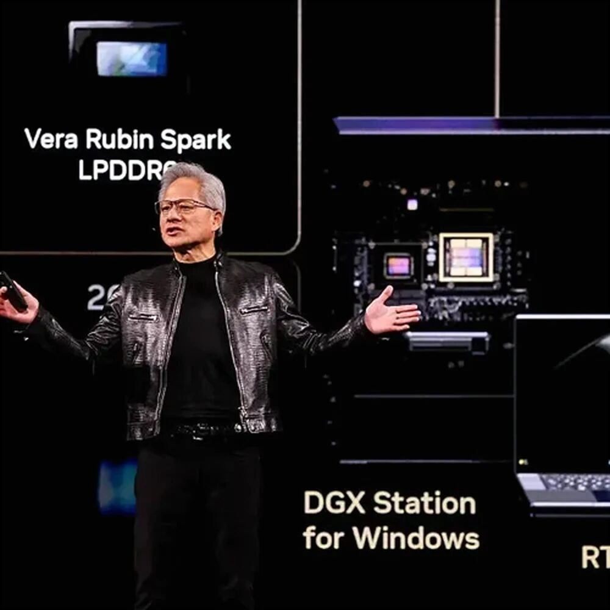

On June 1, 2026, at a tech conference in Taipei, **Nvidia** CEO **Jensen Huang** unveiled a new PC processor made alongside **Microsoft**, called the **RTX Spark** superchip. Nvidia's chips already power most of the world's AI, but this is its push into everyday laptops and desktops. The chip combines a graphics processor and a main processor on one piece of silicon, designed to run AI helpers directly on your computer instead of through the internet. "This is going to be the new PC," Huang said, arguing that instead of clicking and typing, people will simply ask their computer to do things. The RTX Spark arrives this fall in Windows machines from **Microsoft**, **Dell**, **HP**, **ASUS**, **Lenovo** and **MSI**.

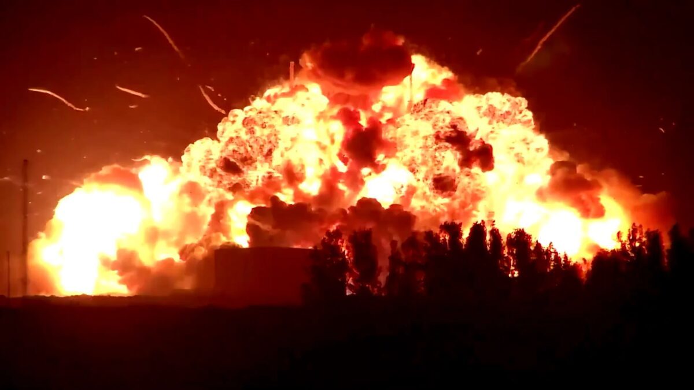

On May 28, 2026, a **Blue Origin** rocket exploded in a giant fireball during a ground test in Florida. The company was test-firing the engines of its New Glenn rocket while it was secured to the launch pad at Cape Canaveral when the rocket erupted into flames. No one was hurt, but the blast destroyed the rocket and badly damaged Blue Origin's only working launch pad. Blue Origin is the space company owned by **Amazon** founder **Jeff Bezos**. New Glenn is its only rocket able to reach orbit, and **NASA** had hired it to help carry equipment to the Moon. Repairing the launch pad could take until 2028, throwing those plans into doubt.

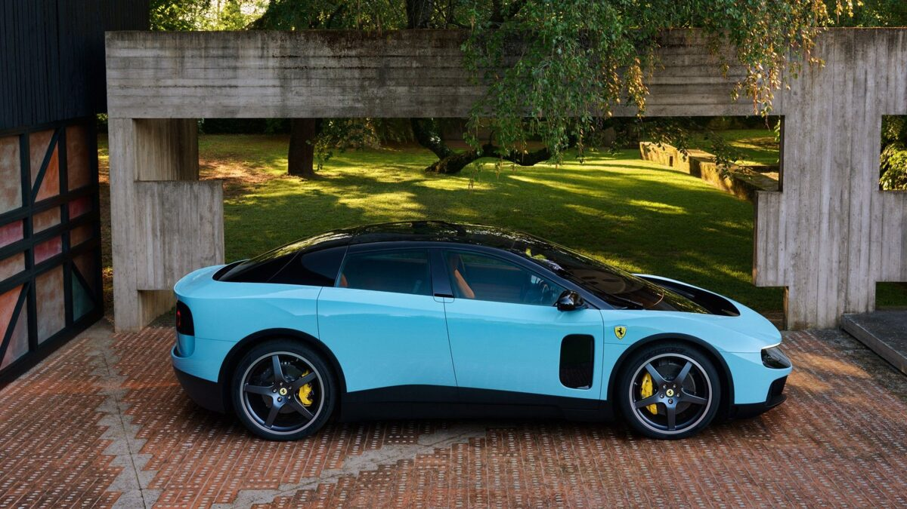

On May 25, 2026, **Ferrari** revealed its first-ever fully electric car, the **Luce**, Italian for "light." It was a big departure for the famous sports car maker: a four-door, five-seat family car priced at `€550,000`, developed with help from former **Apple** design chief Jony Ive. It produces over `1,000` horsepower and a top speed above `310 kph`. The reveal did not go smoothly. Many people disliked the unusual styling, and Ferrari's share price dropped about `8` percent, a sign that investors weren't convinced. Ferrari is betting big on electric power even as rivals like **Porsche** and **Lamborghini** pull back on their own EV plans.

## Global

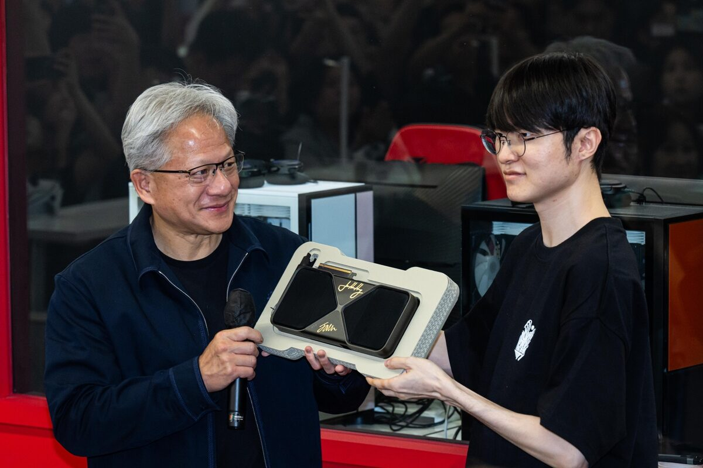

On June 5, 2026, **Nvidia** CEO **Jensen Huang** landed in Seoul and headed straight for a gaming cafe, making six-time **League of Legends** World Champion Lee "**Faker**" Sang-hyeok his first stop in South Korea. Huang runs Nvidia, the company whose chips power most of the world's AI and computer graphics, and which became the first company to reach a `$5` trillion market value in October 2025. Faker, 29, is widely considered the greatest esports player ever. Huang gave him a personally signed **GeForce RTX 5090** graphics card, telling the roughly 500 fans packed into the venue it was the only one in the world and might be worth a million dollars. Huang credits Korea's gaming culture as the foundation of Nvidia.

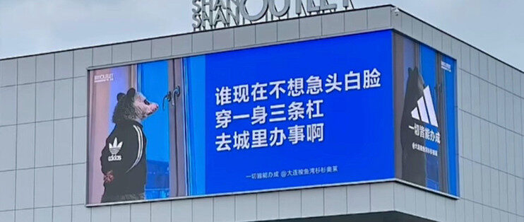

A small translation mistake turned into a marketing hit for **Adidas** in China. A jacket's English description suggested pairing it "with jeans for errands around town," but an automatic translation rendered the phrase in oddly old-fashioned, countryside-sounding Chinese — closer to "dressing up to go handle important business in the city." The mismatch between that humble wording and a sleek global brand struck people as hilarious, and jokes spread across Chinese social media. Instead of hiding the error, Adidas embraced it, releasing custom T-shirts playing on the phrase and having its celebrity spokesperson wear one. It's a reminder that machine translation still misses what humans catch.

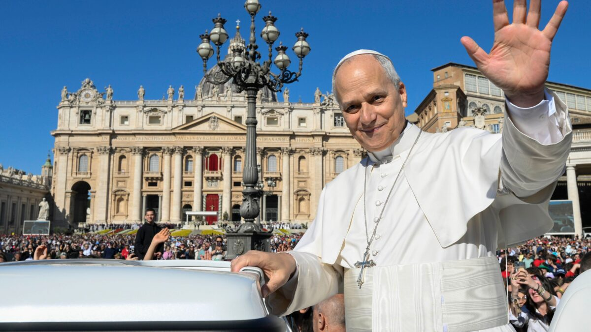

On May 25, 2026, **Pope Leo XIV** released the first major document of his papacy, and its main subject was artificial intelligence. The lengthy letter, called "Magnifica Humanitas," or "**Magnificent Humanity**," warned about the growing power of AI and called for stronger rules to govern it. The Pope argued that AI systems "do not undergo experiences, do not possess a body, do not feel joy or pain," and cannot truly understand love, work, or friendship the way people do. He also raised concerns about AI's effects on jobs, fairness, and truth. Leo XIV, elected in 2025 as the first American Pope, has made AI a defining theme of his leadership.

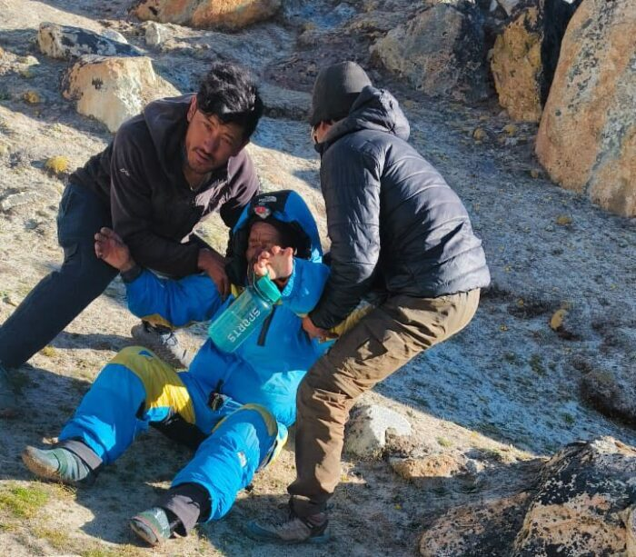

For nearly a week, Dawa Sherpa was a dead man as far as anyone knew. The mountain guide had vanished high on **Mount Everest** on May 30, 2026, during one of the last climbs of the season. He was last seen at a spot called the Yellow Band, more than `23,000` feet up, where the air holds so little oxygen that the region above is called the death zone. His own oxygen ran out. The mountain emptied as the season ended. Back home, his family stopped waiting and began the prayers said for the dead. He had no food, so he chewed ice to stay alive. Then a clean-up crew packing away the season's ropes near base camp spotted something moving: Dawa, crawling down the mountain on his own, frostbitten but alive. His wife said the family was overjoyed. He had descended thousands of feet by himself. 

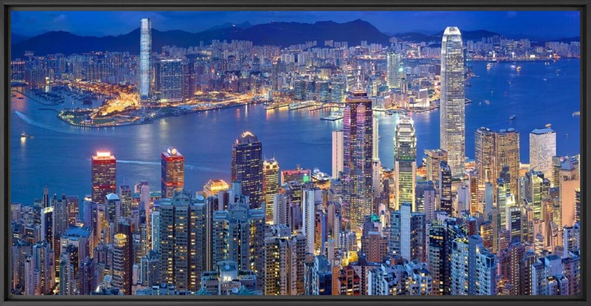

For decades, **Switzerland** was the world's go-to place for wealthy people to park their money. Now it has been knocked off the top spot by **Hong Kong**. According to a major report by the **Boston Consulting Group** released in May 2026, Hong Kong ended 2025 holding `$2.95 trillion` in cross-border wealth, just edging past Switzerland's `$2.94 trillion`. "Cross-border wealth" means money that people keep in a financial center outside their own country. It's the first time Hong Kong has ever topped the list. The shift was driven mostly by money flowing in from mainland China, plus a busy year for companies selling shares to the public. Analysts expect Asian hubs like Hong Kong and **Singapore** to keep growing faster than Switzerland in the years ahead.

## Economy & Finance

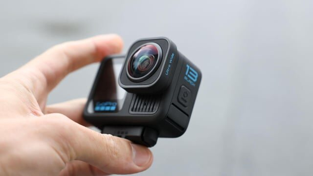

**GoPro**, the company that invented the modern action camera, is fighting for survival. In a June 1, 2026 filing, GoPro warned investors of "substantial doubt" about its ability to keep operating over the next year. The company has approved a plan to lay off about `23%` of its workforce and is searching for a buyer. Two problems are squeezing it. First, GoPros have been steadily pushed aside by smartphones and cheaper Chinese cameras. Second, a spike in memory chip costs of up to `115%` has wrecked its profits. Founded in 2002, GoPro once defined an entire category of rugged cameras strapped to helmets, surfboards, and even spacecraft. Without new funding, bankruptcy is a real possibility.

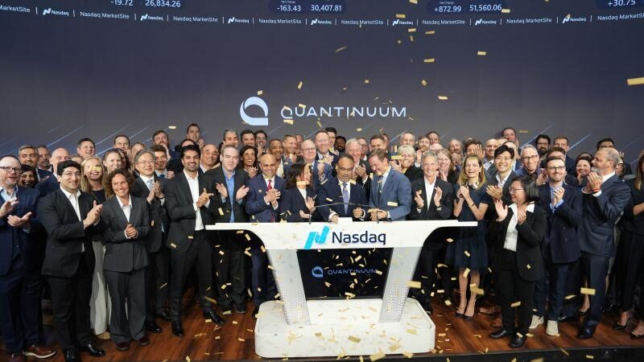

On June 4, 2026, **Quantinuum**, one of the world's leading quantum computing companies, made its stock market debut, raising `$1.68` billion on the **Nasdaq** under the ticker "QNT." Quantum computers use the strange rules that govern tiny particles to solve certain problems far faster than ordinary machines. The company's founder, Ilyas Khan, took an unusual road to get there. He grew up in old mill towns in Lancashire, England, the grandson of immigrants, spent two decades as a banker in Hong Kong, and once owned his hometown football club, Accrington Stanley. Fascinated by physics and mathematics, he founded the quantum software firm Cambridge Quantum, which merged with **Honeywell**'s quantum business in 2021 to create Quantinuum.

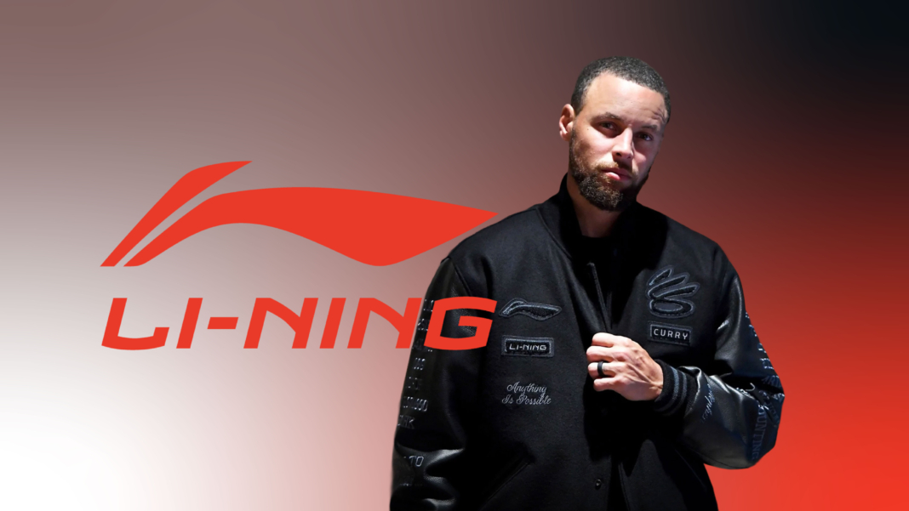

On June 1, 2026, basketball superstar **Stephen Curry** of the **Golden State Warriors** announced a deal with the Chinese sportswear brand **Li-Ning**. The 10-year contract is reported to be worth over `$400` million and covers basketball shoes, clothing, and a golf line. It ends his 13-year partnership with the American company **Under Armour**, which broke up in November. Some fans questioned the move. Curry is 38 and near the end of his playing career, so why pay so much? The answer is China: Curry is a household name there, having toured the country seven times to enormous crowds, and Li-Ning is betting his fame will sell shoes for years. The brand also wants to grow in America, where it is little known, and Curry hopes to open Curry Brand stores in both countries. For Li-Ning, the deal is as much about the future as the present.

Three of the biggest names in technology are heading toward the stock market in what could be a record-breaking year. **SpaceX**, Elon Musk's rocket company, is reportedly the furthest along, with its public debut possibly priced around June 12, aiming for a valuation near `$1.75` trillion. Close behind are two artificial intelligence companies: **OpenAI**, maker of **ChatGPT**, and **Anthropic**, maker of the **Claude** assistant. Together, the three offerings could raise close to `$200` billion from investors, more than the entire US market raised in some recent years. A company "goes public" by selling shares to ordinary investors for the first time, raising money to grow. Whether these giants live up to their enormous price tags is the big question.

## Nature & Environment

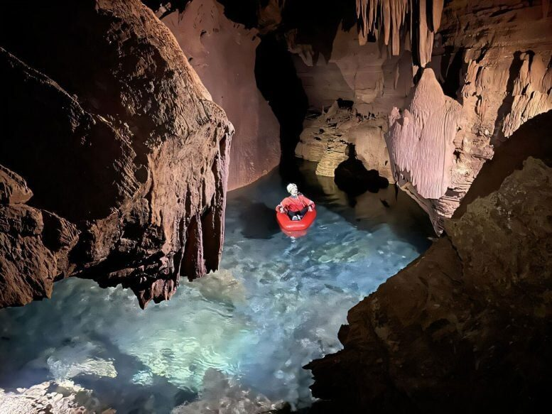

Beneath the **Grand Canyon** lies a hidden world of caves, and scientists are exploring it to answer a vital question: how does water reach the park's springs? Millions of visitors a year rely on a single source called **Roaring Springs**, a cave-fed spring on the canyon's North Rim, for drinking water. A team from Northern Arizona University mapped more than 10 kilometers of caves in just 45 days using mobile laser scanners, building detailed 3-D models. They found that water can travel about `20 kilometers` underground from surface sinkholes to the springs in as little as a week, so fast it barely gets filtered. Understanding these paths helps protect the water from drought and pollution as the region grows hotter and drier.

## Science

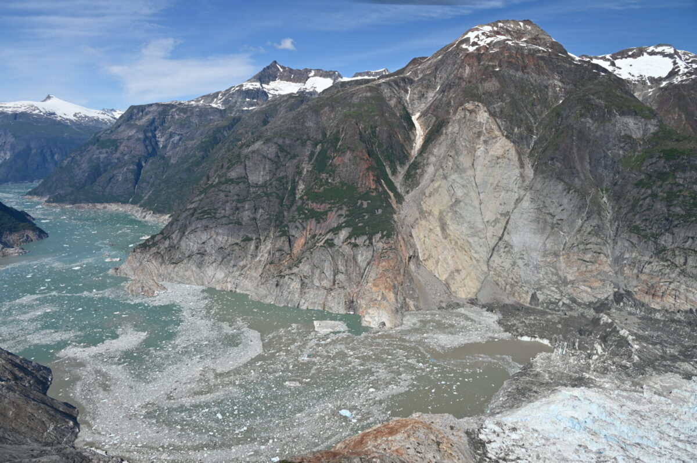

On the morning of August 10, 2025, in a narrow **Alaskan** inlet called Tracy Arm, a mountainside gave way and crashed into the water below. More than `64 million` cubic meters of rock fell into the fjord, enough to trigger a wave that surged `481 meters` up the opposite slope — taller than all but a handful of the world's tallest skyscrapers. It was the second-largest tsunami ever recorded, and the largest not caused by an earthquake. A study published in the journal Science in 2026 pieced together what happened. The cause traces back to climate change: as the South Sawyer Glacier melted and retreated, it stopped holding the mountain in place, and the rock eventually collapsed. Remarkably, no one was killed, even though the fjord is a popular cruise destination. Scientists warn that warming will make such landslide-tsunamis more common in icy regions worldwide.

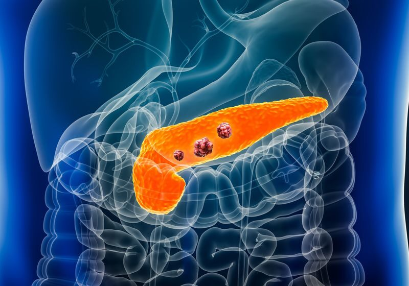

Pancreatic cancer is one of the deadliest cancers there is. More than half of cases are found only after the cancer has spread, and the five-year survival rate for those patients is around `3%`. Now scientists have reported a real breakthrough. A new once-daily pill called **daraxonrasib** roughly doubled how long patients lived: `13.2` months on average, compared with `6.7` months for those on standard chemotherapy. That works out to a `60%` drop in the risk of death. The drug works by jamming a faulty protein called RAS that drives many cancers to grow, something doctors spent decades unable to target. When the results were presented at a major cancer conference, the room gave a standing ovation. It isn't a cure, and the drug still needs final approval, but it's a hopeful sign in a fight that has frustrated scientists for a very long time.

## Math

In a stadium of `80,000` people, are two strangers' lives secretly connected? A famous math idea called the small-world phenomenon says yes, and more strongly than you'd guess. The claim, often called "**six degrees of separation**," is that any two people on Earth can be linked through a chain of about six acquaintances: you know someone, who knows someone, and so on. It sounds impossible across 8 billion people, but the math works because connections multiply fast. If each person knows just 100 others, then friends-of-friends already reach 10,000 people, and one more step reaches a million. After six steps, the number balloons past the world's population. In the 1960s, a scientist named Stanley Milgram tested it by asking people to deliver letters to a stranger only through people they knew personally, and the letters arrived in around six hops. Modern studies of social networks have found chains even shorter.

## Lifestyle, Entertainment & Culture

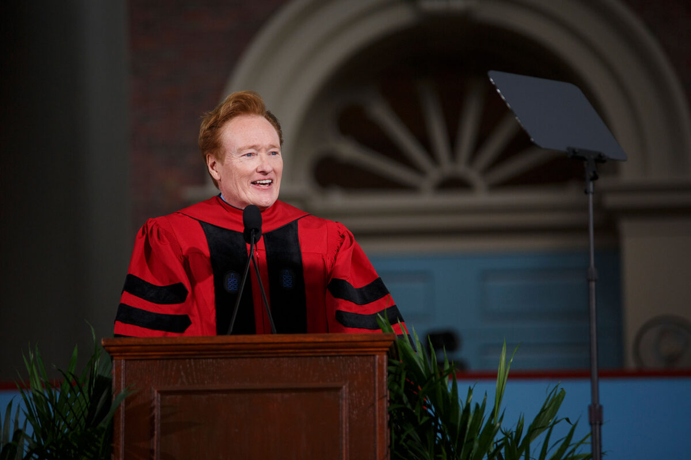

On May 28, 2026, comedian and talk-show host **Conan O'Brien** gave the commencement speech at **Harvard University**, the school he graduated from in 1985. His 25-minute address mixed self-deprecating jokes with a message about humility and openness. O'Brien told the graduating class that his wish for them was that one day, being a Harvard graduate might be "the least important thing people know about you." He explained that while a degree from a famous school is a real achievement, leaning on that status too much can hold a person back. He also shared lessons from traveling the world, arguing that letting yourself be vulnerable and humble leads to deeper connections with others.

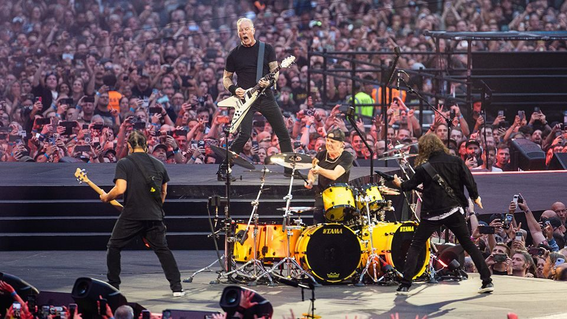

On May 30, 2026, **Metallica** played to `94,000` fans at **Berlin**'s Olympiastadion, setting an attendance record for Germany's biggest-ever stadium concert. The previous record belonged to **U2**, who drew just over `90,000` to the same stadium in 2009. Metallica are an American heavy metal band formed in Los Angeles in 1981, known for fast, loud guitar music and songs like "**Unforgiven**" and "**Master of Puppets**". Over four decades they have become one of the best-selling music acts in history, with tens of millions of albums sold worldwide. The Berlin show was part of their **M72** World Tour, which had grossed `$476` million across `64` shows and played to `3.9` million people as of August 2025. They closed the night with "**Enter Sandman**".

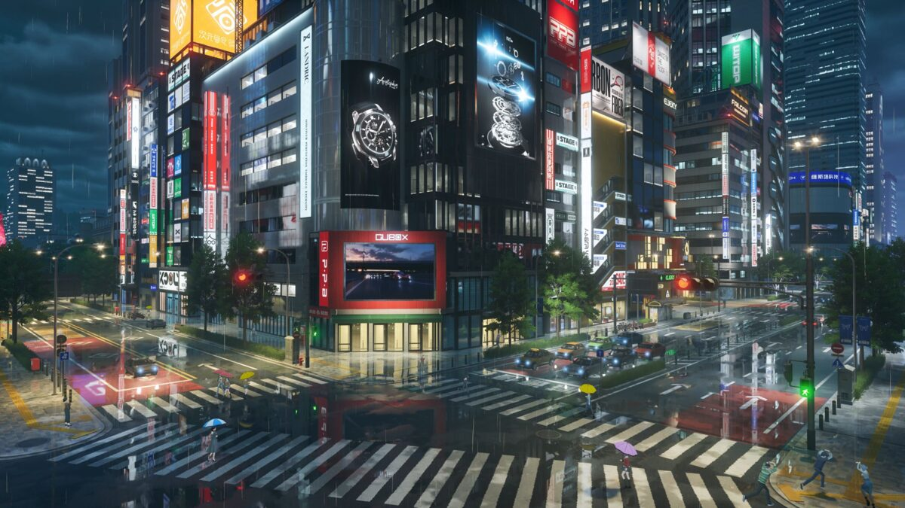

A new video game called **Neverness to Everness** is making waves in Japan, and what's surprising people most is where it came from. The game has an anime art style and even recreates real Japanese landmarks like Tokyo's **Akihabara** district, making it feel thoroughly Japanese, yet it was made by a Chinese studio called Hotta Studio. It's an open-world game where players hunt strange supernatural creatures in a sprawling, living city. It quickly shot to the top of the PS5 download charts in Japan. Some Japanese developers openly wondered why their own industry couldn't build something on this scale, pointing to the huge teams and budgets Chinese studios now command.

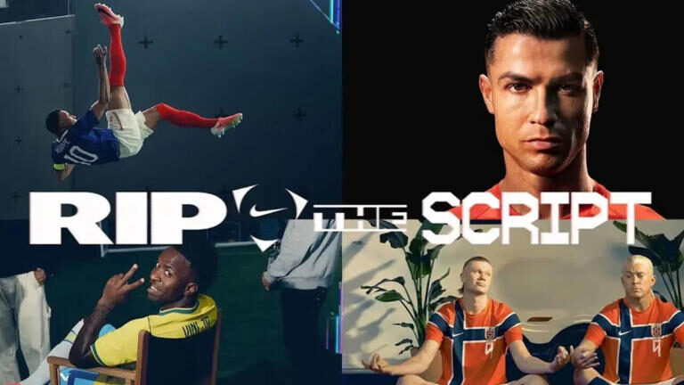

On June 4, 2026, **Nike** released a star-studded commercial for the upcoming World Cup, and one moment had fans buzzing. The ad, called "Rip the Script," shows two of the greatest athletes alive, basketball's **LeBron James** and soccer's **Cristiano Ronaldo**, sitting together in a conference room jokingly discussing a fictional movie about retirement. Both are nicknamed the GOAT, short for "Greatest of All Time." James is the **NBA**'s all-time leading scorer, while Ronaldo has won five **Ballon d'Or** awards as the world's best soccer player. Some fans asked why soccer's other superstar, **Lionel Messi**, was absent. The answer is business: Ronaldo is sponsored by Nike, while Messi represents its rival, **Adidas**, so the two are rarely in the same ad.

## Sports

[Basketball] The NBA Finals are underway, with the **New York Knicks** leading the **San Antonio Spurs** two games to none. New York won Game 1 at home `105-95` on June 4, then took Game 2 by a single point, `105-104`, on June 6. To reach the Finals, San Antonio survived a thrilling seven-game Western Conference Finals against the **Oklahoma City Thunder**, the league's top seed. The Spurs, led by French center **Victor Wembanyama**, won the decider `111-103` on the road. The series now moves to San Antonio for Game 3 on June 8, with the Knicks chasing their first title since 1973.

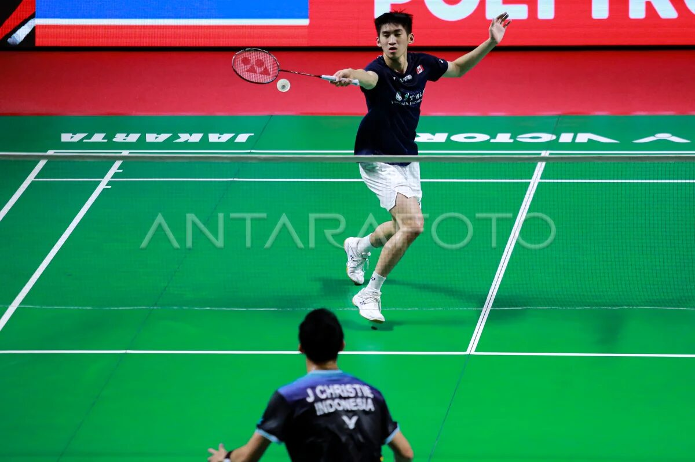

[Badminton] On June 7, 2026, 21-year-old **Victor Lai** became the first Canadian ever to win a Super 1000 title, the top tier of professional badminton. He beat Indonesia's Jonatan Christie, the world's fifth-ranked player, 21-19, 21-8 in the final of the **Indonesia Open** in Jakarta. It was an upset. Christie was the home favorite in front of a roaring local crowd, but he admitted the pressure got to him, while the younger Lai stayed calm and made few mistakes. Badminton is dominated by countries in Asia and Europe, and North America has rarely been a factor. Lai is changing that: in 2025 he became the first Canadian to win a medal at the World Championships, and this title pushes him into the world's top 10. "In Canada we might not have the support or firepower of other countries," he said, "but if you believe, you can do it."

## This Day in History

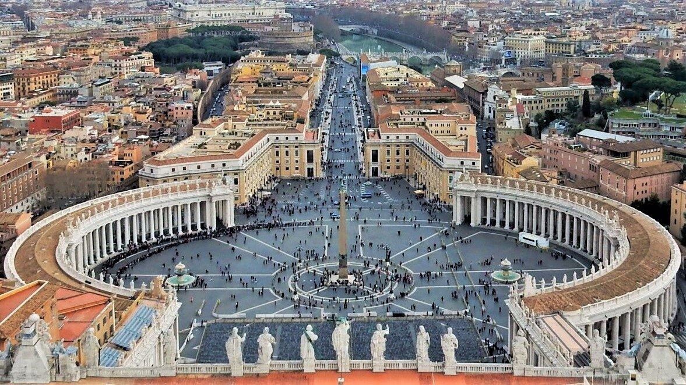

On **June 7, 1929**, the world's smallest country officially came into being. The **Lateran Treaty** took effect that day, recognizing **Vatican City** as an independent state of just `109` acres in the heart of **Rome**. The Vatican is unique: it's the only country that exists mainly to serve a religion rather than a population, home to only around `800` people yet with its own flag, passports, and a small army called the **Swiss Guard**. It's the center of the Roman Catholic Church and the home of the Pope, who leads a faith followed by over `1.4 billion` people worldwide. At its heart stands **St. Peter's Basilica**, built over what tradition holds is the tomb of **Saint Peter** and home to **Michelangelo**'s **Pietà**. Nearby is the **Sistine Chapel**, where Michelangelo painted the famous ceiling and **The Last Judgment**, and where cardinals gather to elect each new Pope.

## Art of the Week

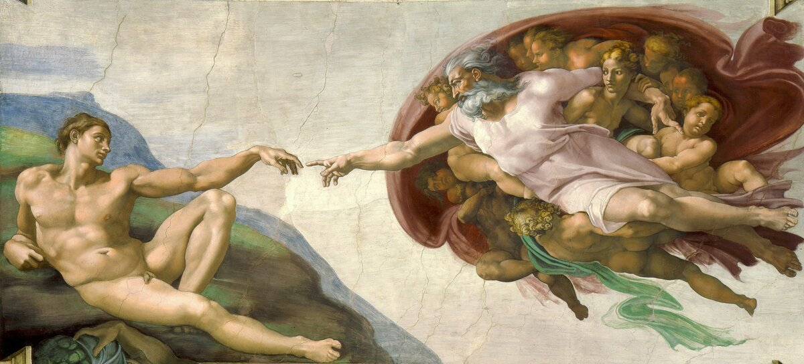

One of the most famous paintings in the world sits on the ceiling of the **Sistine Chapel** in **Vatican City**. It's called **The Creation of Adam**, painted by the Italian artist **Michelangelo** over 500 years ago. The image shows God reaching out to give life to the first human, Adam, their fingers almost touching but not quite, separated by a small gap. That tiny space between the two hands has become one of the most recognized images in art, copied and joked about everywhere. Michelangelo painted it lying on his back on tall scaffolding, working on the ceiling for around four years. The Creation of Adam is only one scene in a vast painted ceiling showing stories from the Bible, but it remains the part visitors crane their necks to see.

## Funny

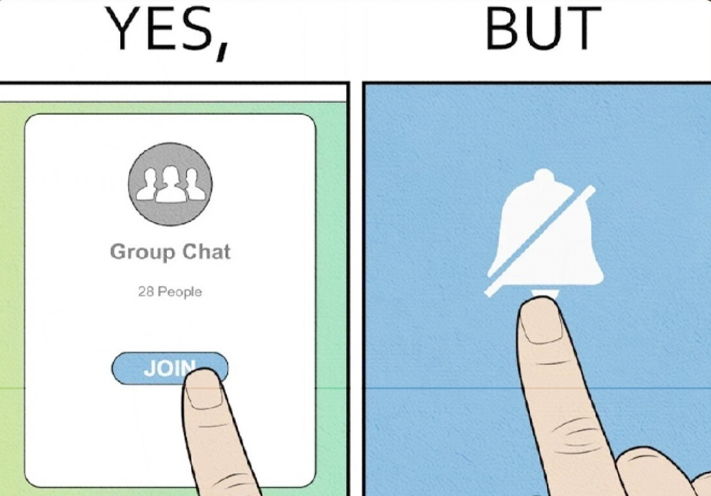

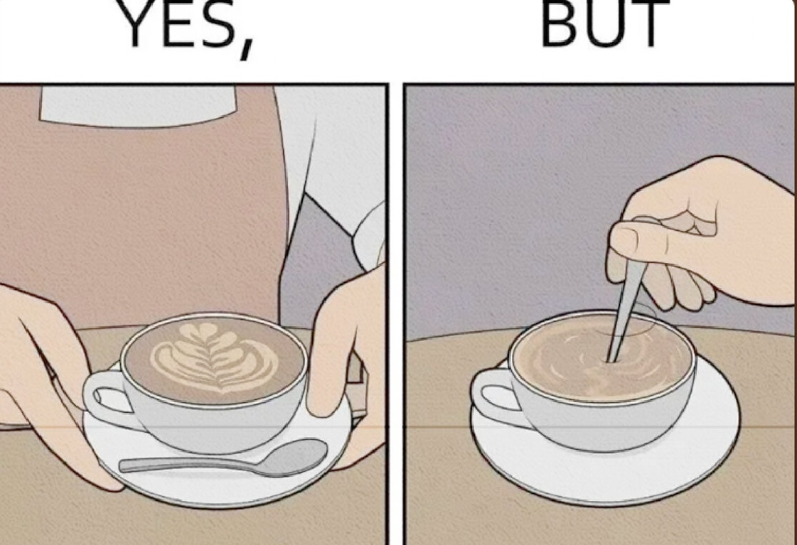

---

## Previous Issues

---

May 31, 2026, **[Countdown to World Cup](https://weekly.sundayblender.com/p/countdown-to-world-cup)**

May 17, 2026, **[The Call of the Wild](https://weekly.sundayblender.com/p/the-call-of-the-wild)**

May 10, 2026, **[Double Wins for Arsenal in 2026?](https://weekly.sundayblender.com/p/double-wins-for-arsenal-in-2026)**

---

Thanks for reading! If you enjoy this newsletter, please share it with friends who might also find it interesting and refreshing, if not for themselves, at least for their kids.

