## Editor's Words

When I was young, Italy's **Series A** was watched by every soccer fan in China.  The Dutch trio of Van Basten, Gullit, and Rijkaard carried **AC Milan**; and the German trio of Matthaus, Brehme, and Klinsmann anchored **Inter Milan**. Videos were fuzzy and TV screens were small, but we watched very game we could find.

When I studied and lived in Singapore, **Manchester United** dominated England's **Premier League** in every fashion. Keane, Beckham, Giggs, Scholes, Cole, Yorke, Schmeichel became part of the collective memory of my generation, before corporate jobs overtook our lives and consumed us.

When I went on several ventures in Beijing, **La Liga** from Spain became the most popular league in the world, with an epic rivalry between **Real Madrid** and **Barcelona**, featuring the incomparable Ronaldo and Messi. I was too busy chasing other dreams to watch soccer.

As my 10-year old boy put on his 10-Messi jersey today, I was ready to enjoy a blissful summer of good old fashion World Cup. 

Circle of life.

## Tech

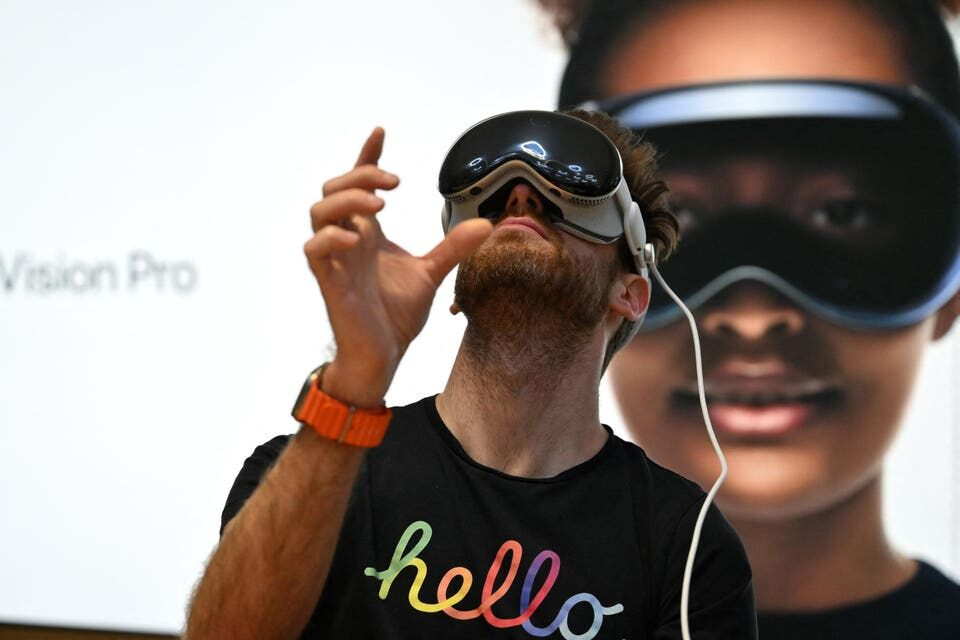

**Apple**'s `$3,499` **Vision Pro** headset, launched in 2024 as the future of "spatial computing," has quietly hit a wall. Reports say it sold only around `600,000` units total, drew an unusually high return rate, and saw its marketing budget cut by more than `95%`. Apple kept the current model on sale and gave it a new chip in late 2025, but in 2026 incoming CEO John Ternus reportedly killed the planned Vision Pro 2 and a cheaper "Vision Air" version outright. The engineers have been moved to a different bet: lightweight smart glasses to rival **Meta**'s **Ray-Bans**. The headset that was meant to define a new era became a stepping stone to a smaller one.

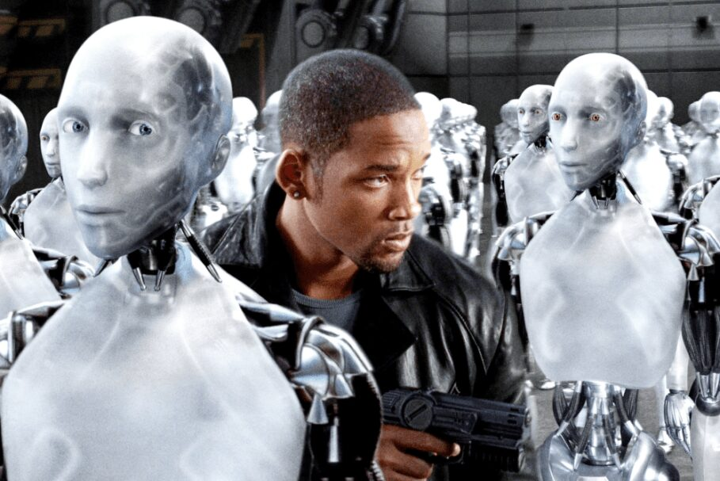

The internet company **Cloudflare**, which helps run a big chunk of the world's websites, reported in June 2026 that for the first time, most of the traffic asking for web pages isn't coming from people. Machines now make about `57.5%` of those requests, and humans only `42.5%`. Before the AI boom this kind of automated traffic was around `20%`. The big reason for the jump is "agentic AI" — programs that browse the web on their own to do tasks for assistants like **ChatGPT**. A person shopping might check five websites; an AI agent doing the same job might visit five thousand. Cloudflare's boss said the crossover happened about a year sooner than he expected. It's a real headache for websites, since bots use up their resources and read their content but don't see ads or click links the way humans do.

## Global

A video went viral in early June showing a **Tesla** driving itself along a narrow, wet cliffside road in China, hugging tight mountain curves with no hands on the wheel. Tesla's head of self-driving, Ashok Elluswamy, shared it, and it spread fast among **Elon Musk**'s followers, who marveled that the car handled roads most human drivers would find nerve-wracking. The clever part: Tesla trained its system for China partly using ordinary road videos pulled from the internet, since it had little local driving data. Not everyone was impressed — others pointed to the system's missing regulatory approval in China and a string of crashes elsewhere.

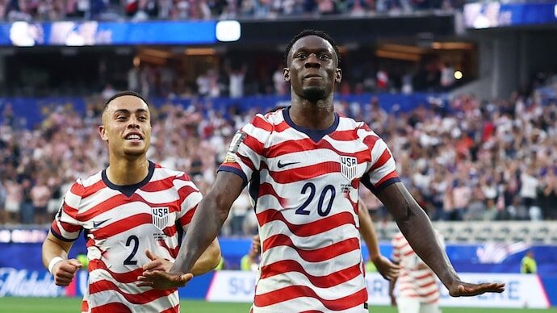

The United States' star of the **World Cup** opener almost wasn't American at all. **Folarin Balogun** scored twice in the `4-1` win over Paraguay, becoming the first US player to score two goals in a World Cup match since `1930`. He was born in Brooklyn but only by accident: his Nigerian parents lived in London, and his mother was visiting family in New York late in her pregnancy when the airline wouldn't let her fly home without a doctor's note saying it was safe. She couldn't get one in time, so Folarin was born in the US. The family moved back to London weeks later, where he grew up and played for England's youth teams 28 times. That birthplace gave him a choice of three national teams — the US, England, and Nigeria — and in 2023 he switched to the country where he happened to be born.

## Economy & Finance

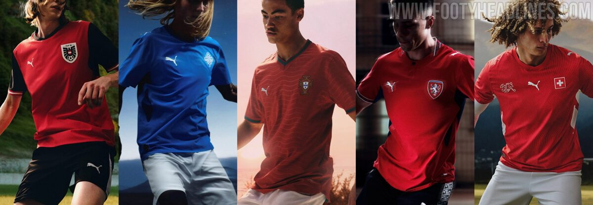

At the **2026 World Cup**, a quieter contest is playing out on the jerseys themselves. Three companies make the kits for most of the `48` teams: **Adidas** outfits `14` nations, **Nike** `12`, and **Puma** `11` — together about `77%` of the field. Each brand picked a different strategy. Adidas dresses host **Mexico** and champions **Germany**; Nike leans on glamour teams like **Brazil**, **France**, and **England**; and Puma went heavy in **Africa**, supplying five nations including Senegal, Morocco, and Ghana. Puma is the interesting one. It's a German company that's been struggling, and in early 2026 China's **Anta Sports** bought a `29%` stake — not the whole company, but enough to become its single largest shareholder. So this World Cup is Puma's first big test under new financial backing, with its turnaround being watched closely from both Germany and China.

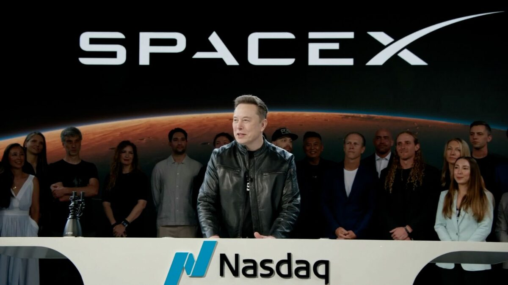

On June 12, 2026, **SpaceX** — **Elon Musk**'s rocket and **Starlink** satellite company — sold shares to the public for the first time, in what became the biggest stock market debut in history. The shares jumped about `18%` on day one, valuing the company at close to `$2 trillion`. Because Musk owns roughly `42%` of SpaceX, the jump pushed his total wealth past `$1 trillion`, making him the first trillionaire the world has ever had. A trillion is genuinely hard to picture: if you spent `$27,000` every single day, it would take you a hundred years just to spend one billion — and a trillion is a thousand billions. Part of why investors value SpaceX so highly is Musk's goal of building a self-sustaining city of about a million people on Mars by around `2050`, using a fleet of giant Starship rockets. The dates keep slipping, though, and Musk has missed many of his own space deadlines before.

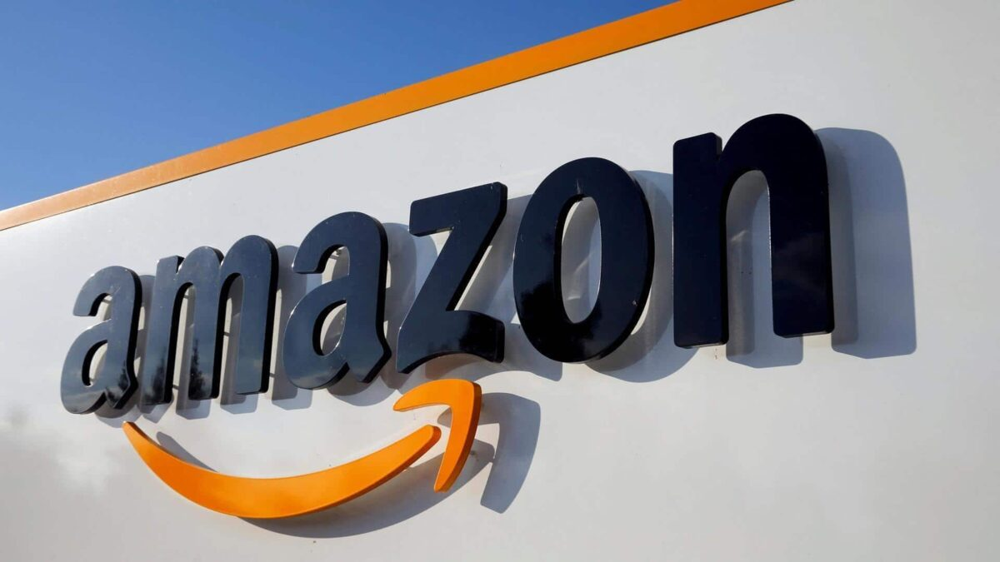

For thirteen years straight, **Walmart** was the biggest company in the United States by revenue. In June 2026, **Amazon** passed it on the **Fortune 500** list, the annual ranking of the largest US companies, taking the top spot for the first time. Amazon brought in about `$716.9 billion` in 2025, just ahead of Walmart's `$713.2 billion`. In the list's 72-year history, only four companies have ever been number one: **General Motors**, **ExxonMobil**, **Walmart**, and now **Amazon**. Amazon didn't get there mainly by selling more things online than Walmart sold in stores. A big driver is **Amazon Web Services**, the division that rents out computing power and data storage to other companies — the invisible plumbing behind much of the internet — which earns money far faster than selling products does.

## Nature & Environment

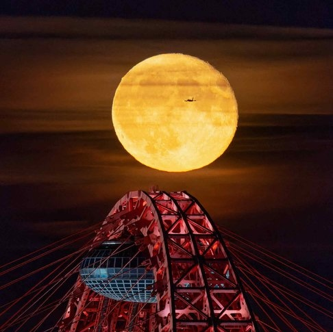

On June 1, 2026, photographers in Moscow caught the full moon rising behind the **Zhivopisny Bridge**, and it was being called a "**Blue Moon**." It didn't look blue at all — in the photos it glows a warm orange. That's because a "Blue Moon" usually has nothing to do with color. It's a calendar quirk: the moon goes through its full cycle of phases every `29.5` days, just a touch shorter than a calendar month, so once in a while you get two full moons in the same month — and the second one is nicknamed a Blue Moon. A moon that actually looks blue is far rarer, and happens only when wildfire smoke or volcanic ash of just the right size fills the sky.

## Science

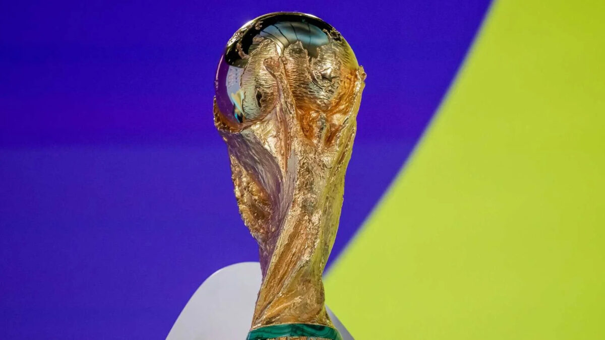

With the **2026 World Cup** underway, two very different machines tried to predict the winner and landed in nearly the same spot. The **Opta** supercomputer played out the whole tournament `25,000` times using team and player stats, and made **Spain** the favorite at `16.1%`, with France, England, and Argentina close behind. **Polymarket** — a website where people bet real money, so the combined wagers act like a crowd's prediction — also put Spain on top at around `16%`. One method is cold math, the other thousands of human hunches backed by cash, yet they agreed. Opta's own history is a mixed bag: it correctly tipped France in 2018, and France reached the final again in 2022 behind a rare hat trick from **Kylian Mbappé**. But it favored Brazil in 2014, the year Brazil lost a semifinal `7-1` to Germany in an epic debacle — and in 2022 it gave the eventual champion, Argentina, only about a `5%` chance.

## Math

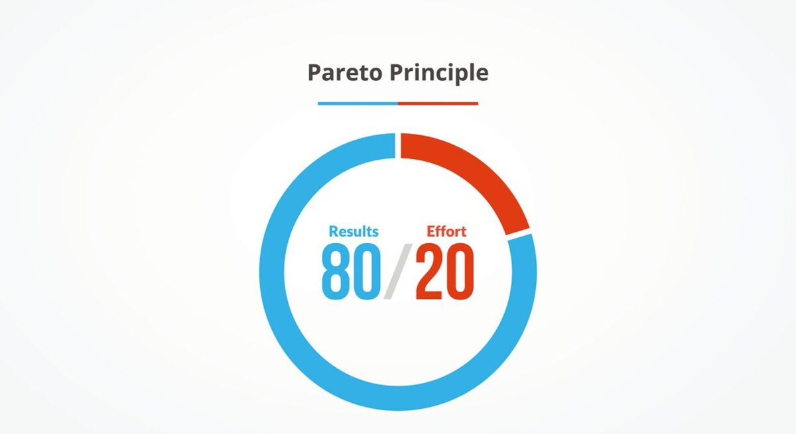

Around 1900, an Italian economist named **Vilfredo Pareto** noticed something odd about land in Italy: roughly 20% of the people owned about 80% of it. He started checking whether that lopsided split showed up elsewhere and kept finding versions of it, even in his own garden, where a small number of pea plants produced most of the peas. Later thinkers named the pattern after him. The **Pareto principle** says that in many situations, most of the results come from a small share of the causes — about `80%` of the outcome from `20%` of the effort or input. It turns up all over: a fraction of a store's products bring in most of its sales, a few of a program's bugs cause most of its crashes, a small set of words make up most of everyday speech. The numbers are rarely exactly 80 and 20. The real point is that results are seldom split evenly, so it's worth figuring out which small part is doing most of the work.

## Lifestyle, Entertainment & Culture

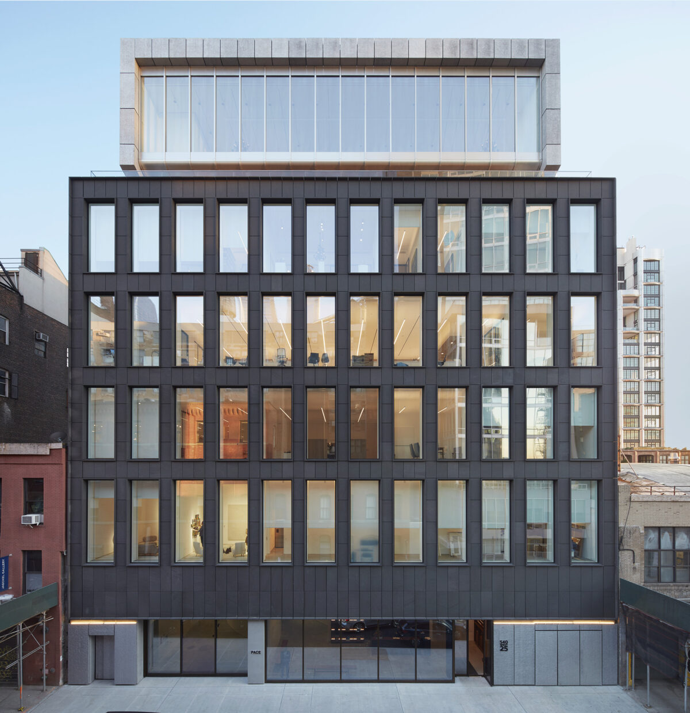

**Pace Gallery**, one of the biggest art galleries in the world, announced in early June that it's dropping about `50` of the roughly `135` artists it represents, along with cutting `50` of its staff. A gallery represents artists by showing and selling their work and splitting the money, so being on a famous gallery's roster is a big deal for an artist's career. Pace's CEO, Marc Glimcher, said the whole way big galleries operate has become "broken" and even "unfixable" — too large, too corporate, too expensive to keep running. His plan is to shrink back to around `80` artists and focus more closely on them. The move worried many people in the art world, because Pace spent years getting bigger, even building a `$100 million` headquarters in New York, and now one of the most powerful galleries is saying that bigger stopped working.

Next Sunday, **June 21**, is **Father's Day** in the US, the UK, China, and many other countries — always the third Sunday in June. It started with a young woman named Sonora Smart Dodd in Spokane, Washington, in 1910. Her father had raised her and her five brothers and sisters alone after their mother died, and she thought dads deserved a day like the new Mother's Day. People sometimes say a mother's love and a father's love feel different, and researchers have found there's something to that — not that one is stronger, but that they often show up in different ways. Studies find dads tend to do more of the physical, playful stuff: wrestling, chasing, tickling, piggyback rides. That kind of play seems to help kids learn to manage their emotions and handle a bit of excitement and risk safely. You don't need to buy anything for Father's Day. A drawing, a note, or doing a chore without being asked works perfectly.

## Sports

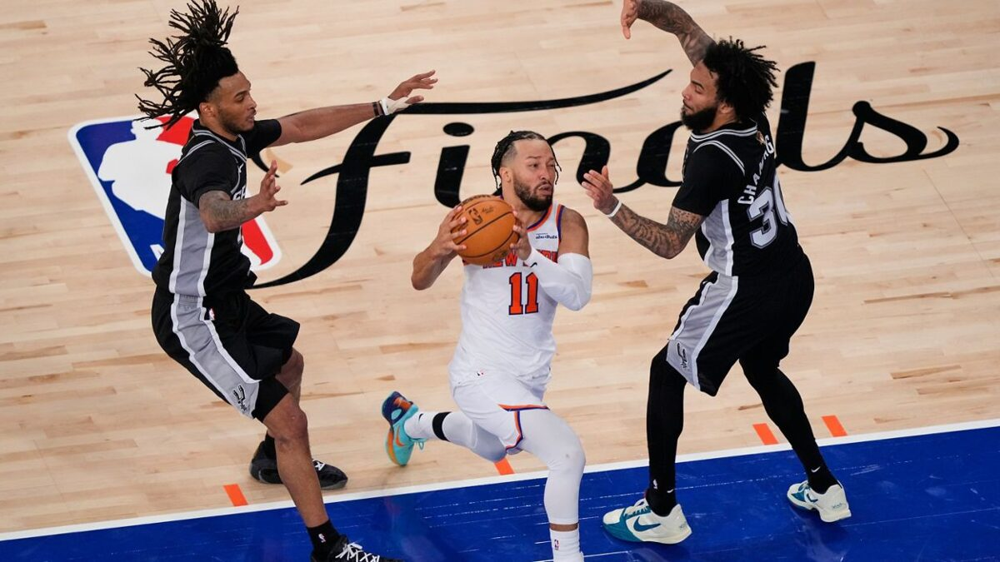

[Basketball] The 2026 NBA Finals have the **New York Knicks** leading the **San Antonio Spurs** `3–1`, with Game 5 in San Antonio on Sunday, June 14. The Knicks are chasing their first title since 1973; the Spurs, built around 22-year-old **Victor Wembanyama**, are after their first since 2014. Game 4 was the wild one. San Antonio raced to a 29-point lead, then watched it vanish: New York outscored the Spurs 58–30 in the second half and won `107–106` when a last-second Spurs shot missed. OG Anunoby scored 33 on 7-of-9 from three, and Jalen Brunson added 36. Wembanyama had 24 points, 13 rebounds, and 3 blocks. Only one team has ever come back from 3–1 down in the Finals — the 2016 **Cavaliers** led by **Lebron James** — so the Knicks are one win from their first championship in 53 years. 

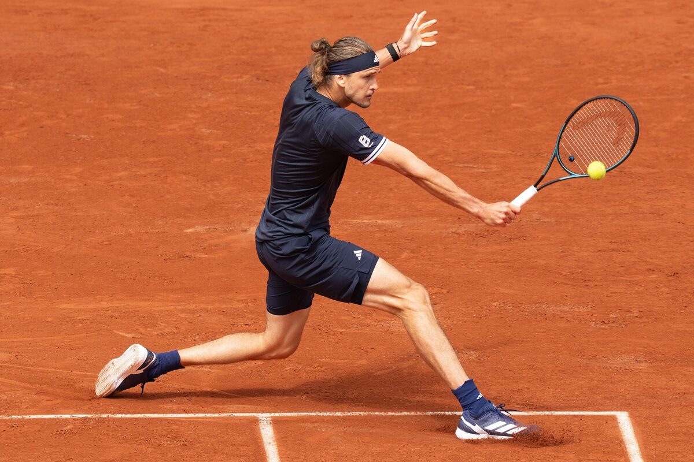

[Tennis] The **2026 French Open** at Roland Garros, finished June 7, was a tournament of breakthroughs. On the men's side, Germany's **Alexander Zverev** finally won his first Grand Slam title at his fourth attempt, beating Italy's Flavio Cobolli 6-1, 4-6, 6-4, 6-7, 6-1. It came on the same Paris court where he'd badly injured his ankle in 2022 and lost a two-set lead in the 2024 final. The women's title went to 19-year-old **Mirra Andreeva**, who defeated Poland's Maja Chwalinska, a qualifier ranked 114th, 6-3, 6-2. Andreeva became the youngest woman to win in Paris since **Monica Seles** in 1992. After a fortnight of upsets that knocked out nearly every favorite, both champions were claiming a Grand Slam for the first time.

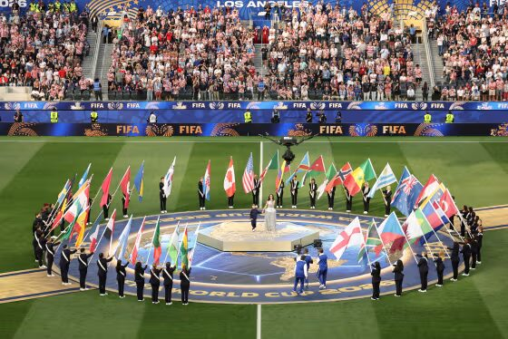

[Soccer] The **2026 World Cup** is the first ever co-hosted by three countries, so it got three opening ceremonies and three home-team openers over two days. **Mexico** kicked off the whole tournament on June 11 in Mexico City, beating South Africa `2-0`. The next day, the other two hosts played: **Canada** drew `1-1` with Bosnia and Herzegovina in Toronto, and the **United States** crushed Paraguay `4-1` at SoFi Stadium near Los Angeles. The US result stood out — the team had scored only three goals total across its entire 2022 World Cup, then scored four in this single game. **Folarin Balogun** got two of them in the first half, becoming the first American to score twice in a World Cup match since the very first tournament back in 1930. The matches are spread across `16` cities, with most games in the US and the final on **July 19** in New Jersey.

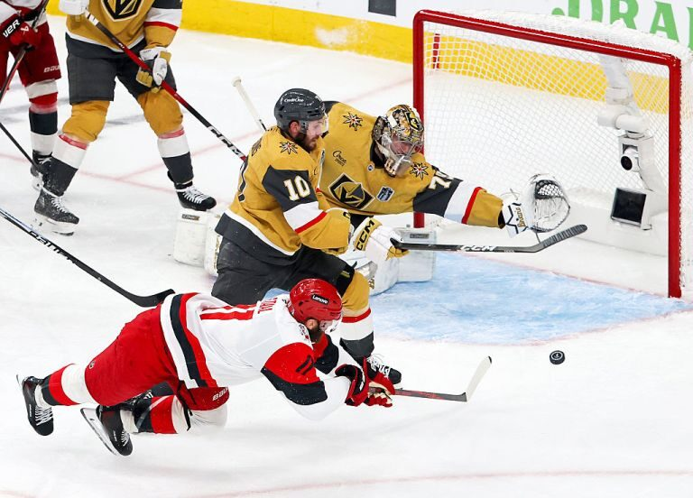

[Ice Hockey] Ice hockey's biggest prize is the **Stanley Cup**, awarded every year to the champion of the **NHL**, North America's top hockey league. It's one of the oldest trophies in sports, first handed out in `1893`, and there's only one of them: the same silver cup gets passed to each new winner, and the winning team's players have their names engraved right onto its bands. The Cup can't hold every name forever, though — its base has five rings, and roughly every 13 years the oldest ring is removed and sent to the Hockey Hall of Fame to make room. To win it, the best team from the league's Eastern half plays the best from the Western half in a best-of-seven series. This year the **Carolina Hurricanes** lead the **Vegas Golden Knights** three games to two, with Game 6 in Las Vegas on Sunday, June 14.

## This Day in History

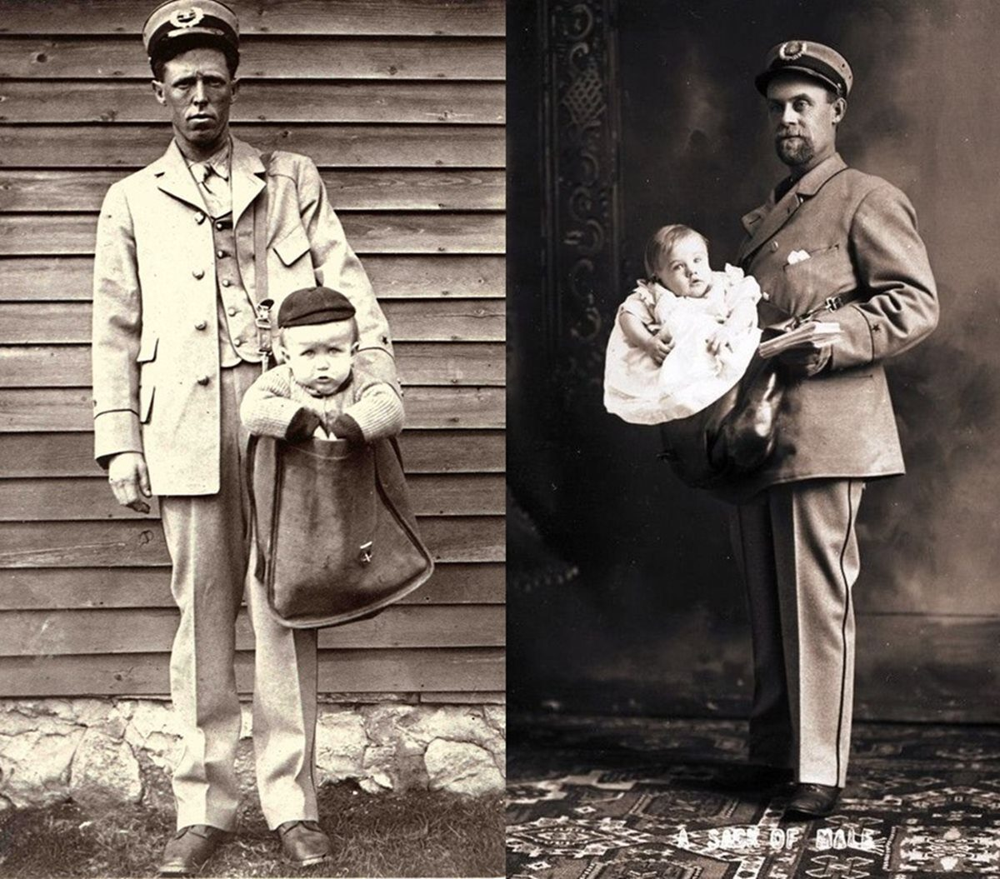

**June 13, 1920** was the day the **US Post Office** ruled you could no longer mail a child. Parcel post had launched in 1913, letting people send packages up to 50 pounds, and Americans tested it with eggs, bricks, snakes, and live bees. A few families mailed their kids too — the first was an Ohio baby sent a mile to his grandmother for 15 cents in stamps, insured for $50. First Assistant Postmaster General John C. Koons ended it, ruling that a child was not a "harmless live animal which does not require food or water."

## Art of the Week

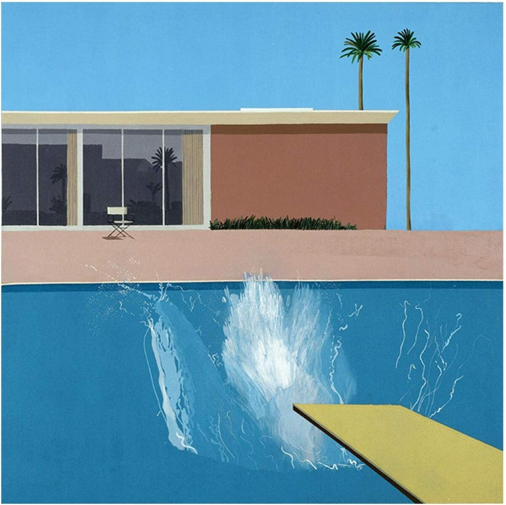

**David Hockney**, the British painter who died on June 11 at 88, was one of the most popular artists of the last century, and his most famous works are his swimming pools. After moving from grey Yorkshire to sunny Los Angeles in the 1960s, he became fascinated by something almost impossible to paint: water, which never holds still. His best-known pool picture is **A Bigger Splash** (1967). It shows a calm pink house, an empty chair, a diving board, and a bright white splash where someone has just jumped in — but the diver is hidden, so you never see who. The strange part is how he made it. A real splash lasts about two seconds, but Hockney painted his slowly and carefully with small brushes over roughly two weeks. He liked the contradiction of spending so long capturing something that vanishes almost instantly.

## Funny Quotes on World Cup

The most impressive thing about **American** soccer fans isn't the support — it's the muscle memory. They call it **soccer** for four straight years, flip to "**football**" the day the World Cup starts, and flip back the day it ends, every single time.

The only people awake at 4 AM during the World Cup are fans and people who made terrible decisions. We are one and the same.

Every World Cup there’s one country nobody predicted going far and one country that disappoints everyone. The second one is always **England**.

**Brazil** loses one match and the entire country treats it as a humanitarian crisis. Respect the passion.

**Messi** dribbles through defenders like they personally owe him money.

**Ronaldo** celebrates goals like he personally invented the concept of scoring.

Rule one for World Cup watch party: no explaining the **offside** rule to newcomers until after the match.

---

## Previous Issues

---

June 07, 2026, **[Wear Adidas to Handle Important Business in the City](https://weekly.sundayblender.com/p/wear-adidas-to-handle-important-business-in-the-city)**

May 31, 2026, **[Countdown to World Cup](https://weekly.sundayblender.com/p/countdown-to-world-cup)**

May 17, 2026, **[The Call of the Wild](https://weekly.sundayblender.com/p/the-call-of-the-wild)**

---

Thanks for reading! If you enjoy this newsletter, please share it with friends who might also find it interesting and refreshing, if not for themselves, at least for their kids.

