## Editor's Words

There is only one official Shaolin kung-fu center in all Shanghai and it happens to be very close to where we live. So we sent our boy to study kung-fu for a few years before elementary school. Along with other boys, he learned how to kick, fight, and flip, mixed with meditation and Chinese calligraphy. It was a good vibe there.

He was taught by Master Yan'An, a 34-gen secular disciple of Shaolin . Yan'An played an active role in spreading Shaolin kung-fu globally. Our timelines actually overlapped in Stanford, though we didn't know each other then. Yan'An speaks fluent English. Many expats in Shanghai send their kids to his class.

In the hot summer of 2025, a new disciple began his study under Master Yan'An. He shaved his head just like Yan'An. He loved Chinese culture and played good basketball during kung-fu breaks. He is also extremely tall.

His name is Victor Wembanyama, the French basketball superstar that just carried San Antonio Spurs into the NBA Finals.

So by Chinese way of teaching, Wembanyama is a junior fellow disciple to my son, who began a few years earlier than him under the same master.

So I am the father of the senior fellow disciple to Wembanyama. You feel me?

## Tech

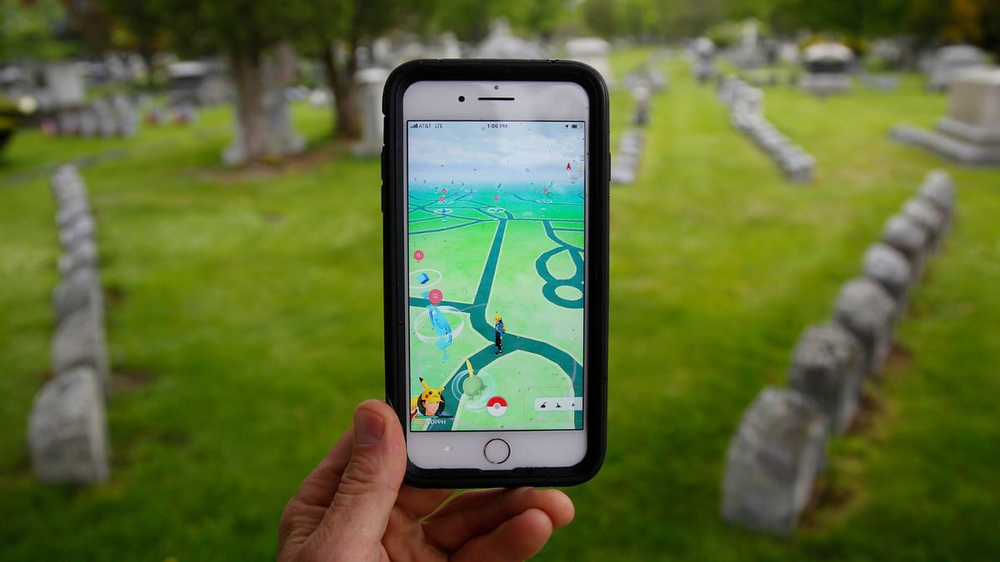

A Dutch newspaper, **Trouw**, reported that data from the hit phone game **Pokémon Go** may have ended up helping build technology for the military. The game launched in 2016, and in 2021 it began rewarding players for using their phone cameras to scan real-world spots like statues, parks, and buildings. Players did this billions of times. The company behind the game, **Niantic**, used those scans to train an artificial-intelligence system that figures out exactly where a camera is by what it sees, useful when GPS signals are blocked. Late last year, the part of the company that owns that technology partnered with a US defense firm to put similar navigation into drones and robots. Niantic says the game's data is not part of the military deal and that players chose to scan. But experts told Trouw the gamers had unknowingly helped a system that could one day guide military machines.

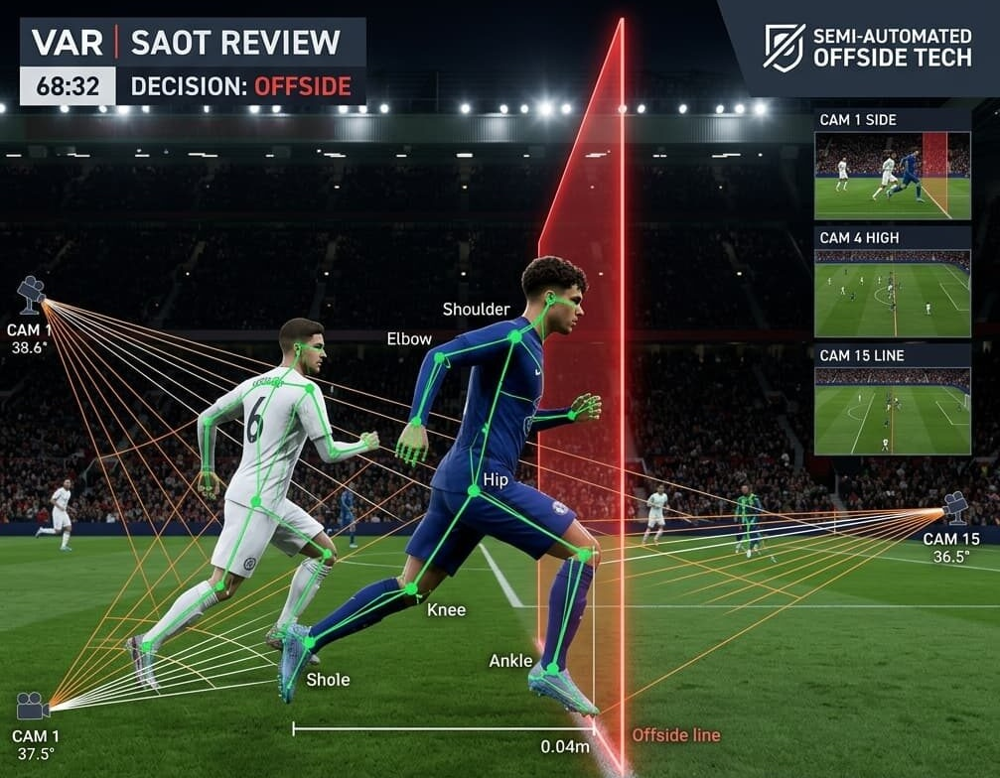

At the **2026 World Cup**, a machine helps decide one of soccer's trickiest calls: offside. The official ball carries a sensor that records the exact instant it is kicked, and cameras track 3D models of every player, built from a one-second body scan taken before the match. Together they work out who was past the last defender the moment the ball was struck, and now whisper the verdict straight into the referee's earpiece in seconds, a job that used to cause long, frustrating delays. The system is deliberately limited: it measures position, which is a fact, but it does not judge whether an offside player interfered with the play, which is an opinion. That call still belongs to the human referee. But the machine is now sharp enough to flag a player ahead by just `10 centimeters`, a hand's width, one so small it is fair to wonder whether it is still an offside that matters.

## Global

For years, wealthy countries raced to put screens in front of children, packing classrooms with tablets and letting phones go everywhere. Now some are hitting the brakes. In June, the **United Kingdom** announced it will ban social media apps like **TikTok**, **Instagram**, and **Snapchat** for everyone under `16`, starting in 2027, saying the apps are designed to be addictive and are making kids unhappy. **Sweden**, once one of the most tech-forward nations on Earth, is going back to books: from this autumn, schools will collect phones from students aged `7 to 16` each morning, and the government is spending hundreds of millions on printed textbooks. The trigger was alarming evidence that reading and writing skills had slipped as screen time climbed. Both countries are following **Australia**, which banned under-16s from social media in 2025. 

For nearly 17 years, Geoffrey Wall sat in the captain's seat of Air Canada jets, commanding more than `900` flights and carrying tens of thousands of passengers across Canada and the world. The flying was real. The license, police say, was fake. Wall, 59, was a fully trained pilot with a valid commercial license, but when he was promoted to captain in 2009 he allegedly never earned the higher airline transport license that Canadian law requires to command large airliners. Instead, investigators say, he forged the documents and fooled both his airline and the country's aviation regulator for years. The story has drawn comparisons to the **Steven Spielberg** film "Catch Me If You Can," in which a young con artist talks his way into a pilot's uniform. Wall's deception only unravelled after he had already retired, having earned nearly three million Canadian dollars as a captain. He now faces seven criminal charges, including fraud and forgery.

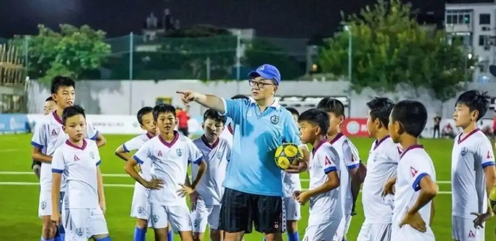

A team of Chinese schoolkids just did something no Asian team had ever done. On June 2, a U12 squad called the **China Football Kids** won the **SIGISMONDI Cup** in Italy, a tournament so respected that people call it the "little World Cup" for that age group. They beat the academy teams of European clubs one after another, going seven games without a loss and scoring 21 goals while conceding only 2. In the final they drew 1-1 with the youth side of Everton, an English Premier League club, then won 5-4 on penalties. In `37` years of the tournament, no team from outside Europe had ever won it. What makes the win stand out is the backdrop. The team's coach, **Dong Lu**, a former TV commentator, built this youth program himself over nine years, and his players are ordinary students who train mostly on weekends and holidays. In the mean while, China's senior men's team is one of the weakest in the world: it has reached the World Cup only once, in 2002, and remains the only country in the group-stage era to leave a World Cup with no points and no goals at all. 

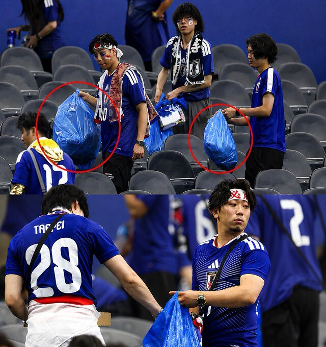

After **Japan**'s World Cup match against the **Netherlands** in Texas, hundreds of fans did something unusual: instead of heading for the exits, they pulled out blue plastic bags and started picking up trash, leaving their section of the stadium spotless. The players cleaned their locker room too. Japanese supporters have done this at every World Cup since their first one in 1998, and it has become their signature around the world. The habit starts in school, where Japanese children spend a few minutes each day tidying their own classrooms and hallways. One fan explained the thinking behind it: you should leave a place cleaner than you found it.

## Economy & Finance

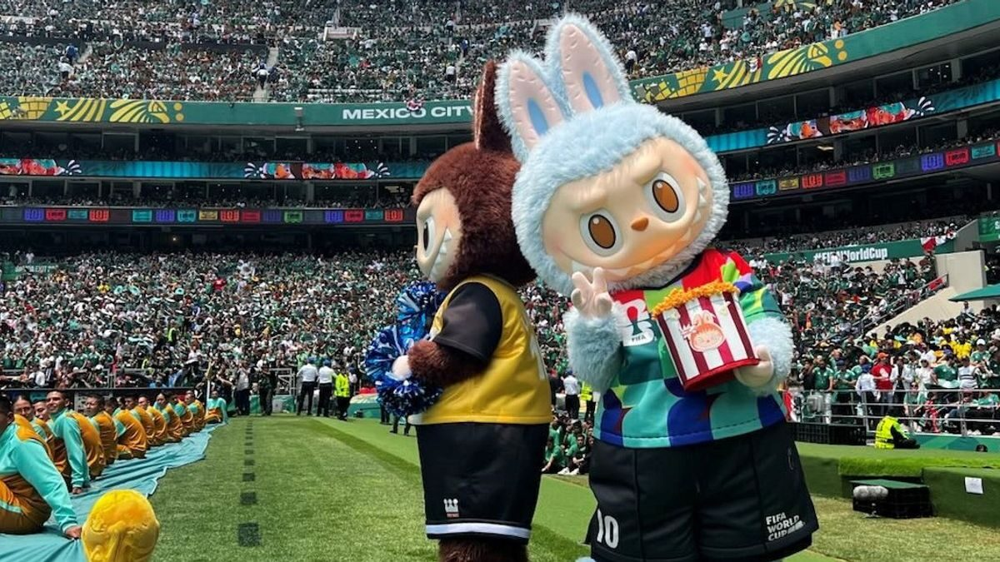

China's national team didn't qualify for the **2026 World Cup**, but almost everything else about the tournament has a Chinese fingerprint on it. The merchandise tells the story: roughly `70` percent of World Cup flags, jerseys, scarves, and toys come from a single Chinese trading city, **Yiwu**. Four of **FIFA**'s 16 top global sponsors are Chinese companies. **Lenovo** runs the tournament's AI and computing systems, and **Hisense** supplies the giant screens referees use to check replays. Getting fans to the stadiums in Mexico is largely a Chinese job too: the bus maker **Yutong** built about `85` percent of Mexico City's new fleet, including `26-meter` electric "land trains" that carry `270` passengers at once. Even the event's viral collectible, the fuzzy **Labubu** dolls that danced at the opening ceremony, comes from a Chinese toymaker. None of this is sudden: Chinese factories have supplied World Cup goods since 1994, but they have climbed from stitching jerseys to running the tournament's referee screens and AI.

## Nature & Environment

**Antarctica** has been making news at both ends of its ice. Iceberg A-23A, which broke off the continent in 1986, was once the largest on Earth, about `4,000` square kilometers, roughly twice the size of **Luxembourg**, and weighing nearly a trillion tons. It was so heavy it got stuck on the seafloor and barely moved for over 30 years. In 2020 it finally floated free, then spent months trapped in a spinning column of water before drifting north toward **South Georgia**, an island packed with penguins and seals that scientists feared it might block. It missed, and by spring 2026, after nearly 40 years, it had melted away and was gone. Around the same time, in the middle of the Antarctic winter, a research station on the peninsula recorded `15.4°C` on June 6, roughly `20°C` above normal, warm enough that rain fell on glaciers and bare ground showed through the snow. Scientists watch both as signs of a warming continent.

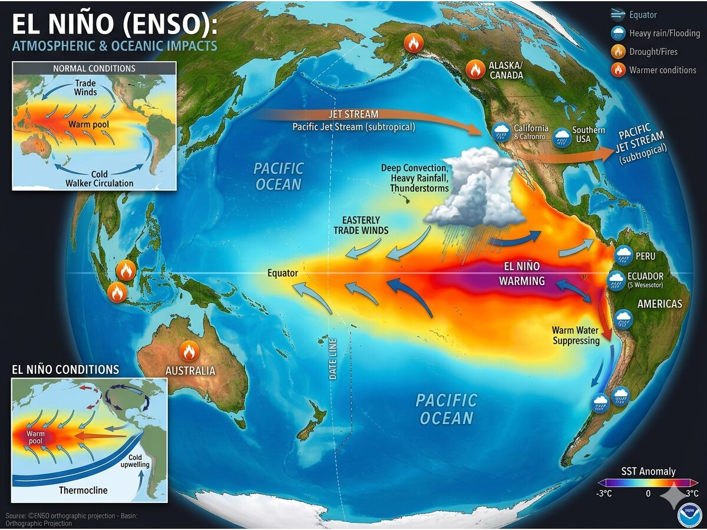

A weather pattern called **El Niño** is building in the Pacific Ocean, and this one could be the strongest in about `150` years. El Niño starts when the winds that normally push warm water toward Asia weaken, letting a vast pool of warm water spread east across the Pacific toward South America. That heat throws the world's weather out of balance: floods in some places, droughts in others, failed harvests, more wildfires, and global temperatures pushed higher. The last strong El Niño helped make 2024 the hottest year ever recorded. This one is forming over water near the equator that hasn't been this warm since 1877, and the very strongest events like it have a nickname: a "super" El Niño.

## Science

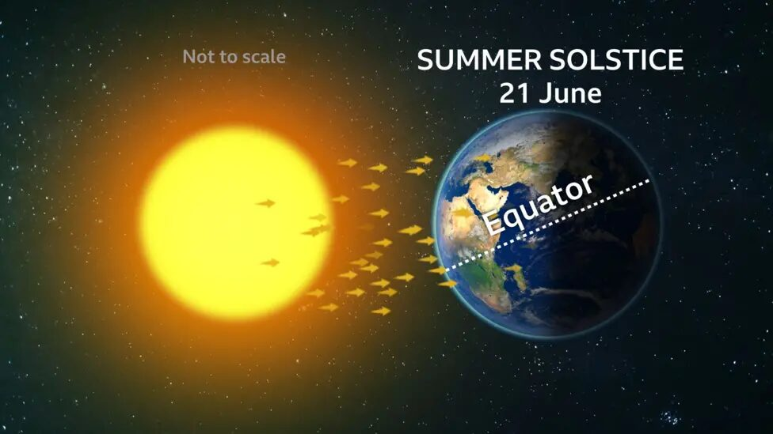

On June 21 the Earth reaches the summer solstice, the longest day of the year in the Northern Hemisphere and the astronomical start of summer. It happens because Earth spins on a tilted axis, leaning about 23.5 degrees. On the solstice the North Pole points as far toward the Sun as it ever does, so the Sun climbs higher in the sky and stays up longer. The word comes from the Latin for "Sun standing still," because around this date the Sun's path barely shifts for a few days. South of the equator it is the opposite: their shortest day.

## Math

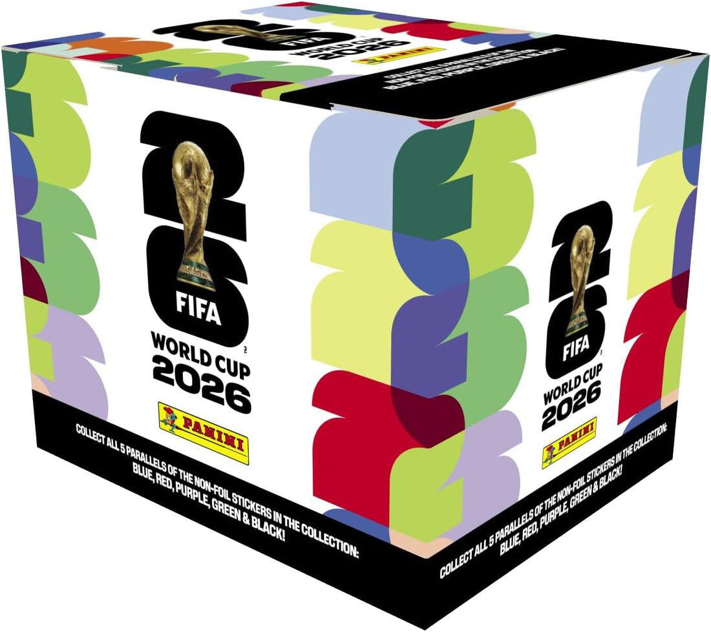

Before the **World Cup** even kicks off, millions of fans chase a different prize: filling a **Panini** sticker album. The Italian company has made one for every World Cup since 1970, a booklet with an empty numbered slot for every team and player. You fill it using sealed packets of stickers, and the catch is that you can't see what's inside until you open them. This year's album is the biggest ever, with `980` stickers to collect. Because every packet is random, you can't simply buy 980 and finish. Early on, almost every sticker is new. But near the end, when you need just 10 more, each random sticker has only a 10-in-980 chance of being one you're missing, so you have to buy about 98 stickers just to land one of them. Adding up that growing struggle across all 980 slots, completing the album alone takes around `7,300` stickers. That is why swapping your doubles with friends is not just fun but the smartest way to finish.

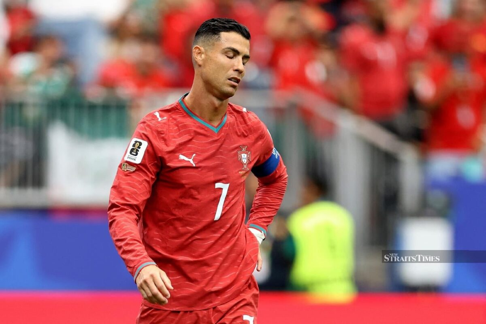

Soccer keeps detailed statistics, and one of the most watched is possession: the share of the game a team spends with the ball. You might assume the team that hogs the ball wins. The 2026 World Cup keeps proving otherwise. **Portugal** held the ball for `75` percent of their match against **DR Congo**, the highest possession of any team in the tournament, and still only drew `1-1`. **Turkey** was even more striking. Against **Paraguay** they had nearly `80` percent of the ball and fired off `32` shots to Paraguay's `7`, yet lost `1-0` and were knocked out. High possession can quietly measure desperation, not dominance, a team passing endlessly because nothing else is working.

## Lifestyle, Entertainment & Culture

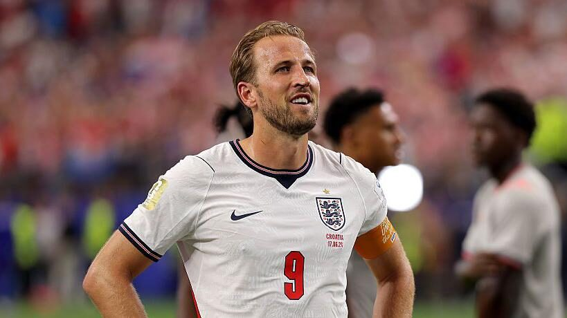

After **England** beat **Croatia** `4-2` in their opening **World Cup** match in Dallas, the most memorable moment came once the final whistle had blown. The players walked over to thank their fans, and the stadium began to play "**Wonderwall**," the 1995 song by the British rock band **Oasis**. Thousands of England supporters sang it back to the team at full volume. The players stopped and stared, visibly moved; some, like **Jude Bellingham** and **Harry Kane**, were caught on camera mouthing the words along with the crowd. The clip went viral, and Oasis and singer **Liam Gallagher** both reshared it on their own accounts. The song isn't an official anthem. England, like every team, submitted a playlist of tunes to be played at their matches, and "Wonderwall" was chosen after talking with fan groups. It drew a far bigger reaction than the other classics, and some are now calling it England's unofficial song of the tournament.

## Sports

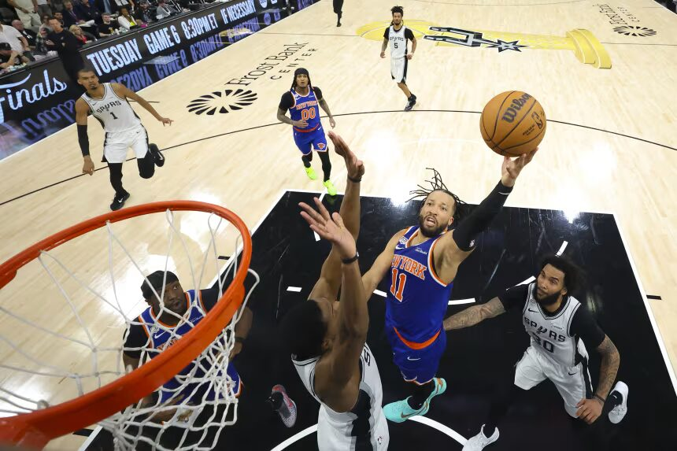

[Basketball] The **New York Knicks** are NBA champions for the first time since 1973, closing out the **San Antonio Spurs** `94-90` in Game 5 to win the Finals four games to one. The series was a nerve-shredder. Three of the Knicks' four wins came by a single possession, and the pattern was almost cruel to San Antonio: the Spurs would build a lead, control the tempo, and then watch it evaporate in the fourth quarter. Game 5 was the template. New York scored just `13` points in the first quarter and trailed most of the night before erupting for `29` in the final period to steal it. **Jalen Brunson** was the closer all series, pouring in `45` points in the clincher. **Victor Wembanyama**, San Antonio's brilliant young giant, gave everything with `19` points, `14` rebounds, and `5` blocks,  but the Knicks answered every time, and after `53` years the title belongs to New York again.

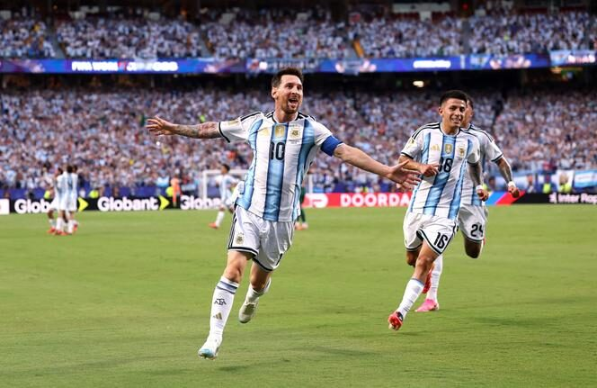

[Soccer] **Lionel Messi** is 38 years old, and he is not finished rewriting the record books. In **Argentina**'s opening match of the **2026 World Cup**, a `3-0` win over **Algeria**, Messi scored all three goals. The hat-trick carried him to `16` World Cup goals in total, tying **Miroslav Klose** of Germany for the most ever scored by any man in the tournament's history. The night set other marks too. By simply walking onto the field, Messi became the first man to play in six different World Cups, a span reaching back to 2006. And at 38, he became the oldest player ever to score a hat-trick at a World Cup, taking that record from his longtime rival **Cristiano Ronaldo**. The crowd of nearly 70,000 rose to its feet as he left the pitch, saluting a player chasing history at an age when most have long retired.

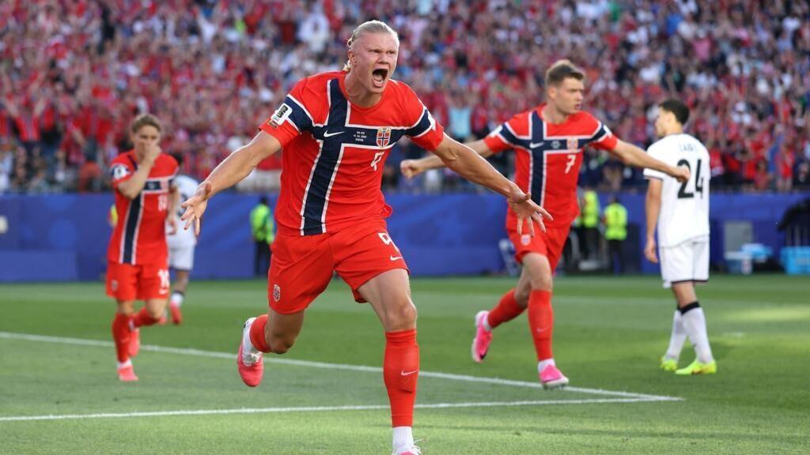

[Soccer] The expanded 48-team **World Cup** has packed the past week with goals. Brazil, the record five-time champions, looked sharp in a `3-0` win over tournament debutants Haiti, scoring all three goals in the first half. Their star winger **Vinícius Junior** was involved in every one of them, capping a dazzling individual display. France, the team Argentina beat in the 2022 final, opened with a `3-1` victory over Senegal, with superstar **Kylian Mbappé** scoring twice. Germany, another former winner, had a tougher time but edged Ivory Coast `2-1`. The biggest story among the newcomers was Norway, in their first World Cup since 1998. Their giant striker **Erling Haaland**, one of the most feared scorers in the world but long denied a World Cup stage, finally got his chance and scored twice in a `4-1` win over Iraq. Elsewhere the goals flowed: the Netherlands thumped Sweden `5-1`, Canada crushed Qatar `6-0`, and hosts the United States beat Australia `2-0`.

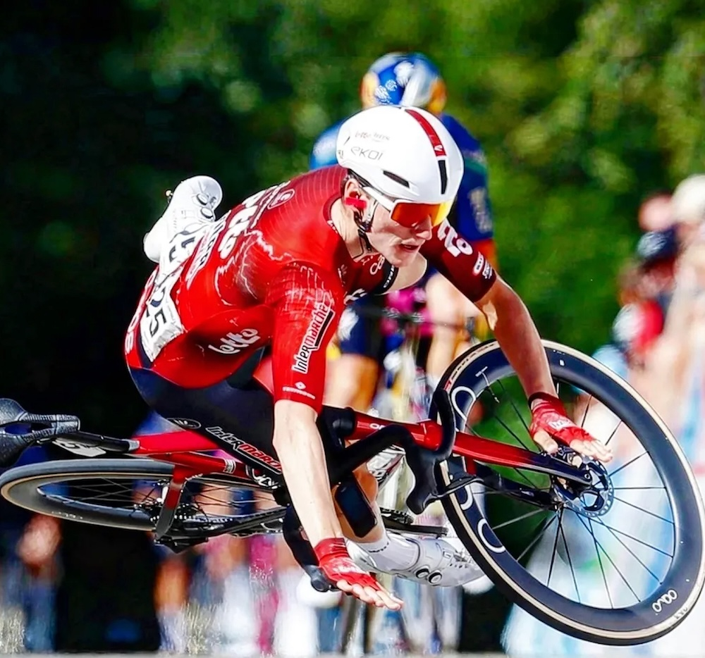

[Cycling] Belgian cyclist **Liam Slock** had been a professional for nearly four years without a single win. On June 14 at the **GP Gippingen** in Switzerland, he finally held off a strong group, including 2020 Olympic champion **Richard Carapaz**, in the final 200 meters and lifted his arms to celebrate his first victory. Then it went wrong. A gust of wind caught his front wheel the moment he let go of the handlebars, and he crashed and slid across the finish line on his shoulder. He still won, because his bike crossed first, but the embarrassing photo of him sprawled on the road instantly became an internet meme. "Luckily the win came with it," Slock said, "otherwise this would probably have been the fail of the year."

## This Day in History

When the **Eiffel Tower** wowed crowds at the 1889 Paris world's fair, organizers of Chicago's **1893 World's Columbian Exposition** wanted something to top it. A young engineer named **George Ferris** answered with the very first Ferris wheel, a giant steel wheel `264` feet tall that opened on **June 21, 1893**. It carried `36` cars, each holding up to `60` people, so more than `2,000` riders could turn through the sky at once. From the top they could see across Lake Michigan, higher than many had ever been. Over `1.4 million` people paid 50 cents for a ride that summer. The original was torn down for scrap in 1906, but Ferris's idea spread everywhere: today Ferris wheels turn at fairs and city waterfronts around the world, from Chicago's **Navy Pier** to the `820-foot` **Ain Dubai**, the tallest yet.

## Art of the Week

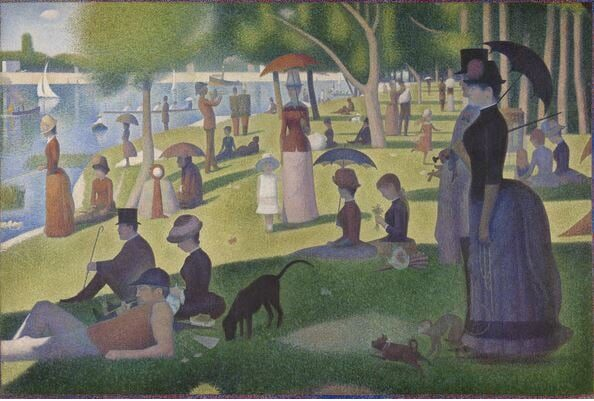

Stand far back from this painting and you see a calm scene: well-dressed Parisians relaxing by a river on a Sunday afternoon, with parasols, a sailboat, and even a small monkey on a leash. Step close, and the people dissolve into millions of tiny dots of pure color. That was the whole idea. **Georges Seurat**, a young French artist, finished **A Sunday Afternoon** on the **Island of La Grande Jatte** in 1886, when he was 26. Instead of mixing paint on a palette, he placed dots of separate colors side by side and let the viewer's eye blend them, a method he based on the science of how we see. He believed dots of pure blue and yellow would look brighter than green mixed on a brush. The painting is about seven by ten feet and took him two years. His careful, scientific technique earned a name, **pointillism**, and launched a new movement called **Neo-Impressionism**.

## Funny

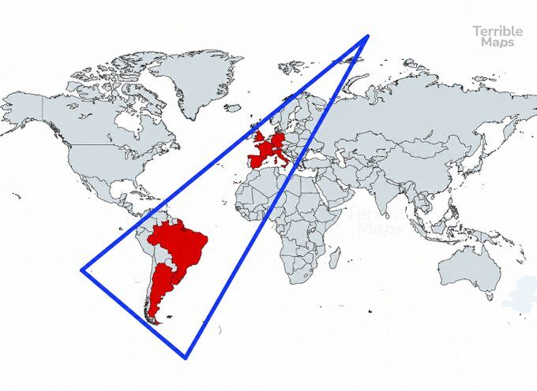

All the countries that have won the World Cup fall into this triangle.

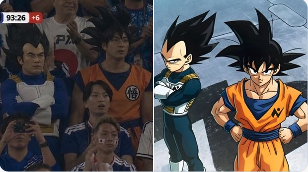

Two men dressed as Vegeta and Goku from "Dragon Ball" for the Japan vs Tunisia World Cup match. Respect.

---

## Previous Issues

---

June 13, 2026, **[Who Will Win the 2026 World Cup?](https://weekly.sundayblender.com/p/who-will-win-2026-world-cup)**

June 07, 2026, **[Wear Adidas to Handle Important Business in the City](https://weekly.sundayblender.com/p/wear-adidas-to-handle-important-business-in-the-city)**

May 31, 2026, **[Countdown to World Cup](https://weekly.sundayblender.com/p/countdown-to-world-cup)**

---

Thanks for reading! If you enjoy this newsletter, please share it with friends who might also find it interesting and refreshing, if not for themselves, at least for their kids.

