## Editor's Words

Early last year when I started writing the Sunday Blender, I was using X.com as the primary source of the latest stories on all subjects, especially in tech, science, and sports. I followed all the major media accounts and grew an ever expanding watch list for KOLs in various disciplines. I was methodical. I wanted to catch news when they're still fresh and for a long time that place was X.com (Twitter).

I don't do that so much anymore. For the past few months, WeChat has quietly become the go-to source for stories featured in the Sunday Blender. I don't even have to search high and low for high-impact public accounts. Interesting stories just appear on my timeline. The more I read, the more relevant those stories have become, for the themes of the Sunday Blender.

All these media platforms create an echo chamber in the end. X.com is becoming quite noisy and losing its signal impact. WeChat, on the other hand, may not be the best place for early signals yet, but at least it's got diversity and surprisingly is serving me well curating stories from around the world.

## Tech

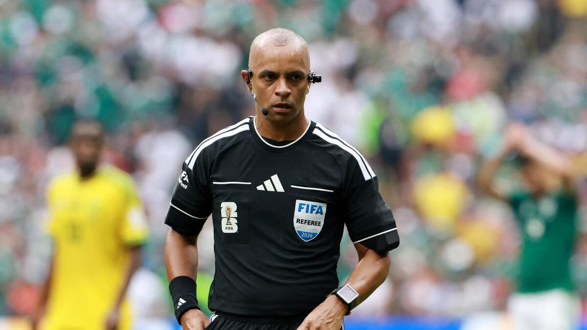

At the **2026 World Cup**, the referees are wearing some seriously high-tech gear. For the first time ever, every referee at all 104 matches has a tiny HD camera mounted near one ear, giving fans at home a referee's-eye view of the action. The camera is part of a three-piece kit. A microphone keeps the referee talking to the assistant referees, the fourth official, and the video review team, and it can even broadcast the referee's decisions out loud to fans in the stadium. An earpiece lets the rest of the officials feed information back instantly. The footage from a sprinting referee would normally be far too shaky to watch, so the technology company Lenovo built software that smooths it out in real time. One thing that hasn't changed: the referee still blows an ordinary whistle to stop play. The camera just lets everyone finally see what made them blow it.

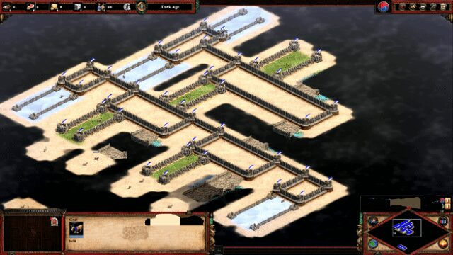

**Adrian de Wynter**, a scientist at **Microsoft**, did something gloriously strange: he built a working neural network inside the 1999 strategy game **Age of Empires II**, using goats. A neural network is the kind of system that powers modern AI like chatbots. In the game's map editor, he set up the tiny on-off switches that computers use to think. Grass meant a 0, a bridge meant a 1, and goats wandered through the maze acting as the signals moving between switches. Step by step, this goat machine could actually learn a simple logic task. But this wasn't just for fun. De Wynter wanted to make a point about AI. People often feel that chatbots are alive or have feelings, mostly because they talk in smooth human language. His goats do the exact same math without any of that, which suggests the "human" feeling comes from the packaging, not real thoughts.

China just built the fastest supercomputer on Earth. The machine, called **LineShine** and housed in the city of **Shenzhen**, was announced as number one on the **TOP500**, the official list ranking the world's most powerful computers. It can perform more than two quintillion calculations every second, that's a 2 followed by 18 zeros, beating the previous champion, an American machine called **El Capitan**, by about `20` percent. It's the first time China has held the top spot since `2017`. What makes it especially notable is that the United States has blocked China from buying the most advanced computer chips, so Chinese engineers designed and built every part of LineShine themselves, using only their own technology. Supercomputers like this aren't for playing games or browsing the web. Scientists use them for huge, complicated jobs like predicting weather, designing medicines, and modelling how the climate is changing. 

## Global

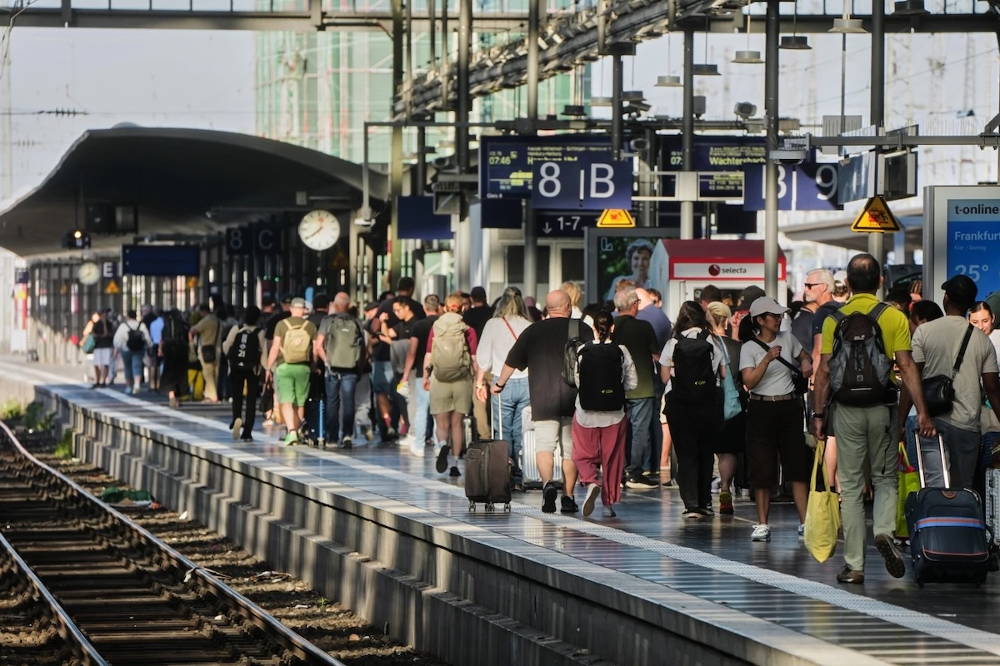

On the night of June 23, 2026, every single train in Germany stopped at once. **Deutsche Bahn**, the national railway, had to freeze all traffic because the system drivers use to talk to control centers, called GSM-R, suddenly failed across the whole country, and trains aren't allowed to move when they can't communicate. GSM-R is a railway version of **2G**, the same basic mobile phone technology people used around the year 2000, and Germany still runs its entire network on it. The failure was triggered by something tiny: a routine swap of one technical component during scheduled maintenance, which somehow knocked out the system nationwide. Thousands of passengers were stranded at stations like **Berlin** and **Frankfurt** for hours. Deutsche Bahn runs one of the busiest railways in the world, moving more than `5 million` passengers a day across `5,400` stations. Its network has never been frozen nationwide for a technical reason before, only for storms. 

## Economy & Finance

As Europe bakes through its record heatwave, Chinese air conditioner makers are selling units faster than they can ship them. Companies like **Midea**, **Gree**, and **Hisense** have seen demand surge, because air conditioning, normal across much of Asia, has always been rare in Europe. Only about one in five European homes has it, so when temperatures shot past `40°C,` millions of people scrambled to buy one at once. Midea's popular portable model sold out in some shops, and demand was so intense that second-hand units were being resold for more than the price of new ones. Even after buying one, though, many Europeans find it hard to set up. Lots of countries have strict rules about attaching the outdoor part of an air conditioner to a building, especially in old historic town centres where it can spoil the look, and getting a permit can take weeks. China makes nearly `40%` of the world's air conditioners,

## Nature & Environment

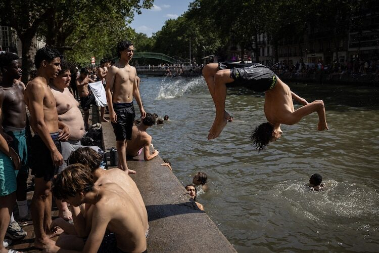

Right now a brutal heat wave is baking western Europe, and scientists are calling it the worst the continent has ever recorded. The cause is a "heat dome," a giant lid of high pressure that traps hot **Saharan** air over **France**, **Spain**, the **UK**, **Germany** and beyond, suppressing clouds so the sun cooks the ground for days on end. France just had its hottest day in recorded history, Spain saw its warmest June since at least `1950`, and Britain broke its own June record. Some French towns topped `42°C` (108°F). The effects have been serious: dozens of people have died, schools shut, and Paris closed the **Eiffel Tower** and the **Louvre** early to protect visitors. **Belgium**'s power grid was so strained that electricity briefly cost over `€1` per kilowatt-hour as air conditioners ran flat out. Europe is warming faster than any other continent on Earth.

## Science

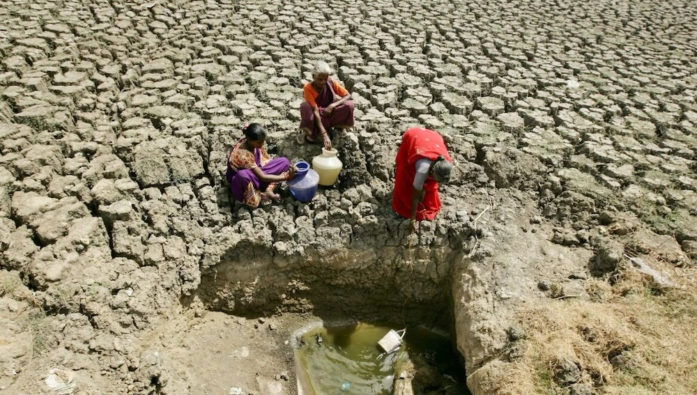

A new scientific study has revealed how deadly extreme heat really is in **India**, one of the hottest and most crowded countries on Earth. Researchers estimated that a single day of extreme heat causes about `3,400` more deaths across the country than would normally happen, and a five-day heatwave nearly `30,000`. These aren't deaths counted on one particular day; they're estimates of the hidden toll heat takes, calculated using temperature and population data. The study's big finding is that India's official records badly undercount heat deaths. When someone dies during a heatwave, the cause written on the certificate is often a heart attack or kidney failure rather than heat itself, so the real danger stays invisible in government statistics. India has been baking through brutal summers, with temperatures in some northern areas passing `48°C`. The researchers say better tracking and warning systems could save thousands of lives each year.

## Math

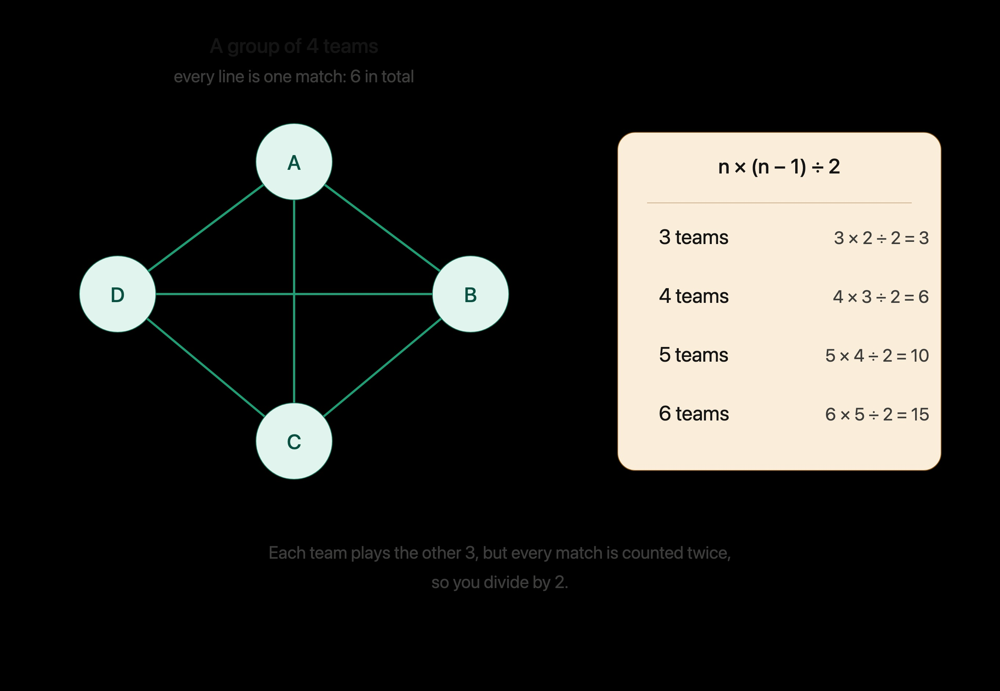

In the World Cup group stage, 48 teams are split into 12 groups of 4, and every team plays each of the others once. How many games is that per group? You know the answer is 6, and here's how to work it out. Each of the 4 teams plays 3 others, so that's 4 × 3 = 12. But this counts every game twice, since Brazil playing Spain is the same match as Spain playing Brazil, so you divide by 2: 12 ÷ 2 = 6. The formula is n × (n − 1) ÷ 2, where n is the number of teams. Try it yourself: a group of 3 gives 3 × 2 ÷ 2 = 3 games, a group of 5 gives 5 × 4 ÷ 2 = 10, and a group of 6 gives 6 × 5 ÷ 2 = 15. It's the same math as counting how many handshakes happen when everyone in a room shakes hands once.

## Lifestyle, Entertainment & Culture

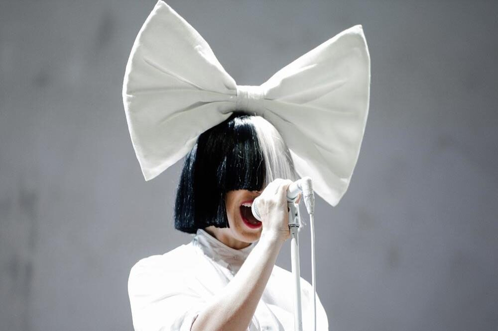

Walk into any World Cup stadium and you'll hear far more than the official tournament songs. Crowds have their own playlist, a handful of old hits that tens of thousands of strangers somehow all know by heart. The biggest is "**Seven Nation Army**" by The **White Stripes**, whose wordless "oh, oh-oh-oh" chant rings out after almost every goal. There's also **Bon Jovi**'s "**Livin' on a Prayer**," with a chorus so big the whole stadium roars it together, and "**Titanium**" by **David Guetta** and **Sia**, whose powerful "I am titanium" line makes a perfect victory song. **Queen**'s "**We Will Rock You**," with its stomp-stomp-clap beat, has been uniting crowds since the 1970s, and **Blur**'s "**Song 2**" delivers a joyful "woo-hoo!" everyone shouts at once. What these songs share is simple: a part so catchy and easy that you don't need to know the words, or even the language, to join in.

This month, the **Nebula Awards**, one of the top honors in science fiction and fantasy writing, announced their winners in Chicago. The prize for Best Novel went to **The Buffalo Hunter Hunter** by **Stephen Graham Jones**, a chilling horror story by a writer known for tales rooted in Native American history. The other top fiction prizes went to authors all working in the strange and imaginative space between sci-fi and fantasy. **Amal El-Mohtar** won Best Novella for **The River Has Roots**, a fairy-tale-like story about two sisters and magic. **Thomas Ha** won Best Novelette for "**Uncertain Sons**," and **Effie Seiberg** took Best Short Story for one with the playful title "**Laser Eyes Ain't Everything**." There was also a prize for younger readers: **Michelle Knudsen** won the **Andre Norton Award** for **Into the Wild Magic**. The Nebulas are chosen by working authors themselves, which makes winning one a real mark of respect from fellow writers.

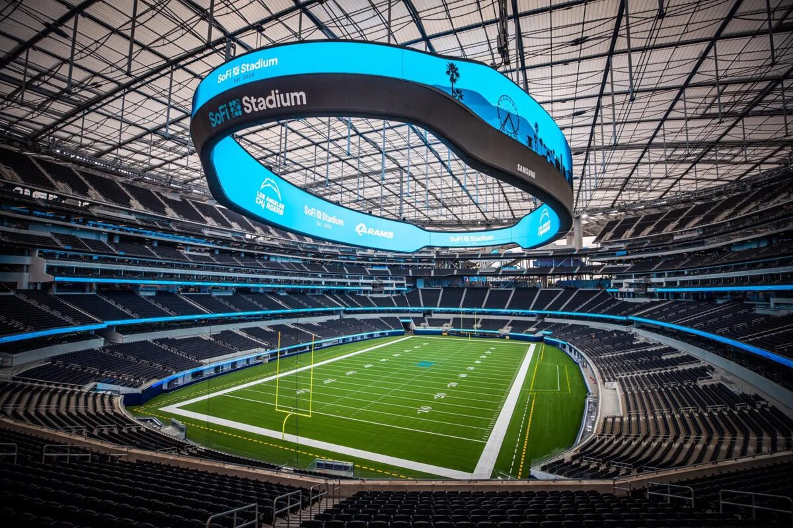

One of the surprise stars of the **2026 World Cup** isn't a player at all: it's the giant American stadiums hosting the matches. All eleven US venues are normally home to **NFL** football teams, and they are enormous. The final will be played at **MetLife Stadium** near New York, which seats over `82,000` people and cost about `1.6 billion` dollars to build. The most jaw-dropping is **SoFi Stadium** in Los Angeles, the most expensive stadium ever built, dug `100` feet into the ground with a see-through roof and a colossal video screen hanging over the field. But football pitches are nearly `20` metres wider than American football fields, so workers had to rip out thousands of seats at each stadium and lay down real grass over the artificial turf. A few stadiums, like the ones in Dallas, Houston, and Atlanta, even have sliding roofs and full air conditioning, keeping players and fans cool while much of the world bakes.

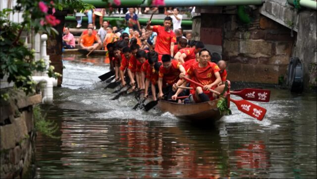

Every summer in southern China's **Guangdong** province, rivers come alive with the thunder of drums and the splash of paddles for dragon boat racing, one of the country's oldest traditions. The boats are long and narrow, carved and painted to look like dragons, and a team of paddlers drives each one forward in perfect rhythm while a drummer pounds out the beat and a steerer guides from the back. The races honour the **Dragon Boat Festival** and an ancient poet from over two thousand years ago, and this year Guangdong planned more than `500` races across all `21` of its cities. But the most jaw-dropping version happens in the village of **Diejiao**, nicknamed the "**F1 on water**." There, 25-metre-long boats race through twisting village canals barely three metres wide, squeezing around hairpin S-bends, C-bends, and L-shaped corners with two right-angle turns. To whip around them, the crew slams the boat into a turn so fast that it actually slides sideways across the water, a real-life drift, while the steerers jam their paddles down to pivot it. Get it wrong and the whole boat smashes into the stone bank. 

## Sports

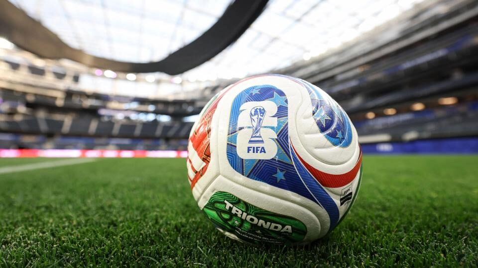

[Soccer] The group stage of the **2026 World Cup** is over, and the final `32` teams are set for the knockout round that starts today. This is the first World Cup with `48` teams, `16` more than usual, and for the first time the top two from each of the 12 groups plus the eight best third-place teams move on. The host nations all advanced: the **United States** and **Mexico** both won their groups, and **Canada** finished second. **France** looked strongest, winning all three games, including a `4-1` thumping of **Norway** in which **Ousmane Dembélé** scored a hat trick in the first half. **Germany**, a four-time champion, lost to **Ecuador** but still got through. Of the eight Asian teams, only two survived: **Japan**, who beat **Tunisia** 4-0, and **Australia**. South Korea, Iran, Saudi Arabia, Jordan, Qatar, and Iraq all went home. Tiny **Cape Verde**, an island nation of about half a million people, reached the knockouts on its first try.

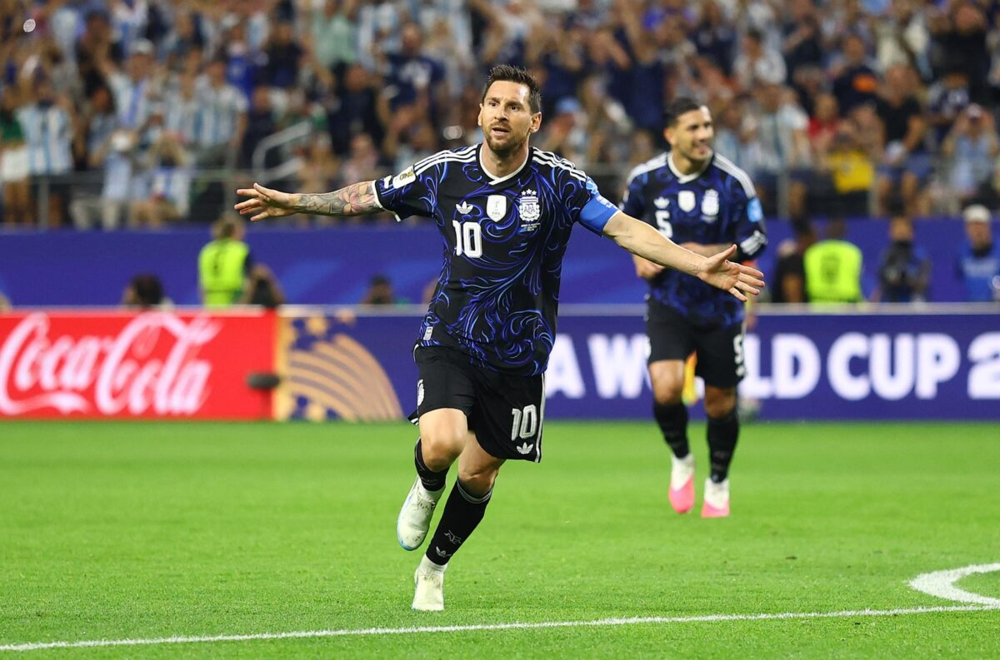

[Soccer] The **2026 World Cup**'s biggest stars have lit up the group stage, and the goals are flying in faster than at any tournament in decades. **Lionel Messi**, now `39` and likely playing his last World Cup, leads everyone with six goals, including a hat trick against Algeria and a free kick off the bench against Jordan. He is now the all-time top scorer in men's World Cup history with `19` goals and the first player ever to score in seven straight World Cup matches. Three players sit just behind him on four goals each. France's **Kylian Mbappé** scored in all three group games. His teammate **Ousmane Dembélé**, who won the **2025 Ballon d'Or** as the world's best player, matched him with a first-half hat trick against Norway. Norway's **Erling Haaland** also has four, netting twice in each of his first two matches. **Cristiano Ronaldo**, 41 and in his sixth World Cup, scored twice against Uzbekistan to become the first player to score in six different tournaments. England's Harry Kane managed two against Croatia, and Spain's 18-year-old Lamine Yamal, rated the tournament's top player beforehand, scored once after returning from injury. Brazil's **Neymar** came off the bench against Scotland for his first match in nearly three years, having torn a knee ligament back in October 2023.

[Chess] In June, a 20-year-old Indian grandmaster named **Rameshbabu Praggnanandhaa** won **Norway Chess**, one of the most prestigious tournaments in the sport, held in **Oslo**. He did it the hard way. After losing two games in the middle of the event, he sat in last place out of six players, then won four classical games in a row to finish first, ahead of a field that included **Magnus Carlsen**, the world number one, and **Gukesh Dommaraju**, the reigning world champion. Twice during the tournament he beat Carlsen, who happens to be Norwegian and was playing in his home country. The key was a change in strategy: Praggnanandhaa started playing his opening moves quickly, which left him far more time to think later on. In the deciding games his opponents were down to under five minutes while he had over twenty, and the pressure forced them into mistakes. Carlsen said afterward he never thought it possible.

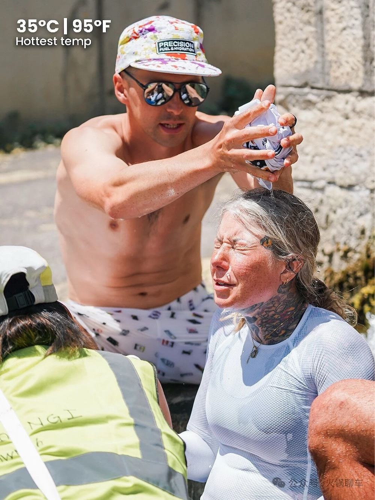

[Cycling] In June, an ultra-endurance cyclist named **Dr. Sarah Ruggins** rode the entire length of mainland Europe faster than anyone in history. She started at Tarifa, the southern tip of **Spain**, and finished at Nordkapp, the northern tip of **Norway**, covering more than `6,000` kilometres across `9` countries in `13` days, `20` hours, and `27` minutes, beating the previous record, held by a man, by over three days. To do it she rode up to `22` hours a day, slept only about three hours a night, and ate roughly `11,000` calories daily, pushing through `35°C` heat in Spain and below-freezing cold inside the Arctic Circle, climbing some `35,000` metres along the way. What makes it extraordinary is where she started. As a 15-year-old in Canada, Ruggins was a promising runner with Olympic ambitions when a rare neurological illness left her unable to walk or use her hands and dependent on full-time care. Her recovery took about ten years. She only got on a bike in 2023, and three years later she holds two outright world records in the sport. She rode to raise money for World Bicycle Relief, a charity that gives bicycles to people who need them to reach school, work, and healthcare.

## This Day in History

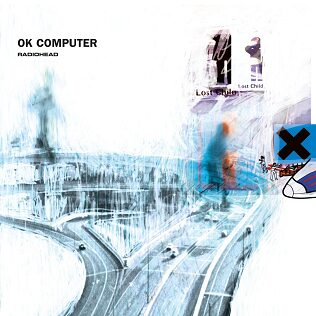

On this day, **June 28**, in **1997**, the British band **Radiohead** reached number one in the UK with their album **OK Computer**, now considered one of the greatest records ever made. What makes it remarkable is how far ahead of its time it was. Back when most people didn't own a mobile phone and the internet was brand new, the band wrote songs about feeling lost and anxious in a world being taken over by machines, computers, and constant information. Singer **Thom Yorke** later said the "information overload" he worried about then is far worse now, in the age of smartphones and AI. You might know Radiohead better from their earlier song "**Creep**," a far more famous and easy-to-sing tune about feeling like an outsider that became a worldwide hit. But the band grew uncomfortable being known for just one catchy song, so they deliberately made something stranger and deeper. The gamble worked, and OK Computer made them legends.

## Art of the Week

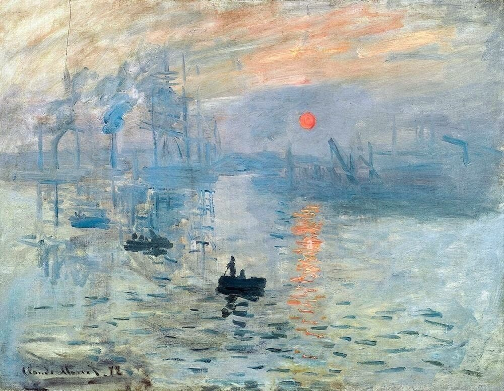

**Sunrise** was painted by the French artist **Claude Monet** in 1872. It shows a misty harbour in early morning, with a small orange sun glowing through the haze and a few dark boats sketched in loose, quick strokes. Look closely and the water is just smudges and squiggles of paint, but step back and your eye blends it into shimmering light on the sea. That was Monet's goal: not to copy every detail, but to capture the feeling of a single passing moment before the light changed. The painting also gave a whole art movement its name, and it began as an insult. When Monet showed it in Paris, a critic sneered that it was only an "impression," not a proper finished picture. Instead of being offended, Monet and his friends embraced the word, and **Impressionism** became one of the most loved styles in all of art.

## Funny

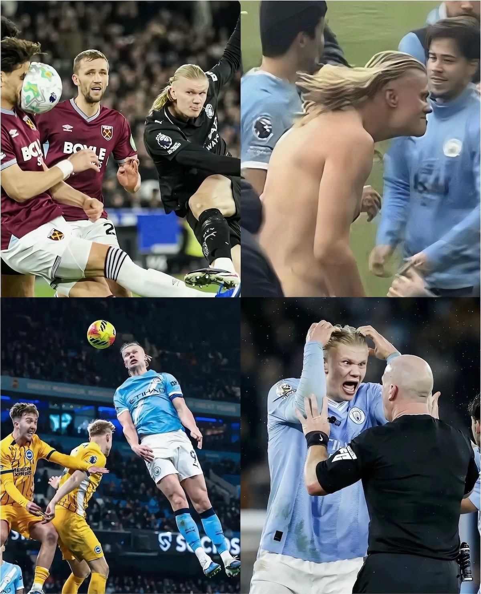

Haaland has single-handedly contributed many viral emojis from this World Cup.

---

## Previous Issues

---

June 21, 2026, **[Wonderwall and Other Wonders](https://weekly.sundayblender.com/p/wonderwall-and-other-wonders)**

June 13, 2026, **[Who Will Win the 2026 World Cup?](https://weekly.sundayblender.com/p/who-will-win-2026-world-cup)**

June 07, 2026, **[Wear Adidas to Handle Important Business in the City](https://weekly.sundayblender.com/p/wear-adidas-to-handle-important-business-in-the-city)**

---

Thanks for reading! If you enjoy this newsletter, please share it with friends who might also find it interesting and refreshing, if not for themselves, at least for their kids.

