## Editor's Words

I can do many other things while vibe-coding, such as binge-watching TV shows and listening to music. Usually after the intense planning mode with Claude Code, I would just press button "1" (OK to proceed) all the way until it one-shots the feature. That mental cruise period allows me to take an easy-going side tour elsewhere. 

Not for World Cup games though. 

I think to fully enjoy a soccer game (at the highest level such as World Cup), you really have to pay full attention, be present, and attach yourself to that roller coaster ride (did you watch that England vs Congo, or Portugal vs Croatia?). If you just watch the game while being busy on other screens, you don't get that emotional journey, or the fun of it.

In this sense, soccer is almost anti-2026, when every minute of our lives is increasingly consumed and taken over by electronics and screens. 

Maybe that's exactly the real charm of soccer.

## Tech

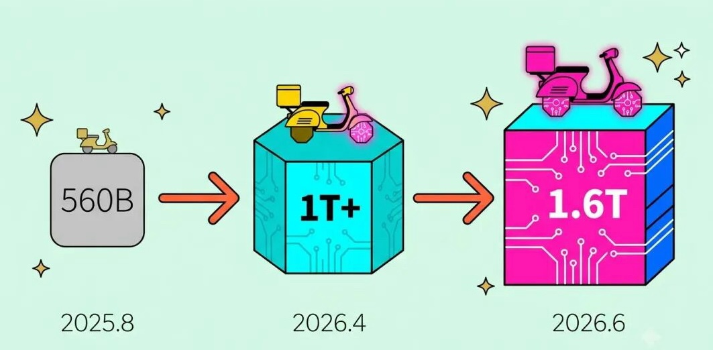

**Meituan**, best known in China as a food delivery app similar to **DoorDash**, surprised the tech world by releasing **LongCat-2.0**, a giant AI model built entirely on Chinese-made chips. The model has `1.6` trillion parameters, a measure of how much information it can process and learn from, putting it in the same league as the world's top AI systems. What makes LongCat-2.0 stand out is not just its size but how it was built: earlier Chinese AI models used homegrown chips only to answer questions after training, while this one used domestic hardware for the entire training process too, on a cluster of more than `50,000` chips. That had long been considered too difficult without American-made hardware. The model performs strongly at coding and multi-step problem solving, even beating some benchmarks set by **Google**'s **Gemini**. It still trails top US models overall, but it shows China closing the gap in building AI without foreign chips.

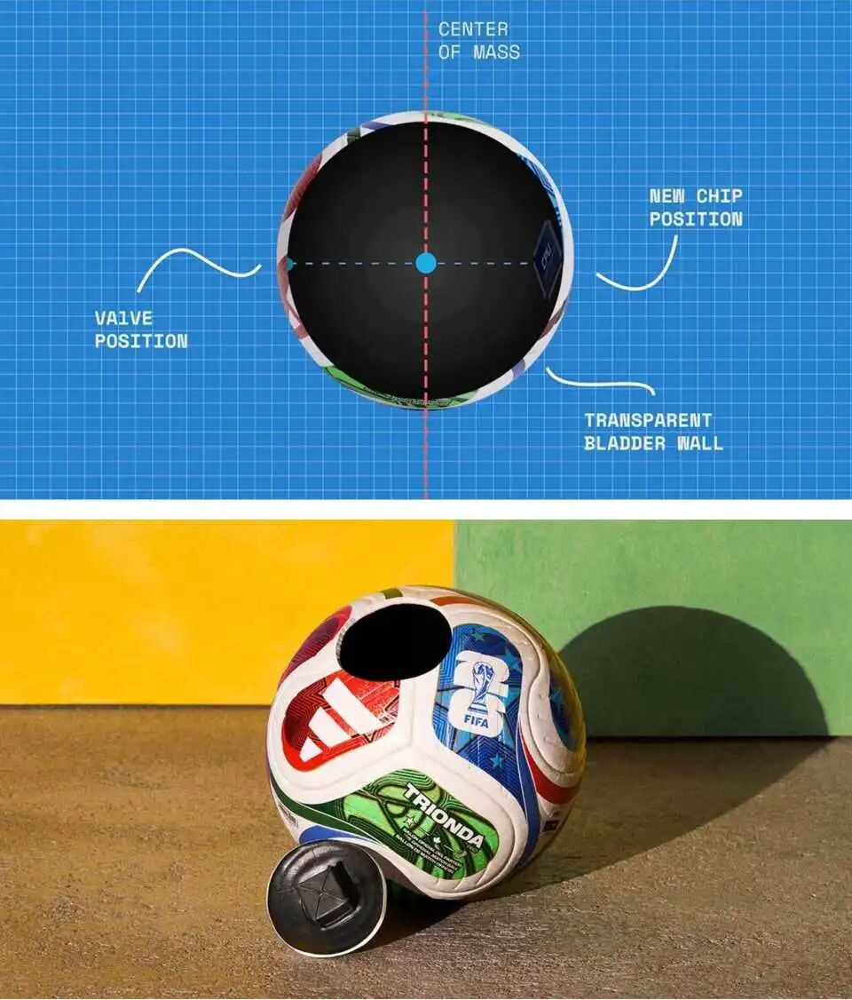

**Portugal** beat **Croatia** `2-1` in the **World Cup** round of 32, but the game almost ended differently. Deep into stoppage time, Croatia's Joško Gvardiol slid in to score what looked like a tying goal, and the stadium erupted. The referee sent the play to video review, and officials found that a Croatian player, Igor Matanović, had made the slightest touch on the ball just before it reached a teammate who was standing offside. That touch meant the whole move didn't count, and the goal was wiped off the board. The proof came from inside the ball itself: the official World Cup ball, the **Adidas** **Trionda**, has a small sensor suspended in its core that tracks tiny movements `500` times per second. Matanović's touch was so light that replays barely showed it, invisible to the naked eye, but the chip caught it instantly. Portugal held on to win and advanced to face **Spain** next.

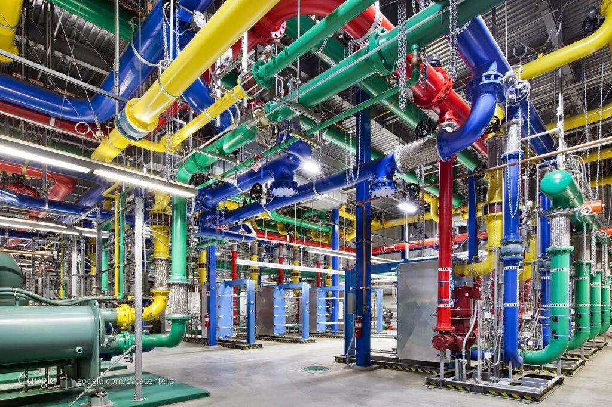

Artificial intelligence has an enormous appetite for electricity, and this year that appetite grew faster than ever. **Google** just reported that its electricity use jumped `37` percent compared to last year, the biggest single-year increase in the company's history, almost entirely because of the massive computer data centers it needs to run AI systems. Those data centers alone used more than `42` million megawatt-hours of power in a year, roughly as much electricity as an entire country like **Denmark** or **New Zealand** uses in the same time. Every question typed into an AI chatbot, every image generated, and every video recommendation relies on rows of powerful computers running around the clock inside these data centers, and all of them need constant cooling and electricity to function. Google says it still buys enough clean energy to match its usage on paper, but even the company admits that AI's growth is outpacing how fast the power grid can add clean energy sources.

## Global

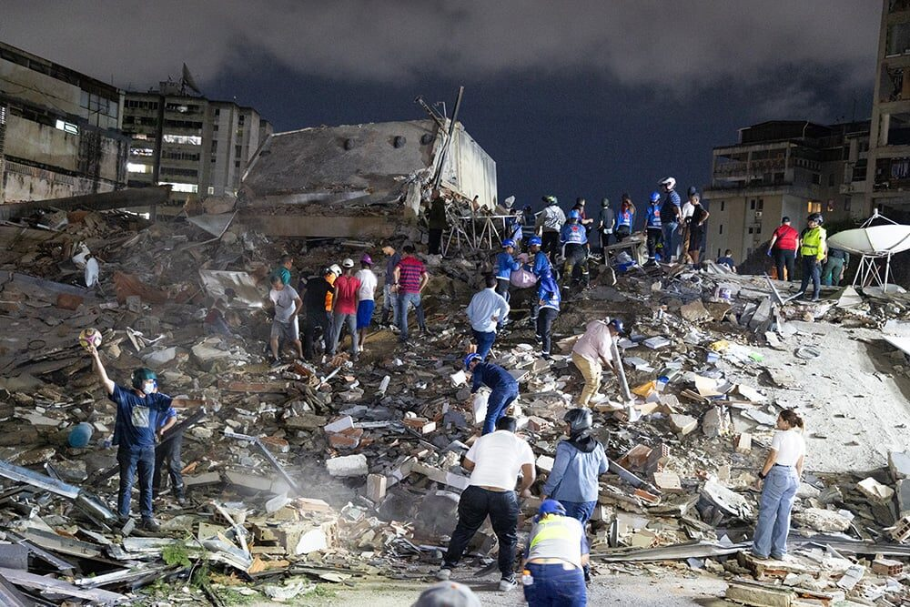

On June 24, 2026, two powerful earthquakes struck northwestern **Venezuela** less than a minute apart, with magnitudes of `7.2` and `7.5`, arriving only 39 seconds apart, causing widespread damage across parts of Venezuela's northern coastline. Scientists call this rare pattern an "earthquake doublet," where two quakes happen almost back to back with nearly identical strength and origin point. Seismologists note that the earthquakes were the strongest to hit Venezuela since `1900`. The quakes hit hardest along the coast near Caracas and La Guaira, collapsing more than `250` structures and trapping people inside. Rescue teams from countries including the US, Jordan, and El Salvador have been digging through rubble for over a week. One father was pulled out alive after five days trapped under a collapsed shopping mall. As of early July, more than `2,500` people had died, thousands were injured, and tens of thousands remained unaccounted for. Venezuela's government says clearing the debris alone could take years.

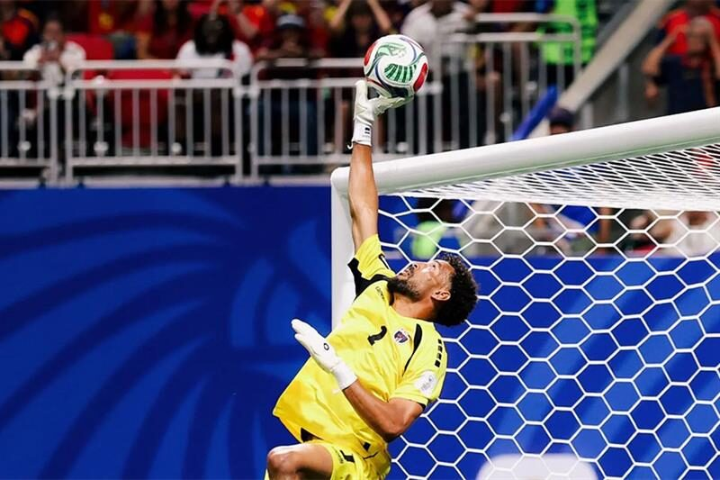

**Cape Verde** is a tiny archipelago off the coast of West Africa with about `525,000` people, yet its World Cup squad this year was built almost entirely from players scattered across `14` different countries. Coach Bubista recruited many of them straight from Cape Verde's diaspora, sometimes in unusual ways. Defender Roberto Lopes, born and raised in Ireland, first got the offer through a LinkedIn message written in Portuguese, which he initially ignored, thinking it was spam. Once he ran it through Google Translate, he immediately said yes. Cape Verdeans call their scattered communities abroad the "11th island," since ten islands make up the actual country. That global roster shocked the world by holding European champions **Spain** to a scoreless draw, then tying **Uruguay** 2-2, and going undefeated through the entire group stage, before finally being eliminated by **Argentina**. It's the best World Cup run ever by a nation this small.

## Economy & Finance

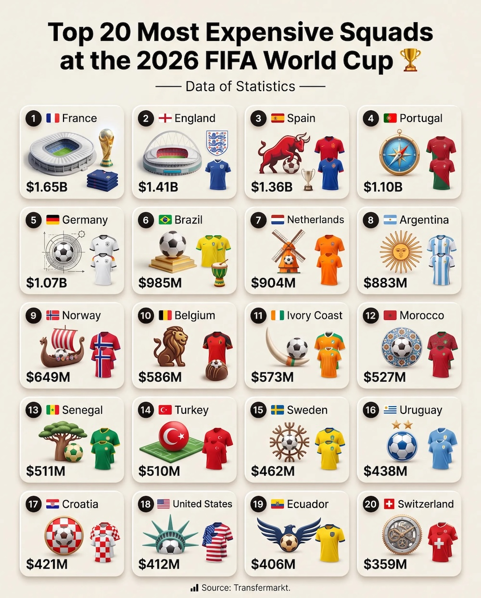

Every World Cup team's roster carries a price tag, based on what buying all its players on the open market would roughly cost. **France** leads this year at around `1.5 billion` euros, followed by **England**, **Spain**, and **Portugal**, all above `1 billion`. So far, money has mostly matched performance: France, England, Spain, and Portugal all advanced to the round of 16 without much trouble. But not always. **Germany**, the fifth most expensive squad in the tournament, was knocked out by **Paraguay** on penalties, and the **Netherlands**, ranked eighth, lost to **Morocco** the same way. Meanwhile **Cape Verde**, whose entire squad is valued at a small fraction of what a single top European star costs, went undefeated through the group stage and reached the knockout rounds anyway. Jordan fields the cheapest squad in the tournament at just over `20 million` euros, less than the price of one average Premier League midfielder.

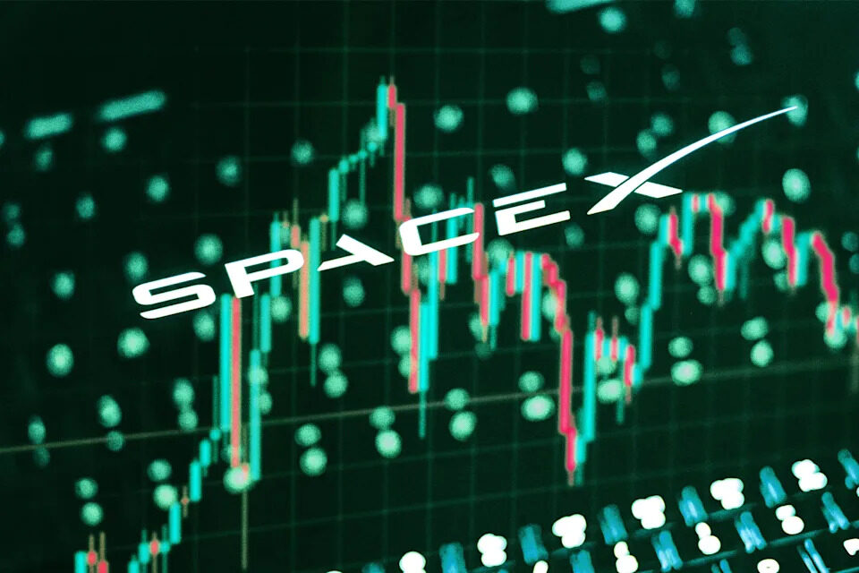

**SpaceX** crashed the stock market party on June 12, 2026, in the largest IPO in history, briefly overtaking **Amazon** and **Microsoft** in value and making CEO **Elon Musk** the world's first trillionaire almost overnight. Shares opened at `$150` and rocketed to `$225` within days, a nearly `50` percent surge before the company had even filed a single earnings report. Then gravity caught up. The stock cratered, sinking below its original $150 price and erasing roughly `$1 trillion` in value in barely a week, one of the fastest wealth wipeouts in market history. Analysts point to a pile of new debt, a $25 billion bond sale to fuel SpaceX's AI ambitions, and a valuation that had investors paying over `100` times the company's actual sales, more than triple what **Nvidia** commands.

## Nature & Environment

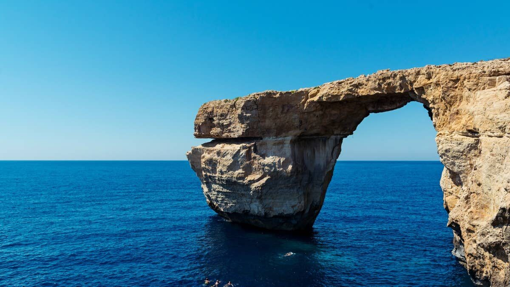

A famous natural rock arch off the island of **Comino**, near **Malta**, collapsed into the sea on the evening of June 27, 2026. The arch, nicknamed the "**Kissing Elephants**," was a limestone formation on Malta's coast popular with boat tours and photographers, large enough for small boats to pass beneath. It gave way suddenly in calm weather with no storm, just as a tourist jumped from the top into the water below. A jet ski happened to be passing underneath at that moment, and the falling rock struck it, killing one rider. Geologists say a crack in the rock had been spotted two weeks earlier, and years of erosion had already weakened the structure.

## Science

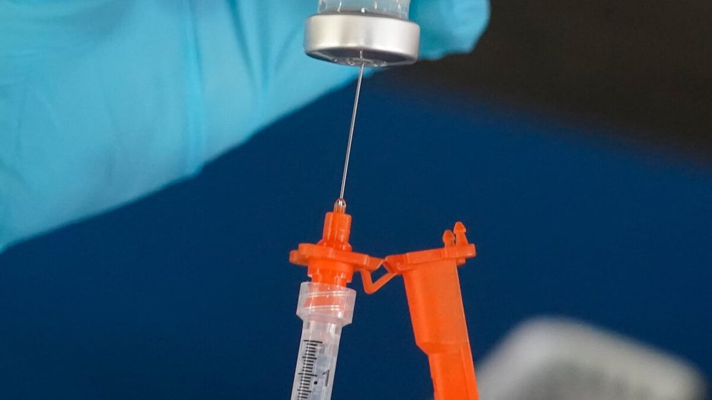

For decades, most flu shots have been made the same way: growing weakened flu virus inside chicken eggs, a slow process that takes months. Scientists have now developed a new kind of flu vaccine that skips eggs entirely and uses **mRNA** technology instead, the same approach behind many **COVID-19** vaccines. Instead of growing a virus, the vaccine gives cells a short set of instructions to build a harmless piece of the flu virus themselves, teaching the immune system to recognize it. In a study published in **Nature Immunology**, researchers found this new vaccine triggers a broader immune response than traditional flu shots, meaning it helps the body recognize and fight a wider range of flu strains at once. An **FDA** advisory panel voted unanimously in June to recommend the vaccine for adults 50 and older, with a final approval decision expected in early August. Scientists hope the technology could eventually lead to a single flu shot effective against nearly every strain.

## Math

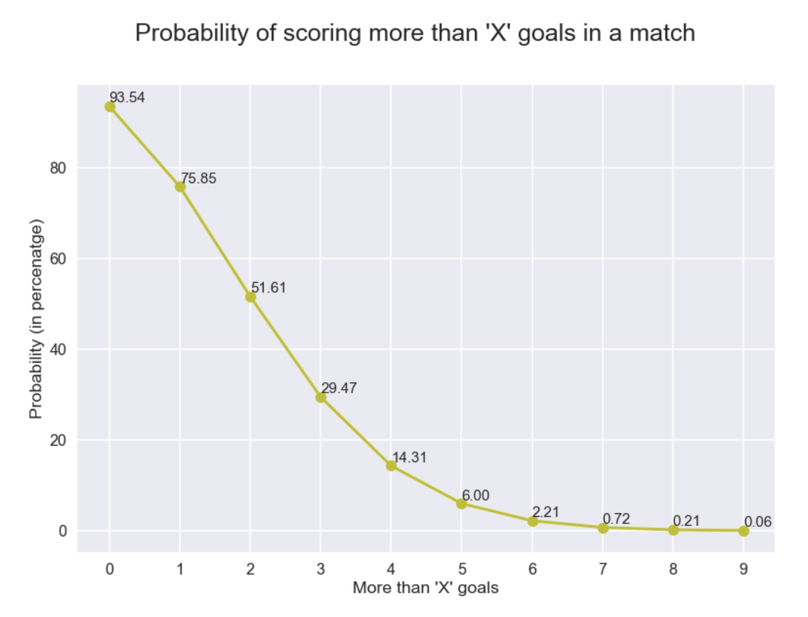

Soccer goals are rare and scattered, which makes them a perfect example of something mathematicians call a **Poisson distribution**, a formula for predicting how often random events happen in a fixed amount of time. It works because goals in a match are mostly independent: scoring one goal in the 20th minute doesn't make another goal in the 70th minute more or less likely. The same math describes meteor showers, since seeing one meteor doesn't change the odds of seeing another one later, or how many customers walk into a store each hour. If a team averages 1.5 goals per game, the Poisson formula can calculate the exact odds of them scoring 0, 1, 2, or even 5 goals in their next match, without knowing anything about the opponent. Statisticians use exactly this math to build the betting odds and score predictions seen before every World Cup game.

## Lifestyle, Entertainment & Culture

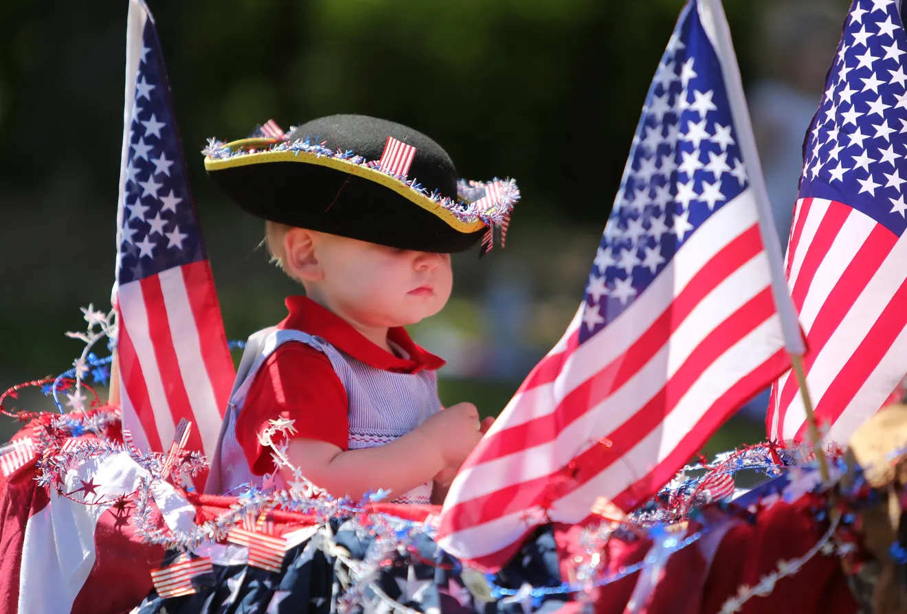

This year's **Fourth of July** was extra special in the United States, marking exactly `250` years since the signing of the **Declaration of Independence** in Philadelphia in 1776. The milestone, known as the Semiquincentennial, has been celebrated all year with museum exhibits, historic document displays, and events across the country. To mark the day, the **US Mint** mixed `250,000` special quarters into circulation, each stamped with a tiny "July 4th" mark, giving people a chance to find a piece of history in their everyday change. The date also overlapped with the **World Cup**, which the US is co-hosting with Mexico and Canada this year, adding matches and international visitors to the mix of fireworks, parades, and barbecues that usually mark the holiday. The Declaration of Independence itself was formally adopted by the Continental Congress on July 4, 1776, explaining why the `13` American colonies were breaking away from British rule.

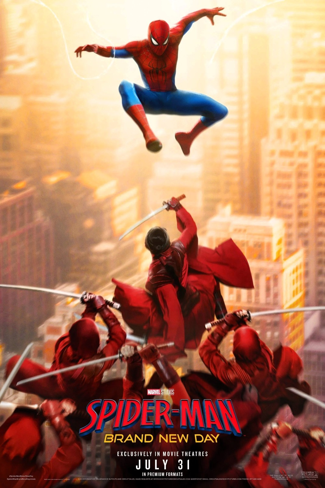

Every year, **Independence Day** weekend marks the unofficial launch of Hollywood's biggest summer movie season, and studios save some of their splashiest releases for it. This year's frontrunner is "**Minions & Monsters**," which opened July 1 aiming for around `$80 million` over the holiday weekend. But the movie everyone is really waiting for is **Christopher Nolan**'s "**The Odyssey**," arriving July 17. Based on **Homer**'s ancient Greek epic, it stars **Matt Damon** as the hero **Odysseus** trying to sail home after the **Trojan War**, battling a Cyclops, sirens, and sea monsters along the way. Nolan filmed the entire movie on special **IMAX** cameras, a first in movie history, and the story itself is nearly `3,000` years old, one of the oldest tales still being retold today. Disney's live-action "**Moana**" and a new **Spider-Man** film also arrive this month, making July one of the most packed movie months of the year.

## Sports

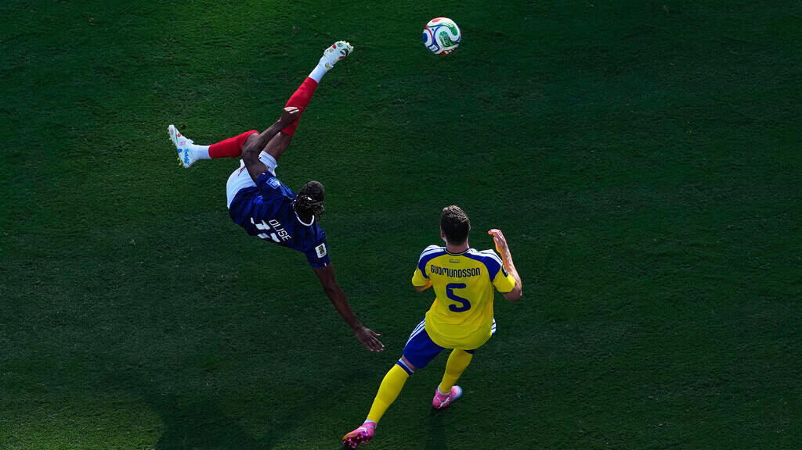

[Soccer] The **World Cup**'s round of 32 brought big surprises this week. **Germany**, a four-time champion, was eliminated after losing to **Paraguay** in a penalty shootout, the first time Germany has ever lost a shootout at a World Cup. **Brazil** beat **Japan** `2-1` to move on, while **France** cruised past **Sweden** `3-0` behind two goals from **Kylian Mbappé**. **England** beat **DR Congo** `2-1` after falling behind early, with captain **Harry Kane** scoring both goals late in the game to complete the comeback. and **Spain** routed **Austria** `3-0`. **Argentina** survived a scare against **Cape Verde**, winning `3-2` in extra time after **Lionel Messi** opened the scoring. **Norway**, playing in just its second World Cup ever, beat **Ivory Coast** 2-1 on a late goal from star striker **Erling Haaland** to reach the round of 16 for the first time in the tournament's modern era. Now Brazil faces Norway, France takes on Paraguay, England travels to Mexico, and Argentina meets Egypt.

## This Day in History

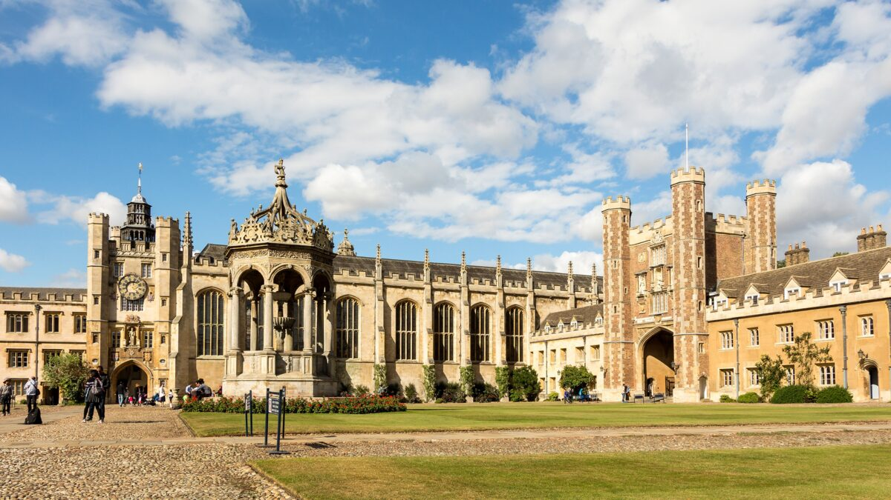

On **June 5, 1661**, an 18-year-old **Isaac Newton** walked through the gates of **Trinity College**, **Cambridge**, and quietly began one of the most consequential educations in human history. He arrived as a "subsizar," working as a servant to wealthier students just to afford his tuition. The official curriculum was still stuck on **Aristotle**, whose `2,000`-year-old ideas about motion and the universe were treated as settled fact. Newton followed the coursework just enough to pass, but in a private notebook he titled "**Certain Philosophical Questions**," he began tearing apart the old assumptions himself, on motion, light, and the nature of infinity. Within five years of walking through those gates, working largely in isolation during a plague outbreak that shut down the university, Newton had sketched out calculus, decoded how white light splits into colors, and started piecing together the theory of gravity. Few doorways in history have led to more.

## Art of the Week

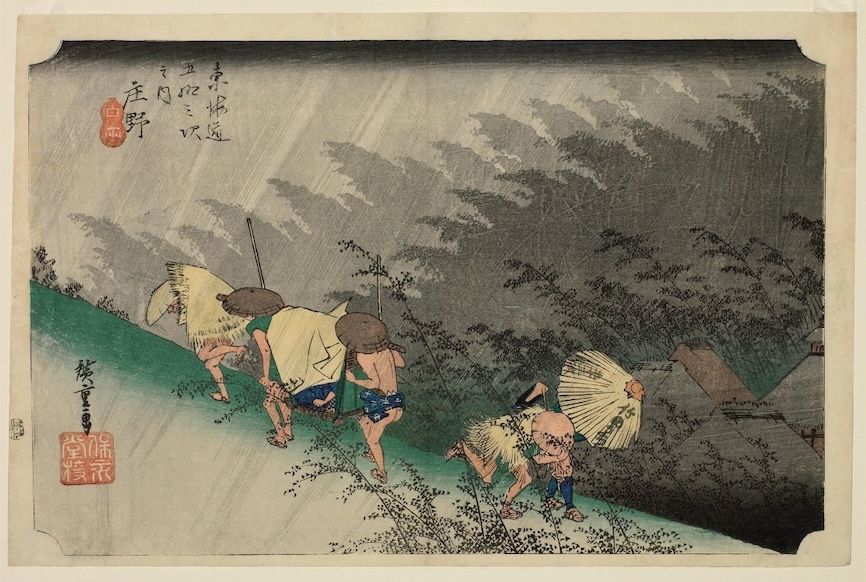

**Utagawa Hiroshige** was a Japanese artist who spent much of his early life as a fire warden in Edo, the city now known as Tokyo, before turning to art full time. In 1832, he traveled the Tokaido, the road connecting Edo to the imperial capital of Kyoto, and turned the journey into a series of 55 woodblock prints covering the start, the finish, and all `53` rest stops along the way. The series became an instant bestseller and made Hiroshige famous. One of its standout prints is **Shono**, station forty-five, where Hiroshige skipped the area's real scenery entirely and invented a sudden summer rainstorm instead. Two palanquin bearers lean into the wind climbing uphill while two other travelers dash downhill, all caught bracing against slanted sheets of rain carved directly into the wood. Behind them, bamboo bends sideways in the wind, fading into gray. It remains one of the series' most famous images.

## Funny

> Why is a soccer stadium the coolest place to be?
>
> - Because it’s filled with tens of thousands of fans!
>
> Why do soccer players do so well in school?
>
> - Because they know how to pass!
>
> My boyfriend made a save in a soccer game
>
> - That’s how I knew he was a keeper!
>
> What’s the best state to shop for a soccer uniform?
> - New Jersey!

---

## Previous Issues

---

June 28, 2026, **[A Hot Week for the World Cup and Europe](https://weekly.sundayblender.com/p/a-hot-week-for-the-world-cup-and-europe)**

June 21, 2026, **[Wonderwall and Other Wonders](https://weekly.sundayblender.com/p/wonderwall-and-other-wonders)**

June 13, 2026, **[Who Will Win the 2026 World Cup?](https://weekly.sundayblender.com/p/who-will-win-2026-world-cup)**

---

Thanks for reading! If you enjoy this newsletter, please share it with friends who might also find it interesting and refreshing, if not for themselves, at least for their kids.

