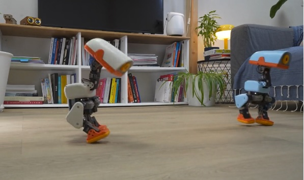
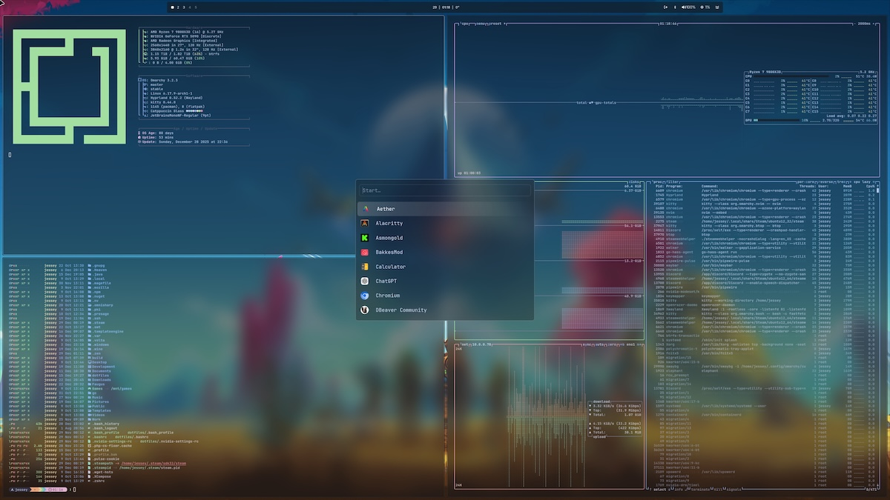
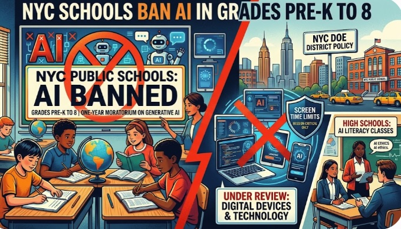
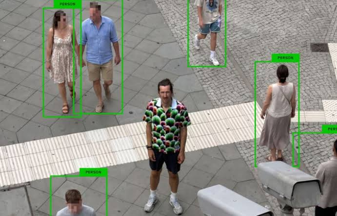
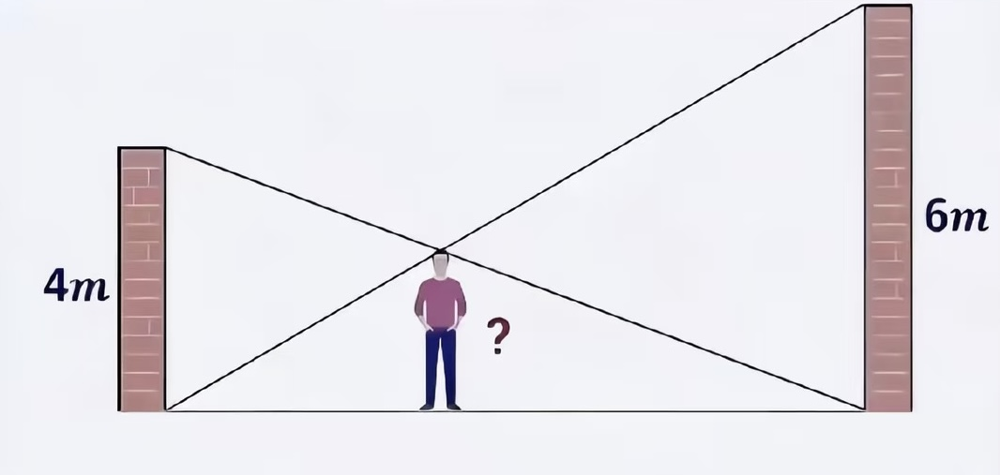
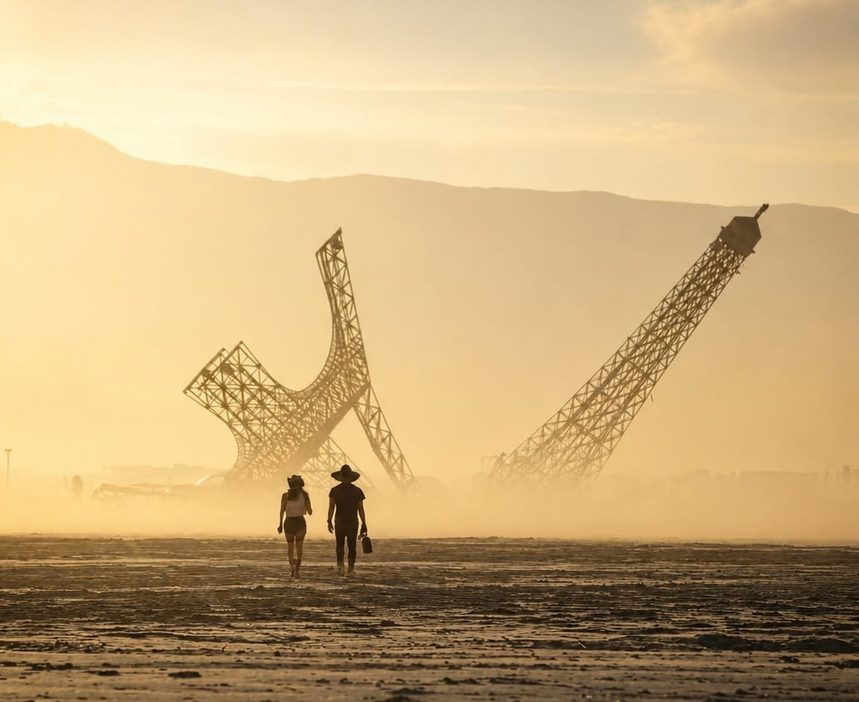
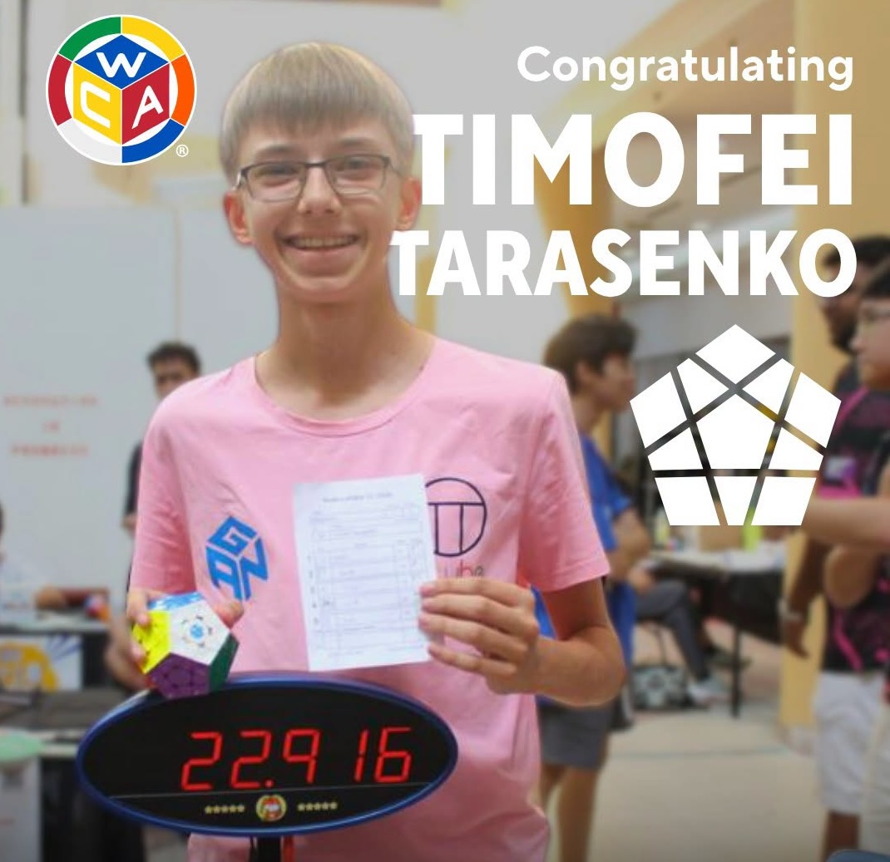
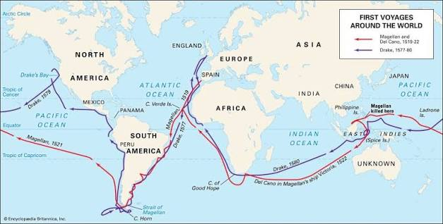
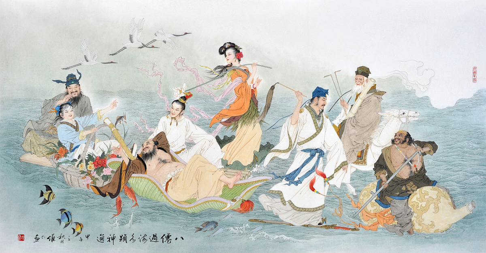

## Editor's Words

Do you know that you can also listen to The Sunday Blender as a podcast? Your kids can listen to the issues (over-the-air or downloaded) on drowsy school bus rides, on long family road trips, or during boring waits for Disney roller coasters.

It’s available on [Apple](https://podcasts.apple.com/us/podcast/the-sunday-blender-podcast/id1853996806), [Spotify](https://open.spotify.com/show/0p6Boxgcyy9eJzdBQlu4CG), Youtube (being rebuilt currently), and [Xiaoyouzhou](https://www.xiaoyuzhoufm.com/podcast/691d248b88967822c085fda5) (for those in China). 

I only promise this - the host’s English is PERFECT. 

You might also be pleasantly surprised that the 20-minute-long podcast somehow gets more juice out of those news stories than this original email newsletter. 

I don’t know how it happens, but it does. Take a listen. Buy me a coffee if you think this is cool or/and useful.

## Tech

**Hugging Face**, an AI company, began selling a robot duck called **Microduck** on August 27 for `$399`. Orders passed `$1 million` in about six hours and `$2.6 million` within a day, more than `5,000` ducks, and the promise of delivery before Christmas quietly disappeared. The wait is now four to six months. The duck is `25 centimetres` tall and walks on two legs, with 15 motors, a camera, and a laser scanner all coordinated by one small chip made by Rockchip, a Chinese company, which corrects the robot's balance 50 times a second. The interesting part is how it learns to move. Nobody writes instructions telling it how to walk. Thousands of copies of the duck are dropped into a computer simulation, more than `4,000` at a time, where they fall over again and again until some stumble onto something that works. Whatever the simulated ducks figured out is loaded into the real one, which arrives already knowing how to sit, kick, and roller-skate. It can also lower itself, close its beak around a sock on the floor, stand back up, and drop it in a box.

On September 3 in **Austin, Texas**, a car with no steering wheel picked up a paying passenger. **Tesla**'s **Cybercab** has two seats, no pedals, no mirrors, and doors that swing upward. There is nowhere for a driver to sit, because the design assumes there will never be one, and a passenger has no physical way to take over if something goes wrong. Tesla has been running driverless taxis in six American cities for over a year, but those are ordinary cars with the steering wheel still in them. This is the first time the company has carried customers in a vehicle built without controls at all. The fleet is small: `45` Cybercabs are approved to carry passengers in Texas. They stay inside a fixed zone around Austin of about 288 square miles and will not cross the boundary. America's road safety regulator says it is in contact with Tesla and looking into the launch.

On August 25, **MIT** published a report on what artificial intelligence is doing to its classrooms, and one recommendation surprised a lot of teachers: stop leaning on AI detectors. Those are programs that scan a student's essay and guess whether a chatbot wrote it. They do fine on an essay a chatbot wrote start to finish. But that is not how most students use AI. A student who asks only for an outline, or has a chatbot clean up a paragraph or two, slips through: AI was used, and the detector says nothing. The tools fail in the other direction too, sometimes accusing students who used no AI at all, especially ones who learned English as a second language. The report suggests a different approach: more oral exams, more projects built up in stages over a semester, more writing done in the room with other people.

A new operating system called **Omarchy** is breaking rules the computer industry had treated as settled. It runs on Linux, the free system anyone is allowed to modify, which has a reputation for being slow and difficult to set up. Omarchy installs itself within minutes, and `45` seconds is now the worldwide record among its early adopters. It also arrives with nine different AI coding assistants already built in, and a strip along the top of the screen showing how much of each one you have used up. When a program crashes, the computer does not simply report an error. It hands the error logs to an AI and asks it to work out what went wrong. Its Danish creator **David Heinemeier Hansson** describes it as an operating system for the age of agents. Version 4.0 came out on August 14 and has already been downloaded `200,000` times in `19` days, across `215` countries.

## Global

The **USS Abraham Lincoln** left San Diego in November 2025 on what was meant to be a routine trip around the Pacific. It docked in **Thailand** on September 2, 286 days later. Along the way, it was sent to the Middle East instead, and stayed far longer than anyone on board had packed for. The ship never ran out of anything, because food, fuel, and spare parts were passed across by supply vessels while both ships were moving. What the crew of about `5,000` could not do was get off. There were two brief stops for supplies, but nobody went ashore. When the carrier finally appeared at the Thai port, photographs showed it streaked with rust from one end to the other, and they spread quickly online. Warships are repainted constantly, and that can only be done in harbour. After 286 days at sea, the crew was given a few days off in Thailand.

On September 2, days before the school year began, **New York City** announced that students from pre-kindergarten through eighth grade may not use generative AI tools at school for the next year. The city runs the largest school system in the country, and the rule covers close to `600,000` children, roughly two-thirds of everyone enrolled. Companion chatbots are banned in every grade, high school included. Younger children are losing screens as well: nobody up to second grade will use a laptop or tablet in class at all, and pupils in grades three to five are capped at 30 minutes a day. Teachers may still use AI to plan lessons, but not to mark work. High schoolers get a different arrangement — classes on how to think critically about AI, and permission to use a small approved set of tools with a teacher watching. The city is calling this a pause rather than a decision, and will study what happens before setting rules for the year after.

In August, Berlin police switched on a new kind of camera at a busy square called **Kottbusser Tor**. The cameras use AI to pick out people in a crowd and watch how they move. An artist in the city, Simon Weckert, answered by designing a shirt. It is covered in a loud tangle of pink, orange, and green shapes, and it is not meant to hide you from other people — you could hardly miss it. It is meant to confuse the software. A computer does not know what a human being is. It has only learned what humans tend to look like across millions of photographs: an edge here, a head-and-shoulders shape there. Weckert kept adjusting his pattern until a common detection program stopped registering the person wearing it. In his video, the software draws a box around every passer-by except him.

Three young men from **Roseville, California**, set out at 3 a.m. on August 30 to climb **Mount Shasta**, a `14,179-foot` volcano in the north of the state. None of them had much climbing experience. Anyone attempting the summit is told to turn back if they have not reached the top by noon, so there is daylight left for the descent. They reached it at 7 p.m. Coming down in the dark, they wandered off the trail into a steep canyon, one of them fell and hurt his knee, and they spent the night stranded there until forest rangers found them the next morning. Afterwards they told a sheriff's deputy that they had planned the trip using **Google**'s **Gemini**, asking it which route to take and what to pack. The sheriff's office called that a critical misstep, saying the AI had told them to carry far less food and water than they needed. Its advice to other climbers was to phone the local ranger station, and never to rely on AI alone.

In the mountains of northern **Thailand**, the Akha people spend part of every August or September building a swing. It is not a small one. Long poles are lashed together into a tower and raised in the middle of the village, with a rope hanging from the top. A new one is built each year. Each village picks its own dates, so the festival travels around the hills across the two months, and more than twenty villages in Chiang Rai province hold one. Riding the swing is a way of asking for a good harvest. The festival belongs particularly to **Akha** women, who wear headdresses they have been working on all year, heavy with silver coins and beads, and it is sometimes called the women's New Year. The Akha came to Thailand from China more than a century ago, and Chiang Rai now has more Akha people than anywhere else in the country.

## Economy & Finance

**Nvidia** agreed on September 2 to buy **Hugging Face** for about `$13 billion`. Hugging Face began in 2016 as a chatbot app for bored teenagers, named after the hugging-face emoji. The app did not work out. The company gave away the tools it had built along the way, and those turned out to be the valuable part. Today its website is where the world keeps its AI: more than three million models that anyone can download and use, along with half a million collections of data, and 18 million programmers who visit. If you want to build something with AI and you are not a giant company, this is where you go. Nvidia makes the chips AI runs on and is the most valuable company on Earth. It has promised the site will stay open to everyone, and that nobody will be required to use Nvidia hardware. Hugging Face was worth `$4.5 billion` three years ago.

## Nature & Environment

**Israel** is a dry country with no large rivers, so it takes most of its drinking water from the sea. The process is called **desalination**: machines push seawater at high pressure through membranes with holes too small for salt to fit through, and fresh water comes out the other side. It supplies at least `65` percent of the country's drinking water. Last Sunday, five of Israel's six coastal desalination plants stopped working. The problem was algae — microscopic ones, far too small to see, in a patch of sea more than a dozen miles across. They are thought to have drifted north from the mouth of the Nile in Egypt on the current. They were small enough to slip past the screens that catch seaweed and jellyfish, and once inside they clogged the membranes. A scientist who has tested that coastline for twenty years said he had never seen anything on this scale. Israel kept the taps running by pumping from the **Sea of Galilee**, switching on wells, and drawing down its reserves. Some towns were told not to water gardens or fill swimming pools. The same scientist expects it to happen again, because algae grow faster in warm water, and the Mediterranean is getting warmer.

## Science

On July 24, at a gathering of mathematicians in Philadelphia, **Terence Tao** gave a lecture about what AI is doing to his subject. Tao won the **Fields Medal**, mathematics' highest honour, at 31, and is often described as the finest living mathematician. His argument was not that machines will replace mathematicians. It was that for centuries the hard part of mathematics has been finding proofs, and that soon there will be more proofs than anyone can read. He described a future in which a computer produces a proof a hundred thousand lines long, a machine confirms that it is correct, and not a single human being — including the person who asked for it — has any idea why it is true. Tao thinks a proof nobody can explain should count as unfinished. He called what is coming a crisis in the foundations of mathematical values and practices, and said mathematicians now face a dilemma: whether they want correct answers or answers they understand.

When a mathematician finishes a proof, somebody has to check it. A modern proof can run to hundreds of pages, and a single broken link anywhere in the chain makes everything after it worthless. Checking one is slow, careful human reading, and it can take years. So mathematicians began rewriting proofs in **Lean**, a computer language that accepts nothing as obvious. Every step has to be spelled out, and then a machine checks the chain instead of a person. **Fermat's Last Theorem** — the 350-year-old puzzle about whether two cubes can add up to a cube — was proved in 1995, and rewriting that proof in Lean was expected to take a team of mathematicians years. On September 4, the company **Anthropic** said its AI, **Claude**, had done it in eleven days, proving `29,500` smaller statements and stacking them until they reached the top. The planning document alone runs to `86` pages. The result runs to `13 million` lines. Lean checked it, and it held.

## Math

What is the height of this man?

Solve this. No paper.

## Lifestyle, Entertainment & Culture

On Sunday, August 30, the wait to drive into **Burning Man** hit eight hours and twenty minutes. Cars and RVs stretched for miles across a dry lakebed in northern **Nevada**, where roughly `50,000` people arrived over two days along a single two-lane highway. Burning Man started in 1986, when a small group burned a wooden figure on a San Francisco beach on the longest day of the year. It moved to the desert in 1990 and now draws more than `70,000` people from over `100` countries for a single week. The crowd is artists, engineers, and inventors, and it long ago became a fixture for the people who built **Silicon Valley**. **Google**'s first doodle, in 1998, was a Burning Man stick figure the founders put on the homepage to show they were away at the desert. Almost nothing is for sale there. Everyone hauls in their own food, water, and shelter, and hauls the rubbish back out. The wooden figure burned last Saturday night, and by late September the desert will be swept clean.

An animated film called **Niu Lai**, or "The Cow Is Coming," opened in Chinese cinemas on August 5 and sold fewer than `300` tickets in its first ten days. It was made by a son and his mother over five years, frame by frame. They are the only two people credited on it: he directed, animated, and voiced characters, and she wrote and voiced. No studio backed them, and no investor put money in. The whole film cost around $20K. The animation is rough, and the story of a newborn calf and a skylark, told largely through a dream, is strange enough that many viewers say they cannot follow it. By August 14, it was down to four showings in the entire country. Then clips began circulating online. People mocked how the film looked, and other people bought tickets to find out whether it was really that bad. The next day cinemas were running nearly `2,000` showings. By September 1, the film had sold `$9 million` in tickets to `2.16 million` people. Chinese commentators reckon audiences worn out by glossy big-budget animation found something handmade oddly refreshing.

## Sports

[Tennis] **The US Open** began in **New York** on August 30, and the biggest shock came on the first evening. **Novak Djokovic** has won `24` Grand Slam titles, more than any man in history, and he had not lost a first-round match at a major since January 2006 — long enough ago that one of the young Spanish players on tour today had not yet been born when it happened. He lost to **Mariano Navone** of Argentina, ranked 44th in the world. It went to five sets. Navone had played four five-set matches in his career and lost all four. On hard courts of the kind they were playing on, Navone had won 12 matches at this level and lost 29; Djokovic had won 741. Djokovic, who is 39, said afterwards that he had not been feeling well. Two more of the top six seeds have since been knocked out, and the tournament runs until September 13.

[[Soccer]] On Saturday, August 29, **Lionel Messi** scored four goals in one game as **Inter Miami** beat **CF Montréal** `7-1`, the most goals the club has ever scored in a match. He started with a free kick just before halftime, then dribbled past three defenders and fired in the second, chipped the goalkeeper for the third, and curled in another free kick deep into stoppage time. He set up a goal for teammate **Luis Suárez** too. Messi is `39`, and his last four-goal game came in February 2020, when he played for **Barcelona** in Spain. He now leads MLS scoring with `18` goals in `19` games.

[Speedcubing] A Russian speedcuber named **Timofei Tarasenko** broke two world records in a single day. At a competition in **Kuala Lumpur** on August 22, he solved a 6x6 cube — the Rubik's Cube's bigger cousin, with six rows of squares on each face instead of three — three times in a row for an average of `1 minute 3.63 seconds`. His quickest of the three, `1:00.43`, was the third-fastest anyone has ever managed. Later that day he moved to the megaminx, a twelve-sided puzzle covered in pentagons, and averaged `23.40` seconds across five solves. The record he beat there was his own, and he took nearly a full second off it, which in a sport measured in hundredths is a huge margin. 

## This Day in History

Five ships left Spain on September 20, 1519, carrying about 270 men under a Portuguese captain named **Ferdinand Magellan**. He was looking for a way to reach the Spice Islands by sailing west, and nobody knew whether one existed. They spent more than a year working down the coast of South America before finding a passage near its southern tip, and came out the far side on November 28, 1520, into an ocean so calm they named it the **Pacific**. Then they sailed it for three months and twenty days without taking on food. They ate ship's biscuit that had crumbled to worm-filled powder, then ox hides, then sawdust. Rats were sold between sailors for half a gold coin, and there were not enough of them. Men's gums swelled until they could not chew, and nineteen died. Magellan was killed in the Philippines in April 1521. A Basque sailor took the last remaining ship home across the Indian Ocean and up the coast of Africa. On **September 6, 1522**, the Victoria reached the port it had left, with 18 men aboard. Until they came back, nobody knew for certain that the world could be sailed around, or how big it was. Those 18 men returned with both answers.

## Art of the Week

There is a Chinese story about eight immortals invited to a party across the sea. They could have taken a boat. Instead, one of them suggests that each throw their own magic object into the water and ride across on it. The lame beggar throws down his iron crutch, which turns into a dragon boat. The old man who rides his donkey backwards uses a fish drum. There is also a sword, a flute, a lotus flower, a fan, a basket of flowers, and a pair of wooden clappers. Seven of the eight are men; one, He Xiangu, is a woman. The crossing does not go smoothly — they disturb the Dragon King who lives beneath the East Sea, and a fight breaks out — but what survives is the crossing itself. In Chinese, saying that the eight immortals cross the sea, each showing their own powers, means a group solving one problem in eight different ways.

## Funny

---

## Previous Issues

---

August 30, 2026, **[From Frankenstein to Arduino-Powered Robots](https://weekly.sundayblender.com/p/from-frankenstein-to-arduino-powered-robots)**

July 05, 2026, **[No Vibe-Watching of World Cup](https://weekly.sundayblender.com/p/no-vibe-watching-of-world-cup)**

June 28, 2026, **[A Hot Week for the World Cup and Europe](https://weekly.sundayblender.com/p/a-hot-week-for-the-world-cup-and-europe)**

---

Thanks for reading! If you enjoy this newsletter, please share it with friends who might also find it interesting and refreshing, if not for themselves, at least for their kids.

