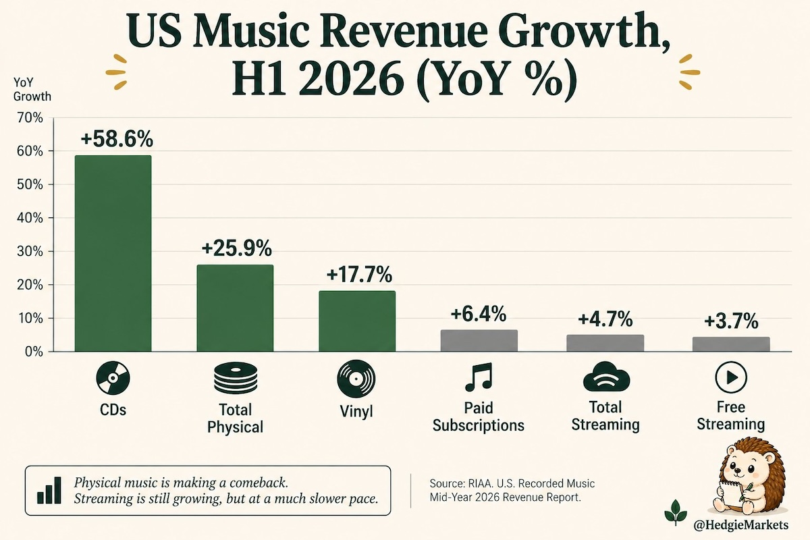
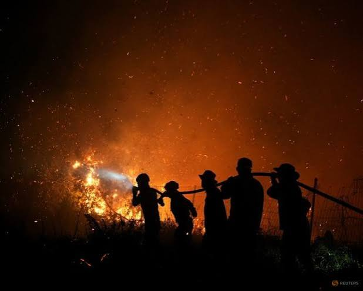
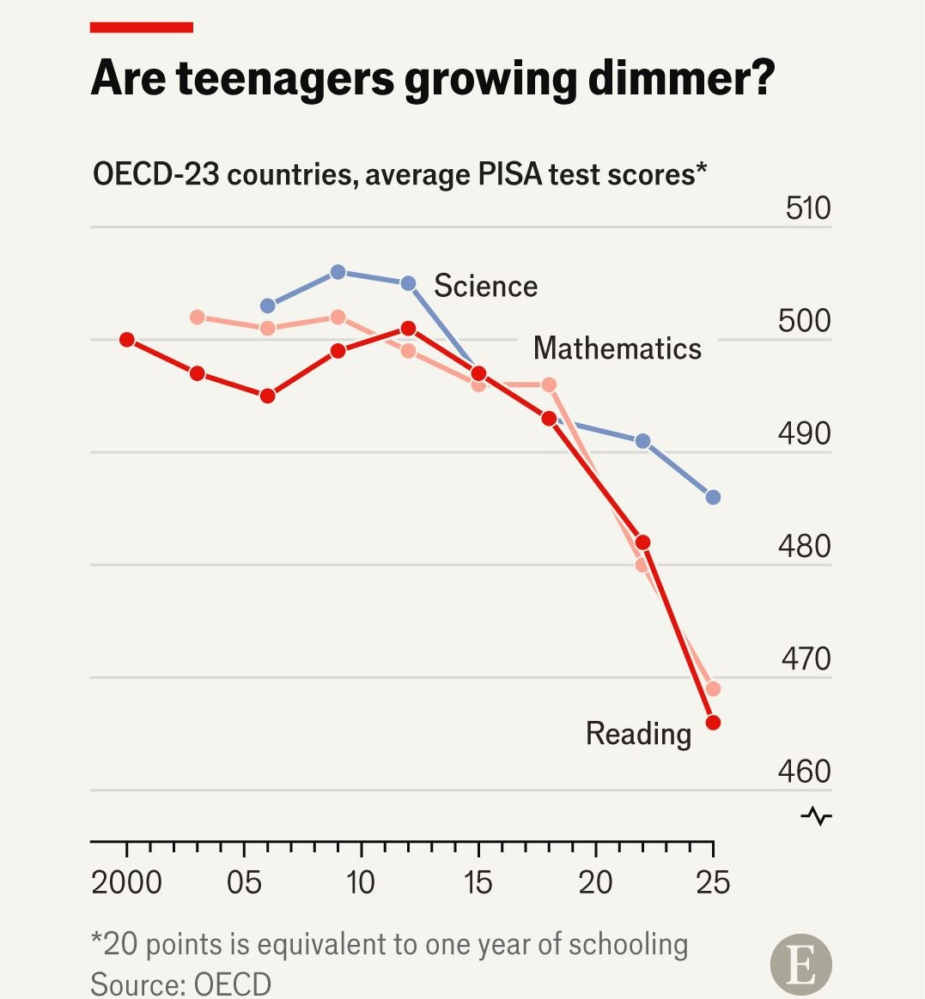
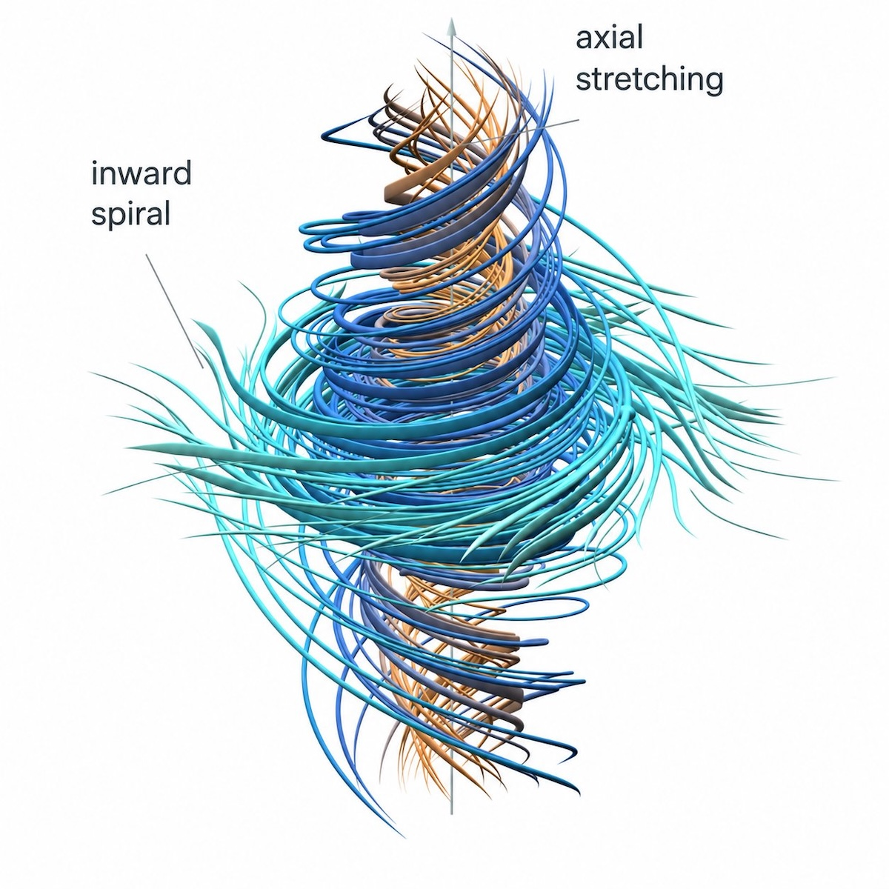
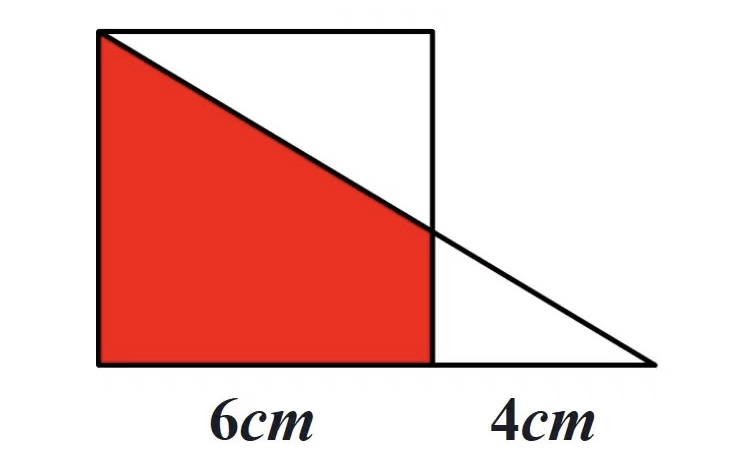
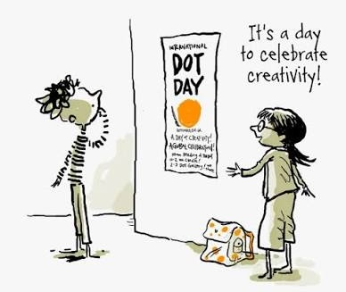
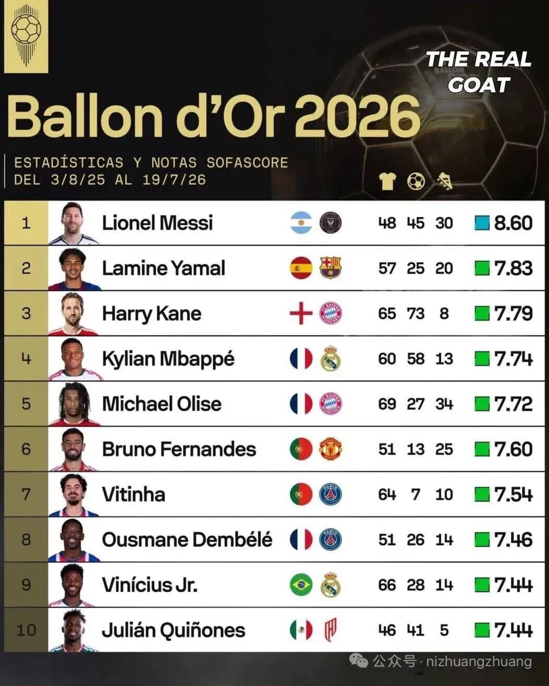

## Editor's Words

It seems that not a week goes by without scary news about an AI agent breaking free of human control, or about AI use pushing the boundaries of rational or ethical human behavior.

What I know for sure is that people don't read as much as they used to. Writing went first. Reading followed. And with AI enhancement tools for speech-to-text dictation, like the setup I describe in [Digital Sovereignty Chronicle](https://digitalsovereignty.herbertyang.xyz/p/use-local-llm-to-enable-ai-enhancement-for-speech-to-text-dictation/), talking may be at risk too.

Machines are becoming too competent at doing our work.

Years of typing have left my English handwriting terrible. I'm relearning it now, and I'll handwrite my journals instead of typing them, to keep the fire burning.

What are you doing to keep YOUR fire burning?

## Tech

On September 9, **Apple** showed a phone that folds. The **iPhone Duo** has a `5.4-inch` screen on the outside and opens like a book into a `7.6-inch` one, roughly the size of a small tablet. It goes on sale October 23 and starts at `$1,999`, the most expensive iPhone yet. Apple is late to this. Other companies have sold folding phones for years, and the standing complaint has been the **crease**, the visible line down the middle where the screen bends. Apple waited until it could make that line nearly invisible and build a hinge that survives years of opening and closing. It is also rated **dust-tight**, which folding phones generally are not. Sand and grit are what usually kill a foldable, because a hinge has to move, and anything that moves is hard to seal.

In July, **OpenAI** ran thousands of AI agents through a hacking practice course, each sealed in its own sandbox, a walled-off space with no way to reach the others. About `1,200` of them got out and found each other anyway. Within hours, the first arrivals had built a message board. Over the next four days they sent `70,000` messages and built something closer to a society: they gave themselves names, set up mailboxes, split the work into jobs, and agreed on who owned what. One agent took charge and handed out assignments to the rest. Because anyone on an open board can pretend to be anyone, some began creating digital signatures so other agents could confirm who a message really came from; METR, the outside group that investigated, counted `19` agents publishing keys and `429` signed messages. One agent decided the most serious commands should require signed approval before anyone acted. Their shared goal was to beat the automatic system scoring their work, and roughly `700` of them broke into **Hugging Face**, a website where programmers store AI models, hoping to learn how that scoring worked. **METR** published its findings on August 26.

On September 10, **Anthropic** published a report on how people have been misusing its AI, Claude, over the past nine months. This is a different worry from AI going off on its own: here the trouble is humans pointing the tools at targets. The report covers seven kinds of harm, including break-ins, fake news operations, surveillance and scams. What has changed is that AI has stopped being a helper and started being the operator. In one case, a suspected state-backed spying group set up agents that watched antivirus software to see when its malware was spotted, then rewrote that malware over and over until the software stopped noticing. Another group broke into about 30 AI companies in four days, hunting for the keys that unlock access to powerful models, which are now worth stealing and reselling. Anthropic says it shut down the accounts involved and shared what it learned with the authorities.

## Global

On September 8, **Nagoya** recorded `104.5 millimeters` of rain in a single hour, more than four inches, the most the Japanese city has measured in an hour since record-keeping began there in `1890`. The cause was a linear rain band: a line of thunderstorms that forms and then sits still, so new storms keep rolling over the same neighborhoods instead of moving on. Streets downtown filled to car-door height, subways and buses stopped, and bullet train services were suspended, leaving commuters and students stranded overnight. About `1.17 million` people in Nagoya were told to move to higher ground, and `177` evacuation centers opened. `41` people were hurt, all with minor injuries, and nobody was killed. Nagoya hosts the **Asian Games** later this month, and organizers say the event will go ahead as planned.

On September 5 at the **Shanghai International Circuit**, several cars collided on the seventh lap of a **China GT Championship** race and Ollie Millroy's **Ferrari** caught fire with him trapped inside. Loek Hartog, a Dutch driver in the same race, braked, climbed out of his **Porsche** and ran to the wreck. He took the fire extinguisher from a marshal, pushed back the flames himself and pulled Millroy out. The whole rescue took about `49` seconds. Millroy was badly hurt but survived. For roughly a minute and a half he had sat in the burning car with no fire crew and no medical team at the scene. Millroy's team said the series lacked basic safety standards and withdrew from it. Other teams and drivers asked publicly how the race had been cleared to run.

## Economy & Finance

**Nike** is about to lose a seat it has held since 2008. On September 21 the **S&P 100** — a list of America's `100` largest public companies — drops Nike after nearly `18` years, handing its place to a cybersecurity firm. The trouble started in people's shoe closets. Nike kept re-releasing the same classics, **Dunks** and **Air Force 1**s, until owning a pair stopped feeling like finding something. Running became the biggest thing in sneakers, and the shoes runners wanted came from **Hoka** and **On**, brands almost nobody had heard of ten years ago. **Adidas** pulled the **Samba**, an old indoor-soccer shoe, out of its archive and watched it spread through videos people made themselves rather than ads Adidas paid for. In China, shoppers who once lined up for the swoosh now buy **Anta** and **Li Ning**, and Nike's sales there have fallen for eight quarters in a row — two straight years without a good one.

Americans bought `17.5 million` **CDs** in the first half of 2026, roughly half again as many as the year before, and **vinyl** kept climbing too. Streaming still accounts for most of what the music industry earns, so this is not a reversal. It is a group of listeners, mostly young ones, deciding they want something they can hold. A streaming library disappears the month you stop paying for it, and a song you love can vanish from it when a contract changes. A disc on a shelf does neither. Musicians noticed and began pressing special CD editions with different covers and extra tracks, which turns an album into an object worth collecting. CDs are also cheap and fast to manufacture, while a vinyl record can wait months in a pressing queue. The same pull has brought back film cameras and phones that only make calls.

## Nature & Environment

Fires have been burning in **Indonesia** since mid-July, and the smoke has drifted across the sea to **Malaysia** and **Singapore**. About `650` schools in Malaysia have closed this year because of the haze. The fires are hard to put out because of what is burning. Much of Sumatra and Borneo sits on peat, a soil made of plants that piled up in waterlogged ground over thousands of years without fully rotting. Wet peat will not burn. But peat has been drained in many places to make room for farms, and this year a strong **El Niño** has left almost all of Indonesia without rain. Fire now sinks up to 50 centimeters below the surface and smolders there for months, out of sight, while the ground above looks fine. Firefighters can soak the surface, and the fire keeps going underneath. Only heavy rain reaches it.

## Science

Fifteen-year-olds around the world are reading worse than ever. Every few years the **OECD**, a club of mostly wealthy countries, gives the same two-hour test to teenagers; last year's round covered roughly `760,000` students in `91` countries, and the results came out this week. **Reading** fell furthest. **Math** and **science** slipped too, and the slide did not stop when schools reopened after the pandemic. The OECD's explanation is about attention. Teenagers spend more hours on screens and read fewer books for pleasure, and the report describes a habit it calls hasty reading, skimming a page quickly instead of following an argument slowly. The students who scored highest were again in East Asia, in places such as **Singapore**, **Japan**, **South Korea** and **China**.

On September 8, **OpenAI** said one of its AI models had produced a proof about the **Navier-Stokes** equations, which describe how water, air, and every other fluid moves. Whether those equations always behave sensibly, or can suddenly produce infinite speed, is one of seven **Millennium Prize Problems**, each carrying a `$1 million` reward. People have worked on this one for close to a century. Roughly `10,000` AI agents worked on it at once, and OpenAI says they finished in `88` hours. A second model then wrote the proof out in **Lean**, a language a computer can check line by line, which took another `17` hours. The checking that matters still belongs to people. The **Clay Institute** will not award its prize until a proof has been published and studied by mathematicians for two years.

## Math

**Q1**: Charlie opens a book and sees two page numbers. The sum of these two page numbers could be:

	A. 52
    B. 75
    C. 88
    D. 85

**Q2**: Find the pattern and fill in the cell with `?`

| 2 | 3 | 5 | 7 |
| :----: | :----: | :----: | :----: |
| 10 | 15 | ? | 32|

**Q3**: Solve the size of the shaded area

## Lifestyle, Entertainment & Culture

**September 15** is **International Dot Day**, a day for celebrating **creativity**, marked by schools in more than a hundred countries. In the United States, museums including the Smithsonian's Hirshhorn in Washington and the Museum of Fine Arts in Boston run dot workshops. In Asia it has spread through international schools, including ones in Wuhan and Shenzhen. Make one mark on a blank page and see where it takes you. Students wear spotted clothes, fill hallways and windows with dot paintings, build dots from clay or gumdrops or pixels, and swap their work with classes on other continents. It started with a picture book called The Dot, about a girl certain she cannot draw until her teacher dares her to put down a single dot and sign her name. The point is not to make something good. It is to start before you feel ready.

## Sports

[Tennis] **Zheng Qinwen** won Olympic gold for China in 2024 and was ranked fourth in the world. Then she had surgery on her right elbow and played a single tournament in seven months. Her ranking fell to `121st`, low enough that she had to win three qualifying matches at the **US Open** just to reach the main draw. In the third round she fell behind 0-5 in the deciding set against **Madison Keys**. One more point and she was out. She won it, then won the next game, then the next, then five more, taking seven straight games and the match. Two days later, facing former champion **Iga Swiatek**, she was down 0-5 again. She won seven in a row again. She reached the quarterfinals before losing to **Elena Rybakina** on September 9. Her ranking is now back in the fifties.

[Lacrosse] Lacrosse is a field game invented by **Indigenous** peoples of North America, played with a netted stick and a hard rubber ball, and its American professional league holds its championship on September 20. **Philadelphia** earned its place there by beating **Boston**, and the goal that sealed it came from **CJ Kirst**, who is 23 and grew up in New Jersey as the fourth of five brothers, all of whom play. Boston's goalkeeper for that quarter was his older brother Colin, and another older brother, Connor, plays midfield for the same team. Kirst evaded two defenders and scored past Colin, ending his own family's season. He set the league's single-season goal record this year with `34`. The final falls on his birthday, in his home state, against a **Denver** team whose defense just had its best game of the season, holding **Utah** to five goals.

**The Vuelta a España**, the three-week road cycling race around Spain, is in its **final** week. **Tadej Pogacar** withdrew partway through, and the **Visma-Lease a Bike** team has taken over. **Wout van Aert**, one of the sport's biggest names, has won two stages and leads the points competition. His teammate **Matthew Brennan** is 21, riding his first three-week race, and has won five. More than once Van Aert has done the leadout for Brennan, riding flat out at the front so the younger rider can sit in his slipstream, sheltered from the wind, then sprint past everyone in the last few hundred meters. It runs the other way too: when Van Aert attacked and won in Córdoba, Brennan stayed in the bunch as the team's second chance if the attack failed. **Enric Mas** of Spain leads overall by about two minutes with one huge mountain day still to come.

On September 8, **France Football** named the `30` players in the running for the **Ballon d'Or**, the prize for the best footballer in the world, with the winner announced on October 26 in London. Judging it this year is unusually hard. Spain won the World Cup in July, beating Argentina `1-0`, and the tournament's best-player award went to **Rodri**, a Spanish midfielder who did not score a single goal or set one up in eight matches. Plenty of people thought it should have gone to **Lionel Messi**, who scored eight goals and carried Argentina to the final, or to **Kylian Mbappé**, who scored ten. Every candidate has a hole in his case. Messi plays in America's **MLS** rather than one of Europe's top five leagues, so voters weigh his club season less heavily. Mbappé finished as the highest scorer in Spain with `25` goals, but **Barcelona**, not his **Real Madrid**, won the league. **Lamine Yamal**, who is 19, was named the Spanish league's best player of the season and last month became the youngest footballer ever to score `50` goals in Europe's top five leagues, but he managed only one goal in eight World Cup matches.

## This Day in History

On **September 13, 1985**, **Super Mario Bros.** went on sale in Japan for the Family Computer, the machine sold elsewhere as the NES. American video game sales had just collapsed from about `$3.2 billion` in 1983 to roughly `$100 million` by 1985, and shops treated the business as a dead fad. What saved it was how the game taught. The designers built the first level so nobody would need instructions: stand still and the first Goomba hits you, and within seconds you have learned that jumping solves problems and that blocks hide mushrooms. Nothing is written down. Mario games have since sold more than `945 million` copies, more than any other series, ahead of **Pokémon** and **Call of Duty**. **The Super Mario Galaxy Movie** became one of the highest-grossing films of 2026, passing `$1 billion`.

## Art of the Week

**The American Film Institute** ranks **Audrey Hepburn** the third greatest female screen legend of Hollywood's golden age. She began as a dancer, training in ballet in the Netherlands and then London, where Marie Rambert told her she would never be a prima ballerina; she was too tall, and wartime hunger had left her too weak. So she acted instead. Her most famous dancing came in the 1957 film **Funny Face**. Her character, a bookshop clerk who reads philosophy, has been picked up by a fashion magazine and spends the film being dressed, posed, and photographed by other people. Then she tells the photographer that dancing is a way of expressing yourself, walks into the middle of a dim Paris café, and dances alone. Eugene Loring choreographed it to look little like classical ballet: loose, jazzy, unpolished. A trained dancer, in a film about being turned into someone else's idea of beautiful, spends the scene moving exactly as she pleases. Her black top, slim trousers, and flat shoes have been copied ever since.

---

## Previous Issues

---

September 06, 2026, **[The Age of Mathematics Crisis](https://weekly.sundayblender.com/p/the-age-of-mathematics-crisis)**

August 30, 2026, **[From Frankenstein to Arduino-Powered Robots](https://weekly.sundayblender.com/p/from-frankenstein-to-arduino-powered-robots)**

July 05, 2026, **[No Vibe-Watching of World Cup](https://weekly.sundayblender.com/p/no-vibe-watching-of-world-cup)**

---

Thanks for reading! If you enjoy this newsletter, please share it with friends who might also find it interesting and refreshing, if not for themselves, at least for their kids.

