## Editor's Words

Lately I started feeling that I’m too integrated with machines. Everything I do is through interaction with a computer. I build products with AI models. I stay in touch with friends on social media. I coordinate with my team through instant messaging tools. I produce news with AI’s assistance. I read on a smart device. I watch movies/shows on a home server. I play games on game consoles.

My life is becoming too digital. It is hard to get away from the stimulus of machines. This is not a good trend.

So I figured I should do more analog things. I started handwriting daily journals and ditched Obsidian that I’ve been using for 10+ years. I started learning guitar (again). 

In those moments, I can find serenity without machines’ distraction. I can still focus. 

Hope the readers of the Sunday Blenders can find similar moments too.

## Tech

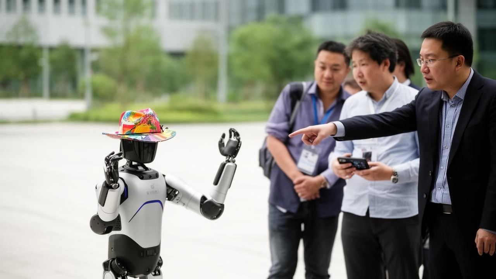

Tourists are paying to visit factories in **China**. Travel companies now run tours that take foreign investors, engineers and company executives through electric-car plants, robot workshops and battery factories in **Beijing**, **Shenzhen**, **Shanghai**, **Hangzhou** and **Hefei**, and one organizer charges up to `$15,000` for a five-day trip. A Shanghai agency said inquiries rose by half this year and that it now runs more than `100` single-day factory visits a month, mostly for European and Singaporean customers. American investment firms and technology podcasters have made the trip too, though many visitors prefer not to publicise it. What the visitors want to see is speed: how fast a Chinese company can turn a drawing into something coming off a production line. **Xiaomi**'s electric-car factory in Beijing has had more than `250,000` visitors since March 2024, and tickets are handed out by lottery, then resold online for as much as `$300`. In Hangzhou, groups are taken to the robot maker **Unitree**, where they watch humanoid machines walk and dance.

## Global

**Hong Kong** has filled **Victoria Park** with more than `3,000` lanterns from `20` countries, the first time the city has run an international lantern display. It opened on September 17 and runs to September 27, it is free, and the lanterns are lit from 6:30 in the evening until 11 at night. The occasion is the **Mid-Autumn Festival**, which falls on September 25 this year and is celebrated across much of East and Southeast Asia on the night of a full moon. Families gather, eat mooncakes and carry lanterns. Among the displays are giant lanterns from Nanjing, made in a style of lantern craft that the city has practiced for centuries, and a gallery of more than `400` handmade Hong Kong lanterns. Next to the park, in the `Tai Hang` neighborhood, a separate tradition runs from September 24 to 26: a `67-meter` dragon covered in about `12,000` burning incense sticks is carried through the narrow streets.

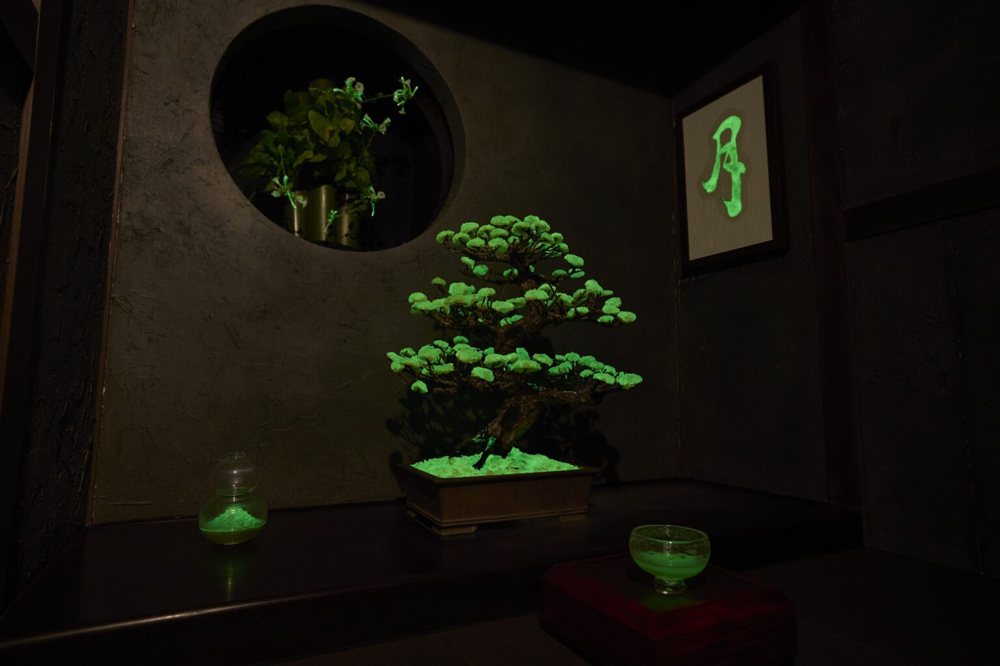

Scientists in two countries are trying to build plants that light themselves. A Chinese company, Magicpen Bio, has taken the genes that let fireflies flash and certain mushrooms glow and put them into plant cells, so the plant makes its own light using nothing but water and fertilizer. More than `20` kinds now glow, including orchids, sunflowers and chrysanthemums, and they were shown in public in Beijing in April. The researcher leading that work grew up in the countryside and says the idea came from lying in his grandfather's bamboo grove at night while fireflies landed on his arms. In Japan, a company called LEP, founded at Osaka University, is working toward the same thing with light-producing proteins. This month it put its plants on show in **Kyoto**. The exhibition runs from September 19 to 22 at **Roku Kyoto**, a hotel in the hills north of the city. During the afternoon, the plants glow inside a tea room. After sunset, a second display opens outdoors, in a garden of pools and water lilies. The plants stay lit there until eleven at night.

## Economy & Finance

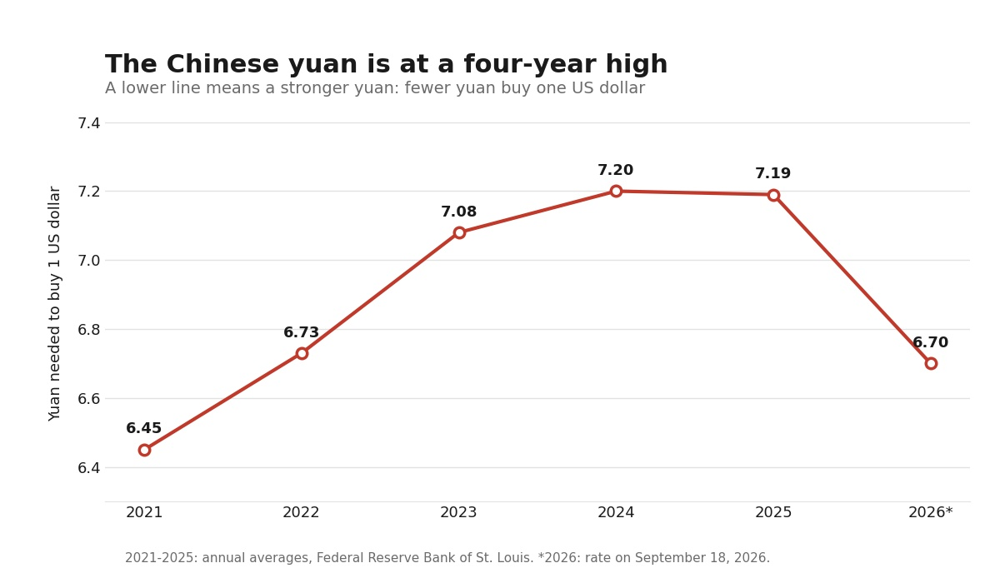

The Chinese **yuan** is worth more against the US **dollar** than at any time in four years. In March, one dollar bought about `6.91` yuan. This week it bought about `6.70`, the strongest the yuan has been since 2022. An exchange rate is just the price of one country's money in another's, and it moves every day. When the yuan gets stronger, things bought from abroad get cheaper for people in China, because each yuan buys more of someone else's money. The reverse is also true, and it matters more: a Chinese factory selling toys or phones overseas now earns fewer yuan for the same sale, so its goods look more expensive to buyers in other countries. That is why governments and companies watch these numbers closely. A shift of 20 fen sounds tiny, but China sold more than `three trillion` dollars' worth of goods abroad last year, and small changes multiplied that many times are not small.

## Nature & Environment

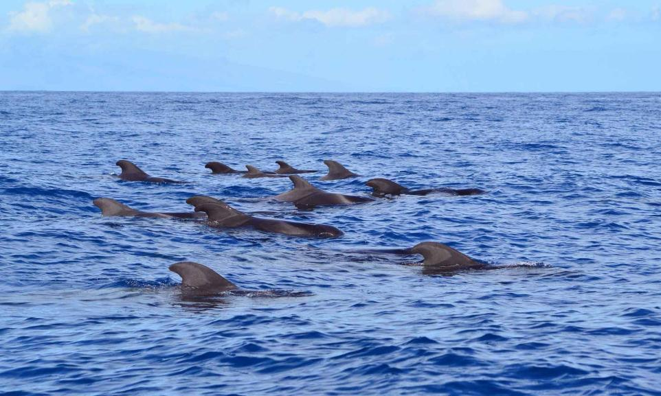

About `25` pilot whales swam into the **River Thames** this week and have not left. A ship's pilot working for the Port of London Authority spotted the pod on Thursday near Tilbury and Gravesend, downriver from **London**. Long-finned pilot whales normally live in deep, cold water far out in the **Atlantic**. Single whales and dolphins turn up in the Thames estuary now and then, but a group this large is rare. The river is a dangerous place for them: the water is shallow, the tide falls quickly, and boats pass constantly, all of which make stranding more likely. Rescue teams have moved whale rescue equipment to the riverside as a precaution and are watching the pod from a distance. They have asked people to stay away, keep drones on the ground, and avoid posting the whales' location online, because crowds and noise would add to the animals' stress.

## Science

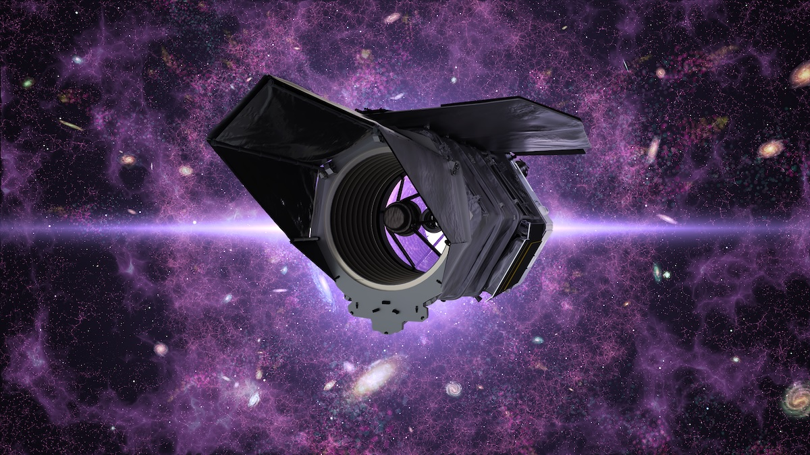

**NASA**'s **Nancy Grace Roman Space Telescope** launched from **Kennedy Space Center** in Florida on August 30, riding a **SpaceX** **Falcon Heavy** rocket. It is only the sixth space telescope NASA has launched at this scale since 1990, a list that includes **Hubble** and the **James Webb** Space Telescope. Roman's mirror is exactly the same size as Hubble's, but its camera takes in at least `100` times more sky in a single picture. Hubble and Webb are telescopes that stare: point them at one galaxy, and they will study it in extraordinary detail. Roman is built to sweep, mapping billions of galaxies at a time. The wide sweep is what its main question requires. The universe is expanding, and the expansion is speeding up, which nobody can explain. Scientists call the unknown cause **dark energy**, and Roman will study it by measuring how galaxies have spread apart over billions of years. It will also look for planets circling other stars, using an instrument that blocks the glare of a star the way your hand blocks the sun, so a planet beside it becomes visible. Roman reaches its working position, a million miles from Earth, in December, and NASA says it carries enough fuel to keep working for at least `22` years.

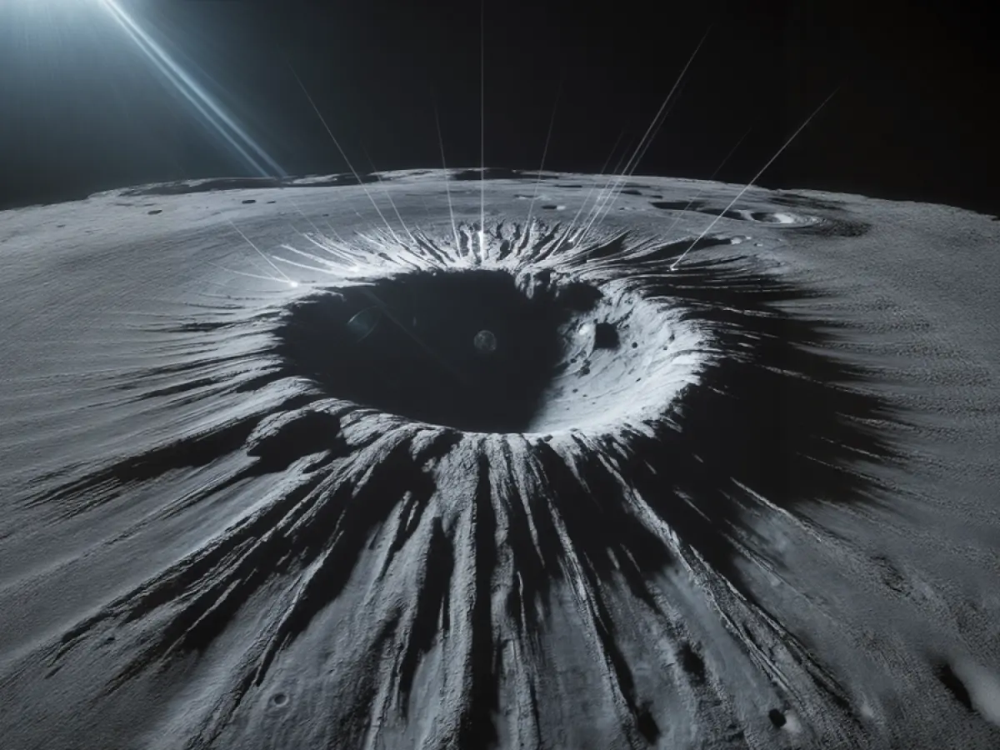

A comet or asteroid the size of a small office building hit the eastern edge of the Moon in the spring of 2024, digging a hole `222` meters wide and `43` meters deep. It is the largest fresh crater ever found anywhere in the solar system, scientists reported this week, and a strike that size happens about once a century. The blast threw rock and dust outward, and that debris changed the ground far beyond the crater rim. **NASA** measured a patch about `six` kilometers across, centered on the crater, that is now about `9` degrees Celsius colder at night than the ground around it. The impact fluffed up the Moon's loose surface dust, and fluffed-up dust holds less heat, so the whole area cools faster after sunset. Smaller rocks hit constantly: about `140` new craters big enough to see from orbit form on the Moon every year. Ground fluffed up this way could change how a rover's wheels grip it, which matters as NASA prepares to put people back on the Moon.

A man with **ALS** has been taking a medicine that was designed for him alone. ALS gradually kills the nerve cells that control muscles, and his was caused by a rare fault in a single gene. Scientists built and tested more than `320` short strands of genetic material before picking the one that matched his mutation most precisely. The strand intercepts the cell's copy of the faulty instruction before the cell can build a harmful protein from it. He receives it as an injection into the fluid around his spine. A protein in his blood that rises when nerve cells are dying fell sharply, and his breathing and thinking held steady instead of declining. His leg press went from `36` to `54` kilograms. Nine other people with the same gene fault have since been given the same drug.

## Math

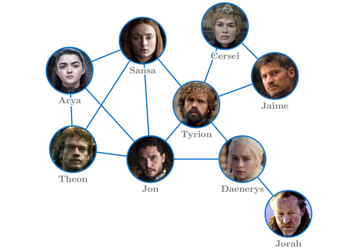

Most people have fewer friends than their friends do, and it is not bad luck. When researchers studied **Facebook**, they found that `93%` of users had fewer friends than the average of their own friends' friend counts. A typical user had about `190` friends, while their friends had an average of `635`. The reason is a counting trick rather than anything about you. Someone with 500 friends appears on 500 people's friend lists, so almost everyone knows them. Someone with three friends appears on three lists, so hardly anyone does. Popular people therefore show up again and again when you add up your friends' friends, and they drag the average upward. The sociologist **Scott Feld** first worked this out in 1991, before social media existed. The feeling that everyone else is more popular than you is mostly arithmetic, not because you are less popular.

## Lifestyle, Entertainment & Culture

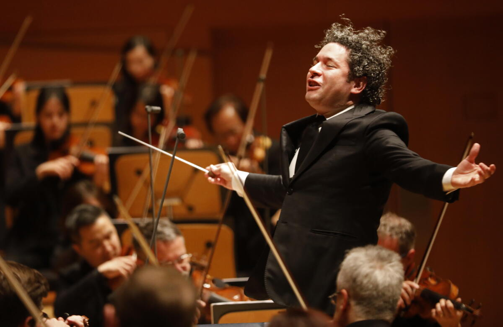

**Gustavo Dudamel** was 14 the first time he came to New York, touring with Venezuela's National Children's Symphony, and he spent part of the trip jumping up and down on the giant floor keyboard at the **FAO Schwarz** toy store. He is now `45`, and this month he became music director of the **New York Philharmonic**, the person who chooses what the orchestra plays and leads it from the podium. It is the oldest symphony orchestra in the United States, founded in `1842`, and the job has been held by **Gustav Mahler** and **Leonard Bernstein**. When the Philharmonic hired Dudamel in 2023, its chief executive at the time, Deborah Borda, called him the most sought-after conductor in the world. He is the `27th` person to hold the post and the first Latino. Dudamel learned to play in **El Sistema**, Venezuela's free music program for children, and spent `17` seasons leading the **Los Angeles Philharmonic**. His first concert as music director was on September 10 at **Radio City Music Hall**, where the orchestra shared the stage with the pop singers **Lizzo** and **St. Vincent**.

**Dmitry Yudin**, a 25-year-old Russian pianist, won the **Arthur Rubinstein International Piano Master Competition** in **Tel Aviv** on September 9, taking a first prize of `$40,000`. He played **Bartók**'s Second Piano Concerto with the **Israel Philharmonic Orchestra** in the final round. The competition was founded in 1974 and is held once every three years; past winners include **Emanuel Ax** and **Daniil Trifonov**. Six pianists reached the final stage, where each had to play in a small group and then with a full orchestra, in front of a jury that included **Martha Argerich**. Uladzislau Khandohi of **Belarus** and Jinhyung Park of **South Korea** shared second place, and Roman Fediurko of **Ukraine** came third. Yudin has been studying at the **Manhattan School of Music** in New York since 2019.

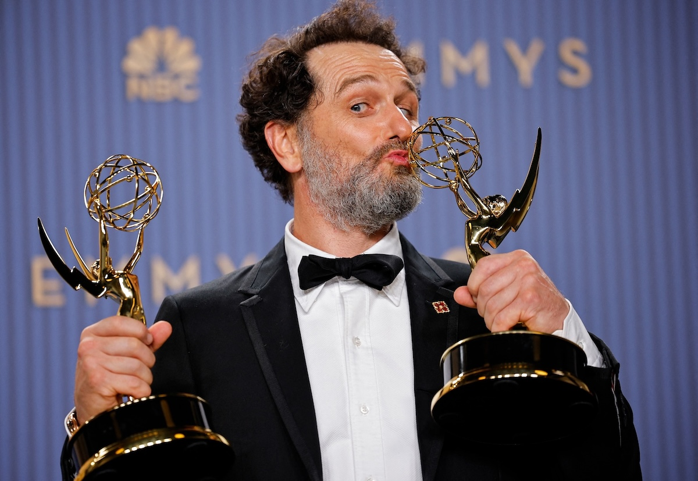

**Matthew Rhys** won two acting **Emmy Awards** on the same night, September 14. The Emmys are American television's top awards, first given in `1949`; they are the television version of the **Oscars** for film and the **Grammys** for music. The Welsh actor, 51, had already won an Emmy in 2018 for playing a Soviet spy in the drama series **The Americans**. His new awards, for the **Netflix** series **The Beast in Me** and the **Apple TV** series **Widow's Bay**, mean he has now won the lead acting prize in all three of the Emmys' main acting categories: drama, comedy, and limited series. No man had done that before, and none had won two lead acting Emmys in a single night. The actress **Barbara Stanwyck** won all three lead categories between 1961 and 1983, though the awards were organized differently then. Widow's Bay, in which Rhys plays the mayor of a cursed island town, won `14` Emmys this year across two ceremonies, including the award for best comedy series. That is the most any comedy series has ever won in a single season.

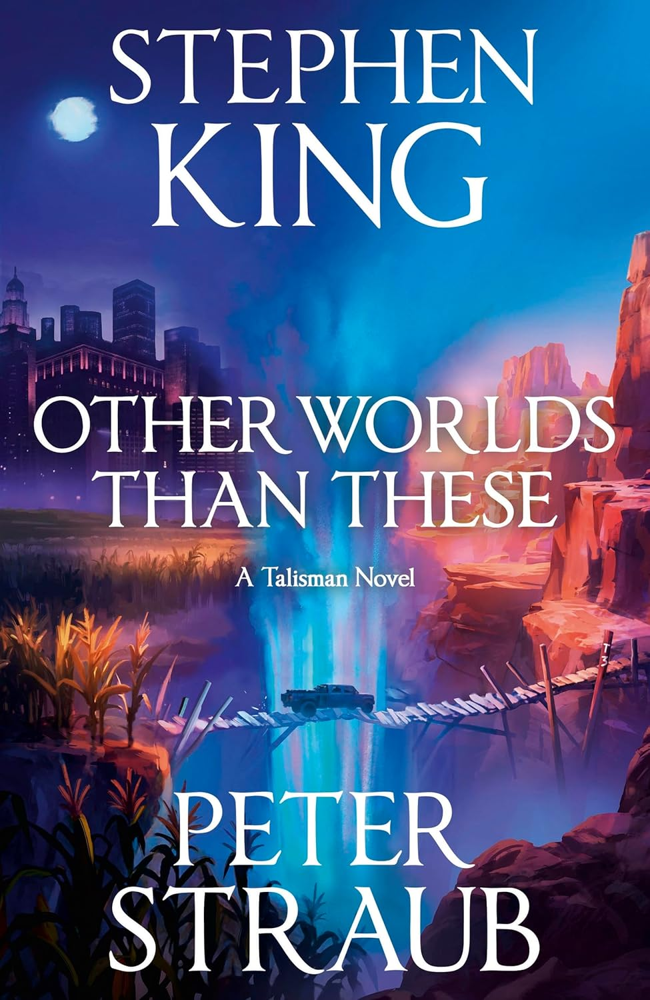

**Stephen King** is one of the world's best-selling novelists, known for horror stories like **Carrie** and **IT**, and also for the tale that became the film **The Shawshank Redemption**. **Peter Straub** was another American novelist, best known for his 1979 book **Ghost Story**. The two met over dinner in London in 1977, when each was a fan of the other's books. Seven years later they published **The Talisman** together, a novel about a twelve-year-old boy crossing America and a parallel world to find something that can save his dying mother. They wrote it by passing chapters back and forth between two word processors connected through a telephone line, more than a decade before the internet made that ordinary, and they copied each other's style on purpose so readers could not tell who had written what. A sequel, **Black House**, followed in 2001. They planned a third book and never wrote it. Straub died in 2022. On October 6, King will publish **Other Worlds Than These**, the last book in the trilogy, built from an idea Straub had emailed him years earlier. King wrote every word of it himself, and both their names are on the cover. Forty-nine years after that dinner in London, the friendship still had one more book left in it.

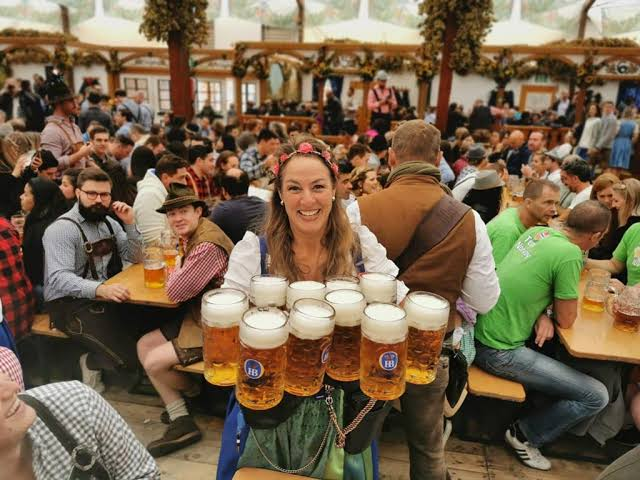

The world's biggest beer festival opens in **Munich** in late September every year and runs into October. This year is the `191st`. Only six breweries are allowed to pour there, all of them from Munich, and each of the huge tents serves one of them, so choosing a tent means choosing a beer. Inside, thousands of people sit at long wooden tables in **Lederhosen** and **Dirndl**, the traditional **Bavarian** clothes, eating roast chicken, sausages and huge soft pretzels. A brass band plays in the middle, and every so often it strikes up a toasting song, at which point much of the tent climbs onto the benches to sing. Beer arrives in a **Maß**, a one-liter glass mug that weighs about two and a half kilograms when full, and servers cross the room carrying ten or more at once. The festival began as a royal wedding party in 1810 and has been held on the same field ever since.

## Sports

**Zhao Jiaju** ran for `65` hours and `55` minutes without a proper night's sleep and won one of the hardest races in the world. **The Tor des Géants** crosses the Italian Alps for `336` kilometers, roughly eight marathons end to end, and climbs more than `24,000` meters, close to three times the height of **Mount Everest**. Fewer than six in ten runners who start it usually finish. Zhao, who is `31`, entered the same race last year and dropped out after `204` kilometers. This time he led from the start and finished on September 16, becoming the first Asian runner to win the race and the first person ever to go under `66` hours, beating the course record by `13` minutes. He left home at 15 for **Wudang Mountain** hoping to train in martial arts, could not afford the lessons and learned by watching videos instead. He later worked as a food delivery rider, and rather than use the scooter, he ran the deliveries, three or four bags in each hand, about `1,500` orders a month. That was his training.

**The Champions League**, the biggest club football competition in the world, began its new season on September 8. Thirty-six teams from across Europe play eight games each in one giant league table before the knockout rounds begin. **Kylian Mbappé** scored after 14 minutes as **Real Madrid** beat **Inter Milan** 2-1, and **Erling Haaland** scored twice for **Manchester City** at Porto. **Barcelona** beat **Feyenoord** 5-1, with a goal from **Lamine Yamal**. **Paris Saint-Germain** hit six past **Slovan Bratislava**, with three from **Ferran Torres** and two from **Ousmane Dembélé**. **Bayern Munich** won 5-0, **Liverpool** beat **Atlético Madrid** 2-1 and **Arsenal** won at Napoli. **Manchester United** beat **Sabah of Azerbaijan** 4-0. The surprise came in Italy, where **Como**, a small club from the town on Lake Como, beat **RB Leipzig** 4-1. Across the `18` opening matches there were `69` goals. The final will be played in Madrid next June.

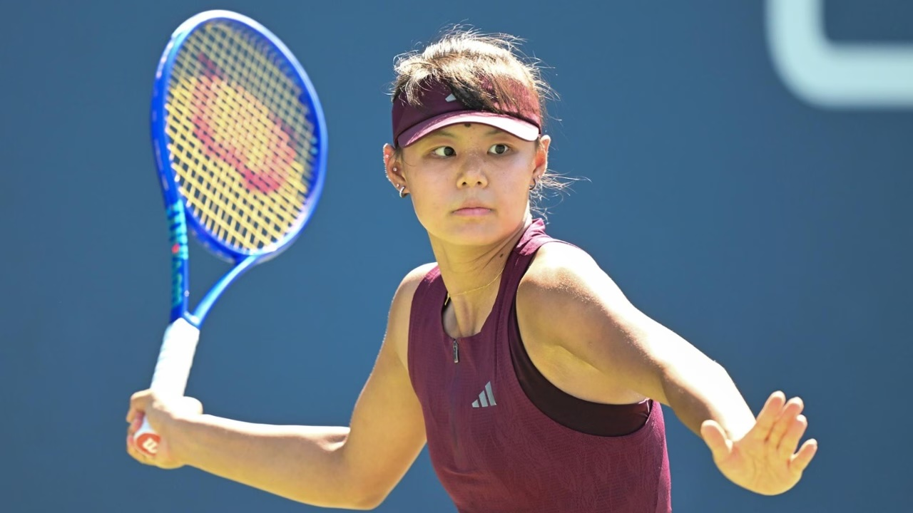

**Sun Xinran** won the junior singles title at the **US Open** on September 12, beating **Anna Pushkareva** 6-4, 4-6, 6-0. The 16-year-old is ranked the best junior tennis player in the world and was the top seed in New York. She lost the middle set, then won the deciding one without giving up a single game. It is her first title at a **Grand Slam** tournament, the four biggest events in tennis: the **Australian Open**, the **French Open**, **Wimbledon** and the **US Open**. Each one runs a junior competition for players under 18 alongside the main draw. She is the third Chinese player to win a junior singles title at any of them, after **Wu Yibing** in 2017 and **Wang Xiyu** in 2018, and all three won it at the US Open. Sun was born in **Shenzhen** and started playing at about six. She now trains in **Belgrade**, the capital city of **Serbia**, speaks conversational Serbian and names **Novak Djokovic**, who grew up in that city, as her idol. Her school in Shenzhen built an online teaching team for her, and she does her homework in hotel rooms, in restaurants and on the way to airports.

## This Day in History

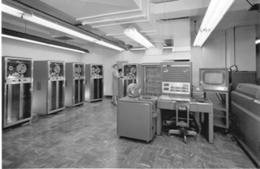

On **September 20, 1954**, a team at **IBM** led by **John Backus** ran the first program written in a language called **FORTRAN**, short for **Formula Translator**. Before it, people programmed computers by writing long strings of numeric codes, a slow job in which one wrong digit broke everything. FORTRAN let scientists write something closer to ordinary algebra and let the machine do the translating. Backus later explained where the idea came from: "Much of my work has come from being lazy." He built a tool that did the tedious part for him. Seventy-two years later, weather forecasts, climate models and many of the world's fastest supercomputers still run on Fortran. It was built for one job: doing arithmetic on enormous grids of numbers. Because it spells out exactly where each number sits, and promises that no two of them share the same space, the computer can rearrange the work to run faster. Even new programs lean on it: when **Python** or **R** does serious math, the work is usually handed to Fortran libraries written decades ago.

## Art of the Week

One of the most played pieces of music in the world has no known composer. Guitarists call it **Romance**, or **Spanish Romance**, and almost anyone learning classical guitar runs into it early. Old folk songs often have no known author, but a piece printed and performed this widely usually does. It was probably written in Spain or South America in the 1800s, and it has been credited to at least nine different people. None of the claims has held up. Music then traveled the way stories did before books: a teacher played a piece, a student learned it by ear, and a tune could cross an ocean without a name attached. When a guitar teaching book in **Montevideo** printed it in 1919, the title it was given described what people called it: the piece known as Rubira's Study. A Spanish guitarist named **Narciso Yepes** made it famous by playing it in the 1952 French film **Forbidden Games**, and he said he had written it as a child. Printed copies existed before he was born in 1927. Sheet music today usually credits him as the arranger and leaves the composer blank.

## Funny

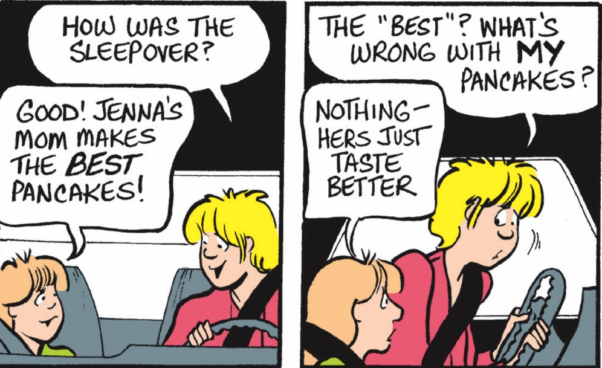

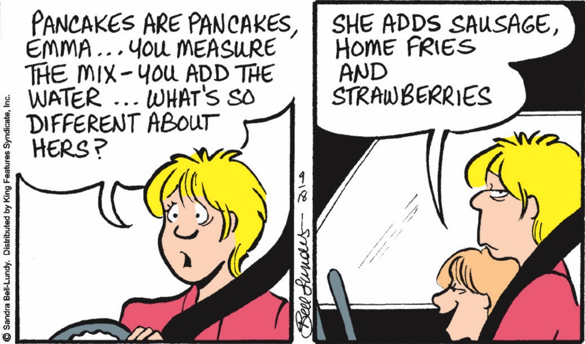

---

## Previous Issues

---

September 13, 2026, **[Can Teenagers Still Read?](https://weekly.sundayblender.com/p/can-teenagers-still-read)**

September 06, 2026, **[The Age of Mathematics Crisis](https://weekly.sundayblender.com/p/the-age-of-mathematics-crisis)**

August 30, 2026, **[From Frankenstein to Arduino-Powered Robots](https://weekly.sundayblender.com/p/from-frankenstein-to-arduino-powered-robots)**

---

Thanks for reading! If you enjoy this newsletter, please share it with friends who might also find it interesting and refreshing, if not for themselves, at least for their kids.

