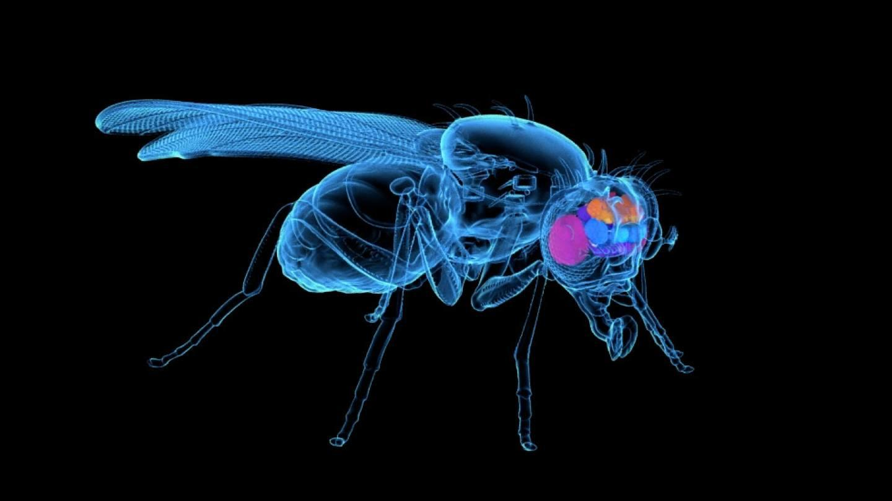
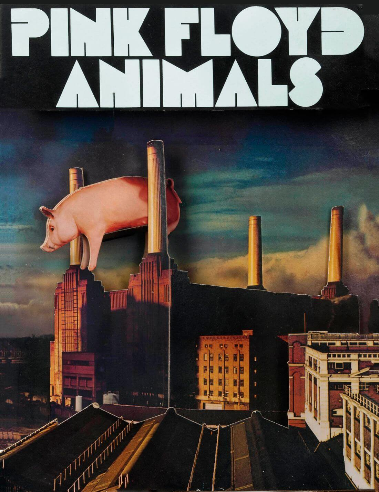
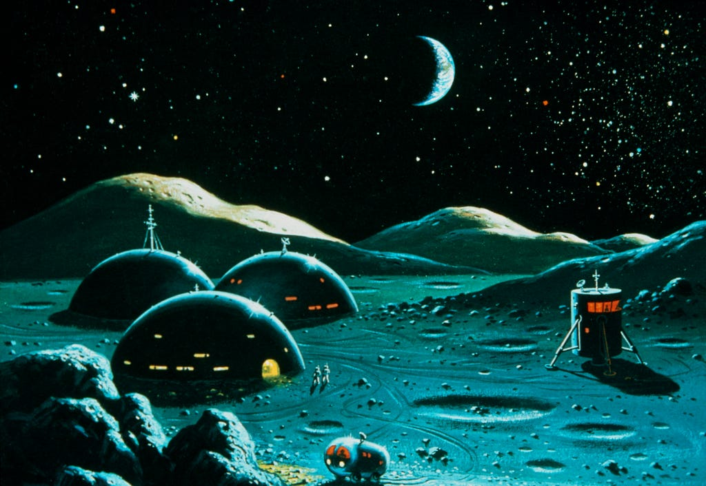
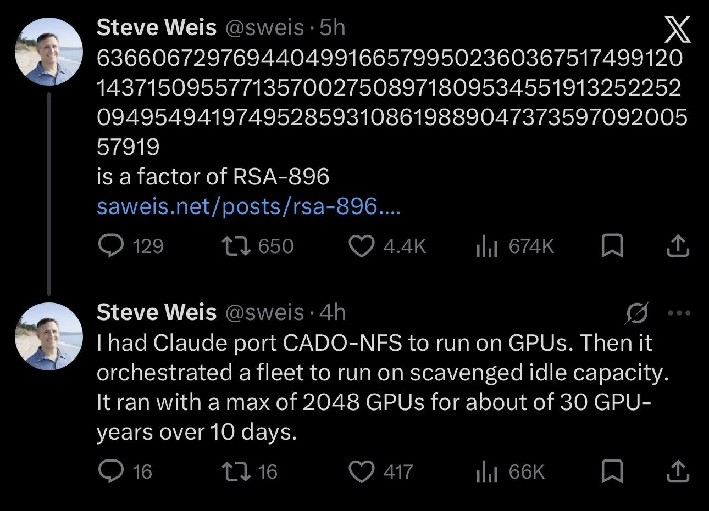
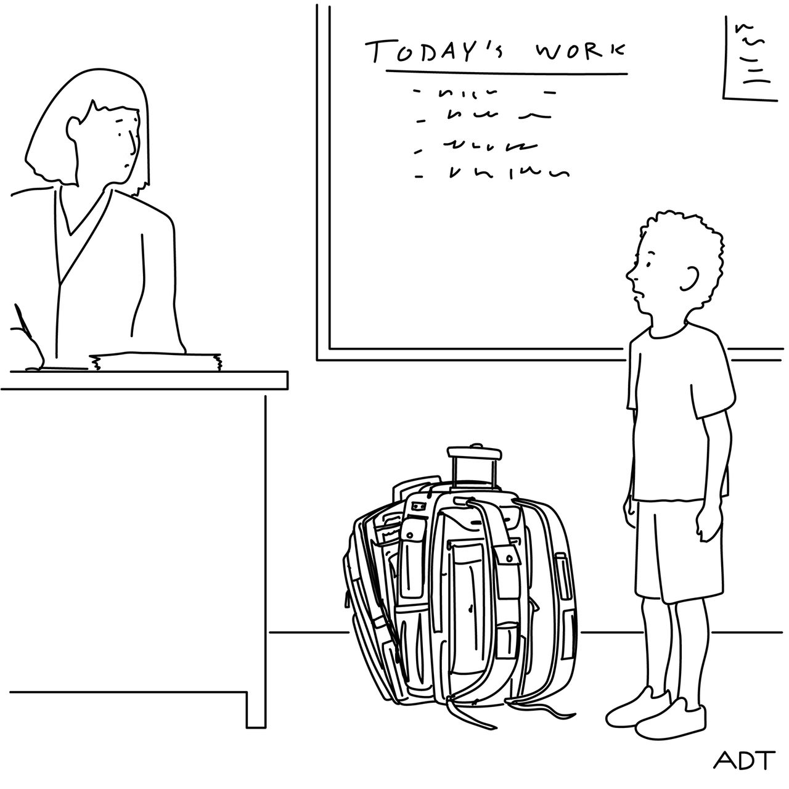

## Editor's Words

Happy Mid-Autumn Festival. Hope the mooncakes stayed a treat and not a sugar hangover.

Congratulations to my fellow Changning residents: Time Out just named the district one of the coolest in the world, at No. 26. I used to think Minami-Aoyama in Tokyo set the bar for Asia. Changning holds its own now.

Also in the local community, YK Pao fencing keeps making news. When will someone from YK Pao do the same in badminton?

## Tech

**Meta**, the company behind **Facebook**, **Instagram** and **WhatsApp**, has released **Muse**, an AI "agent" that does tasks instead of just answering questions. Give it a goal, and it can open a web browser, fill out forms, send emails, book trips, and make purchases. It can also turn a recipe video into a grocery list or help lower a bill. Launched in the US on September 8 for adults 18 and older, Muse soon overtook **ChatGPT** as the top free iPhone app in the country. To work, it asks users to connect accounts such as email, calendars, payments, and even health services. Meta says Muse runs in its own sealed-off computer system and never sees users' passwords or payment details. The company is now working on bringing Muse to its smart glasses, so people could hand off tasks without using their hands.

On the evening of September 9, during a heat wave, more than `140,000` home batteries across **California** worked together like a single power plant. Using software, the companies **Tesla** and **Sunrun** told the batteries, most of them **Tesla Powerwalls**, to send their stored electricity back into the state's power grid for three hours, just as air conditioners were straining it most. Together they supplied `580` megawatts, enough to power every home in **Sacramento County** at once, making it the largest event of its kind ever recorded. Many of these homes are paired with rooftop solar that charges their batteries during the day. A network like this is called a "**virtual power plant**," and it needs no smokestacks or land of its own. State energy officials asked for the help, and homeowners who take part are paid for the electricity they share.

Scientists have published the largest map of an animal's brain ever made, and within a day people online were using it to play video games. The map, released on September 3 by the Janelia Research Campus in the US with **Google** and British researchers, shows the more than `166,000` nerve cells in the brain and nerve cord of a male **fruit fly** and the `125 million` connections between them. It took about a decade to build, and anyone can download it for free. The next day, a graduate student ran the wiring as a computer simulation and let it steer a fly in the game **Minecraft**. Others soon hooked it up to games such as **Doom**, to a parallel-parking challenge, and to drones that react to a person's hand. The map is not a living brain: it shows how the cells are wired, not the chemistry of a real one, so the simulations can only estimate how a fly's brain might behave. Mapping a human brain, with about `86 billion` nerve cells, is not yet possible.

## Global

**Japan** now has more than `100,000` people aged `100` or older, the first time the country has passed that mark. The government counted `107,677` **centenarians**, the word for people who live to 100, up for the `56th` year in a row, even though Japan's overall population has been shrinking for decades. When the count began in 1963, there were just `153`. Almost nine in ten of today's centenarians are women. The oldest is Fuyo Kishimoto, a `114`-year-old woman from Kyoto, and the oldest man is Hikaru Kato, `112`, from Kumamoto. Health Minister Kenichiro Ueno credited better medical care, healthy lifestyles, and diet. The figures came out ahead of **Respect for the Aged Day**, a national holiday when healthy, active centenarians are honored with a letter from the prime minister and a silver cup.

Young people from `68` countries and regions spent this week in **Shanghai** competing for gold, silver and bronze medals in real jobs, from cooking and fixing cars to building robots. The **WorldSkills Competition**, often called the "Skills Olympics," brought a record `1,385` competitors to the city for `64` events, and most had to be `22` or younger. Each event is a practical task taken from the workplace, lasting 15 to 22 hours spread over four days. Bricklayers had 22 hours to follow expert drawings, cutting yellow, red and black bricks to match a set pattern. Cooks planned menus and served their dishes on time, while car mechanics tracked down and repaired faults. Most competitors work alone, but some events use teams: two builders from Hong Kong entered concrete construction together, and robotics teams built robots that find their way around on their own. Seven skills were new this year, including building and maintaining drones. Each person can compete at WorldSkills only once in their lifetime.

**Apple** is opening a 600-person concert hall inside **London**'s **Battersea Power Station**, the old brick power plant on the cover of **Pink Floyd**'s 1977 album **Animals**. Pink Floyd, formed in London in 1965, was one of the first British psychedelic rock bands and became famous for long, experimental songs and elaborate live shows. Its album **The Dark Side of the Moon** spent nearly `1,000` weeks, about `19` years in total, on the main US album chart. The album even gave its name to **Moonshot AI**, the Chinese company behind the **Kimi** chatbot, whose founder, Yang Zhilin, named it "Dark Side of the Moon" in Chinese after his favorite album. Animals, loosely inspired by **George Orwell**'s novel **Animal Farm**, sorts people into dogs, pigs and sheep, and reached the top 10 in both the UK and the US. Its cover shoot did not go to plan. In December 1976, the band floated a 12-meter inflatable pig above the power station's chimneys, but on the second day the wind tore it loose. It drifted into the path of planes at **Heathrow Airport**, where flights were grounded, and came down that night on a farm in Kent, frightening a herd of cows. The final cover was a photo of the pig pasted onto a moodier sky taken on the first day.

## Economy & Finance

**Oracle**, an American tech company building giant data centers for artificial intelligence, has reached for a legal clause usually linked to floods, wars and earthquakes. The clause, called "**force majeure**," French for "superior force," excuses a company from its promises when something beyond its control gets in the way. Oracle sent the notice about **Project Jupiter**, a massive data center being built in **New Mexico** as part of **Stargate**, an AI building plan involving **OpenAI**, the maker of **ChatGPT**. The trouble here is electricity. State officials have twice rejected the route of a gas pipeline meant to power the site, and a permit for its on-site power plant has not yet been approved. The notice would let Oracle delay payments to the developer if the data center misses its planned 2028 opening. Spending on AI, much of it on data centers, has become one of the biggest drivers of the US economy. Yet data centers now account for about half of the growth in US electricity demand, and people living near projects like Jupiter are pushing back over how much power and water they use.

## Nature & Environment

Scientists in Italy have released about `130,000` baby **octopuses** into the **Adriatic Sea** to help fight an invasion of **blue crabs**. The crabs come from the Atlantic coast of North America and probably reached the Mediterranean decades ago as tiny young crabs in seawater that ships pump into their tanks to stay steady. As the sea has warmed, their numbers have exploded, and their sharp claws crack open the clams and mussels that local fishermen depend on. In Italy's **Emilia-Romagna** region alone, officials say the crabs have caused about `$20 million` in damage since 2022. Blue crabs have few natural enemies there, but octopuses hunt crabs in the wild. The babies, raised in a lab at the **University of Bologna**, are only a few millimeters long, and most will not survive to adulthood. A full-grown octopus of about 1 kilogram can eat up to four crabs a day. Octopuses already live naturally in the Adriatic, so the team is boosting the numbers of a local hunter to keep the foreign invader in check.

## Science

**NASA** plans to land astronauts on the **Moon** in 2028 and build a base there, according to a roadmap its leader, **Jared Isaacman**, laid out in a speech at the **All-In Summit**, a technology conference in the US. First, in summer 2027, the **Artemis III** mission will launch into orbit around Earth to meet up with test versions of Moon landers built by **SpaceX** and **Blue Origin**. **Artemis IV** would then carry astronauts to the surface. The base will sit near the Moon's south pole, where there is water ice, with missions launching almost every month and live video on a Moon base website. In about 2029, a spacecraft powered by a nuclear reactor, called **SR-1 Freedom**, is set to fly past **Mars** and drop off three helicopters that will use radar to hunt for buried ice. That same year, **Dragonfly**, a nuclear-powered drone with eight rotors, will head to **Titan**, a moon of **Saturn**. Isaacman also said pictures from NASA's new **Roman Space Telescope** will be so large that no screen on Earth can show them in full.

The US military has released another batch of once-secret files on **UFO**s, describing sightings it cannot explain, though none proves that alien craft are visiting Earth. One clip, filmed in 2025 by a heat-sensing camera on US military equipment in the Middle East, shows six small round objects flying in a group. The report that came with it described them as "seemingly agile" and "frequently changing direction," at an estimated `770` kilometers per hour. In another clip, filmed over Syria in 2021, an object shoots off the edge of the screen in under a second; the military's notes say the camera stopped tracking the object at that moment. The newest files also hold a recording of a 1952 talk by Edward Ruppelt, a US Air Force officer who later led its UFO investigations. He said about one in five of the cases studied could not be explained, and that radar had picked up some objects at unconfirmed speeds of up to `5,600` kilometers per hour. Investigators at the time suggested that a famous 1952 film of white dots over Utah, also in the new files, probably showed seabirds.

Mathematicians have a new record: a `270`-digit number called **RSA-896** has been broken down into the two prime numbers that multiply to make it. A **prime number** can only be divided evenly by 1 and itself, like 7 or 13. Multiplying two primes is easy: 7 × 13 = 91. Working backward, from 91 to 7 and 13, is much harder, and for numbers hundreds of digits long it takes enormous computing power. A common type of encryption that protects websites and banks, also called **RSA**, depends on that difficulty. On September 19, engineer Stephen Weis cracked RSA-896 with help from **Claude**, an AI made by **Anthropic**, which adapted existing software to run on up to `2,048` computer chips for about `10` days. Only 16 days earlier, engineer Eric Lu had set the previous record using a different AI. Neither used a new math method. The RSA codes banks use today are built on numbers about `617` digits long, and researchers estimate that cracking one with today's best methods would take longer than the age of the universe, `13.8` billion years.

## Math

A **Klein bottle** is a bottle that can never be filled because it has no inside. The German mathematician **Felix Klein** described the shape in 1882. An ant walking on the outside of one could climb up its curved neck, follow it as it bends back and plunges through the bottle's side, and end up on the inside without ever stepping over an edge. To anyone watching, the neck seems to punch a hole through the wall. For the ant, there is no hole, just a smooth path. That is because a true Klein bottle needs four dimensions, and there the neck slips past the wall without touching it, the way a bridge on a flat map looks like it crosses a road, even though in real life it passes over it. Its simpler cousin, the **Möbius strip**, can be made by giving a paper strip a half twist and taping the ends together. A pencil line along its middle covers both "sides" without lifting the pencil, because there is only one. The recycling symbol was designed as a Möbius strip, and machine belts twisted into one wear out half as fast because both faces get used.

## Lifestyle, Entertainment & Culture

The judges at one of the world's oldest piano contests decided that nobody had earned first prize this year. At the **Franz Liszt International Piano Competition**, which ended on September 20 in **Pécs**, **Hungary**, two pianists shared second prize instead: **Ildikó Rozsonits** of Hungary and **Barbare Tataradze** of the country of Georgia, each winning about `$21,000`. In the final, each pianist played a piece by Liszt with a full orchestra. Tataradze played Liszt's **Second Piano Concerto**. Rozsonits, who also won the audience vote, played **Totentanz**, or **"Dance of Death."** It is built on the Dies irae, a church chant from the 1200s about **Judgment Day**. Composers have borrowed its dark, falling notes ever since, and echoes of it can be heard during the wildebeest stampede in **The Lion King**.

**Changning**, a leafy district in western **Shanghai**, has been named one of the `40` coolest neighborhoods in the world by the travel and culture guide **Time Out**, coming in at number `26`. Time Out's editors judged each place on its food, independent shops, how pleasant it is to live in, and its sense of community. Long ago, Changning sat on the city's western edge, where wealthy Chinese and foreign residents lived in garden villas and met at country clubs. Many of those old buildings now house shops, restaurants and small museums, along streets shaded by plane trees. Several university campuses mean there is plenty of cheap food, and **Zhongshan Park** adds plenty of green space. Time Out recommends a day at **Park Dimanche**, a new hub of creative studios, cafes and a bookstore. Another Chinese neighborhood, **Yulin** in **Chengdu**, came 34th, while the top spot went to **Jongno 3-ga** in **Seoul**, **South Korea**, known for its street food stalls.

"**Choosin' Texas**" by American country singer **Ella Langley** has now spent `23` weeks at number one on the **Billboard Hot 100**, the main US singles chart, more than any other song since the chart began in 1958. It beats the 22 weeks of **Mariah Carey**'s "**All I Want for Christmas Is You**," which has returned to the top every holiday season since 2019. Langley, now 27, grew up in the small town of **Hope Hull, Alabama**, singing in church and sitting beside her grandfather at the piano. After he died, her father had his old guitar restrung for her when she was 14, and that same night she taught herself to play **Bob Marley**'s "**Three Little Birds**." She practiced performing in front of the family's cows, gave her first public performance at a school talent show, and worked at a trampoline park to pay for her early music. She moved to Nashville, Tennessee, in 2019 and later wrote "Choosin' Texas" with country star **Miranda Lambert** and two other songwriters.

## Sports

**Zinedine Zidane** scored twice with his head in the 1998 **World Cup** final, when France beat Brazil 3-0 to win its first World Cup. Twenty-eight years later, he has led France for the first time as head coach, and won. France hired Zidane in July, two weeks after a painful World Cup in North America, where the team, one of the favorites, lost 2-0 to Spain in the semifinals and then 6-4 to England in the match for third place. Zidane had turned down offers from clubs for years, saying the French team was the only job he wanted. On September 25, France beat Turkey `1-0` in the **UEFA Nations League**. **Kylian Mbappé**, the captain and the leading goal scorer in World Cup history, fired in a low shot early in the second half, but hurt his left knee while taking it and left the field minutes later. Zidane said Mbappé had overextended his knee, and he is likely to miss France's next three matches.

Teenage swimming sensation, `19`-year-old **Zhang Zhanshuo** from China, has made history at the **Aichi-Nagoya Asian Games** by clinching an unprecedented `7` gold medals, solidifying China's aquatic supremacy and setting a new benchmark for athletic achievement. He swept every freestyle race from 200 meters up to 1,500 meters and added three golds in relays. His final win came on September 25 in the 400 meters, where his time of 3 minutes 41.28 seconds broke a Games record set in 2010 by South Korean star Park Tae-hwan. The Asian record in that race, 3 minutes 40.14 seconds, was set by China's **Sun Yang** when he won Olympic gold in London in 2012. It was Zhang's 11th race in six days. Afterwards, he sat on the lane rope and counted his medals on his fingers. Zhang, who is `198` centimeters tall, said the most important thing was to stay grounded, because the Asian Games were not his final goal. Chinese swimmers won `30` of the `42` golds in the pool, a record for China at an Asian Games.

**Lyu Weiqiao**, a graduate of **YK Pao School** in Shanghai, won a bronze medal with China's men's foil fencing team at the **Aichi-Nagoya Asian Games** on September 25. He fenced alongside Guo Yifan, Xu Jie and Zeng Zhaoran, two of whom helped China win silver in the same event at the last Asian Games in 2023. Lyu is also a former world champion in men's foil for cadets, the under-17 age group. He kept up with his studies while training, and this month he started his first year at **Stanford University** in California, where he is on the fencing team.

## This Day in History

On **September 27, 1825**, a steam engine called Locomotion No. 1 pulled the opening train on the **Stockton and Darlington Railway** in northeast **England**, the world's first public railway to carry both goods and passengers with steam power. Edward Pease, the businessman behind the line, had planned to use horses to haul coal from nearby mines to the port at Stockton. The engineer George Stephenson convinced him that a steam engine could pull loads up to 50 times heavier. On opening day, large crowds watched Stephenson drive a train of coal wagons and hundreds of passengers, many sitting on the coal, at up to `24` kilometers per hour. The **Industrial Revolution** had begun in Britain around the `1760s`, when coal-burning steam engines started powering factories. Railways then sped it up: building and running them used enormous amounts of iron and coal, and cheaper transport lowered prices and let factories sell goods across the country and abroad. Railways even changed how people tell time: each town once kept its own time based on the sun, but in `1840` a British railway adopted a single "railway time," an idea that eventually led to the world's time zones.

## Art of the Week

**The Parthenon**, the marble temple on the **Acropolis** hill in **Athens**, looks perfectly straight, but almost none of its lines are. Built for the goddess Athena starting in 447 BC and designed by the architects Ictinus and Callicrates, with the sculptor Phidias in charge of its decoration, it bends in ways the eye barely notices. The platform rises about 6 centimeters toward the middle, the columns lean slightly inward, and each column swells a little partway up. The Roman architect Vitruvius believed these curves stopped long straight lines from seeming to sag. The building survived for more than `2,000` years, serving as a temple, a church, and a mosque. In 1687, during a war between **Venice** and the **Ottoman Empire**, Ottoman soldiers defending the hill stored gunpowder inside it. On the evening of September 26, a Venetian mortar shell struck the store, and the explosion blew off the roof and brought down most of the walls. Much of the ruin visitors photograph today dates from that single night.

## Funny

*“My new, bafflingly complex backpack ate my homework.”*

Cartoon by **Adam Douglas Thompson**, from **the New Yorker**

---

## Previous Issues

---

September 20, 2026, **[Tech Tourism in China Has Begun](https://weekly.sundayblender.com/p/tech-tourism-in-china-has-begun)**

September 13, 2026, **[Can Teenagers Still Read?](https://weekly.sundayblender.com/p/can-teenagers-still-read)**

September 06, 2026, **[The Age of Mathematics Crisis](https://weekly.sundayblender.com/p/the-age-of-mathematics-crisis)**

---

Thanks for reading! If you enjoy this newsletter, please share it with friends who might also find it interesting and refreshing, if not for themselves, at least for their kids.

