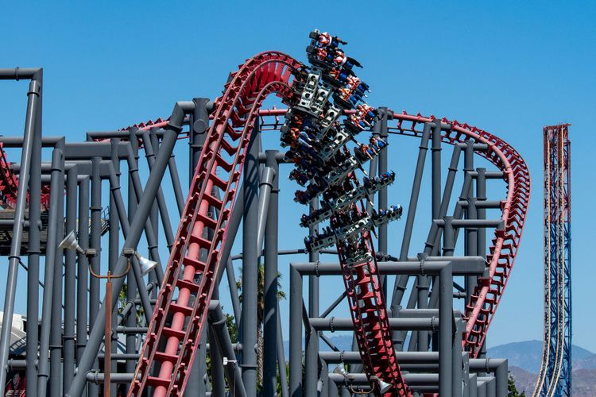
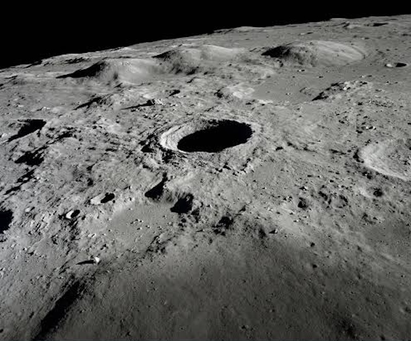
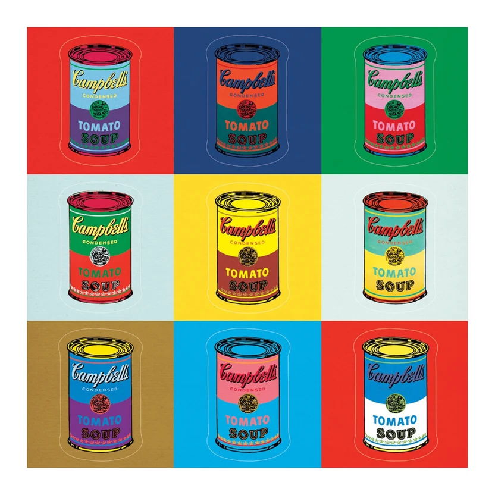

## Editor's Words

I added “*Dark Mode*” based on the feedback from a friend, who has three kids and sometimes receives the Sunday Blender issues in the evening hours when the phone goes dark. Let me know how the new mode looks on your phone. It is a very helpful tip.

This newsletter’s continuous improvement rests on your feedback and suggestions. Please give me a yell, or drop a note in the email, or leave a comment on the website, to help me improve its content and reach out to more readers who are curious about global affairs and enjoy reading.

Also, you can now watch/listen to TSB on its podcast channel on Youtube: 

[https://www.youtube.com/playlist?list=PLcRJg9AlaYT4](https://www.youtube.com/playlist?list=PLcRJg9AlaYT4)

I’ll be out of town next week on a cycling trip. TSB will skip the Oct 11 issue and return on Oct 18 (by then, no more No. 10 of Messi in Argentina). 

## Tech

**SpaceX**'s **Starship**, the largest and most powerful rocket ever built, reached orbit for the first time on September 28. On its first 13 test flights, the `124-meter` rocket followed paths that brought it back down before it could circle the Earth. This time, its upper stage completed about two orbits and released `26` **Starlink** V3 satellites, a new, larger generation of SpaceX's internet satellites that are too big for the company's **Falcon 9** rocket. One engine on the booster and one on the upper stage shut down early during the climb to space. Because of the upper stage's engine problem, SpaceX brought it home after about three hours instead of the planned six orbits, and it splashed down in the Pacific Ocean. It was still the first Starship flight to put satellites into orbit for long-term use, and the first to earn money for the company. **NASA** plans to use a version of Starship to land astronauts on the Moon, but SpaceX first has to show it can refuel Starship in orbit and land one on the Moon without a crew. NASA has also picked **Blue Origin** to build a second lunar lander.

A new kind of AI tool, the **personal agent**, is spreading fast. It works like a human assistant: it has its own computer, keeps track of its owner's details and carries out jobs from start to finish. Instead of opening separate apps to book a table or buy tickets, users simply ask the agent, and it does the booking and buying itself. In August, **SpaceXAI**, **Elon Musk**'s AI company, launched **Grok Bot** in beta: agents that share a cloud computer and work across websites, apps and email. That same month, a San Francisco startup called **Instinct** launched an invite-only text agent. In September, it added Instinct Concierge, which can call businesses, and on September 28 investors valued Instinct at `$10 billion` after a `$1 billion` round. **Meta** launched its agent, **Muse**, on September 8, with a free version and paid plans, and by September 18 it was the top free iPhone app in the United States. China's tech giants are moving in too. On September 22, **Alibaba**'s **Qwen** team said it would speed up work on a personal agent aimed at more than `300 million` users. **Tencent** has been testing an assistant called **Xiaowei** inside **WeChat** since June, and **ByteDance** is reportedly testing one of its own. The race is still at an early stage, and not every company is welcoming it: **Amazon** has blocked Muse from shopping on its site.

## Global

Millions of people in **China** are on the move this week. China's **Golden Week** holiday runs from October 1 to 7, and this year the **Mid-Autumn Festival** fell days before it. By taking three days off work, people could join the two holidays into one 13-day break. More than half of the overseas flights booked on the travel site **Trip.com** left before Golden Week began. With extra time, travelers are going farther and visiting several places in one trip, pairing cities like **Amsterdam** and **Milan** or **Hong Kong** and **Sydney**. **Seoul** is the most popular overseas destination. Bookings are growing fastest among travelers aged 18 to 24, and **New Zealand**, known for its natural scenery, is a rising favorite: flights to Queenstown are more than four times last year's level. China's border agency expected more than `2.4 million` people to pass through its checkpoints on the holiday's busiest day.

**Six Flags** Magic Mountain in **California** has permanently closed **X2**, a famous roller coaster, after riders said it injured their brains. X2 is called a 4D coaster because its seats spin forward and backward on their own while the train drops `215` feet, about `66` meters. In July, two women collapsed after riding it six days apart, and both needed emergency surgery for bleeding in the brain. Doctors who treated them said the ride's sudden speeding up and slowing down caused the injuries. The ride has been shut down since. A **CNN** investigation found more than a dozen reports of serious injuries linked to X2 going back over `ten` years, including at least two deaths. Lawyers say more than `100` riders claim brain injuries from the ride, and three have already sued. Six Flags says X2 passed many safety tests, but it decided closing the ride was the right thing to do.

## Economy & Finance

The chip maker **AMD** has agreed to buy the artificial intelligence company **World Labs** for `$8.2` billion, paying with its own shares instead of cash. World Labs was co-founded by **Fei-Fei Li**, a computer science professor at **Stanford University** who ran the school's artificial intelligence lab from 2013 to 2018. She is best known for **ImageNet**, a collection of millions of labeled photos that helped teach computers to recognize what is in a picture. Her company builds "world models," AI that can create 3D spaces from text, photos, or video. One of its tools, **Marble**, can build a 3D scene out of just a few images. World Labs also makes tools for training robots in simulated worlds. AMD says studying this kind of AI will help it design better chips for it.

**Manchester City**, the only club to win England's **Premier League** four seasons in a row, has been found guilty of breaking the league's money rules for nearly a decade. The rules are meant to stop clubs from spending far more than they earn. On September 29, the Premier League said an independent panel had found City guilty of `114` charges. The panel found that City used "sham" sponsorship deals: some sponsors paid less than their contracts said, and the club's owners made up the difference. According to the league, this made City's finances look about `$1.2 billion` healthier than they really were. City says it is innocent and plans to appeal. Its punishment will be decided at a separate hearing and could range from a fine to a points deduction or even removal from the league. Rival clubs **Arsenal**, **Liverpool**, **Manchester United** and **Tottenham** are preparing to ask City for compensation, arguing that its rule-breaking helped it beat them to places in European competitions, which bring in large amounts of prize money. The case also raises questions about City's biggest star, **Erling Haaland**. In January 2025, he signed a nine-and-a-half-year contract, the longest in Premier League history and reportedly worth more than **$300 million**. At the time, he said the charges did not worry him.

## Nature & Environment

The **Atacama Desert** in **Chile**, considered the driest desert on Earth, is covered in flowers again. The event, called the "**flowering desert**," does not happen every year. Researchers at the Pontifical Catholic University of Chile counted about `15` blooms in the past `40` years. It happens only when enough rain falls to wake seeds and bulbs that can lie underground for years, and that rain often comes during **El Niño**, a natural climate pattern that warms the Pacific Ocean and brings more rain to the region. This winter, more than `150 millimeters` of rain fell along the coast near the town of Huasco. At its fullest, the bloom can include more than `200` kinds of plants, most of which grow nowhere else. Moisés Grimber, who runs Llanos de Challe National Park, expects the bloom to peak starting this weekend and to last through October, possibly into November. Last year's flowering led to the discovery of two new plant species.

**Australian crayfish** are being harvested on the edge of China's **Taklamakan Desert**. In Makit County, near the city of **Kashgar** in **Xinjiang**, a farm is shipping `200` to `300` kilograms of red-clawed freshwater crayfish a day and expects about `8 tonnes` this year. The area gets less than `100 millimeters` of rain a year, but rivers fed by melting snow and glaciers in the **Kunlun Mountains** supply clean fresh water, and these crayfish do not need seawater. The farm started in 2022, when a team of experts from **Shandong**, a province on China's east coast, brought the idea west. On salty land, they mixed river water with water pumped from deep underground to get the right conditions, and workers can now drain ponds, feed the crayfish, and filter the water from a phone. The baby crayfish are trucked about `2,000 kilometers` from **Anhui** province in oxygen-filled bags. Nearby farms are harvesting crabs too.

## Science

A secret letter sent on **Napoleon**'s orders in 1809 has been read for the first time, after `217` years. It went to General Auguste de Marmont, whose troops were cut off in what is now **Croatia**. The letter was in code: 24 rows of numbers, letters, and about seventy made-up symbols, with several different signs for the same letter to make it harder to crack. The key was lost, and the letter sat on lists of unsolved codes for decades. **Carter Church**, an American engineer who had never broken a code before, gave a scan of it to **OpenAI**'s new AI model, **GPT-6 Astra**. In about six hours, the AI read every symbol and worked out the key. The letter told Marmont where the French armies and their allies stood, two weeks before Austria invaded Bavaria. A code expert has checked the solution and marked it solved.

**NASA** has picked a team to find out whether a hole on the **Moon** leads to a hidden cave. The hole, called the **Marius Hills** pit, is roughly `50` to `60` meters across and about `40` meters deep. Scientists think it may be a skylight into a lava tube, a tunnel left behind when lava flowed underground and drained away. Radar from a Japanese spacecraft suggests an empty space more than `75` meters tall lies below. Gravity measurements hint at something bigger: researchers at **Purdue University** said a tube would need to be at least `1 kilometer` tall and wide for those measurements to notice it, and the gravity signal may stretch for about `60 kilometers`. The project, **GIMLI**, short for Geophysical Instruments for Marius Lunar pit Investigation, shares its name with the dwarf in "**The Lord of the Rings**" who becomes lord of a great system of caves. A lander and rover will carry radar, vibration sensors, and a gravity detector to the pit. If GIMLI confirms a cave, NASA says it could change how future homes on the Moon are planned, since caves could shield astronauts from extreme temperatures, radiation, and micrometeoroids, tiny specks of space rock.

## Math

A **Rubik's Cube** can be solved by turning it into a map. Picture every arrangement of the cube as a dot, and draw a line between two dots whenever a single twist changes one into the other. Mathematicians call this kind of map a **graph**, and its study **graph theory**. Every dot connects to `18` others, because each of the six faces can be turned three ways: a quarter turn either direction, or a half turn. Solving the cube means finding the shortest route from a scrambled dot to the one solved dot. The cube has about `43 quintillion` arrangements, a 43 with 18 zeros. In 2010, four researchers used computers lent by **Google** to check every one, and proved that no arrangement needs more than `20` moves. That limit is known as **God's Number**. Most scrambles can be solved in `17` or `18` moves.

How do you split the water into three equal 5L?

## Lifestyle, Entertainment & Culture

**Metallica** has sold more than `163` million albums since forming in 1981, making it one of the most successful bands in history. All four members are now in their 60s and still playing loud, fast heavy metal. This month the band started a "residency" at the **Sphere** in **Las Vegas**, which means that instead of touring from city to city, it stays in one place and plays `24` shows there through March 2027. Fans can hear hits like "**Enter Sandman**," "**Nothing Else Matters**" and "**Master of Puppets**," with a different song list each Thursday and Saturday. The Sphere is a giant ball-shaped venue whose inside is covered by a screen that curves up, over, and around the crowd, so the pictures surround fans on every side. It also has sound built to reach every seat clearly and "4D" effects that go beyond sight and sound. On opening night, rows of falling hammers filled the screen in time with the song "**Sad but True**."

**Los Angeles** has a new museum dedicated to art that tells a story. **The Lucas Museum of Narrative Art** opened on September 22, founded by **Star Wars** creator **George Lucas** and his wife, businesswoman Mellody Hobson. It shows the kind of art many traditional museums leave out, like comics and illustrations, alongside paintings by famous artists such as **Norman Rockwell**, **Frida Kahlo** and **Andy Warhol**. There are also galleries for sports, science fiction, anime, and children's art. The opening exhibit, "**Star Wars in Motion**," includes **Luke Skywalker**'s landspeeder and speeder bikes from "**Return of the Jedi**." The museum's chief executive says Star Wars fills only `7%` of the museum. The museum draws on more than `40,000` works Lucas has collected over `50` years. The white, curving building, designed by Chinese architect **Ma Yansong**, looks like a spaceship and is covered in `1,500` panels, each a different shape.

## Sports

**Lionel Messi** will play his last game for **Argentina** on Tuesday, **October 6**, in a friendly against Benin at the Monumental stadium in **Buenos Aires**. Argentina's football association invited him back for one more home game so fans could say goodbye. All of the roughly `85,000` tickets sold out in under two hours. That will be a bigger crowd than this year's **Super Bowl**. The association also invited every player from Argentina's 2022 World Cup-winning team, along with their families. **Ángel Di María**, who scored in that final and left the national team in 2024, will be there, as will goalkeeper **Franco Armani**. Messi has scored `125` goals for Argentina, a national record. Only Portugal's **Cristiano Ronaldo**, with `146` goals, has scored more for a national team in men's football. With Argentina, he won the **2022 World Cup**, two **Copa América** titles and an **Olympic** gold medal.

**Cristiano Ronaldo**, Portugal's longtime captain and the top goal scorer in men's international football, has walked out of his national team's training camp. On September 27, Portugal beat Norway `2-1`, and although new coach Jorge Jesus had indicated he might bring Ronaldo on late in the game, he left him unused on the bench. Three days later in Copenhagen, on the eve of a match against Denmark, Jesus told reporters that Ronaldo had been angry with him but called it "water under the bridge." Separately, he confirmed that Ronaldo would not start against Denmark. Ronaldo left the camp soon after. On Instagram, he said he made the decision after Jesus's news conference and a talk with the head of Portugal's football federation, and promised to tell "the truth" about his reasons "in due course." Ronaldo, `41`, has scored `146` goals in `234` games for Portugal. It was the first time in his `23` years with the team that he walked out of a camp, and he has not said whether he will play for Portugal again.

Ethiopian runner **Tigst Assefa** won the **Berlin Marathon** on September 27 while running on a torn Achilles tendon, the thick cord that joins the calf muscle to the heel. With 2 kilometers to go, she was running faster than the women's world record pace. Then she began to limp. Her agent says she had felt pain since the 31st kilometer and that the tendon tore completely around the 40th. She kept going, slowed sharply, and still won in 2 hours, 11 minutes and 4 seconds, almost six minutes ahead of the next runner. It was the third-fastest women's marathon ever, a new record for the Berlin course and her third win there. She collapsed after crossing the finish line, missed the medal ceremony and had surgery the next day. Her agent hopes she can start running again in about three months and race another marathon in about seven.

## This Day in History

On **October 4, 1957**, the **Soviet Union** launched **Sputnik 1**, the first object people ever sent into orbit around Earth. In Russian, its name can mean "traveling companion." It was a shiny metal ball about the size of a beach ball, with four long antennas, and it circled the planet roughly every `96` minutes. Its radio sent out a steady "beep-beep" that scientists and amateur radio fans around the world tuned in to hear. The batteries died after three weeks, and in January 1958 Sputnik fell back into the atmosphere and burned up. Its launch set off a race between the Soviet Union and the United States to explore space, and **NASA** was created a year later. Today, satellites carry our phone calls, internet, weather forecasts, and GPS directions. More than `14,000` working satellites now circle Earth, up from about `2,000` in 2019.

## Art of the Week

**Andy Warhol** was born in **Pittsburgh** in 1928 to immigrant parents and began his career in New York as a commercial artist, drawing for magazines and ads. In the 1960s he became the leading figure of **Pop Art**, a movement that took its subjects from advertising, celebrities and everyday products. Warhol painted soup cans, Coca-Cola bottles and movie stars such as **Marilyn Monroe**. He used silkscreen printing to repeat the same image again and again, and he called his studio the Factory. By treating art like a mass-produced product, he blurred the line between serious art and popular culture. The **Andy Warhol Museum** in Pittsburgh is the largest museum in the United States devoted to one artist. His signature work, "**Campbell's Soup Cans**" from 1962, is a set of 32 paintings, one for each flavor the company sold, now at **New York's Museum of Modern Art**. Warhol said he chose Campbell's because he had eaten it for lunch every day for `20` years.

## Funny

---

## Previous Issues

---

September 27, 2026, **[We Will Go To the Moon Again](https://weekly.sundayblender.com/p/we-will-go-to-the-moon-again)**

September 20, 2026, **[Tech Tourism in China Has Begun](https://weekly.sundayblender.com/p/tech-tourism-in-china-has-begun)**

September 13, 2026, **[Can Teenagers Still Read?](https://weekly.sundayblender.com/p/can-teenagers-still-read)**

---

Thanks for reading! If you enjoy this newsletter, please share it with friends who might also find it interesting and refreshing, if not for themselves, at least for their kids.

